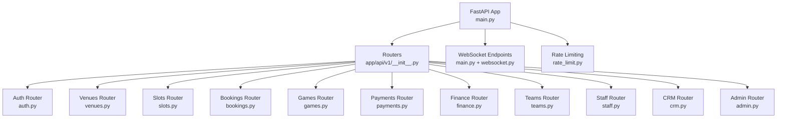
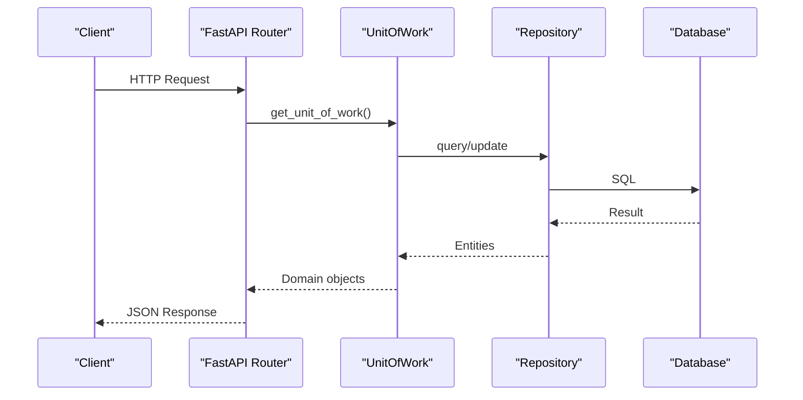
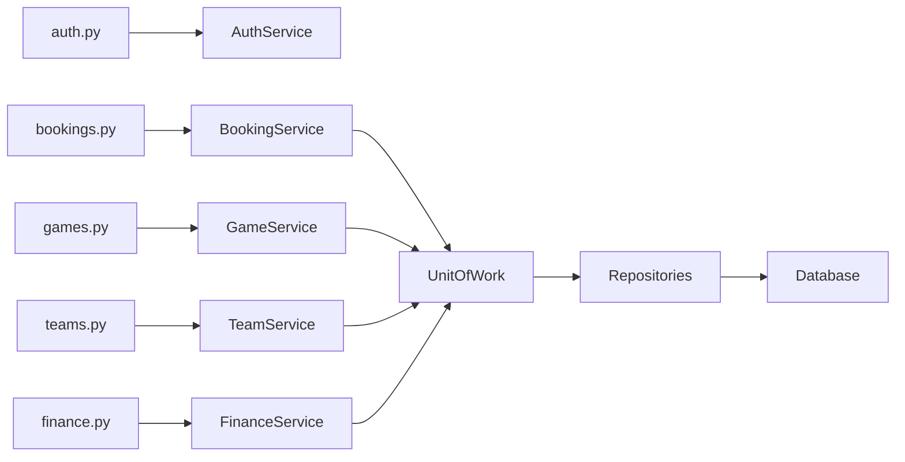
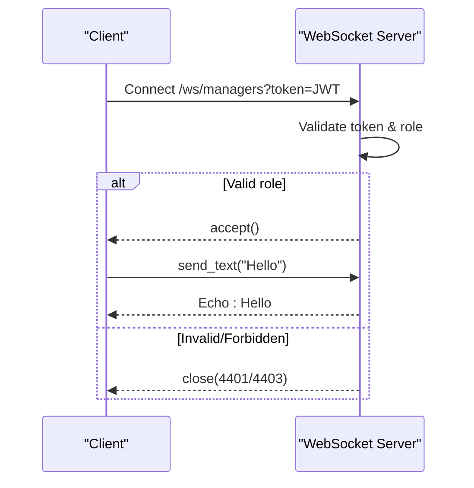

# API Reference

<cite>
**Referenced Files in This Document**
- [main.py](file://app/main.py)
- [__init__.py](file://app/api/v1/__init__.py)
- [config.py](file://app/config.py)
- [auth.py](file://app/api/v1/auth.py)
- [venues.py](file://app/api/v1/venues.py)
- [slots.py](file://app/api/v1/slots.py)
- [bookings.py](file://app/api/v1/bookings.py)
- [games.py](file://app/api/v1/games.py)
- [payments.py](file://app/api/v1/payments.py)
- [finance.py](file://app/api/v1/finance.py)
- [teams.py](file://app/api/v1/teams.py)
- [staff.py](file://app/api/v1/staff.py)
- [crm.py](file://app/api/v1/crm.py)
- [admin.py](file://app/api/v1/admin.py)
- [websocket.py](file://app/utils/websocket.py)
- [rate_limit.py](file://app/utils/rate_limit.py)
</cite>

## Table of Contents
1. Introduction
2. Project Structure
3. Core Components
4. Architecture Overview
5. Detailed Component Analysis
6. Dependency Analysis
7. Performance Considerations
8. Troubleshooting Guide
9. Conclusion
10. Appendices

## Introduction
This document provides comprehensive API documentation for the Futsal Booking System backend. It covers authentication, venue management, slots and bookings, games (group booking), payments, finance, teams, staff, CRM, and administrative endpoints. It also documents WebSocket endpoints for real-time communication, including role-based rooms and personal channels. For each endpoint, you will find HTTP methods, URL patterns, request/response schemas, authentication requirements, error responses, and rate limiting behavior.

## Project Structure
The application is a FastAPI service with modular routers under app/api/v1. Routers are mounted under /api/v1 and include authentication, venues, slots, bookings, games, payments, finance, teams, staff, CRM, and admin features. Configuration and middleware (CORS, security audit) are centralized in main.py. Rate limiting is implemented via Redis-backed dependencies.

**Diagram sources**
- [main.py:16-24](file://app/main.py#L16-L24)
- [main.py:178-200](file://app/main.py#L178-L200)
- [__init__.py:1-23](file://app/api/v1/__init__.py#L1-L23)

**Section sources**
- [main.py:51-76](file://app/main.py#L51-L76)
- [main.py:178-200](file://app/main.py#L178-L200)
- [__init__.py:1-23](file://app/api/v1/__init__.py#L1-L23)

## Core Components
- Authentication: register, login, profile, password reset, email verification; JWT-based access control.
- Venues: CRUD, verification by super admin, pricing management per slot time.
- Slots: listing, availability, generation, block/unblock controls.
- Bookings: pending workflow, confirm/reject, cancellation with refunds, receipt submission/approval/rejection, in-person collection.
- Games: create/list/explore, join/leave, invitations, waitlist, results, payment shares.
- Payments: invoice creation, mock gateway payment, user payment history.
- Finance: dashboard, revenue series/by-source, occupancy, low-demand slots, transactions CRUD, voids, categories, accounts, statements, CSV export.
- Teams: create/list/discover, members, invitations/join requests, dues, balance, bookings linkage, audit log, team chat messages.
- Staff: assign/update/remove staff per venue, permissions, security audit.
- CRM: customer list/detail/stats, campaign creation with consent limits, consent management.
- Admin: user stats, venue stats, pending venues/managers approval.
- WebSocket: role-based rooms (managers, admins) and personal channel (users).

**Section sources**
- [auth.py:57-225](file://app/api/v1/auth.py#L57-L225)
- [venues.py:65-326](file://app/api/v1/venues.py#L65-L326)
- [slots.py:15-112](file://app/api/v1/slots.py#L15-L112)
- [bookings.py:75-529](file://app/api/v1/bookings.py#L75-L529)
- [games.py:63-482](file://app/api/v1/games.py#L63-L482)
- [payments.py:42-175](file://app/api/v1/payments.py#L42-L175)
- [finance.py:81-396](file://app/api/v1/finance.py#L81-L396)
- [teams.py:36-422](file://app/api/v1/teams.py#L36-L422)
- [staff.py:53-276](file://app/api/v1/staff.py#L53-L276)
- [crm.py:61-321](file://app/api/v1/crm.py#L61-L321)
- [admin.py:23-109](file://app/api/v1/admin.py#L23-L109)
- [main.py:109-166](file://app/main.py#L109-L166)
- [websocket.py:12-66](file://app/utils/websocket.py#L12-L66)

## Architecture Overview
The system uses a layered architecture:
- API layer: FastAPI routers define endpoints, request validation, and response models.
- Service layer: Business logic encapsulated in services (e.g., GameService, TeamService, FinanceService).
- Unit of Work: Aggregates repositories to manage database transactions consistently.
- Repositories: Data access abstractions over SQLModel.
- Utilities: Auth helpers, RBAC/permissions, staff scoping, rate limiting, notifications, and WebSocket manager.

**Diagram sources**
- [main.py:16-24](file://app/main.py#L16-L24)
- [auth.py:57-101](file://app/api/v1/auth.py#L57-L101)
- [bookings.py:191-237](file://app/api/v1/bookings.py#L191-L237)

## Detailed Component Analysis

### Authentication API
- POST /api/v1/auth/register
  - Auth: None
  - Request: UserCreate (phone, full_name, password, role)
  - Response: UserResponse
  - Errors: 400 if phone exists
  - Rate limit: auth_rate_limit (5 req/min)
- POST /api/v1/auth/login
  - Auth: None
  - Request: UserLogin (phone, password)
  - Response: Token (access_token, token_type, user)
  - Errors: 401 incorrect credentials; 403 unverified venue/club admin
  - Rate limit: auth_rate_limit
- GET /api/v1/auth/me
  - Auth: Required (Bearer JWT)
  - Response: UserResponse
- POST /api/v1/auth/verify/email/request
  - Auth: None
  - Request: { phone, email }
  - Response: { message, dev_code? }
  - Rate limit: verification_rate_limit (5 req/min)
- POST /api/v1/auth/verify/email/confirm
  - Auth: None
  - Request: { phone, code }
  - Response: { message }
  - Rate limit: verification_rate_limit
- PUT /api/v1/auth/profile
  - Auth: Required
  - Request: { full_name }
  - Response: UserResponse
- POST /api/v1/auth/change-password
  - Auth: Required
  - Request: { old_password, new_password }
  - Response: { message }
- POST /api/v1/auth/forgot-password
  - Auth: None
  - Request: { phone }
  - Response: { message, dev_code? }
  - Rate limit: auth_rate_limit
- POST /api/v1/auth/reset-password
  - Auth: None
  - Request: { phone, code, new_password }
  - Response: { message }
  - Rate limit: auth_rate_limit

**Section sources**
- [auth.py:57-225](file://app/api/v1/auth.py#L57-L225)
- [rate_limit.py:67-70](file://app/utils/rate_limit.py#L67-L70)

### Venues API
- GET /api/v1/venues
  - Query: category, latitude, longitude, radius, is_verified, search, limit, offset
  - Response: List<VenueResponse> (includes min_price, average_rating, total_reviews)
- GET /api/v1/venues/my-venues
  - Auth: Venue Manager or Club Admin
  - Response: List<VenueResponse>
- GET /api/v1/venues/{venue_id}
  - Response: VenueResponse
- POST /api/v1/venues
  - Auth: Venue Manager or Club Admin
  - Request: VenueCreate (name, address, lat/lng, phone, description, amenities, images, default_slot_price, payment_mode?)
  - Response: VenueResponse
- PUT /api/v1/venues/{venue_id}
  - Auth: Owner/Manager
  - Request: VenueCreate
  - Response: VenueResponse
- POST /api/v1/venues/{venue_id}/verify
  - Auth: Super Admin
  - Response: { message }
- POST /api/v1/venues/{venue_id}/prices
  - Auth: Venue Manager/Owner
  - Request: { "HH:mm": price, ... }
  - Response: { message, updated, skipped_past }
- GET /api/v1/venues/{venue_id}/prices
  - Auth: Venue Manager/Owner
  - Response: { prices: { "HH:mm": { base_price, current_price }, ... } }

**Section sources**
- [venues.py:65-326](file://app/api/v1/venues.py#L65-L326)

### Slots API
- GET /api/v1/slots/venue/{venue_id}?slot_date=YYYY-MM-DD
  - Response: List<SlotResponse>
- GET /api/v1/slots/venue/{venue_id}/available?slot_date=YYYY-MM-DD
  - Response: List<SlotResponse>
- POST /api/v1/slots/venue/{venue_id}/generate
  - Auth: slot.generate permission (owner/super_admin/staff)
  - Request: { slot_date }
  - Response: { message }
- GET /api/v1/slots/venue/{venue_id}/range?start_date=...&end_date=...
  - Response: List<SlotResponse>
- POST /api/v1/slots/{slot_id}/block
  - Auth: slot.block permission
  - Response: SlotBlockResponse
- POST /api/v1/slots/{slot_id}/unblock
  - Auth: slot.block permission
  - Response: SlotBlockResponse

**Section sources**
- [slots.py:15-112](file://app/api/v1/slots.py#L15-L112)

### Bookings API
- GET /api/v1/bookings/pending/my
  - Auth: Required
  - Response: List<PendingBookingResponse>
- GET /api/v1/bookings/venue/{venue_id}/pending
  - Auth: booking.pending_list permission
  - Response: List<PendingBookingResponse>
- POST /api/v1/bookings/pending/{pending_id}/confirm
  - Auth: booking.confirm permission
  - Response: BookingResponse
- POST /api/v1/bookings/pending/{pending_id}/reject
  - Auth: booking.confirm permission
  - Response: { message }
- DELETE /api/v1/bookings/pending/{pending_id}
  - Auth: Owner of pending booking
  - Response: { message }
- POST /api/v1/bookings
  - Auth: Required (user must be verified)
  - Request: BookingCreate (slot_id, discount_code?, use_loyalty_points?)
  - Response: PendingBookingResponse
- GET /api/v1/bookings
  - Auth: Required
  - Response: List<BookingResponse>
- GET /api/v1/bookings/upcoming?days_ahead=N
  - Auth: Required
  - Response: List<BookingResponse>
- GET /api/v1/bookings/past?limit=N
  - Auth: Required
  - Response: List<BookingResponse>
- GET /api/v1/bookings/venue/{venue_id}?start_date=...&end_date=...
  - Auth: booking.view permission
  - Response: List<BookingResponse>
- GET /api/v1/bookings/{booking_id}
  - Auth: Owner or authorized staff/super_admin
  - Response: BookingDetailResponse (includes latest payment)
- DELETE /api/v1/bookings/{booking_id}
  - Auth: Owner
  - Response: { message, refunded, refunded_amount }
- POST /api/v1/bookings/{booking_id}/receipt
  - Auth: Owner (payment mode BANK_RECEIPT)
  - Request: { amount, image_url, reference_number?, bank_name? }
  - Response: { message, receipt_status }
- POST /api/v1/bookings/{booking_id}/receipt/approve
  - Auth: finance.record_payment permission
  - Response: { message, receipt_status, amount }
- POST /api/v1/bookings/{booking_id}/receipt/reject
  - Auth: finance.record_payment permission
  - Request: { reason }
  - Response: { message, receipt_status }
- POST /api/v1/bookings/{booking_id}/collect-in-person
  - Auth: finance.record_payment + booking.confirm permissions
  - Request: { amount?, method }
  - Response: { message, amount }

Notes:
- Rate limit: booking_rate_limit (20 req/min) on booking creation.
- Refunds are recorded when cancelling paid bookings.

**Section sources**
- [bookings.py:75-529](file://app/api/v1/bookings.py#L75-L529)
- [rate_limit.py:67-70](file://app/utils/rate_limit.py#L67-L70)

### Games API
- POST /api/v1/games
  - Auth: Required
  - Request: GameCreate
  - Response: GameResponse
- GET /api/v1/games
  - Query: sport, skill_level, venue_id, date_from/to, time_from/to, max_price_per_player, availability_only, latitude, longitude, sort, limit, offset
  - Response: dict (explore results)
- GET /api/v1/games/my
  - Auth: Required
  - Response: List<GameResponse>
- GET /api/v1/games/invitations/my
  - Auth: Required
  - Response: List<InvitationResponse>
- POST /api/v1/games/invitations/{invitation_id}/accept
  - Auth: Required
  - Response: GameActionResponse
- POST /api/v1/games/invitations/{invitation_id}/reject
  - Auth: Required
  - Response: dict
- GET /api/v1/games/join/{token}
  - Auth: Optional (get_optional_user)
  - Response: TokenPreviewResponse
- POST /api/v1/games/join/{token}
  - Auth: Required
  - Response: GameActionResponse
- GET /api/v1/games/{game_id}
  - Auth: Optional
  - Response: GameResponse
- PATCH /api/v1/games/{game_id}
  - Auth: Required
  - Request: GameUpdate
  - Response: GameResponse
- DELETE /api/v1/games/{game_id}
  - Auth: Required (organizer)
  - Response: GameResponse
- POST /api/v1/games/{game_id}/start
  - Auth: Required
  - Response: GameResponse
- POST /api/v1/games/{game_id}/complete
  - Auth: Required
  - Response: GameResponse
- POST /api/v1/games/{game_id}/result
  - Auth: Required (organizer/manager)
  - Request: GameResultRequest
  - Response: GameResultResponse
- POST /api/v1/games/{game_id}/join
  - Auth: Required
  - Response: GameActionResponse
- POST /api/v1/games/{game_id}/leave
  - Auth: Required
  - Response: GameActionResponse
- GET /api/v1/games/{game_id}/participants
  - Auth: Optional
  - Response: List<ParticipantResponse>
- PATCH /api/v1/games/{game_id}/participants/{user_id}
  - Auth: Required
  - Request: ParticipantUpdate
  - Response: ParticipantResponse
- DELETE /api/v1/games/{game_id}/participants/{user_id}
  - Auth: Required
  - Response: GameActionResponse
- GET /api/v1/games/{game_id}/join-requests
  - Auth: Required
  - Response: List<JoinRequestResponse>
- POST /api/v1/games/{game_id}/join-requests/{request_id}/approve
  - Auth: Required
  - Response: GameActionResponse
- POST /api/v1/games/{game_id}/join-requests/{request_id}/reject
  - Auth: Required
  - Response: GameActionResponse
- POST /api/v1/games/{game_id}/invitations
  - Auth: Required
  - Request: InvitationCreate
  - Response: InvitationResponse
- GET /api/v1/games/{game_id}/invitations
  - Auth: Required (manage permission)
  - Response: List<InvitationResponse>
- POST /api/v1/games/{game_id}/invite-links
  - Auth: Required
  - Request: InviteLinkCreate
  - Response: InviteLinkResponse
- GET /api/v1/games/{game_id}/invite-links
  - Auth: Required
  - Response: List<InviteLinkResponse>
- POST /api/v1/games/{game_id}/invite-links/{link_id}/disable
  - Auth: Required
  - Response: InviteLinkResponse
- POST /api/v1/games/{game_id}/invite-links/{link_id}/regenerate
  - Auth: Required
  - Response: InviteLinkResponse
- GET /api/v1/games/{game_id}/waitlist
  - Auth: Required
  - Response: List<WaitlistResponse>
- POST /api/v1/games/{game_id}/waitlist
  - Auth: Required
  - Response: WaitlistResponse
- DELETE /api/v1/games/{game_id}/waitlist
  - Auth: Required
  - Response: dict
- GET /api/v1/games/{game_id}/payments
  - Auth: Required
  - Response: GamePaymentSummary
- POST /api/v1/games/{game_id}/payments/remind
  - Auth: Required (cooldown 1 minute)
  - Response: { sent }
- POST /api/v1/games/{game_id}/payments/{participant_id}/pay
  - Auth: Required
  - Response: dict

**Section sources**
- [games.py:63-482](file://app/api/v1/games.py#L63-L482)

### Payments API
- POST /api/v1/payments
  - Auth: Required
  - Request: PaymentCreate (booking_id)
  - Response: PaymentResponse (status=PENDING)
  - Rate limit: payment_rate_limit (10 req/min)
- POST /api/v1/payments/{payment_id}/pay
  - Auth: Required
  - Request: PaymentPayRequest (card_number)
  - Response: PaymentResponse (status=PAID)
  - Rate limit: payment_rate_limit
- GET /api/v1/payments/my?limit=N&offset=M
  - Auth: Required
  - Response: List<PaymentResponse>

Notes:
- Mock gateway validates card number length and digits; records income via FinanceService.

**Section sources**
- [payments.py:42-175](file://app/api/v1/payments.py#L42-L175)
- [rate_limit.py:67-70](file://app/utils/rate_limit.py#L67-L70)

### Finance API
- GET /api/v1/finance/dashboard?from=&to=&venue_id=
  - Auth: Required (view codes)
  - Response: DashboardResponse
- GET /api/v1/finance/revenue/series?group_by={day|venue|hour|weekday}&from=&to=&venue_id=
  - Auth: Required (view codes)
  - Response: SeriesResponse
- GET /api/v1/finance/revenue/by-source?from=&to=&venue_id=
  - Auth: Required (view codes)
  - Response: RevenueBySourceResponse
- GET /api/v1/finance/occupancy?from=&to=&venue_id=
  - Auth: Required (view codes)
  - Response: OccupancyResponse
- GET /api/v1/finance/low-demand-slots?from=&to=&venue_id=&threshold=
  - Auth: Required (view codes)
  - Response: List<LowDemandSlot>
- GET /api/v1/finance/transactions?type=&direction=&status=&source_type=&source_id=&counterparty=&limit=&offset=&venue_id=
  - Auth: Required (view codes)
  - Response: TransactionListResponse
- POST /api/v1/finance/transactions
  - Auth: Required (record_payment or expense.create or manage)
  - Request: TransactionCreate
  - Response: TransactionResponse
- GET /api/v1/finance/transactions/{tx_id}
  - Auth: Required (venue-scoped view)
  - Response: TransactionResponse
- POST /api/v1/finance/transactions/{tx_id}/void
  - Auth: Required (manage)
  - Request: TransactionVoidRequest
  - Response: TransactionResponse
- GET /api/v1/finance/expense-categories?include_inactive=
  - Auth: Required (view codes)
  - Response: List<ExpenseCategoryResponse>
- POST /api/v1/finance/expense-categories
  - Auth: Required (expense.create/manage)
  - Request: ExpenseCategoryCreate
  - Response: ExpenseCategoryResponse
- PUT /api/v1/finance/expense-categories/{category_id}
  - Auth: Required (manage)
  - Request: ExpenseCategoryUpdate
  - Response: ExpenseCategoryResponse
- DELETE /api/v1/finance/expense-categories/{category_id}
  - Auth: Required (manage)
  - Response: { message }
- GET /api/v1/finance/accounts?kind=all|debtors|creditors&limit=&offset=&venue_id=
  - Auth: Required (receivables view)
  - Response: AccountListResponse
- GET /api/v1/finance/accounts/{user_id}/statement?from=&to=&venue_id=
  - Auth: Required (receivables view)
  - Response: AccountStatementResponse
- POST /api/v1/finance/accounts/{user_id}/payments
  - Auth: Required (record_payment)
  - Request: AccountPaymentCreate
  - Response: TransactionResponse
- GET /api/v1/finance/export?format=csv&filters...
  - Auth: Required (manage)
  - Response: CSV file

**Section sources**
- [finance.py:81-396](file://app/api/v1/finance.py#L81-L396)

### Teams API
- POST /api/v1/team
  - Auth: Required
  - Request: TeamCreate
  - Response: TeamResponse
- GET /api/v1/teams
  - Auth: Required
  - Response: List<TeamResponse>
- GET /api/v1/teams/discover?search=&sport=&limit=&offset=
  - Auth: Required
  - Response: TeamListResponse
- GET /api/v1/teams/invitations/me
  - Auth: Required
  - Response: List<TeamInvitationResponse>
- GET /api/v1/teams/manager/partners?venue_id=
  - Auth: Venue Manager
  - Response: dict
- GET /api/v1/teams/{team_id}
  - Auth: Required
  - Response: TeamResponse
- PUT /api/v1/teams/{team_id}
  - Auth: Required
  - Request: TeamUpdate
  - Response: TeamResponse
- POST /api/v1/teams/{team_id}/deactivate
  - Auth: Captain
  - Response: dict
- GET /api/v1/teams/{team_id}/members
  - Auth: Required
  - Response: List<TeamMemberResponse>
- POST /api/v1/teams/{team_id}/invite
  - Auth: Required
  - Request: TeamInviteCreate
  - Response: dict
- POST /api/v1/teams/{team_id}/invitations/{member_id}/accept
  - Auth: Required
  - Response: TeamActionResponse
- POST /api/v1/teams/{team_id}/invitations/{member_id}/decline
  - Auth: Required
  - Response: TeamActionResponse
- POST /api/v1/teams/{team_id}/members/{member_id}/remove
  - Auth: Required
  - Response: TeamActionResponse
- POST /api/v1/teams/{team_id}/members/{member_id}/role
  - Auth: Required
  - Request: TeamRoleUpdate
  - Response: TeamMemberResponse
- POST /api/v1/teams/{team_id}/leave
  - Auth: Required
  - Response: TeamActionResponse
- POST /api/v1/teams/{team_id}/transfer-captain
  - Auth: Required
  - Request: TeamTransferCaptain
  - Response: TeamResponse
- POST /api/v1/teams/{team_id}/join-request
  - Auth: Required
  - Request: TeamJoinRequestCreate
  - Response: dict
- GET /api/v1/teams/{team_id}/join-requests
  - Auth: Required
  - Response: List<TeamJoinRequestResponse>
- POST /api/v1/teams/{team_id}/join-requests/{request_id}/approve
  - Auth: Required
  - Response: TeamActionResponse
- POST /api/v1/teams/{team_id}/join-requests/{request_id}/reject
  - Auth: Required
  - Response: TeamActionResponse
- GET /api/v1/teams/{team_id}/dues?status=&limit=&offset=
  - Auth: Required
  - Response: TeamDuesListResponse
- POST /api/v1/teams/{team_id}/dues/generate
  - Auth: Required
  - Request: TeamDuesGenerate
  - Response: dict
- POST /api/v1/teams/{team_id}/dues/{due_id}/pay
  - Auth: Required
  - Request: TeamDuesPayRequest
  - Response: dict
- DELETE /api/v1/teams/{team_id}/dues/{due_id}?reason=
  - Auth: Required
  - Response: dict
- GET /api/v1/teams/{team_id}/balance
  - Auth: Required
  - Response: TeamBalanceResponse
- GET /api/v1/teams/{team_id}/bookings?limit=&offset=
  - Auth: Required
  - Response: TeamBookingListResponse
- POST /api/v1/teams/{team_id}/bookings/{booking_id}/link
  - Auth: Required
  - Response: dict
- GET /api/v1/teams/{team_id}/audit?limit=&offset=
  - Auth: Required (manager only)
  - Response: TeamAuditListResponse
- GET /api/v1/teams/{team_id}/messages?limit=&before_id=
  - Auth: Required
  - Response: TeamMessageListResponse
- POST /api/v1/teams/{team_id}/messages
  - Auth: Required
  - Request: TeamMessageCreate
  - Response: TeamMessageItem
- POST /api/v1/teams/{team_id}/messages/read
  - Auth: Required
  - Response: TeamUnreadCountResponse
- GET /api/v1/teams/{team_id}/unread-count
  - Auth: Required
  - Response: TeamUnreadCountResponse

**Section sources**
- [teams.py:36-422](file://app/api/v1/teams.py#L36-L422)

### Staff API
- POST /api/v1/staff
  - Auth: staff.manage permission
  - Request: StaffCreate (phone, position, permissions?)
  - Response: StaffRow
- GET /api/v1/staff?venue_id=&include_inactive=
  - Auth: staff.manage permission
  - Response: List<StaffRow>
- GET /api/v1/staff/me
  - Auth: Required
  - Response: List<StaffMeRow>
- PUT /api/v1/staff/{assignment_id}
  - Auth: staff.manage permission
  - Request: StaffUpdate
  - Response: StaffRow
- DELETE /api/v1/staff/{assignment_id}
  - Auth: staff.manage permission
  - Response: { message, id }
- GET /api/v1/staff/audit?venue_id=&action=&limit=&offset=
  - Auth: staff.audit or owner/super_admin
  - Response: StaffAuditListResponse

**Section sources**
- [staff.py:53-276](file://app/api/v1/staff.py#L53-L276)

### CRM API
- GET /api/v1/crm/customers?venue_id=&search=&is_vip=&tag=&segment=&status=&sort=&limit=&offset=
  - Auth: crm.view or customer.view_basic (venue-scoped)
  - Response: { items, total, limit, offset }
- GET /api/v1/crm/customers/{user_id}?venue_id=
  - Auth: read codes (venue-scoped)
  - Response: { customer, recent_bookings, recent_payments, statement, venue_customer }
- PUT /api/v1/crm/customers/{user_id}?venue_id=
  - Auth: crm.manage (venue-scoped)
  - Request: CrmCustomerUpdate
  - Response: row
- GET /api/v1/crm/stats?venue_id=
  - Auth: read codes (venue-scoped)
  - Response: stats
- POST /api/v1/crm/campaigns
  - Auth: crm.manage (venue-scoped)
  - Request: CampaignCreate
  - Response: { campaign_id, sent_count, skipped_no_consent }
  - Notes: Daily limit per venue enforced; sends in-app notifications of type crm_campaign
- GET /api/v1/crm/campaigns?venue_id=&limit=&offset=
  - Auth: read codes (venue-scoped)
  - Response: { items, total }
- GET /api/v1/crm/consent
  - Auth: Required
  - Response: { marketing_consent, notify_deals, venues_with_consent }
- PUT /api/v1/crm/consent
  - Auth: Required
  - Request: ConsentUpdate
  - Response: { marketing_consent, updated }

**Section sources**
- [crm.py:61-321](file://app/api/v1/crm.py#L61-L321)

### Admin API
- GET /api/v1/admin/users
  - Auth: Super Admin
  - Response: List of public user info
- GET /api/v1/admin/stats/users
  - Auth: Super Admin
  - Response: user statistics
- GET /api/v1/admin/stats/venues
  - Auth: Super Admin
  - Response: { total_venues, verified_venues, pending_venues }
- GET /api/v1/admin/pending-venues
  - Auth: Super Admin
  - Response: pending venues
- POST /api/v1/admin/verify-venue/{venue_id}
  - Auth: Super Admin
  - Response: { message }
- GET /api/v1/admin/pending-managers
  - Auth: Super Admin
  - Response: List of pending managers
- POST /api/v1/admin/users/{user_id}/approve
  - Auth: Super Admin
  - Response: { message }
- POST /api/v1/admin/users/{user_id}/reject
  - Auth: Super Admin
  - Response: { message }

**Section sources**
- [admin.py:23-109](file://app/api/v1/admin.py#L23-L109)

### WebSocket Endpoints
- WS /ws/{role}?token=<JWT>
  - Rooms: managers (venue_manager, club_admin), admins (super_admin)
  - Behavior: Accepts connection, echoes text messages, disconnects on close
  - Errors: 4401 invalid/missing/expired token; 4403 forbidden role
- WS /ws/user/{user_id}?token=<JWT>
  - Personal channel for the authenticated user (or super_admin monitoring)
  - Behavior: Echoes text messages, disconnects on close
  - Errors: 4401 invalid/missing/expired token; 4403 not owner

Integration notes:
- Use the same JWT issued by /api/v1/auth/login.
- The server enforces role-based room access and verifies ownership for personal channels.

**Section sources**
- [main.py:109-166](file://app/main.py#L109-L166)
- [websocket.py:12-66](file://app/utils/websocket.py#L12-L66)

## Dependency Analysis
- Routers depend on services and unit of work for business logic and data access.
- Permissions and staff scoping are enforced via ensure_venue_permission and staff_scoped_access.
- Rate limiting is applied via Redis-backed dependencies for sensitive endpoints.
- Notifications are dispatched asynchronously after state-changing operations.

**Diagram sources**
- [auth.py:57-101](file://app/api/v1/auth.py#L57-L101)
- [bookings.py:191-237](file://app/api/v1/bookings.py#L191-L237)
- [games.py:63-71](file://app/api/v1/games.py#L63-L71)
- [teams.py:36-44](file://app/api/v1/teams.py#L36-L44)
- [finance.py:81-94](file://app/api/v1/finance.py#L81-L94)

**Section sources**
- [bookings.py:191-237](file://app/api/v1/bookings.py#L191-L237)
- [games.py:63-71](file://app/api/v1/games.py#L63-L71)
- [teams.py:36-44](file://app/api/v1/teams.py#L36-L44)
- [finance.py:81-94](file://app/api/v1/finance.py#L81-L94)

## Performance Considerations
- Avoid N+1 queries by batching entity loads (e.g., enriching bookings and venues in batches).
- Use pagination parameters where available (limit/offset) to reduce payload size.
- Leverage venue-scoped queries to minimize data exposure and improve performance.
- Rate limiting protects high-frequency endpoints; clients should implement backoff on 429 responses.

[No sources needed since this section provides general guidance]

## Troubleshooting Guide
Common errors and handling:
- 400 Bad Request: Validation failures, invalid transitions, or business rule violations (e.g., cannot cancel past slots, already paid).
- 401 Unauthorized: Missing or invalid JWT token.
- 403 Forbidden: Insufficient permissions or wrong venue scope.
- 404 Not Found: Resource does not exist.
- 429 Too Many Requests: Exceeded rate limit; retry after seconds indicated in Retry-After header.
- WebSocket 4401/4403: Invalid token or insufficient role for room access.

Operational tips:
- Check CORS settings if browser requests fail.
- Ensure Redis is reachable for rate limiting; otherwise, requests degrade gracefully without blocking.
- Use /health to verify database connectivity and service status.

**Section sources**
- [rate_limit.py:42-63](file://app/utils/rate_limit.py#L42-L63)
- [main.py:169-175](file://app/main.py#L169-L175)
- [main.py:84-126](file://app/main.py#L84-L126)

## Conclusion
The Futsal Booking System exposes a comprehensive set of REST APIs covering authentication, venues, slots, bookings, games, payments, finance, teams, staff, CRM, and administration. Endpoints are secured with JWT and fine-grained permissions, with robust rate limiting and clear error semantics. WebSocket endpoints provide real-time messaging for role-based rooms and personal channels. Clients should follow the documented request/response schemas, handle errors appropriately, and respect rate limits and pagination.

[No sources needed since this section summarizes without analyzing specific files]

## Appendices

### Authentication and Authorization
- All protected endpoints require a valid Bearer JWT obtained from /api/v1/auth/login.
- Role-based access:
  - USER: limited actions; requires verification for bookings.
  - VENUE_MANAGER / CLUB_ADMIN: venue-scoped management.
  - SUPER_ADMIN: global access.
- Permission codes used across modules include booking.*, finance.*, slot.*, staff.*, crm.*; see individual endpoints for required codes.

**Section sources**
- [auth.py:82-101](file://app/api/v1/auth.py#L82-L101)
- [bookings.py:22-28](file://app/api/v1/bookings.py#L22-L28)
- [staff.py:53-116](file://app/api/v1/staff.py#L53-L116)
- [crm.py:41-42](file://app/api/v1/crm.py#L41-L42)

### Rate Limits Summary
- Authentication endpoints: 5 requests per minute per IP/path.
- Verification endpoints: 5 requests per minute per IP/path.
- Booking creation: 20 requests per minute per IP/path.
- Payment endpoints: 10 requests per minute per IP/path.

**Section sources**
- [rate_limit.py:67-70](file://app/utils/rate_limit.py#L67-L70)

### WebSocket Integration Example

**Diagram sources**
- [main.py:109-126](file://app/main.py#L109-L126)
- [websocket.py:22-24](file://app/utils/websocket.py#L22-L24)