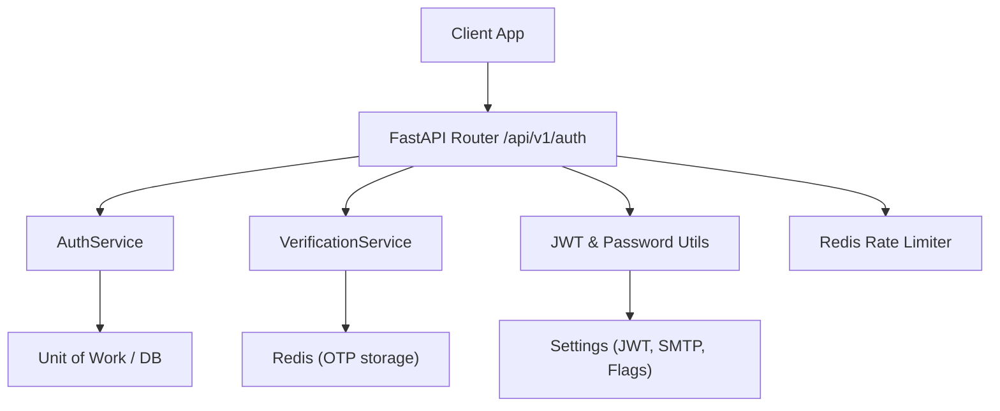
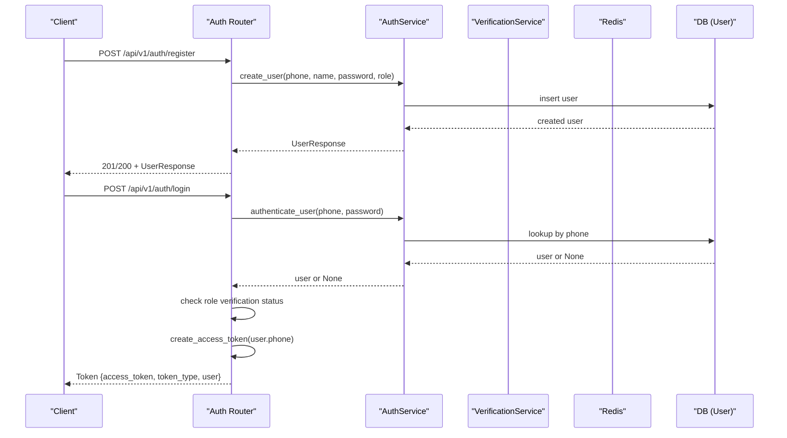
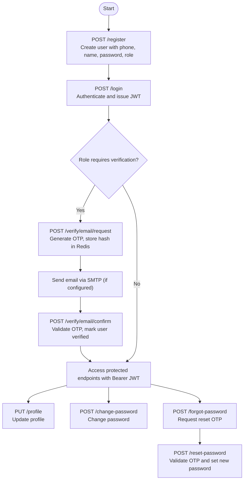
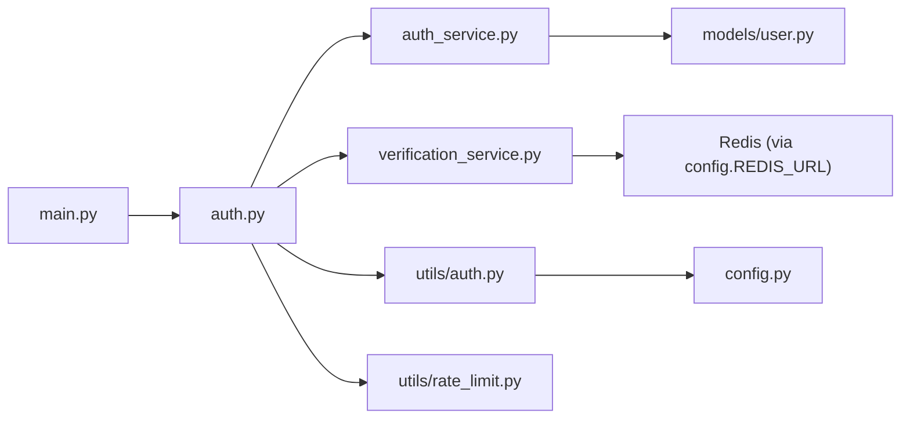

# Authentication API

<cite>
**Referenced Files in This Document**
- [auth.py](file://app/api/v1/auth.py)
- [auth_service.py](file://app/services/auth_service.py)
- [user.py (schemas)](file://app/schemas/user.py)
- [user.py (model)](file://app/models/user.py)
- [auth.py (utils)](file://app/utils/auth.py)
- [verification_service.py](file://app/services/verification_service.py)
- [rate_limit.py](file://app/utils/rate_limit.py)
- [config.py](file://app/config.py)
- [main.py](file://app/main.py)
</cite>

## Table of Contents
1. Introduction
2. Project Structure
3. Core Components
4. Architecture Overview
5. Detailed Component Analysis
6. Dependency Analysis
7. Performance Considerations
8. Troubleshooting Guide
9. Conclusion
10. Appendices

## Introduction
This document provides comprehensive API documentation for the Authentication endpoints of the Futsal Booking System. It covers user registration, login, profile management, password reset, and email verification. For each endpoint, it specifies HTTP methods, URL patterns, request/response schemas, authentication requirements, error responses, and rate limiting. It also includes practical examples of the user registration flow, JWT token handling, role-based access control, and security considerations across the complete authentication lifecycle from account creation to verification.

## Project Structure
The authentication functionality is implemented as a FastAPI router under app/api/v1/auth.py and integrates with:
- Services: AuthService for user creation/authentication and VerificationService for OTP/email flows
- Utilities: JWT and password hashing utilities, RBAC helpers, and Redis-backed rate limiters
- Schemas and Models: Pydantic request/response models and SQLModel user entity
- Configuration: JWT settings, SMTP, and feature flags

**Diagram sources**
- [auth.py:1-225](file://app/api/v1/auth.py#L1-L225)
- [auth_service.py:1-34](file://app/services/auth_service.py#L1-L34)
- [verification_service.py:1-116](file://app/services/verification_service.py#L1-L116)
- [auth.py (utils):1-113](file://app/utils/auth.py#L1-L113)
- [rate_limit.py:1-86](file://app/utils/rate_limit.py#L1-L86)
- [config.py:1-69](file://app/config.py#L1-L69)

**Section sources**
- [main.py:178-178](file://app/main.py#L178-L178)
- [auth.py:15-15](file://app/api/v1/auth.py#L15-L15)

## Core Components
- Authentication Router: Defines endpoints for register, login, me, email verification, profile update, change password, forgot/reset password.
- AuthService: Encapsulates user creation, authentication, and password change logic using Unit of Work and password utilities.
- VerificationService: Manages OTP generation, storage, and validation for email verification and password reset via Redis; optional email sending via SMTP.
- JWT and Security Utils: Token creation/decoding, Bearer dependency for current user extraction, and role-based guards.
- Rate Limiting: Redis-backed fixed-window rate limiters for auth and verification endpoints.
- Schemas and Models: Pydantic models for requests/responses and SQLModel User entity with roles and verification flags.

**Section sources**
- [auth.py:57-225](file://app/api/v1/auth.py#L57-L225)
- [auth_service.py:5-34](file://app/services/auth_service.py#L5-L34)
- [verification_service.py:21-93](file://app/services/verification_service.py#L21-L93)
- [auth.py (utils):26-113](file://app/utils/auth.py#L26-L113)
- [rate_limit.py:42-70](file://app/utils/rate_limit.py#L42-L70)
- [user.py (schemas):7-54](file://app/schemas/user.py#L7-L54)
- [user.py (model):7-34](file://app/models/user.py#L7-L34)

## Architecture Overview
The authentication system follows a layered design:
- API Layer: FastAPI endpoints validate inputs and orchestrate flows.
- Service Layer: Business logic for user operations and OTP handling.
- Utility Layer: JWT, password hashing, RBAC, and rate limiting.
- Data Layer: SQLModel User model persisted via Unit of Work; Redis for OTPs.

**Diagram sources**
- [auth.py:57-101](file://app/api/v1/auth.py#L57-L101)
- [auth_service.py:7-14](file://app/services/auth_service.py#L7-L14)
- [auth.py (utils):45-54](file://app/utils/auth.py#L45-L54)

## Detailed Component Analysis

### Endpoints Reference

#### Register
- Method: POST
- Path: /api/v1/auth/register
- Request Body: UserCreate schema
  - phone: string, pattern ^09[0-9]{9}$
  - full_name: string, min 3, max 100
  - password: string, min 4, max 70
  - role: enum, default user
- Response: UserResponse
  - id, phone, full_name, role, is_active, is_verified, created_at
- Authentication: None
- Rate Limiting: auth_rate_limit (5 per 60s per IP+path)
- Errors:
  - 400: User already exists
  - 429: Too many requests
- Notes:
  - Role can be set at registration; venue managers and club admins require admin approval before login.

**Section sources**
- [auth.py:57-79](file://app/api/v1/auth.py#L57-L79)
- [user.py (schemas):13-26](file://app/schemas/user.py#L13-L26)
- [user.py (schemas):39-46](file://app/schemas/user.py#L39-L46)
- [rate_limit.py:67-68](file://app/utils/rate_limit.py#L67-L68)

#### Login
- Method: POST
- Path: /api/v1/auth/login
- Request Body: UserLogin schema
  - phone: string, pattern ^09[0-9]{9}$
  - password: string, max 70
- Response: Token
  - access_token: string
  - token_type: bearer
  - user: UserResponse (optional)
- Authentication: None
- Rate Limiting: auth_rate_limit (5 per 60s per IP+path)
- Errors:
  - 401: Incorrect phone or password
  - 403: Account awaiting software manager approval (for venue_manager or club_admin if not verified)
  - 429: Too many requests
- Notes:
  - On success, last_login updated and JWT issued with sub=phone.

**Section sources**
- [auth.py:82-101](file://app/api/v1/auth.py#L82-L101)
- [user.py (schemas):28-37](file://app/schemas/user.py#L28-L37)
- [user.py (schemas):48-51](file://app/schemas/user.py#L48-L51)
- [auth_service.py:7-14](file://app/services/auth_service.py#L7-L14)
- [auth.py (utils):45-54](file://app/utils/auth.py#L45-L54)

#### Get Current User (Me)
- Method: GET
- Path: /api/v1/auth/me
- Request: Requires valid Bearer JWT
- Response: UserResponse
- Authentication: Bearer token required
- Errors:
  - 401: Could not validate credentials
  - 400: Inactive user
- Notes:
  - Uses get_current_user dependency to decode JWT and fetch active user.

**Section sources**
- [auth.py:104-106](file://app/api/v1/auth.py#L104-L106)
- [auth.py (utils):85-102](file://app/utils/auth.py#L85-L102)

#### Email Verification — Request Code
- Method: POST
- Path: /api/v1/auth/verify/email/request
- Request Body: EmailVerifyRequest
  - phone: string, pattern ^09[0-9]{9}$
  - email: EmailStr
- Response: DevCodeMessageResponse
  - message: string
  - dev_code: string (only when DEBUG_ALLOW_DEV_CODE=true)
- Authentication: None
- Rate Limiting: verification_rate_limit (5 per 60s per IP+path)
- Errors:
  - 404: User not found
  - 429: Too many requests
- Behavior:
  - Generates OTP, stores hashed code in Redis with TTL, attempts to send via SMTP if configured.
  - If SMTP not configured, logs request without exposing code.

**Section sources**
- [auth.py:111-132](file://app/api/v1/auth.py#L111-L132)
- [verification_service.py:44-58](file://app/services/verification_service.py#L44-L58)
- [config.py:36-44](file://app/config.py#L36-L44)

#### Email Verification — Confirm Code
- Method: POST
- Path: /api/v1/auth/verify/email/confirm
- Request Body: EmailVerifyConfirm
  - phone: string, pattern ^09[0-9]{9}$
  - code: string, length 6
- Response: Message
  - message: string
- Authentication: None
- Rate Limiting: verification_rate_limit (5 per 60s per IP+path)
- Errors:
  - 404: User not found
  - 400: Invalid verification code
  - 429: Too many requests
- Behavior:
  - Validates OTP against Redis, marks user as verified on success.

**Section sources**
- [auth.py:135-151](file://app/api/v1/auth.py#L135-L151)
- [verification_service.py:61-67](file://app/services/verification_service.py#L61-L67)

#### Update Profile
- Method: PUT
- Path: /api/v1/auth/profile
- Request Body: ProfileUpdate
  - full_name: string, min 3, max 100
- Response: UserResponse
- Authentication: Bearer token required
- Errors:
  - 401: Could not validate credentials
  - 400: Inactive user
- Behavior:
  - Updates current user’s full_name.

**Section sources**
- [auth.py:156-165](file://app/api/v1/auth.py#L156-L165)
- [auth.py (utils):85-102](file://app/utils/auth.py#L85-L102)

#### Change Password
- Method: POST
- Path: /api/v1/auth/change-password
- Request Body: ChangePasswordRequest
  - old_password: string, max 70
  - new_password: string, min 4, max 70
- Response: Message
  - message: string
- Authentication: Bearer token required
- Errors:
  - 401: Could not validate credentials
  - 400: Inactive user or incorrect old password
- Behavior:
  - Verifies old password and updates hashed password.

**Section sources**
- [auth.py:168-181](file://app/api/v1/auth.py#L168-L181)
- [auth_service.py:27-33](file://app/services/auth_service.py#L27-L33)
- [auth.py (utils):26-43](file://app/utils/auth.py#L26-L43)

#### Forgot Password
- Method: POST
- Path: /api/v1/auth/forgot-password
- Request Body: ForgotPasswordRequest
  - phone: string, pattern ^09[0-9]{9}$
- Response: DevCodeMessageResponse
  - message: string
  - dev_code: string (only when DEBUG_ALLOW_DEV_CODE=true)
- Authentication: None
- Rate Limiting: auth_rate_limit (5 per 60s per IP+path)
- Errors:
  - 429: Too many requests
- Behavior:
  - Always returns same generic message regardless of user existence to avoid enumeration.
  - Generates OTP for password reset and stores hashed code in Redis; sends via SMTP if configured.

**Section sources**
- [auth.py:184-205](file://app/api/v1/auth.py#L184-L205)
- [verification_service.py:72-83](file://app/services/verification_service.py#L72-L83)
- [config.py:36-44](file://app/config.py#L36-L44)

#### Reset Password
- Method: POST
- Path: /api/v1/auth/reset-password
- Request Body: ResetPasswordRequest
  - phone: string, pattern ^09[0-9]{9}$
  - code: string, length 6
  - new_password: string, min 4, max 70
- Response: Message
  - message: string
- Authentication: None
- Rate Limiting: auth_rate_limit (5 per 60s per IP+path)
- Errors:
  - 400: Invalid or expired reset code
  - 429: Too many requests
- Behavior:
  - Validates OTP against Redis and updates hashed password on success.

**Section sources**
- [auth.py:208-224](file://app/api/v1/auth.py#L208-L224)
- [verification_service.py:86-93](file://app/services/verification_service.py#L86-L93)

### Authentication Lifecycle Flow

**Diagram sources**
- [auth.py:57-224](file://app/api/v1/auth.py#L57-L224)
- [verification_service.py:44-93](file://app/services/verification_service.py#L44-L93)

### JWT Token Handling
- Creation:
  - Issued upon successful login with payload containing sub=phone and expiration based on settings.
- Validation:
  - get_current_user decodes token, retrieves user by phone, checks active status, and raises appropriate errors.
- Expiration:
  - Controlled by JWT_EXPIRY_HOURS setting.

**Section sources**
- [auth.py (utils):45-67](file://app/utils/auth.py#L45-L67)
- [auth.py (utils):85-102](file://app/utils/auth.py#L85-L102)
- [config.py:7-9](file://app/config.py#L7-L9)

### Role-Based Access Control (RBAC)
- Roles:
  - user, venue_manager, club_admin, super_admin
- Guards:
  - get_current_user: validates active authenticated user
  - get_current_admin: restricts to super_admin
  - get_current_manager: restricts to venue_manager, club_admin, or super_admin
- Login Restrictions:
  - venue_manager and club_admin cannot log in until verified by software manager.

**Section sources**
- [user.py (model):7-25](file://app/models/user.py#L7-L25)
- [auth.py (utils):104-112](file://app/utils/auth.py#L104-L112)
- [auth.py:92-97](file://app/api/v1/auth.py#L92-L97)

### Security Considerations
- Password Hashing:
  - Argon2 used for secure hashing and verification.
- OTP Storage:
  - OTPs stored as SHA-256 hashes in Redis with TTL; never logged or returned except in development mode flag.
- Rate Limiting:
  - Fixed-window rate limits protect sensitive endpoints from abuse.
- Email Safety:
  - Without SMTP configured, only logs are produced; codes are never exposed in responses unless development flag is enabled.
- CORS:
  - Allowed origins configured via settings.

**Section sources**
- [auth.py (utils):15-43](file://app/utils/auth.py#L15-L43)
- [verification_service.py:44-93](file://app/services/verification_service.py#L44-L93)
- [rate_limit.py:42-70](file://app/utils/rate_limit.py#L42-L70)
- [config.py:36-49](file://app/config.py#L36-L49)

## Dependency Analysis

**Diagram sources**
- [auth.py:1-225](file://app/api/v1/auth.py#L1-L225)
- [auth_service.py:1-34](file://app/services/auth_service.py#L1-L34)
- [verification_service.py:1-116](file://app/services/verification_service.py#L1-L116)
- [auth.py (utils):1-113](file://app/utils/auth.py#L1-L113)
- [rate_limit.py:1-86](file://app/utils/rate_limit.py#L1-L86)
- [config.py:1-69](file://app/config.py#L1-L69)
- [main.py:178-178](file://app/main.py#L178-L178)

**Section sources**
- [main.py:178-200](file://app/main.py#L178-L200)
- [auth.py:1-225](file://app/api/v1/auth.py#L1-L225)

## Performance Considerations
- Redis-backed rate limiting ensures consistent throttling even under load; graceful degradation allows service continuity if Redis is unavailable.
- OTP TTL of 600 seconds balances usability and security.
- Argon2 parameters tuned for reasonable security vs performance trade-offs.
- JWT expiry configurable to balance session lifetime and security posture.

[No sources needed since this section provides general guidance]

## Troubleshooting Guide
Common issues and resolutions:
- 401 Unauthorized:
  - Missing or invalid Bearer token; ensure client attaches Authorization header with JWT.
- 400 Inactive User:
  - User account is inactive; contact administrator to activate.
- 403 Forbidden:
  - Role-based restriction; verify user role and permissions.
- 404 Not Found:
  - Phone number not registered during email verification or password reset requests.
- 400 Invalid Code:
  - OTP expired or mistyped; request a new code.
- 429 Too Many Requests:
  - Rate limit exceeded; wait for the retry window indicated in Retry-After header.

**Section sources**
- [auth.py (utils):85-102](file://app/utils/auth.py#L85-L102)
- [auth.py:82-101](file://app/api/v1/auth.py#L82-L101)
- [auth.py:111-151](file://app/api/v1/auth.py#L111-L151)
- [auth.py:184-224](file://app/api/v1/auth.py#L184-L224)
- [rate_limit.py:42-70](file://app/utils/rate_limit.py#L42-L70)

## Conclusion
The Authentication API provides a robust, secure, and scalable foundation for user identity management in the Futsal Booking System. It supports registration, login, profile management, password reset, and email verification with strong security practices including Argon2 hashing, JWT-based sessions, OTP via Redis, and rate limiting. Role-based controls ensure appropriate access levels, while configuration-driven features allow flexible deployment across environments.

[No sources needed since this section summarizes without analyzing specific files]

## Appendices

### Practical Examples

#### User Registration Flow
- Step 1: Call POST /api/v1/auth/register with phone, full_name, password, and optional role.
- Step 2: Receive UserResponse indicating created account.
- Step 3: If role requires verification, proceed to email verification steps.

**Section sources**
- [auth.py:57-79](file://app/api/v1/auth.py#L57-L79)
- [user.py (schemas):13-26](file://app/schemas/user.py#L13-L26)

#### JWT Token Handling
- Step 1: Call POST /api/v1/auth/login with phone and password.
- Step 2: Receive Token with access_token.
- Step 3: Attach Authorization: Bearer <access_token> to subsequent requests.
- Step 4: Use GET /api/v1/auth/me to verify current user context.

**Section sources**
- [auth.py:82-106](file://app/api/v1/auth.py#L82-L106)
- [auth.py (utils):45-67](file://app/utils/auth.py#L45-L67)

#### Role-Based Access Control
- Super Admin: Full access to administrative functions.
- Venue Manager/Club Admin: Restricted until verified; can manage venues after approval.
- User: Standard access to booking-related features after verification.

**Section sources**
- [user.py (model):7-25](file://app/models/user.py#L7-L25)
- [auth.py (utils):104-112](file://app/utils/auth.py#L104-L112)
- [auth.py:92-97](file://app/api/v1/auth.py#L92-L97)

#### Complete Authentication Lifecycle
- Create account via register.
- Authenticate via login to obtain JWT.
- Verify email via OTP if required by role.
- Manage profile and passwords securely.
- Use RBAC guards to enforce permissions.

**Section sources**
- [auth.py:57-224](file://app/api/v1/auth.py#L57-L224)
- [verification_service.py:44-93](file://app/services/verification_service.py#L44-L93)