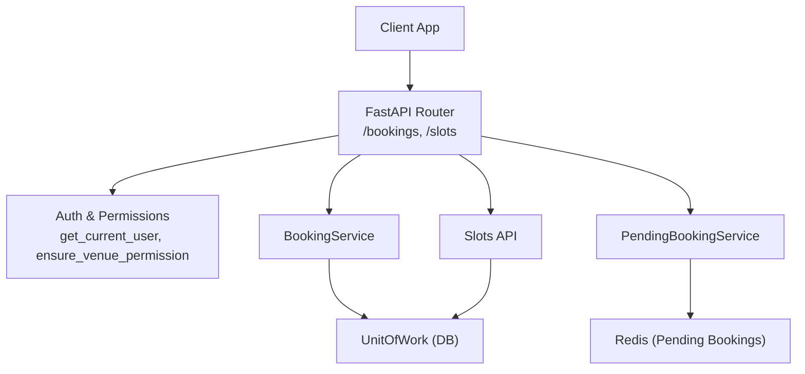
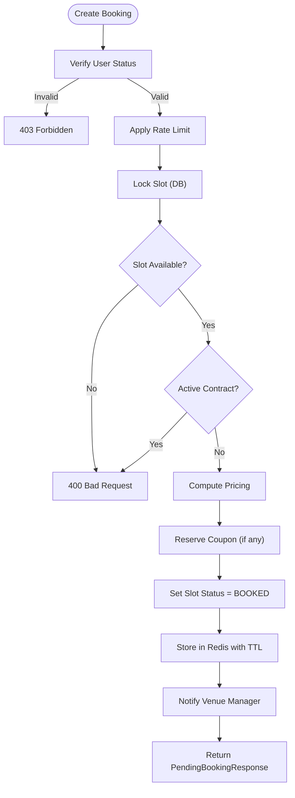
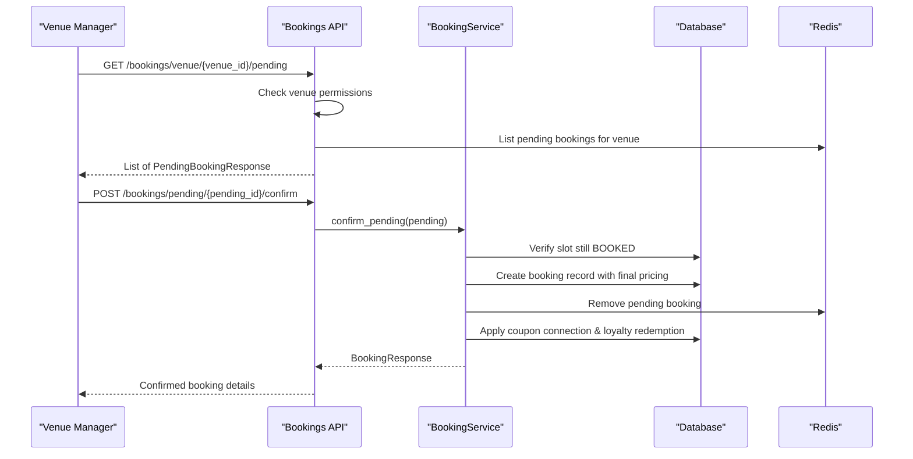
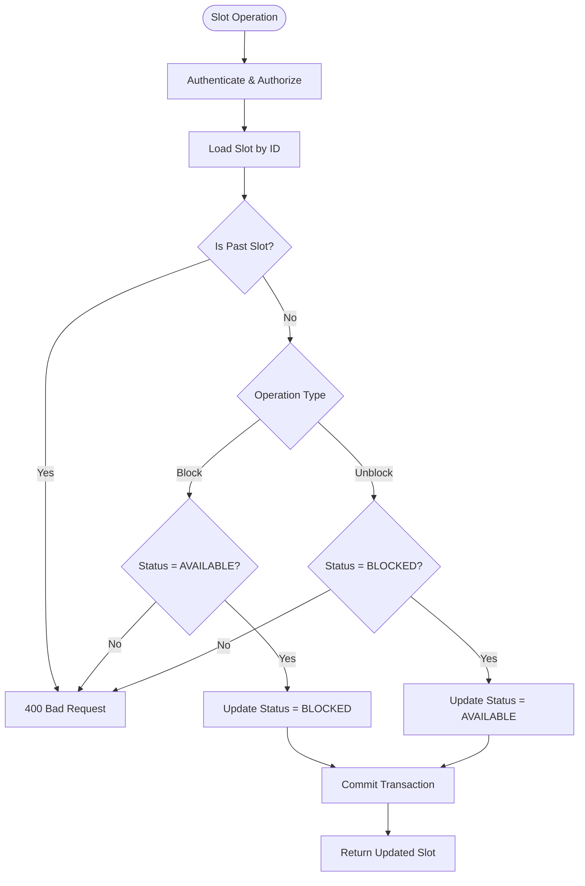
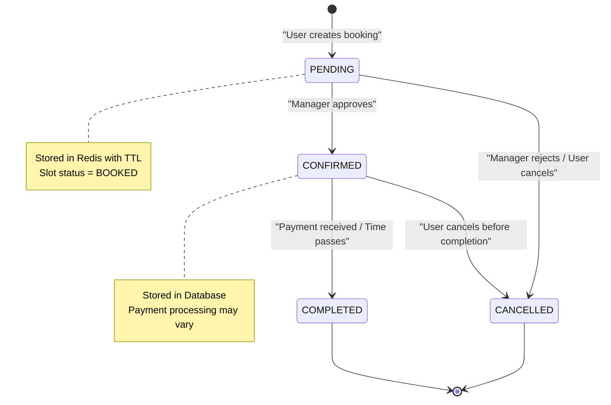
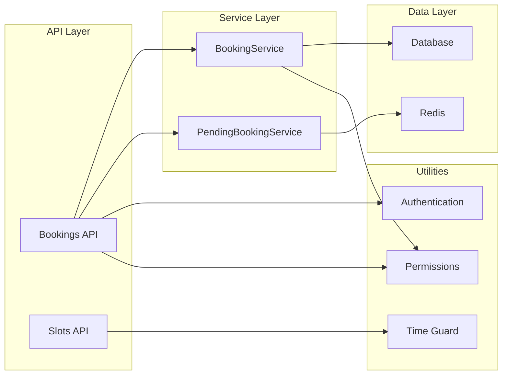

# Bookings API

<cite>
**Referenced Files in This Document**
- [bookings.py](file://app/api/v1/bookings.py)
- [slots.py](file://app/api/v1/slots.py)
- [booking_service.py](file://app/services/booking_service.py)
- [pending_booking_service.py](file://app/services/pending_booking_service.py)
- [booking.py](file://app/models/booking.py)
- [slot.py](file://app/models/slot.py)
- [venue.py](file://app/models/venue.py)
- [user.py](file://app/models/user.py)
- [auth.py](file://app/utils/auth.py)
- [permissions.py](file://app/utils/permissions.py)
- [time_guard.py](file://app/utils/time_guard.py)
- [booking_schemas.py](file://app/schemas/booking.py)
- [slot_schemas.py](file://app/schemas/slot.py)
</cite>

## Table of Contents
1. [Introduction](#introduction)
2. [Project Structure](#project-structure)
3. [Core Components](#core-components)
4. [Architecture Overview](#architecture-overview)
5. [Detailed Component Analysis](#detailed-component-analysis)
6. [Dependency Analysis](#dependency-analysis)
7. [Performance Considerations](#performance-considerations)
8. [Troubleshooting Guide](#troubleshooting-guide)
9. [Conclusion](#conclusion)
10. [Appendices](#appendices)

## Introduction
This document provides comprehensive API documentation for the booking system endpoints, focusing on:
- Creating pending bookings
- Manager approval/rejection workflows
- Slot reservation management and availability
- Booking lifecycle states and transitions
- Authentication and authorization requirements
- Business rule validations
- Real-time availability updates via slot status changes

The system enforces a two-phase booking flow:
- Phase 1: User creates a pending booking that reserves a slot temporarily (stored in Redis).
- Phase 2: Venue manager confirms or rejects the pending booking; upon confirmation, the booking is persisted to the database with final pricing and payment mode applied.

## Project Structure
The booking-related functionality spans API routes, services, models, schemas, and utilities:
- API routes define HTTP endpoints under /bookings and /slots
- Services encapsulate business logic for creating, confirming, canceling bookings and managing pending state
- Models define data structures for bookings, slots, venues, and users
- Schemas define request/response contracts
- Utilities handle authentication, permissions, time guards, and rate limiting

**Diagram sources**
- [bookings.py:19-529](file://app/api/v1/bookings.py#L19-L529)
- [slots.py:13-112](file://app/api/v1/slots.py#L13-L112)
- [booking_service.py:14-229](file://app/services/booking_service.py#L14-L229)
- [pending_booking_service.py:46-132](file://app/services/pending_booking_service.py#L46-L132)
- [auth.py:85-113](file://app/utils/auth.py#L85-L113)
- [permissions.py:34-65](file://app/utils/permissions.py#L34-L65)

**Section sources**
- [bookings.py:19-529](file://app/api/v1/bookings.py#L19-L529)
- [slots.py:13-112](file://app/api/v1/slots.py#L13-L112)

## Core Components
- Pending Booking Creation: Users create pending bookings by selecting an available slot. The system locks the slot, computes pricing, applies discounts/loyalty points, and stores the pending booking in Redis with TTL.
- Manager Approval Workflow: Venue managers can list pending bookings per venue, confirm to persist the booking into the database, or reject to release the slot back to availability.
- Slot Reservation Management: Slots have statuses (available, booked, blocked, reserved, in_competition). Managers can block/unblock future slots. Availability queries filter by date and venue.
- Booking Lifecycle States: Bookings transition through pending, confirmed, cancelled, completed. Receipt submission/approval/rejection supports bank receipt payments. In-person payments are recorded at the venue.

**Section sources**
- [booking_service.py:27-117](file://app/services/booking_service.py#L27-L117)
- [pending_booking_service.py:52-77](file://app/services/pending_booking_service.py#L52-L77)
- [slots.py:68-112](file://app/api/v1/slots.py#L68-L112)
- [booking.py:7-18](file://app/models/booking.py#L7-L18)
- [slot.py:6-11](file://app/models/slot.py#L6-L11)

## Architecture Overview
The booking workflow involves multiple components interacting to ensure data consistency and business rule enforcement.

```mermaid
sequenceDiagram
participant Client as "Client"
participant API as "Bookings API"
participant Service as "BookingService"
participant Pending as "PendingBookingService"
participant DB as "Database"
participant Redis as "Redis"
Client->>API : POST /bookings (create)
API->>Service : create_booking(slot_id, user_id, discount_code, use_loyalty_points)
Service->>DB : Lock slot (SELECT ... FOR UPDATE)
Service->>Service : Validate slot availability & contract rules
Service->>Service : Compute pricing (base→rules→deal→coupon→loyalty)
Service->>DB : Update slot status to BOOKED
Service->>Redis : Create pending booking record with TTL
Service-->>API : Return pending booking response
API-->>Client : PendingBookingResponse
Note over Client,API : Manager approves/rejects later
```

**Diagram sources**
- [bookings.py:191-237](file://app/api/v1/bookings.py#L191-L237)
- [booking_service.py:27-109](file://app/services/booking_service.py#L27-L109)
- [pending_booking_service.py:52-77](file://app/services/pending_booking_service.py#L52-L77)

## Detailed Component Analysis

### Pending Booking Creation
- Endpoint: POST /bookings
- Authentication: Requires valid JWT token (Bearer)
- Request Schema:
  - slot_id: integer (required)
  - discount_code: string (optional)
  - use_loyalty_points: boolean (optional, default false)
- Response Schema: PendingBookingResponse with additional venue/slot details
- Business Rules:
  - User must be verified if role is USER
  - Rate limiting applied via middleware
  - Slot must be available and not part of active contract
  - No duplicate pending bookings for same slot
  - Pricing computed server-side with coupon and loyalty integration
  - Slot status set to BOOKED during pending phase
  - Notifications sent to venue manager for new pending booking

**Diagram sources**
- [bookings.py:191-237](file://app/api/v1/bookings.py#L191-L237)
- [booking_service.py:27-109](file://app/services/booking_service.py#L27-L109)
- [pending_booking_service.py:52-77](file://app/services/pending_booking_service.py#L52-L77)

**Section sources**
- [bookings.py:191-237](file://app/api/v1/bookings.py#L191-L237)
- [booking_service.py:27-109](file://app/services/booking_service.py#L27-L109)

### Manager Approval Workflow
- Endpoints:
  - GET /bookings/pending/my (list user's pending bookings)
  - GET /bookings/venue/{venue_id}/pending (list venue's pending bookings)
  - POST /bookings/pending/{pending_id}/confirm (approve pending booking)
  - POST /bookings/pending/{pending_id}/reject (reject pending booking)
  - DELETE /bookings/pending/{pending_id} (cancel pending booking by user)
- Authentication: JWT required, venue permission checks for manager operations
- Request/Response: Various schemas based on operation type
- Business Rules:
  - Only venue managers/staff with proper permissions can approve/reject
  - Confirmation persists booking to database with final pricing
  - Rejection releases slot back to appropriate status (AVAILABLE or RESERVED for contracts)
  - Promotions (coupons, loyalty points) released on rejection/cancellation
  - Notifications sent to users for all actions

**Diagram sources**
- [bookings.py:85-161](file://app/api/v1/bookings.py#L85-L161)
- [booking_service.py:119-192](file://app/services/booking_service.py#L119-L192)
- [pending_booking_service.py:79-95](file://app/services/pending_booking_service.py#L79-L95)

**Section sources**
- [bookings.py:75-186](file://app/api/v1/bookings.py#L75-L186)
- [booking_service.py:119-192](file://app/services/booking_service.py#L119-L192)

### Slot Reservation Management
- Endpoints:
  - GET /slots/venue/{venue_id} (get all slots for date)
  - GET /slots/venue/{venue_id}/available (get available slots only)
  - GET /slots/venue/{venue_id}/range (get slots by date range)
  - POST /slots/venue/{venue_id}/generate (generate daily slots)
  - POST /slots/{slot_id}/block (block future available slot)
  - POST /slots/{slot_id}/unblock (unblock future blocked slot)
- Authentication: JWT required, venue permissions for management operations
- Business Rules:
  - Only future slots can be blocked/unblocked
  - Contract slots cannot be manually blocked
  - Past slots cannot be modified
  - Slot generation requires proper permissions

**Diagram sources**
- [slots.py:68-112](file://app/api/v1/slots.py#L68-L112)
- [time_guard.py:19-22](file://app/utils/time_guard.py#L19-L22)

**Section sources**
- [slots.py:15-112](file://app/api/v1/slots.py#L15-L112)
- [time_guard.py:1-22](file://app/utils/time_guard.py#L1-22)

### Booking Lifecycle States
The booking system implements a comprehensive state machine:

**Diagram sources**
- [booking.py:7-18](file://app/models/booking.py#L7-L18)
- [slot.py:6-11](file://app/models/slot.py#L6-L11)

**Section sources**
- [booking.py:7-18](file://app/models/booking.py#L7-L18)
- [slot.py:6-11](file://app/models/slot.py#L6-L11)

### Payment and Receipt Management
The system supports multiple payment modes based on venue configuration:
- Bank Receipt: Users submit payment receipts for manager approval
- Pay in Place: Staff collect payment at the venue
- Gateway: Online payment processing (handled elsewhere)

Key endpoints:
- POST /bookings/{booking_id}/receipt: Submit bank receipt
- POST /bookings/{booking_id}/receipt/approve: Approve submitted receipt
- POST /bookings/{booking_id}/receipt/reject: Reject submitted receipt
- POST /bookings/{booking_id}/collect-in-person: Record in-person payment

**Section sources**
- [bookings.py:454-528](file://app/api/v1/bookings.py#L454-L528)
- [venue.py:10-13](file://app/models/venue.py#L10-L13)

## Dependency Analysis
The booking system has clear dependency relationships between components:

**Diagram sources**
- [bookings.py:1-18](file://app/api/v1/bookings.py#L1-L18)
- [slots.py:1-12](file://app/api/v1/slots.py#L1-L12)
- [booking_service.py:1-12](file://app/services/booking_service.py#L1-L12)
- [pending_booking_service.py:1-18](file://app/services/pending_booking_service.py#L1-L18)

**Section sources**
- [bookings.py:1-18](file://app/api/v1/bookings.py#L1-L18)
- [slots.py:1-12](file://app/api/v1/slots.py#L1-L12)

## Performance Considerations
- **Database Locking**: Uses SELECT ... FOR UPDATE to prevent race conditions during booking creation
- **Redis Caching**: Pending bookings stored in Redis for fast access and automatic cleanup via TTL
- **Batch Operations**: Enrichment functions batch load related data to avoid N+1 queries
- **Rate Limiting**: Booking creation is rate-limited to prevent abuse
- **Transaction Management**: Unit of Work pattern ensures atomic operations across multiple data sources

## Troubleshooting Guide
Common issues and their resolutions:

### Booking Creation Failures
- **Slot Not Found**: Verify slot exists and belongs to correct venue
- **Slot Not Available**: Check slot status and concurrent booking attempts
- **Active Contract Conflict**: Ensure slot is not part of active contract
- **Duplicate Pending**: Another pending booking may exist for the same slot

### Manager Approval Issues
- **Slot No Longer Held**: Slot may have been released due to timeout or concurrent operations
- **Permission Denied**: Verify manager has proper venue permissions
- **Already Confirmed**: Check for existing confirmed booking on the slot

### Payment Processing Problems
- **Receipt Already Submitted**: Verify receipt status before submission
- **Invalid Payment Mode**: Ensure venue supports selected payment method
- **Unauthorized Access**: Confirm staff has finance.record_payment permission

**Section sources**
- [booking_service.py:41-68](file://app/services/booking_service.py#L41-L68)
- [booking_service.py:123-147](file://app/services/booking_service.py#L123-L147)
- [bookings.py:454-528](file://app/api/v1/bookings.py#L454-L528)

## Conclusion
The booking system provides a robust, secure, and scalable solution for managing futsal venue reservations. Key features include:
- Two-phase booking process with pending state management
- Comprehensive validation and business rule enforcement
- Flexible payment methods supporting various venue configurations
- Real-time availability management with proper locking mechanisms
- Complete audit trail with notifications and financial tracking

The architecture separates concerns effectively between API routes, business logic, and data persistence, making it maintainable and extensible for future enhancements.

## Appendices

### Authentication Requirements
All endpoints require JWT authentication via Bearer token. Manager-specific endpoints additionally require venue-based permissions.

**Section sources**
- [auth.py:85-113](file://app/utils/auth.py#L85-L113)
- [permissions.py:34-65](file://app/utils/permissions.py#L34-L65)

### Data Models Reference
- **Booking**: Represents a confirmed reservation with payment details
- **Slot**: Represents a time slot with availability status
- **Venue**: Defines payment modes and venue-specific settings
- **User**: Contains role information and verification status

**Section sources**
- [booking.py:21-51](file://app/models/booking.py#L21-L51)
- [slot.py:13-42](file://app/models/slot.py#L13-L42)
- [venue.py:16-43](file://app/models/venue.py#L16-L43)
- [user.py:13-34](file://app/models/user.py#L13-L34)