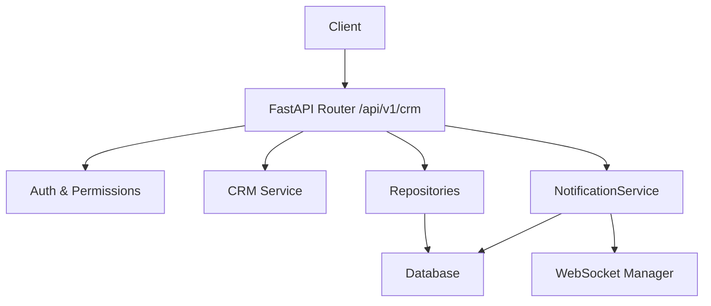
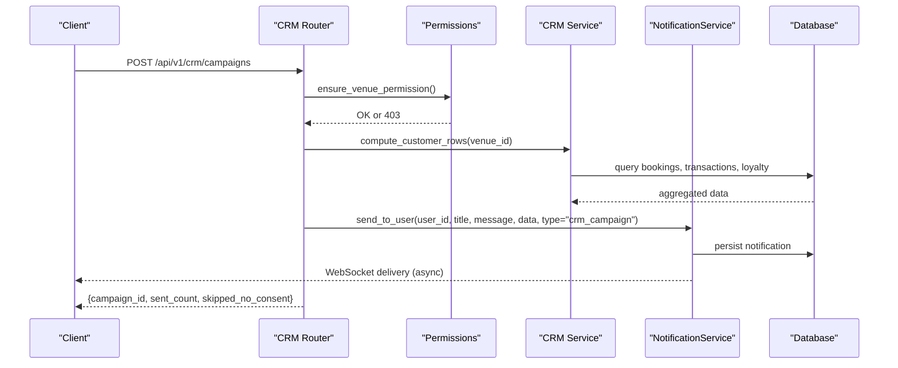
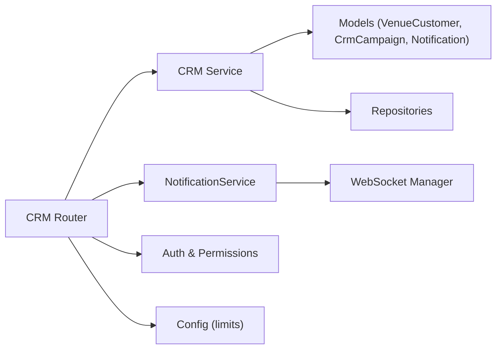

# CRM API

<cite>
**Referenced Files in This Document**
- [crm.py](file://app/api/v1/crm.py)
- [crm_service.py](file://app/services/crm_service.py)
- [customer.py](file://app/models/customer.py)
- [notification.py](file://app/models/notification.py)
- [notifications.py](file://app/api/v1/notifications.py)
- [notification_service.py](file://app/services/notification_service.py)
- [auth.py](file://app/utils/auth.py)
- [permissions.py](file://app/utils/permissions.py)
- [config.py](file://app/config.py)
- [main.py](file://app/main.py)
</cite>

## Table of Contents
1. [Introduction](#introduction)
2. [Project Structure](#project-structure)
3. [Core Components](#core-components)
4. [Architecture Overview](#architecture-overview)
5. [Detailed Component Analysis](#detailed-component-analysis)
6. [Dependency Analysis](#dependency-analysis)
7. [Performance Considerations](#performance-considerations)
8. [Troubleshooting Guide](#troubleshooting-guide)
9. [Conclusion](#conclusion)

## Introduction
This document provides detailed API documentation for the Customer Relationship Management (CRM) endpoints, covering customer segmentation, marketing campaign management, automated notifications, and customer analytics. It includes HTTP methods, URL patterns, request/response schemas, authentication and authorization requirements, and examples of common CRM workflows such as creating segments, launching campaigns, sending targeted notifications, and generating insights reports. It also documents customer lifecycle management and engagement tracking features implemented via derived metrics and consent-driven messaging.

## Project Structure
The CRM feature is implemented across FastAPI routers, services, models, and repositories:
- API layer exposes REST endpoints under /api/v1/crm and /api/v1/notifications
- Service layer computes customer rows, segments, filters, and statistics
- Models define persistent entities for customers, campaigns, and notifications
- Repositories provide data access primitives
- Authentication and permissions enforce role-based access control
- Configuration controls limits like daily campaign quotas

**Diagram sources**
- [crm.py:61-180](file://app/api/v1/crm.py#L61-L180)
- [crm_service.py:82-158](file://app/services/crm_service.py#L82-L158)
- [notification_service.py:50-64](file://app/services/notification_service.py#L50-L64)
- [main.py:178-200](file://app/main.py#L178-L200)

**Section sources**
- [main.py:178-200](file://app/main.py#L178-L200)

## Core Components
- Customer Segmentation: Derived from booking history, spend, loyalty balances, VIP flags, tags, and inactive days. Segments include new, regular, vip, at_risk, dormant.
- Marketing Campaigns: Consent-only, per-venue with a daily limit; sends in-app notifications to eligible users.
- Automated Notifications: Persisted to database and delivered via WebSocket to clients.
- Customer Analytics: Aggregated stats including segment counts, inactive counts, top spenders, and recent new customers.

**Section sources**
- [crm_service.py:52-66](file://app/services/crm_service.py#L52-L66)
- [crm_service.py:197-215](file://app/services/crm_service.py#L197-L215)
- [crm.py:185-244](file://app/api/v1/crm.py#L185-L244)
- [notification_service.py:50-64](file://app/services/notification_service.py#L50-L64)

## Architecture Overview
The CRM API follows a layered architecture:
- Endpoints validate input, enforce venue-scoped permissions, and delegate to service logic
- Services compute enriched customer rows and apply filtering/sorting
- Repositories perform queries against models
- NotificationService persists and broadcasts notifications
- Config enforces business rules like campaign daily limits

**Diagram sources**
- [crm.py:185-244](file://app/api/v1/crm.py#L185-L244)
- [crm_service.py:82-158](file://app/services/crm_service.py#L82-L158)
- [notification_service.py:50-64](file://app/services/notification_service.py#L50-L64)

## Detailed Component Analysis

### Authentication and Authorization
- All CRM endpoints require a valid JWT Bearer token.
- Venue-scoped permission checks are enforced using staff access utilities.
- Read operations require either crm.view or customer.view_basic; write operations require crm.manage.

Authentication flow:
- Clients must include Authorization: Bearer <JWT>
- get_current_user validates token and active user status
- ensure_venue_permission verifies role/permission and venue ownership

**Section sources**
- [auth.py:85-102](file://app/utils/auth.py#L85-L102)
- [permissions.py:34-90](file://app/utils/permissions.py#L34-L90)
- [crm.py:61-86](file://app/api/v1/crm.py#L61-L86)

### Customer Segmentation and Listing
- GET /api/v1/crm/customers
  - Query parameters: venue_id (required), search, is_vip, tag, segment, status, sort, limit, offset
  - Behavior: Computes enriched customer rows, applies filters, sorts, and paginates
  - Segment values: new, regular, vip, at_risk, dormant
  - Status filter: all, active, inactive
  - Sort options: last_visit, spend, bookings

Response fields (selected):
- items: array of customer objects with user_id, full_name, phone, bookings_count, total_spend, balance_due, loyalty_balance, last_booking_date, first_seen, customer_since_days, is_vip, tags, notes, marketing_consent, inactive_days, segment
- total: count of filtered results
- limit, offset: pagination metadata

Example usage:
- List VIP customers with tag “premium” sorted by spend: GET /api/v1/crm/customers?venue_id=1&is_vip=true&tag=premium&sort=spend

**Section sources**
- [crm.py:61-86](file://app/api/v1/crm.py#L61-L86)
- [crm_service.py:164-194](file://app/services/crm_service.py#L164-L194)

### Customer Details and Updates
- GET /api/v1/crm/customers/{user_id}?venue_id=...
  - Returns enriched customer row plus recent bookings, recent payments, ledger statement, and venue-specific customer metadata (VIP, tags, notes, marketing_consent)
- PUT /api/v1/crm/customers/{user_id}?venue_id=...
  - Request body schema: CrmCustomerUpdate (is_vip, tags, notes)
  - Creates or updates VenueCustomer record with marked_by set to current user
  - Returns updated customer row

Notes:
- Tags are stored as CSV internally; only up to 10 tags are accepted
- Notes are truncated to a maximum length

**Section sources**
- [crm.py:89-168](file://app/api/v1/crm.py#L89-L168)
- [customer.py:19-36](file://app/models/customer.py#L19-L36)
- [customer.py:8-12](file://app/schemas/customer.py#L8-L12)

### Customer Analytics
- GET /api/v1/crm/stats?venue_id=...
  - Returns aggregated analytics: total_customers, segments counts, inactive_count, top_spenders (top 5 by spend), recent_new_customers (first_seen within last 7 days)

Use cases:
- Dashboard widgets for segment distribution
- Identify at-risk and dormant customers for re-engagement
- Track new customer acquisition trends

**Section sources**
- [crm.py:171-180](file://app/api/v1/crm.py#L171-L180)
- [crm_service.py:197-215](file://app/services/crm_service.py#L197-L215)

### Marketing Campaigns
- POST /api/v1/crm/campaigns
  - Request body schema: CampaignCreate (venue_id, segment or customer_ids, title, message, discount_code)
  - Business rules:
    - Requires crm.manage permission and venue ownership
    - Must specify segment or customer_ids
    - Enforces daily campaign limit per venue from settings.CRM_CAMPAIGN_DAILY_LIMIT
    - Only sends to users who have marketing_consent=True for that venue
    - Sends in-app notifications with type "crm_campaign"
  - Response: campaign_id, sent_count, skipped_no_consent

- GET /api/v1/crm/campaigns?venue_id=...&limit=...&offset=...
  - Lists campaigns for venue with actor names resolved

Examples:
- Launch a campaign targeting “at_risk” segment with a discount code
- Send a one-off message to specific customer_ids

**Section sources**
- [crm.py:185-270](file://app/api/v1/crm.py#L185-L270)
- [config.py:27-28](file://app/config.py#L27-L28)
- [customer.py:38-53](file://app/models/customer.py#L38-L53)

### Consent Management
- GET /api/v1/crm/consent
  - Returns marketing_consent boolean, notify_deals flag, and venues_with_consent list
- PUT /api/v1/crm/consent
  - Request body schema: ConsentUpdate (marketing_consent, venue_id optional)
  - If venue_id provided, updates consent for that venue; otherwise updates all venue records for the user
  - Persists consent_updated_at timestamp

Workflow:
- Users can opt-in/out of marketing communications per venue or globally
- Campaigns respect consent strictly; no messages sent without consent

**Section sources**
- [crm.py:275-321](file://app/api/v1/crm.py#L275-L321)
- [customer.py:19-36](file://app/models/customer.py#L19-L36)
- [customer.py:14-18](file://app/schemas/customer.py#L14-L18)

### Automated Notifications
- In-app notifications are persisted and delivered via WebSocket
- Types include booking events, contract events, and CRM campaigns
- Endpoints to manage notifications:
  - GET /api/v1/notifications?limit=&offset=&unread_only=
  - GET /api/v1/notifications/unread-count
  - PUT /api/v1/notifications/read-all
  - PUT /api/v1/notifications/{notification_id}/read

Notification payload includes id, user_id, title, message, data (JSON), type, is_read, created_at.

**Section sources**
- [notification_service.py:50-64](file://app/services/notification_service.py#L50-L64)
- [notification.py:6-18](file://app/models/notification.py#L6-L18)
- [notifications.py:34-83](file://app/api/v1/notifications.py#L34-L83)

### Customer Lifecycle Management and Engagement Tracking
- Derived metrics track lifecycle stages:
  - New: few bookings and first_seen within a short window
  - Regular: standard active customers
  - At risk: inactive beyond a threshold
  - Dormant: long-term inactive
  - VIP: manually flagged high-value customers
- Engagement signals:
  - Bookings count and last visit date
  - Total spend and balance due
  - Loyalty points balance
  - Consent status for marketing

These metrics power segmentation, analytics, and targeted campaigns.

**Section sources**
- [crm_service.py:52-66](file://app/services/crm_service.py#L52-L66)
- [crm_service.py:82-158](file://app/services/crm_service.py#L82-L158)

## Dependency Analysis
Key dependencies and relationships:
- CRM router depends on CRM service for computation and filtering
- CRM service depends on repositories and models for data aggregation
- Notification service depends on database and WebSocket manager
- Permissions module defines RBAC codes used by CRM endpoints
- Config provides campaign daily limit and other runtime settings

**Diagram sources**
- [crm.py:27-39](file://app/api/v1/crm.py#L27-L39)
- [crm_service.py:19-31](file://app/services/crm_service.py#L19-L31)
- [notification_service.py:1-10](file://app/services/notification_service.py#L1-L10)
- [permissions.py:34-90](file://app/utils/permissions.py#L34-L90)
- [config.py:27-28](file://app/config.py#L27-L28)

**Section sources**
- [crm.py:27-39](file://app/api/v1/crm.py#L27-L39)
- [crm_service.py:19-31](file://app/services/crm_service.py#L19-L31)
- [notification_service.py:1-10](file://app/services/notification_service.py#L1-L10)
- [permissions.py:34-90](file://app/utils/permissions.py#L34-L90)
- [config.py:27-28](file://app/config.py#L27-L28)

## Performance Considerations
- Customer row computation aggregates bookings, transactions, and loyalty balances in efficient queries to avoid N+1 issues.
- Filtering and sorting are applied in-memory after fetching aggregated data; suitable for small-to-medium venue sizes.
- Campaign creation enforces daily limits to prevent abuse and reduce load.
- Notifications are persisted asynchronously and delivered via WebSocket to minimize blocking.

[No sources needed since this section provides general guidance]

## Troubleshooting Guide
Common issues and resolutions:
- Unauthorized (401): Ensure a valid JWT Bearer token is included in requests.
- Forbidden (403): Verify the user has required permissions (crm.view or crm.manage) and venue ownership.
- Bad request (400): Validate segment values, campaign constraints (segment or customer_ids required), and daily campaign limits.
- Consent-related skips: Campaigns skip users without marketing_consent; verify consent settings.
- Notification not received: Check WebSocket connection and user session; notifications are persisted even if offline.

**Section sources**
- [auth.py:85-102](file://app/utils/auth.py#L85-L102)
- [permissions.py:34-90](file://app/utils/permissions.py#L34-L90)
- [crm.py:185-244](file://app/api/v1/crm.py#L185-L244)
- [notification_service.py:50-64](file://app/services/notification_service.py#L50-L64)

## Conclusion
The CRM API provides robust tools for customer segmentation, marketing campaign management, automated notifications, and analytics. It enforces strict privacy through consent-driven messaging and venue-scoped permissions. By leveraging derived lifecycle metrics and real-time notifications, operators can effectively engage customers, track performance, and automate outreach while maintaining compliance and performance.

[No sources needed since this section summarizes without analyzing specific files]