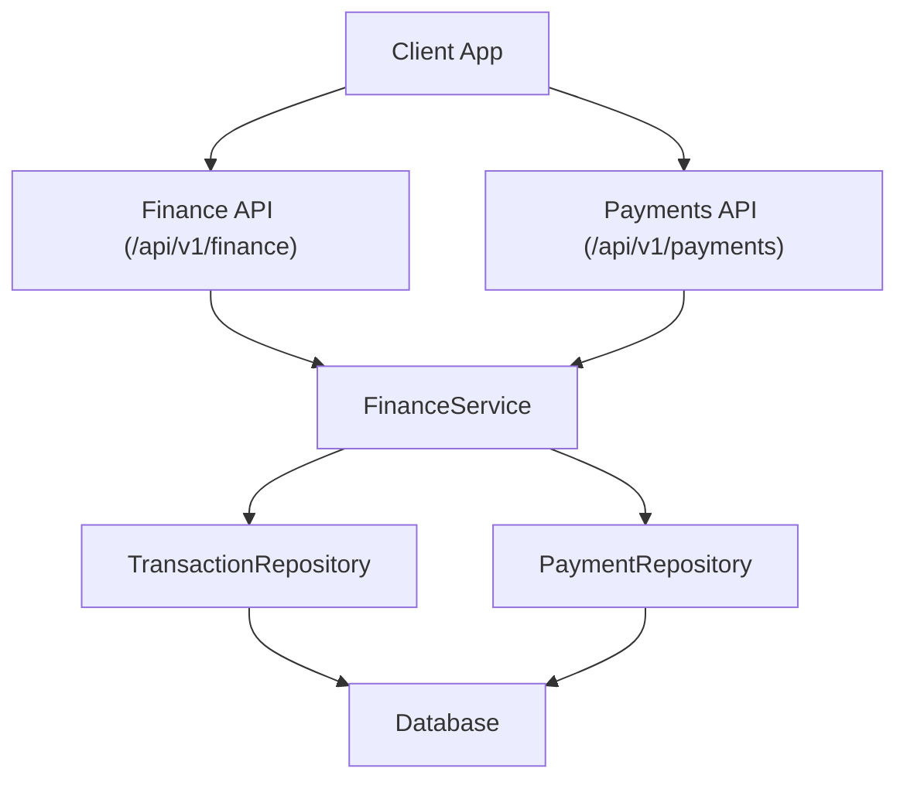
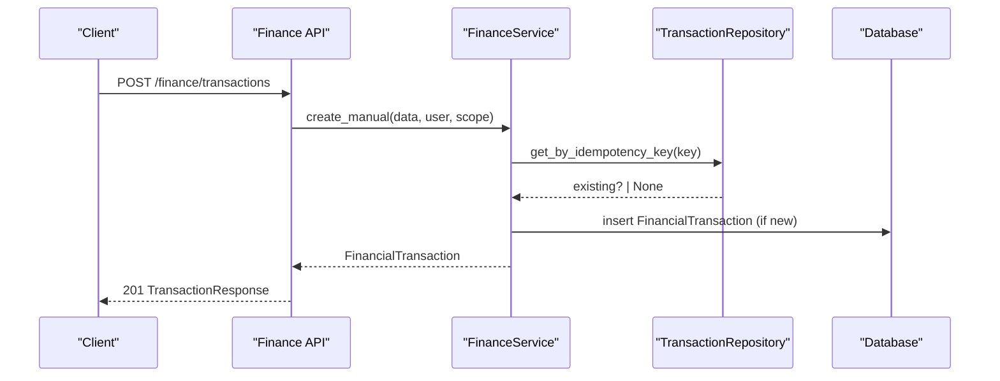
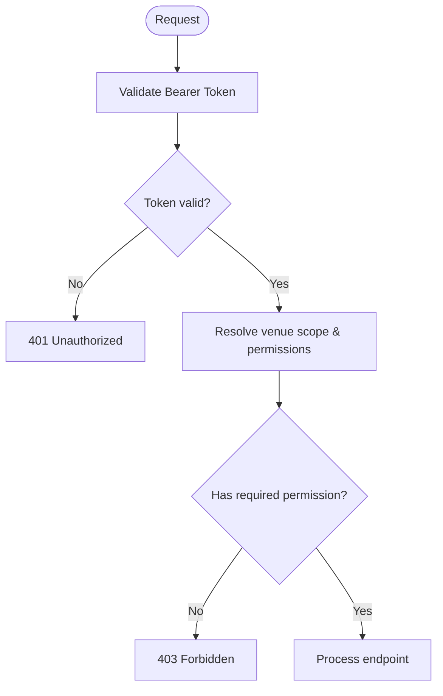
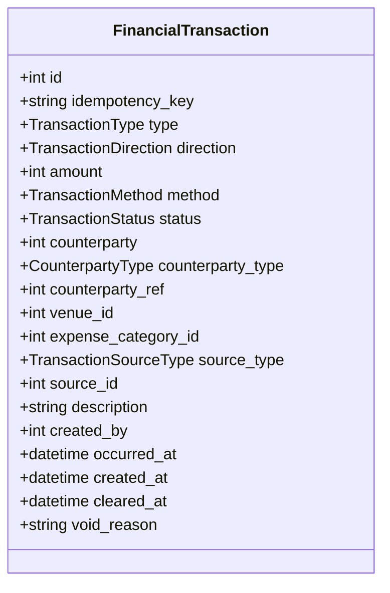
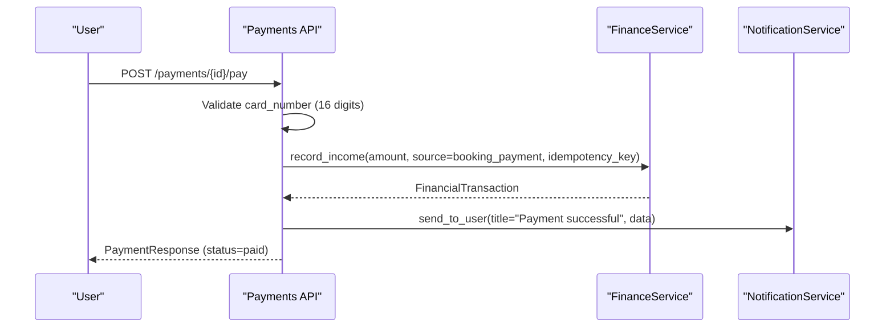
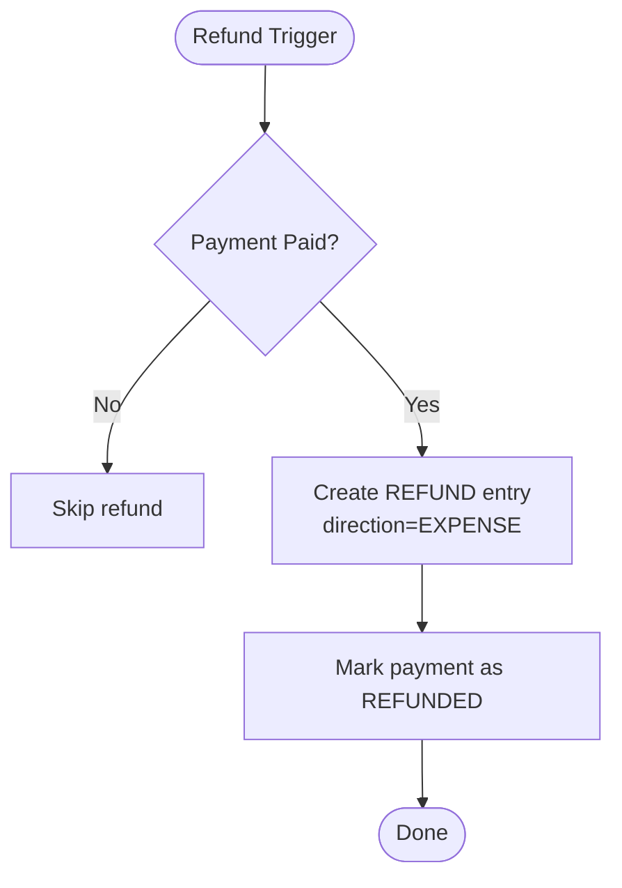
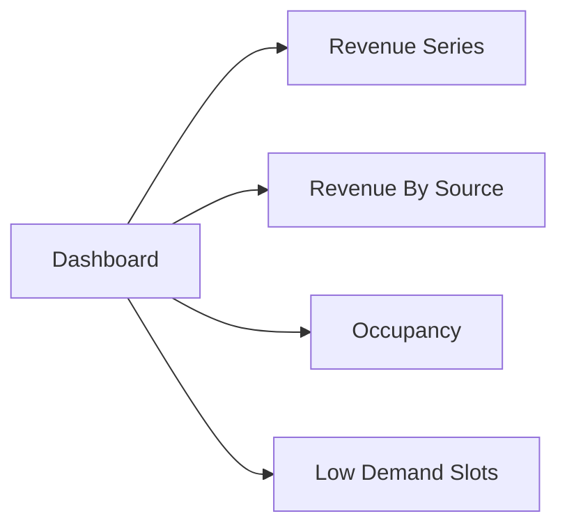
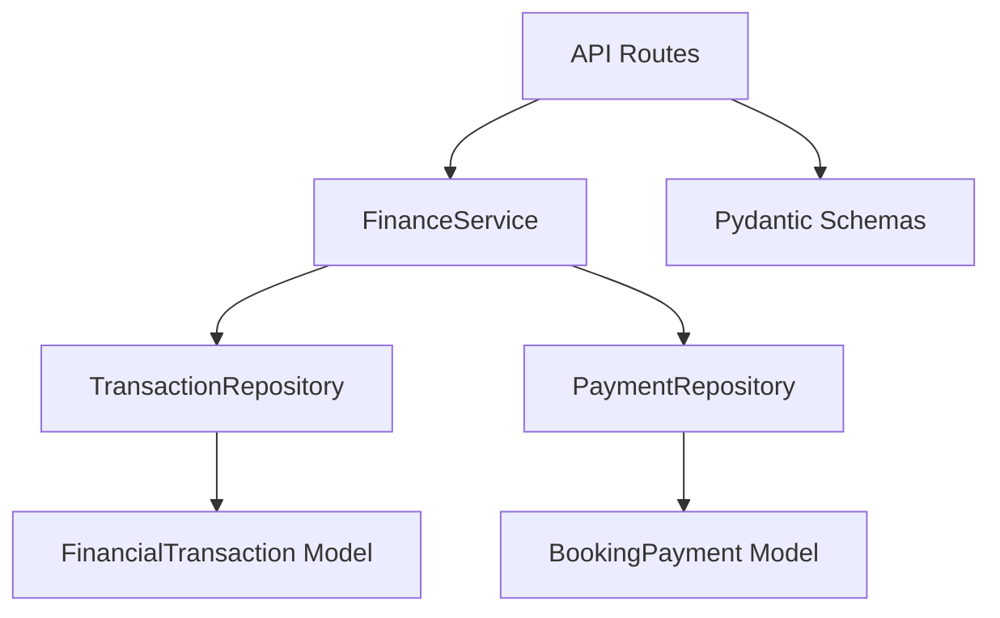

# Finance API

<cite>
**Referenced Files in This Document**
- [finance.py](file://app/api/v1/finance.py)
- [payments.py](file://app/api/v1/payments.py)
- [finance_service.py](file://app/services/finance_service.py)
- [transaction_repository.py](file://app/repositories/transaction_repository.py)
- [payment_repository.py](file://app/repositories/payment_repository.py)
- [transaction.py](file://app/models/transaction.py)
- [payment.py](file://app/models/payment.py)
- [finance.py (schemas)](file://app/schemas/finance.py)
- [payment.py (schemas)](file://app/schemas/payment.py)
- [auth.py](file://app/utils/auth.py)
- [test_finance_ledger.py](file://tests/test_finance_ledger.py)
- [test_game_refund_ledger.py](file://tests/test_game_refund_ledger.py)
</cite>

## Table of Contents
1. Introduction
2. Project Structure
3. Core Components
4. Architecture Overview
5. Detailed Component Analysis
6. Dependency Analysis
7. Performance Considerations
8. Troubleshooting Guide
9. Conclusion
10. Appendices

## Introduction
This document provides comprehensive API documentation for financial operations in the system, covering:
- Transaction ledger management (create, list, void, export)
- Payment processing (create invoice, pay via gateway simulation)
- Refund handling (refund entries and game refund flows)
- Financial reporting (dashboard, revenue series, by-source, occupancy, low-demand slots)
- Authentication and authorization requirements
- Data validation rules and idempotency
- Audit trails and balance calculations
- Integration points with external payment systems

The finance module is built around an append-only ledger model to ensure auditability and consistency. All monetary values are integers representing currency units (e.g., Rial), and directions indicate whether a transaction increases or decreases net income from the organization’s perspective.

## Project Structure
Financial functionality spans API routes, services, repositories, schemas, and models:
- API routes define HTTP endpoints under /api/v1/finance and /api/v1/payments
- Services encapsulate business logic (record income/expenses/refunds, compute balances, reports)
- Repositories implement efficient SQL aggregations and queries
- Schemas validate request/response payloads
- Models define database structures and enums for transactions and payments

**Diagram sources**
- [finance.py:157-244](file://app/api/v1/finance.py#L157-L244)
- [payments.py:42-162](file://app/api/v1/payments.py#L42-L162)
- [finance_service.py:118-228](file://app/services/finance_service.py#L118-L228)
- [transaction_repository.py:71-120](file://app/repositories/transaction_repository.py#L71-L120)
- [payment_repository.py:13-53](file://app/repositories/payment_repository.py#L13-L53)

**Section sources**
- [finance.py:157-244](file://app/api/v1/finance.py#L157-L244)
- [payments.py:42-162](file://app/api/v1/payments.py#L42-L162)
- [finance_service.py:118-228](file://app/services/finance_service.py#L118-L228)
- [transaction_repository.py:71-120](file://app/repositories/transaction_repository.py#L71-L120)
- [payment_repository.py:13-53](file://app/repositories/payment_repository.py#L13-L53)

## Core Components
- Finance API endpoints: dashboard, revenue series, revenue by source, occupancy, low-demand slots, transactions CRUD, expense categories, accounts and statements, CSV export
- Payments API endpoints: create payment invoice, pay payment, list user payments
- FinanceService: core business logic for recording transactions, refunds, voiding, computing balances, generating reports
- Repositories: optimized SQL for listing, aggregations, person balances, statement rows, occupancy metrics
- Schemas: strict validation for amounts, types, directions, methods, statuses, and dates
- Models: enums for transaction types/directions/methods/statuses, and booking payment states

Key validation and constraints:
- Amounts must be positive integers; direction is often forced by type
- Idempotency keys prevent duplicate ledger entries
- Venue scoping enforces RBAC per venue or manager scope
- Status transitions enforced (e.g., cannot void already voided)

**Section sources**
- [finance.py:81-396](file://app/api/v1/finance.py#L81-L396)
- [payments.py:42-175](file://app/api/v1/payments.py#L42-L175)
- [finance_service.py:62-737](file://app/services/finance_service.py#L62-L737)
- [transaction_repository.py:42-395](file://app/repositories/transaction_repository.py#L42-L395)
- [payment_repository.py:8-53](file://app/repositories/payment_repository.py#L8-L53)
- [finance.py (schemas):31-238](file://app/schemas/finance.py#L31-L238)
- [payment.py (schemas):6-32](file://app/schemas/payment.py#L6-L32)
- [transaction.py:20-119](file://app/models/transaction.py#L20-L119)
- [payment.py:7-29](file://app/models/payment.py#L7-L29)

## Architecture Overview
The finance architecture follows a layered approach:
- API layer validates inputs and applies authentication/authorization
- Service layer orchestrates business rules, idempotency, and side effects
- Repository layer performs efficient SQL operations and aggregations
- Database stores append-only ledger entries and payment records

**Diagram sources**
- [finance.py:187-205](file://app/api/v1/finance.py#L187-L205)
- [finance_service.py:231-273](file://app/services/finance_service.py#L231-L273)
- [transaction_repository.py:65-67](file://app/repositories/transaction_repository.py#L65-L67)

**Section sources**
- [finance.py:187-205](file://app/api/v1/finance.py#L187-L205)
- [finance_service.py:231-273](file://app/services/finance_service.py#L231-L273)
- [transaction_repository.py:65-67](file://app/repositories/transaction_repository.py#L65-L67)

## Detailed Component Analysis

### Authentication and Authorization
- All endpoints require Bearer token authentication via HTTP Bearer scheme
- User context is resolved using JWT decoding and session lookup
- Role-based access control (RBAC) enforces permissions such as finance.view, reports.view, finance.record_payment, finance.expense.create, finance.manage
- Venue scoping ensures users can only access data within their permitted venues

**Diagram sources**
- [auth.py:85-112](file://app/utils/auth.py#L85-L112)
- [finance.py:45-76](file://app/api/v1/finance.py#L45-L76)

**Section sources**
- [auth.py:85-112](file://app/utils/auth.py#L85-L112)
- [finance.py:45-76](file://app/api/v1/finance.py#L45-L76)

### Transaction Ledger Management
- Create manual transaction: supports income and expense with forced direction based on type; requires category for expenses; validates counterparty existence; supports idempotency key
- List transactions: filterable by venue, date range, type, direction, status, source_type, source_id, counterparty; paginated with limit/offset
- Get transaction: returns enriched response with names and venue info; enforces venue scope
- Void transaction: marks transaction as voided without deleting; logs security event; prevents double voiding
- Export CSV: filters and exports transactions to CSV with BOM header; requires finance.manage permission

**Diagram sources**
- [transaction.py:84-119](file://app/models/transaction.py#L84-L119)

**Section sources**
- [finance.py:157-244](file://app/api/v1/finance.py#L157-L244)
- [finance_service.py:231-294](file://app/services/finance_service.py#L231-L294)
- [transaction_repository.py:71-120](file://app/repositories/transaction_repository.py#L71-L120)
- [finance.py (schemas):31-94](file://app/schemas/finance.py#L31-L94)

### Payment Processing
- Create payment invoice: validates booking ownership and status; prevents duplicate invoices; creates pending payment record with mock gateway and authority
- Pay payment: validates card number format; updates payment status to paid; records income in ledger with idempotency key; updates booking with transaction ID; sends notifications to user and venue manager
- List my payments: returns paginated history for current user

**Diagram sources**
- [payments.py:81-162](file://app/api/v1/payments.py#L81-L162)
- [finance_service.py:130-161](file://app/services/finance_service.py#L130-L161)

**Section sources**
- [payments.py:42-175](file://app/api/v1/payments.py#L42-L175)
- [finance_service.py:130-161](file://app/services/finance_service.py#L130-L161)
- [payment_repository.py:13-53](file://app/repositories/payment_repository.py#L13-L53)
- [payment.py (schemas):6-32](file://app/schemas/payment.py#L6-L32)

### Refund Handling
- Refund entries: service provides record_refund to create expense-type refund entries linked to original source; used by game refund flows
- Game refund flows: tests demonstrate that canceling a game or removing participants triggers refund entries for each paid share; ensures net-zero effect on venue income after refunds
- Booking payment refund: repository includes helper to retrieve paid payment for cancellation scenarios

**Diagram sources**
- [finance_service.py:198-228](file://app/services/finance_service.py#L198-L228)
- [test_game_refund_ledger.py:54-121](file://tests/test_game_refund_ledger.py#L54-L121)
- [payment_repository.py:37-43](file://app/repositories/payment_repository.py#L37-L43)

**Section sources**
- [finance_service.py:198-228](file://app/services/finance_service.py#L198-L228)
- [test_game_refund_ledger.py:54-121](file://tests/test_game_refund_ledger.py#L54-L121)
- [payment_repository.py:37-43](file://app/repositories/payment_repository.py#L37-L43)

### Financial Reporting
- Dashboard: aggregates today/month revenue, received amounts, open receivables, active contracts, bookings today, occupancy, cancellations, pending payments, expenses, gross profit, active customers, previous month comparisons, active teams
- Revenue series: grouped by day, venue, hour, weekday; computes net per point and total net
- Revenue by source: breaks down cash revenue by source type (booking_payment, membership_purchase, etc.)
- Occupancy: calculates overall and per-venue occupancy rates
- Low-demand slots: identifies slots below threshold occupancy rate by weekday/hour

**Diagram sources**
- [finance.py:81-152](file://app/api/v1/finance.py#L81-L152)
- [finance_service.py:423-572](file://app/services/finance_service.py#L423-L572)
- [transaction_repository.py:188-247](file://app/repositories/transaction_repository.py#L188-L247)

**Section sources**
- [finance.py:81-152](file://app/api/v1/finance.py#L81-L152)
- [finance_service.py:423-572](file://app/services/finance_service.py#L423-L572)
- [transaction_repository.py:188-247](file://app/repositories/transaction_repository.py#L188-L247)

### Expense Categories
- CRUD operations for expense categories scoped to venues; soft delete supported; prevents deletion if used in transactions; enforces unique names per venue

**Section sources**
- [finance.py:249-307](file://app/api/v1/finance.py#L249-L307)
- [finance_service.py:614-663](file://app/services/finance_service.py#L614-L663)
- [transaction_repository.py:367-395](file://app/repositories/transaction_repository.py#L367-L395)

### Accounts and Statements
- List accounts: shows debtors/creditors with balances and last activity; sorted by absolute balance
- Account statement: chronological entries with running balance and opening/closing balances
- Record account payment: creates income entry for cash payments against a user’s account

**Section sources**
- [finance.py:312-356](file://app/api/v1/finance.py#L312-L356)
- [finance_service.py:311-406](file://app/services/finance_service.py#L311-L406)
- [transaction_repository.py:270-318](file://app/repositories/transaction_repository.py#L270-L318)

## Dependency Analysis
- API routes depend on FinanceService for business logic
- FinanceService depends on TransactionRepository and PaymentRepository for data access
- Repositories depend on SQLAlchemy/SQLModel for efficient queries and aggregations
- Models define enums and tables used across layers
- Schemas enforce input/output validation at API boundaries

**Diagram sources**
- [finance.py:157-396](file://app/api/v1/finance.py#L157-L396)
- [payments.py:42-175](file://app/api/v1/payments.py#L42-L175)
- [finance_service.py:118-737](file://app/services/finance_service.py#L118-L737)
- [transaction_repository.py:42-395](file://app/repositories/transaction_repository.py#L42-L395)
- [payment_repository.py:8-53](file://app/repositories/payment_repository.py#L8-L53)
- [transaction.py:20-119](file://app/models/transaction.py#L20-L119)
- [payment.py:7-29](file://app/models/payment.py#L7-L29)
- [finance.py (schemas):31-238](file://app/schemas/finance.py#L31-L238)
- [payment.py (schemas):6-32](file://app/schemas/payment.py#L6-L32)

**Section sources**
- [finance.py:157-396](file://app/api/v1/finance.py#L157-L396)
- [payments.py:42-175](file://app/api/v1/payments.py#L42-L175)
- [finance_service.py:118-737](file://app/services/finance_service.py#L118-L737)
- [transaction_repository.py:42-395](file://app/repositories/transaction_repository.py#L42-L395)
- [payment_repository.py:8-53](file://app/repositories/payment_repository.py#L8-L53)
- [transaction.py:20-119](file://app/models/transaction.py#L20-L119)
- [payment.py:7-29](file://app/models/payment.py#L7-L29)
- [finance.py (schemas):31-238](file://app/schemas/finance.py#L31-L238)
- [payment.py (schemas):6-32](file://app/schemas/payment.py#L6-L32)

## Performance Considerations
- Use of aggregated SQL queries in repositories avoids N+1 problems for dashboards and reports
- Pagination parameters (limit/offset) prevent large result sets
- Date range filtering leverages efficient date functions across SQLite and PostgreSQL
- Idempotency keys reduce redundant writes and ensure consistent state
- Venue scoping reduces query scope and improves performance

[No sources needed since this section provides general guidance]

## Troubleshooting Guide
Common issues and resolutions:
- Invalid card number: payment fails with 400; ensure 16-digit numeric input
- Duplicate payment attempts: idempotency keys prevent duplicate ledger entries; check existing keys
- Access denied: verify user role and venue permissions; ensure venue_id matches allowed scope
- Voiding errors: cannot void already voided transactions; provide reason within length limits
- Category usage: cannot delete categories used in transactions; deactivate instead

**Section sources**
- [payments.py:98-103](file://app/api/v1/payments.py#L98-L103)
- [finance_service.py:284-294](file://app/services/finance_service.py#L284-L294)
- [finance_service.py:654-663](file://app/services/finance_service.py#L654-L663)
- [test_finance_ledger.py:85-126](file://tests/test_finance_ledger.py#L85-L126)

## Conclusion
The Finance API provides a robust, auditable, and scalable system for managing financial operations. The append-only ledger design ensures integrity, while comprehensive reporting and analytics support informed decision-making. Clear authentication, authorization, and validation mechanisms protect data and enforce business rules. Integration points with external payment systems are abstracted through service layers, enabling flexibility and maintainability.

[No sources needed since this section summarizes without analyzing specific files]

## Appendices

### HTTP Methods and URL Patterns
- GET /api/v1/finance/dashboard
- GET /api/v1/finance/revenue/series
- GET /api/v1/finance/revenue/by-source
- GET /api/v1/finance/occupancy
- GET /api/v1/finance/low-demand-slots
- GET /api/v1/finance/transactions
- POST /api/v1/finance/transactions
- GET /api/v1/finance/transactions/{tx_id}
- POST /api/v1/finance/transactions/{tx_id}/void
- GET /api/v1/finance/expense-categories
- POST /api/v1/finance/expense-categories
- PUT /api/v1/finance/expense-categories/{category_id}
- DELETE /api/v1/finance/expense-categories/{category_id}
- GET /api/v1/finance/accounts
- GET /api/v1/finance/accounts/{user_id}/statement
- POST /api/v1/finance/accounts/{user_id}/payments
- GET /api/v1/finance/export
- POST /api/v1/payments/
- POST /api/v1/payments/{payment_id}/pay
- GET /api/v1/payments/my

**Section sources**
- [finance.py:81-396](file://app/api/v1/finance.py#L81-L396)
- [payments.py:42-175](file://app/api/v1/payments.py#L42-L175)

### Request/Response Schemas
- TransactionCreate, TransactionResponse, TransactionListResponse
- ExpenseCategoryCreate, ExpenseCategoryUpdate, ExpenseCategoryResponse
- AccountPaymentCreate, AccountStatementResponse, AccountListResponse
- SeriesResponse, RevenueBySourceResponse, OccupancyResponse, LowDemandSlot, DashboardResponse
- PaymentCreate, PaymentPayRequest, PaymentResponse

**Section sources**
- [finance.py (schemas):31-238](file://app/schemas/finance.py#L31-L238)
- [payment.py (schemas):6-32](file://app/schemas/payment.py#L6-L32)

### Example Workflows
- Recording a transaction: POST /finance/transactions with type, direction, amount, venue_id, optional idempotency_key
- Updating payment status: POST /payments/{id}/pay with card_number, cvv, optional month/year
- Processing refund: triggered by game cancellation/participant removal; creates REFUND entries
- Querying financial analytics: GET /finance/dashboard with date range and venue filters

**Section sources**
- [finance.py:187-205](file://app/api/v1/finance.py#L187-L205)
- [payments.py:81-162](file://app/api/v1/payments.py#L81-L162)
- [test_game_refund_ledger.py:54-121](file://tests/test_game_refund_ledger.py#L54-L121)
- [finance.py:81-152](file://app/api/v1/finance.py#L81-L152)