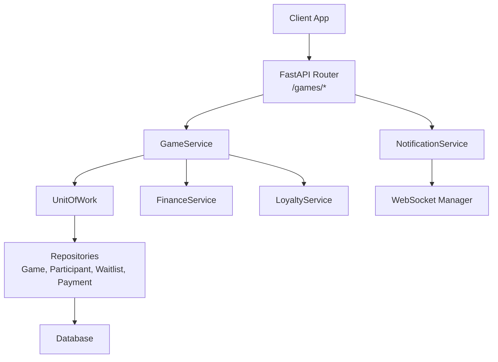
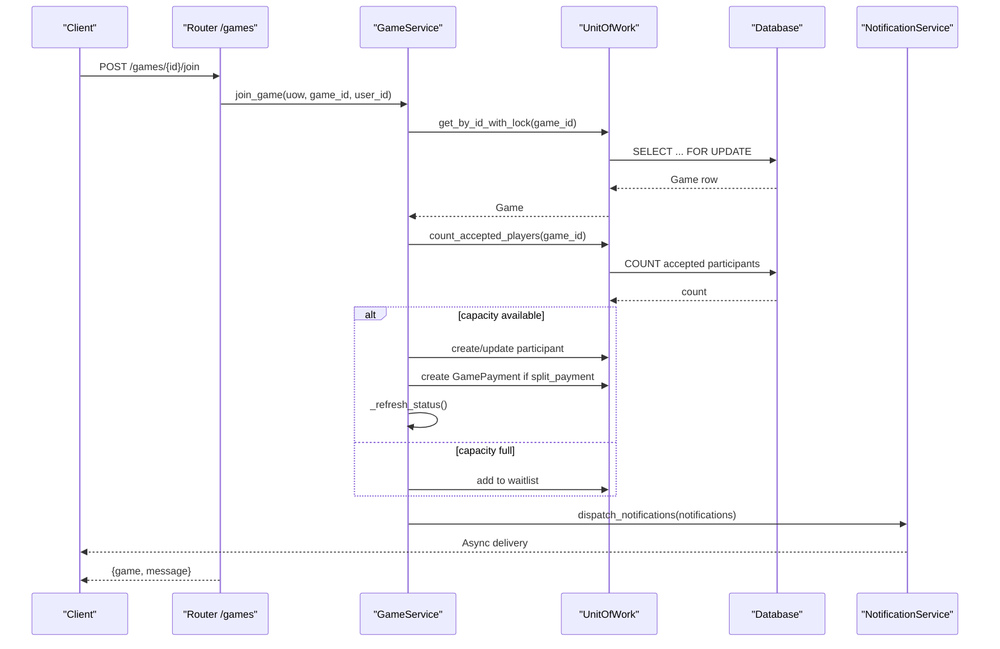
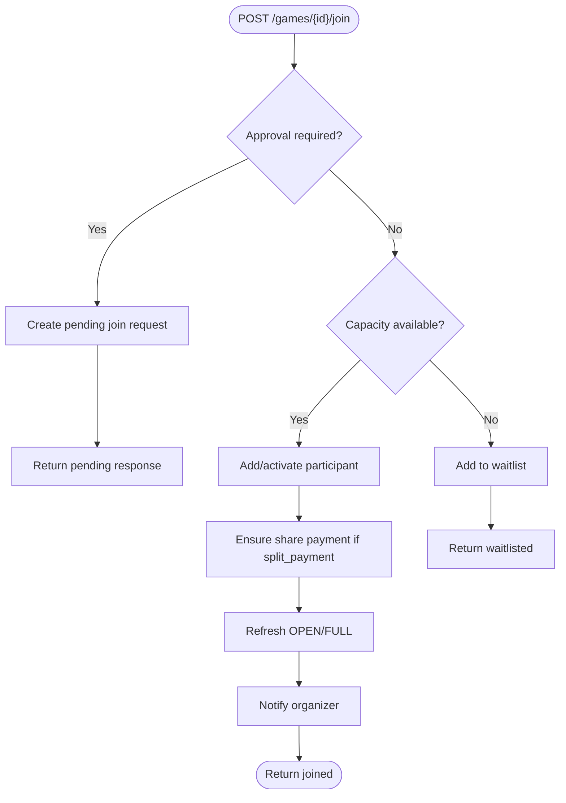
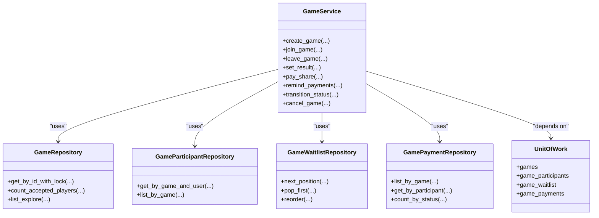

# Games API

<cite>
**Referenced Files in This Document**
- [games.py](file://app/api/v1/games.py)
- [game_service.py](file://app/services/game_service.py)
- [game_repository.py](file://app/repositories/game_repository.py)
- [game.py](file://app/models/game.py)
- [schemas/game.py](file://app/schemas/game.py)
- [auth.py](file://app/utils/auth.py)
- [websocket.py](file://app/utils/websocket.py)
- [unit_of_work.py](file://app/unit_of_work.py)
</cite>

## Table of Contents
1. [Introduction](#introduction)
2. [Project Structure](#project-structure)
3. [Core Components](#core-components)
4. [Architecture Overview](#architecture-overview)
5. [Detailed Component Analysis](#detailed-component-analysis)
6. [Dependency Analysis](#dependency-analysis)
7. [Performance Considerations](#performance-considerations)
8. [Troubleshooting Guide](#troubleshooting-guide)
9. [Conclusion](#conclusion)
10. [Appendices](#appendices)

## Introduction
This document provides detailed API documentation for game management endpoints in the Futsal Booking System backend. It covers:
- Creating open games and listing discoverable games
- Joining, leaving, and managing participants
- Handling invitations and invite links
- Managing waitlists
- Processing share payments and reminders
- Setting game results and tracking outcomes
- Authentication requirements, request/response schemas, and game lifecycle states
- Real-time updates via notifications to participants

The API is built with FastAPI and uses a service/repository pattern backed by SQLModel/SQLAlchemy. Game state transitions are enforced server-side to ensure consistency and concurrency safety.

## Project Structure
Game-related functionality spans several layers:
- API layer (FastAPI routes) under app/api/v1/games.py
- Business logic in app/services/game_service.py
- Data access in app/repositories/game_repository.py
- Domain models in app/models/game.py
- Request/response schemas in app/schemas/game.py
- Authentication helpers in app/utils/auth.py
- WebSocket utilities for real-time messaging in app/utils/websocket.py
- Unit of Work for transactional boundaries in app/unit_of_work.py

**Diagram sources**
- [games.py:63-482](file://app/api/v1/games.py#L63-L482)
- [game_service.py:47-1214](file://app/services/game_service.py#L47-L1214)
- [unit_of_work.py:38-200](file://app/unit_of_work.py#L38-L200)
- [game_repository.py:26-361](file://app/repositories/game_repository.py#L26-L361)
- [websocket.py:12-66](file://app/utils/websocket.py#L12-L66)

**Section sources**
- [games.py:1-482](file://app/api/v1/games.py#L1-L482)
- [game_service.py:1-1214](file://app/services/game_service.py#L1-L1214)
- [game_repository.py:1-361](file://app/repositories/game_repository.py#L1-L361)
- [game.py:1-258](file://app/models/game.py#L1-L258)
- [schemas/game.py:1-287](file://app/schemas/game.py#L1-L287)
- [auth.py:1-113](file://app/utils/auth.py#L1-L113)
- [websocket.py:1-66](file://app/utils/websocket.py#L1-L66)
- [unit_of_work.py:1-322](file://app/unit_of_work.py#L1-L322)

## Core Components
- Game entity and related entities: Game, GameParticipant, GameJoinRequest, GameInvitation, GameInviteLink, GameWaitlist, GamePayment
- Schemas: GameCreate, GameUpdate, GameResponse, ParticipantResponse, InvitationResponse, InviteLinkResponse, WaitlistResponse, GamePaymentSummary, GameResultRequest/Response
- Services: GameService encapsulates all business rules, including join/leave flows, waitlist promotion, status transitions, result setting, payment handling, and notifications
- Repositories: Query builders for explore list, counts, participant lists, invitations, invites, waitlist, and payments
- Auth: JWT-based authentication; optional user for public endpoints
- Notifications: Asynchronous dispatch to users or broadcast to participants

Key domain enums:
- GameStatus: draft, open, full, started, completed, cancelled
- GameVisibility: private, public, public_approval
- PaymentMode: organizer_pays, split_payment, free
- ParticipantRole: organizer, admin, member
- ParticipantStatus: invited, pending, accepted, rejected, left, removed
- JoinPolicy: open, approval
- WaitlistStatus: waitlisted, promoted, left
- GamePaymentStatus: pending, paid, failed, refunded

**Section sources**
- [game.py:20-93](file://app/models/game.py#L20-L93)
- [schemas/game.py:9-287](file://app/schemas/game.py#L9-L287)
- [game_service.py:47-1214](file://app/services/game_service.py#L47-L1214)
- [game_repository.py:26-361](file://app/repositories/game_repository.py#L26-L361)

## Architecture Overview
The API follows a layered architecture:
- Routes validate inputs and delegate to GameService
- GameService enforces business rules, manages transactions via UnitOfWork, and coordinates side effects (finance, loyalty, notifications)
- Repositories perform efficient queries and enforce data integrity
- Notifications are dispatched asynchronously to users or broadcast to all accepted participants

**Diagram sources**
- [games.py:242-253](file://app/api/v1/games.py#L242-L253)
- [game_service.py:341-429](file://app/services/game_service.py#L341-L429)
- [game_repository.py:38-44](file://app/repositories/game_repository.py#L38-L44)
- [game_service.py:113-124](file://app/services/game_service.py#L113-L124)
- [game_service.py:1192-1214](file://app/services/game_service.py#L1192-L1214)

## Detailed Component Analysis

### Authentication and Authorization
- Most endpoints require a valid Bearer token via HTTP Basic scheme
- Some endpoints support optional user context for public discovery and preview
- Role checks are enforced at the service level for organizers/admins

Authentication flow:
- get_current_user validates JWT and returns an active User
- Optional user helper allows anonymous access where permitted

Authorization patterns:
- Manage permission requires accepted participant with role organizer or admin
- Organizer-only actions include canceling games and changing roles

**Section sources**
- [auth.py:85-112](file://app/utils/auth.py#L85-L112)
- [games.py:37-58](file://app/api/v1/games.py#L37-L58)
- [game_service.py:69-86](file://app/services/game_service.py#L69-L86)

### Game Creation and Discovery
- Create a game on a confirmed booking owned by the current user
- Explore endpoint supports filtering by sport, skill level, venue, date/time ranges, max price per player, availability only, and sorting by soonest/nearest/cheapest/most_available/popular
- My games lists games organized or joined by the current user

Request/response highlights:
- Create: GameCreate schema fields include booking_id, name, description, sport, max_players, skill_level, visibility, payment_mode
- Explore: Returns items array with enriched details (venue, slot, price_per_player, distance_km when lat/lng provided)
- My games: List of GameResponse objects

**Section sources**
- [games.py:63-107](file://app/api/v1/games.py#L63-L107)
- [game_service.py:166-203](file://app/services/game_service.py#L166-L203)
- [game_service.py:284-337](file://app/services/game_service.py#L284-L337)
- [schemas/game.py:54-117](file://app/schemas/game.py#L54-L117)
- [game_repository.py:60-127](file://app/repositories/game_repository.py#L60-L127)

### Joining and Leaving Games
- Join by direct route or via invite token
- If join policy requires approval, a pending join request is created and organizer must approve
- If capacity is full, user is added to waitlist
- Leave removes participant and triggers refund/refund recording if needed; waitlist promotion occurs automatically

Flow overview:

**Diagram sources**
- [game_service.py:341-429](file://app/services/game_service.py#L341-L429)
- [game_service.py:431-462](file://app/services/game_service.py#L431-L462)
- [game_service.py:127-162](file://app/services/game_service.py#L127-L162)

**Section sources**
- [games.py:154-165](file://app/api/v1/games.py#L154-L165)
- [games.py:242-264](file://app/api/v1/games.py#L242-L264)
- [game_service.py:341-462](file://app/services/game_service.py#L341-L462)

### Participant Management
- List participants with payment status
- Set participant role (organizer can promote/demote admins)
- Remove participant (admin/organizer only); triggers refund/refund recording and waitlist promotion

Permissions:
- Only organizer can change roles
- Only organizer/admin can remove participants

**Section sources**
- [games.py:269-298](file://app/api/v1/games.py#L269-L298)
- [game_service.py:1026-1067](file://app/services/game_service.py#L1026-L1067)
- [game_service.py:501-539](file://app/services/game_service.py#L501-L539)

### Join Requests
- Organizers can list pending join requests
- Approve or reject requests; approval adds participant and ensures payment; rejection notifies requester

**Section sources**
- [games.py:303-333](file://app/api/v1/games.py#L303-L333)
- [game_service.py:543-613](file://app/services/game_service.py#L543-L613)

### Invitations and Invite Links
- Direct invitations to specific users with optional expiration
- Accept/Reject invitations; acceptance joins the game directly bypassing approval policy
- Generate invite links with optional expiration and max uses; disable/regenerate links
- Public preview of game via token without exposing game ID

Security:
- Token-based joining avoids direct ID exposure
- Link validation checks activity, expiration, and usage limits

**Section sources**
- [games.py:112-165](file://app/api/v1/games.py#L112-L165)
- [games.py:338-407](file://app/api/v1/games.py#L338-L407)
- [game_service.py:617-800](file://app/services/game_service.py#L617-L800)

### Waitlist Management
- Join waitlist if not already waiting and game is open
- Leave waitlist; positions are reordered after changes
- Organizers can view waitlist

Promotion:
- When capacity opens (leave/remove), first waitlisted user is promoted to participant with payment ensured

**Section sources**
- [games.py:412-438](file://app/api/v1/games.py#L412-L438)
- [game_service.py:805-842](file://app/services/game_service.py#L805-L842)
- [game_repository.py:281-336](file://app/repositories/game_repository.py#L281-L336)

### Game Payments
- Get payment summary: mode, total price, price per player, counts, and per-participant payment records
- Remind unpaid participants (rate-limited per minute per actor)
- Pay share: creates or completes a payment record, records income in ledger, notifies organizer

Rules:
- Split payment mode creates per-participant shares
- Refunds recorded when participants leave or game is canceled
- Idempotency keys prevent duplicate ledger entries

**Section sources**
- [games.py:443-481](file://app/api/v1/games.py#L443-L481)
- [game_service.py:1071-1188](file://app/services/game_service.py#L1071-L1188)
- [game_service.py:464-482](file://app/services/game_service.py#L464-L482)

### Game Results Tracking
- Set result: organizer/admin sets winners among accepted participants; marks game as completed; awards loyalty points to winners
- Result is idempotent; cannot be set twice

**Section sources**
- [games.py:229-237](file://app/api/v1/games.py#L229-L237)
- [game_service.py:919-970](file://app/services/game_service.py#L919-L970)

### Game Lifecycle States and Transitions
Valid transitions:
- OPEN/FULL → STARTED (via start endpoint)
- STARTED → COMPLETED (via complete endpoint)
- Any non-started/non-completed → CANCELLED (organizer only)

State enforcement:
- Status changes are validated server-side
- Updates via PATCH do not allow arbitrary status changes; use dedicated endpoints

Real-time updates:
- Status transitions emit notifications broadcast to all accepted participants

**Section sources**
- [game_service.py:889-917](file://app/services/game_service.py#L889-L917)
- [game_service.py:972-1022](file://app/services/game_service.py#L972-L1022)
- [game_service.py:1192-1214](file://app/services/game_service.py#L1192-L1214)

### Real-Time Updates
Notifications are dispatched asynchronously:
- Per-user messages for invitations, approvals, payments, reminders
- Broadcast to all accepted participants for capacity changes, status transitions, cancellations

WebSocket utility supports role-based rooms and per-user messaging.

**Section sources**
- [game_service.py:1192-1214](file://app/services/game_service.py#L1192-L1214)
- [websocket.py:12-66](file://app/utils/websocket.py#L12-L66)

## Dependency Analysis

**Diagram sources**
- [game_service.py:47-1214](file://app/services/game_service.py#L47-L1214)
- [game_repository.py:26-361](file://app/repositories/game_repository.py#L26-L361)
- [unit_of_work.py:160-200](file://app/unit_of_work.py#L160-L200)

**Section sources**
- [game_service.py:47-1214](file://app/services/game_service.py#L47-L1214)
- [game_repository.py:26-361](file://app/repositories/game_repository.py#L26-L361)
- [unit_of_work.py:38-200](file://app/unit_of_work.py#L38-L200)

## Performance Considerations
- Concurrency safety: Critical operations lock rows using SELECT ... FOR UPDATE to prevent race conditions during join/leave/waitlist promotions
- Efficient queries: Explore list uses batched counts and joins to avoid N+1 problems
- Sorting and pagination: Server-side sorting for nearest/cheapest/most_available/popular with appropriate limits
- Notification dispatch: Asynchronous to avoid blocking request-response time

[No sources needed since this section provides general guidance]

## Troubleshooting Guide
Common errors and resolutions:
- GAME_NOT_FOUND: Verify game_id exists
- NOT_AUTHORIZED: Ensure you are an accepted participant with organizer/admin role for management actions
- GAME_CANCELLED/GAME_STARTED/GAME_COMPLETED: Cannot join or modify in these states
- ALREADY_JOINED/ALREADY_WAITLISTED: Duplicate action prevented
- INVALID_STATUS_TRANSITION: Use dedicated start/complete endpoints instead of PATCH
- PAYMENT_NOT_REQUIRED: Game does not use split payment
- PAYMENT_ALREADY_PAID: Share already marked as paid
- RESULT_ALREADY_SET: Result can be set once per game

Resolution tips:
- For approval-required games, submit a join request and wait for organizer decision
- For full games, join the waitlist and monitor position
- For payment issues, check payment summary and retry pay_share if necessary

**Section sources**
- [game_service.py:69-86](file://app/services/game_service.py#L69-L86)
- [game_service.py:341-429](file://app/services/game_service.py#L341-L429)
- [game_service.py:1092-1152](file://app/services/game_service.py#L1092-L1152)
- [game_service.py:919-970](file://app/services/game_service.py#L919-L970)

## Conclusion
The Games API provides a robust, secure, and scalable system for managing group games with clear lifecycle states, participant workflows, waitlist handling, share payments, and result tracking. Authentication and authorization are enforced consistently, and real-time notifications keep participants informed. The service-layer design ensures business rule integrity and concurrency safety, while repositories optimize data access patterns.

[No sources needed since this section summarizes without analyzing specific files]

## Appendices

### API Endpoints Summary
- POST /games — Create game
- GET /games — Explore games
- GET /games/my — My games
- GET /games/{id} — Game details
- PATCH /games/{id} — Update game (name, description, max_players, skill_level, visibility)
- DELETE /games/{id} — Cancel game (organizer only)
- POST /games/{id}/start — Start game
- POST /games/{id}/complete — Complete game
- POST /games/{id}/result — Set result (winners)
- POST /games/{id}/join — Join game
- POST /games/{id}/leave — Leave game
- GET /games/{id}/participants — List participants
- PATCH /games/{id}/participants/{user_id} — Set participant role
- DELETE /games/{id}/participants/{user_id} — Remove participant
- GET /games/{id}/join-requests — List join requests (organizer)
- POST /games/{id}/join-requests/{request_id}/approve — Approve request
- POST /games/{id}/join-requests/{request_id}/reject — Reject request
- POST /games/{id}/invitations — Invite user
- GET /games/{id}/invitations — List invitations (organizer)
- POST /games/{id}/invite-links — Create invite link
- GET /games/{id}/invite-links — List invite links
- POST /games/{id}/invite-links/{link_id}/disable — Disable link
- POST /games/{id}/invite-links/{link_id}/regenerate — Regenerate link
- GET /games/join/{token} — Preview invite token
- POST /games/join/{token} — Join by token
- GET /games/{id}/waitlist — List waitlist (organizer)
- POST /games/{id}/waitlist — Join waitlist
- DELETE /games/{id}/waitlist — Leave waitlist
- GET /games/{id}/payments — Payment summary
- POST /games/{id}/payments/remind — Remind payments (rate-limited)
- POST /games/{id}/payments/{participant_id}/pay — Pay share

Authentication:
- Most endpoints require Bearer token
- Some endpoints support optional user context

**Section sources**
- [games.py:63-482](file://app/api/v1/games.py#L63-L482)
- [auth.py:85-112](file://app/utils/auth.py#L85-L112)