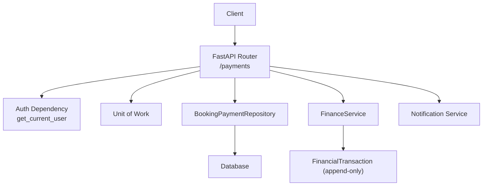
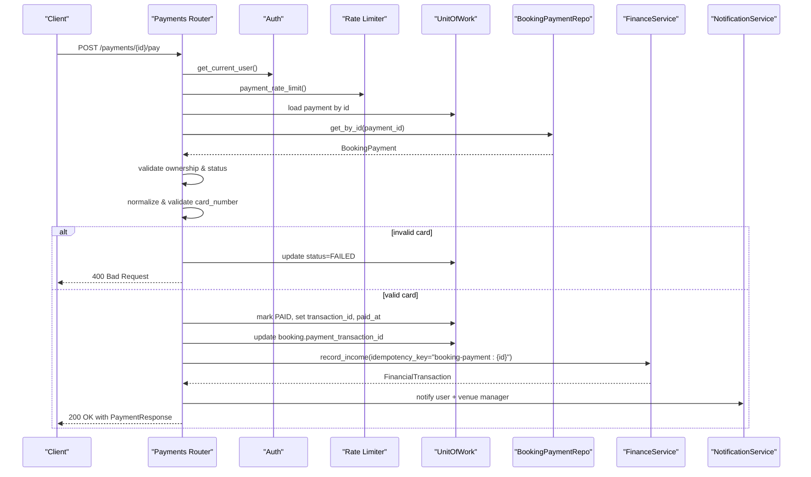
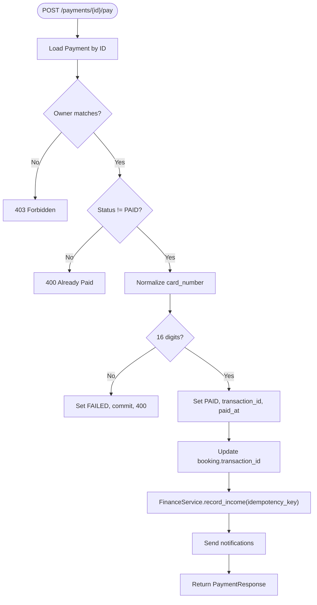
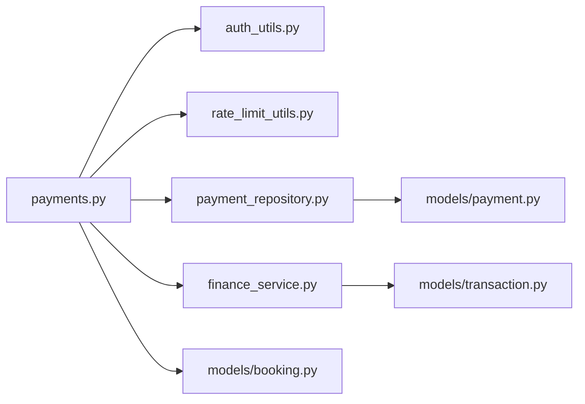

# Payments API

<cite>
**Referenced Files in This Document**
- [payments.py](file://app/api/v1/payments.py)
- [payment.py](file://app/models/payment.py)
- [payment_schema.py](file://app/schemas/payment.py)
- [payment_repository.py](file://app/repositories/payment_repository.py)
- [finance_service.py](file://app/services/finance_service.py)
- [transaction_model.py](file://app/models/transaction.py)
- [auth_utils.py](file://app/utils/auth.py)
- [rate_limit_utils.py](file://app/utils/rate_limit.py)
- [booking_model.py](file://app/models/booking.py)
</cite>

## Table of Contents
1. [Introduction](#introduction)
2. [Project Structure](#project-structure)
3. [Core Components](#core-components)
4. [Architecture Overview](#architecture-overview)
5. [Detailed Component Analysis](#detailed-component-analysis)
6. [Dependency Analysis](#dependency-analysis)
7. [Performance Considerations](#performance-considerations)
8. [Troubleshooting Guide](#troubleshooting-guide)
9. [Conclusion](#conclusion)
10. [Appendices](#appendices)

## Introduction
This document provides comprehensive API documentation for payment processing endpoints related to booking payments. It covers:
- Payment initiation (creating a payable invoice for a confirmed booking)
- Payment method selection and validation (mock gateway with card details)
- Payment status tracking (list user payments)
- Payment confirmation workflow (simulate gateway success, ledger recording, notifications)
- Refund and reconciliation via the finance subsystem
- Security measures (authentication, rate limiting), error handling, and transaction integrity

The system uses an append-only financial ledger to ensure auditability and reconciliation.

## Project Structure
Payment functionality is implemented across FastAPI routes, Pydantic schemas, SQLModel entities, repositories, and services:
- Routes: app/api/v1/payments.py
- Schemas: app/schemas/payment.py
- Models: app/models/payment.py, app/models/transaction.py, app/models/booking.py
- Repositories: app/repositories/payment_repository.py
- Services: app/services/finance_service.py
- Security and rate limiting: app/utils/auth.py, app/utils/rate_limit.py

**Diagram sources**
- [payments.py:1-175](file://app/api/v1/payments.py#L1-L175)
- [payment_repository.py:1-53](file://app/repositories/payment_repository.py#L1-L53)
- [finance_service.py:129-228](file://app/services/finance_service.py#L129-L228)
- [auth_utils.py:85-107](file://app/utils/auth.py#L85-L107)
- [rate_limit_utils.py:66-70](file://app/utils/rate_limit.py#L66-L70)

**Section sources**
- [payments.py:1-175](file://app/api/v1/payments.py#L1-L175)
- [payment_schema.py:1-32](file://app/schemas/payment.py#L1-L32)
- [payment.py:1-29](file://app/models/payment.py#L1-L29)
- [transaction_model.py:20-119](file://app/models/transaction.py#L20-L119)
- [booking_model.py:21-51](file://app/models/booking.py#L21-L51)
- [payment_repository.py:1-53](file://app/repositories/payment_repository.py#L1-L53)
- [finance_service.py:129-228](file://app/services/finance_service.py#L129-L228)
- [auth_utils.py:85-107](file://app/utils/auth.py#L85-L107)
- [rate_limit_utils.py:66-70](file://app/utils/rate_limit.py#L66-L70)

## Core Components
- Payment routes: create invoice, pay invoice, list user payments
- Data models: BookingPayment (status lifecycle), FinancialTransaction (ledger entries)
- Schemas: request/response contracts for payment operations
- Repository: queries for pending/paid/latest payments per booking/user
- Finance service: idempotent income recording, refunds, voiding, reporting
- Security: JWT-based authentication, role checks, rate limiting

Key responsibilities:
- Validate booking eligibility and ownership before creating or paying
- Normalize and validate card input; simulate gateway success
- Record income in the ledger with idempotency keys
- Update booking with transaction reference
- Send notifications to user and venue manager

**Section sources**
- [payments.py:42-175](file://app/api/v1/payments.py#L42-L175)
- [payment.py:7-29](file://app/models/payment.py#L7-L29)
- [payment_schema.py:6-32](file://app/schemas/payment.py#L6-L32)
- [payment_repository.py:13-53](file://app/repositories/payment_repository.py#L13-L53)
- [finance_service.py:129-228](file://app/services/finance_service.py#L129-L228)

## Architecture Overview
End-to-end flow for initiating and confirming a booking payment:

**Diagram sources**
- [payments.py:81-162](file://app/api/v1/payments.py#L81-L162)
- [finance_service.py:129-161](file://app/services/finance_service.py#L129-L161)
- [auth_utils.py:85-107](file://app/utils/auth.py#L85-L107)
- [rate_limit_utils.py:66-70](file://app/utils/rate_limit.py#L66-L70)

## Detailed Component Analysis

### Endpoints

#### Create Payment Invoice
- Method: POST
- Path: /payments
- Authentication: Bearer token required
- Rate limit: payment_rate_limit applied
- Request body:
  - booking_id: integer (required)
- Response: PaymentResponse
- Validation rules:
  - Booking must exist
  - Booking must belong to current user
  - Booking status must be CONFIRMED
  - Booking must not already have a paid payment
  - If a pending invoice exists for the booking, return it (idempotent creation)
- Side effects:
  - Creates BookingPayment with status PENDING and mock gateway authority
  - Persists via UnitOfWork

Error responses:
- 404: Booking not found
- 403: Not your booking
- 400: Booking not confirmed or already paid

**Section sources**
- [payments.py:42-78](file://app/api/v1/payments.py#L42-L78)
- [payment_schema.py:6-8](file://app/schemas/payment.py#L6-L8)
- [payment_repository.py:23-35](file://app/repositories/payment_repository.py#L23-L35)

#### Pay Payment (Confirm Payment)
- Method: POST
- Path: /payments/{payment_id}/pay
- Authentication: Bearer token required
- Rate limit: payment_rate_limit applied
- Request body:
  - card_number: string (16 digits after normalization)
  - cvv: string
  - month: optional integer 1..12
  - year: optional integer 1300..1500
- Response: PaymentResponse
- Validation rules:
  - Payment must exist and belong to current user
  - Payment must not already be PAID
  - Card number normalized and validated to exactly 16 digits
- Side effects on success:
  - Set payment status to PAID, store last 4 digits (card_pan), paid_at
  - Generate transaction_id and persist
  - Update booking.payment_transaction_id
  - Record income in ledger with idempotency key "booking-payment:{payment_id}"
  - Send notifications to user and venue manager
- Error responses:
  - 404: Payment not found
  - 403: Not your payment
  - 400: Already paid or invalid card number

**Diagram sources**
- [payments.py:81-162](file://app/api/v1/payments.py#L81-L162)
- [finance_service.py:129-161](file://app/services/finance_service.py#L129-L161)

**Section sources**
- [payments.py:81-162](file://app/api/v1/payments.py#L81-L162)
- [payment_schema.py:10-15](file://app/schemas/payment.py#L10-L15)
- [payment_repository.py:30-35](file://app/repositories/payment_repository.py#L30-L35)

#### List My Payments
- Method: GET
- Path: /payments/my
- Authentication: Bearer token required
- Query parameters:
  - limit: integer 1..200 (default 50)
  - offset: integer >= 0 (default 0)
- Response: Array of PaymentResponse
- Behavior: Returns paginated payments for the current user ordered by creation time descending

**Section sources**
- [payments.py:165-175](file://app/api/v1/payments.py#L165-L175)
- [payment_repository.py:13-21](file://app/repositories/payment_repository.py#L13-L21)

### Data Models and Schemas

#### BookingPayment
- Fields include id, booking_id, user_id, amount, status, gateway, authority, transaction_id, card_pan, created_at, paid_at
- Statuses: pending, paid, failed, refunded

#### PaymentRequest/Response
- PaymentCreate: booking_id
- PaymentPayRequest: card_number, cvv, optional month/year
- PaymentResponse: full payment snapshot including timestamps and identifiers

#### FinancialTransaction (Ledger)
- Append-only ledger with types: payment, receivable, refund, discount, expense, credit, transfer, adjustment
- Direction: income, expense
- Method: cash, card_to_card, gateway, pos, credit, other
- Status: pending, cleared, voided
- Idempotency key supported to prevent duplicate postings

**Section sources**
- [payment.py:7-29](file://app/models/payment.py#L7-L29)
- [payment_schema.py:6-32](file://app/schemas/payment.py#L6-L32)
- [transaction_model.py:20-119](file://app/models/transaction.py#L20-L119)

### Business Rules and Validation
- Only CONFIRMED bookings can be invoiced and paid
- Ownership checks enforced at both booking and payment levels
- Duplicate payment prevention via repository checks
- Card number normalization supports multiple digit sets; strict length validation
- Idempotent income posting using idempotency_key prevents double accounting
- Notifications sent upon successful payment to user and venue manager

**Section sources**
- [payments.py:50-66](file://app/api/v1/payments.py#L50-L66)
- [payments.py:90-103](file://app/api/v1/payments.py#L90-L103)
- [payments.py:125-137](file://app/api/v1/payments.py#L125-L137)
- [payment_repository.py:23-35](file://app/repositories/payment_repository.py#L23-L35)

### Refunds and Reconciliation
- Refunds are recorded as new ledger entries (type REFUND, direction EXPENSE) via FinanceService.record_refund
- Original income rows are never modified; corrections use adjustments/refunds or voiding
- Voiding transactions marks them as voided with a reason; clearing transitions pending to cleared
- Reconciliation relies on summing ledger entries; reports available through finance endpoints

Integration points:
- Use FinanceService methods to record refunds and void/clear transactions
- Ensure idempotency keys when issuing refunds to avoid duplicates

**Section sources**
- [finance_service.py:199-228](file://app/services/finance_service.py#L199-L228)
- [finance_service.py:284-307](file://app/services/finance_service.py#L284-L307)
- [transaction_model.py:20-49](file://app/models/transaction.py#L20-L49)

### Security and Access Control
- Authentication: JWT Bearer token via get_current_user
- Authorization: Role-based access for admin/manager where applicable
- Rate limiting: Fixed-window Redis-based limiter for sensitive endpoints (payment_rate_limit)
- Graceful degradation: If Redis is unavailable, rate limiting logs warning and allows requests

**Section sources**
- [auth_utils.py:85-107](file://app/utils/auth.py#L85-L107)
- [rate_limit_utils.py:42-70](file://app/utils/rate_limit.py#L42-L70)

## Dependency Analysis
High-level dependencies among components:

**Diagram sources**
- [payments.py:1-175](file://app/api/v1/payments.py#L1-L175)
- [payment_repository.py:1-53](file://app/repositories/payment_repository.py#L1-L53)
- [finance_service.py:129-228](file://app/services/finance_service.py#L129-L228)
- [payment.py:1-29](file://app/models/payment.py#L1-L29)
- [transaction_model.py:20-119](file://app/models/transaction.py#L20-L119)
- [booking_model.py:21-51](file://app/models/booking.py#L21-L51)

**Section sources**
- [payments.py:1-175](file://app/api/v1/payments.py#L1-L175)
- [payment_repository.py:1-53](file://app/repositories/payment_repository.py#L1-L53)
- [finance_service.py:129-228](file://app/services/finance_service.py#L129-L228)

## Performance Considerations
- Idempotent ledger postings prevent duplicate writes and reduce reconciliation overhead
- Paginated listing of payments reduces payload size and improves client performance
- Rate limiting protects backend resources during high traffic
- Append-only ledger design ensures consistent reads without complex rollbacks

[No sources needed since this section provides general guidance]

## Troubleshooting Guide
Common issues and resolutions:
- Invalid card number: Normalization fails or length mismatch; payment marked FAILED and returns 400
- Already paid: Attempting to pay again returns 400; check payment status
- Unauthorized: Missing or invalid JWT returns 401; verify token and user activity status
- Rate limited: Exceeds allowed requests within window returns 429; retry after delay
- Redis unavailable: Rate limiter degrades gracefully; monitor logs for warnings

Operational tips:
- Use finance transaction export to reconcile discrepancies
- Verify idempotency keys when replaying payment confirmations
- Audit voided transactions for corrections and reasons

**Section sources**
- [payments.py:90-103](file://app/api/v1/payments.py#L90-L103)
- [payments.py:95-96](file://app/api/v1/payments.py#L95-L96)
- [auth_utils.py:85-107](file://app/utils/auth.py#L85-L107)
- [rate_limit_utils.py:56-61](file://app/utils/rate_limit.py#L56-L61)
- [finance_service.py:284-307](file://app/services/finance_service.py#L284-L307)

## Conclusion
The Payments API provides a secure, auditable, and idempotent workflow for initiating and confirming booking payments. It integrates with an append-only financial ledger for robust reconciliation and supports refunds and voiding through dedicated finance operations. Authentication, authorization, and rate limiting protect endpoints while maintaining reliability under failure conditions.

[No sources needed since this section summarizes without analyzing specific files]

## Appendices

### HTTP Methods and URL Patterns Summary
- POST /payments — Create payment invoice for a confirmed booking
- POST /payments/{payment_id}/pay — Confirm payment with card details
- GET /payments/my — List current user’s payments with pagination

**Section sources**
- [payments.py:42-175](file://app/api/v1/payments.py#L42-L175)

### Request/Response Schemas
- PaymentCreate: booking_id
- PaymentPayRequest: card_number, cvv, optional month/year
- PaymentResponse: id, booking_id, user_id, amount, status, gateway, authority, transaction_id, card_pan, created_at, paid_at

**Section sources**
- [payment_schema.py:6-32](file://app/schemas/payment.py#L6-L32)

### Authentication Requirements
- All endpoints require a valid JWT Bearer token
- get_current_user validates token and active user status

**Section sources**
- [auth_utils.py:85-107](file://app/utils/auth.py#L85-L107)

### Payment Validation Rules
- Booking must be CONFIRMED and owned by requester
- Payment must not already be PAID
- Card number must be exactly 16 digits after normalization
- Idempotent income posting prevents duplicates

**Section sources**
- [payments.py:50-66](file://app/api/v1/payments.py#L50-L66)
- [payments.py:90-103](file://app/api/v1/payments.py#L90-L103)
- [payments.py:125-137](file://app/api/v1/payments.py#L125-L137)

### Integrating with Payment Gateways
- Current implementation simulates gateway success
- To integrate a real gateway:
  - Replace mock logic with gateway calls in pay endpoint
  - Maintain idempotency_key semantics for confirmations
  - Persist gateway-specific fields (e.g., authority, provider response)
  - Ensure ledger records reflect actual method and timestamps

**Section sources**
- [payments.py:105-137](file://app/api/v1/payments.py#L105-L137)
- [transaction_model.py:36-43](file://app/models/transaction.py#L36-L43)

### Transaction Reconciliation Processes
- Use finance endpoints to list, filter, and export transactions
- Leverage idempotency keys to detect and prevent duplicate entries
- Void incorrect entries instead of deleting; record reasons for audit

**Section sources**
- [finance_service.py:199-228](file://app/services/finance_service.py#L199-L228)
- [finance_service.py:284-307](file://app/services/finance_service.py#L284-L307)
- [transaction_model.py:84-119](file://app/models/transaction.py#L84-L119)