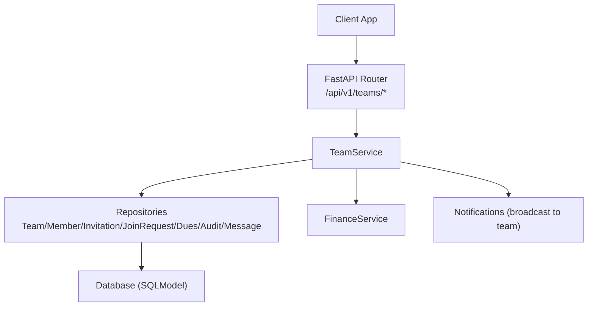
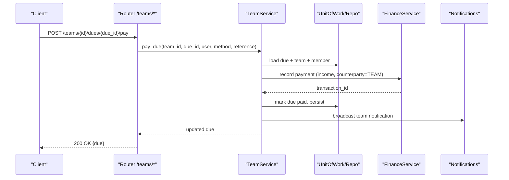
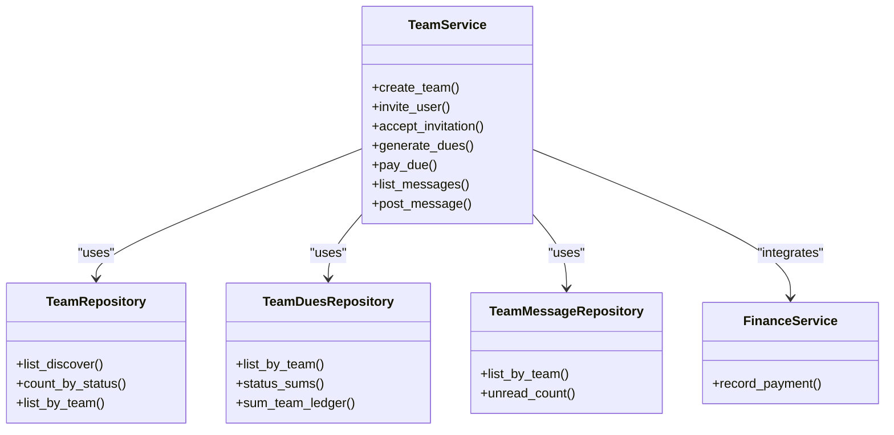

# Teams API

<cite>
**Referenced Files in This Document**
- [teams.py](file://app/api/v1/teams.py)
- [team_service.py](file://app/services/team_service.py)
- [team_repository.py](file://app/repositories/team_repository.py)
- [team.py](file://app/models/team.py)
- [team_schemas.py](file://app/schemas/team.py)
- [auth.py](file://app/utils/auth.py)
- [test_teams_crud.py](file://tests/test_teams_crud.py)
- [test_teams_roster.py](file://tests/test_teams_roster.py)
- [test_teams_dues.py](file://tests/test_teams_dues.py)
- [test_teams_official_chat.py](file://tests/test_teams_official_chat.py)
</cite>

## Table of Contents
1. [Introduction](#introduction)
2. [Project Structure](#project-structure)
3. [Core Components](#core-components)
4. [Architecture Overview](#architecture-overview)
5. [Detailed Component Analysis](#detailed-component-analysis)
6. [Dependency Analysis](#dependency-analysis)
7. [Performance Considerations](#performance-considerations)
8. [Troubleshooting Guide](#troubleshooting-guide)
9. [Conclusion](#conclusion)
10. [Appendices](#appendices)

## Introduction
This document provides detailed API documentation for the Teams module, covering team creation, member invitations and management, official chat functionality, team bookings linkage, dues generation/payment/voiding, and financial tracking. It specifies HTTP methods, URL patterns, request/response schemas, authentication requirements, and team-based permissions. It also includes practical workflows for team formation, role management, group booking coordination, and financial tracking for team activities.

## Project Structure
The Teams API is implemented as a FastAPI router with service-layer business logic, repository-layer data access, and Pydantic schemas for validation and response modeling. Models define persistent entities such as teams, members, invitations, join requests, dues, messages, audit events, and team-bookings. Tests validate behavior across CRUD, roster, dues, and chat features.

**Diagram sources**
- [teams.py:27-422](file://app/api/v1/teams.py#L27-L422)
- [team_service.py:59-1213](file://app/services/team_service.py#L59-L1213)
- [team_repository.py:22-403](file://app/repositories/team_repository.py#L22-L403)

**Section sources**
- [teams.py:27-422](file://app/api/v1/teams.py#L27-L422)
- [team_service.py:59-1213](file://app/services/team_service.py#L59-L1213)
- [team_repository.py:22-403](file://app/repositories/team_repository.py#L22-L403)

## Core Components
- Team lifecycle: create, update, deactivate, discover, get details
- Membership: invite, accept/decline, remove, leave, transfer captain, set roles, list members
- Join requests: public teams allow join requests; admins approve/reject
- Dues: generate per-member shares, pay, void, list with filters, compute balance
- Bookings: link existing bookings to a team for attribution
- Chat: post/list messages with cursor pagination, mark read, unread count
- Audit: immutable log of team actions

Authentication and permissions:
- All endpoints require a valid JWT Bearer token via get_current_user.
- Some endpoints additionally require manager roles (venue_manager, club_admin, super_admin).
- Team-level RBAC enforced by service helpers: only active members can act; captains/admins have elevated privileges.

**Section sources**
- [auth.py:85-112](file://app/utils/auth.py#L85-L112)
- [team_service.py:82-135](file://app/services/team_service.py#L82-L135)
- [team_schemas.py:15-294](file://app/schemas/team.py#L15-L294)

## Architecture Overview
The API follows a layered architecture:
- Router layer validates inputs and delegates to service.
- Service enforces business rules, permissions, notifications, and financial integrations.
- Repository performs SQL queries and aggregates results.
- Models define database schema and enums.

**Diagram sources**
- [teams.py:303-315](file://app/api/v1/teams.py#L303-L315)
- [team_service.py:1000-1100](file://app/services/team_service.py#L1000-L1100)
- [team_repository.py:241-338](file://app/repositories/team_repository.py#L241-L338)

## Detailed Component Analysis

### Authentication and Authorization
- Bearer JWT required on all endpoints via get_current_user.
- Manager-only endpoints use get_current_manager.
- Team-level checks:
  - Active membership required for most operations.
  - Captain/Admin required for management actions (update, invite, role changes, dues generation, voiding).
  - Private teams restrict visibility to members or pending invitees.

**Section sources**
- [auth.py:85-112](file://app/utils/auth.py#L85-L112)
- [team_service.py:82-135](file://app/services/team_service.py#L82-L135)

### Team Creation and Discovery
- Create team: POST /api/v1/teams
  - Request body: name, description, sport, visibility, logo_url
  - Response: TeamResponse including my_role/my_status and flags for pending invitation/join request
  - Creates captain membership and emits notifications
- List my teams: GET /api/v1/teams
- Discover public teams: GET /api/v1/teams/discover?search=&sport=&limit=&offset=
- Get team details: GET /api/v1/teams/{team_id}
- Update team: PUT /api/v1/teams/{team_id}
- Deactivate team: DELETE /api/v1/teams/{team_id}/deactivate (captain only)

Permissions:
- Create/update/deactivate: requires active membership; update/deactivate further require manage permission (captain/admin); deactivate restricted to captain.

Errors:
- TEAM_NAME_TAKEN when duplicate name under same captain
- PRIVATE_TEAM when non-member accesses private team
- TEAM_INACTIVE when operating on inactive team

**Section sources**
- [teams.py:36-125](file://app/api/v1/teams.py#L36-L125)
- [team_service.py:187-364](file://app/services/team_service.py#L187-L364)
- [team_schemas.py:15-66](file://app/schemas/team.py#L15-L66)
- [test_teams_crud.py:28-130](file://tests/test_teams_crud.py#L28-L130)

### Member Invitations and Management
- Invite user: POST /api/v1/teams/{team_id}/invite
  - Body: user_id or phone (one required), optional expires_in_days
  - Creates TeamMember (pending) and TeamInvitation; notifies invitee
- Accept invitation: POST /api/v1/teams/{team_id}/invitations/{member_id}/accept
- Decline invitation: POST /api/v1/teams/{team_id}/invitations/{member_id}/decline
- Remove member: POST /api/v1/teams/{team_id}/members/{member_id}/remove
- Set member role: POST /api/v1/teams/{team_id}/members/{member_id}/role
  - Only admin/member roles allowed; captain cannot be changed this way
- Leave team: POST /api/v1/teams/{team_id}/leave
- Transfer captain: POST /api/v1/teams/{team_id}/transfer-captain
  - Requires current captain; target must be active member
- List members: GET /api/v1/teams/{team_id}/members

Permissions:
- Invite/remove/role/transfer: require manage permission (captain/admin)
- Leave: any active member; captain must transfer first
- Accept/decline: invitee only

Errors:
- USER_NOT_FOUND for unknown phone/user
- ALREADY_MEMBER/ALREADY_PENDING for duplicates
- NOT_A_MEMBER for non-members
- CANNOT_REMOVE_CAPTAIN
- CAPTAIN_MUST_TRANSFER

**Section sources**
- [teams.py:130-224](file://app/api/v1/teams.py#L130-L224)
- [team_service.py:389-658](file://app/services/team_service.py#L389-L658)
- [team_schemas.py:70-105](file://app/schemas/team.py#L70-L105)
- [test_teams_roster.py:55-211](file://tests/test_teams_roster.py#L55-L211)

### Join Requests (Public Teams)
- Request join: POST /api/v1/teams/{team_id}/join-request
  - Body: optional message
  - Allowed only for public teams; prevents duplicate requests
- List join requests: GET /api/v1/teams/{team_id}/join-requests (admin only)
- Approve: POST /api/v1/teams/{team_id}/join-requests/{request_id}/approve
- Reject: POST /api/v1/teams/{team_id}/join-requests/{request_id}/reject

Permissions:
- Request join: any authenticated user (public teams only)
- Approve/reject/list: captain/admin

Errors:
- JOIN_NOT_ALLOWED for non-public teams
- ALREADY_REQUESTED if pending request exists

**Section sources**
- [teams.py:227-271](file://app/api/v1/teams.py#L227-L271)
- [team_service.py:661-751](file://app/services/team_service.py#L661-L751)
- [team_schemas.py:123-137](file://app/schemas/team.py#L123-L137)
- [test_teams_roster.py:220-252](file://tests/test_teams_roster.py#L220-L252)

### Official Chat
- List messages: GET /api/v1/teams/{team_id}/messages?limit=&before_id=
  - Cursor-based pagination using before_id; newest first
- Post message: POST /api/v1/teams/{team_id}/messages
  - Body: content (trimmed; empty rejected)
- Mark read: POST /api/v1/teams/{team_id}/messages/read
- Unread count: GET /api/v1/teams/{team_id}/unread-count

Permissions:
- Access requires active membership (private teams enforce visibility)

Behavior:
- Messages are not audited (high volume)
- Notifications fan out to other active members excluding author

**Section sources**
- [teams.py:381-422](file://app/api/v1/teams.py#L381-L422)
- [team_service.py:798-860](file://app/services/team_service.py#L798-L860)
- [team_repository.py:377-403](file://app/repositories/team_repository.py#L377-L403)
- [test_teams_official_chat.py:115-198](file://tests/test_teams_official_chat.py#L115-L198)

### Team Bookings
- List team bookings: GET /api/v1/teams/{team_id}/bookings?limit=&offset=
- Link booking: POST /api/v1/teams/{team_id}/bookings/{booking_id}/link
  - Associates an existing booking to the team; does not modify booking itself

Permissions:
- Requires active membership; linking typically managed by team admins

Notes:
- TeamBooking stores attribution and optional payer user id for accounting context

**Section sources**
- [teams.py:343-364](file://app/api/v1/teams.py#L343-L364)
- [team_repository.py:210-238](file://app/repositories/team_repository.py#L210-L238)

### Dues Generation, Payment, Voiding, and Balance
- List dues: GET /api/v1/teams/{team_id}/dues?status={pending|paid|voided|overdue}&limit=&offset=
  - Members see own dues; captains/admins see all
- Generate dues: POST /api/v1/teams/{team_id}/dues/generate
  - Body: amount, title, due_date, optional member_user_ids subset
  - Idempotent per title/due_date; skips duplicates
- Pay due: POST /api/v1/teams/{team_id}/dues/{due_id}/pay
  - Body: method (cash|gateway|card_to_card), optional reference
  - Records income in ledger with counterparty_type=TEAM; idempotency key team-dues:{due_id}
  - Cash collection restricted to team managers
- Void due: DELETE /api/v1/teams/{team_id}/dues/{due_id}?reason=
  - Only managers; cannot void already paid dues
- Team balance: GET /api/v1/teams/{team_id}/balance
  - Aggregates dues totals/paid/unpaid/overdue and team ledger income/expense/net

Permissions:
- Generate/pay/void/balance: require active membership; generate/void require manage; pay allows self-pay or manager cash collection

Errors:
- BAD_DUE_DATE for past due dates
- NOT_AUTHORIZED for unauthorized pay attempts
- DUE_ALREADY_PAID for re-payment
- DUE_NOT_FOUND for missing due

**Section sources**
- [teams.py:276-338](file://app/api/v1/teams.py#L276-L338)
- [team_service.py:1000-1213](file://app/services/team_service.py#L1000-L1213)
- [team_repository.py:241-338](file://app/repositories/team_repository.py#L241-L338)
- [team_schemas.py:141-197](file://app/schemas/team.py#L141-L197)
- [test_teams_dues.py:57-222](file://tests/test_teams_dues.py#L57-L222)

### Audit Log
- List audit: GET /api/v1/teams/{team_id}/audit?limit=&offset=
  - Returns chronological actions with actor names and JSON data
  - Restricted to managers

**Section sources**
- [teams.py:367-376](file://app/api/v1/teams.py#L367-L376)
- [team_service.py:771-794](file://app/services/team_service.py#L771-L794)
- [team_repository.py:352-374](file://app/repositories/team_repository.py#L352-L374)

## Dependency Analysis
Key dependencies and relationships:
- Router depends on TeamService for business logic and notification dispatch.
- Service uses UnitOfWork and repositories for data access and transactions.
- Service integrates FinanceService for ledger entries on dues payments.
- Models define strict constraints and enums used across layers.
- Tests validate end-to-end flows and error conditions.

**Diagram sources**
- [team_service.py:59-1213](file://app/services/team_service.py#L59-L1213)
- [team_repository.py:22-403](file://app/repositories/team_repository.py#L22-L403)

**Section sources**
- [team_service.py:59-1213](file://app/services/team_service.py#L59-L1213)
- [team_repository.py:22-403](file://app/repositories/team_repository.py#L22-L403)

## Performance Considerations
- Pagination: Use limit/offset for lists; cursor-based pagination for chat via before_id.
- Aggregation: Dues balance uses single-query aggregations to minimize N+1.
- Capacity checks: Enforce TEAM_MAX_MEMBERS to prevent over-invitation.
- Locking: Critical paths (invite/accept/decide) use row locks to avoid races.
- Notifications: Asynchronous dispatch avoids blocking request flow.

[No sources needed since this section provides general guidance]

## Troubleshooting Guide
Common errors and resolutions:
- 401 Unauthorized: Ensure valid Bearer token is provided.
- 403 Forbidden: Check team membership and role permissions; ensure you are active member and have required role.
- 404 Not Found: Verify team/member/invitation/request IDs exist.
- 409 Conflict: Duplicate invites/membership, inactive team, already answered invitation, or already paid due.
- 410 Gone: Invitation expired.
- 422 Validation: Content trimmed and validated; ensure required fields present.

Operational tips:
- For invite flows, confirm invitee exists by phone or user_id.
- For dues, verify due_date is future-dated and titles match expected grouping.
- For chat, use before_id to paginate efficiently and mark read to reset unread counts.

**Section sources**
- [team_service.py:48-135](file://app/services/team_service.py#L48-L135)
- [test_teams_crud.py:42-130](file://tests/test_teams_crud.py#L42-L130)
- [test_teams_roster.py:82-174](file://tests/test_teams_roster.py#L82-L174)
- [test_teams_dues.py:75-205](file://tests/test_teams_dues.py#L75-L205)
- [test_teams_official_chat.py:115-198](file://tests/test_teams_official_chat.py#L115-L198)

## Conclusion
The Teams API provides a comprehensive system for managing teams, memberships, communications, bookings, and finances. It enforces strong authentication and team-based permissions, supports robust workflows for invitations and join requests, offers efficient chat with cursor pagination, and integrates financial tracking through ledger entries. The modular design ensures scalability and maintainability while providing clear APIs for client applications.

[No sources needed since this section summarizes without analyzing specific files]

## Appendices

### API Endpoints Summary

- Team lifecycle
  - POST /api/v1/teams
  - GET /api/v1/teams
  - GET /api/v1/teams/{team_id}
  - PUT /api/v1/teams/{team_id}
  - DELETE /api/v1/teams/{team_id}/deactivate
  - GET /api/v1/teams/discover

- Membership and invitations
  - POST /api/v1/teams/{team_id}/invite
  - POST /api/v1/teams/{team_id}/invitations/{member_id}/accept
  - POST /api/v1/teams/{team_id}/invitations/{member_id}/decline
  - POST /api/v1/teams/{team_id}/members/{member_id}/remove
  - POST /api/v1/teams/{team_id}/members/{member_id}/role
  - POST /api/v1/teams/{team_id}/leave
  - POST /api/v1/teams/{team_id}/transfer-captain
  - GET /api/v1/teams/{team_id}/members

- Join requests (public teams)
  - POST /api/v1/teams/{team_id}/join-request
  - GET /api/v1/teams/{team_id}/join-requests
  - POST /api/v1/teams/{team_id}/join-requests/{request_id}/approve
  - POST /api/v1/teams/{team_id}/join-requests/{request_id}/reject

- Dues
  - GET /api/v1/teams/{team_id}/dues
  - POST /api/v1/teams/{team_id}/dues/generate
  - POST /api/v1/teams/{team_id}/dues/{due_id}/pay
  - DELETE /api/v1/teams/{team_id}/dues/{due_id}
  - GET /api/v1/teams/{team_id}/balance

- Bookings
  - GET /api/v1/teams/{team_id}/bookings
  - POST /api/v1/teams/{team_id}/bookings/{booking_id}/link

- Chat
  - GET /api/v1/teams/{team_id}/messages
  - POST /api/v1/teams/{team_id}/messages
  - POST /api/v1/teams/{team_id}/messages/read
  - GET /api/v1/teams/{team_id}/unread-count

- Audit
  - GET /api/v1/teams/{team_id}/audit

**Section sources**
- [teams.py:36-422](file://app/api/v1/teams.py#L36-L422)
- [team_schemas.py:15-294](file://app/schemas/team.py#L15-L294)