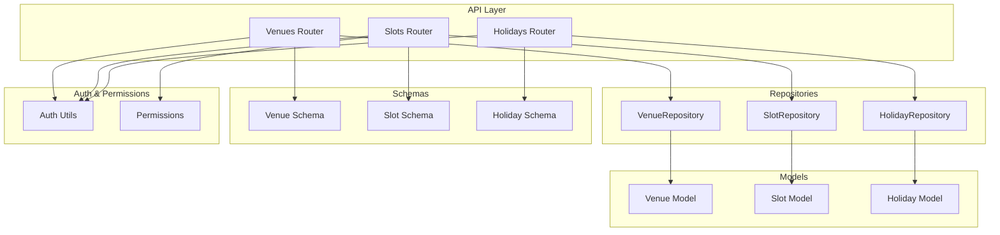
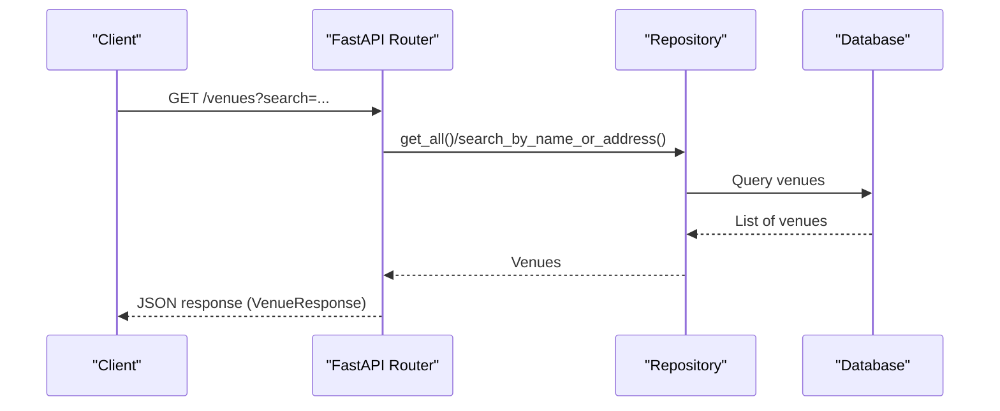
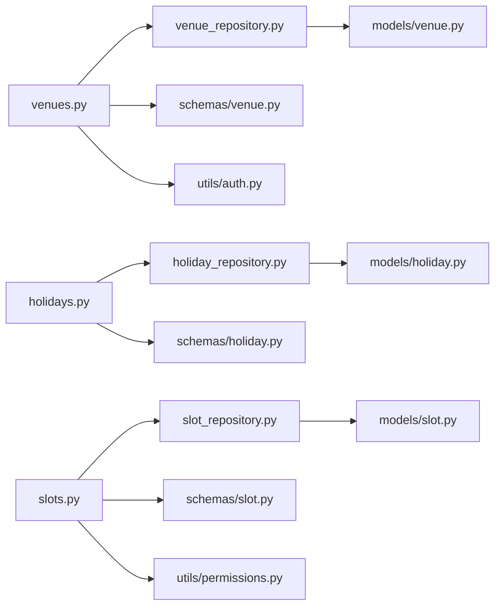

# Venues API

<cite>
**Referenced Files in This Document**
- [venues.py](file://app/api/v1/venues.py)
- [slots.py](file://app/api/v1/slots.py)
- [holidays.py](file://app/api/v1/holidays.py)
- [venue_repository.py](file://app/repositories/venue_repository.py)
- [slot_repository.py](file://app/repositories/slot_repository.py)
- [holiday_repository.py](file://app/repositories/holiday_repository.py)
- [venue.py](file://app/models/venue.py)
- [slot.py](file://app/models/slot.py)
- [holiday.py](file://app/models/holiday.py)
- [venue_schema.py](file://app/schemas/venue.py)
- [slot_schema.py](file://app/schemas/slot.py)
- [holiday_schema.py](file://app/schemas/holiday.py)
- [auth.py](file://app/utils/auth.py)
- [permissions.py](file://app/utils/permissions.py)
</cite>

## Table of Contents
1. [Introduction](#introduction)
2. [Project Structure](#project-structure)
3. [Core Components](#core-components)
4. [Architecture Overview](#architecture-overview)
5. [Detailed Component Analysis](#detailed-component-analysis)
6. [Dependency Analysis](#dependency-analysis)
7. [Performance Considerations](#performance-considerations)
8. [Troubleshooting Guide](#troubleshooting-guide)
9. [Conclusion](#conclusion)
10. [Appendices](#appendices)

## Introduction
This document provides detailed API documentation for venue management endpoints, including:
- Venue CRUD operations and search
- Slot availability checking and management
- Holiday management (global and venue-specific)
- Venue-specific configurations such as payment mode and default slot price
- Authentication and authorization requirements
- Business logic validation rules
- Examples for venue search, booking slot queries, and administrative operations

The API is built with FastAPI and uses a layered architecture: routes (endpoints), services/repositories, models, and schemas.

## Project Structure
Key files involved in venue-related APIs:
- Routes: app/api/v1/venues.py, app/api/v1/slots.py, app/api/v1/holidays.py
- Repositories: app/repositories/venue_repository.py, app/repositories/slot_repository.py, app/repositories/holiday_repository.py
- Models: app/models/venue.py, app/models/slot.py, app/models/holiday.py
- Schemas: app/schemas/venue.py, app/schemas/slot.py, app/schemas/holiday.py
- Auth and permissions: app/utils/auth.py, app/utils/permissions.py

**Diagram sources**
- [venues.py:1-326](file://app/api/v1/venues.py#L1-L326)
- [slots.py:1-112](file://app/api/v1/slots.py#L1-L112)
- [holidays.py:1-140](file://app/api/v1/holidays.py#L1-L140)
- [venue_repository.py:1-95](file://app/repositories/venue_repository.py#L1-L95)
- [slot_repository.py:1-330](file://app/repositories/slot_repository.py#L1-L330)
- [holiday_repository.py:1-63](file://app/repositories/holiday_repository.py#L1-L63)
- [venue.py:1-53](file://app/models/venue.py#L1-L53)
- [slot.py:1-42](file://app/models/slot.py#L1-L42)
- [holiday.py:1-24](file://app/models/holiday.py#L1-L24)
- [venue_schema.py:1-105](file://app/schemas/venue.py#L1-L105)
- [slot_schema.py:1-43](file://app/schemas/slot.py#L1-L43)
- [holiday_schema.py:1-33](file://app/schemas/holiday.py#L1-L33)
- [auth.py:1-113](file://app/utils/auth.py#L1-L113)
- [permissions.py:1-111](file://app/utils/permissions.py#L1-L111)

**Section sources**
- [venues.py:1-326](file://app/api/v1/venues.py#L1-L326)
- [slots.py:1-112](file://app/api/v1/slots.py#L1-L112)
- [holidays.py:1-140](file://app/api/v1/holidays.py#L1-L140)

## Core Components
- Venue endpoints support listing, searching, creating, updating, verifying, and pricing management.
- Slot endpoints provide availability queries, generation, blocking/unblocking, and date-range retrieval.
- Holiday endpoints manage global and venue-specific holidays with bulk creation and date checks.
- Authentication uses Bearer JWT tokens; role-based access controls are enforced via auth utilities and permission codes.

**Section sources**
- [venues.py:65-326](file://app/api/v1/venues.py#L65-L326)
- [slots.py:15-112](file://app/api/v1/slots.py#L15-L112)
- [holidays.py:36-140](file://app/api/v1/holidays.py#L36-L140)
- [auth.py:85-113](file://app/utils/auth.py#L85-L113)
- [permissions.py:34-87](file://app/utils/permissions.py#L34-L87)

## Architecture Overview
The API follows a clear separation of concerns:
- Routes define HTTP endpoints and handle request/response mapping.
- Repositories encapsulate data access logic and queries.
- Models represent database entities.
- Schemas validate and serialize input/output payloads.
- Auth and permissions enforce security policies at route level.

**Diagram sources**
- [venues.py:65-126](file://app/api/v1/venues.py#L65-L126)
- [venue_repository.py:35-42](file://app/repositories/venue_repository.py#L35-L42)

**Section sources**
- [venues.py:65-126](file://app/api/v1/venues.py#L65-L126)
- [venue_repository.py:1-95](file://app/repositories/venue_repository.py#L1-L95)

## Detailed Component Analysis

### Venue Endpoints
- GET /venues
  - Purpose: List venues with filtering and search.
  - Query parameters: category, latitude, longitude, radius, is_verified, search, limit, offset.
  - Response: List of VenueResponse objects including min price, average rating, total reviews, and payment_mode.
  - Business logic: Nearby search using Haversine distance; text search by name or address; filters applied; minimum price computed from slots or membership plans.
  - Authentication: Public endpoint (no auth required).
  - Example: Search futsal venues within 5 km of coordinates, verified only.

- GET /venues/my-venues
  - Purpose: List venues managed by the authenticated manager.
  - Authentication: Requires manager role (venue_manager, club_admin, super_admin).
  - Response: List of VenueResponse with ratings and min price.

- GET /venues/{venue_id}
  - Purpose: Retrieve details of a specific venue with rating summary and min price.
  - Authentication: Public endpoint.
  - Validation: Returns 404 if not found.

- POST /venues
  - Purpose: Create a new venue.
  - Authentication: Requires manager role.
  - Request schema: VenueCreate (name, category, address, lat/lng, phone, description, amenities, images, default_slot_price, optional payment_mode).
  - Business logic: Prevents a manager from creating multiple venues; sets manager_id to current user; stores amenities/images as JSON strings; applies payment_mode enum.
  - Response: VenueResponse with min price and zero ratings.

- PUT /venues/{venue_id}
  - Purpose: Update an existing venue.
  - Authentication: Requires manager role and ownership check (manager_id must match current user).
  - Request schema: Same as create.
  - Response: Updated VenueResponse with rating summary.

- POST /venues/{venue_id}/verify
  - Purpose: Verify a venue (admin-only).
  - Authentication: Requires super_admin role.
  - Business logic: Sets is_verified to True.

- POST /venues/{venue_id}/prices
  - Purpose: Set prices for venue slots by time-of-day keys.
  - Authentication: Requires manager role and ownership check.
  - Request body: Map of "HH:MM" to integer price.
  - Business logic: Updates base_price and current_price for non-past slots; skips past slots; returns counts of updated and skipped.

- GET /venues/{venue_id}/prices
  - Purpose: Retrieve venue slot prices grouped by start_time.
  - Authentication: Requires manager role and ownership check.
  - Response: Map of "HH:MM" to {base_price, current_price}.

Authentication and roles:
- Manager endpoints use get_current_manager which enforces allowed roles.
- Admin endpoints use get_current_admin which enforces super_admin role.

Business validations:
- Payment mode validation via schema validator ensures allowed values.
- Ownership checks prevent unauthorized updates.
- Past slot protection prevents modification of historical slots.

Example requests:
- Create venue: POST /venues with VenueCreate payload.
- Set prices: POST /venues/{id}/prices with {"17:00": 300000, "18:30": 350000}.
- Verify venue: POST /venues/{id}/verify (admin).

**Section sources**
- [venues.py:65-326](file://app/api/v1/venues.py#L65-L326)
- [venue_schema.py:24-105](file://app/schemas/venue.py#L24-L105)
- [auth.py:85-113](file://app/utils/auth.py#L85-L113)

### Slot Availability and Management Endpoints
- GET /slots/venue/{venue_id}?slot_date=YYYY-MM-DD
  - Purpose: Get all slots for a venue on a specific date.
  - Response: List of SlotResponse.

- GET /slots/venue/{venue_id}/available?slot_date=YYYY-MM-DD
  - Purpose: Get available slots for a venue on a specific date.
  - Response: List of SlotResponse filtered by status AVAILABLE.

- POST /slots/venue/{venue_id}/generate
  - Purpose: Generate daily slots for a venue on a given date.
  - Authentication: Requires slot.generate permission via ensure_venue_permission.
  - Business logic: Creates slots based on venue configuration and pricing service; avoids conflicts; sets base and current prices.

- GET /slots/venue/{venue_id}/range?start_date=YYYY-MM-DD&end_date=YYYY-MM-DD
  - Purpose: Get slots for a venue across a date range.
  - Response: List of SlotResponse ordered by date and time.

- POST /slots/{slot_id}/block
  - Purpose: Block an available future slot.
  - Authentication: Requires slot.block permission via ensure_venue_permission.
  - Business logic: Validates slot exists, is not contract slot, is available, and is not past; updates status to BLOCKED.

- POST /slots/{slot_id}/unblock
  - Purpose: Unblock a blocked future slot.
  - Authentication: Requires slot.block permission via ensure_venue_permission.
  - Business logic: Validates slot exists, is blocked, and is not past; updates status to AVAILABLE.

Slot statuses:
- available, booked, blocked, in_competition, reserved.

Validation and guards:
- Past slot guard prevents modifications to historical slots.
- Contract slot protection prevents manual blocking/unblocking of contract slots.

Example requests:
- Check availability: GET /slots/venue/{id}/available?slot_date=today.
- Generate slots: POST /slots/venue/{id}/generate with date.
- Block slot: POST /slots/{id}/block.

**Section sources**
- [slots.py:15-112](file://app/api/v1/slots.py#L15-L112)
- [slot_repository.py:27-144](file://app/repositories/slot_repository.py#L27-L144)
- [slot_schema.py:6-43](file://app/schemas/slot.py#L6-L43)
- [permissions.py:34-87](file://app/utils/permissions.py#L34-L87)

### Holiday Management Endpoints
- GET /holidays?from=YYYY-MM-DD&to=YYYY-MM-DD
  - Purpose: List holidays within a date range, filtered by user’s venue access.
  - Authentication: Requires user role with holiday.manage permission for staff; otherwise manager venues plus global holidays.
  - Response: List of HolidayResponse.

- POST /holidays
  - Purpose: Create a holiday (global or venue-specific).
  - Authentication: Super admin for global; venue manager or branch manager with holiday.manage for venue-specific.
  - Request schema: HolidayCreate (holiday_date, name, is_national, venue_id).
  - Business logic: Enforces unique holiday_date across calendar; creates holiday record.

- POST /holidays/bulk
  - Purpose: Bulk create holidays.
  - Authentication: Same as single create per item.
  - Request schema: HolidayBulkCreate with items list.
  - Business logic: Skips duplicates; returns created count and IDs.

- DELETE /holidays/{holiday_id}
  - Purpose: Delete a holiday.
  - Authentication: Same write permissions as create.
  - Business logic: Hard delete (soft_delete=False).

- GET /holidays/check/{target_date}?venue_id=optional
  - Purpose: Check if a date is a holiday for a venue or globally.
  - Authentication: Requires holiday.manage permission for staff users.
  - Response: {date, venue_id, is_holiday}.

Holiday uniqueness:
- holiday_date is unique across the entire calendar; attempts to duplicate return 400.

Example requests:
- Create holiday: POST /holidays with date and name.
- Bulk add: POST /holidays/bulk with array of items.
- Check holiday: GET /holidays/check/2025-01-01?venue_id=123.

**Section sources**
- [holidays.py:36-140](file://app/api/v1/holidays.py#L36-L140)
- [holiday_repository.py:16-63](file://app/repositories/holiday_repository.py#L16-L63)
- [holiday_schema.py:7-33](file://app/schemas/holiday.py#L7-L33)

### Venue Status Management and Capacity Controls
- Venue verification: Admin-only endpoint to set is_verified flag.
- Slot capacity control:
  - Generation creates slots respecting conflicts and pricing rules.
  - Blocking/unblocking manages availability state.
  - Past slot protection prevents changes to historical slots.
  - Contract slot protection prevents manual manipulation of contract-linked slots.

Integration with booking system:
- Slots have statuses that reflect bookings (booked/reserved/in_competition).
- Availability queries filter by status to expose bookable slots.
- Pricing service influences generated slot prices and minimum venue price calculations.

**Section sources**
- [venues.py:234-248](file://app/api/v1/venues.py#L234-L248)
- [slots.py:33-112](file://app/api/v1/slots.py#L33-L112)
- [slot_repository.py:194-239](file://app/repositories/slot_repository.py#L194-L239)

## Dependency Analysis
- Routes depend on repositories for data access and on schemas for validation.
- Repositories depend on models and SQLModel queries.
- Auth utilities enforce token validation and role checks.
- Permissions utility defines RBAC codes used by staff access checks.

**Diagram sources**
- [venues.py:1-326](file://app/api/v1/venues.py#L1-L326)
- [slots.py:1-112](file://app/api/v1/slots.py#L1-L112)
- [holidays.py:1-140](file://app/api/v1/holidays.py#L1-L140)
- [venue_repository.py:1-95](file://app/repositories/venue_repository.py#L1-L95)
- [slot_repository.py:1-330](file://app/repositories/slot_repository.py#L1-L330)
- [holiday_repository.py:1-63](file://app/repositories/holiday_repository.py#L1-L63)
- [venue.py:1-53](file://app/models/venue.py#L1-L53)
- [slot.py:1-42](file://app/models/slot.py#L1-L42)
- [holiday.py:1-24](file://app/models/holiday.py#L1-L24)
- [venue_schema.py:1-105](file://app/schemas/venue.py#L1-L105)
- [slot_schema.py:1-43](file://app/schemas/slot.py#L1-L43)
- [holiday_schema.py:1-33](file://app/schemas/holiday.py#L1-L33)
- [auth.py:1-113](file://app/utils/auth.py#L1-L113)
- [permissions.py:1-111](file://app/utils/permissions.py#L1-L111)

**Section sources**
- [venues.py:1-326](file://app/api/v1/venues.py#L1-L326)
- [slots.py:1-112](file://app/api/v1/slots.py#L1-L112)
- [holidays.py:1-140](file://app/api/v1/holidays.py#L1-L140)

## Performance Considerations
- Nearby venue search computes distances in memory after fetching verified venues; consider indexing and spatial queries for large datasets.
- Minimum price calculation scans slots for a week; caching or precomputation may improve performance for frequent reads.
- Bulk holiday creation skips duplicates; ensure batch sizes are reasonable to avoid long transactions.
- Slot generation avoids conflicts and uses pricing service; ensure pricing rules are efficient to reduce latency during generation.

[No sources needed since this section provides general guidance]

## Troubleshooting Guide
Common errors and their causes:
- 401 Unauthorized: Missing or invalid JWT token. Ensure Authorization header includes valid Bearer token.
- 403 Forbidden: Insufficient role or permission (e.g., trying to verify venue without super_admin; blocking slot without slot.block).
- 400 Bad Request: Invalid inputs (e.g., invalid payment_mode; past slot modification; duplicate holiday_date; end date before start date).
- 404 Not Found: Venue, slot, or holiday not found.

Debugging tips:
- Validate request schemas against defined fields and patterns.
- Check role and permissions for staff-managed endpoints.
- Use date range filters to narrow down results when debugging availability issues.

**Section sources**
- [auth.py:85-113](file://app/utils/auth.py#L85-L113)
- [permissions.py:34-87](file://app/utils/permissions.py#L34-L87)
- [holidays.py:58-60](file://app/api/v1/holidays.py#L58-L60)
- [slots.py:80-112](file://app/api/v1/slots.py#L80-L112)

## Conclusion
The Venues API provides comprehensive functionality for managing venues, slots, and holidays with robust authentication, validation, and business logic. It supports public searches, manager administration, and admin verification, while integrating with the booking system through slot statuses and pricing rules. Proper use of query parameters, request schemas, and permissions ensures secure and efficient operations.

[No sources needed since this section summarizes without analyzing specific files]

## Appendices

### Authentication Requirements
- All protected endpoints require a valid Bearer JWT token.
- Roles:
  - Manager endpoints: venue_manager, club_admin, super_admin.
  - Admin endpoints: super_admin.
- Staff-managed endpoints use permission codes (e.g., slot.block, slot.generate, holiday.manage) enforced via ensure_venue_permission.

**Section sources**
- [auth.py:85-113](file://app/utils/auth.py#L85-L113)
- [permissions.py:34-87](file://app/utils/permissions.py#L34-L87)

### Request/Response Schemas Summary
- VenueCreate: name, category, address, latitude, longitude, phone, description, amenities, images, default_slot_price, optional payment_mode.
- VenueResponse: id, name, category, address, latitude, longitude, phone, description, is_verified, manager_id, club_id, created_at, price, default_slot_price, average_rating, total_reviews, payment_mode.
- SlotResponse: id, venue_id, slot_date, start_time, duration, base_price, current_price, status, is_competition_enabled, is_contract_slot, is_deal, deal_price, deal_expires_at.
- HolidayCreate: holiday_date, name, is_national, venue_id.
- HolidayResponse: id, holiday_date, name, is_national, venue_id.

**Section sources**
- [venue_schema.py:24-105](file://app/schemas/venue.py#L24-L105)
- [slot_schema.py:13-43](file://app/schemas/slot.py#L13-L43)
- [holiday_schema.py:7-33](file://app/schemas/holiday.py#L7-L33)