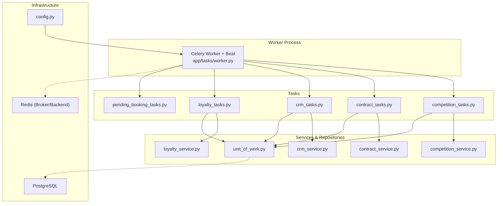
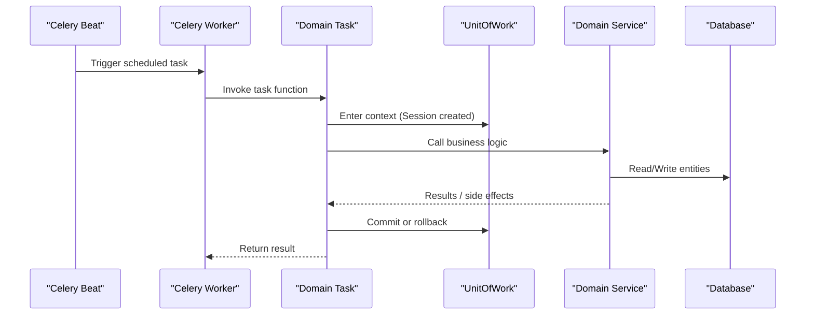
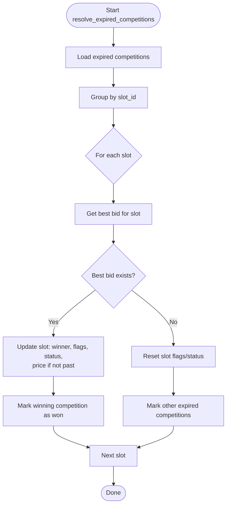
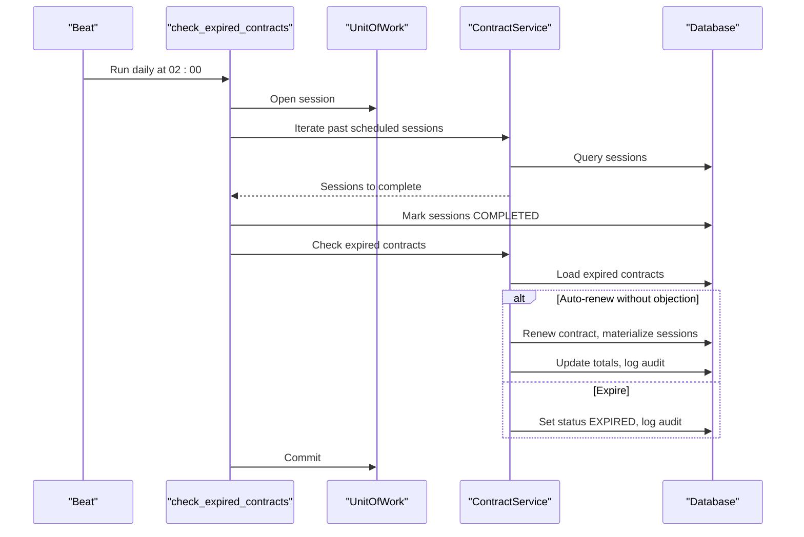
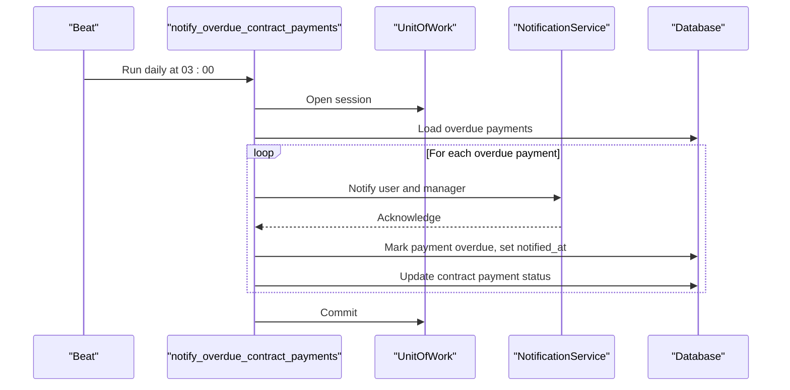
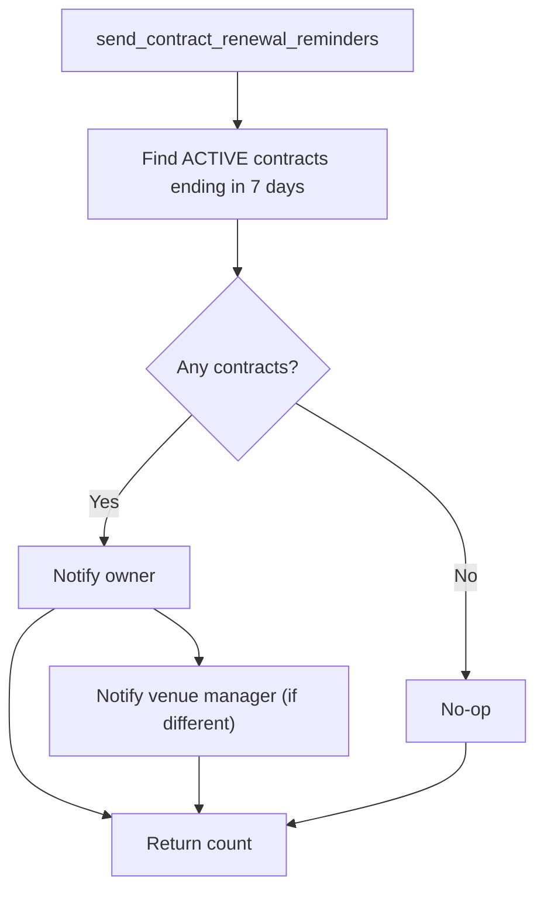
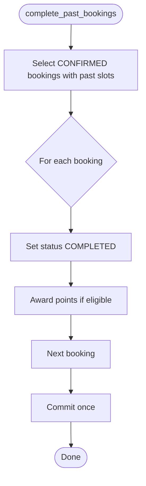
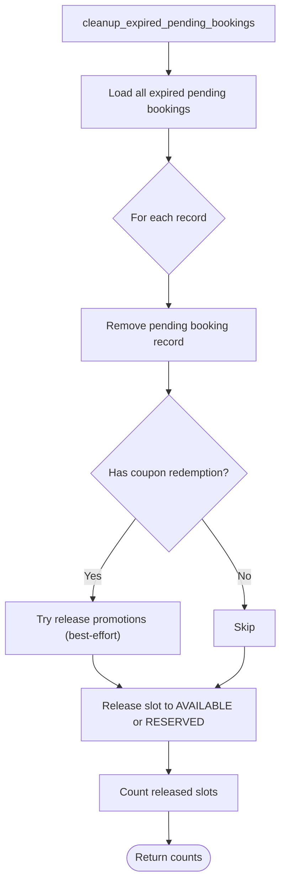
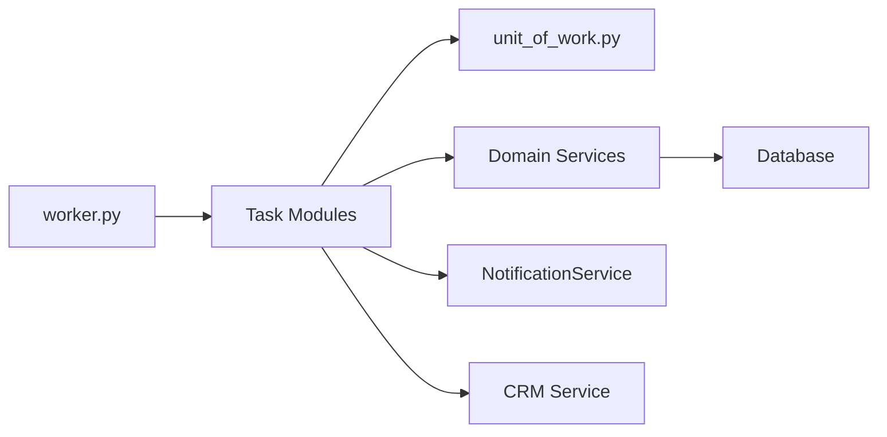

# Background Processing

<cite>
**Referenced Files in This Document**
- [worker.py](file://app/tasks/worker.py)
- [config.py](file://app/config.py)
- [Dockerfile.celery](file://Dockerfile.celery)
- [competition_tasks.py](file://app/tasks/competition_tasks.py)
- [contract_tasks.py](file://app/tasks/contract_tasks.py)
- [crm_tasks.py](file://app/tasks/crm_tasks.py)
- [loyalty_tasks.py](file://app/tasks/loyalty_tasks.py)
- [pending_booking_tasks.py](file://app/tasks/pending_booking_tasks.py)
- [competition_service.py](file://app/services/competition_service.py)
- [contract_service.py](file://app/services/contract_service.py)
- [crm_service.py](file://app/services/crm_service.py)
- [loyalty_service.py](file://app/services/loyalty_service.py)
- [unit_of_work.py](file://app/unit_of_work.py)
- [main.py](file://app/main.py)
</cite>

## Table of Contents
1. [Introduction](#introduction)
2. [Project Structure](#project-structure)
3. [Core Components](#core-components)
4. [Architecture Overview](#architecture-overview)
5. [Detailed Component Analysis](#detailed-component-analysis)
6. [Dependency Analysis](#dependency-analysis)
7. [Performance Considerations](#performance-considerations)
8. [Troubleshooting Guide](#troubleshooting-guide)
9. [Conclusion](#conclusion)
10. [Appendices](#appendices)

## Introduction
This document explains the background processing system built with Celery for the futsal booking backend. It covers task configuration, worker setup, scheduled jobs (via Celery Beat), and the domain-specific background tasks: competition management, contract lifecycle processing, CRM automation, loyalty point calculations, and cleanup of expired pending bookings. It also documents queuing strategies, retry and error handling patterns, monitoring approaches, scaling considerations, and debugging techniques for long-running processes.

## Project Structure
The background processing subsystem is organized around a shared Celery application instance and modular task files that register periodic schedules and domain logic via services and repositories.

**Diagram sources**
- [worker.py:4-25](file://app/tasks/worker.py#L4-L25)
- [config.py:4-68](file://app/config.py#L4-L68)
- [competition_tasks.py:1-21](file://app/tasks/competition_tasks.py#L1-L21)
- [contract_tasks.py:1-139](file://app/tasks/contract_tasks.py#L1-L139)
- [crm_tasks.py:1-119](file://app/tasks/crm_tasks.py#L1-L119)
- [loyalty_tasks.py:1-59](file://app/tasks/loyalty_tasks.py#L1-L59)
- [pending_booking_tasks.py:1-42](file://app/tasks/pending_booking_tasks.py#L1-L42)
- [unit_of_work.py:38-200](file://app/unit_of_work.py#L38-L200)

**Section sources**
- [worker.py:4-25](file://app/tasks/worker.py#L4-L25)
- [config.py:4-68](file://app/config.py#L4-L68)
- [Dockerfile.celery:1-11](file://Dockerfile.celery#L1-L11)

## Core Components
- Celery application and configuration:
  - Central Celery app with JSON serialization, UTC timezone, and Beat schedule entries defined centrally and extended by modules.
  - Broker and result backend configured via environment settings (Redis URL).
- Task modules:
  - Each domain module defines one or more Celery tasks and updates the Beat schedule using update() to avoid overwriting existing schedules.
- Services and Unit of Work:
  - Tasks call domain services (e.g., CompetitionService, ContractService, CRM service, LoyaltyService) through a UnitOfWork context to ensure transactional consistency and repository access.

Key responsibilities:
- Scheduled maintenance: expired contracts, overdue payments, past bookings completion, renewal reminders, dormant customer alerts.
- Domain state transitions: competitions resolution, contract renewals/expirations, slot status changes, loyalty points awarding.

**Section sources**
- [worker.py:4-25](file://app/tasks/worker.py#L4-L25)
- [competition_tasks.py:1-21](file://app/tasks/competition_tasks.py#L1-L21)
- [contract_tasks.py:1-139](file://app/tasks/contract_tasks.py#L1-L139)
- [crm_tasks.py:1-119](file://app/tasks/crm_tasks.py#L1-L119)
- [loyalty_tasks.py:1-59](file://app/tasks/loyalty_tasks.py#L1-L59)
- [pending_booking_tasks.py:1-42](file://app/tasks/pending_booking_tasks.py#L1-L42)
- [unit_of_work.py:38-200](file://app/unit_of_work.py#L38-L200)

## Architecture Overview
The worker process runs both Celery worker and Beat scheduler. Beat triggers scheduled tasks at configured times. Tasks execute within a UnitOfWork to perform database operations atomically and commit on success. Services encapsulate business rules; tasks remain thin orchestration layers.

**Diagram sources**
- [worker.py:4-25](file://app/tasks/worker.py#L4-L25)
- [unit_of_work.py:44-62](file://app/unit_of_work.py#L44-L62)
- [contract_tasks.py:18-80](file://app/tasks/contract_tasks.py#L18-L80)
- [competition_tasks.py:6-20](file://app/tasks/competition_tasks.py#L6-L20)

## Detailed Component Analysis

### Celery Configuration and Worker Setup
- The Celery app is initialized with broker/backend set to Redis URL from settings.
- Serialization is JSON; timezone is UTC; Beat schedule is defined centrally and extended by modules.
- Docker image runs celery worker with beat enabled.

Operational notes:
- Use separate environments for broker/backend URLs.
- Keep Beat schedule centralized where possible; use update() in modules to add schedules safely.

**Section sources**
- [worker.py:4-25](file://app/tasks/worker.py#L4-L25)
- [config.py:4-68](file://app/config.py#L4-L68)
- [Dockerfile.celery:1-11](file://Dockerfile.celery#L1-L11)

### Competition Management Task
Purpose:
- Resolve expired competitions periodically. For each slot with active competitions, select the best bid if any, finalize winner, and reset slot availability. Past slots are not price-updated after start time.

Flow highlights:
- Group expired competitions by slot.
- Determine best bid per slot.
- Update slot fields and mark competition won/expired accordingly.

**Diagram sources**
- [competition_tasks.py:6-20](file://app/tasks/competition_tasks.py#L6-L20)
- [competition_service.py:66-103](file://app/services/competition_service.py#L66-L103)

**Section sources**
- [competition_tasks.py:6-20](file://app/tasks/competition_tasks.py#L6-L20)
- [competition_service.py:66-103](file://app/services/competition_service.py#L66-L103)

### Contract Lifecycle Tasks
Two primary tasks:
- check_expired_contracts: Marks past scheduled sessions completed; handles auto-renewal or expiration of contracts; materializes new sessions when renewed; logs audit events.
- notify_overdue_contract_payments: Identifies overdue payments, notifies users and venue managers, marks payments overdue, and updates payment status.

Key behaviors:
- Auto-renewal extends contract end date, materializes future sessions based on recurrence, and updates total amount.
- Overdue notifications are idempotent via flags and timestamps.

**Diagram sources**
- [contract_tasks.py:18-80](file://app/tasks/contract_tasks.py#L18-L80)
- [contract_service.py:152-191](file://app/services/contract_service.py#L152-L191)

**Diagram sources**
- [contract_tasks.py:83-127](file://app/tasks/contract_tasks.py#L83-L127)

**Section sources**
- [contract_tasks.py:18-139](file://app/tasks/contract_tasks.py#L18-L139)
- [contract_service.py:152-191](file://app/services/contract_service.py#L152-L191)

### CRM Automation Tasks
Tasks:
- send_contract_renewal_reminders: Notifies contract owners and venue managers 7 days before contract end.
- notify_dormant_high_value_customers: Weekly notification to venue managers about top spenders who have been inactive beyond a threshold.

Behavior:
- Uses UnitOfWork to query contracts and venues.
- Sends notifications asynchronously within the task using an event loop wrapper to integrate with async notification service.

**Diagram sources**
- [crm_tasks.py:25-64](file://app/tasks/crm_tasks.py#L25-L64)

**Section sources**
- [crm_tasks.py:25-119](file://app/tasks/crm_tasks.py#L25-L119)
- [crm_service.py:82-158](file://app/services/crm_service.py#L82-L158)

### Loyalty Point Calculations
Task:
- complete_past_bookings: Transitions confirmed bookings with finished slots to completed and awards loyalty points based on payment amount. Idempotent via source-based deduplication.

Process:
- Selects confirmed bookings whose slot end time has passed.
- Updates booking status and calls loyalty service to award points.
- Commits once per batch.

**Diagram sources**
- [loyalty_tasks.py:16-51](file://app/tasks/loyalty_tasks.py#L16-L51)
- [loyalty_service.py:41-50](file://app/services/loyalty_service.py#L41-L50)

**Section sources**
- [loyalty_tasks.py:16-59](file://app/tasks/loyalty_tasks.py#L16-L59)
- [loyalty_service.py:41-50](file://app/services/loyalty_service.py#L41-L50)

### Cleanup of Expired Pending Bookings
Task:
- Removes expired pending bookings and releases their reserved slots back to available or reserved depending on whether they belong to a contract. Also releases promotions tied to coupon redemptions when applicable.

**Diagram sources**
- [pending_booking_tasks.py:12-42](file://app/tasks/pending_booking_tasks.py#L12-L42)

**Section sources**
- [pending_booking_tasks.py:12-42](file://app/tasks/pending_booking_tasks.py#L12-L42)

## Dependency Analysis
Tasks depend on:
- Celery app and Beat schedule registry.
- UnitOfWork for transactional data access.
- Domain services for business logic.
- Notification and CRM services for messaging and analytics.

**Diagram sources**
- [worker.py:4-25](file://app/tasks/worker.py#L4-L25)
- [unit_of_work.py:38-200](file://app/unit_of_work.py#L38-L200)
- [contract_tasks.py:18-139](file://app/tasks/contract_tasks.py#L18-L139)
- [crm_tasks.py:25-119](file://app/tasks/crm_tasks.py#L25-L119)
- [loyalty_tasks.py:16-59](file://app/tasks/loyalty_tasks.py#L16-L59)
- [competition_tasks.py:6-20](file://app/tasks/competition_tasks.py#L6-L20)

**Section sources**
- [worker.py:4-25](file://app/tasks/worker.py#L4-L25)
- [unit_of_work.py:38-200](file://app/unit_of_work.py#L38-L200)

## Performance Considerations
- Batch commits: Tasks commit once per logical unit of work to reduce transaction overhead.
- Efficient queries: Services aggregate data in single queries where possible (e.g., CRM compute_customer_rows).
- Idempotency: Loyalty awards and notifications rely on source IDs and flags to prevent duplicates.
- Async integration: Tasks wrap async notification calls to avoid event loop conflicts while keeping I/O non-blocking.
- Time guards: Business rules enforce time constraints (e.g., no price changes for past slots) to minimize unnecessary writes.

[No sources needed since this section provides general guidance]

## Troubleshooting Guide
Common issues and remedies:
- Beat schedule conflicts: Avoid redefining schedules; always use update() to merge new entries into the global schedule.
- Event loop errors in async calls: Wrap asyncio.run with try/except and fallback to creating a new event loop when running inside Celery’s event loop.
- Transaction rollbacks: UnitOfWork automatically rolls back on exceptions; inspect logs to identify failing steps.
- Stale states: Ensure tasks run at appropriate cadence (e.g., daily) and verify scheduled times in Beat.

Debugging tips:
- Inspect task results stored in Redis backend to see return values and errors.
- Log key metrics (counts of processed items) returned by tasks for observability.
- Validate environment variables (Redis URL, timezone) to ensure correct scheduling and connectivity.

**Section sources**
- [worker.py:10-23](file://app/tasks/worker.py#L10-L23)
- [contract_tasks.py:108-114](file://app/tasks/contract_tasks.py#L108-L114)
- [crm_tasks.py:57-63](file://app/tasks/crm_tasks.py#L57-L63)
- [unit_of_work.py:44-62](file://app/unit_of_work.py#L44-L62)

## Conclusion
The background processing system uses Celery with a clear separation between task orchestration and business logic. Scheduled tasks maintain data integrity across competitions, contracts, CRM, and loyalty domains. The UnitOfWork pattern ensures atomicity, while services provide reusable, testable logic. Proper scheduling, idempotency, and careful async integration make the system robust for production workloads.

[No sources needed since this section summarizes without analyzing specific files]

## Appendices

### Creating a New Background Task
Steps:
- Define a Celery task in a dedicated module under app/tasks.
- Use UnitOfWork to perform database operations and call domain services.
- Add a Beat schedule entry using update() to avoid overwriting existing schedules.
- Return summary metrics for monitoring.

Example references:
- Task definition and schedule update pattern: [competition_tasks.py:6-20](file://app/tasks/competition_tasks.py#L6-L20)
- Schedule extension pattern: [contract_tasks.py:130-139](file://app/tasks/contract_tasks.py#L130-L139)
- UnitOfWork usage: [unit_of_work.py:44-62](file://app/unit_of_work.py#L44-L62)

**Section sources**
- [competition_tasks.py:6-20](file://app/tasks/competition_tasks.py#L6-L20)
- [contract_tasks.py:130-139](file://app/tasks/contract_tasks.py#L130-L139)
- [unit_of_work.py:44-62](file://app/unit_of_work.py#L44-L62)

### Handling Task Dependencies
- Chain tasks using Celery chains or groups when one task must follow another.
- For cross-domain dependencies, prefer a coordinator task that orchestrates multiple service calls within a single UnitOfWork.
- Use idempotent operations to tolerate retries and partial failures.

[No sources needed since this section provides general guidance]

### Implementing Distributed Task Coordination
- Use unique keys or idempotency tokens to prevent duplicate execution across workers.
- Leverage Redis-backed results and locks (e.g., distributed locks) if necessary for exclusive operations.
- Monitor task queues and worker health via Celery tools and metrics.

[No sources needed since this section provides general guidance]

### Scaling Considerations
- Horizontal scaling: Run multiple worker processes/containers; ensure Redis can handle concurrency.
- Vertical scaling: Increase worker concurrency and prefetch limits based on workload characteristics.
- Queue segregation: Separate high-priority and low-priority tasks into distinct queues if needed.

[No sources needed since this section provides general guidance]

### Monitoring Approaches
- Inspect task results in Redis backend to review outputs and errors.
- Log task return values (counts, statuses) for dashboards.
- Use Beat logs to confirm schedule executions.

**Section sources**
- [worker.py:10-23](file://app/tasks/worker.py#L10-L23)
- [contract_tasks.py:78-80](file://app/tasks/contract_tasks.py#L78-L80)
- [loyalty_tasks.py:50-51](file://app/tasks/loyalty_tasks.py#L50-L51)