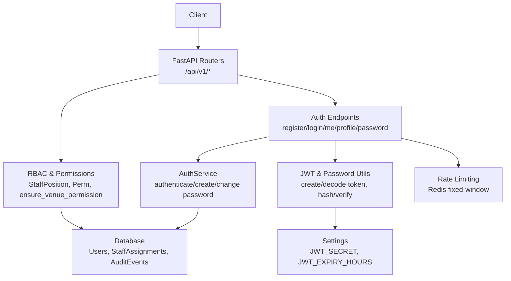
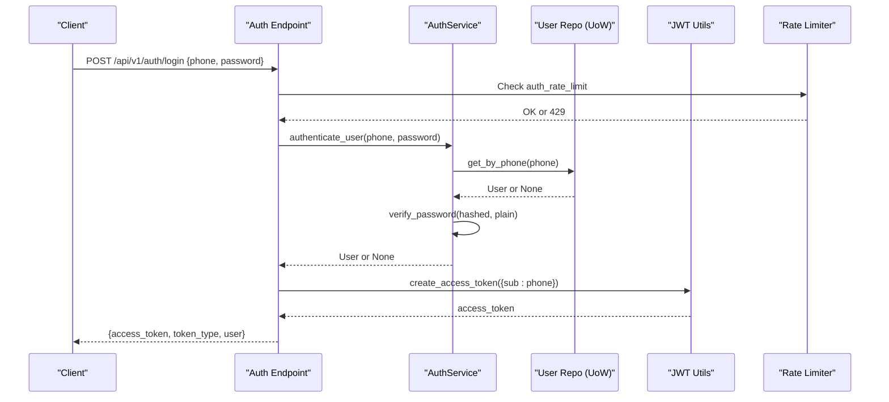
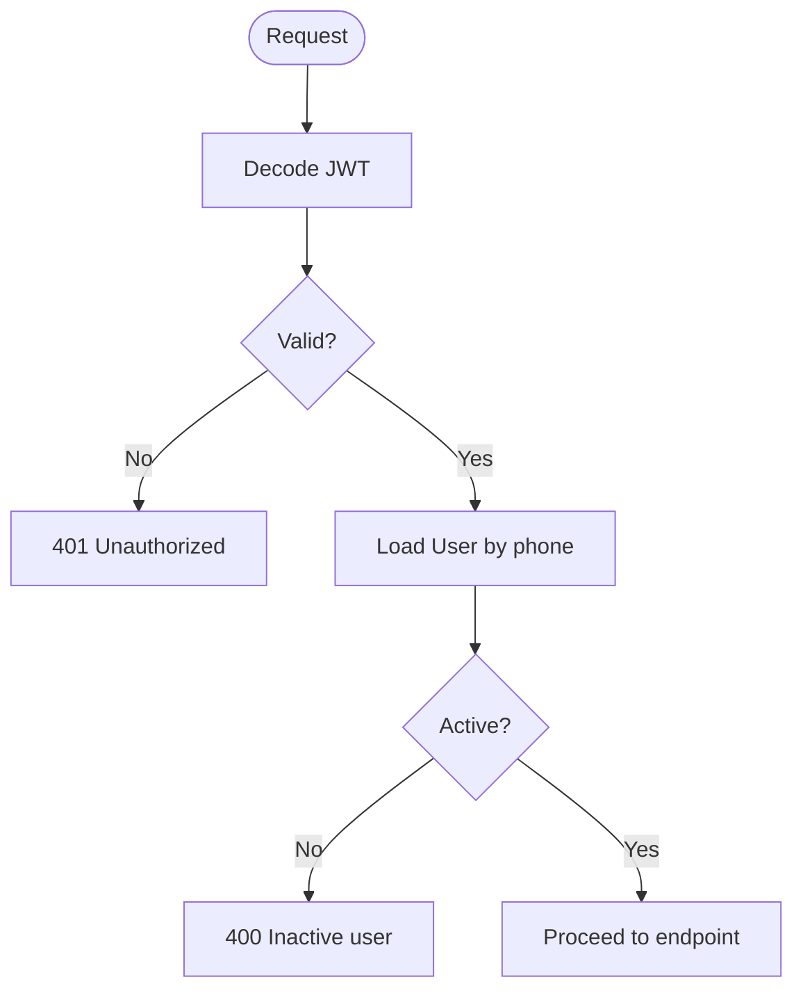
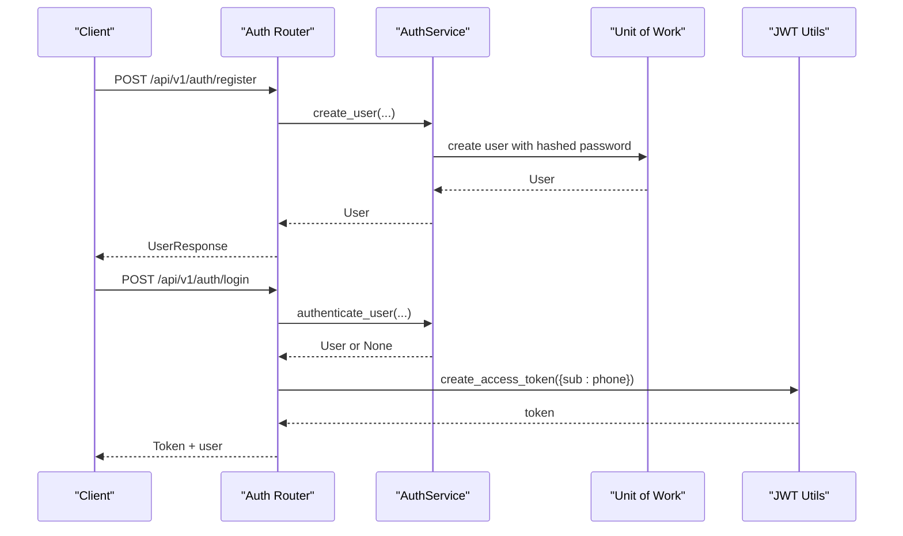
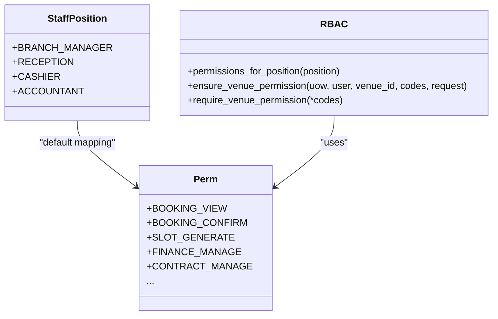
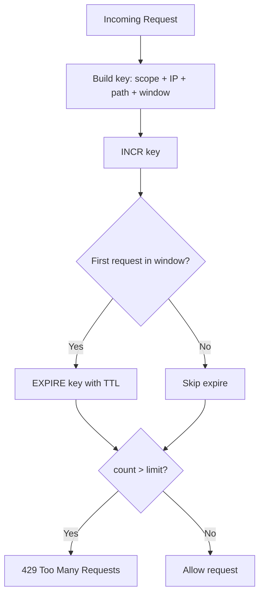
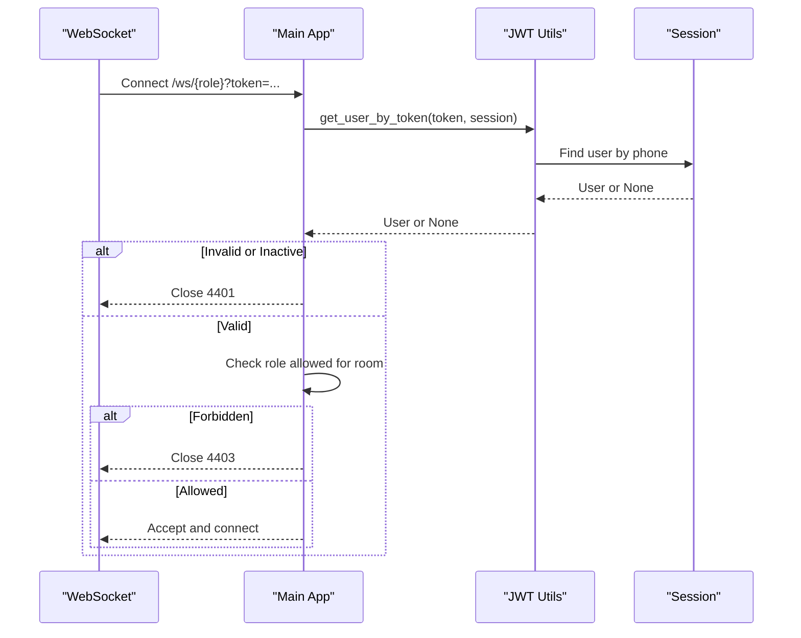
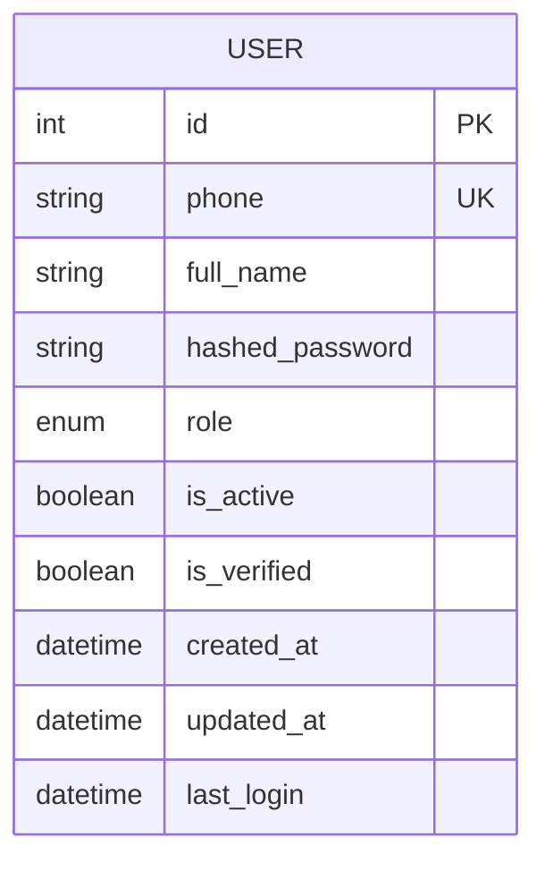
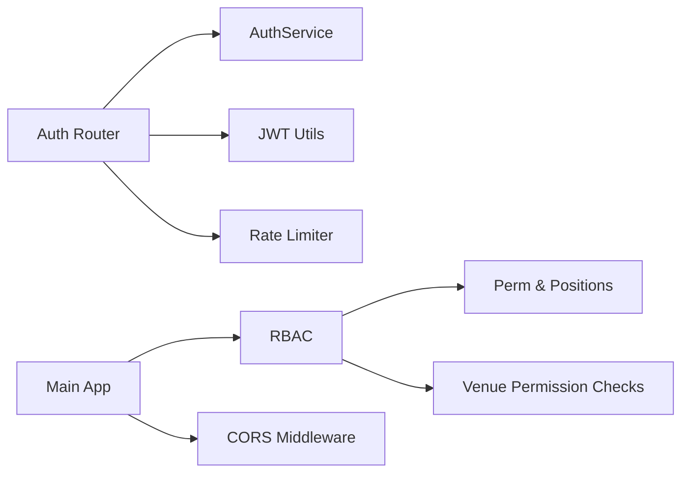

# Authentication & Authorization

<cite>
**Referenced Files in This Document**
- [auth.py](file://app/api/v1/auth.py)
- [auth.py](file://app/utils/auth.py)
- [permissions.py](file://app/utils/permissions.py)
- [staff_access.py](file://app/utils/staff_access.py)
- [auth_service.py](file://app/services/auth_service.py)
- [user.py](file://app/models/user.py)
- [user.py](file://app/schemas/user.py)
- [rate_limit.py](file://app/utils/rate_limit.py)
- [main.py](file://app/main.py)
- [config.py](file://app/config.py)
</cite>

## Table of Contents
1. Introduction
2. Project Structure
3. Core Components
4. Architecture Overview
5. Detailed Component Analysis
6. Dependency Analysis
7. Performance Considerations
8. Troubleshooting Guide
9. Conclusion

## Introduction
This document explains the authentication and authorization system implemented in the backend. It covers JWT-based security, role-based access control (RBAC), password hashing with Argon2, user session management via HTTP Bearer tokens, permission decorators/middleware, rate limiting, brute-force protection, and audit logging for security events. It also provides guidance on protecting endpoints, implementing custom permissions, handling authentication errors, token expiration strategies, and multi-factor considerations.

## Project Structure
The authentication and authorization features are distributed across API routes, utilities, services, models, schemas, and middleware:
- API routes define login, registration, profile, and verification flows.
- Utilities implement JWT creation/validation, password hashing, and RBAC helpers.
- Services encapsulate business logic for user operations.
- Models and schemas define users, roles, and request/response contracts.
- Middleware enforces CORS and captures security denials for auditing.
- Configuration centralizes secrets and token settings.

**Diagram sources**
- [auth.py:57-101](file://app/api/v1/auth.py#L57-L101)
- [auth.py:85-102](file://app/utils/auth.py#L85-L102)
- [auth_service.py:7-33](file://app/services/auth_service.py#L7-L33)
- [permissions.py:25-87](file://app/utils/permissions.py#L25-L87)
- [staff_access.py:44-145](file://app/utils/staff_access.py#L44-L145)
- [rate_limit.py:42-70](file://app/utils/rate_limit.py#L42-L70)
- [config.py:4-10](file://app/config.py#L4-L10)

**Section sources**
- [auth.py:57-101](file://app/api/v1/auth.py#L57-L101)
- [auth.py:85-102](file://app/utils/auth.py#L85-L102)
- [auth_service.py:7-33](file://app/services/auth_service.py#L7-L33)
- [permissions.py:25-87](file://app/utils/permissions.py#L25-L87)
- [staff_access.py:44-145](file://app/utils/staff_access.py#L44-L145)
- [rate_limit.py:42-70](file://app/utils/rate_limit.py#L42-L70)
- [config.py:4-10](file://app/config.py#L4-L10)

## Core Components
- JWT utilities: token creation, decoding, and current user resolution using HTTP Bearer.
- Password hashing and verification using Argon2.
- User service for authentication, creation, and password changes.
- RBAC model and permission codes for staff positions.
- Venue-scoped permission checks and denial auditing.
- Rate limiting for sensitive endpoints to mitigate brute force.
- WebSocket authentication and role-scoped rooms.

Key responsibilities:
- Token lifecycle: create at login, validate on each request, enforce expiry via configuration.
- Session state: derived from JWT payload; active user lookup by phone stored in token subject.
- Access control: role checks for admin/manager and fine-grained permission codes per venue.

**Section sources**
- [auth.py:85-102](file://app/utils/auth.py#L85-L102)
- [auth.py:45-67](file://app/utils/auth.py#L45-L67)
- [auth_service.py:7-33](file://app/services/auth_service.py#L7-L33)
- [permissions.py:25-87](file://app/utils/permissions.py#L25-L87)
- [staff_access.py:44-145](file://app/utils/staff_access.py#L44-L145)
- [rate_limit.py:42-70](file://app/utils/rate_limit.py#L42-L70)
- [main.py:109-166](file://app/main.py#L109-L166)

## Architecture Overview
The system uses FastAPI routers to expose endpoints that depend on:
- HTTP Bearer authentication to resolve the current user.
- Unit of Work for data access.
- Optional RBAC dependencies to enforce venue-scoped permissions.
- Rate limiters to protect sensitive endpoints.

**Diagram sources**
- [auth.py:82-101](file://app/api/v1/auth.py#L82-L101)
- [auth_service.py:7-14](file://app/services/auth_service.py#L7-L14)
- [auth.py:45-67](file://app/utils/auth.py#L45-L67)
- [rate_limit.py:42-70](file://app/utils/rate_limit.py#L42-L70)

## Detailed Component Analysis

### JWT and Password Security
- Password hashing and verification use Argon2 with configurable cost parameters.
- JWTs are created with a configurable algorithm and secret, embedding the user’s phone as the subject and an expiration time based on configuration.
- Current user resolution decodes the token, validates it, and loads the user from the database; inactive users are rejected.

**Diagram sources**
- [auth.py:57-67](file://app/utils/auth.py#L57-L67)
- [auth.py:70-102](file://app/utils/auth.py#L70-L102)

**Section sources**
- [auth.py:15-22](file://app/utils/auth.py#L15-L22)
- [auth.py:26-43](file://app/utils/auth.py#L26-L43)
- [auth.py:45-67](file://app/utils/auth.py#L45-L67)
- [auth.py:85-102](file://app/utils/auth.py#L85-L102)
- [config.py:4-10](file://app/config.py#L4-L10)

### Authentication Endpoints
- Register: creates a new user with hashed password and returns user details.
- Login: authenticates user, verifies account status for certain roles, updates last login, and issues a JWT.
- Me: returns current authenticated user.
- Profile update and password change: require authentication and persist changes.
- Email verification and password reset: use one-time codes with rate limiting and safe responses to avoid information leakage.

**Diagram sources**
- [auth.py:57-79](file://app/api/v1/auth.py#L57-L79)
- [auth.py:82-101](file://app/api/v1/auth.py#L82-L101)
- [auth_service.py:7-25](file://app/services/auth_service.py#L7-L25)
- [auth.py:45-67](file://app/utils/auth.py#L45-L67)

**Section sources**
- [auth.py:57-101](file://app/api/v1/auth.py#L57-L101)
- [auth.py:104-106](file://app/api/v1/auth.py#L104-L106)
- [auth.py:156-181](file://app/api/v1/auth.py#L156-L181)
- [auth.py:184-224](file://app/api/v1/auth.py#L184-L224)
- [auth_service.py:7-33](file://app/services/auth_service.py#L7-L33)

### RBAC and Permission Decorators
- Permission codes are defined centrally and grouped by staff positions.
- Venue-scoped access checks determine if a user is super admin, venue owner/manager, or a staff member with required permission codes.
- Denials are captured on the request and flushed to audit logs after response processing.

**Diagram sources**
- [permissions.py:25-87](file://app/utils/permissions.py#L25-L87)
- [staff_access.py:44-145](file://app/utils/staff_access.py#L44-L145)

**Section sources**
- [permissions.py:25-87](file://app/utils/permissions.py#L25-L87)
- [staff_access.py:44-145](file://app/utils/staff_access.py#L44-L145)
- [staff_access.py:159-178](file://app/utils/staff_access.py#L159-L178)

### Rate Limiting and Brute Force Protection
- Fixed-window rate limiting backed by Redis protects sensitive endpoints like authentication and verification.
- Graceful degradation ensures the service remains available if Redis is down.
- Cooldown guards provide simple per-key throttling for specific actions.

**Diagram sources**
- [rate_limit.py:42-70](file://app/utils/rate_limit.py#L42-L70)

**Section sources**
- [rate_limit.py:42-70](file://app/utils/rate_limit.py#L42-L70)
- [auth.py:57-101](file://app/api/v1/auth.py#L57-L101)
- [auth.py:111-151](file://app/api/v1/auth.py#L111-L151)

### WebSocket Authentication and Role Scoping
- WebSocket connections accept a JWT via query parameter and validate it using the same decode logic.
- Role-scoped rooms restrict access based on user roles; personal channels enforce ownership or super admin privileges.

**Diagram sources**
- [main.py:100-166](file://app/main.py#L100-L166)
- [auth.py:70-83](file://app/utils/auth.py#L70-L83)

**Section sources**
- [main.py:100-166](file://app/main.py#L100-L166)
- [auth.py:70-83](file://app/utils/auth.py#L70-L83)

### Data Models and Schemas
- User model includes role, activity flags, timestamps, and relationships.
- Schemas define input validation for registration, login, and token responses.

**Diagram sources**
- [user.py:7-34](file://app/models/user.py#L7-L34)
- [user.py:13-34](file://app/schemas/user.py#L13-L34)

**Section sources**
- [user.py:7-34](file://app/models/user.py#L7-L34)
- [user.py:13-34](file://app/schemas/user.py#L13-L34)

## Dependency Analysis
- API routes depend on:
  - AuthService for user operations.
  - JWT utils for token issuance and validation.
  - Rate limiters for sensitive endpoints.
- RBAC depends on:
  - User roles and staff assignments.
  - Permission code definitions.
- Middleware:
  - Captures RBAC denials and flushes them to audit logs after response.

**Diagram sources**
- [auth.py:57-101](file://app/api/v1/auth.py#L57-L101)
- [auth_service.py:7-33](file://app/services/auth_service.py#L7-L33)
- [permissions.py:25-87](file://app/utils/permissions.py#L25-L87)
- [staff_access.py:44-145](file://app/utils/staff_access.py#L44-L145)
- [main.py:59-76](file://app/main.py#L59-L76)

**Section sources**
- [auth.py:57-101](file://app/api/v1/auth.py#L57-L101)
- [auth_service.py:7-33](file://app/services/auth_service.py#L7-L33)
- [permissions.py:25-87](file://app/utils/permissions.py#L25-L87)
- [staff_access.py:44-145](file://app/utils/staff_access.py#L44-L145)
- [main.py:59-76](file://app/main.py#L59-L76)

## Performance Considerations
- Argon2 tuning: adjust time_cost, memory_cost, and parallelism to balance security and CPU usage.
- JWT expiry: configure JWT_EXPIRY_HOURS to align with security posture and UX needs.
- Rate limiting: tune limits per scope to prevent abuse without impacting legitimate traffic.
- Database queries: minimize N+1 lookups when resolving users and permissions.
- Redis availability: rate limiter degrades gracefully; consider fallback strategies for critical paths.

[No sources needed since this section provides general guidance]

## Troubleshooting Guide
Common issues and resolutions:
- 401 Unauthorized: invalid or missing JWT; ensure Authorization header contains a valid bearer token.
- 400 Inactive user: user exists but is not active; activate the account or investigate provisioning.
- 403 Forbidden: insufficient permissions; verify role and staff assignment with required permission codes.
- 429 Too Many Requests: exceeded rate limit; back off and retry after Retry-After seconds.
- Audit logs: check security_audit_events for denied attempts and context.

**Section sources**
- [auth.py:85-102](file://app/utils/auth.py#L85-L102)
- [staff_access.py:80-145](file://app/utils/staff_access.py#L80-L145)
- [rate_limit.py:42-70](file://app/utils/rate_limit.py#L42-L70)

## Conclusion
The system implements robust authentication and authorization using JWTs, Argon2 password hashing, and a flexible RBAC model with venue-scoped permissions. Rate limiting and audit logging enhance security and resilience. To extend the system:
- Protect endpoints by depending on get_current_user and require_venue_permission with appropriate permission codes.
- Implement custom permissions by adding new codes and updating position mappings.
- Configure token lifetimes and secrets securely via environment variables.
- For multi-factor authentication, integrate OTP/email verification flows already present and gate sensitive actions until verified.

[No sources needed since this section summarizes without analyzing specific files]