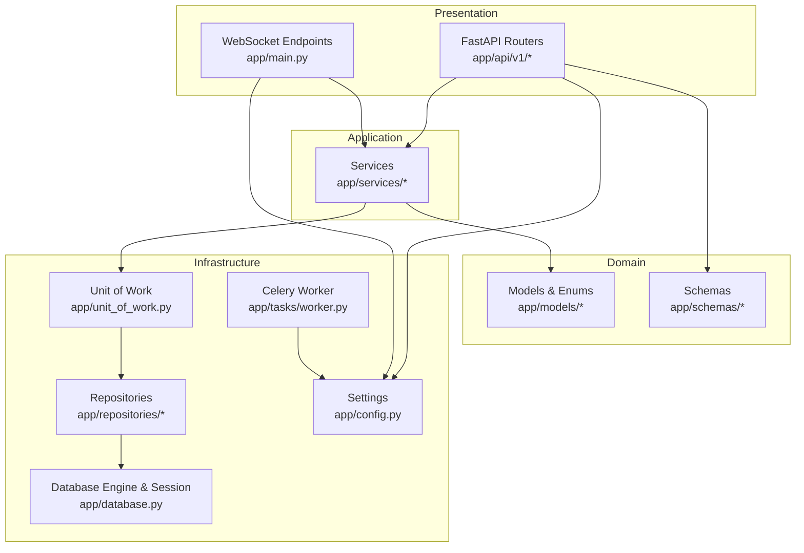
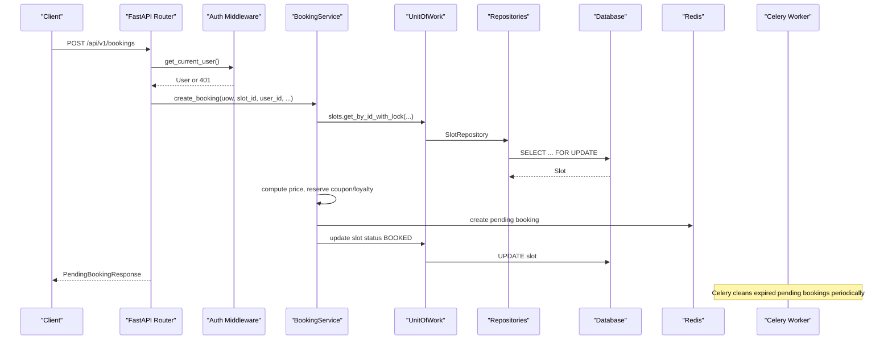
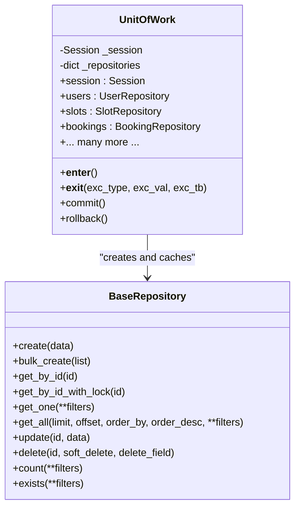
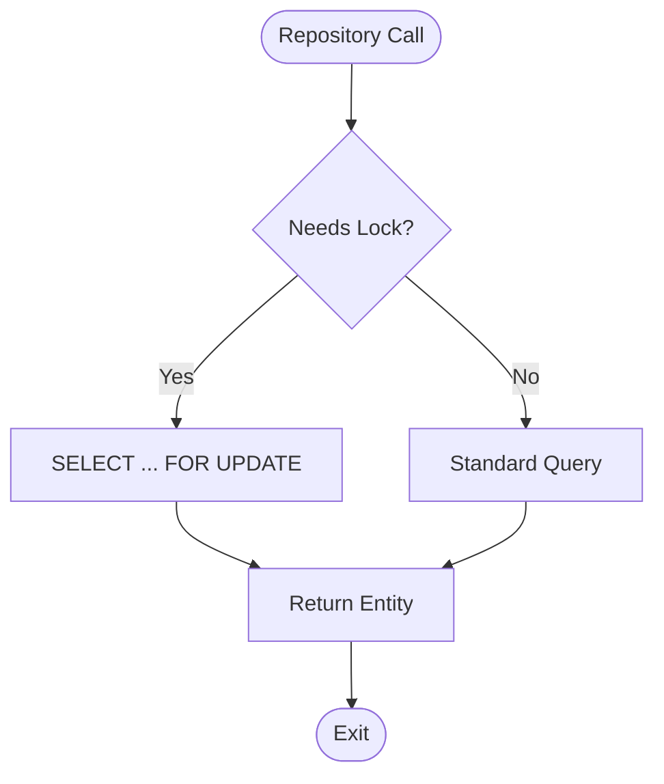
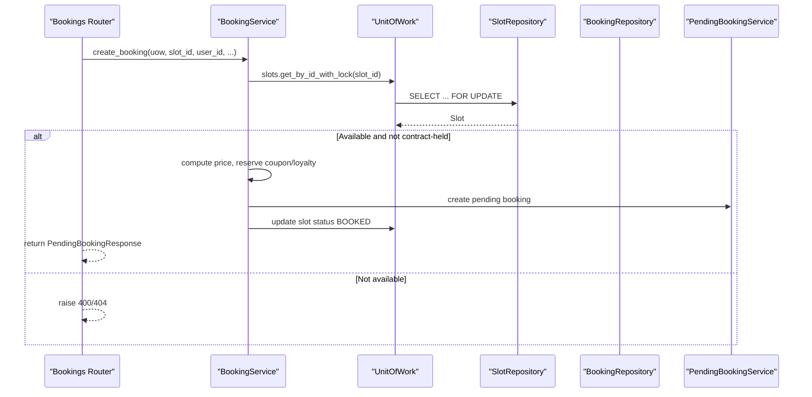
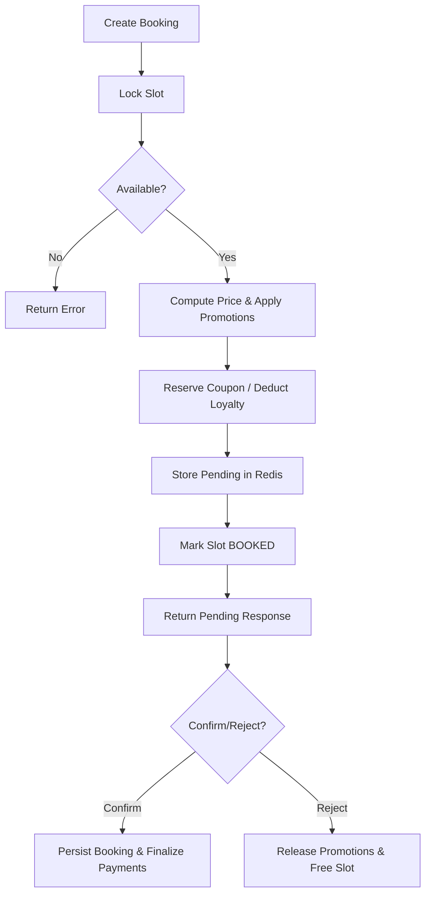
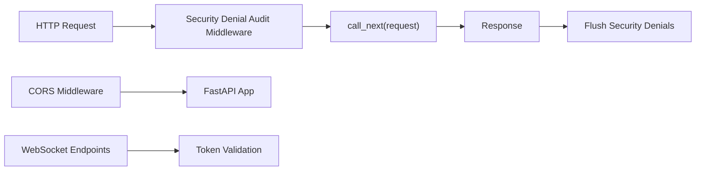
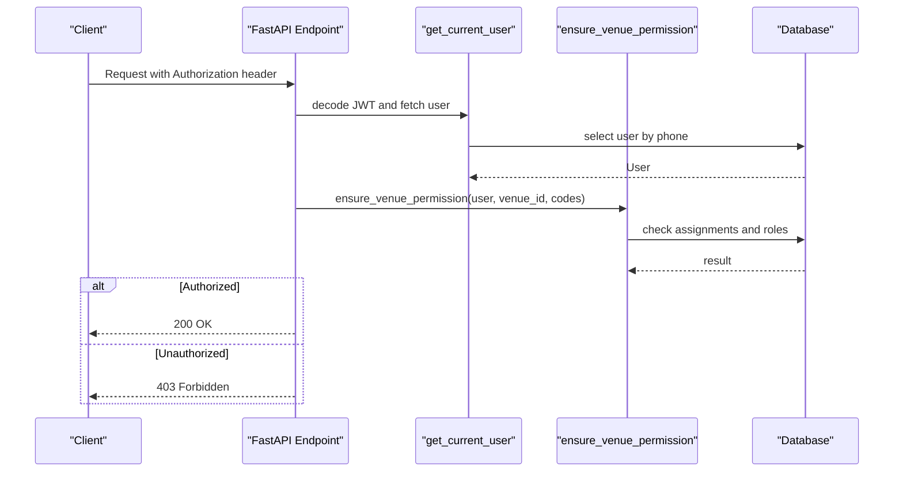
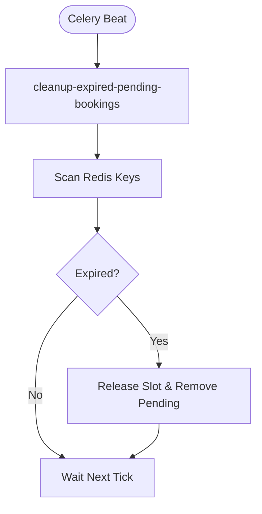
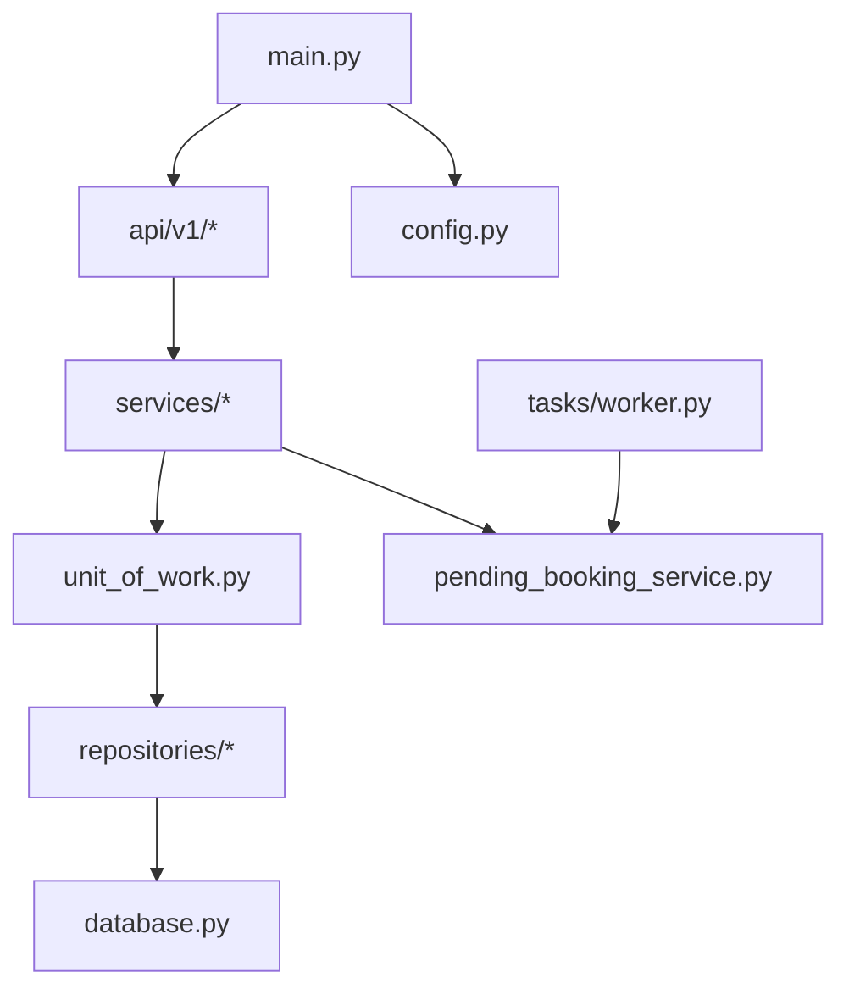

# Core Architecture

<cite>
**Referenced Files in This Document**
- [main.py](file://app/main.py)
- [config.py](file://app/config.py)
- [database.py](file://app/database.py)
- [unit_of_work.py](file://app/unit_of_work.py)
- [base.py](file://app/repositories/base.py)
- [booking_repository.py](file://app/repositories/booking_repository.py)
- [booking_service.py](file://app/services/booking_service.py)
- [bookings.py](file://app/api/v1/bookings.py)
- [pending_booking_service.py](file://app/services/pending_booking_service.py)
- [auth.py](file://app/utils/auth.py)
- [staff_access.py](file://app/utils/staff_access.py)
- [worker.py](file://app/tasks/worker.py)
- [booking.py](file://app/models/booking.py)
</cite>

## Table of Contents
1. Introduction
2. Project Structure
3. Core Components
4. Architecture Overview
5. Detailed Component Analysis
6. Dependency Analysis
7. Performance Considerations
8. Troubleshooting Guide
9. Conclusion

## Introduction
This document describes the core architecture of the Futsal Booking System backend, focusing on clean architecture layers (presentation, application, domain, infrastructure), transaction management via Unit of Work, data access abstraction via Repository, business logic encapsulation in Services, and dependency injection with FastAPI. It also covers middleware for security and CORS, background task processing with Celery/Redis, and cross-cutting concerns such as authentication, authorization, caching, and audit logging.

## Project Structure
The backend is organized into clear layers:
- Presentation: FastAPI routers under app/api/v1 define HTTP endpoints and WebSocket routes.
- Application: Services under app/services implement use cases and orchestrate domain operations.
- Domain: Models under app/models represent entities and enums; schemas under app/schemas define request/response contracts.
- Infrastructure: Repositories under app/repositories abstract persistence; database configuration and migrations live under app/database.py and migrations/. Background tasks are under app/tasks.

**Diagram sources**
- [main.py:51-209](file://app/main.py#L51-L209)
- [config.py:4-68](file://app/config.py#L4-L68)
- [database.py:9-32](file://app/database.py#L9-L32)
- [unit_of_work.py:38-321](file://app/unit_of_work.py#L38-L321)
- [base.py:8-108](file://app/repositories/base.py#L8-L108)
- [worker.py:1-26](file://app/tasks/worker.py#L1-L26)

**Section sources**
- [main.py:51-209](file://app/main.py#L51-L209)
- [config.py:4-68](file://app/config.py#L4-L68)

## Core Components
- FastAPI application with lifespan initialization and router registration.
- Unit of Work providing a single session per request and lazy-loaded repositories.
- Generic BaseRepository implementing CRUD with soft delete and locking helpers.
- Service layer orchestrating business rules across multiple repositories and external services.
- Authentication utilities using JWT and password hashing.
- RBAC and staff permission enforcement with audit logging.
- Redis-backed pending bookings and Celery scheduled cleanup.

**Section sources**
- [main.py:39-76](file://app/main.py#L39-L76)
- [unit_of_work.py:38-108](file://app/unit_of_work.py#L38-L108)
- [base.py:8-108](file://app/repositories/base.py#L8-L108)
- [booking_service.py:14-117](file://app/services/booking_service.py#L14-L117)
- [auth.py:24-112](file://app/utils/auth.py#L24-L112)
- [staff_access.py:44-145](file://app/utils/staff_access.py#L44-L145)
- [pending_booking_service.py:46-131](file://app/services/pending_booking_service.py#L46-L131)
- [worker.py:1-26](file://app/tasks/worker.py#L1-L26)

## Architecture Overview
The system follows Clean Architecture principles:
- Presentation layer exposes REST APIs and WebSockets, validates inputs via Pydantic schemas, and delegates to services.
- Application layer contains services that encode business workflows, enforce constraints, and coordinate domain objects through repositories.
- Domain layer defines models, enums, and relationships.
- Infrastructure layer provides persistence (SQLModel + SQLAlchemy engine), caching (Redis), and background jobs (Celery).

**Diagram sources**
- [bookings.py:191-237](file://app/api/v1/bookings.py#L191-L237)
- [booking_service.py:27-109](file://app/services/booking_service.py#L27-L109)
- [unit_of_work.py:38-108](file://app/unit_of_work.py#L38-L108)
- [base.py:34-40](file://app/repositories/base.py#L34-L40)
- [pending_booking_service.py:52-77](file://app/services/pending_booking_service.py#L52-L77)
- [worker.py:16-22](file://app/tasks/worker.py#L16-L22)

## Detailed Component Analysis

### Unit of Work Pattern
- Provides a single SQLModel Session per request scope and manages commit/rollback.
- Lazily instantiates repository instances bound to the same session, ensuring consistent transactions across multiple repositories.
- Exposes typed properties for each domain area (users, venues, slots, bookings, games, teams, etc.).

**Diagram sources**
- [unit_of_work.py:38-321](file://app/unit_of_work.py#L38-L321)
- [base.py:8-108](file://app/repositories/base.py#L8-L108)

**Section sources**
- [unit_of_work.py:38-108](file://app/unit_of_work.py#L38-L108)
- [base.py:8-108](file://app/repositories/base.py#L8-L108)

### Repository Pattern
- Generic BaseRepository implements common CRUD operations, including soft deletes and pagination.
- Specialized repositories add domain-specific queries and locking strategies (e.g., SELECT ... FOR UPDATE to prevent race conditions).

**Diagram sources**
- [base.py:34-40](file://app/repositories/base.py#L34-L40)
- [booking_repository.py:20-26](file://app/repositories/booking_repository.py#L20-L26)

**Section sources**
- [base.py:8-108](file://app/repositories/base.py#L8-L108)
- [booking_repository.py:1-62](file://app/repositories/booking_repository.py#L1-L62)

### Service Layer and Business Logic
- BookingService encapsulates complex workflows: availability checks, pricing computation, coupon and loyalty integration, pending reservation handling, confirmation, cancellation, and refund flows.
- Uses Unit of Work to access repositories consistently within a transaction.
- Integrates with Redis for pending reservations and with notification services for real-time updates.

**Diagram sources**
- [booking_service.py:27-109](file://app/services/booking_service.py#L27-L109)
- [bookings.py:191-237](file://app/api/v1/bookings.py#L191-L237)
- [pending_booking_service.py:52-77](file://app/services/pending_booking_service.py#L52-L77)

**Section sources**
- [booking_service.py:14-229](file://app/services/booking_service.py#L14-L229)
- [bookings.py:191-237](file://app/api/v1/bookings.py#L191-L237)

### Data Flow Patterns
- Create Booking Flow:
  - Validate user and rate limits.
  - Lock slot and verify availability.
  - Compute price and apply promotions.
  - Reserve coupon and/or deduct loyalty points.
  - Store pending reservation in Redis and mark slot as BOOKED.
  - Return pending response to client.
- Confirm/Reject Pending:
  - Venue manager confirms or rejects pending reservation.
  - On confirm: persist booking, connect coupon redemption, finalize loyalty deduction, release deal if used, notify user.
  - On reject/cancel: free slot back to AVAILABLE or RESERVED (for contracts), release coupon and refund loyalty points.

**Diagram sources**
- [booking_service.py:27-192](file://app/services/booking_service.py#L27-L192)
- [bookings.py:99-186](file://app/api/v1/bookings.py#L99-L186)
- [pending_booking_service.py:52-131](file://app/services/pending_booking_service.py#L52-L131)

**Section sources**
- [booking_service.py:27-192](file://app/services/booking_service.py#L27-L192)
- [bookings.py:99-186](file://app/api/v1/bookings.py#L99-L186)
- [pending_booking_service.py:52-131](file://app/services/pending_booking_service.py#L52-L131)

### Middleware Components
- Security Denial Audit Middleware:
  - Collects RBAC denials during request processing and flushes them post-response when SQLite write locks are released.
- CORS Middleware:
  - Configured via settings to allow specified origins and credentials.
- WebSocket Endpoints:
  - Role-based rooms and personal channels with token validation and custom close codes.

**Diagram sources**
- [main.py:59-76](file://app/main.py#L59-L76)
- [main.py:109-166](file://app/main.py#L109-L166)
- [staff_access.py:80-120](file://app/utils/staff_access.py#L80-L120)

**Section sources**
- [main.py:59-76](file://app/main.py#L59-L76)
- [main.py:109-166](file://app/main.py#L109-L166)
- [staff_access.py:80-120](file://app/utils/staff_access.py#L80-L120)

### Authentication and Authorization
- Authentication:
  - JWT creation and decoding with configurable secret and algorithm.
  - Password hashing via Argon2.
  - get_current_user dependency extracts and validates bearer tokens.
- Authorization:
  - Role-based checks for admin/manager access.
  - Staff permission enforcement scoped by venue with code-based permissions.
  - Denials logged asynchronously to avoid breaking responses.

**Diagram sources**
- [auth.py:45-112](file://app/utils/auth.py#L45-L112)
- [staff_access.py:44-145](file://app/utils/staff_access.py#L44-L145)

**Section sources**
- [auth.py:24-112](file://app/utils/auth.py#L24-L112)
- [staff_access.py:44-145](file://app/utils/staff_access.py#L44-L145)

### Background Task Processing
- Celery worker configured with Redis broker/backend.
- Scheduled task to clean up expired pending bookings every 10 minutes.
- Integration with Redis keys for pending bookings to identify and release expired ones.

**Diagram sources**
- [worker.py:16-22](file://app/tasks/worker.py#L16-L22)
- [pending_booking_service.py:113-131](file://app/services/pending_booking_service.py#L113-L131)

**Section sources**
- [worker.py:1-26](file://app/tasks/worker.py#L1-L26)
- [pending_booking_service.py:113-131](file://app/services/pending_booking_service.py#L113-L131)

### Cross-Cutting Concerns
- Caching:
  - Redis used for pending bookings and potential future caching layers.
- Audit Logging:
  - Security denial events flushed after rollback to ensure consistency.
  - Staff assignment changes and other state transitions logged within Unit of Work.
- Rate Limiting:
  - Applied at endpoint level for booking creation to protect resources.

**Section sources**
- [staff_access.py:80-120](file://app/utils/staff_access.py#L80-L120)
- [bookings.py:191-237](file://app/api/v1/bookings.py#L191-L237)

## Dependency Analysis
Key dependencies and interactions:
- FastAPI depends on config for environment settings and database initialization.
- Routers depend on services for business logic.
- Services depend on Unit of Work for transactional access to repositories.
- Repositories depend on SQLAlchemy engine and models.
- Background tasks depend on Redis and Celery.

**Diagram sources**
- [main.py:51-209](file://app/main.py#L51-L209)
- [unit_of_work.py:38-321](file://app/unit_of_work.py#L38-L321)
- [database.py:9-32](file://app/database.py#L9-L32)
- [worker.py:1-26](file://app/tasks/worker.py#L1-L26)

**Section sources**
- [main.py:51-209](file://app/main.py#L51-L209)
- [unit_of_work.py:38-321](file://app/unit_of_work.py#L38-L321)
- [database.py:9-32](file://app/database.py#L9-L32)
- [worker.py:1-26](file://app/tasks/worker.py#L1-L26)

## Performance Considerations
- Use SELECT ... FOR UPDATE to prevent race conditions on critical resources like slots and bookings.
- Batch operations where possible (bulk_create) to reduce round trips.
- Avoid N+1 queries by enriching responses with preloaded related entities.
- Configure connection pool sizes appropriately for high concurrency.
- Offload long-running tasks to Celery workers to keep request paths fast.

[No sources needed since this section provides general guidance]

## Troubleshooting Guide
Common issues and resolutions:
- Invalid or expired JWT:
  - Ensure correct secret and algorithm; validate token before accessing protected endpoints.
- Permission denied:
  - Verify user role and staff assignment; check required permission codes.
- Pending booking conflicts:
  - Check Redis keys for slot conflicts; ensure cleanup tasks run regularly.
- Database lock contention:
  - Review usage of FOR UPDATE and ensure transactions are short-lived.
- Audit logs not written:
  - Confirm middleware runs post-response and database is accessible for best-effort flush.

**Section sources**
- [auth.py:57-112](file://app/utils/auth.py#L57-L112)
- [staff_access.py:80-145](file://app/utils/staff_access.py#L80-L145)
- [pending_booking_service.py:113-131](file://app/services/pending_booking_service.py#L113-L131)
- [main.py:59-76](file://app/main.py#L59-L76)

## Conclusion
The Futsal Booking System employs a well-structured clean architecture with clear separation of concerns. The Unit of Work pattern ensures transactional integrity across repositories, while the Repository pattern abstracts data access. Services encapsulate complex business logic, and FastAPI provides a robust presentation layer with middleware for security and CORS. Background tasks handle asynchronous workloads, and Redis supports temporary state and caching. Together, these components deliver a scalable, maintainable, and secure platform for managing futsal bookings.

[No sources needed since this section summarizes without analyzing specific files]