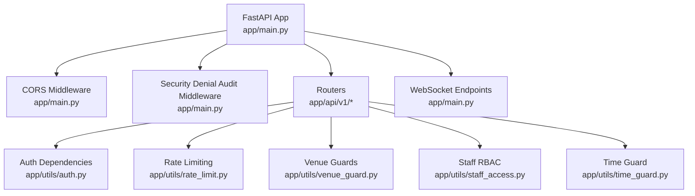
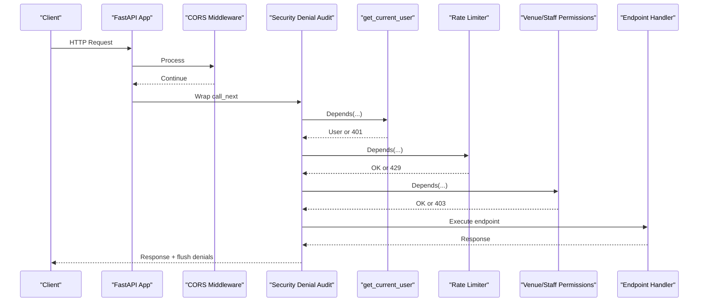
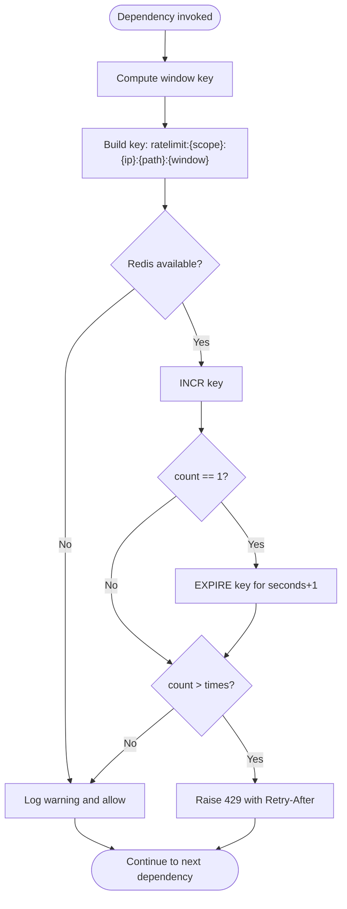
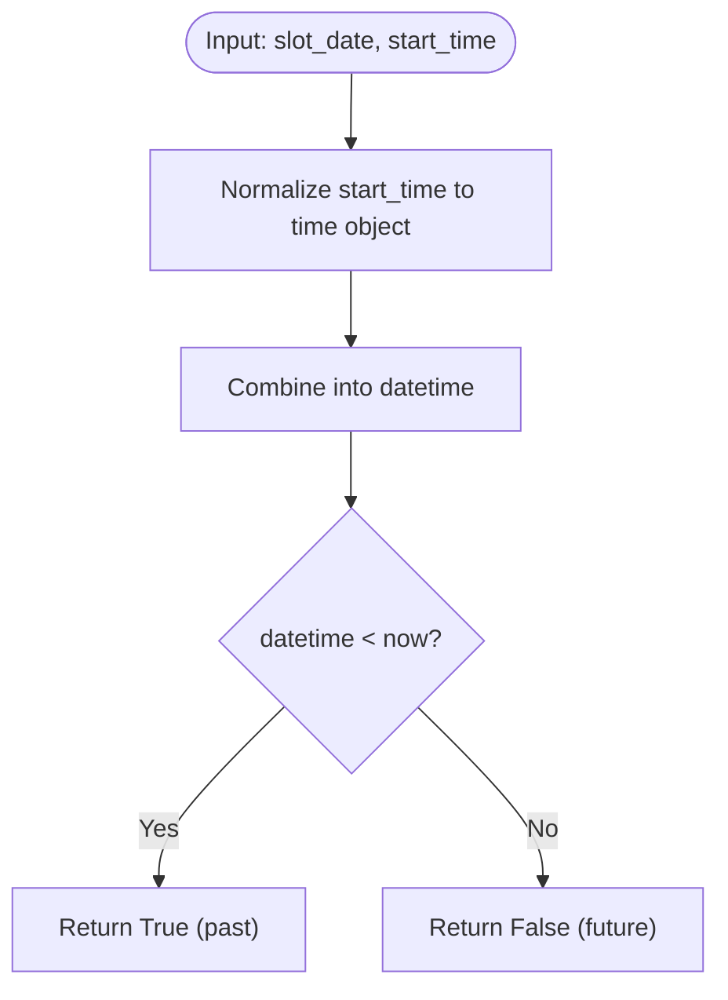
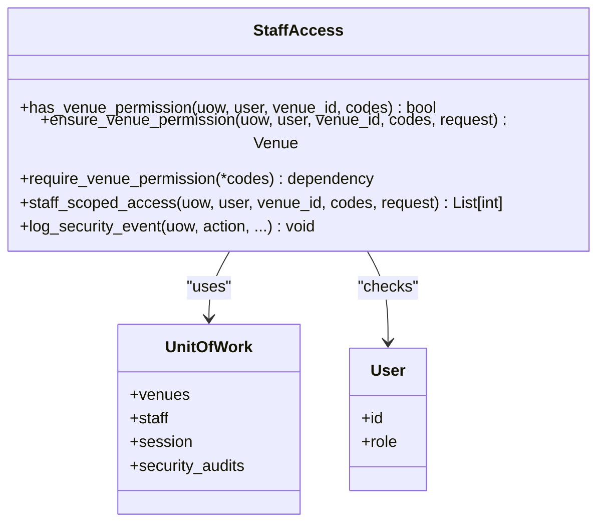
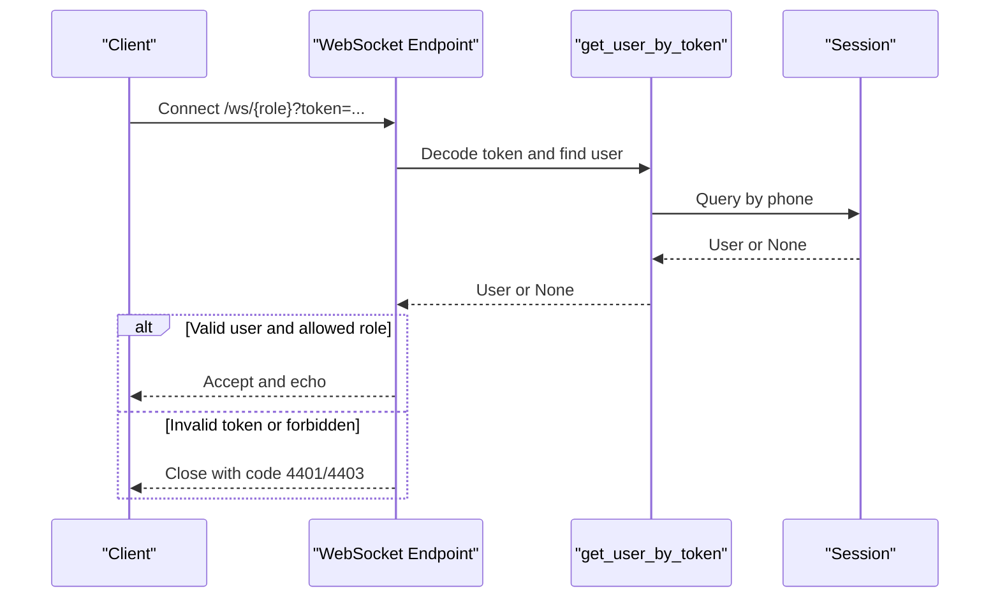
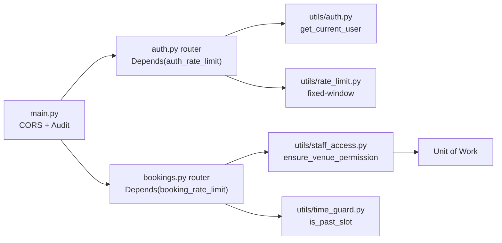

# Middleware & Security

<cite>
**Referenced Files in This Document**
- [main.py](file://app/main.py)
- [config.py](file://app/config.py)
- [auth.py](file://app/utils/auth.py)
- [rate_limit.py](file://app/utils/rate_limit.py)
- [time_guard.py](file://app/utils/time_guard.py)
- [venue_guard.py](file://app/utils/venue_guard.py)
- [staff_access.py](file://app/utils/staff_access.py)
- [auth_router.py](file://app/api/v1/auth.py)
- [bookings_router.py](file://app/api/v1/bookings.py)
- [test_rate_limit.py](file://tests/test_rate_limit.py)
- [test_security_hotfixes.py](file://tests/test_security_hotfixes.py)
</cite>

## Table of Contents
1. Introduction
2. Project Structure
3. Core Components
4. Architecture Overview
5. Detailed Component Analysis
6. Dependency Analysis
7. Performance Considerations
8. Troubleshooting Guide
9. Conclusion

## Introduction
This document explains the middleware and security components that provide cross-cutting functionality across the API. It covers CORS configuration, rate limiting with Redis-backed fixed windows, time-based access controls for slots, venue-specific guards, and staff RBAC integration. It also documents execution order, request/response processing, error handling strategies, custom middleware development, security headers, performance monitoring, authentication integration, logging, debugging, optimization, and testing strategies.

## Project Structure
The application is a FastAPI service where:
- Global HTTP middleware (CORS and audit) are registered at startup.
- Routers under app/api/v1 mount feature endpoints and wire dependencies like authentication, rate limits, and permission checks.
- Shared utilities implement reusable security logic (JWT auth, rate limiting, time guards, venue guards, staff RBAC).
- Tests validate behavior including graceful degradation when Redis is down and WebSocket authorization flows.

**Diagram sources**
- [main.py:58-76](file://app/main.py#L58-L76)
- [main.py:109-166](file://app/main.py#L109-L166)
- [auth.py:85-112](file://app/utils/auth.py#L85-L112)
- [rate_limit.py:42-63](file://app/utils/rate_limit.py#L42-L63)
- [venue_guard.py:12-26](file://app/utils/venue_guard.py#L12-L26)
- [staff_access.py:123-178](file://app/utils/staff_access.py#L123-L178)
- [time_guard.py:12-21](file://app/utils/time_guard.py#L12-L21)

**Section sources**
- [main.py:51-76](file://app/main.py#L51-L76)
- [config.py:45-66](file://app/config.py#L45-L66)

## Core Components
- CORS: Configured via FastAPI’s CORSMiddleware using allowed origins from settings. Credentials are enabled; methods and headers allow all to support browser clients.
- Security denial audit: An HTTP middleware that flushes accumulated security denials after response processing to avoid blocking normal responses.
- Authentication: JWT-based with HTTP Bearer dependency, token decode/encode, user lookup by phone, and role-scoped helpers for admin/manager access.
- Rate limiting: Fixed-window limiter per IP + path + scope backed by Redis; returns 429 with Retry-After header; degrades gracefully if Redis is unavailable.
- Time guard: Utility to determine if a slot has started/passed based on date and start time.
- Venue guard: Ensures a user is manager of a venue or super admin; provides venue ID lists scoped to managers.
- Staff RBAC: Centralized permission checks for staff assignments and codes; accumulates denials for auditing; provides dependency factories for route-level enforcement.

**Section sources**
- [main.py:58-76](file://app/main.py#L58-L76)
- [main.py:59-67](file://app/main.py#L59-L67)
- [auth.py:45-112](file://app/utils/auth.py#L45-L112)
- [rate_limit.py:24-63](file://app/utils/rate_limit.py#L24-L63)
- [time_guard.py:12-21](file://app/utils/time_guard.py#L12-L21)
- [venue_guard.py:12-26](file://app/utils/venue_guard.py#L12-L26)
- [staff_access.py:44-178](file://app/utils/staff_access.py#L44-L178)

## Architecture Overview
Request flow through middleware and dependencies:
1. Request enters FastAPI.
2. CORS middleware runs first (global), then security denial audit middleware captures denials post-handling.
3. Router-level dependencies execute:
   - Authentication (Bearer token decode and user resolution).
   - Rate limiters (per-scope counters in Redis).
   - Venue and staff permission checks.
4. Endpoint handler executes business logic.
5. Response is returned; audit middleware flushes any accumulated denials.

**Diagram sources**
- [main.py:58-76](file://app/main.py#L58-L76)
- [main.py:59-67](file://app/main.py#L59-L67)
- [auth.py:85-112](file://app/utils/auth.py#L85-L112)
- [rate_limit.py:42-63](file://app/utils/rate_limit.py#L42-L63)
- [staff_access.py:159-178](file://app/utils/staff_access.py#L159-L178)

## Detailed Component Analysis

### CORS Configuration
- Origins are parsed from settings and applied via CORSMiddleware with credentials enabled.
- Methods and headers are set to allow all to simplify client integrations.
- Ensure production origins are restricted to trusted domains.

**Section sources**
- [main.py:70-76](file://app/main.py#L70-L76)
- [config.py:45-66](file://app/config.py#L45-L66)

### Rate Limiting Implementation
- Fixed-window counter per scope, IP, and path stored in Redis.
- Returns 429 with Retry-After header when exceeded.
- Graceful degradation: if Redis is unreachable, requests pass through with a warning log.
- Predefined scopes: auth, verification, booking, payment.

**Diagram sources**
- [rate_limit.py:42-63](file://app/utils/rate_limit.py#L42-L63)

**Section sources**
- [rate_limit.py:24-63](file://app/utils/rate_limit.py#L24-L63)
- [test_rate_limit.py:45-87](file://tests/test_rate_limit.py#L45-L87)
- [test_rate_limit.py:98-121](file://tests/test_rate_limit.py#L98-L121)

### Time-Based Access Controls
- Determines whether a slot has already started by combining date and start time with current time.
- Used to prevent modifications to past slots.

**Diagram sources**
- [time_guard.py:12-21](file://app/utils/time_guard.py#L12-L21)

**Section sources**
- [time_guard.py:12-21](file://app/utils/time_guard.py#L12-L21)

### Venue-Specific Guards
- Validates that the current user is the venue manager or a super admin.
- Provides a helper to list venues managed by the current user (None for super admins).

**Section sources**
- [venue_guard.py:12-26](file://app/utils/venue_guard.py#L12-L26)

### Staff RBAC Integration
- Resolves user access kind: super_admin, owner (venue manager or club owner), staff (active assignment with permission codes), or none.
- Enforces required permission codes; otherwise raises 403 and records denial for audit.
- Provides dependency factory require_venue_permission to inject checks into routes.
- Accumulates denials in request.state and flushes them after rollback/teardown.

**Diagram sources**
- [staff_access.py:44-178](file://app/utils/staff_access.py#L44-L178)
- [staff_access.py:223-230](file://app/utils/staff_access.py#L223-L230)

**Section sources**
- [staff_access.py:44-178](file://app/utils/staff_access.py#L44-L178)
- [staff_access.py:101-121](file://app/utils/staff_access.py#L101-L121)
- [main.py:59-67](file://app/main.py#L59-L67)

### Authentication System Integration
- JWT encode/decode with configurable secret, algorithm, and expiry.
- get_current_user dependency validates Bearer tokens and resolves active users.
- Role-based helpers enforce admin/manager roles.
- WebSocket endpoints accept tokens via query parameter and enforce room/ownership rules.

**Diagram sources**
- [main.py:100-166](file://app/main.py#L100-L166)
- [auth.py:57-83](file://app/utils/auth.py#L57-L83)

**Section sources**
- [auth.py:45-112](file://app/utils/auth.py#L45-L112)
- [main.py:109-166](file://app/main.py#L109-L166)
- [test_security_hotfixes.py:48-106](file://tests/test_security_hotfixes.py#L48-L106)

### Request/Response Processing and Error Handling
- Authentication errors return 401 with WWW-Authenticate header.
- Rate limit violations return 429 with Retry-After header.
- Permission denials return 403 and are recorded for audit.
- WebSocket connections close with custom codes for invalid or forbidden access.

**Section sources**
- [auth.py:85-112](file://app/utils/auth.py#L85-L112)
- [rate_limit.py:42-63](file://app/utils/rate_limit.py#L42-L63)
- [staff_access.py:123-178](file://app/utils/staff_access.py#L123-L178)
- [main.py:84-97](file://app/main.py#L84-L97)

### Custom Middleware Development
- Example: security_denial_audit middleware wraps call_next and flushes denials after response to ensure non-blocking audit writes.
- To add new global behavior, register an HTTP middleware with app.middleware("http") or use app.add_middleware.

**Section sources**
- [main.py:59-67](file://app/main.py#L59-L67)

### Security Headers Configuration
- WWW-Authenticate: Bearer is included on 401 responses from authentication dependency.
- Retry-After: Included on 429 responses from rate limiter.
- CORS headers are automatically set by CORSMiddleware based on configured origins.

**Section sources**
- [auth.py:85-112](file://app/utils/auth.py#L85-L112)
- [rate_limit.py:42-63](file://app/utils/rate_limit.py#L42-L63)
- [main.py:70-76](file://app/main.py#L70-L76)

### Performance Monitoring
- Use FastAPI’s built-in metrics or integrate an external library (e.g., Prometheus) to track latency and error rates.
- Leverage Redis operations visibility for rate limiter performance.
- Log warnings when Redis is unavailable to detect degradation early.

[No sources needed since this section provides general guidance]

### Logging Frameworks and External Security Services
- Logging: Standard Python logging used for warnings (e.g., Redis unavailability).
- External services: Redis for rate limiting and cooldowns; SMTP optional for email verification codes.
- Audit events: Security denials flushed to database for later analysis.

**Section sources**
- [rate_limit.py:48-55](file://app/utils/rate_limit.py#L48-L55)
- [staff_access.py:101-121](file://app/utils/staff_access.py#L101-L121)
- [config.py:39-45](file://app/config.py#L39-L45)

### Testing Middleware Components
- Rate limiter tests verify threshold enforcement, isolation by IP/path/scope, and graceful degradation when Redis is down.
- Security hotfix tests validate WebSocket authorization and dev_code exposure gating.

**Section sources**
- [test_rate_limit.py:45-121](file://tests/test_rate_limit.py#L45-L121)
- [test_security_hotfixes.py:48-154](file://tests/test_security_hotfixes.py#L48-L154)

## Dependency Analysis
Middleware and dependencies interact in a layered fashion:
- Global: CORS and audit middleware wrap all requests.
- Route-level: Authentication, rate limiting, and permissions are wired as dependencies in routers.
- Data layer: Unit of Work abstracts repositories and sessions; staff RBAC logs audits within UoW.

**Diagram sources**
- [main.py:58-76](file://app/main.py#L58-L76)
- [auth_router.py:57-101](file://app/api/v1/auth.py#L57-L101)
- [bookings_router.py:191-197](file://app/api/v1/bookings.py#L191-L197)
- [auth.py:85-112](file://app/utils/auth.py#L85-L112)
- [rate_limit.py:42-63](file://app/utils/rate_limit.py#L42-L63)
- [staff_access.py:123-178](file://app/utils/staff_access.py#L123-L178)
- [time_guard.py:12-21](file://app/utils/time_guard.py#L12-L21)

**Section sources**
- [auth_router.py:57-101](file://app/api/v1/auth.py#L57-L101)
- [bookings_router.py:191-197](file://app/api/v1/bookings.py#L191-L197)

## Performance Considerations
- Prefer minimal work in global middleware; keep it fast and non-blocking.
- Rate limiting uses Redis; ensure connection pooling and timeouts are tuned.
- Avoid heavy queries in permission checks; leverage indexes on venue_id and user.id.
- Cache frequently accessed data (e.g., venue lists) if appropriate.
- Monitor Redis latency and failures; degrade gracefully to maintain availability.

[No sources needed since this section provides general guidance]

## Troubleshooting Guide
Common issues and resolutions:
- 401 Unauthorized: Verify Bearer token presence and validity; check JWT secret and algorithm settings.
- 429 Too Many Requests: Inspect rate limit scope and thresholds; confirm Redis connectivity; review Retry-After header.
- 403 Forbidden: Validate venue ownership or staff assignment; ensure required permission codes are present; check audit logs for denied actions.
- WebSocket 4401/4403: Confirm token is valid and user role matches room requirements; verify ownership for personal channels.
- Redis unavailability: Expect graceful degradation; monitor warnings and consider fallback strategies.

**Section sources**
- [auth.py:85-112](file://app/utils/auth.py#L85-L112)
- [rate_limit.py:48-63](file://app/utils/rate_limit.py#L48-L63)
- [staff_access.py:123-178](file://app/utils/staff_access.py#L123-L178)
- [main.py:84-97](file://app/main.py#L84-L97)

## Conclusion
The middleware and security layers in this system provide robust cross-cutting concerns: CORS for browser compatibility, JWT-based authentication, Redis-backed rate limiting with graceful degradation, time-based slot protections, venue-scoped guards, and comprehensive staff RBAC with audit trails. The design emphasizes reliability (degradation), security (strict checks and audits), and testability (isolated unit tests). For further hardening, consider adding request tracing, structured logging, and external security service integrations such as WAF or bot protection.