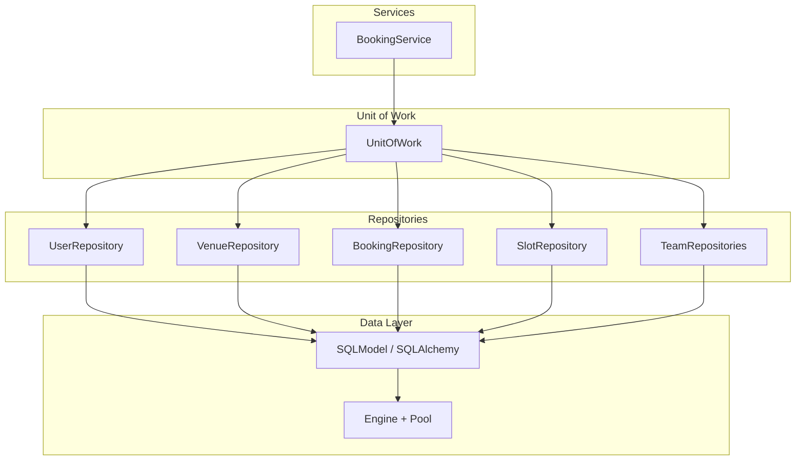
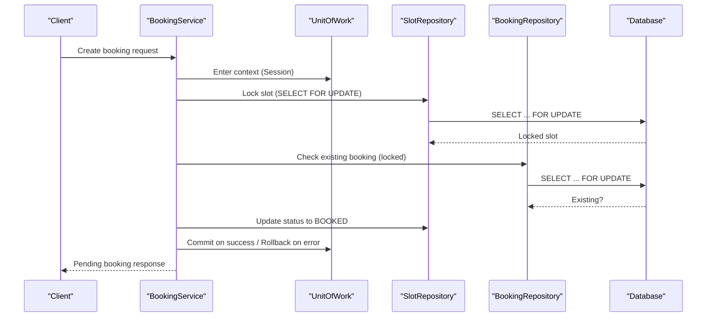
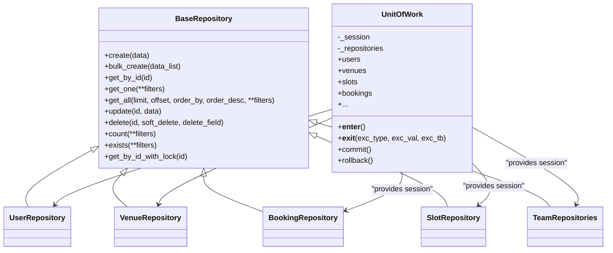

# Repository Pattern

<cite>
**Referenced Files in This Document**
- [base.py](file://app/repositories/base.py)
- [unit_of_work.py](file://app/unit_of_work.py)
- [database.py](file://app/database.py)
- [user_repository.py](file://app/repositories/user_repository.py)
- [venue_repository.py](file://app/repositories/venue_repository.py)
- [booking_repository.py](file://app/repositories/booking_repository.py)
- [slot_repository.py](file://app/repositories/slot_repository.py)
- [team_repository.py](file://app/repositories/team_repository.py)
- [booking_service.py](file://app/services/booking_service.py)
- [user.py](file://app/models/user.py)
- [venue.py](file://app/models/venue.py)
- [conftest.py](file://tests/conftest.py)
</cite>

## Table of Contents
1. Introduction
2. Project Structure
3. Core Components
4. Architecture Overview
5. Detailed Component Analysis
6. Dependency Analysis
7. Performance Considerations
8. Troubleshooting Guide
9. Conclusion
10. Appendices

## Introduction
This document explains the Repository pattern implementation that abstracts data access from business logic in the backend. It covers the base repository class, common CRUD and query abstractions, domain-specific repositories (UserRepository, VenueRepository, BookingRepository, SlotRepository, TeamRepositories), transaction coordination via Unit of Work, separation of concerns with services, testing strategies, and performance techniques including connection pooling, database abstraction benefits, and caching considerations.

## Project Structure
The repository layer sits between services and models, using SQLModel and SQLAlchemy under a shared Session managed by Unit of Work. The base repository provides reusable CRUD and query helpers; specific repositories extend it for domain operations. Services orchestrate workflows across multiple repositories within a single transactional boundary.

**Diagram sources**
- [unit_of_work.py:38-322](file://app/unit_of_work.py#L38-L322)
- [base.py:8-108](file://app/repositories/base.py#L8-L108)
- [booking_service.py:14-229](file://app/services/booking_service.py#L14-L229)
- [database.py:9-14](file://app/database.py#L9-L14)

**Section sources**
- [unit_of_work.py:38-322](file://app/unit_of_work.py#L38-L322)
- [base.py:8-108](file://app/repositories/base.py#L8-L108)
- [database.py:9-14](file://app/database.py#L9-L14)

## Core Components
- BaseRepository: Generic base providing create, bulk_create, get_by_id, get_one, get_all, update, delete (with soft-delete support), count, exists, and row locking helpers.
- UnitOfWork: Context manager owning a single Session, exposing typed repository properties to ensure all writes participate in one transaction.
- Domain Repositories: Extend BaseRepository to encapsulate domain queries and write operations (e.g., user lookups, venue search/nearby, booking lifecycle, slot availability and analytics).

Key responsibilities:
- Data access isolation: Repositories know only about models and queries.
- Transaction boundaries: Unit of Work commits or rolls back once per use case.
- Query reuse: BaseRepository reduces boilerplate; domain repos add complex filters and joins.

**Section sources**
- [base.py:8-108](file://app/repositories/base.py#L8-L108)
- [unit_of_work.py:38-322](file://app/unit_of_work.py#L38-L322)

## Architecture Overview
The system uses a layered architecture:
- API/Controllers call Services.
- Services coordinate business rules and call Unit of Work.
- Unit of Work provides consistent Session and repository instances.
- Repositories perform SQLModel/SQLAlchemy queries against the database engine.

**Diagram sources**
- [booking_service.py:27-109](file://app/services/booking_service.py#L27-L109)
- [slot_repository.py:15-18](file://app/repositories/slot_repository.py#L15-L18)
- [booking_repository.py:20-26](file://app/repositories/booking_repository.py#L20-L26)
- [unit_of_work.py:44-53](file://app/unit_of_work.py#L44-L53)

## Detailed Component Analysis

### BaseRepository
Provides generic CRUD and query utilities:
- create/bulk_create: Adds objects and flushes; commit is handled by Unit of Work.
- get_by_id/get_one/get_all: Flexible filtering, ordering, pagination.
- update/delete: Updates attributes and timestamps; supports soft delete via a flag field.
- count/exists: Aggregates counts with optional filters.
- Row-level locking: get_by_id_with_lock uses SELECT ... FOR UPDATE.

Complexity highlights:
- get_all: O(n) over filtered rows; pagination via offset/limit.
- count/exists: Single aggregate query; efficient with proper indexes.

Error handling:
- Returns None for not found cases; callers must handle absence.
- Soft delete toggles a boolean instead of hard deletes when supported.

**Section sources**
- [base.py:8-108](file://app/repositories/base.py#L8-L108)

### Unit of Work
Manages a single Session and exposes repository properties:
- Context manager ensures commit on success and rollback on exception.
- Lazy instantiation of repositories keeps them bound to the same session.
- Provides centralized access to all repositories used in a transaction.

Benefits:
- Guarantees atomicity across multiple repositories.
- Simplifies resource management (session lifecycle).

**Section sources**
- [unit_of_work.py:38-322](file://app/unit_of_work.py#L38-L322)

### UserRepository
Domain-specific methods built on BaseRepository:
- Lookup by phone, role, active users.
- Update last login, verify, change role, activate/deactivate.
- Statistics aggregation using count with filters.

Usage example paths:
- Role-based listing: [user_repository.py:15-16](file://app/repositories/user_repository.py#L15-L16)
- User statistics: [user_repository.py:36-52](file://app/repositories/user_repository.py#L36-L52)

**Section sources**
- [user_repository.py:7-53](file://app/repositories/user_repository.py#L7-L53)

### VenueRepository
Adds venue-centric queries:
- By manager, IDs, club, verified/pending lists.
- Search by name/address with substring matching.
- Nearby venues using Haversine distance calculation and sorting.
- Amenities statistics parsing JSON arrays.
- Verify/unverify toggles.

Performance notes:
- Bulk fetch by IDs avoids N+1 queries.
- Distance computation is client-side after fetching verified venues; consider spatial indexes for large datasets.

**Section sources**
- [venue_repository.py:9-95](file://app/repositories/venue_repository.py#L9-L95)

### BookingRepository
Encapsulates booking lifecycle and concurrency control:
- Get by user, slot, venue with date ranges.
- Upcoming/past bookings with joins to slots.
- Cancel booking releases slot and updates status.
- Uses SELECT ... FOR UPDATE to prevent race conditions during creation/cancellation.

Concurrency flow:
- Lock slot and check existing booking before creating pending.
- On cancel, release slot and mark booking cancelled.

**Section sources**
- [booking_repository.py:9-62](file://app/repositories/booking_repository.py#L9-L62)

### SlotRepository
Core scheduling and availability logic:
- Locking by ID for safe updates.
- Availability checks and conflict detection based on duration.
- Block/release, competition enable/disable.
- Daily slot generation with pricing integration.
- Analytics: occupancy summary, demand profile, time-slot analytics.

Concurrency and safety:
- Conflict detection excludes self during reschedule.
- Past slots are protected from price changes.

**Section sources**
- [slot_repository.py:10-330](file://app/repositories/slot_repository.py#L10-L330)

### TeamRepositories
Multiple related repositories grouped in one file:
- TeamRepository: Discovery, list by member, public teams.
- TeamMemberRepository: Membership queries, admin lists, active user sets, counts.
- TeamInvitationRepository: Pending invitations, revocation.
- TeamJoinRequestRepository: Join requests and approvals.
- TeamBookingRepository: Team-booked items mapping.
- TeamDuesRepository: Dues lifecycle, sums, ledger aggregation.
- TeamAuditEventRepository: Append-only audit log.
- TeamMessageRepository: Cursor-based chat listing and unread counts.

These demonstrate complex joins, aggregations, and cursor pagination patterns.

**Section sources**
- [team_repository.py:22-403](file://app/repositories/team_repository.py#L22-L403)

### Service Integration and Separation of Concerns
Services implement business workflows and rely on Unit of Work to coordinate repositories:
- BookingService orchestrates slot locking, pricing, coupon reservation, pending booking creation, confirmation, and cancellation.
- Clear separation: Services contain policy and orchestration; Repositories contain data access and query construction.

Example flows:
- Create booking: lock slot, compute price, reserve coupon, create pending booking, commit.
- Confirm pending: re-lock slot, validate state, persist booking, connect coupon redemption, apply loyalty points, commit.
- Cancel booking: restore slot status, mark booking cancelled, release promotions, commit.

**Section sources**
- [booking_service.py:27-229](file://app/services/booking_service.py#L27-L229)

### Models and Relationships
Models define entities and relationships consumed by repositories:
- User model includes roles, verification flags, timestamps, and relationships to venues, bookings, competitions, contracts, reviews.
- Venue model includes location, amenities, payment mode, relationships to users, slots, contracts, clubs, reviews, plans.

These relationships inform joins and foreign key constraints used in repository queries.

**Section sources**
- [user.py:7-34](file://app/models/user.py#L7-L34)
- [venue.py:10-53](file://app/models/venue.py#L10-L53)

## Dependency Analysis
High-level dependencies among components:

**Diagram sources**
- [base.py:8-108](file://app/repositories/base.py#L8-L108)
- [unit_of_work.py:38-322](file://app/unit_of_work.py#L38-L322)
- [user_repository.py:7-53](file://app/repositories/user_repository.py#L7-L53)
- [venue_repository.py:9-95](file://app/repositories/venue_repository.py#L9-L95)
- [booking_repository.py:9-62](file://app/repositories/booking_repository.py#L9-L62)
- [slot_repository.py:10-330](file://app/repositories/slot_repository.py#L10-L330)
- [team_repository.py:22-403](file://app/repositories/team_repository.py#L22-L403)

**Section sources**
- [base.py:8-108](file://app/repositories/base.py#L8-L108)
- [unit_of_work.py:38-322](file://app/unit_of_work.py#L38-L322)

## Performance Considerations
- Connection pooling: Engine configured with pool_size and max_overflow to manage concurrent connections efficiently.
- Query efficiency:
  - Use get_all with limit/offset for pagination.
  - Prefer count/exists for existence checks.
  - Avoid N+1 by batching IDs (e.g., get_by_ids).
  - Use joins in repositories for related data (e.g., bookings with slots).
- Concurrency:
  - SELECT ... FOR UPDATE prevents race conditions on critical resources (slots, bookings).
  - Unit of Work ensures atomic transactions across multiple repositories.
- Caching strategy:
  - No explicit cache layer in repositories; consider read replicas or application-level caches for hot reads (e.g., venue listings, nearby venues).
  - For heavy analytics (occupancy/demand), precompute and store summaries if needed.
- Database abstraction benefits:
  - SQLModel/SQLAlchemy provide ORM features, migrations compatibility, and testability with in-memory SQLite.
  - Centralized engine configuration simplifies environment-specific tuning.

[No sources needed since this section provides general guidance]

## Troubleshooting Guide
Common issues and remedies:
- Race conditions on slot booking:
  - Ensure locks are applied before checking/updating slot status.
  - Validate existing bookings with locked reads.
- Soft delete behavior:
  - If a model lacks the soft-delete flag, delete performs hard deletion; ensure correct fields exist.
- Transaction rollbacks:
  - Exceptions inside Unit of Work trigger rollback; inspect service logic for validation errors.
- Testing with SQLite:
  - Tests replace engine and use BEGIN IMMEDIATE to serialize writes; be aware that SELECT ... FOR UPDATE is no-op in SQLite.
  - Use fixtures to seed data and clean tables between tests.

**Section sources**
- [slot_repository.py:15-18](file://app/repositories/slot_repository.py#L15-L18)
- [booking_repository.py:20-26](file://app/repositories/booking_repository.py#L20-L26)
- [base.py:82-97](file://app/repositories/base.py#L82-L97)
- [conftest.py:62-93](file://tests/conftest.py#L62-L93)
- [conftest.py:118-140](file://tests/conftest.py#L118-L140)

## Conclusion
The repository pattern cleanly separates data access from business logic, enabling maintainable and testable code. BaseRepository standardizes CRUD and query patterns; domain repositories encapsulate complex operations. Unit of Work guarantees transactional consistency across repositories. Services orchestrate workflows while leveraging repositories for data manipulation. With careful attention to concurrency, indexing, and query design, the system scales effectively and remains robust under load.

[No sources needed since this section summarizes without analyzing specific files]

## Appendices

### Example Complex Queries
- Nearby venues with distance calculation: [venue_repository.py:44-65](file://app/repositories/venue_repository.py#L44-L65)
- Occupancy summary across venues: [slot_repository.py:278-290](file://app/repositories/slot_repository.py#L278-L290)
- Demand profile aggregation: [slot_repository.py:309-329](file://app/repositories/slot_repository.py#L309-L329)
- Team dues ledger sums: [team_repository.py:315-337](file://app/repositories/team_repository.py#L315-L337)

### Testing Strategies for Repository Layers
- Use an isolated in-memory SQLite database with WAL and BEGIN IMMEDIATE to simulate concurrency.
- Replace engine and Unit of Work in tests to avoid external dependencies.
- Seed fixtures to create realistic data scenarios and assert repository outcomes.
- Capture side effects like notifications to decouple tests from external systems.

**Section sources**
- [conftest.py:62-93](file://tests/conftest.py#L62-L93)
- [conftest.py:118-140](file://tests/conftest.py#L118-L140)
- [conftest.py:173-200](file://tests/conftest.py#L173-L200)