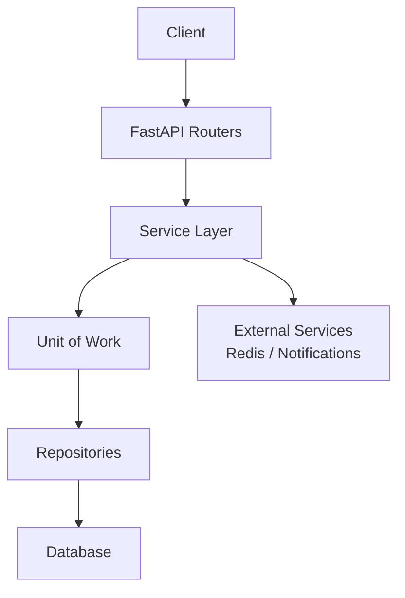
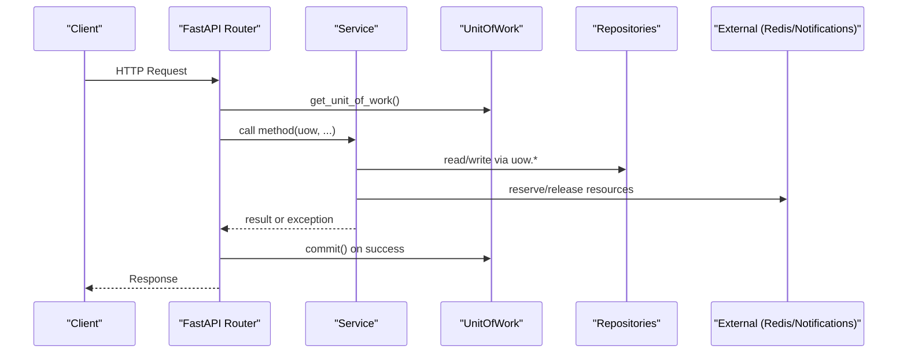
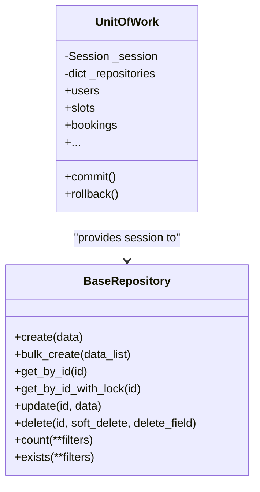
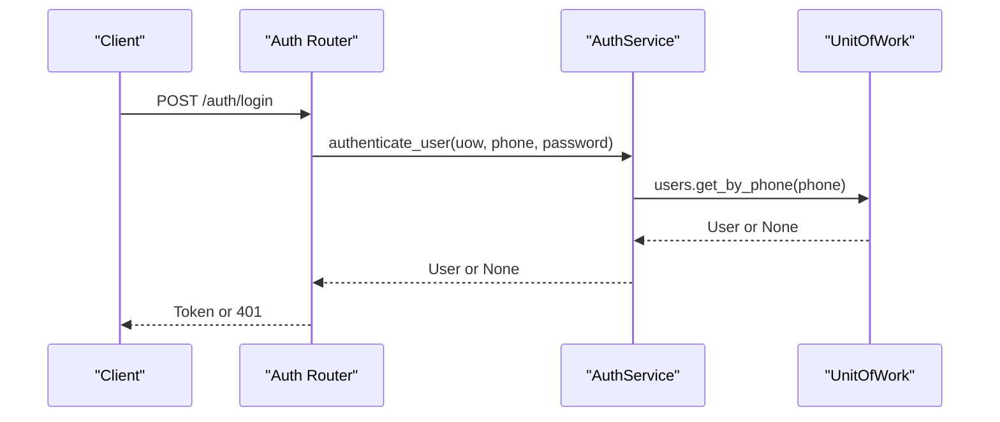
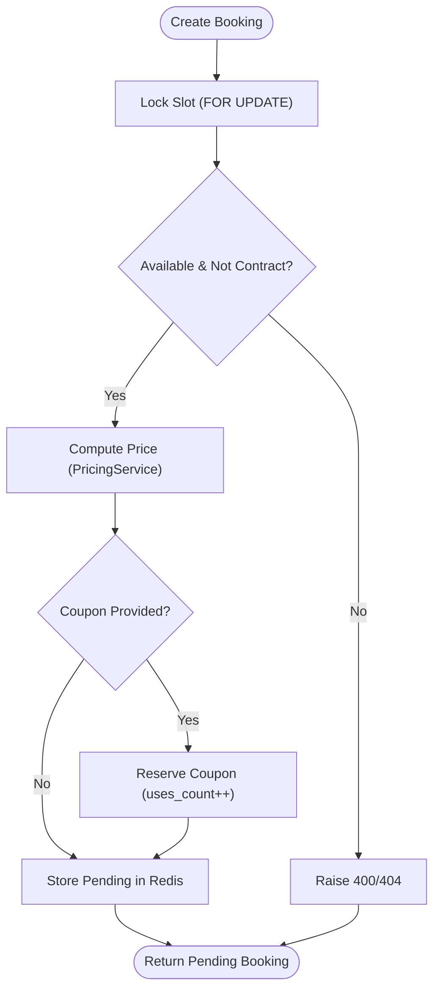
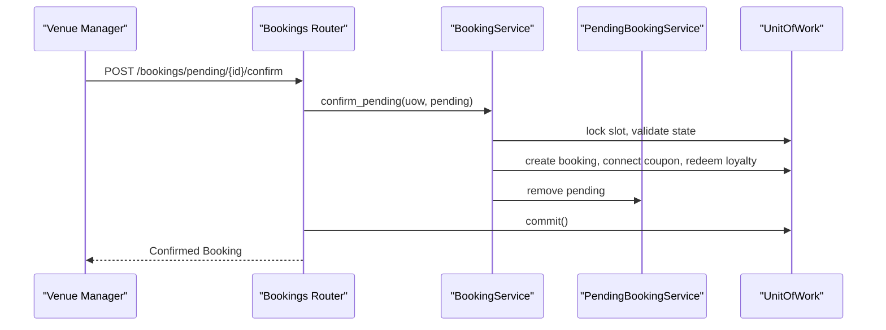
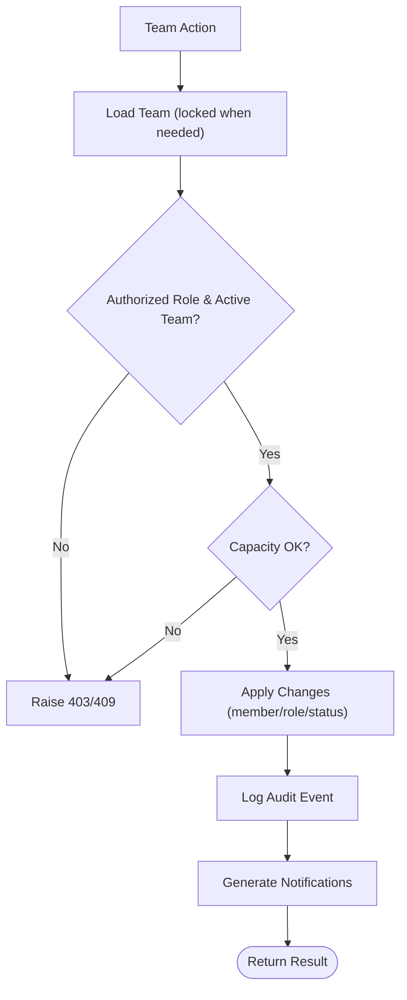
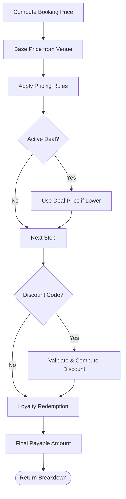
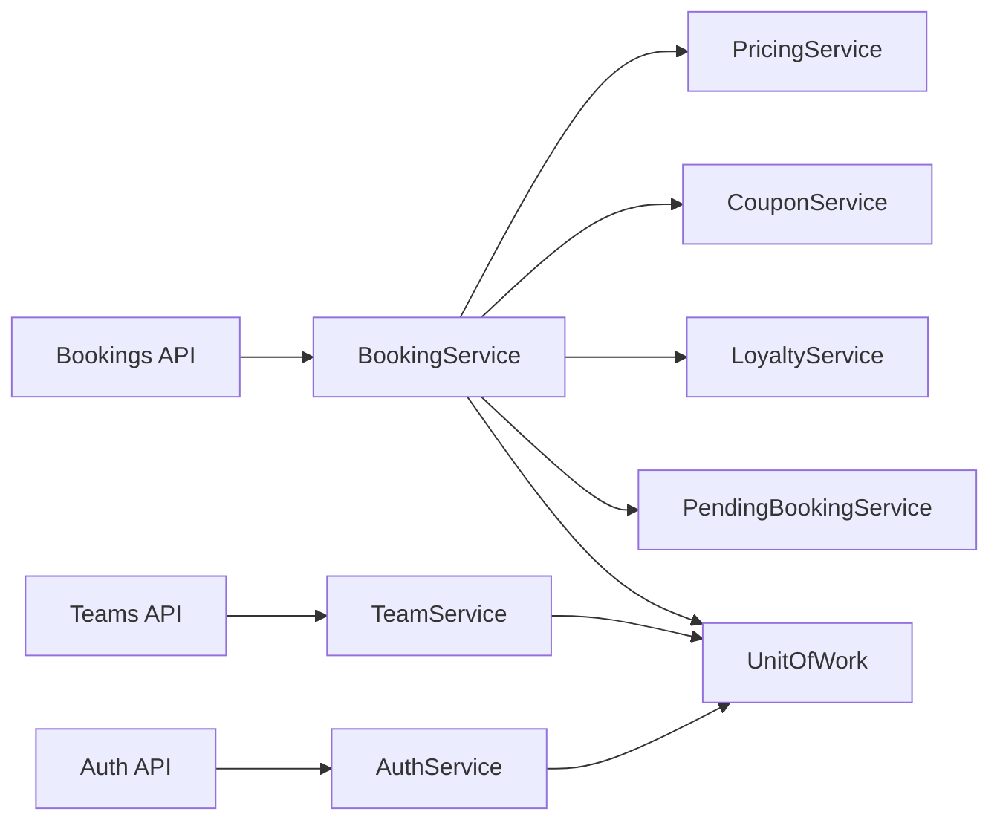

# Service Layer Architecture

<cite>
**Referenced Files in This Document**
- [unit_of_work.py](file://app/unit_of_work.py)
- [base.py](file://app/repositories/base.py)
- [auth_service.py](file://app/services/auth_service.py)
- [booking_service.py](file://app/services/booking_service.py)
- [pending_booking_service.py](file://app/services/pending_booking_service.py)
- [pricing_service.py](file://app/services/pricing_service.py)
- [coupon_service.py](file://app/services/coupon_service.py)
- [loyalty_service.py](file://app/services/loyalty_service.py)
- [team_service.py](file://app/services/team_service.py)
- [bookings.py](file://app/api/v1/bookings.py)
- [auth.py](file://app/api/v1/auth.py)
- [teams.py](file://app/api/v1/teams.py)
</cite>

## Table of Contents
1. [Introduction](#introduction)
2. [Project Structure](#project-structure)
3. [Core Components](#core-components)
4. [Architecture Overview](#architecture-overview)
5. [Detailed Component Analysis](#detailed-component-analysis)
6. [Dependency Analysis](#dependency-analysis)
7. [Performance Considerations](#performance-considerations)
8. [Troubleshooting Guide](#troubleshooting-guide)
9. [Conclusion](#conclusion)
10. [Appendices](#appendices)

## Introduction
This document explains the Service layer architecture that encapsulates business logic and orchestrates operations across repositories. It focuses on how services coordinate Unit of Work instances, enforce business rules, manage complex workflows (booking creation, team management, authentication), and maintain statelessness while handling concurrency and external integrations. It also covers dependency injection patterns, error handling strategies, testing approaches, and performance monitoring considerations.

## Project Structure
The application follows a layered design:
- API layer (FastAPI routers) handles HTTP requests, authorization, rate limiting, and delegates to services.
- Service layer contains domain logic, coordinates Unit of Work, and composes multiple repositories for complex workflows.
- Repository layer abstracts data access using SQLModel sessions via a shared Unit of Work.
- Supporting services implement cross-cutting concerns like pricing, coupons, loyalty, notifications, and pending bookings.

**Diagram sources**
- [bookings.py:191-237](file://app/api/v1/bookings.py#L191-L237)
- [auth.py:57-101](file://app/api/v1/auth.py#L57-L101)
- [teams.py:36-44](file://app/api/v1/teams.py#L36-L44)
- [unit_of_work.py:38-68](file://app/unit_of_work.py#L38-L68)

**Section sources**
- [bookings.py:191-237](file://app/api/v1/bookings.py#L191-L237)
- [auth.py:57-101](file://app/api/v1/auth.py#L57-L101)
- [teams.py:36-44](file://app/api/v1/teams.py#L36-L44)
- [unit_of_work.py:38-68](file://app/unit_of_work.py#L38-L68)

## Core Components
- Unit of Work: Provides a single database session per request and exposes typed repository accessors. Ensures atomic commits or rollbacks and prevents session leaks.
- BaseRepository: Generic CRUD with safe defaults (flush-only within UoW), soft delete support, locking helpers, and pagination/ordering utilities.
- Services: Stateless classes exposing static methods that take a Unit of Work instance; they orchestrate repositories, enforce business rules, and compose cross-service flows.
- Cross-cutting services: Pricing engine, coupon validation/reservation, loyalty point accounting, and pending booking storage in Redis.

Key responsibilities:
- Business rule enforcement at service boundaries (availability checks, capacity limits, role-based permissions).
- Concurrency control via database row locks (SELECT FOR UPDATE) and short-lived reservations in Redis.
- Idempotent financial and loyalty adjustments tied to source entities.

**Section sources**
- [unit_of_work.py:38-68](file://app/unit_of_work.py#L38-L68)
- [base.py:8-108](file://app/repositories/base.py#L8-L108)
- [pricing_service.py:44-244](file://app/services/pricing_service.py#L44-L244)
- [coupon_service.py:30-120](file://app/services/coupon_service.py#L30-L120)
- [loyalty_service.py:25-110](file://app/services/loyalty_service.py#L25-L110)

## Architecture Overview
Services are invoked by FastAPI endpoints through dependency injection of Unit of Work. Each endpoint opens a UoW context, calls one or more service methods, and commits or rolls back automatically.

**Diagram sources**
- [bookings.py:191-237](file://app/api/v1/bookings.py#L191-L237)
- [auth.py:57-101](file://app/api/v1/auth.py#L57-L101)
- [unit_of_work.py:310-322](file://app/unit_of_work.py#L310-L322)

## Detailed Component Analysis

### Unit of Work and Repository Pattern
- The Unit of Work creates a Session, lazily instantiates repositories bound to that session, and ensures commit/rollback semantics via context manager or generator.
- BaseRepository provides consistent create/update/delete/count/exists and safe locking helper for race condition prevention.

**Diagram sources**
- [unit_of_work.py:38-68](file://app/unit_of_work.py#L38-L68)
- [base.py:8-108](file://app/repositories/base.py#L8-L108)

**Section sources**
- [unit_of_work.py:38-68](file://app/unit_of_work.py#L38-L68)
- [base.py:8-108](file://app/repositories/base.py#L8-L108)

### Authentication Flow
- Registration validates uniqueness and persists user via AuthService and UoW.
- Login authenticates credentials, enforces verification status for managers, updates last login, and issues tokens.
- Password change verifies old password before updating hash.

**Diagram sources**
- [auth.py:82-101](file://app/api/v1/auth.py#L82-L101)
- [auth_service.py:5-34](file://app/services/auth_service.py#L5-L34)

**Section sources**
- [auth.py:57-101](file://app/api/v1/auth.py#L57-L101)
- [auth_service.py:5-34](file://app/services/auth_service.py#L5-L34)

### Booking Creation Workflow
- Validates slot availability and contract constraints using row-level locks to prevent races.
- Computes price server-side via PricingService (base → rules → deal → coupon → loyalty).
- Reserves coupon temporarily and stores pending booking in Redis with TTL.
- Manager confirms to persist booking, connect redemption, deduct loyalty points, and finalize deal usage.

**Diagram sources**
- [booking_service.py:26-109](file://app/services/booking_service.py#L26-L109)
- [pricing_service.py:147-229](file://app/services/pricing_service.py#L147-L229)
- [coupon_service.py:82-95](file://app/services/coupon_service.py#L82-L95)
- [pending_booking_service.py:52-77](file://app/services/pending_booking_service.py#L52-L77)

**Section sources**
- [booking_service.py:26-109](file://app/services/booking_service.py#L26-L109)
- [pricing_service.py:147-229](file://app/services/pricing_service.py#L147-L229)
- [coupon_service.py:82-95](file://app/services/coupon_service.py#L82-L95)
- [pending_booking_service.py:52-77](file://app/services/pending_booking_service.py#L52-L77)

### Booking Confirmation and Release
- Confirm transitions pending to confirmed, connects coupon redemption, applies loyalty deduction, and clears deal flags if used.
- Reject or cancel releases reserved promotions and restores slot status appropriately (AVAILABLE or RESERVED for contracts).

**Diagram sources**
- [bookings.py:99-131](file://app/api/v1/bookings.py#L99-L131)
- [booking_service.py:118-192](file://app/services/booking_service.py#L118-L192)
- [pending_booking_service.py:83-95](file://app/services/pending_booking_service.py#L83-L95)

**Section sources**
- [bookings.py:99-131](file://app/api/v1/bookings.py#L99-L131)
- [booking_service.py:118-192](file://app/services/booking_service.py#L118-L192)
- [pending_booking_service.py:83-95](file://app/services/pending_booking_service.py#L83-L95)

### Team Management Workflow
- Enforces membership roles, capacity limits, visibility rules, and audit logging.
- Uses row locks for capacity-sensitive operations (invites, accept/decline, join decisions).
- Integrates finance ledger for dues payments with idempotency keys.

**Diagram sources**
- [team_service.py:59-135](file://app/services/team_service.py#L59-L135)
- [team_service.py:187-213](file://app/services/team_service.py#L187-L213)
- [team_service.py:389-454](file://app/services/team_service.py#L389-L454)

**Section sources**
- [team_service.py:59-135](file://app/services/team_service.py#L59-L135)
- [team_service.py:187-213](file://app/services/team_service.py#L187-L213)
- [team_service.py:389-454](file://app/services/team_service.py#L389-L454)

### Pricing Engine and Promotions
- Centralized server-side pricing computation ensures no client-influenced prices.
- Applies venue base price, time/day/holiday rules, server adjustments, last-minute deals, coupons, and loyalty points with clamping to minimum floor.
- Coupons validated and reserved atomically; redeemed upon confirmation; released on rejection/cancellation.

**Diagram sources**
- [pricing_service.py:94-132](file://app/services/pricing_service.py#L94-L132)
- [pricing_service.py:147-229](file://app/services/pricing_service.py#L147-L229)
- [coupon_service.py:34-72](file://app/services/coupon_service.py#L34-L72)

**Section sources**
- [pricing_service.py:94-132](file://app/services/pricing_service.py#L94-L132)
- [pricing_service.py:147-229](file://app/services/pricing_service.py#L147-L229)
- [coupon_service.py:34-72](file://app/services/coupon_service.py#L34-L72)

## Dependency Analysis
- API routes depend on services via function parameters; services depend on Unit of Work for repository access.
- Services compose other services (e.g., BookingService uses PricingService, CouponService, LoyaltyService).
- External dependencies: Redis for pending bookings; notification service for async messaging.

**Diagram sources**
- [bookings.py:191-237](file://app/api/v1/bookings.py#L191-L237)
- [auth.py:57-101](file://app/api/v1/auth.py#L57-L101)
- [teams.py:36-44](file://app/api/v1/teams.py#L36-L44)
- [booking_service.py:26-109](file://app/services/booking_service.py#L26-L109)
- [team_service.py:59-135](file://app/services/team_service.py#L59-L135)

**Section sources**
- [bookings.py:191-237](file://app/api/v1/bookings.py#L191-L237)
- [auth.py:57-101](file://app/api/v1/auth.py#L57-L101)
- [teams.py:36-44](file://app/api/v1/teams.py#L36-L44)
- [booking_service.py:26-109](file://app/services/booking_service.py#L26-L109)
- [team_service.py:59-135](file://app/services/team_service.py#L59-L135)

## Performance Considerations
- Concurrency safety:
  - Database row locks (SELECT FOR UPDATE) protect against race conditions during slot reservation and team capacity changes.
  - Redis-backed pending bookings provide fast, scalable temporary holds with TTL expiration.
- Query efficiency:
  - Batch enrichment avoids N+1 queries when building responses (e.g., loading slots and venues by IDs).
  - Pagination and filtering in repositories reduce payload sizes.
- Pricing computation:
  - Deterministic, server-side calculation ensures consistency and allows caching of rule sets if needed.
- Financial and loyalty adjustments:
  - Idempotency keys prevent duplicate ledger entries on retries.

[No sources needed since this section provides general guidance]

## Troubleshooting Guide
Common errors and their origins:
- Slot not found or already booked: raised when locking or checking availability fails.
- Invalid or expired coupon: validation raises structured errors with Persian messages.
- Insufficient loyalty balance: explicit check before redemption.
- Unauthorized actions: role and permission checks raise 403/409 with codes.

Mitigations:
- Use unit tests to assert error codes and messages.
- Add logging around service entry/exit and key decision points.
- Monitor Redis connectivity and TTL behavior for pending bookings.

**Section sources**
- [booking_service.py:41-67](file://app/services/booking_service.py#L41-L67)
- [coupon_service.py:34-72](file://app/services/coupon_service.py#L34-L72)
- [loyalty_service.py:52-64](file://app/services/loyalty_service.py#L52-L64)
- [team_service.py:63-135](file://app/services/team_service.py#L63-L135)

## Conclusion
The Service layer cleanly separates business logic from HTTP concerns, leveraging Unit of Work for transactional integrity and repositories for data access. Complex workflows like booking creation and team management are orchestrated with robust concurrency controls, deterministic pricing, and idempotent financial adjustments. Statelessness is maintained by passing UoW into services, enabling testability and scalability.

[No sources needed since this section summarizes without analyzing specific files]

## Appendices

### Testing Approaches for Service Layers
- Mock Unit of Work: Provide a fake UoW with in-memory repositories to isolate service logic from the database.
- Mock external dependencies: Stub Redis and notification services to avoid side effects.
- Assert business rules: Verify error codes, state transitions, and side effects (e.g., coupon redemption, loyalty deductions).
- Concurrency tests: Use concurrent calls to validate locking behavior and absence of race conditions.

[No sources needed since this section provides general guidance]

### Monitoring and Observability
- Metrics: Track request latency, error rates, and Redis operations around pending bookings.
- Logging: Log service method invocations, key validations, and outcomes for audit trails.
- Alerts: Set up alerts for failed Redis connections, high error rates in pricing or booking flows.

[No sources needed since this section provides general guidance]