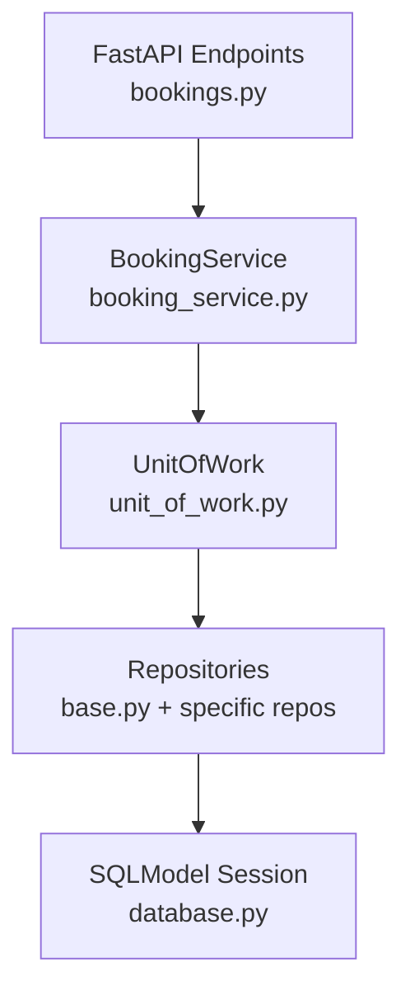
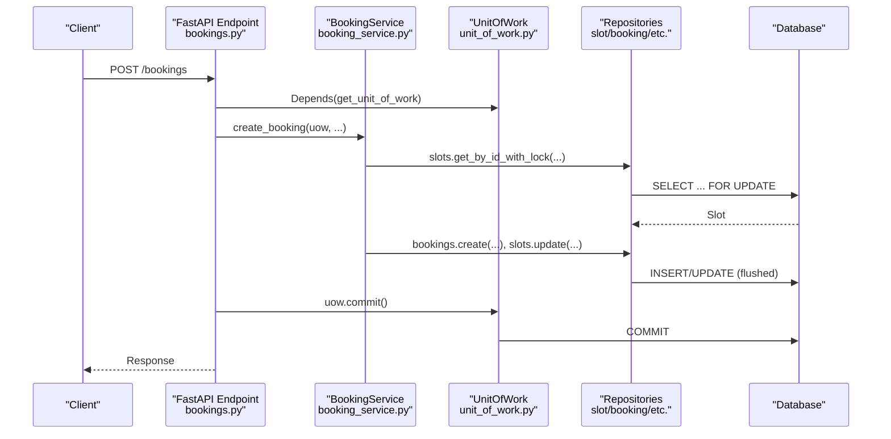
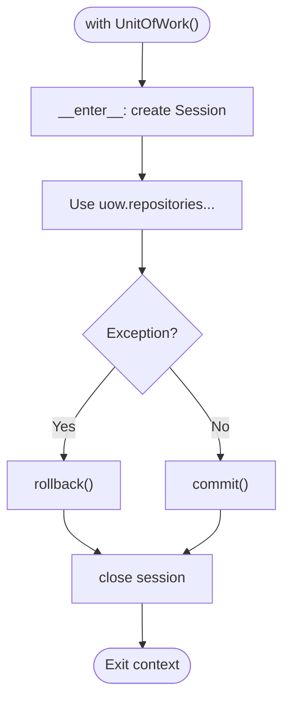
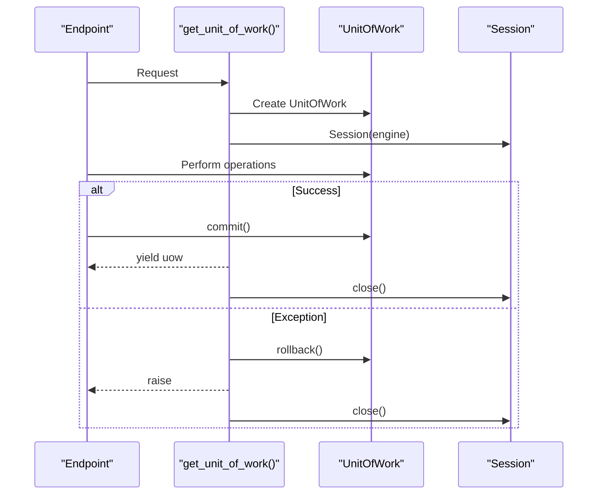
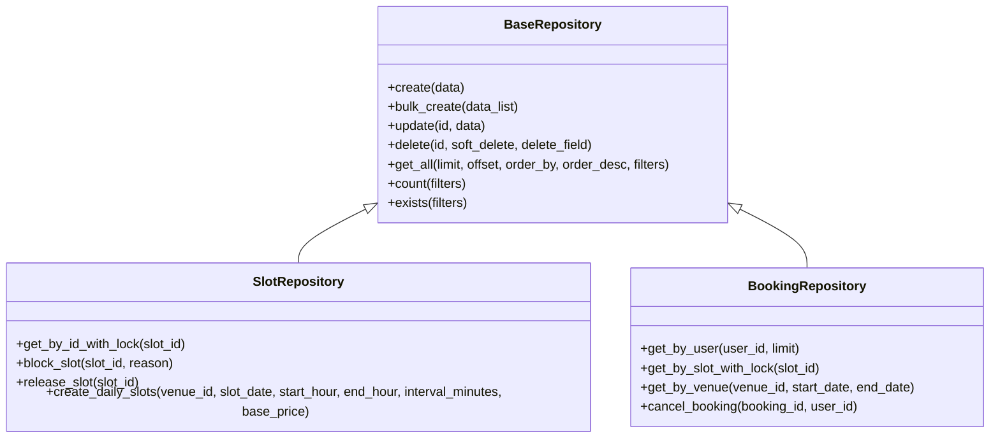
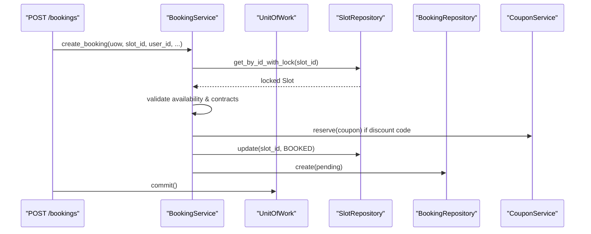
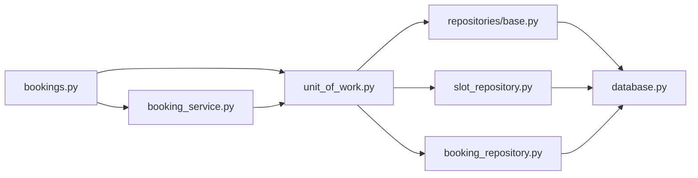

# Unit of Work Pattern

<cite>
**Referenced Files in This Document**
- [unit_of_work.py](file://app/unit_of_work.py)
- [database.py](file://app/database.py)
- [base.py](file://app/repositories/base.py)
- [booking_repository.py](file://app/repositories/booking_repository.py)
- [slot_repository.py](file://app/repositories/slot_repository.py)
- [bookings.py](file://app/api/v1/bookings.py)
- [booking_service.py](file://app/services/booking_service.py)
</cite>

## Table of Contents
1. [Introduction](#introduction)
2. [Project Structure](#project-structure)
3. [Core Components](#core-components)
4. [Architecture Overview](#architecture-overview)
5. [Detailed Component Analysis](#detailed-component-analysis)
6. [Dependency Analysis](#dependency-analysis)
7. [Performance Considerations](#performance-considerations)
8. [Troubleshooting Guide](#troubleshooting-guide)
9. [Conclusion](#conclusion)

## Introduction
This document explains the Unit of Work (UoW) pattern implementation in the Futsal Booking System and how it coordinates database transactions across multiple repositories to ensure data consistency. It covers:
- The UnitOfWork class lifecycle with context manager semantics (__enter__/__exit__)
- Automatic commit/rollback handling and session management
- How services use UoW to perform atomic operations across multiple repositories
- Dependency injection via get_unit_of_work() integrated with FastAPI request lifecycle
- Transaction isolation considerations, error handling strategies, and performance guidance for large datasets

## Project Structure
The UoW is implemented as a central coordinator that owns a single SQLModel Session and exposes typed repository accessors. Services receive a UnitOfWork instance through FastAPI’s dependency injection and perform multi-repository operations within one transaction boundary.

**Diagram sources**
- [bookings.py:191-237](file://app/api/v1/bookings.py#L191-L237)
- [booking_service.py:27-109](file://app/services/booking_service.py#L27-L109)
- [unit_of_work.py:38-322](file://app/unit_of_work.py#L38-L322)
- [base.py:8-108](file://app/repositories/base.py#L8-L108)
- [database.py:9-18](file://app/database.py#L9-L18)

**Section sources**
- [unit_of_work.py:38-322](file://app/unit_of_work.py#L38-L322)
- [database.py:9-18](file://app/database.py#L9-L18)
- [bookings.py:191-237](file://app/api/v1/bookings.py#L191-L237)
- [booking_service.py:27-109](file://app/services/booking_service.py#L27-L109)

## Core Components
- UnitOfWork: Owns a single Session, provides lazy-initialized repository instances, and manages commit/rollback on exit or explicit calls.
- BaseRepository: Generic CRUD operations that flush changes without committing; commit is delegated to UoW.
- Repository implementations: Domain-specific queries and write methods, including row-level locking where needed.
- FastAPI integration: get_unit_of_work() yields a UnitOfWork per request, commits on success, rolls back on exceptions, and closes the session.

Key responsibilities:
- Ensure all writes within a request are part of one transaction
- Provide consistent read/write views via a single Session
- Centralize resource cleanup (session close)

**Section sources**
- [unit_of_work.py:38-322](file://app/unit_of_work.py#L38-L322)
- [base.py:8-108](file://app/repositories/base.py#L8-L108)
- [bookings.py:191-237](file://app/api/v1/bookings.py#L191-L237)

## Architecture Overview
The system uses a layered approach:
- API layer declares dependencies using Depends(get_unit_of_work)
- Service layer orchestrates business logic across multiple repositories
- UoW ensures all repository operations share the same Session and transaction
- Repositories encapsulate data access and may use SELECT ... FOR UPDATE to prevent race conditions

**Diagram sources**
- [bookings.py:191-237](file://app/api/v1/bookings.py#L191-L237)
- [booking_service.py:27-109](file://app/services/booking_service.py#L27-L109)
- [slot_repository.py:15-18](file://app/repositories/slot_repository.py#L15-L18)
- [booking_repository.py:20-26](file://app/repositories/booking_repository.py#L20-L26)
- [unit_of_work.py:310-322](file://app/unit_of_work.py#L310-L322)

## Detailed Component Analysis

### UnitOfWork Lifecycle and Context Manager
- __enter__: Creates a new Session bound to the application engine and returns self.
- __exit__: On exception, rollback; otherwise commit; then close and clear the session.
- Explicit commit/rollback: Available for manual control when not using the context manager.
- Lazy repository properties: Each repository is instantiated once per UoW with the shared Session.

**Diagram sources**
- [unit_of_work.py:44-68](file://app/unit_of_work.py#L44-L68)

**Section sources**
- [unit_of_work.py:44-68](file://app/unit_of_work.py#L44-L68)

### Automatic Commit/Rollback via Dependency Injection
- get_unit_of_work(): Yields a UnitOfWork instance, commits on success, rolls back on any exception, and ensures the session is closed in finally.
- FastAPI endpoints declare uow: UnitOfWork = Depends(get_unit_of_work) to obtain a request-scoped unit of work.

**Diagram sources**
- [unit_of_work.py:310-322](file://app/unit_of_work.py#L310-L322)

**Section sources**
- [unit_of_work.py:310-322](file://app/unit_of_work.py#L310-L322)
- [bookings.py:191-237](file://app/api/v1/bookings.py#L191-L237)

### Repository Coordination Within a Single Transaction
- BaseRepository methods call flush() after writes but do not commit; UoW controls commit boundaries.
- Domain repositories implement domain-specific reads/writes and can lock rows with SELECT ... FOR UPDATE to avoid races.

Examples:
- SlotRepository.get_by_id_with_lock: Locks a slot before updates to prevent concurrent booking conflicts.
- BookingRepository.get_by_slot_with_lock: Confirms no existing confirmed booking for the slot under lock.

**Diagram sources**
- [base.py:8-108](file://app/repositories/base.py#L8-L108)
- [slot_repository.py:15-18](file://app/repositories/slot_repository.py#L15-L18)
- [booking_repository.py:20-26](file://app/repositories/booking_repository.py#L20-L26)

**Section sources**
- [base.py:8-108](file://app/repositories/base.py#L8-L108)
- [slot_repository.py:15-18](file://app/repositories/slot_repository.py#L15-L18)
- [booking_repository.py:20-26](file://app/repositories/booking_repository.py#L20-L26)

### Service Usage: Atomic Operations Across Multiple Repositories
- BookingService.create_booking demonstrates an atomic workflow:
  - Locks the target slot
  - Validates availability and contract constraints
  - Computes pricing and reserves coupon if applicable
  - Updates slot status and creates pending booking
  - All changes are flushed into the shared Session; commit occurs at endpoint level

**Diagram sources**
- [booking_service.py:27-109](file://app/services/booking_service.py#L27-L109)
- [slot_repository.py:15-18](file://app/repositories/slot_repository.py#L15-L18)
- [bookings.py:191-237](file://app/api/v1/bookings.py#L191-L237)

**Section sources**
- [booking_service.py:27-109](file://app/services/booking_service.py#L27-L109)
- [bookings.py:191-237](file://app/api/v1/bookings.py#L191-L237)

### Error Handling Strategies
- Context manager: Exceptions trigger rollback automatically in __exit__.
- Dependency generator: Exceptions trigger rollback and re-raise; session is always closed in finally.
- Repository writes flush immediately; if an exception occurs later in the request, the entire transaction is rolled back, ensuring consistency.

**Section sources**
- [unit_of_work.py:48-62](file://app/unit_of_work.py#L48-L62)
- [unit_of_work.py:310-322](file://app/unit_of_work.py#L310-L322)

### Session Lifecycle Management
- Engine configuration: Pool size and overflow are set in the application engine.
- Per-request sessions: Each request gets its own Session via UoW; sessions are closed after each request.

**Section sources**
- [database.py:9-18](file://app/database.py#L9-L18)
- [unit_of_work.py:44-54](file://app/unit_of_work.py#L44-L54)
- [unit_of_work.py:310-322](file://app/unit_of_work.py#L310-L322)

## Dependency Analysis
- API endpoints depend on get_unit_of_work() to inject a UnitOfWork.
- Services depend on UnitOfWork to access multiple repositories atomically.
- Repositories depend on BaseRepository for common operations and on the shared Session.
- Database module provides the engine and helper session factory.

**Diagram sources**
- [bookings.py:191-237](file://app/api/v1/bookings.py#L191-L237)
- [booking_service.py:27-109](file://app/services/booking_service.py#L27-L109)
- [unit_of_work.py:38-322](file://app/unit_of_work.py#L38-L322)
- [base.py:8-108](file://app/repositories/base.py#L8-L108)
- [slot_repository.py:15-18](file://app/repositories/slot_repository.py#L15-L18)
- [booking_repository.py:20-26](file://app/repositories/booking_repository.py#L20-L26)
- [database.py:9-18](file://app/database.py#L9-L18)

**Section sources**
- [bookings.py:191-237](file://app/api/v1/bookings.py#L191-L237)
- [booking_service.py:27-109](file://app/services/booking_service.py#L27-L109)
- [unit_of_work.py:38-322](file://app/unit_of_work.py#L38-L322)
- [base.py:8-108](file://app/repositories/base.py#L8-L108)
- [slot_repository.py:15-18](file://app/repositories/slot_repository.py#L15-L18)
- [booking_repository.py:20-26](file://app/repositories/booking_repository.py#L20-L26)
- [database.py:9-18](file://app/database.py#L9-L18)

## Performance Considerations
- Row-level locking: Use SELECT ... FOR UPDATE in hot paths (e.g., slot and booking checks) to avoid race conditions and reduce retries.
- Batch operations: Prefer bulk_create and batched queries to minimize round trips.
- N+1 prevention: Load related entities in batches (e.g., get_by_ids) and enrich responses efficiently.
- Connection pooling: Engine pool_size and max_overflow are configured; tune based on workload.
- Large datasets:
  - Use pagination and limits in queries
  - Avoid loading full tables; filter early
  - Consider streaming or server-side cursors for very large result sets
- Transaction scope: Keep transactions short by deferring non-essential work (e.g., notifications) outside the commit boundary when possible.

[No sources needed since this section provides general guidance]

## Troubleshooting Guide
Common issues and remedies:
- “Unit of work not started”: Accessing uow.session outside a context or before __enter__; ensure usage via with or dependency injection.
- Uncommitted changes: If you bypass the context manager, explicitly call uow.commit(); otherwise, changes will be rolled back on exit.
- Deadlocks or timeouts: Excessive long-running transactions or inconsistent lock ordering; shorten transactions and ensure consistent lock acquisition order.
- Session leaks: Always rely on get_unit_of_work() or with blocks; they guarantee session closure even on exceptions.

**Section sources**
- [unit_of_work.py:64-68](file://app/unit_of_work.py#L64-L68)
- [unit_of_work.py:48-62](file://app/unit_of_work.py#L48-L62)
- [unit_of_work.py:310-322](file://app/unit_of_work.py#L310-L322)

## Conclusion
The Unit of Work pattern in the Futsal Booking System centralizes transaction management, coordinates multiple repositories within a single transaction boundary, and ensures data consistency through automatic commit/rollback and strict session lifecycle control. Services compose complex workflows across repositories while FastAPI integrates seamlessly via dependency injection. By combining row-level locks, efficient querying, and disciplined transaction scoping, the system maintains correctness and performance even under concurrency and large dataset scenarios.

[No sources needed since this section summarizes without analyzing specific files]