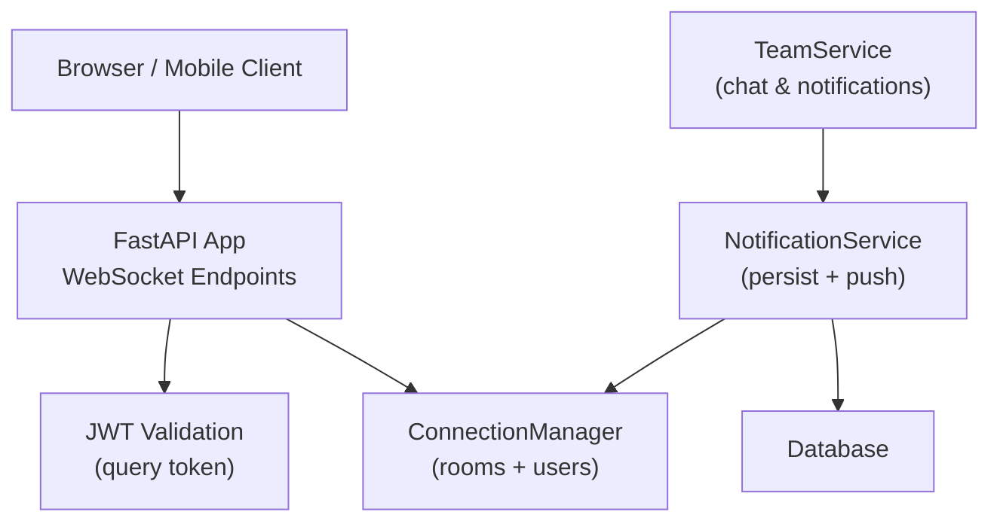
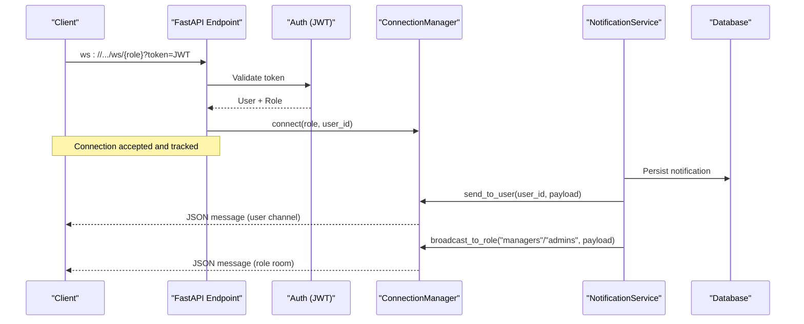
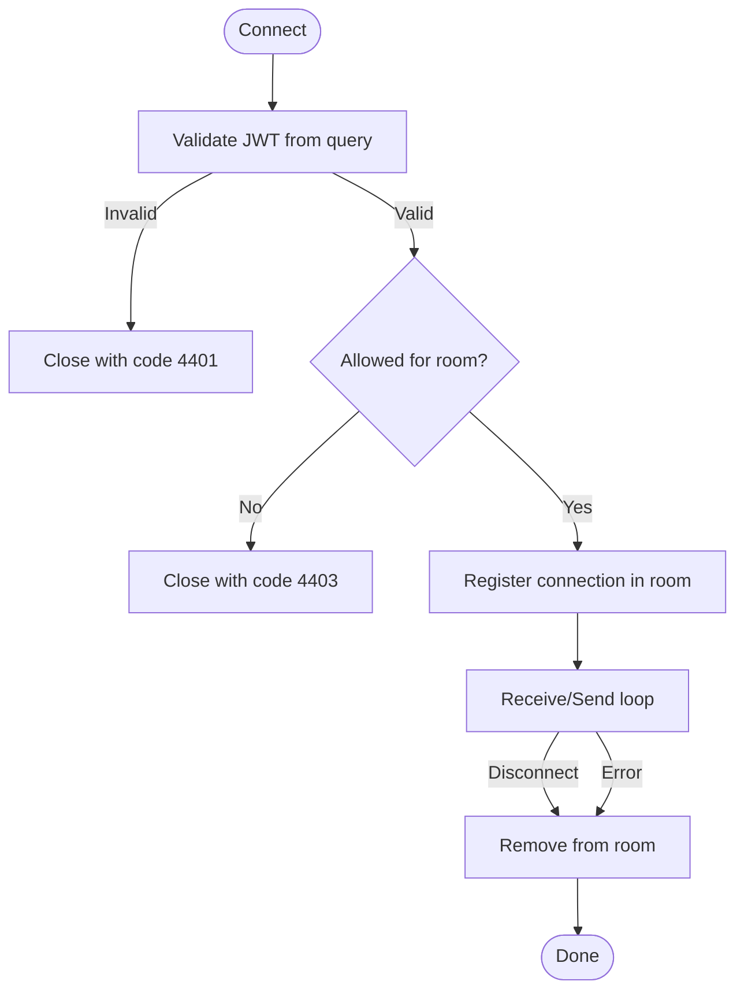
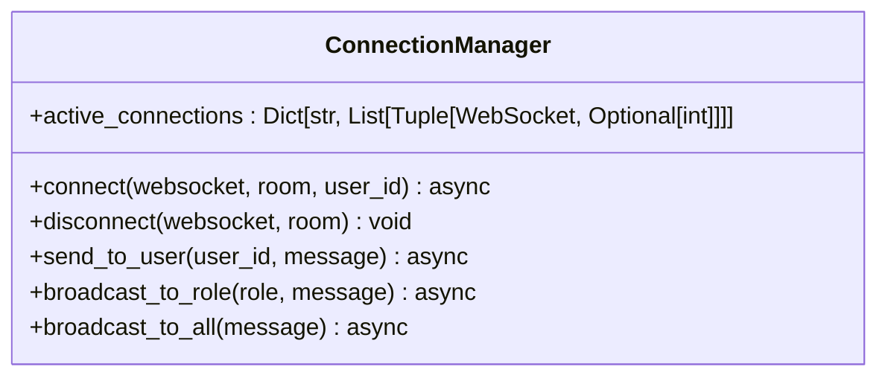
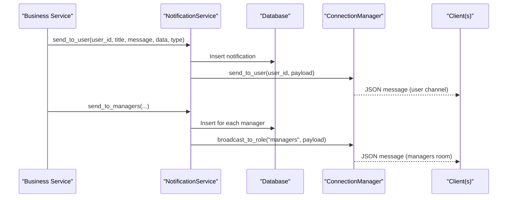
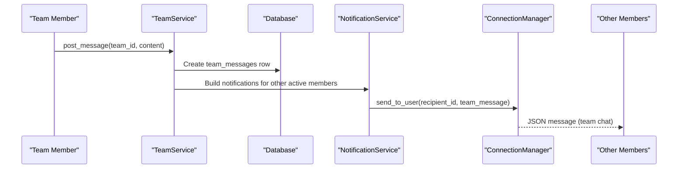
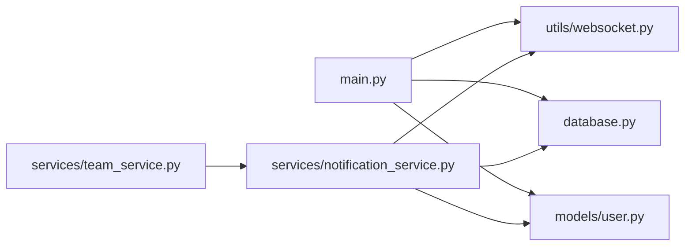

# WebSocket Real-time Communication

<cite>
**Referenced Files in This Document**
- [main.py](file://app/main.py)
- [websocket.py](file://app/utils/websocket.py)
- [notification_service.py](file://app/services/notification_service.py)
- [team_service.py](file://app/services/team_service.py)
- [m0s015_team_official_chat.py](file://migrations/versions/m0s015_team_official_chat.py)
</cite>

## Table of Contents
1. [Introduction](#introduction)
2. [Project Structure](#project-structure)
3. [Core Components](#core-components)
4. [Architecture Overview](#architecture-overview)
5. [Detailed Component Analysis](#detailed-component-analysis)
6. [Dependency Analysis](#dependency-analysis)
7. [Performance Considerations](#performance-considerations)
8. [Troubleshooting Guide](#troubleshooting-guide)
9. [Conclusion](#conclusion)
10. [Appendices](#appendices)

## Introduction
This document explains the real-time communication layer built on WebSockets for the Futsal Booking System. It covers connection management, role-based rooms, user-scoped channels, message broadcasting, and how business events (bookings, contracts, team chat) are delivered to clients. It also documents the protocol endpoints, event types, lifecycle handling, reconnection strategies, error handling, scalability considerations, and monitoring guidance.

## Project Structure
The WebSocket subsystem spans a few key files:
- FastAPI application endpoints that accept WebSocket connections and enforce authentication and authorization
- A connection manager that tracks active connections per room and supports targeted or broadcast messaging
- A notification service that persists notifications and pushes them via WebSockets
- Team services that generate notifications for team chat and other features

**Diagram sources**
- [main.py:109-166](file://app/main.py#L109-L166)
- [websocket.py:12-65](file://app/utils/websocket.py#L12-L65)
- [notification_service.py:12-92](file://app/services/notification_service.py#L12-L92)
- [team_service.py:820-877](file://app/services/team_service.py#L820-L877)

**Section sources**
- [main.py:109-166](file://app/main.py#L109-L166)
- [websocket.py:12-65](file://app/utils/websocket.py#L12-L65)
- [notification_service.py:12-92](file://app/services/notification_service.py#L12-L92)
- [team_service.py:820-877](file://app/services/team_service.py#L820-L877)

## Core Components
- ConnectionManager: Tracks active WebSocket connections by room ("users", "managers", "admins") and provides methods to connect, disconnect, send to a specific user, and broadcast to roles or all rooms.
- WebSocket Endpoints: Role-based and user-specific channels with JWT validation via query parameter and strict role checks.
- NotificationService: Persists notifications and delivers them via WebSocket to targeted users or role-based rooms.
- TeamService: Produces notifications for team chat and other team-related events; dispatches them through NotificationService.

Key responsibilities:
- Authentication: Extract JWT from query string and validate against the same logic used for HTTP requests.
- Authorization: Restrict access to role-based rooms based on user roles.
- Messaging: Provide targeted delivery to a user’s connected sessions and broadcasts to role rooms.
- Persistence: Ensure notifications survive disconnections by storing them in the database before pushing.

**Section sources**
- [websocket.py:12-65](file://app/utils/websocket.py#L12-L65)
- [main.py:100-166](file://app/main.py#L100-L166)
- [notification_service.py:12-92](file://app/services/notification_service.py#L12-L92)
- [team_service.py:820-877](file://app/services/team_service.py#L820-L877)

## Architecture Overview
The system uses FastAPI WebSocket endpoints to manage connections and a centralized ConnectionManager for routing messages. Business services trigger notifications which are persisted and then pushed to clients via WebSockets.

**Diagram sources**
- [main.py:100-166](file://app/main.py#L100-L166)
- [websocket.py:22-65](file://app/utils/websocket.py#L22-L65)
- [notification_service.py:50-92](file://app/services/notification_service.py#L50-L92)

## Detailed Component Analysis

### WebSocket Endpoints and Lifecycle
- Role-based endpoint: Accepts connections to /ws/{role} after validating JWT and ensuring the user’s role is allowed for that room. Connects the client to the appropriate room and handles echo-style text round-trips for liveness. Disconnects clean up removes the connection from the room.
- User-scoped endpoint: Accepts connections to /ws/user/{user_id} only if the requester owns the account or is a super admin. Connects the client to the "users" room with the authenticated user_id attached.

Lifecycle highlights:
- Accept handshake, validate token, check role, register connection
- Message loop with exception handling
- Finally block ensures cleanup on disconnect or error

**Diagram sources**
- [main.py:109-166](file://app/main.py#L109-L166)

**Section sources**
- [main.py:109-166](file://app/main.py#L109-L166)

### ConnectionManager: Rooms, Targeting, Broadcasting
- Rooms: "users" (personal channel), "managers", "admins"
- Methods:
  - connect(websocket, room, user_id): accepts and registers
  - disconnect(websocket, room): removes dead connections
  - send_to_user(user_id, message): targets all connections belonging to a verified user_id across rooms, deduplicating by connection id
  - broadcast_to_role(role, message): sends to all connections in a role room
  - broadcast_to_all(message): fans out to all rooms

Error handling:
- On send failures, the manager attempts to remove the broken connection from its room to keep state consistent.

**Diagram sources**
- [websocket.py:12-65](file://app/utils/websocket.py#L12-L65)

**Section sources**
- [websocket.py:12-65](file://app/utils/websocket.py#L12-L65)

### NotificationService: Persistence and Push
- Persists each notification to the database so offline clients can fetch later
- Pushes via WebSocket using ConnectionManager:
  - send_to_user: personal channel delivery
  - send_to_managers / send_to_admins: role-based broadcasts
- Domain helpers provide semantic notifications for bookings, contracts, and team events

Event types and payloads:
- user_notification: sent to a specific user
- manager_notification: sent to managers room
- admin_notification: sent to admins room
- team_message: sent to team members via user channels

**Diagram sources**
- [notification_service.py:50-92](file://app/services/notification_service.py#L50-L92)

**Section sources**
- [notification_service.py:50-92](file://app/services/notification_service.py#L50-L92)

### Team Chat: Data Model and Real-time Flow
- Database schema adds team_messages and related fields to support team chat and unread tracking
- TeamService posts messages to the database and generates notifications for other active team members
- Notifications are dispatched via NotificationService to each recipient’s user channel

**Diagram sources**
- [m0s015_team_official_chat.py:52-82](file://migrations/versions/m0s015_team_official_chat.py#L52-L82)
- [team_service.py:820-877](file://app/services/team_service.py#L820-L877)

**Section sources**
- [m0s015_team_official_chat.py:52-82](file://migrations/versions/m0s015_team_official_chat.py#L52-L82)
- [team_service.py:820-877](file://app/services/team_service.py#L820-L877)

## Dependency Analysis
- main.py depends on:
  - app.utils.websocket.manager for connection management
  - app.models.user.UserRole for role checks
  - app.database.get_session for DB session injection
- websocket.py is self-contained and exposes a singleton manager
- notification_service.py depends on:
  - app.utils.websocket.manager for push
  - app.database engine for persistence
  - app.models.notification.Notification and app.models.user.UserRole
- team_service.py depends on:
  - app.services.notification_service.notification_service for dispatching notifications

**Diagram sources**
- [main.py:109-166](file://app/main.py#L109-L166)
- [websocket.py:12-65](file://app/utils/websocket.py#L12-L65)
- [notification_service.py:12-92](file://app/services/notification_service.py#L12-L92)
- [team_service.py:820-877](file://app/services/team_service.py#L820-L877)

**Section sources**
- [main.py:109-166](file://app/main.py#L109-L166)
- [websocket.py:12-65](file://app/utils/websocket.py#L12-L65)
- [notification_service.py:12-92](file://app/services/notification_service.py#L12-L92)
- [team_service.py:820-877](file://app/services/team_service.py#L820-L877)

## Performance Considerations
- Room scoping: Use role-based rooms for broad announcements and user channels for targeted updates to minimize fan-out overhead.
- Broadcast strategy: Prefer broadcast_to_role for group events; avoid broadcast_to_all unless necessary.
- Deduplication: ConnectionManager.send_to_user deduplicates by connection id to prevent duplicate messages when a user is in multiple rooms.
- Error resilience: Send exceptions trigger removal of dead connections to prevent memory leaks and repeated failures.
- Scaling horizontally:
  - The current in-memory ConnectionManager does not share state across processes. For multi-process deployments, consider an external pub/sub (e.g., Redis) to bridge rooms across workers.
  - Introduce a lightweight message bus to decouple producers from WebSocket workers.
- Connection pooling:
  - Maintain minimal open connections per user by reusing a single WebSocket per device/browser tab.
  - Implement heartbeat/ping-pong to detect stale connections quickly.
- Monitoring metrics:
  - Track active connections per room and per user
  - Count messages sent/received per room and per user
  - Measure latency between event creation and delivery
  - Log and alert on frequent disconnects or send failures

[No sources needed since this section provides general guidance]

## Troubleshooting Guide
Common issues and resolutions:
- Invalid or missing token:
  - Symptom: Connection closed with custom code 4401
  - Cause: Missing, expired, or invalid JWT in query string
  - Resolution: Ensure client passes a valid token; refresh tokens before reconnecting
- Forbidden access:
  - Symptom: Connection closed with custom code 4403
  - Cause: User role not permitted for the requested room
  - Resolution: Connect to the correct room or upgrade role
- Dead connections:
  - Symptom: Messages fail to send; room list grows with stale entries
  - Cause: Network drop without proper close
  - Resolution: Rely on ConnectionManager’s exception handling to prune; implement client-side ping/pong and reconnect
- Offline notifications:
  - Symptom: Missed real-time updates
  - Resolution: Notifications are persisted; clients should poll or sync on reconnect to catch up

Operational tips:
- Inspect logs around ConnectionManager disconnect paths and NotificationService persistence
- Verify CORS settings allow WebSocket origins
- Confirm role mappings align with UserRole values

**Section sources**
- [main.py:84-126](file://app/main.py#L84-L126)
- [websocket.py:33-65](file://app/utils/websocket.py#L33-L65)
- [notification_service.py:19-37](file://app/services/notification_service.py#L19-L37)

## Conclusion
The WebSocket layer provides secure, role-aware, real-time messaging with robust persistence and clear separation of concerns. It supports personal channels, role-based rooms, and domain-driven notifications for bookings, contracts, and team chat. For production-scale deployments, introduce horizontal scaling support via a shared pub/sub layer, add comprehensive metrics, and standardize heartbeat and reconnection patterns on clients.

[No sources needed since this section summarizes without analyzing specific files]

## Appendices

### WebSocket Protocol Summary
- Endpoints:
  - ws://{host}/ws/{role}?token={jwt} — role-based room
  - ws://{host}/ws/user/{user_id}?token={jwt} — personal channel
- Authentication:
  - Token passed as query parameter; validated server-side
- Authorization:
  - Role checks restrict access to rooms; super admin has broader access
- Message format:
  - JSON payloads with fields such as type, notif_type, title, message, data
- Event types:
  - user_notification, manager_notification, admin_notification, team_message

**Section sources**
- [main.py:109-166](file://app/main.py#L109-L166)
- [notification_service.py:50-92](file://app/services/notification_service.py#L50-L92)

### Reconnection Strategy (Client Guidance)
- Detect close codes 4401/4403 and prompt re-authentication or role correction
- Implement exponential backoff with jitter for reconnect attempts
- Use periodic ping/pong to detect connectivity early
- On reconnect, fetch missed notifications from the REST API to ensure consistency

[No sources needed since this section provides general guidance]