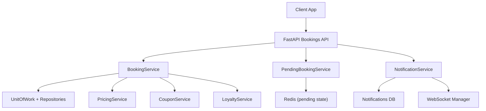
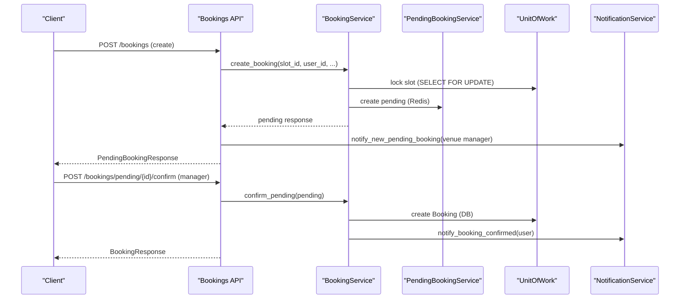
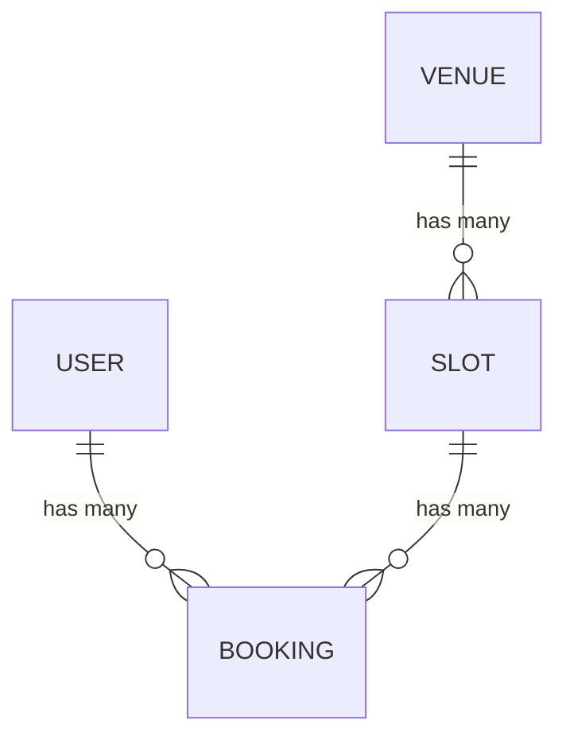
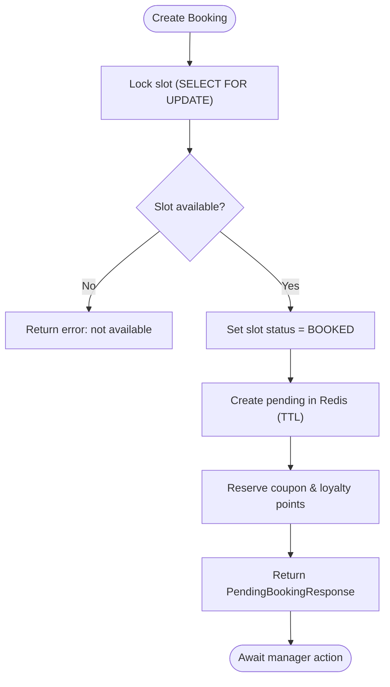
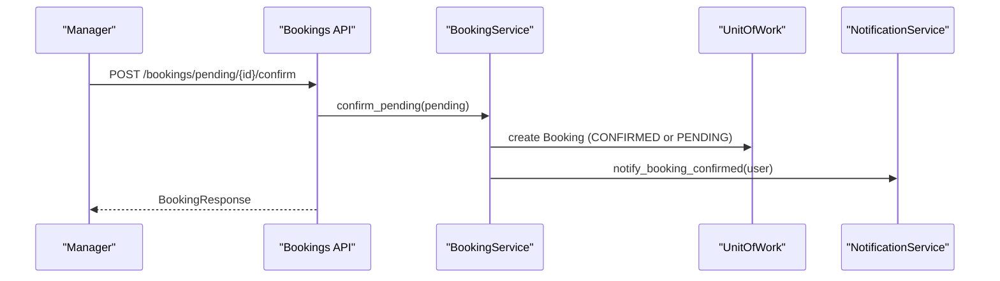
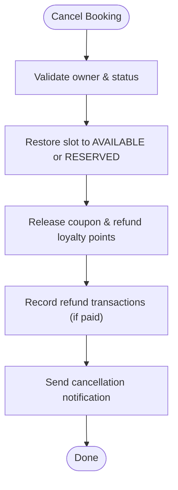
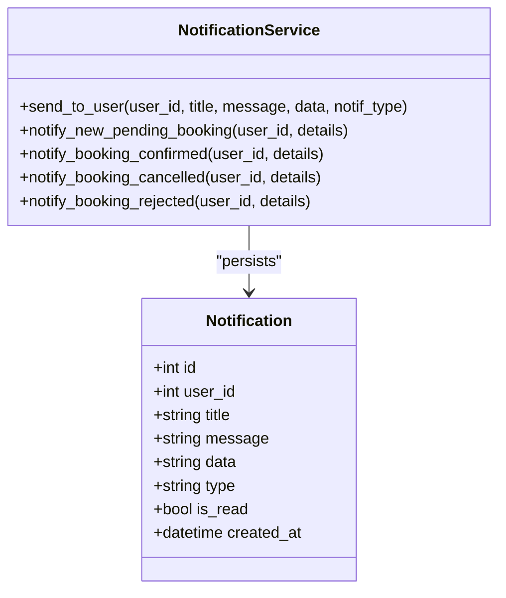
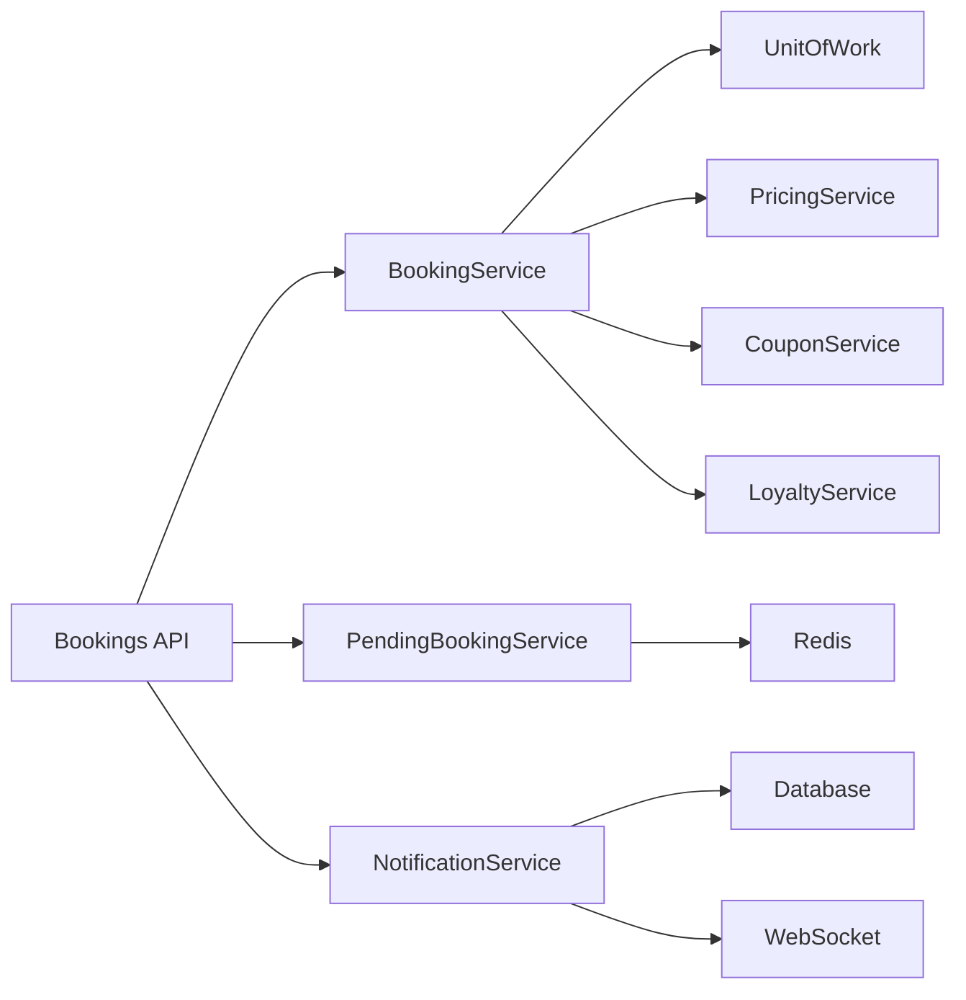

# Booking System

<cite>
**Referenced Files in This Document**
- [booking.py](file://app/models/booking.py)
- [user.py](file://app/models/user.py)
- [slot.py](file://app/models/slot.py)
- [venue.py](file://app/models/venue.py)
- [notification.py](file://app/models/notification.py)
- [booking_service.py](file://app/services/booking_service.py)
- [pending_booking_service.py](file://app/services/pending_booking_service.py)
- [bookings.py](file://app/api/v1/bookings.py)
- [schemas/booking.py](file://app/schemas/booking.py)
- [unit_of_work.py](file://app/unit_of_work.py)
</cite>

## Table of Contents
1. Introduction
2. Project Structure
3. Core Components
4. Architecture Overview
5. Detailed Component Analysis
6. Dependency Analysis
7. Performance Considerations
8. Troubleshooting Guide
9. Conclusion

## Introduction
This document explains the booking system database schema and workflows with a focus on the Booking model, its lifecycle states, relationships to User, Venue, and Slot entities, and the end-to-end pending booking workflow including slot reservation, confirmation, payment modes (bank receipt and pay-in-place), cancellation, and notification integration. It also documents validation rules, status transitions, and data integrity constraints that ensure consistency across concurrent requests.

## Project Structure
The booking domain spans models, services, API endpoints, schemas, and unit-of-work orchestration:
- Models define persistent entities and relationships (Booking, Slot, User, Venue, Notification).
- Services implement business logic for creating, confirming, cancelling bookings and managing pending reservations in Redis.
- API endpoints expose REST operations for clients and venue managers.
- Schemas validate request/response payloads.
- Unit of Work coordinates database sessions and repositories.

**Diagram sources**
- [bookings.py:191-237](file://app/api/v1/bookings.py#L191-L237)
- [booking_service.py:27-109](file://app/services/booking_service.py#L27-L109)
- [pending_booking_service.py:46-77](file://app/services/pending_booking_service.py#L46-L77)
- [notification_service.py:50-78](file://app/services/notification_service.py#L50-L78)

**Section sources**
- [bookings.py:191-237](file://app/api/v1/bookings.py#L191-L237)
- [booking_service.py:27-109](file://app/services/booking_service.py#L27-L109)
- [pending_booking_service.py:46-77](file://app/services/pending_booking_service.py#L46-L77)
- [unit_of_work.py:38-68](file://app/unit_of_work.py#L38-L68)

## Core Components
- Booking model: stores confirmed bookings with pricing details, payment mode snapshot, and receipt lifecycle fields.
- Slot model: represents time slots at venues with availability and special flags (contract/deal).
- User model: identifies customers and venue managers; linked to bookings.
- Venue model: defines payment mode defaults and is linked to slots and bookings via slots.
- Notification model: persists notifications and supports real-time delivery via WebSocket.

Key relationships:
- Booking belongs to Slot and User.
- Slot belongs to Venue and has many Bookings.
- Venue has many Slots and is managed by a User.

Validation and constraints:
- Unique user phone numbers.
- Foreign keys enforce referential integrity between Booking, Slot, User, and Venue.
- Enumerated statuses restrict invalid state transitions at the application layer.

**Section sources**
- [booking.py:21-51](file://app/models/booking.py#L21-L51)
- [slot.py:13-42](file://app/models/slot.py#L13-L42)
- [user.py:13-34](file://app/models/user.py#L13-L34)
- [venue.py:16-43](file://app/models/venue.py#L16-L43)
- [notification.py:6-18](file://app/models/notification.py#L6-L18)

## Architecture Overview
The booking flow uses a two-phase approach:
1) Pending phase: A user creates a booking; the slot is locked as BOOKED and a pending record is stored in Redis with TTL. Promotions (coupons, loyalty points) are reserved.
2) Confirmation phase: A venue manager confirms or rejects the pending booking. On confirm, a permanent Booking row is created in the database, promotions are committed or refunded appropriately, and notifications are sent.

**Diagram sources**
- [bookings.py:191-237](file://app/api/v1/bookings.py#L191-L237)
- [bookings.py:99-131](file://app/api/v1/bookings.py#L99-L131)
- [booking_service.py:27-109](file://app/services/booking_service.py#L27-L109)
- [booking_service.py:119-192](file://app/services/booking_service.py#L119-L192)
- [pending_booking_service.py:52-77](file://app/services/pending_booking_service.py#L52-L77)
- [notification_service.py:109-127](file://app/services/notification_service.py#L109-L127)

## Detailed Component Analysis

### Booking Model and Lifecycle States
- Statuses:
  - PENDING: Used when bank receipt is required; awaiting receipt approval or in-person collection.
  - CONFIRMED: Fully paid or approved receipt; active booking.
  - CANCELLED: Cancelled by user or invalidated during pending rejection/expiry.
  - COMPLETED: Reserved for future use (not used in current service flows).
- Receipt lifecycle:
  - NONE → SUBMITTED (user uploads bank receipt) → APPROVED (manager approves) or REJECTED (manager rejects).
  - Pay-in-place path bypasses receipt submission and moves directly to CONFIRMED upon staff collection.

Data integrity:
- Foreign keys to Slot and User enforce referential integrity.
- Payment mode is snapshotted at booking creation time to preserve historical behavior.
- Pricing breakdown and discount fields provide auditability for refunds and reporting.

**Section sources**
- [booking.py:7-18](file://app/models/booking.py#L7-L18)
- [booking.py:21-51](file://app/models/booking.py#L21-L51)
- [booking_service.py:157-171](file://app/services/booking_service.py#L157-L171)
- [bookings.py:454-510](file://app/api/v1/bookings.py#L454-L510)

### Relationships: User, Venue, Slot
- User ↔ Booking: One-to-many via user_id foreign key.
- Venue ↔ Slot: One-to-many via venue_id foreign key.
- Slot ↔ Booking: One-to-many via slot_id foreign key.
- Venue payment_mode influences whether receipts are needed and how payments are collected.

**Diagram sources**
- [booking.py:21-51](file://app/models/booking.py#L21-L51)
- [slot.py:13-42](file://app/models/slot.py#L13-L42)
- [user.py:13-34](file://app/models/user.py#L13-L34)
- [venue.py:16-43](file://app/models/venue.py#L16-L43)

**Section sources**
- [booking.py:21-51](file://app/models/booking.py#L21-L51)
- [slot.py:13-42](file://app/models/slot.py#L13-L42)
- [user.py:13-34](file://app/models/user.py#L13-L34)
- [venue.py:16-43](file://app/models/venue.py#L16-L43)

### Pending Booking Workflow and Slot Reservation Mechanism
- Creation:
  - The API validates user verification and rate limits.
  - BookingService locks the slot using SELECT ... FOR UPDATE to prevent race conditions.
  - Validates slot availability and contract protection.
  - Marks slot as BOOKED to reserve it while pending.
  - Creates a pending record in Redis with TTL; reserves coupon and loyalty points.
  - Returns a PendingBookingResponse enriched with slot and venue info.
- Expiry and cleanup:
  - If not confirmed before TTL, the pending entry expires in Redis; slot can be restored to AVAILABLE or RESERVED depending on contract linkage.
- Rejection:
  - Manager rejects → pending removed, slot restored to AVAILABLE or RESERVED, promotions released.

**Diagram sources**
- [booking_service.py:27-109](file://app/services/booking_service.py#L27-L109)
- [pending_booking_service.py:52-77](file://app/services/pending_booking_service.py#L52-L77)
- [bookings.py:191-237](file://app/api/v1/bookings.py#L191-L237)

**Section sources**
- [booking_service.py:27-109](file://app/services/booking_service.py#L27-L109)
- [pending_booking_service.py:46-77](file://app/services/pending_booking_service.py#L46-L77)
- [bookings.py:191-237](file://app/api/v1/bookings.py#L191-L237)

### Booking Confirmation Process
- Manager confirms pending:
  - Validates slot still BOOKED and no existing confirmed booking.
  - Creates a Booking row in the database with appropriate status:
    - CONFIRMED if not requiring bank receipt.
    - PENDING if bank receipt required (awaiting receipt approval or in-person collection).
  - Commits coupon redemption and deducts loyalty points.
  - Removes pending from Redis.
  - Sends confirmation notification to the user.
- Bank receipt approval:
  - User submits receipt → status transitions to SUBMITTED.
  - Manager approves → status becomes CONFIRMED; income recorded; user notified.
  - Manager rejects → status becomes REJECTED; user can resubmit.
- In-person payment:
  - Staff collects payment → status becomes CONFIRMED; income recorded; user notified.

**Diagram sources**
- [bookings.py:99-131](file://app/api/v1/bookings.py#L99-L131)
- [booking_service.py:119-192](file://app/services/booking_service.py#L119-L192)
- [notification_service.py:114-117](file://app/services/notification_service.py#L114-L117)

**Section sources**
- [bookings.py:99-131](file://app/api/v1/bookings.py#L99-L131)
- [booking_service.py:119-192](file://app/services/booking_service.py#L119-L192)
- [bookings.py:454-510](file://app/api/v1/bookings.py#L454-L510)

### Cancellation and Refund Flow
- User cancels a confirmed or pending booking:
  - Validates ownership and allowed status.
  - Restores slot to AVAILABLE or RESERVED (if contract-linked).
  - Releases coupons and refunds loyalty points.
  - Records financial refund entries if applicable.
  - Sends cancellation notification to user and manager (if paid).
- Pending cancellation:
  - User can cancel their own pending booking before manager action.
  - Releases promotions and restores slot accordingly.

**Diagram sources**
- [booking_service.py:195-217](file://app/services/booking_service.py#L195-L217)
- [bookings.py:349-426](file://app/api/v1/bookings.py#L349-L426)
- [bookings.py:164-186](file://app/api/v1/bookings.py#L164-L186)

**Section sources**
- [booking_service.py:195-217](file://app/services/booking_service.py#L195-L217)
- [bookings.py:349-426](file://app/api/v1/bookings.py#L349-L426)
- [bookings.py:164-186](file://app/api/v1/bookings.py#L164-L186)

### Notification System Integration
- Notifications are persisted to the database and delivered in real-time via WebSocket.
- Types include new pending booking, booking confirmed, cancelled, rejected, receipt submitted/approved/rejected, and payment events.
- Manager-specific notifications target venue managers; user notifications target individual users.

**Diagram sources**
- [notification.py:6-18](file://app/models/notification.py#L6-L18)
- [notification_service.py:19-78](file://app/services/notification_service.py#L19-L78)
- [notification_service.py:109-127](file://app/services/notification_service.py#L109-L127)

**Section sources**
- [notification.py:6-18](file://app/models/notification.py#L6-L18)
- [notification_service.py:19-78](file://app/services/notification_service.py#L19-L78)
- [notification_service.py:109-127](file://app/services/notification_service.py#L109-L127)

### Validation Rules and Data Integrity Constraints
- User must be verified to create bookings.
- Rate limiting applied to booking creation.
- Slot must be AVAILABLE; RESERVED or contract-protected slots cannot be booked.
- Duplicate booking prevention via locking and checks.
- Payment mode snapshot ensures consistent behavior for receipts and confirmations.
- Receipt workflow enforces correct transitions and prevents double payment.

Examples of validation enforcement:
- Verified user check and rate limit on creation.
- Availability and contract protection checks.
- Preventing duplicate bookings and pending conflicts.
- Ensuring receipt submission only for bank receipt mode and preventing re-submission after payment.

**Section sources**
- [bookings.py:191-237](file://app/api/v1/bookings.py#L191-L237)
- [booking_service.py:41-68](file://app/services/booking_service.py#L41-L68)
- [bookings.py:454-510](file://app/api/v1/bookings.py#L454-L510)

### Examples: Booking Creation, Modification, and Cancellation Workflows
- Create booking:
  - Endpoint: POST /bookings
  - Behavior: Validates user, locks slot, creates pending in Redis, returns pending response, notifies venue manager.
  - References: [bookings.py:191-237](file://app/api/v1/bookings.py#L191-L237), [booking_service.py:27-109](file://app/services/booking_service.py#L27-L109)
- Confirm pending booking:
  - Endpoint: POST /bookings/pending/{id}/confirm
  - Behavior: Validates permissions, creates Booking in DB, commits promotions, removes pending, notifies user.
  - References: [bookings.py:99-131](file://app/api/v1/bookings.py#L99-L131), [booking_service.py:119-192](file://app/services/booking_service.py#L119-L192)
- Reject pending booking:
  - Endpoint: POST /bookings/pending/{id}/reject
  - Behavior: Removes pending, restores slot, releases promotions, notifies user.
  - References: [bookings.py:134-161](file://app/api/v1/bookings.py#L134-L161)
- Cancel pending booking (user):
  - Endpoint: DELETE /bookings/pending/{id}
  - Behavior: Removes pending, restores slot, releases promotions, notifies user.
  - References: [bookings.py:164-186](file://app/api/v1/bookings.py#L164-L186)
- Submit bank receipt:
  - Endpoint: POST /bookings/{id}/receipt
  - Behavior: Updates receipt fields, sets status to SUBMITTED, notifies venue manager.
  - References: [bookings.py:454-473](file://app/api/v1/bookings.py#L454-L473)
- Approve bank receipt:
  - Endpoint: POST /bookings/{id}/receipt/approve
  - Behavior: Records income, sets status to CONFIRMED, notifies user.
  - References: [bookings.py:475-495](file://app/api/v1/bookings.py#L475-L495)
- Collect in-person payment:
  - Endpoint: POST /bookings/{id}/collect-in-person
  - Behavior: Records income, sets status to CONFIRMED, notifies user.
  - References: [bookings.py:512-528](file://app/api/v1/bookings.py#L512-L528)
- Cancel confirmed booking:
  - Endpoint: DELETE /bookings/{id}
  - Behavior: Restores slot, releases promotions, records refunds, notifies user and manager.
  - References: [bookings.py:349-426](file://app/api/v1/bookings.py#L349-L426), [booking_service.py:195-217](file://app/services/booking_service.py#L195-L217)

**Section sources**
- [bookings.py:99-186](file://app/api/v1/bookings.py#L99-L186)
- [bookings.py:349-426](file://app/api/v1/bookings.py#L349-L426)
- [bookings.py:454-528](file://app/api/v1/bookings.py#L454-L528)
- [booking_service.py:27-217](file://app/services/booking_service.py#L27-L217)

## Dependency Analysis
- API depends on services for business logic and on Unit of Work for transactional access to repositories.
- BookingService depends on PricingService, CouponService, and LoyaltyService for price computation and promotion handling.
- PendingBookingService depends on Redis for temporary storage and TTL management.
- NotificationService depends on Database and WebSocket Manager for persistence and real-time delivery.

**Diagram sources**
- [bookings.py:191-237](file://app/api/v1/bookings.py#L191-L237)
- [booking_service.py:27-109](file://app/services/booking_service.py#L27-L109)
- [pending_booking_service.py:46-77](file://app/services/pending_booking_service.py#L46-L77)
- [notification_service.py:50-78](file://app/services/notification_service.py#L50-L78)

**Section sources**
- [unit_of_work.py:38-68](file://app/unit_of_work.py#L38-L68)
- [booking_service.py:27-109](file://app/services/booking_service.py#L27-L109)
- [pending_booking_service.py:46-77](file://app/services/pending_booking_service.py#L46-L77)
- [notification_service.py:50-78](file://app/services/notification_service.py#L50-L78)

## Performance Considerations
- Concurrency safety:
  - SELECT ... FOR UPDATE on slots prevents race conditions during booking creation.
  - Redis-based pending state with TTL avoids long-lived locks in the database.
- Efficient enrichment:
  - Batch loading of slots and venues reduces N+1 queries when enriching responses.
- Transaction boundaries:
  - Unit of Work ensures atomicity across multiple repository operations within a single session.

[No sources needed since this section provides general guidance]

## Troubleshooting Guide
Common issues and resolutions:
- Slot already booked or reserved:
  - Occurs when another request holds the slot or it is part of an active contract. Ensure slot is AVAILABLE before attempting creation.
  - References: [booking_service.py:41-68](file://app/services/booking_service.py#L41-L68)
- Pending booking not found:
  - Expired or already processed; check Redis TTL and manager actions.
  - References: [bookings.py:99-131](file://app/api/v1/bookings.py#L99-L131)
- Cannot cancel booking:
  - Invalid status or not owned by user; verify ownership and allowed statuses.
  - References: [booking_service.py:195-217](file://app/services/booking_service.py#L195-L217)
- Receipt submission errors:
  - Ensure payment mode is bank receipt and booking not already paid; verify fields and permissions.
  - References: [bookings.py:454-510](file://app/api/v1/bookings.py#L454-L510)

**Section sources**
- [booking_service.py:41-68](file://app/services/booking_service.py#L41-L68)
- [booking_service.py:195-217](file://app/services/booking_service.py#L195-L217)
- [bookings.py:99-131](file://app/api/v1/bookings.py#L99-L131)
- [bookings.py:454-510](file://app/api/v1/bookings.py#L454-L510)

## Conclusion
The booking system implements a robust, concurrency-safe workflow with a clear separation between pending reservations (Redis) and confirmed bookings (database). It integrates pricing, coupons, loyalty points, and flexible payment modes while maintaining strong data integrity through validations, foreign keys, and transactional boundaries. Notifications keep users and managers informed throughout the lifecycle, ensuring transparency and responsiveness.

[No sources needed since this section summarizes without analyzing specific files]