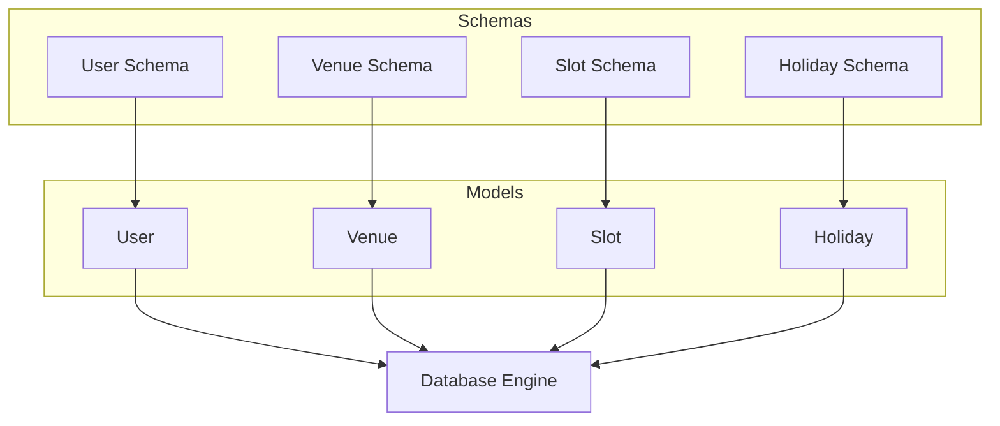
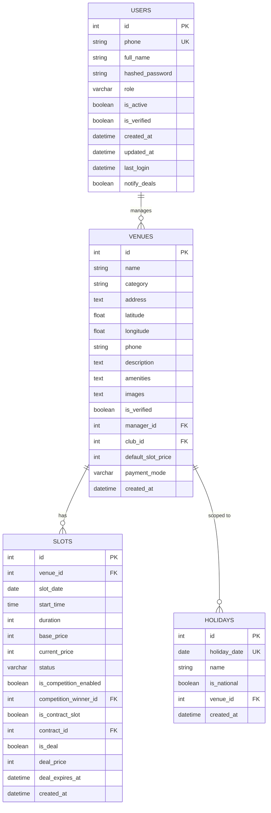
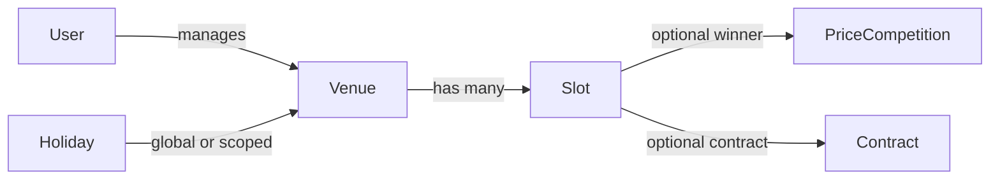

# Core Entities

<cite>
**Referenced Files in This Document**
- [user.py](file://app/models/user.py)
- [venue.py](file://app/models/venue.py)
- [slot.py](file://app/models/slot.py)
- [holiday.py](file://app/models/holiday.py)
- [schemas/user.py](file://app/schemas/user.py)
- [schemas/venue.py](file://app/schemas/venue.py)
- [schemas/slot.py](file://app/schemas/slot.py)
- [schemas/holiday.py](file://app/schemas/holiday.py)
- [database.py](file://app/database.py)
</cite>

## Table of Contents
1. Introduction
2. Project Structure
3. Core Components
4. Architecture Overview
5. Detailed Component Analysis
6. Dependency Analysis
7. Performance Considerations
8. Troubleshooting Guide
9. Conclusion

## Introduction
This document explains the core database entities of the Futsal Booking System: User, Venue, Slot, and Holiday. It details field definitions, data types, constraints, relationships, and business rules enforced at the database level. It also documents the UserRole enum and its impact on access control, the venue-slot relationship, slot availability management, and holiday scheduling. Entity Relationship Diagrams illustrate how these entities interact.

## Project Structure
The core entities are defined as SQLModel classes under app/models and validated via Pydantic schemas under app/schemas. The application uses a SQLAlchemy engine configured in app/database.py to create tables from models during development or migrations in production.

**Diagram sources**
- [user.py:13-34](file://app/models/user.py#L13-L34)
- [venue.py:16-53](file://app/models/venue.py#L16-L53)
- [slot.py:13-42](file://app/models/slot.py#L13-L42)
- [holiday.py:16-24](file://app/models/holiday.py#L16-L24)
- [database.py:9-32](file://app/database.py#L9-L32)

**Section sources**
- [database.py:9-32](file://app/database.py#L9-L32)

## Core Components
- User: Represents system users with roles, authentication fields, and timestamps.
- Venue: Represents futsal venues with location, manager, pricing defaults, and payment mode.
- Slot: Represents time-bound booking units for a venue with status, pricing, and optional competition/contract/deal flags.
- Holiday: Represents calendar holidays that can be global or per-venue, influencing pricing and availability.

Key enums:
- UserRole: user, venue_manager, club_admin, super_admin
- VenuePaymentMode: gateway, bank_receipt, pay_in_place
- SlotStatus: available, booked, blocked, in_competition, reserved

**Section sources**
- [user.py:7-34](file://app/models/user.py#L7-L34)
- [venue.py:10-53](file://app/models/venue.py#L10-L53)
- [slot.py:6-42](file://app/models/slot.py#L6-L42)
- [holiday.py:16-24](file://app/models/holiday.py#L16-L24)
- [schemas/user.py:7-54](file://app/schemas/user.py#L7-L54)
- [schemas/venue.py:10-105](file://app/schemas/venue.py#L10-L105)
- [schemas/slot.py:6-43](file://app/schemas/slot.py#L6-L43)
- [schemas/holiday.py:7-33](file://app/schemas/holiday.py#L7-L33)

## Architecture Overview
At the database layer, the core entities form a star-like structure around Venue and Slot:
- A Venue is managed by a User (manager).
- A Venue has many Slots.
- A Slot belongs to one Venue and may participate in competitions or contracts and can be marked as deals.
- Holidays can be global or scoped to a specific Venue.

**Diagram sources**
- [user.py:13-34](file://app/models/user.py#L13-L34)
- [venue.py:16-53](file://app/models/venue.py#L16-L53)
- [slot.py:13-42](file://app/models/slot.py#L13-L42)
- [holiday.py:16-24](file://app/models/holiday.py#L16-L24)

## Detailed Component Analysis

### User
- Purpose: Central identity and access control entity.
- Key fields:
  - id: primary key
  - phone: unique, indexed, max length 11
  - full_name: max length 100
  - hashed_password: required
  - role: UserRole enum; default USER
  - is_active, is_verified: booleans
  - created_at, updated_at: UTC timestamps
  - last_login: nullable timestamp
  - notify_deals: boolean flag
- Relationships:
  - Managed venues (one-to-many)
  - Bookings, reviews, contracts, and price competitions referenced elsewhere
- Access control:
  - UserRole determines permissions across the system (e.g., venue management vs. regular user actions). Validation schema enforces allowed values.

Typical data structure example (conceptual):
- id: integer
- phone: string like "09XXXXXXXXX"
- full_name: string
- role: one of ["user", "venue_manager", "club_admin", "super_admin"]
- is_active: boolean
- is_verified: boolean
- created_at: UTC datetime
- updated_at: UTC datetime
- last_login: nullable UTC datetime
- notify_deals: boolean

Business rules enforced at database level:
- Unique phone number constraint
- Role restricted to enum values
- Timestamps default to UTC

**Section sources**
- [user.py:7-34](file://app/models/user.py#L7-L34)
- [schemas/user.py:7-54](file://app/schemas/user.py#L7-L54)

### Venue
- Purpose: Physical or virtual futsal/gym locations with operational settings.
- Key fields:
  - id: primary key
  - name: indexed, max length 100
  - category: "futsal" or "gym", indexed
  - address, latitude, longitude: location info
  - phone: optional, max length 11
  - description, amenities, images: JSON-like strings stored as text
  - is_verified: boolean
  - manager_id: foreign key to users.id
  - club_id: optional foreign key to clubs.id
  - default_slot_price: optional integer baseline for slot pricing
  - payment_mode: enum (gateway | bank_receipt | pay_in_place), default bank_receipt
  - created_at: UTC timestamp
- Relationships:
  - Manager (User)
  - Slots (one-to-many)
  - Contracts, reviews, plans, and club membership

Typical data structure example (conceptual):
- id: integer
- name: string
- category: "futsal" or "gym"
- address: string
- latitude: float within [-90, 90]
- longitude: float within [-180, 180]
- phone: optional string matching pattern
- amenities: list of strings (stored as JSON)
- images: list of strings (stored as JSON)
- is_verified: boolean
- manager_id: integer referencing users.id
- club_id: optional integer referencing clubs.id
- default_slot_price: optional integer >= 1
- payment_mode: one of ["gateway", "bank_receipt", "pay_in_place"]
- created_at: UTC datetime

Business rules enforced at database level:
- Foreign key to users.id for manager
- Enum validation for payment_mode
- Category constrained to known values

**Section sources**
- [venue.py:10-53](file://app/models/venue.py#L10-L53)
- [schemas/venue.py:10-105](file://app/schemas/venue.py#L10-L105)

### Slot
- Purpose: Time-based booking unit for a venue with dynamic pricing and state.
- Key fields:
  - id: primary key
  - venue_id: foreign key to venues.id
  - slot_date: date
  - start_time: time
  - duration: integer minutes (default 90)
  - base_price: integer currency unit
  - current_price: integer currency unit
  - status: SlotStatus enum (available | booked | blocked | in_competition | reserved)
  - is_competition_enabled: boolean
  - competition_winner_id: optional foreign key to price_competitions.id
  - is_contract_slot: boolean
  - contract_id: optional foreign key to contracts.id
  - is_deal: boolean for open-slot deals
  - deal_price: optional integer
  - deal_expires_at: optional datetime
  - created_at: UTC timestamp
- Relationships:
  - Venue (many-to-one)
  - Bookings (one-to-many)
  - Competitions and winning references
  - Contract reference

Typical data structure example (conceptual):
- id: integer
- venue_id: integer referencing venues.id
- slot_date: date
- start_time: time
- duration: integer (minutes)
- base_price: integer
- current_price: integer
- status: one of ["available", "booked", "blocked", "in_competition", "reserved"]
- is_competition_enabled: boolean
- competition_winner_id: nullable integer
- is_contract_slot: boolean
- contract_id: nullable integer
- is_deal: boolean
- deal_price: nullable integer
- deal_expires_at: nullable datetime
- created_at: UTC datetime

Business rules enforced at database level:
- Foreign keys ensure referential integrity with venues and related entities
- Status constrained to enum values
- Optional links to competitions and contracts allow flexible lifecycle states

**Section sources**
- [slot.py:6-42](file://app/models/slot.py#L6-L42)
- [schemas/slot.py:6-43](file://app/schemas/slot.py#L6-L43)

### Holiday
- Purpose: Calendar entries marking holidays that influence pricing and availability.
- Key fields:
  - id: primary key
  - holiday_date: unique date, indexed
  - name: string up to 120 characters
  - is_national: boolean indicating if it applies globally
  - venue_id: optional foreign key to venues.id for venue-specific holidays
  - created_at: UTC timestamp
- Scope:
  - If venue_id is null, the holiday applies to all venues.
  - If venue_id is set, it affects only that venue.

Typical data structure example (conceptual):
- id: integer
- holiday_date: unique date
- name: string
- is_national: boolean
- venue_id: nullable integer referencing venues.id
- created_at: UTC datetime

Business rules enforced at database level:
- Unique date constraint prevents duplicate holidays
- Indexing supports efficient queries by date and venue scope

**Section sources**
- [holiday.py:16-24](file://app/models/holiday.py#L16-L24)
- [schemas/holiday.py:7-33](file://app/schemas/holiday.py#L7-L33)

## Dependency Analysis
- User manages Venues (one-to-many).
- Venue hosts Slots (one-to-many).
- Slot references Venue and optionally Competitions and Contracts.
- Holiday can be global or scoped to a Venue.

**Diagram sources**
- [user.py:13-34](file://app/models/user.py#L13-L34)
- [venue.py:16-53](file://app/models/venue.py#L16-L53)
- [slot.py:13-42](file://app/models/slot.py#L13-L42)
- [holiday.py:16-24](file://app/models/holiday.py#L16-L24)

**Section sources**
- [user.py:13-34](file://app/models/user.py#L13-L34)
- [venue.py:16-53](file://app/models/venue.py#L16-L53)
- [slot.py:13-42](file://app/models/slot.py#L13-L42)
- [holiday.py:16-24](file://app/models/holiday.py#L16-L24)

## Performance Considerations
- Indexes:
  - Users.phone is indexed for fast lookups and uniqueness checks.
  - Venues.name and Venues.category are indexed to support search and filtering.
  - Holidays.holiday_date is unique and indexed for quick date-based queries.
  - Holidays.venue_id is indexed to efficiently filter venue-specific holidays.
- Storage:
  - JSON-like fields (amenities, images) are stored as text; consider indexing strategies at query time if needed.
- Defaults:
  - Timestamps default to UTC to avoid timezone inconsistencies.
- Pooling:
  - Database engine uses connection pooling with configurable pool_size and max_overflow for concurrency.

[No sources needed since this section provides general guidance derived from model definitions and database configuration]

## Troubleshooting Guide
Common issues and resolutions:
- Duplicate phone numbers:
  - Error arises due to unique constraint on users.phone. Ensure phone uniqueness before insertion.
- Invalid payment mode:
  - Venue.payment_mode must be one of the allowed enum values; schema validation will reject invalid inputs.
- Invalid coordinates:
  - Latitude and longitude must be within valid ranges; schema validation enforces bounds.
- Duplicate holidays:
  - Holidays.holiday_date is unique; attempting to insert an existing date will fail.
- Referential integrity errors:
  - Slot.venue_id must reference an existing venue; similarly, manager_id must reference an existing user.

Validation and enforcement points:
- Database-level constraints: unique indexes, foreign keys, enum columns.
- Application-level validation: Pydantic schemas enforce patterns, ranges, and allowed values prior to persistence.

**Section sources**
- [user.py:13-34](file://app/models/user.py#L13-L34)
- [venue.py:16-53](file://app/models/venue.py#L16-L53)
- [slot.py:13-42](file://app/models/slot.py#L13-L42)
- [holiday.py:16-24](file://app/models/holiday.py#L16-L24)
- [schemas/user.py:7-54](file://app/schemas/user.py#L7-L54)
- [schemas/venue.py:10-105](file://app/schemas/venue.py#L10-L105)
- [schemas/slot.py:6-43](file://app/schemas/slot.py#L6-L43)
- [schemas/holiday.py:7-33](file://app/schemas/holiday.py#L7-L33)

## Conclusion
The core entities—User, Venue, Slot, and Holiday—form the backbone of the Futsal Booking System’s data model. They define clear boundaries for access control, venue operations, time-slot management, and holiday scheduling. Database constraints and schema validations enforce critical business rules such as uniqueness, referential integrity, and enumerated values. Together, they enable robust booking workflows, flexible pricing, and scalable multi-venue management.

[No sources needed since this section summarizes without analyzing specific files]