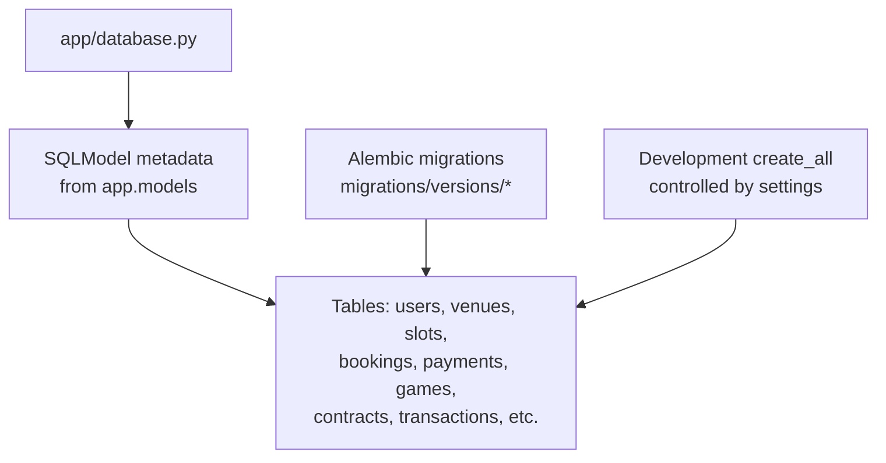
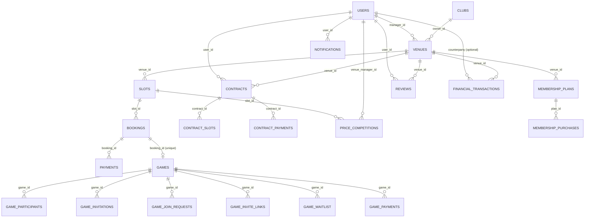
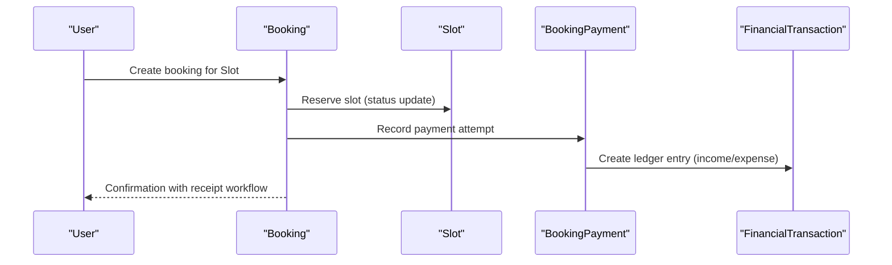
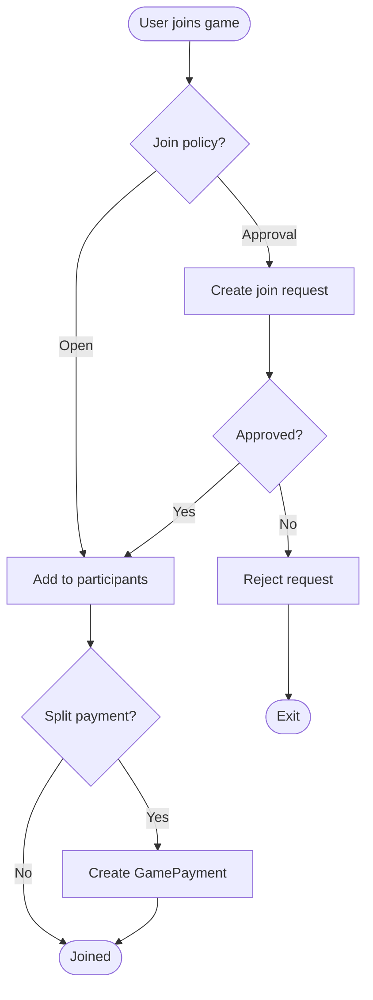
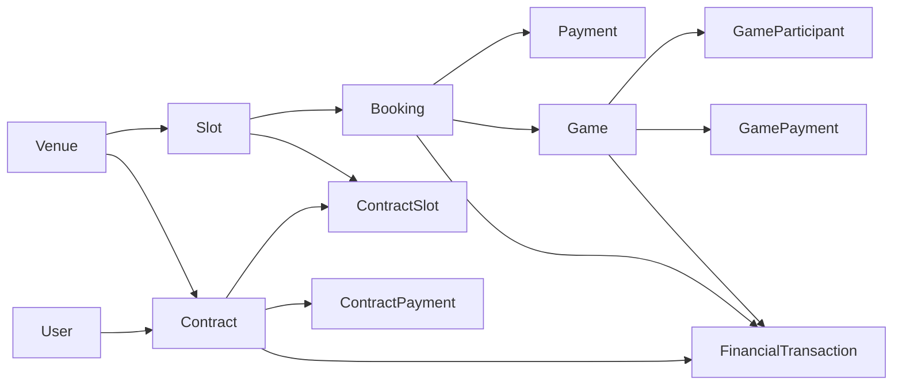

# Database Schema

<cite>
**Referenced Files in This Document**
- [app/models/__init__.py](file://app/models/__init__.py)
- [app/database.py](file://app/database.py)
- [app/models/user.py](file://app/models/user.py)
- [app/models/venue.py](file://app/models/venue.py)
- [app/models/slot.py](file://app/models/slot.py)
- [app/models/booking.py](file://app/models/booking.py)
- [app/models/payment.py](file://app/models/payment.py)
- [app/models/game.py](file://app/models/game.py)
- [app/models/transaction.py](file://app/models/transaction.py)
- [app/models/contract.py](file://app/models/contract.py)
- [app/models/membership.py](file://app/models/membership.py)
- [app/models/review.py](file://app/models/review.py)
- [app/models/notification.py](file://app/models/notification.py)
- [migrations/versions/a1g001games01_add_game_tables.py](file://migrations/versions/a1g001games01_add_game_tables.py)
- [migrations/versions/d4j004baseline.py](file://migrations/versions/d4j004baseline.py)
</cite>

## Table of Contents
1. Introduction
2. Project Structure
3. Core Components
4. Architecture Overview
5. Detailed Component Analysis
6. Dependency Analysis
7. Performance Considerations
8. Troubleshooting Guide
9. Conclusion

## Introduction
This document describes the database schema for the Futsal Booking System. It covers entity relationships, field definitions, data types, primary and foreign keys, indexes, constraints, validation rules enforced at the database level, data lifecycle management, migration history, performance considerations, indexing strategies, and common data access patterns. The system models users, venues, time slots, bookings, payments, group games, contracts (recurring sessions), financial ledger entries, memberships, reviews, notifications, and team-related entities.

## Project Structure
The schema is defined using SQLModel models under app/models and versioned with Alembic migrations under migrations/versions. The application initializes the engine and optionally creates tables in development via create_all; production relies on Alembic upgrades.

**Diagram sources**
- [app/database.py:9-32](file://app/database.py#L9-L32)
- [migrations/versions/d4j004baseline.py:34-47](file://migrations/versions/d4j004baseline.py#L34-L47)
- [migrations/versions/a1g001games01_add_game_tables.py:29-207](file://migrations/versions/a1g001games01_add_game_tables.py#L29-L207)

**Section sources**
- [app/database.py:9-32](file://app/database.py#L9-L32)
- [migrations/versions/d4j004baseline.py:1-48](file://migrations/versions/d4j004baseline.py#L1-L48)
- [migrations/versions/a1g001games01_add_game_tables.py:1-208](file://migrations/versions/a1g001games01_add_game_tables.py#L1-L208)

## Core Components
High-level entities and their responsibilities:
- User: Authentication and role-based access; owns venues, bookings, competitions, contracts, reviews.
- Venue: Physical location or club venue; has default pricing and payment mode; linked to clubs and managers.
- Slot: Time-bound availability per venue; supports status, pricing, deals, and contract linkage.
- Booking: Reservation against a slot; includes payment details, receipt workflow, and pricing breakdown.
- Payment: Per-booking payment records with gateway references and statuses.
- Game: Group event built on top of a confirmed booking; manages participants, invitations, join requests, waitlist, and split payments.
- Contract: Recurring session agreements with generated slots and installment payments; audit trail.
- Transaction: Append-only financial ledger with types, directions, methods, and source tracking.
- MembershipPlan/Purchase: Gym membership plans and purchases tied to venues and users.
- Review: Ratings and comments for venues.
- Notification: In-app notifications persisted for real-time delivery.

**Section sources**
- [app/models/user.py:7-33](file://app/models/user.py#L7-L33)
- [app/models/venue.py:10-53](file://app/models/venue.py#L10-L53)
- [app/models/slot.py:6-42](file://app/models/slot.py#L6-L42)
- [app/models/booking.py:7-51](file://app/models/booking.py#L7-L51)
- [app/models/payment.py:7-29](file://app/models/payment.py#L7-L29)
- [app/models/game.py:20-258](file://app/models/game.py#L20-L258)
- [app/models/contract.py:7-193](file://app/models/contract.py#L7-L193)
- [app/models/transaction.py:20-119](file://app/models/transaction.py#L20-L119)
- [app/models/membership.py:11-61](file://app/models/membership.py#L11-L61)
- [app/models/review.py:5-17](file://app/models/review.py#L5-L17)
- [app/models/notification.py:6-18](file://app/models/notification.py#L6-L18)

## Architecture Overview
The schema centers around core operational domains:
- Availability and reservation: Venue → Slot → Booking → Payment
- Group play: Booking → Game → Participants/Invitations/Waitlist → GamePayment
- Recurring commitments: Venue + User → Contract → ContractSlot + ContractPayment
- Financials: All monetary events recorded in FinancialTransaction (append-only ledger)
- Support entities: User, Club, MembershipPlan/Purchase, Review, Notification

**Diagram sources**
- [app/models/user.py:13-33](file://app/models/user.py#L13-L33)
- [app/models/venue.py:16-53](file://app/models/venue.py#L16-L53)
- [app/models/slot.py:13-42](file://app/models/slot.py#L13-L42)
- [app/models/booking.py:21-51](file://app/models/booking.py#L21-L51)
- [app/models/payment.py:15-29](file://app/models/payment.py#L15-L29)
- [app/models/game.py:97-258](file://app/models/game.py#L97-L258)
- [app/models/contract.py:64-193](file://app/models/contract.py#L64-L193)
- [app/models/competition.py:12-34](file://app/models/competition.py#L12-L34)
- [app/models/membership.py:23-61](file://app/models/membership.py#L23-L61)
- [app/models/review.py:5-17](file://app/models/review.py#L5-L17)
- [app/models/notification.py:6-18](file://app/models/notification.py#L6-L18)
- [app/models/transaction.py:73-119](file://app/models/transaction.py#L73-L119)

## Detailed Component Analysis

### User
- Purpose: Identity, roles, and ownership links across the system.
- Key fields: id (PK), phone (unique, indexed), full_name, hashed_password, role (enum), is_active, is_verified, timestamps, last_login, notify_deals.
- Relationships: Managed venues, bookings, competitions, contracts, reviews.
- Validation: Phone uniqueness; role enum values restrict roles.

**Section sources**
- [app/models/user.py:7-33](file://app/models/user.py#L7-L33)

### Venue and Club
- Venue: id (PK), name (indexed), category (indexed), address, coordinates, phone, description, amenities/images (JSON arrays), is_verified, manager_id (FK to users), club_id (FK to clubs), default_slot_price, payment_mode (enum), created_at.
- Club: id (PK), name (unique), owner_id (FK to users), created_at; one-to-many venues.
- Constraints: Unique club names; venue manager FK integrity.

**Section sources**
- [app/models/venue.py:10-53](file://app/models/venue.py#L10-L53)

### Slot
- Purpose: Time-based availability per venue with pricing and status.
- Fields: id (PK), venue_id (FK), slot_date, start_time, duration (default 90), base_price, current_price, status (enum), is_competition_enabled, competition_winner_id (FK to price_competitions), is_contract_slot, contract_id (FK to contracts), deal flags and expiry, created_at.
- Relationships: Back to venue, bookings, competitions, contract reference.
- Validation: Status enum; numeric prices; optional nullable FK to competition winner.

**Section sources**
- [app/models/slot.py:6-42](file://app/models/slot.py#L6-L42)

### Booking
- Purpose: Reservation on a slot with payment and receipt workflow.
- Fields: id (PK), slot_id (FK), user_id (FK), booked_at, status (enum), payment_amount, payment_transaction_id, discount_amount, coupon_code, loyalty_points_used, pricing_breakdown (JSON string).
- Receipt/payment mode snapshot: payment_mode (enum from venue), needs_receipt, receipt_status (enum), receipt fields and review timestamps/note/by.
- Relationships: To slot and user.

**Section sources**
- [app/models/booking.py:7-51](file://app/models/booking.py#L7-L51)

### BookingPayment
- Purpose: Per-booking payment records independent of ledger.
- Fields: id (PK), booking_id (FK), user_id (FK), amount, status (enum), gateway, authority, transaction_id, card_pan, timestamps.
- Indexes: On booking_id, status, authority, transaction_id for fast lookups.

**Section sources**
- [app/models/payment.py:7-29](file://app/models/payment.py#L7-L29)

### Game and Related Entities
- Game: Built on a confirmed booking (unique booking_id); organizer; visibility, join policy, max_players, skill_level, payment_mode, status; result set fields; timestamps.
- GameParticipant: One-to-one per game-user; role/status/joined/left timestamps.
- GameJoinRequest: Join flow with approval/rejection and reviewer info.
- GameInvitation: Direct invites with expiration and status.
- GameInviteLink: Secure token-based link with usage limits and activity flags.
- GameWaitlist: Ordered waitlist with position and status.
- GamePayment: Per-participant share payment with status and references.

Indexes and constraints include unique constraints for participant/game-user pairs, invite uniqueness, waitlist uniqueness per game-user, and check constraints for positive values.

**Section sources**
- [app/models/game.py:20-258](file://app/models/game.py#L20-L258)
- [migrations/versions/a1g001games01_add_game_tables.py:29-207](file://migrations/versions/a1g001games01_add_game_tables.py#L29-L207)

### Contract and Contract Lifecycle
- Contract: Links user and venue; defines recurrence, day(s), time, duration, pricing, status, payment status; approvals/rejections/cancellations with actor and timestamps; optional installments and notes.
- ContractSlot: Generated sessions per contract; attendance/cancellation flags; scheduling state machine (scheduled/completed/excluded/rescheduled) with rescheduling fields and handler info.
- ContractPayment: Installment schedule with due dates, labels, paid/overdue/void states, and transaction references.
- ContractAuditEvent: Append-only audit log with action type and JSON payload.

Constraints enforce business rules such as non-negative amounts where applicable and clear state transitions through status enums.

**Section sources**
- [app/models/contract.py:7-193](file://app/models/contract.py#L7-L193)

### Financial Ledger (FinancialTransaction)
- Purpose: Append-only ledger for all financial movements.
- Fields: id (PK), idempotency_key (unique, indexed), type (enum), direction (enum), amount (positive integer), method (enum), status (enum), counterparty (nullable FK to users), counterparty_type (enum), counterparty_ref (nullable), venue_id (FK), expense_category_id (FK), source_type (enum), source_id, description, created_by, occurred_at (indexed), created_at, cleared_at, void_reason.
- Constraints: Check constraint ensures amount > 0; indexes support reporting and filtering by venue, counterparty, type, direction, status, source, and occurrence date.

**Section sources**
- [app/models/transaction.py:20-119](file://app/models/transaction.py#L20-L119)

### Membership Plans and Purchases
- MembershipPlan: Venue-scoped plan catalog with type (session/pack/monthly), price, sessions_count, duration_days, active flag.
- MembershipPurchase: Purchase record with amount, status, transaction/card info, remaining sessions, validity window, and timestamps.

**Section sources**
- [app/models/membership.py:11-61](file://app/models/membership.py#L11-L61)

### Reviews and Notifications
- Review: Rating (1–5), comment, venue and user links; rating range enforced by model constraints.
- Notification: User-targeted messages with type, read flag, and payload JSON.

**Section sources**
- [app/models/review.py:5-17](file://app/models/review.py#L5-L17)
- [app/models/notification.py:6-18](file://app/models/notification.py#L6-L18)

### Price Competition
- PriceCompetition: Venue-manager offers discounted price for specific slots with expiration; winning slot reference stored on Slot.

**Section sources**
- [app/models/competition.py:6-34](file://app/models/competition.py#L6-L34)

## Architecture Overview
End-to-end flows that rely on the schema:

### Booking Flow

**Diagram sources**
- [app/models/booking.py:21-51](file://app/models/booking.py#L21-L51)
- [app/models/slot.py:13-42](file://app/models/slot.py#L13-L42)
- [app/models/payment.py:15-29](file://app/models/payment.py#L15-L29)
- [app/models/transaction.py:84-119](file://app/models/transaction.py#L84-L119)

### Game Join Flow

**Diagram sources**
- [app/models/game.py:97-258](file://app/models/game.py#L97-L258)

## Dependency Analysis
Key dependency chains:
- Slot depends on Venue; Bookings depend on Slot and User; Payments depend on Bookings.
- Games depend on Bookings (one-to-one) and Users (organizer/participants).
- Contracts depend on Venue and User; generate ContractSlots referencing Slots; ContractPayments reference Contracts.
- FinancialTransaction aggregates all monetary events with source_type/source_id pointers back to domain entities.
- Reviews and Notifications are leaf entities attached to Users and Venues.

**Diagram sources**
- [app/models/venue.py:16-53](file://app/models/venue.py#L16-L53)
- [app/models/slot.py:13-42](file://app/models/slot.py#L13-L42)
- [app/models/booking.py:21-51](file://app/models/booking.py#L21-L51)
- [app/models/payment.py:15-29](file://app/models/payment.py#L15-L29)
- [app/models/game.py:97-258](file://app/models/game.py#L97-L258)
- [app/models/contract.py:64-193](file://app/models/contract.py#L64-L193)
- [app/models/transaction.py:84-119](file://app/models/transaction.py#L84-L119)

**Section sources**
- [app/models/__init__.py:1-71](file://app/models/__init__.py#L1-L71)

## Performance Considerations
- Indexing strategy:
  - High-cardinality and query-heavy columns are indexed: users.phone, venues.name/category, slots.status, bookings.payment fields, games.visibility/status/sport, game_payments.status/payment_reference, financial_transactions.type/direction/status/occurred_at/venue_id/counterparty/source_type.
  - Composite indexes exist for high-volume queries like team messages (team_id, created_at).
- Constraints:
  - Check constraints enforce business invariants (e.g., positive amounts, max_players > 0, waitlist position > 0).
  - Unique constraints prevent duplicates (e.g., game_participant per game-user, invite uniqueness, booking_id unique per game).
- Data volume:
  - Audit/event tables (contract_audit_events, team_audit_events, notifications) are append-only; consider partitioning by date ranges if growth is large.
- Ledger design:
  - FinancialTransaction is append-only; avoid updates; use adjustments/refunds for corrections.
- Enum storage:
  - Enums stored as VARCHAR with known values; ensure application enforces valid values to keep DB consistent.

[No sources needed since this section provides general guidance]

## Troubleshooting Guide
Common issues and resolutions:
- Duplicate key violations:
  - Ensure unique constraints are respected (e.g., users.phone, game_invitations(game_id, invited_user_id), game_waitlist(game_id, user_id)).
- Constraint failures:
  - Amount must be positive in FinancialTransaction and TeamDues; validate before insert.
  - max_players must be positive in Games; position in waitlist must be positive.
- Foreign key errors:
  - Verify referenced entities exist (e.g., slot_id, venue_id, user_id) before creating dependent rows.
- Migration drift:
  - Use Alembic to manage schema changes; do not rely on create_all in production. Baseline migration aligns existing tables with current models.

**Section sources**
- [migrations/versions/d4j004baseline.py:34-47](file://migrations/versions/d4j004baseline.py#L34-L47)
- [app/models/transaction.py:84-119](file://app/models/transaction.py#L84-L119)
- [app/models/game.py:97-120](file://app/models/game.py#L97-L120)
- [app/models/game.py:221-236](file://app/models/game.py#L221-L236)

## Conclusion
The schema provides a robust foundation for venue booking, group games, recurring contracts, and financial accounting. It leverages SQLModel for model consistency and Alembic for controlled evolution. Strong use of enums, constraints, and indexes supports both correctness and performance. The append-only ledger ensures reliable financial reporting, while rich relationship modeling enables complex workflows like team management and open games.

[No sources needed since this section summarizes without analyzing specific files]