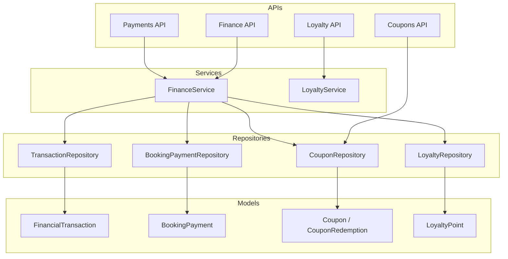
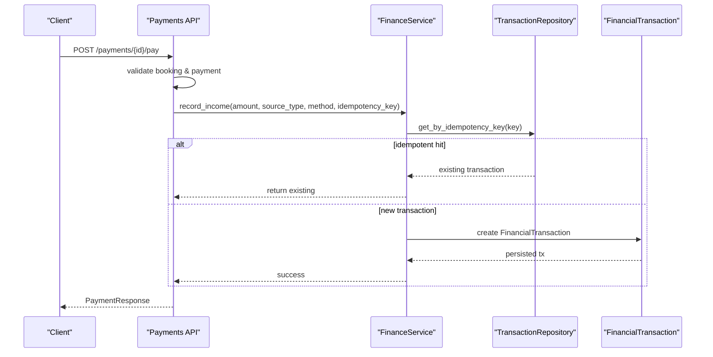
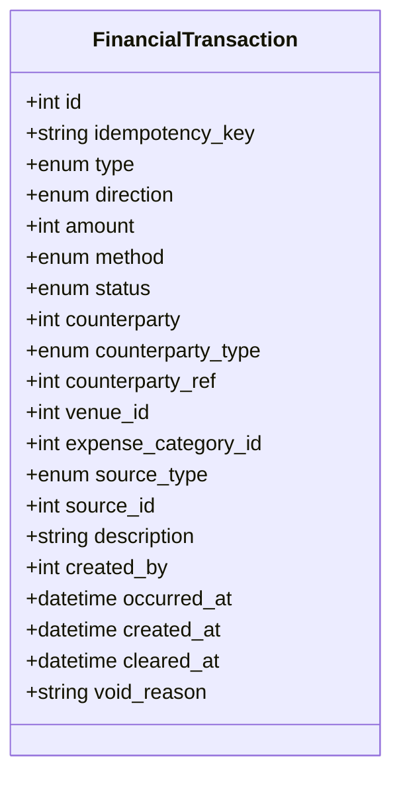
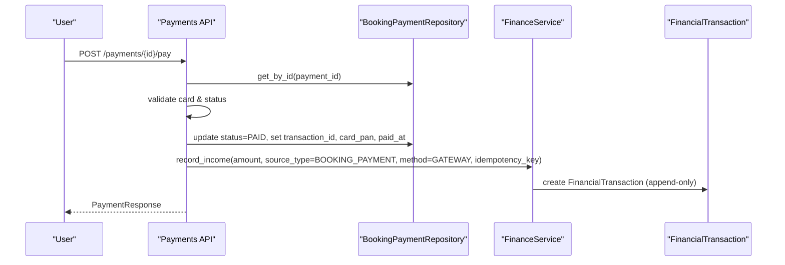
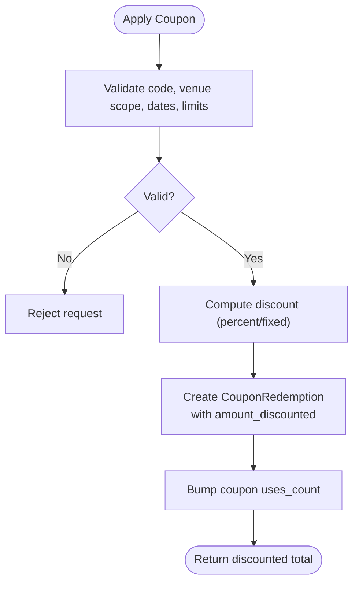
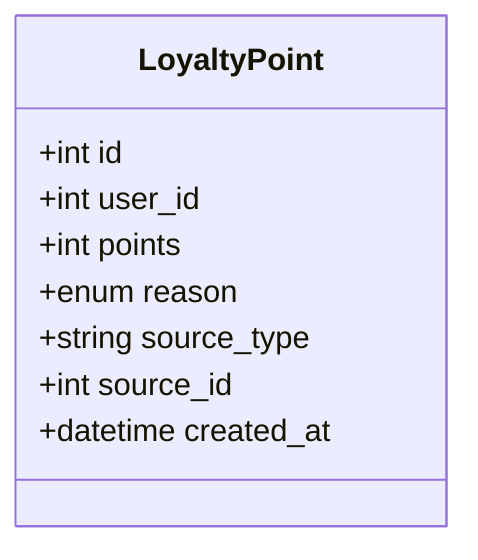
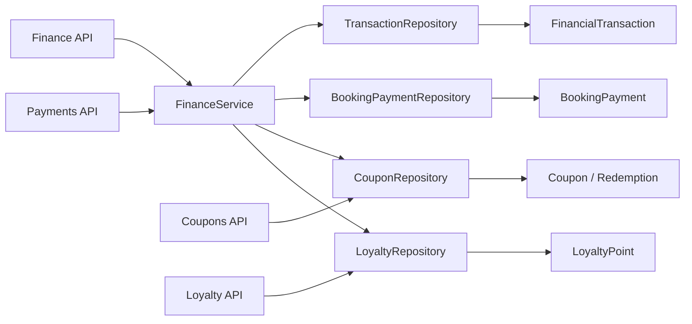
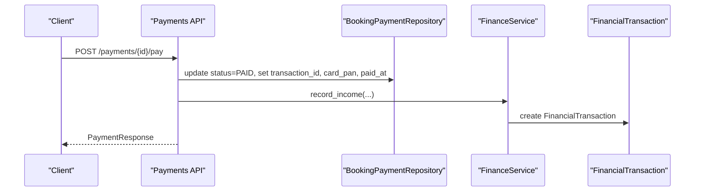
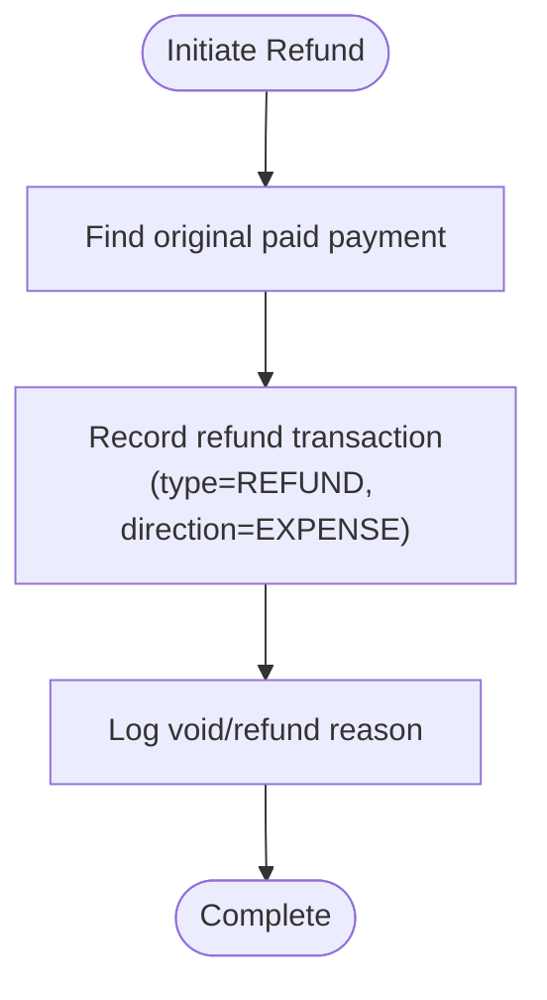
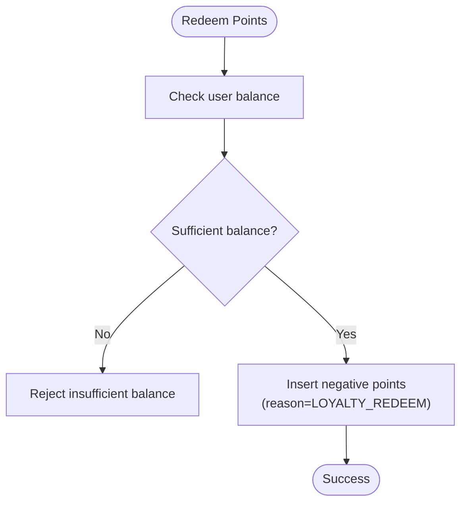

# Financial Operations

<cite>
**Referenced Files in This Document**
- [transaction.py](file://app/models/transaction.py)
- [payment.py](file://app/models/payment.py)
- [coupon.py](file://app/models/coupon.py)
- [loyalty.py](file://app/models/loyalty.py)
- [finance.py](file://app/schemas/finance.py)
- [finance_api.py](file://app/api/v1/finance.py)
- [payments_api.py](file://app/api/v1/payments.py)
- [coupons_api.py](file://app/api/v1/coupons.py)
- [loyalty_api.py](file://app/api/v1/loyalty.py)
- [finance_service.py](file://app/services/finance_service.py)
- [transaction_repository.py](file://app/repositories/transaction_repository.py)
- [payment_repository.py](file://app/repositories/payment_repository.py)
- [coupon_repository.py](file://app/repositories/coupon_repository.py)
- [loyalty_repository.py](file://app/repositories/loyalty_repository.py)
</cite>

## Table of Contents
1. Introduction
2. Project Structure
3. Core Components
4. Architecture Overview
5. Detailed Component Analysis
6. Dependency Analysis
7. Performance Considerations
8. Troubleshooting Guide
9. Conclusion
10. Appendices

## Introduction
This document describes the financial operations database schema and workflows for the booking system. It focuses on:
- Transaction model as the core append-only accounting ledger
- Payment model for payment processing per booking
- Coupon model for discount management and redemption tracking
- Loyalty model for points issuance, spending, and refunds
It also explains transaction ledger structure, payment modes, coupon application logic, loyalty points calculation, and provides examples of financial workflows such as booking payments, refunds, and loyalty point redemption. Data integrity constraints and audit trail requirements are documented throughout.

## Project Structure
The financial subsystem is organized into models (schema), repositories (data access), services (business logic), and APIs (entry points). The key files are:
- Models define tables and enums for transactions, payments, coupons, and loyalty
- Repositories implement queries, aggregations, and idempotency checks
- Services orchestrate business rules, ledgers, statements, and reporting
- APIs expose endpoints with authorization, validation, and auditing

**Diagram sources**
- [finance_api.py:1-396](file://app/api/v1/finance.py#L1-L396)
- [payments_api.py:1-175](file://app/api/v1/payments.py#L1-L175)
- [coupons_api.py:1-128](file://app/api/v1/coupons.py#L1-L128)
- [loyalty_api.py:1-58](file://app/api/v1/loyalty.py#L1-L58)
- [finance_service.py:1-737](file://app/services/finance_service.py#L1-L737)
- [transaction_repository.py:1-395](file://app/repositories/transaction_repository.py#L1-L395)
- [payment_repository.py:1-53](file://app/repositories/payment_repository.py#L1-L53)
- [coupon_repository.py:1-67](file://app/repositories/coupon_repository.py#L1-L67)
- [loyalty_repository.py:1-46](file://app/repositories/loyalty_repository.py#L1-L46)

**Section sources**
- [finance_api.py:1-396](file://app/api/v1/finance.py#L1-L396)
- [payments_api.py:1-175](file://app/api/v1/payments.py#L1-L175)
- [finance_service.py:1-737](file://app/services/finance_service.py#L1-L737)
- [transaction_repository.py:1-395](file://app/repositories/transaction_repository.py#L1-L395)

## Core Components
- FinancialTransaction: Append-only ledger row with type, direction, amount, method, status, counterparty, venue, expense category, source, timestamps, and void reason. Enforces positive amounts via constraint.
- BookingPayment: Tracks per-booking payment lifecycle (pending/paid/failed/refunded), gateway info, authority, transaction_id, card PAN last digits, and paid timestamp.
- Coupon and CouponRedemption: Discount definitions with type (percent/fixed), value, limits, validity, and usage counters; redemptions track discounted amount and link to user/booking.
- LoyaltyPoint: Append-only points ledger with signed values, reason, and idempotent source linkage to prevent duplicate awards/spends.

Key design principles:
- Ledger immutability: corrections use new rows or status transitions (voided), never deletion
- Idempotency: idempotency keys on transactions; unique constraints on loyalty sources
- Integer currency: all monetary amounts in smallest currency unit (Rial)
- Directional semantics: income vs expense drives balance effects

**Section sources**
- [transaction.py:20-119](file://app/models/transaction.py#L20-L119)
- [payment.py:7-29](file://app/models/payment.py#L7-L29)
- [coupon.py:19-53](file://app/models/coupon.py#L19-L53)
- [loyalty.py:18-43](file://app/models/loyalty.py#L18-L43)

## Architecture Overview
The financial architecture separates concerns across layers:
- API layer validates requests, enforces permissions, and triggers services
- Service layer implements business rules, idempotency, and ledger operations
- Repository layer performs efficient SQL aggregations and data access
- Model layer defines schema and constraints

**Diagram sources**
- [payments_api.py:81-162](file://app/api/v1/payments.py#L81-L162)
- [finance_service.py:118-161](file://app/services/finance_service.py#L118-L161)
- [transaction_repository.py:65-67](file://app/repositories/transaction_repository.py#L65-L67)

**Section sources**
- [payments_api.py:1-175](file://app/api/v1/payments.py#L1-L175)
- [finance_service.py:1-737](file://app/services/finance_service.py#L1-L737)
- [transaction_repository.py:1-395](file://app/repositories/transaction_repository.py#L1-L395)

## Detailed Component Analysis

### Transaction Ledger (FinancialTransaction)
- Purpose: Central append-only ledger for all financial events
- Key fields:
  - type: payment, receivable, refund, discount, expense, credit, transfer, adjustment
  - direction: income, expense
  - amount: always positive integer (Rial)
  - method: cash, card_to_card, gateway, pos, credit, other
  - status: pending, cleared, voided
  - counterparty: user reference and type
  - venue_id: optional venue scoping
  - expense_category_id: required for expenses
  - source_type/source_id: links to originating business entity
  - occurred_at: event date for time-based reports
  - created_by, cleared_at, void_reason: audit fields
- Constraints:
  - amount > 0 enforced by check constraint
  - idempotency_key unique index prevents duplicates
  - Status transitions support voiding without deletion

Ledger behavior:
- Corrections are recorded as new rows (adjustment/refund) or by marking original as voided with a reason
- Person balances are computed from deltas based on type and direction
- Reporting uses aggregated queries over non-voided rows

**Diagram sources**
- [transaction.py:84-119](file://app/models/transaction.py#L84-L119)

**Section sources**
- [transaction.py:20-119](file://app/models/transaction.py#L20-L119)
- [finance_service.py:118-307](file://app/services/finance_service.py#L118-L307)
- [transaction_repository.py:71-120](file://app/repositories/transaction_repository.py#L71-L120)

### Payment Processing (BookingPayment)
- Purpose: Track per-booking payment lifecycle and gateway artifacts
- Lifecycle:
  - Create payment invoice for confirmed bookings
  - Pay endpoint validates card, marks paid, stores transaction_id and card PAN last digits
  - Updates booking with payment_transaction_id
  - Records income in ledger via FinanceService.record_income with idempotency key
- Validation:
  - Only confirmed bookings can be paid
  - Prevents duplicate payments per booking
  - Validates card number format

**Diagram sources**
- [payments_api.py:81-162](file://app/api/v1/payments.py#L81-L162)
- [payment_repository.py:8-53](file://app/repositories/payment_repository.py#L8-L53)
- [finance_service.py:130-161](file://app/services/finance_service.py#L130-L161)

**Section sources**
- [payment.py:7-29](file://app/models/payment.py#L7-L29)
- [payments_api.py:1-175](file://app/api/v1/payments.py#L1-L175)
- [payment_repository.py:1-53](file://app/repositories/payment_repository.py#L1-L53)

### Coupon Management and Application Logic
- Purpose: Define discounts and track redemptions
- Fields:
  - code: unique, case-insensitive (stored upper)
  - venue_id: null means global; otherwise scoped to venue
  - discount_type: percent (value = percent*100) or fixed (value = Rial)
  - max_uses, uses_count, per_user_limit, min_booking_amount
  - valid_from, valid_until, is_active
- Redemption:
  - CouponRedemption records user, booking, and amount_discounted
  - Bumping uses_count ensures usage caps are respected
- Application flow:
  - Server-side pricing engine applies coupon at booking creation/confirmation
  - Redemptions are linked to bookings; on cancellation, redemptions are released

**Diagram sources**
- [coupon.py:19-53](file://app/models/coupon.py#L19-L53)
- [coupon_repository.py:10-51](file://app/repositories/coupon_repository.py#L10-L51)
- [coupons_api.py:55-88](file://app/api/v1/coupons.py#L55-L88)

**Section sources**
- [coupon.py:1-53](file://app/models/coupon.py#L1-L53)
- [coupon_repository.py:1-67](file://app/repositories/coupon_repository.py#L1-L67)
- [coupons_api.py:1-128](file://app/api/v1/coupons.py#L1-L128)

### Loyalty Points System
- Purpose: Append-only points ledger for rewards and spends
- Reasons:
  - booking_completed, cost_split_remainder, manual_adjust, coupon_redemption, loyalty_redeem, loyalty_refund, game_win, review
- Idempotency:
  - UniqueConstraint on (user_id, reason, source_type, source_id) prevents duplicate entries
- Balance:
  - Sum of points per user; negative for spends, positive for awards
- Adjustments:
  - Admin/manual adjustments allowed with validation (non-zero, sufficient balance for debits)

**Diagram sources**
- [loyalty.py:18-43](file://app/models/loyalty.py#L18-L43)

**Section sources**
- [loyalty.py:1-43](file://app/models/loyalty.py#L1-L43)
- [loyalty_repository.py:1-46](file://app/repositories/loyalty_repository.py#L1-L46)
- [loyalty_api.py:1-58](file://app/api/v1/loyalty.py#L1-L58)

## Dependency Analysis
- API dependencies:
  - Finance API depends on FinanceService for ledger operations, scopes, and reporting
  - Payments API depends on BookingPaymentRepository and FinanceService for payment-to-ledger flow
  - Coupons API depends on CouponRepository for CRUD and usage tracking
  - Loyalty API depends on LoyaltyService and LoyaltyRepository for history and adjustments
- Service dependencies:
  - FinanceService orchestrates TransactionRepository for list, aggregates, person balances, and statements
  - Uses enums and schemas from finance.py for validation and response shaping
- Repository dependencies:
  - TransactionRepository performs complex SQL aggregations and idempotency checks
  - Payment/Coupon/Loyalty repositories provide focused data access patterns

**Diagram sources**
- [finance_api.py:1-396](file://app/api/v1/finance.py#L1-L396)
- [payments_api.py:1-175](file://app/api/v1/payments.py#L1-L175)
- [finance_service.py:1-737](file://app/services/finance_service.py#L1-L737)
- [transaction_repository.py:1-395](file://app/repositories/transaction_repository.py#L1-L395)
- [payment_repository.py:1-53](file://app/repositories/payment_repository.py#L1-L53)
- [coupon_repository.py:1-67](file://app/repositories/coupon_repository.py#L1-L67)
- [loyalty_repository.py:1-46](file://app/repositories/loyalty_repository.py#L1-L46)

**Section sources**
- [finance_service.py:1-737](file://app/services/finance_service.py#L1-L737)
- [transaction_repository.py:1-395](file://app/repositories/transaction_repository.py#L1-L395)

## Performance Considerations
- Aggregated queries:
  - Revenue series, totals, and person balances use single SQL aggregations to avoid N+1
- Indexes:
  - Occurred_at, venue_id, counterparty, type, direction, status, source_type, idempotency_key improve query performance
- Idempotency:
  - Idempotency keys on transactions prevent duplicate writes under retries
- Pagination:
  - List endpoints support limit/offset for large datasets
- Date filtering:
  - Range filters applied at DB level using occurred_at

[No sources needed since this section provides general guidance]

## Troubleshooting Guide
Common issues and resolutions:
- Duplicate payment attempts:
  - Ensure idempotency_key is used when recording income; service returns existing transaction if key exists
- Invalid card numbers:
  - Card validation rejects non-16-digit inputs; payment marked failed
- Voiding already voided transactions:
  - Service prevents re-voiding; returns error
- Expense category mismatch:
  - Category must belong to the selected venue; otherwise rejected
- Insufficient loyalty balance for debit:
  - Adjustment endpoint validates current balance before applying negative points

**Section sources**
- [finance_service.py:283-307](file://app/services/finance_service.py#L283-L307)
- [payments_api.py:98-103](file://app/api/v1/payments.py#L98-L103)
- [loyalty_api.py:49-56](file://app/api/v1/loyalty.py#L49-L56)

## Conclusion
The financial operations subsystem implements a robust, auditable, and scalable ledger-centric design:
- Append-only transactions ensure data integrity and full audit trails
- Clear separation of concerns across API, service, repository, and model layers
- Strong validation, idempotency, and permission controls protect financial data
- Flexible reporting and dashboards powered by efficient SQL aggregations
- Integrated payment, coupon, and loyalty flows maintain consistency across the system

[No sources needed since this section summarizes without analyzing specific files]

## Appendices

### Example Workflows

#### Booking Payment Workflow
- Steps:
  - Create payment invoice for a confirmed booking
  - Process payment with validated card details
  - Mark payment as paid and store transaction artifacts
  - Record income in ledger with idempotency key
  - Notify user and venue manager

**Diagram sources**
- [payments_api.py:81-162](file://app/api/v1/payments.py#L81-L162)
- [finance_service.py:130-161](file://app/services/finance_service.py#L130-L161)

#### Refund Workflow
- Steps:
  - Identify original paid payment for a booking
  - Record refund transaction (expense direction) referencing original source
  - Maintain append-only ledger; no deletion of original payment

**Diagram sources**
- [finance_service.py:199-228](file://app/services/finance_service.py#L199-L228)
- [payment_repository.py:37-43](file://app/repositories/payment_repository.py#L37-L43)

#### Loyalty Point Redemption
- Steps:
  - Calculate spendable points from balance
  - Deduct points with reason LOYALTY_REDEEM and source linkage
  - Ensure idempotency via unique source constraint

**Diagram sources**
- [loyalty_repository.py:14-17](file://app/repositories/loyalty_repository.py#L14-L17)
- [loyalty_repository.py:34-46](file://app/repositories/loyalty_repository.py#L34-L46)
- [loyalty_api.py:41-58](file://app/api/v1/loyalty.py#L41-L58)

### Data Integrity Constraints and Audit Trail Requirements
- Constraints:
  - FinancialTransaction.amount > 0
  - Unique idempotency_key on transactions
  - UniqueConstraint on loyalty points (user_id, reason, source_type, source_id)
- Audit trail:
  - All financial changes are append-only; voiding preserves history
  - Security events logged for sensitive actions (e.g., transaction void, export)
  - created_by, occurred_at, cleared_at, void_reason capture provenance

**Section sources**
- [transaction.py:84-119](file://app/models/transaction.py#L84-L119)
- [loyalty.py:29-43](file://app/models/loyalty.py#L29-L43)
- [finance_api.py:224-244](file://app/api/v1/finance.py#L224-L244)