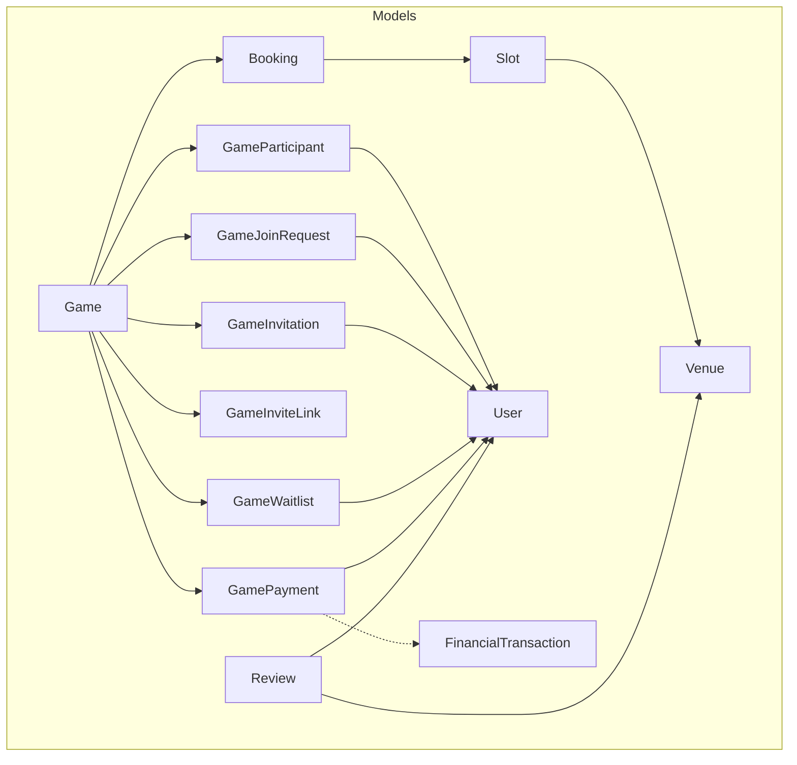
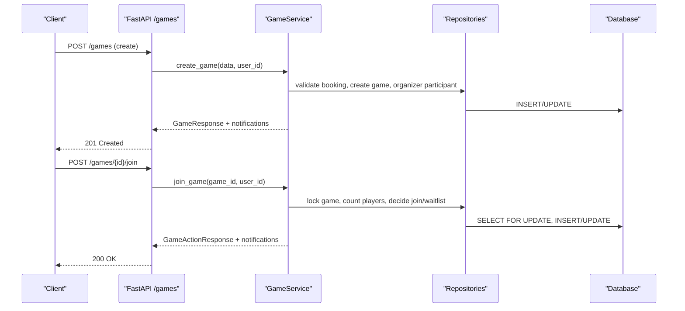
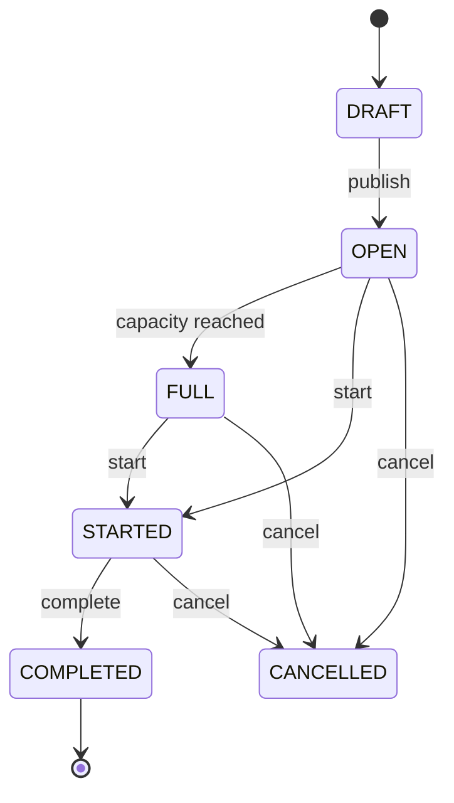
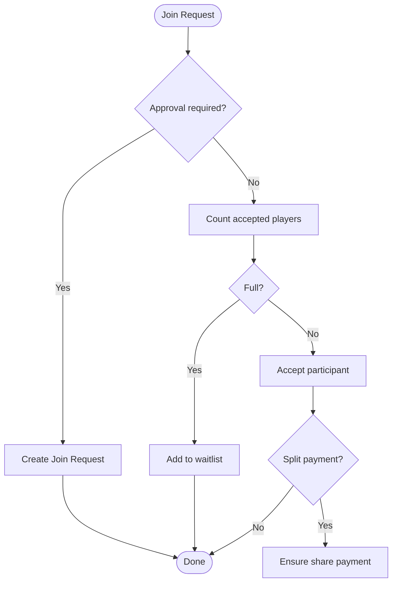
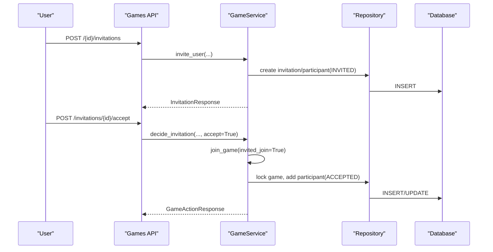
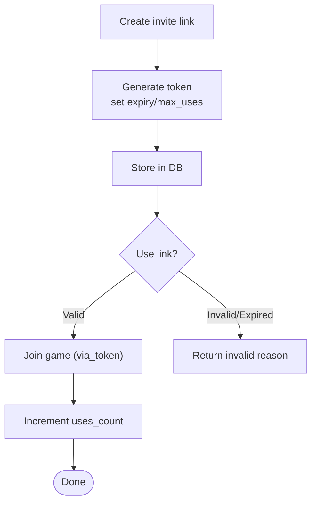
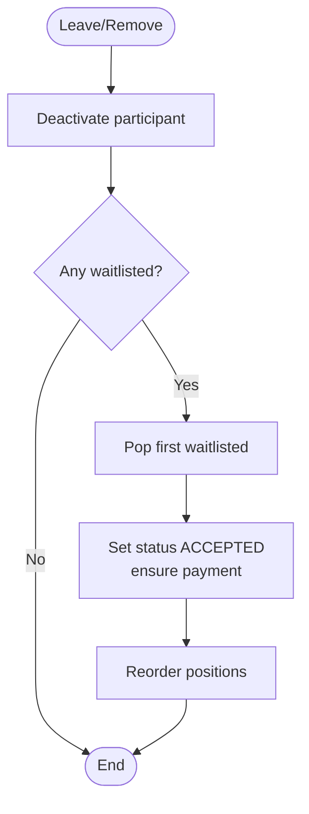
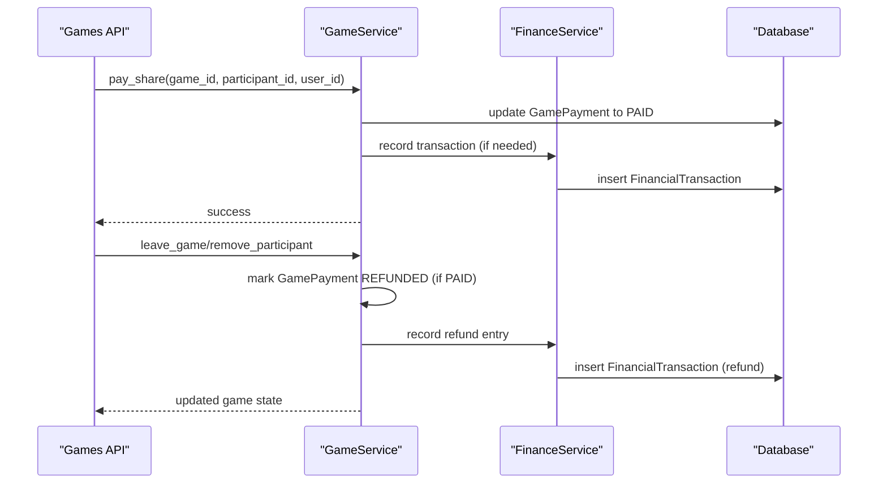
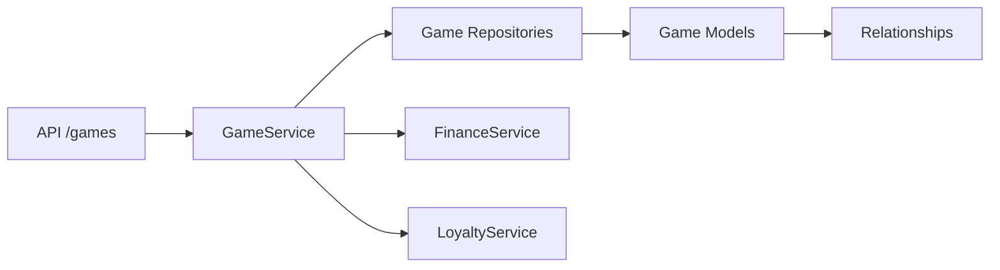

# Game System

<cite>
**Referenced Files in This Document**
- [game.py](file://app/models/game.py)
- [competition.py](file://app/models/competition.py)
- [review.py](file://app/models/review.py)
- [user.py](file://app/models/user.py)
- [venue.py](file://app/models/venue.py)
- [booking.py](file://app/models/booking.py)
- [payment.py](file://app/models/payment.py)
- [transaction.py](file://app/models/transaction.py)
- [game_service.py](file://app/services/game_service.py)
- [game_repository.py](file://app/repositories/game_repository.py)
- [games.py](file://app/api/v1/games.py)
</cite>

## Table of Contents
1. Introduction
2. Project Structure
3. Core Components
4. Architecture Overview
5. Detailed Component Analysis
6. Dependency Analysis
7. Performance Considerations
8. Troubleshooting Guide
9. Conclusion

## Introduction
This document describes the game system database schema and its operational model for organizing group games around venue bookings. It focuses on:
- The Game model and its lifecycle from creation to completion
- Participant management, invitations, join requests, and waitlist
- Scoring and result recording
- Financial integration for per-participant share payments and refunds
- Relationships with Users, Venues, Slots, Bookings, and financial transactions
- A brief note on the Competition model used for slot price competition (not tournament-style games)

The system is built on SQLModel/SQLAlchemy with a service-layer approach and repository-based data access.

## Project Structure
Key layers involved in the game system:
- Models: Game, GameParticipant, GameJoinRequest, GameInvitation, GameInviteLink, GameWaitlist, GamePayment; plus related Booking, Slot, Venue, User, Review, Transaction
- Repositories: Query builders and atomic operations for games, participants, requests, invitations, links, waitlist, and payments
- Services: Business logic for creating games, joining/leaving, managing invitations and requests, waitlist promotion, status transitions, results, and payment reminders
- API: FastAPI endpoints exposing create/list/explore/join/leave/invite/request/waitlist/pay/result/start/complete

**Diagram sources**
- [game.py:97-258](file://app/models/game.py#L97-L258)
- [booking.py:21-51](file://app/models/booking.py#L21-L51)
- [venue.py:16-53](file://app/models/venue.py#L16-L53)
- [user.py:13-34](file://app/models/user.py#L13-L34)
- [review.py:5-17](file://app/models/review.py#L5-L17)
- [transaction.py:84-119](file://app/models/transaction.py#L84-L119)

**Section sources**
- [game.py:97-258](file://app/models/game.py#L97-L258)
- [booking.py:21-51](file://app/models/booking.py#L21-L51)
- [venue.py:16-53](file://app/models/venue.py#L16-L53)
- [user.py:13-34](file://app/models/user.py#L13-L34)
- [review.py:5-17](file://app/models/review.py#L5-L17)
- [transaction.py:84-119](file://app/models/transaction.py#L84-L119)

## Core Components
- Game: Central entity bound to a confirmed Booking; tracks visibility, join policy, capacity, skill level, payment mode, and result metadata
- Participants: Role and status per user within a game
- Join Requests: For approval-based joins
- Invitations: Direct invites to users with optional expiry
- Invite Links: Secure token-based join links with usage limits and expiry
- Waitlist: Ordered queue when a game is full
- GamePayment: Per-participant share payment records tied to split-payment mode
- Booking/Slot/Venue: Underlying reservation context that determines time, place, and base cost
- User: Identity for organizers, participants, reviewers
- Review: Venue feedback by users
- FinancialTransaction: Append-only ledger entries for refunds and other financial events

**Section sources**
- [game.py:97-258](file://app/models/game.py#L97-L258)
- [booking.py:21-51](file://app/models/booking.py#L21-L51)
- [venue.py:16-53](file://app/models/venue.py#L16-L53)
- [user.py:13-34](file://app/models/user.py#L13-L34)
- [review.py:5-17](file://app/models/review.py#L5-L17)
- [transaction.py:84-119](file://app/models/transaction.py#L84-L119)

## Architecture Overview
The game system follows a layered architecture:
- API layer exposes REST endpoints for game CRUD, participation, invitations, waitlist, payments, and lifecycle transitions
- Service layer enforces business rules, concurrency safety, notifications, and financial integrations
- Repository layer encapsulates queries and atomic operations
- Models define the schema and relationships

**Diagram sources**
- [games.py:63-72](file://app/api/v1/games.py#L63-L72)
- [games.py:242-253](file://app/api/v1/games.py#L242-L253)
- [game_service.py:167-203](file://app/services/game_service.py#L167-L203)
- [game_service.py:341-429](file://app/services/game_service.py#L341-L429)
- [game_repository.py:31-44](file://app/repositories/game_repository.py#L31-L44)

## Detailed Component Analysis

### Game Model and Lifecycle
- Creation: Requires a confirmed Booking owned by the current user; creates Game and an Organizer participant; may create a pending share payment if split payment is enabled
- Visibility and Join Policy:
  - Private/Public/Public Approval control discoverability and join flow
  - Approval policy routes join attempts to join requests
- Capacity and Status:
  - OPEN/FULL toggled based on accepted participant count
  - STARTED/COMPLETED/CANCELLED transitions enforced via dedicated endpoints
- Result Recording:
  - Organizer/Admin can set winners; triggers loyalty points awarding and updates result metadata

**Diagram sources**
- [game.py:26-32](file://app/models/game.py#L26-L32)
- [game_service.py:113-124](file://app/services/game_service.py#L113-L124)
- [games.py:207-227](file://app/api/v1/games.py#L207-L227)

**Section sources**
- [game.py:97-134](file://app/models/game.py#L97-L134)
- [game_service.py:167-203](file://app/services/game_service.py#L167-L203)
- [game_service.py:113-124](file://app/services/game_service.py#L113-L124)
- [games.py:207-227](file://app/api/v1/games.py#L207-L227)

### Participant Management
- Roles: Organizer, Admin, Member
- Statuses: Invited, Pending, Accepted, Rejected, Left, Removed
- Join flows:
  - Open join: direct acceptance if space available; otherwise waitlisted
  - Approval join: creates join request for organizer review
  - Invitation: direct accept leads to immediate join without approval checks
- Leave/Remove:
  - Leaving marks participant LEFT; refunds or deletes pending share payments; promotes from waitlist
  - Removing by admin sets REMOVED; refunds paid shares; promotes from waitlist

**Diagram sources**
- [game_service.py:341-429](file://app/services/game_service.py#L341-L429)
- [game_repository.py:38-58](file://app/repositories/game_repository.py#L38-L58)

**Section sources**
- [game.py:138-154](file://app/models/game.py#L138-L154)
- [game_service.py:341-429](file://app/services/game_service.py#L341-L429)
- [game_repository.py:155-186](file://app/repositories/game_repository.py#L155-L186)

### Join Requests and Invitations
- Join Requests:
  - Created when approval policy is active and no existing pending request
  - Organizer approves/denies; approval adds participant and ensures share payment
- Invitations:
  - Organizer/Admin can invite specific users; invitation can be accepted or declined
  - Accepting an invitation bypasses approval policy and performs a direct join

**Diagram sources**
- [games.py:338-348](file://app/api/v1/games.py#L338-L348)
- [games.py:120-128](file://app/api/v1/games.py#L120-L128)
- [game_service.py:617-708](file://app/services/game_service.py#L617-L708)
- [game_service.py:341-429](file://app/services/game_service.py#L341-L429)

**Section sources**
- [game.py:158-217](file://app/models/game.py#L158-L217)
- [game_service.py:543-613](file://app/services/game_service.py#L543-L613)
- [game_service.py:617-708](file://app/services/game_service.py#L617-L708)
- [game_repository.py:189-244](file://app/repositories/game_repository.py#L189-L244)

### Invite Links
- Generate secure tokens with optional expiry and max uses
- Preview link validity without exposing game ID directly
- Join via token increments use count and enforces constraints

**Diagram sources**
- [game_service.py:712-800](file://app/services/game_service.py#L712-L800)
- [games.py:144-165](file://app/api/v1/games.py#L144-L165)

**Section sources**
- [game.py:202-217](file://app/models/game.py#L202-L217)
- [game_service.py:712-800](file://app/services/game_service.py#L712-L800)
- [game_repository.py:247-278](file://app/repositories/game_repository.py#L247-L278)
- [games.py:144-165](file://app/api/v1/games.py#L144-L165)

### Waitlist Management
- When a game is full, new joiners are added to the waitlist with ordered positions
- On leave/remove or capacity increase, the first waitlisted user is promoted to ACCEPTED
- Reordering maintains stable ordering after changes

**Diagram sources**
- [game_service.py:127-162](file://app/services/game_service.py#L127-L162)
- [game_service.py:431-462](file://app/services/game_service.py#L431-L462)
- [game_repository.py:281-336](file://app/repositories/game_repository.py#L281-L336)

**Section sources**
- [game.py:221-237](file://app/models/game.py#L221-L237)
- [game_service.py:127-162](file://app/services/game_service.py#L127-L162)
- [game_repository.py:281-336](file://app/repositories/game_repository.py#L281-L336)

### Scoring and Results
- Only Organizer/Admin can record results with at least one winner
- Recording updates result metadata and awards loyalty points to winners
- Responses include awarded points and per-winner allocation

**Section sources**
- [game.py:122-125](file://app/models/game.py#L122-L125)
- [game_service.py:800-800](file://app/services/game_service.py#L800-L800)
- [games.py:229-237](file://app/api/v1/games.py#L229-L237)
- [schemas/game.py:276-287](file://app/schemas/game.py#L276-L287)

### Financial Integration
- Split payment mode creates per-participant share payments derived from the underlying Booking’s total amount divided by max_players
- Payments track status: PENDING, PAID, FAILED, REFUNDED
- Refunds are recorded in the append-only ledger when participants leave or are removed and their share was already paid
- Reminders can be sent to unpaid participants with rate limiting

**Diagram sources**
- [game_service.py:88-110](file://app/services/game_service.py#L88-L110)
- [game_service.py:465-499](file://app/services/game_service.py#L465-L499)
- [transaction.py:84-119](file://app/models/transaction.py#L84-L119)
- [games.py:441-481](file://app/api/v1/games.py#L441-L481)

**Section sources**
- [game.py:241-258](file://app/models/game.py#L241-L258)
- [game_service.py:88-110](file://app/services/game_service.py#L88-L110)
- [game_service.py:465-499](file://app/services/game_service.py#L465-L499)
- [transaction.py:84-119](file://app/models/transaction.py#L84-L119)
- [games.py:441-481](file://app/api/v1/games.py#L441-L481)

### Relationships with Users, Venues, and Financial Transactions
- Users: Organizers, participants, reviewers; roles and identities across models
- Venues: Games are bound to a Booking which references a Slot and Venue; Reviews attach to Venues
- Financial Transactions: Used for refunds and other ledger entries triggered by game actions

**Section sources**
- [user.py:13-34](file://app/models/user.py#L13-L34)
- [venue.py:16-53](file://app/models/venue.py#L16-L53)
- [review.py:5-17](file://app/models/review.py#L5-L17)
- [transaction.py:84-119](file://app/models/transaction.py#L84-L119)

### Competition Model Note
The Competition model here represents slot price competition managed by venue managers rather than tournament-style games. It links slots, venues, and offers pricing with expiration and winning slot tracking.

**Section sources**
- [competition.py:6-34](file://app/models/competition.py#L6-L34)

## Dependency Analysis
- API depends on Service for all business logic
- Service depends on Repositories for data access and on Finance/Loyalty services for side effects
- Repositories depend on Models and SQLAlchemy session
- Models define relationships between Game, Booking, Slot, Venue, User, Review, and Transactions

**Diagram sources**
- [games.py:63-72](file://app/api/v1/games.py#L63-L72)
- [game_service.py:17-36](file://app/services/game_service.py#L17-L36)
- [game_repository.py:1-24](file://app/repositories/game_repository.py#L1-L24)

**Section sources**
- [games.py:63-72](file://app/api/v1/games.py#L63-L72)
- [game_service.py:17-36](file://app/services/game_service.py#L17-L36)
- [game_repository.py:1-24](file://app/repositories/game_repository.py#L1-L24)

## Performance Considerations
- Concurrency safety: Uses row-level locks (SELECT FOR UPDATE) on critical paths like join/leave to prevent race conditions
- Efficient counting: Aggregated counts for accepted participants avoid N+1 queries in explore lists
- Pagination and filtering: Explore endpoint supports date/time/price filters and sorting strategies
- Rate limiting: Payment reminders are throttled to once per minute per actor/game

[No sources needed since this section provides general guidance]

## Troubleshooting Guide
Common issues and resolutions:
- Cannot join because game is cancelled, started, completed, or draft: check game status before attempting join
- Already joined or already requested: ensure idempotency and avoid duplicate requests
- Private game access denied: verify visibility and whether you have a valid invitation or token
- Capacity full: join waitlist instead; monitor promotions
- Payment not created: confirm split payment mode and booking amount; check share calculation
- Refund not applied: ensure participant had a paid share; refunds only apply to PAID shares

**Section sources**
- [game_service.py:77-86](file://app/services/game_service.py#L77-L86)
- [game_service.py:341-429](file://app/services/game_service.py#L341-L429)
- [game_service.py:465-499](file://app/services/game_service.py#L465-L499)

## Conclusion
The game system provides a robust framework for organizing group games around venue bookings with strong controls over participation, approvals, invitations, waitlists, and financial responsibilities. Its layered design ensures clear separation of concerns, safe concurrent operations, and extensibility for future features such as advanced scoring or team integrations.

[No sources needed since this section summarizes without analyzing specific files]