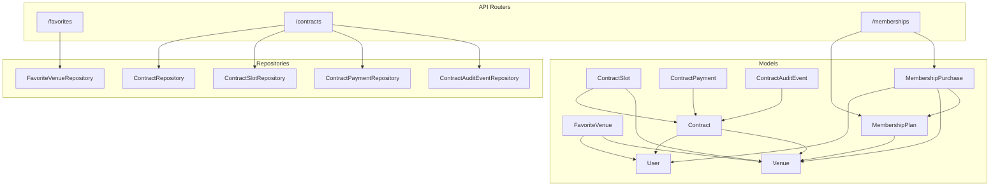
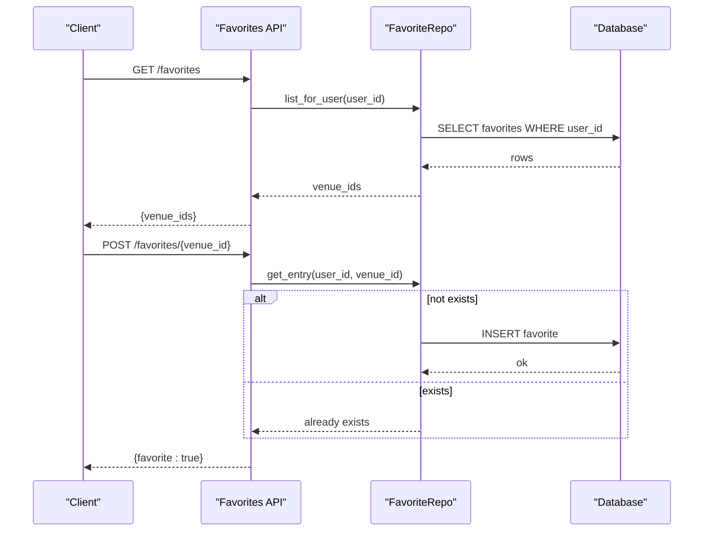
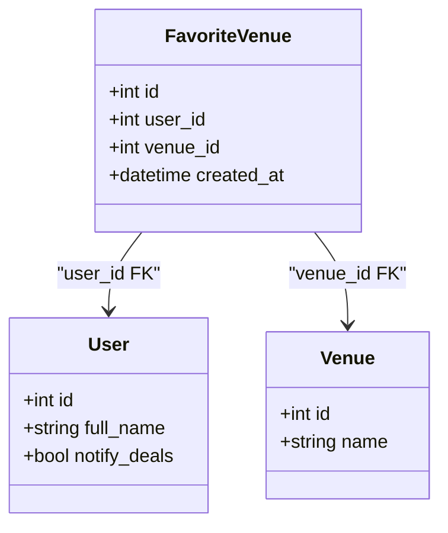
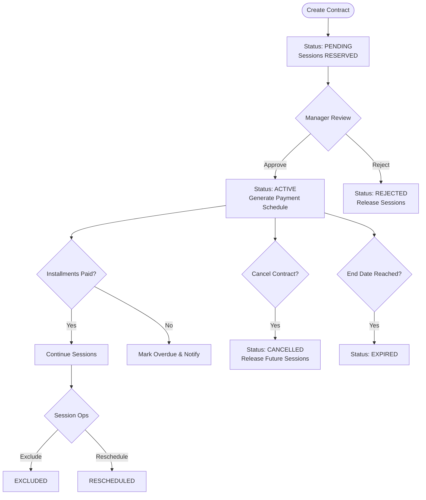
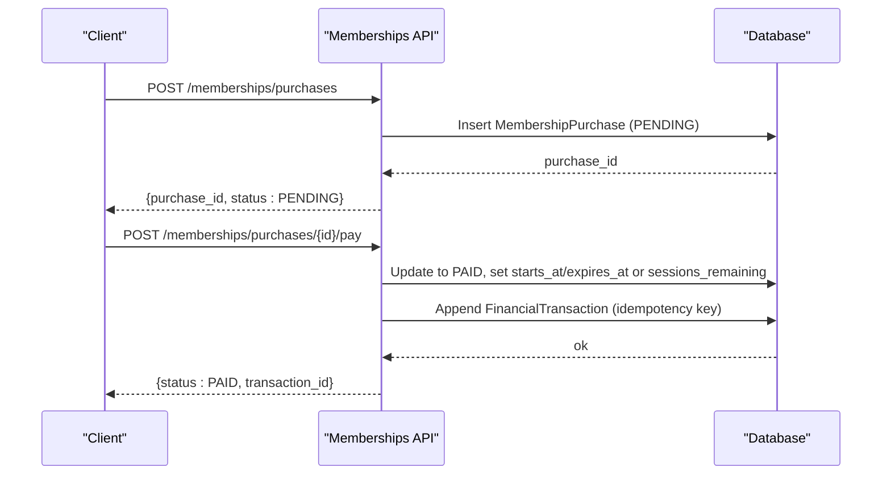
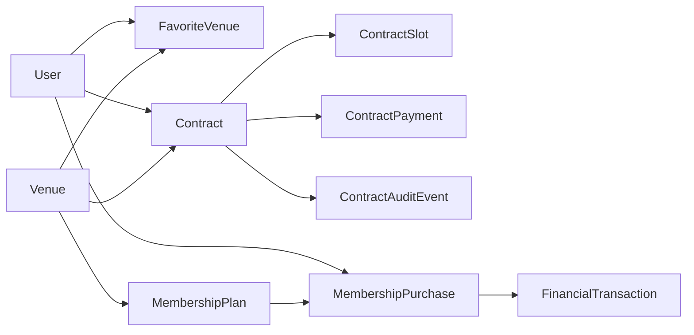

# Supporting Entities

<cite>
**Referenced Files in This Document**
- [favorite.py](file://app/models/favorite.py)
- [contract.py](file://app/models/contract.py)
- [membership.py](file://app/models/membership.py)
- [favorites.py](file://app/api/v1/favorites.py)
- [contracts.py](file://app/api/v1/contracts.py)
- [memberships.py](file://app/api/v1/memberships.py)
- [favorite_repository.py](file://app/repositories/favorite_repository.py)
- [contract_repository.py](file://app/repositories/contract_repository.py)
- [schemas/contract.py](file://app/schemas/contract.py)
- [schemas/membership.py](file://app/schemas/membership.py)
- [user.py](file://app/models/user.py)
- [venue.py](file://app/models/venue.py)
</cite>

## Table of Contents
1. [Introduction](#introduction)
2. [Project Structure](#project-structure)
3. [Core Components](#core-components)
4. [Architecture Overview](#architecture-overview)
5. [Detailed Component Analysis](#detailed-component-analysis)
6. [Dependency Analysis](#dependency-analysis)
7. [Performance Considerations](#performance-considerations)
8. [Troubleshooting Guide](#troubleshooting-guide)
9. [Conclusion](#conclusion)

## Introduction
This document explains the supporting entities that enhance the core system: Favorite (user preferences), Contract (venue agreements), and Membership (subscription services). It details how these models integrate with main business flows such as favorites management, contract lifecycle, and membership benefits, including typical usage patterns and relationships with other core entities like User and Venue.

## Project Structure
The supporting entities are implemented across models, repositories, schemas, and API routers:
- Models define persistent data structures and relationships.
- Repositories encapsulate data access logic.
- Schemas validate inputs and shape responses.
- API routers expose endpoints for client interactions.

**Diagram sources**
- [favorite.py:13-22](file://app/models/favorite.py#L13-L22)
- [contract.py:64-122](file://app/models/contract.py#L64-L122)
- [contract.py:124-151](file://app/models/contract.py#L124-L151)
- [contract.py:153-176](file://app/models/contract.py#L153-L176)
- [contract.py:178-193](file://app/models/contract.py#L178-L193)
- [membership.py:23-39](file://app/models/membership.py#L23-L39)
- [membership.py:41-61](file://app/models/membership.py#L41-L61)
- [user.py:13-34](file://app/models/user.py#L13-L34)
- [venue.py:16-43](file://app/models/venue.py#L16-L43)
- [favorite_repository.py:9-39](file://app/repositories/favorite_repository.py#L9-L39)
- [contract_repository.py:11-80](file://app/repositories/contract_repository.py#L11-L80)
- [contract_repository.py:83-151](file://app/repositories/contract_repository.py#L83-L151)
- [contract_repository.py:154-204](file://app/repositories/contract_repository.py#L154-L204)
- [contract_repository.py:207-227](file://app/repositories/contract_repository.py#L207-L227)
- [favorites.py:13-49](file://app/api/v1/favorites.py#L13-L49)
- [contracts.py:34-525](file://app/api/v1/contracts.py#L34-L525)
- [memberships.py:38-321](file://app/api/v1/memberships.py#L38-L321)

**Section sources**
- [favorite.py:13-22](file://app/models/favorite.py#L13-L22)
- [contract.py:64-193](file://app/models/contract.py#L64-L193)
- [membership.py:23-61](file://app/models/membership.py#L23-L61)
- [favorites.py:13-49](file://app/api/v1/favorites.py#L13-L49)
- [contracts.py:34-525](file://app/api/v1/contracts.py#L34-L525)
- [memberships.py:38-321](file://app/api/v1/memberships.py#L38-L321)

## Core Components
- FavoriteVenue: Stores a user’s favorite venues with uniqueness constraints to prevent duplicates.
- Contract: Represents venue agreements with lifecycle states, payment schedules, session scheduling, and audit events.
- ContractSlot: Tracks per-session status and rescheduling/exclusions within a contract.
- ContractPayment: Manages installment payments, due dates, and payment lifecycle.
- ContractAuditEvent: Records chronological actions for contracts.
- MembershipPlan: Defines purchasable plans (session, sessions pack, monthly) per venue.
- MembershipPurchase: Records user purchases, validity windows, and remaining sessions.

These components integrate with User and Venue to support personalized experiences, revenue tracking, and operational workflows.

**Section sources**
- [favorite.py:13-22](file://app/models/favorite.py#L13-L22)
- [contract.py:64-193](file://app/models/contract.py#L64-L193)
- [membership.py:23-61](file://app/models/membership.py#L23-L61)
- [user.py:13-34](file://app/models/user.py#L13-L34)
- [venue.py:16-43](file://app/models/venue.py#L16-L43)

## Architecture Overview
The supporting entities follow a layered architecture:
- API layer exposes REST endpoints for clients.
- Service/repository layer handles business rules and data access.
- Model layer defines schema and relationships.

**Diagram sources**
- [favorites.py:16-49](file://app/api/v1/favorites.py#L16-L49)
- [favorite_repository.py:14-30](file://app/repositories/favorite_repository.py#L14-L30)

**Section sources**
- [favorites.py:16-49](file://app/api/v1/favorites.py#L16-L49)
- [favorite_repository.py:14-30](file://app/repositories/favorite_repository.py#L14-L30)

## Detailed Component Analysis

### Favorite Entity
Purpose:
- Persist user preferences for venues server-side, replacing local storage behavior.
- Provide idempotent add/remove operations and efficient listing.

Key behaviors:
- Unique constraint on (user_id, venue_id) prevents duplicates.
- Repository supports listing by user, checking existence, removing entries, and fan-out for deal notifications.

Typical usage:
- On first load, frontend posts local favorite IDs; backend ensures persistence.
- Clients can list current favorites and toggle add/remove.

Relationships:
- Links User to Venue via foreign keys.

**Diagram sources**
- [favorite.py:13-22](file://app/models/favorite.py#L13-L22)
- [user.py:13-34](file://app/models/user.py#L13-L34)
- [venue.py:16-43](file://app/models/venue.py#L16-L43)

**Section sources**
- [favorite.py:13-22](file://app/models/favorite.py#L13-L22)
- [favorite_repository.py:14-39](file://app/repositories/favorite_repository.py#L14-L39)
- [favorites.py:16-49](file://app/api/v1/favorites.py#L16-L49)

### Contract Entity
Purpose:
- Manage venue agreements from request to active state, including installments, session scheduling, and cancellations.

Lifecycle:
- PENDING → ACTIVE/REJECTED → EXPIRED/CANCELLED/SUSPENDED.
- Approve may adjust price and generate payment schedule.
- Reject frees reserved sessions.
- Cancel enforces policy and releases future sessions.

Session rules:
- Each session has its own status (scheduled/completed/excluded/rescheduled).
- Past scheduled sessions auto-complete via tasks; users can request cancellation; managers exclude or reschedule.

Payments:
- Installment plan generated on approval; payments marked paid or voided; overdue detection and notifications.

Audit:
- Chronological audit events record all significant actions.

Typical usage:
- Users create requests; managers approve/reject; users pay installments; managers manage sessions and payments.

**Diagram sources**
- [contracts.py:90-117](file://app/api/v1/contracts.py#L90-L117)
- [contracts.py:197-258](file://app/api/v1/contracts.py#L197-L258)
- [contracts.py:261-383](file://app/api/v1/contracts.py#L261-L383)
- [contracts.py:388-510](file://app/api/v1/contracts.py#L388-L510)
- [contract_repository.py:37-80](file://app/repositories/contract_repository.py#L37-L80)
- [contract_repository.py:102-151](file://app/repositories/contract_repository.py#L102-L151)
- [contract_repository.py:179-204](file://app/repositories/contract_repository.py#L179-L204)

**Section sources**
- [contract.py:64-193](file://app/models/contract.py#L64-L193)
- [contracts.py:90-525](file://app/api/v1/contracts.py#L90-L525)
- [contract_repository.py:11-227](file://app/repositories/contract_repository.py#L11-L227)
- [schemas/contract.py:31-112](file://app/schemas/contract.py#L31-L112)

### Membership Entity
Purpose:
- Offer subscription-like plans without slot reservations: single session, packs, or monthly passes.

Plan types:
- SESSION: one-time session.
- SESSIONS_PACK: multiple sessions with remaining count.
- MONTHLY: time-bound pass with expiration.

Purchase flow:
- Create purchase (pending), simulate payment, set validity window, update ledger entry.
- Managers consume sessions for pack-type purchases.

Typical usage:
- Users browse plans, create purchases, pay, and use sessions or enjoy monthly access.
- Managers track venue purchases and consume sessions upon check-in.

**Diagram sources**
- [memberships.py:176-258](file://app/api/v1/memberships.py#L176-L258)
- [membership.py:23-61](file://app/models/membership.py#L23-L61)

**Section sources**
- [membership.py:23-61](file://app/models/membership.py#L23-L61)
- [memberships.py:95-321](file://app/api/v1/memberships.py#L95-L321)
- [schemas/membership.py:7-73](file://app/schemas/membership.py#L7-L73)

## Dependency Analysis
- Favorite depends on User and Venue; repository provides fan-out for deal notifications based on user notification preferences.
- Contract depends on User, Venue, Slot, and integrates with financial transactions through service calls and audit events.
- Membership depends on User, Venue, and Transaction ledger for accounting.

**Diagram sources**
- [favorite.py:13-22](file://app/models/favorite.py#L13-L22)
- [contract.py:64-193](file://app/models/contract.py#L64-L193)
- [membership.py:23-61](file://app/models/membership.py#L23-L61)
- [memberships.py:236-256](file://app/api/v1/memberships.py#L236-L256)

**Section sources**
- [favorite_repository.py:32-39](file://app/repositories/favorite_repository.py#L32-L39)
- [contract_repository.py:179-204](file://app/repositories/contract_repository.py#L179-L204)
- [memberships.py:236-256](file://app/api/v1/memberships.py#L236-L256)

## Performance Considerations
- Favorites:
  - Use unique constraints to avoid duplicate inserts and ensure fast lookups.
  - Limit list queries to reasonable sizes to reduce payload size.
- Contracts:
  - Indexes on user_id, venue_id, and date ranges improve query performance for manager views and conflict checks.
  - Batch operations for session scheduling and payment generation should be used where possible.
- Memberships:
  - Idempotent ledger entries prevent duplicate financial records on retries.
  - Pagination for purchase lists avoids large result sets.

[No sources needed since this section provides general guidance]

## Troubleshooting Guide
Common issues and resolutions:
- Duplicate favorites:
  - Ensure idempotent POST handling; backend checks existence before insert.
- Contract conflicts:
  - When moving whole contracts or rescheduling sessions, check for overlapping contracts on the same day/time; return conflict details to client.
- Overdue payments:
  - Daily tasks mark overdue payments and send notifications; verify grace days configuration and notification flags.
- Membership payment validation:
  - Validate card number format; invalid input cancels purchase and returns error.

**Section sources**
- [favorites.py:25-49](file://app/api/v1/favorites.py#L25-L49)
- [contracts.py:364-383](file://app/api/v1/contracts.py#L364-L383)
- [contract_repository.py:179-204](file://app/repositories/contract_repository.py#L179-L204)
- [memberships.py:200-258](file://app/api/v1/memberships.py#L200-L258)

## Conclusion
The Favorite, Contract, and Membership entities provide essential support for personalization, recurring venue agreements, and subscription-based access. Their design emphasizes clear lifecycles, robust permissions, and integration with financial and notification systems. By following the documented usage patterns and leveraging the provided APIs, teams can implement reliable features for favorites management, contract lifecycle automation, and membership benefits.

[No sources needed since this section summarizes without analyzing specific files]