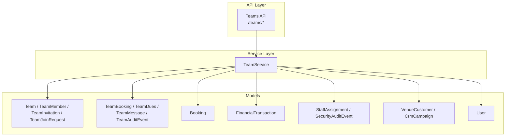
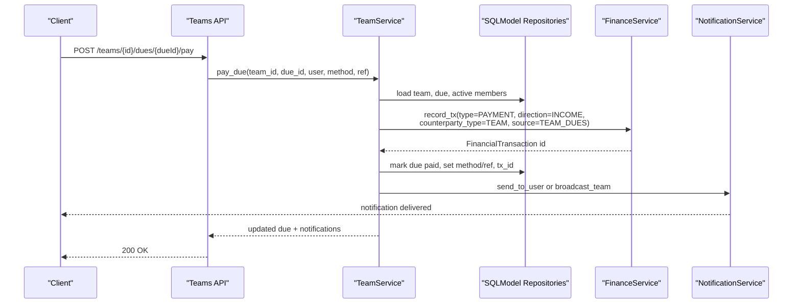
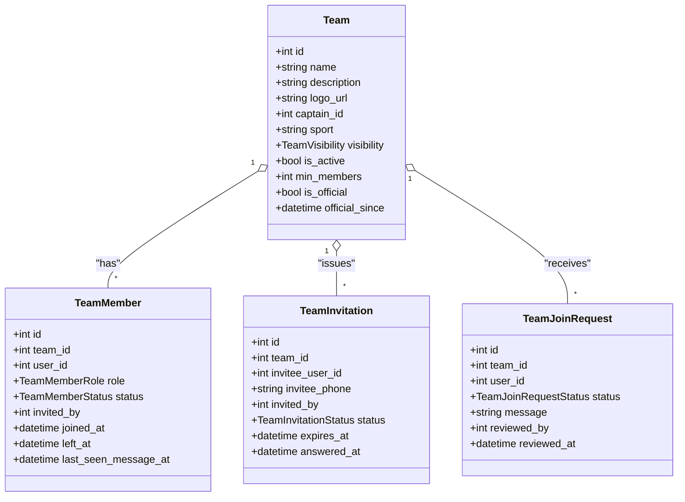
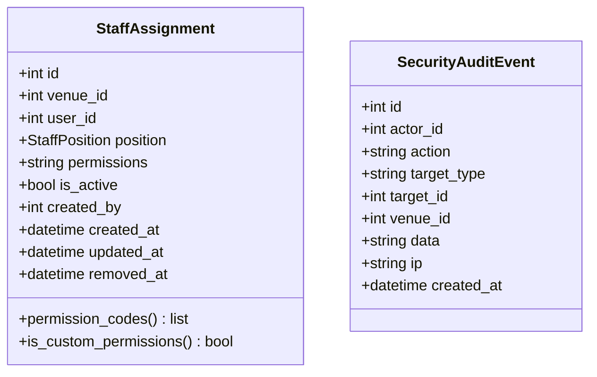
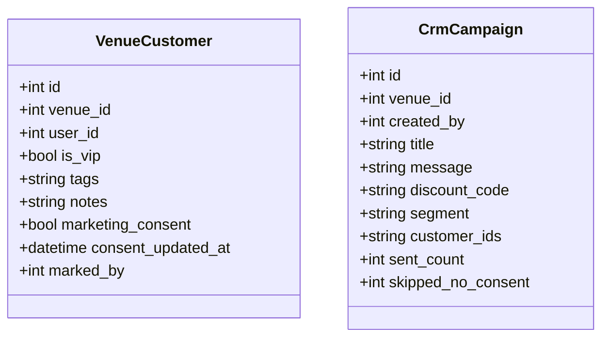
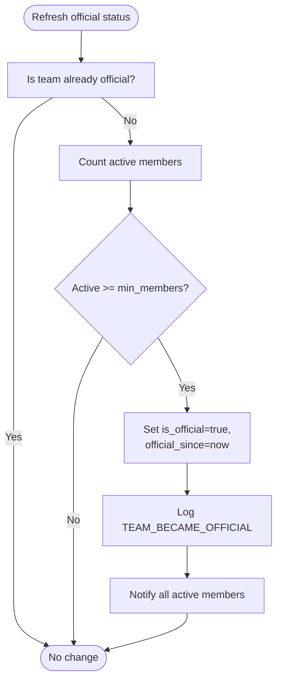
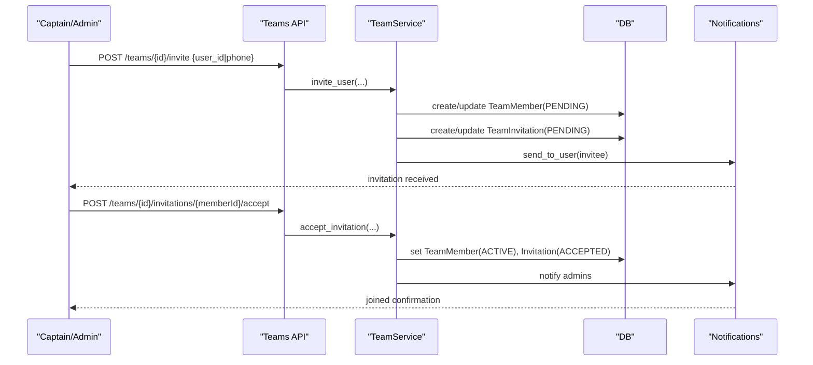
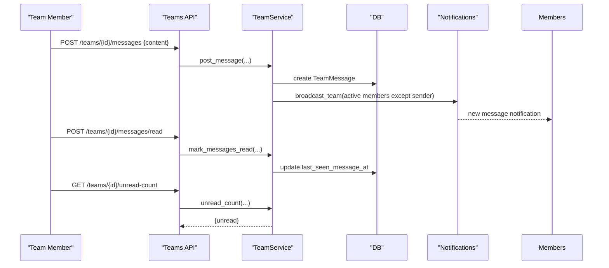
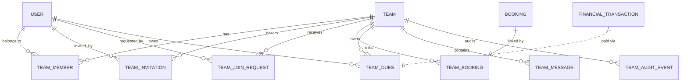
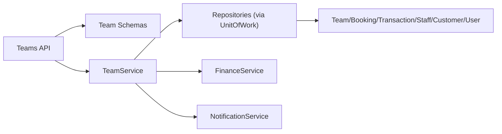

# Team Management

<cite>
**Referenced Files in This Document**
- [team.py](file://app/models/team.py)
- [staff.py](file://app/models/staff.py)
- [customer.py](file://app/models/customer.py)
- [booking.py](file://app/models/booking.py)
- [transaction.py](file://app/models/transaction.py)
- [user.py](file://app/models/user.py)
- [team_service.py](file://app/services/team_service.py)
- [teams_api.py](file://app/api/v1/teams.py)
- [team_schema.py](file://app/schemas/team.py)
</cite>

## Table of Contents
1. Introduction
2. Project Structure
3. Core Components
4. Architecture Overview
5. Detailed Component Analysis
6. Dependency Analysis
7. Performance Considerations
8. Troubleshooting Guide
9. Conclusion

## Introduction
This document explains the team management database schema and its integration with bookings, financial transactions, staff roles, and customer records. It covers:
- The Team model and member relationships (captain/admin/member), invitation workflows, join requests, and official status.
- Staff role-based permissions at venues and how they relate to CRM customers.
- Official chat for teams and message read tracking.
- Examples of creating teams, managing members, assigning roles, linking bookings, and handling dues.
- Relationships between teams, bookings, and financial transactions via a ledger.

## Project Structure
The team feature spans models, schemas, services, and API routes:
- Models define persistent entities: teams, members, invitations, join requests, dues, messages, audit events; plus related booking and transaction models.
- Schemas validate inputs and shape responses.
- Service implements business logic, authorization, notifications, and financial integrations.
- API exposes endpoints for CRUD, invitations, dues, bookings linkage, chat, and manager views.

**Diagram sources**
- [teams_api.py:36-422](file://app/api/v1/teams.py#L36-L422)
- [team_service.py:59-1213](file://app/services/team_service.py#L59-L1213)
- [team.py:88-240](file://app/models/team.py#L88-L240)
- [booking.py:21-51](file://app/models/booking.py#L21-L51)
- [transaction.py:84-119](file://app/models/transaction.py#L84-L119)
- [staff.py:26-76](file://app/models/staff.py#L26-L76)
- [customer.py:19-53](file://app/models/customer.py#L19-L53)
- [user.py:13-34](file://app/models/user.py#L13-L34)

**Section sources**
- [teams_api.py:36-422](file://app/api/v1/teams.py#L36-L422)
- [team_service.py:59-1213](file://app/services/team_service.py#L59-L1213)
- [team.py:88-240](file://app/models/team.py#L88-L240)

## Core Components
- Team: Persistent entity with visibility, captain, sport, official status thresholds, and timestamps.
- TeamMember: Role (captain/admin/member), status (pending/active/removed/declined), invitation metadata, last seen message time.
- TeamInvitation: Direct invite to registered users with optional expiry and phone snapshot.
- TeamJoinRequest: Public-team join flow with pending/approved/rejected states.
- TeamBooking: Links an existing booking to a team (one-to-one per booking).
- TeamDues: Per-member contributions with due dates, payment method, and ledger linkage.
- TeamMessage: High-volume team chat without per-message audit.
- TeamAuditEvent: Audit trail for team lifecycle and member actions.
- StaffAssignment: Venue-level RBAC with position-based default permissions and optional overrides.
- VenueCustomer: CRM record per venue with consent and tags.
- FinancialTransaction: Append-only ledger with counterparty support for teams.
- User: Base identity used across teams, staff assignments, and CRM.

**Section sources**
- [team.py:88-240](file://app/models/team.py#L88-L240)
- [staff.py:26-76](file://app/models/staff.py#L26-L76)
- [customer.py:19-53](file://app/models/customer.py#L19-L53)
- [transaction.py:84-119](file://app/models/transaction.py#L84-L119)
- [user.py:13-34](file://app/models/user.py#L13-L34)

## Architecture Overview
End-to-end flows for team operations are implemented by the API layer delegating to the service, which enforces rules, persists data, emits notifications, and integrates with finance.

**Diagram sources**
- [teams_api.py:303-315](file://app/api/v1/teams.py#L303-L315)
- [team_service.py:967-1026](file://app/services/team_service.py#L967-L1026)
- [transaction.py:84-119](file://app/models/transaction.py#L84-L119)

## Detailed Component Analysis

### Team Model and Member Relationships
- Team has a unique name per captain and supports visibility modes (private/public/invite_only).
- TeamMember ties a user to a team with role and status; includes invited_by and last_seen_message_at for chat unread calculation.
- Invitation and join request tables manage two onboarding paths: direct invites and public join requests.
- Official status is automatically granted when active members meet min_members threshold; audited and notified.

**Diagram sources**
- [team.py:88-167](file://app/models/team.py#L88-L167)

**Section sources**
- [team.py:88-167](file://app/models/team.py#L88-L167)
- [team_service.py:158-184](file://app/services/team_service.py#L158-L184)

### Staff Roles and Permissions
- StaffAssignment binds a user to a venue with a position and optional custom permissions stored as JSON.
- Effective permissions resolve to position defaults unless overridden.
- SecurityAuditEvent logs sensitive actions globally.

**Diagram sources**
- [staff.py:26-76](file://app/models/staff.py#L26-L76)

**Section sources**
- [staff.py:26-76](file://app/models/staff.py#L26-L76)

### Customer Model for Team Members
- VenueCustomer stores CRM attributes per venue-user pair, including VIP flag, tags, notes, and marketing consent.
- CrmCampaign tracks in-app campaigns with segmenting and sent counts.

**Diagram sources**
- [customer.py:19-53](file://app/models/customer.py#L19-L53)

**Section sources**
- [customer.py:19-53](file://app/models/customer.py#L19-L53)

### Team Hierarchy and Official Status
- Captain owns the team; admins assist with management; members participate.
- Official status is computed from active member count vs min_members and persisted with timestamp.

**Diagram sources**
- [team_service.py:158-184](file://app/services/team_service.py#L158-L184)

**Section sources**
- [team_service.py:158-184](file://app/services/team_service.py#L158-L184)

### Member Invitation Workflow
- Captains/admins invite registered users by user_id or phone.
- Creates or reactivates a TeamMember in PENDING state and issues a TeamInvitation.
- Invitee can accept or decline; acceptance transitions to ACTIVE and notifies admins.

**Diagram sources**
- [teams_api.py:139-172](file://app/api/v1/teams.py#L139-L172)
- [team_service.py:389-499](file://app/services/team_service.py#L389-L499)

**Section sources**
- [teams_api.py:139-172](file://app/api/v1/teams.py#L139-L172)
- [team_service.py:389-499](file://app/services/team_service.py#L389-L499)

### Official Chat Functionality
- TeamMessage stores high-volume messages without per-message audit.
- Read tracking uses TeamMember.last_seen_message_at to compute unread counts.
- Posting notifies other active members; listing supports pagination via before_id.

**Diagram sources**
- [teams_api.py:381-422](file://app/api/v1/teams.py#L381-L422)
- [team_service.py:820-855](file://app/services/team_service.py#L820-L855)
- [team.py:228-240](file://app/models/team.py#L228-L240)

**Section sources**
- [teams_api.py:381-422](file://app/api/v1/teams.py#L381-L422)
- [team_service.py:820-855](file://app/services/team_service.py#L820-L855)
- [team.py:228-240](file://app/models/team.py#L228-L240)

### Team Bookings and Financial Transactions
- TeamBooking links an existing Booking to a Team (one-to-one per booking).
- Dues payments create FinancialTransaction rows with counterparty_type=TEAM and source_type=TEAM_DUES.
- Balance computation aggregates ledger income/expenses for the team and subtracts unpaid dues.

**Diagram sources**
- [team.py:88-240](file://app/models/team.py#L88-L240)
- [booking.py:21-51](file://app/models/booking.py#L21-L51)
- [transaction.py:84-119](file://app/models/transaction.py#L84-L119)

**Section sources**
- [team_service.py:1084-1145](file://app/services/team_service.py#L1084-L1145)
- [team_service.py:967-1026](file://app/services/team_service.py#L967-L1026)
- [team_service.py:1058-1081](file://app/services/team_service.py#L1058-L1081)

### Example Workflows

#### Create a Team
- Endpoint: POST /teams
- Behavior: Creates Team, sets creator as CAPTAIN/AKTIVE, audits creation, notifies creator, refreshes official status.

**Section sources**
- [teams_api.py:36-44](file://app/api/v1/teams.py#L36-L44)
- [team_service.py:187-212](file://app/services/team_service.py#L187-L212)

#### Manage Members and Assign Roles
- Invite: POST /teams/{id}/invite
- Accept/Decline: POST /teams/{id}/invitations/{memberId}/accept|decline
- Remove: POST /teams/{id}/members/{memberId}/remove
- Leave: POST /teams/{id}/leave
- Transfer Captain: POST /teams/{id}/transfer-captain
- Change Role: POST /teams/{id}/members/{memberId}/role (admin or member only)

**Section sources**
- [teams_api.py:130-224](file://app/api/v1/teams.py#L130-L224)
- [team_service.py:368-658](file://app/services/team_service.py#L368-L658)

#### Link a Booking to a Team
- Endpoint: POST /teams/{id}/bookings/{bookingId}/link
- Behavior: Validates ownership and uniqueness, creates TeamBooking, notifies admins.

**Section sources**
- [teams_api.py:354-364](file://app/api/v1/teams.py#L354-L364)
- [team_service.py:1084-1115](file://app/services/team_service.py#L1084-L1115)

#### Generate and Pay Dues
- Generate: POST /teams/{id}/dues/generate
- Pay: POST /teams/{id}/dues/{dueId}/pay
- Void: DELETE /teams/{id}/dues/{dueId}
- Balance: GET /teams/{id}/balance

**Section sources**
- [teams_api.py:276-338](file://app/api/v1/teams.py#L276-L338)
- [team_service.py:880-1081](file://app/services/team_service.py#L880-L1081)

## Dependency Analysis
- API depends on schemas for validation and service for orchestration.
- Service depends on UnitOfWork repositories for persistence, FinanceService for ledger entries, and NotificationService for messaging.
- Models define strict constraints and indexes to enforce integrity and performance.

**Diagram sources**
- [teams_api.py:1-422](file://app/api/v1/teams.py#L1-L422)
- [team_service.py:1-1213](file://app/services/team_service.py#L1-L1213)
- [team_schema.py:1-294](file://app/schemas/team.py#L1-L294)

**Section sources**
- [teams_api.py:1-422](file://app/api/v1/teams.py#L1-L422)
- [team_service.py:1-1213](file://app/services/team_service.py#L1-L1213)
- [team_schema.py:1-294](file://app/schemas/team.py#L1-L294)

## Performance Considerations
- Use indexes on frequently queried columns (team visibility, member status, message timestamps).
- Avoid per-message auditing to handle high chat volume efficiently.
- Lock teams during capacity-sensitive operations (invite/accept/join decisions) to prevent race conditions.
- Paginate lists (messages, dues, bookings) and use cursor-based pagination for messages.

[No sources needed since this section provides general guidance]

## Troubleshooting Guide
Common errors and their causes:
- TEAM_NOT_FOUND: Invalid team ID.
- NOT_A_MEMBER: User not active member when required.
- NOT_AUTHORIZED: Non-admin attempting admin-only actions.
- TEAM_FULL: Exceeded max members.
- ALREADY_MEMBER / ALREADY_PENDING: Duplicate membership or pending invite.
- INVITE_EXPIRED: Expired invitation.
- DUE_ALREADY_PAID / DUE_VOIDED: Invalid state transition for dues.
- BOOKING_LINKED_ELSEWHERE: Booking already linked to another team.

Resolution tips:
- Verify current user membership and role.
- Check invitation expiration and status.
- Ensure dues are in correct state before paying or voiding.
- Confirm booking ownership before linking.

**Section sources**
- [team_service.py:48-116](file://app/services/team_service.py#L48-L116)
- [team_service.py:389-758](file://app/services/team_service.py#L389-L758)
- [team_service.py:967-1055](file://app/services/team_service.py#L967-L1055)
- [team_service.py:1084-1115](file://app/services/team_service.py#L1084-L1115)

## Conclusion
The team management system provides a robust foundation for organizing players into teams, managing membership lifecycles, enabling official recognition, facilitating communication, and integrating with financial ledgers. Staff RBAC and CRM features complement team operations by supporting venue-level access control and customer engagement. The design emphasizes auditability, idempotency, and clear separation of concerns across API, service, and model layers.

[No sources needed since this section summarizes without analyzing specific files]