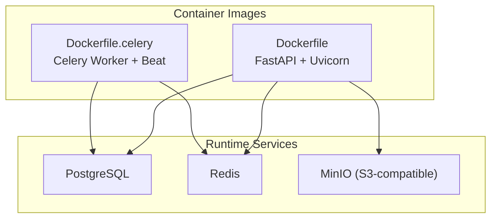
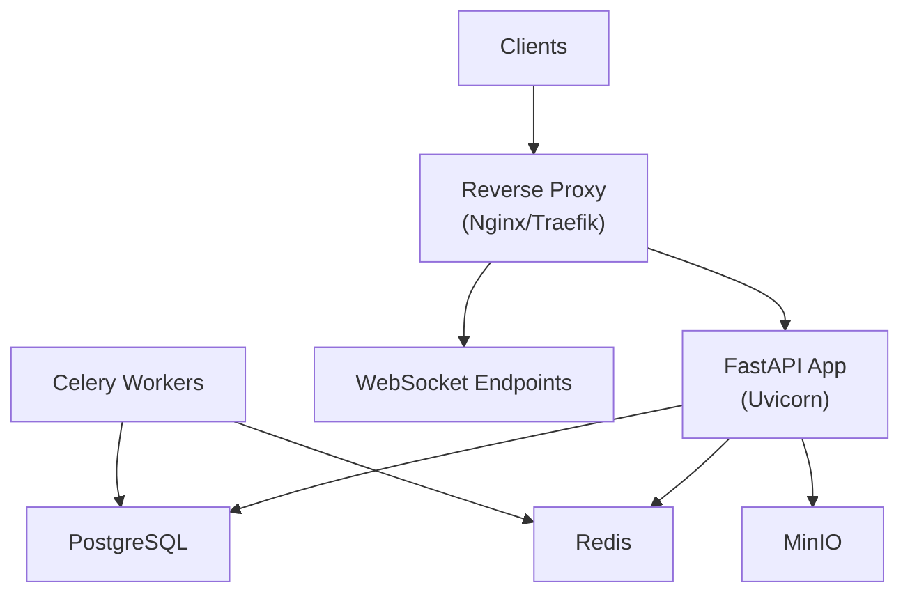
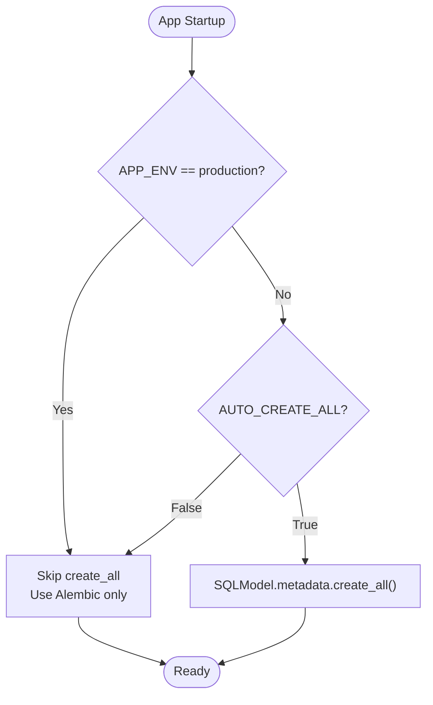
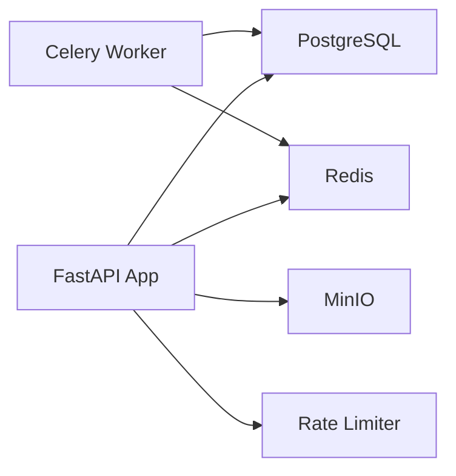

# Deployment & Production

<cite>
**Referenced Files in This Document**
- [Dockerfile](file://Dockerfile)
- [Dockerfile.celery](file://Dockerfile.celery)
- [requirements.txt](file://requirements.txt)
- [app/config.py](file://app/config.py)
- [app/main.py](file://app/main.py)
- [app/database.py](file://app/database.py)
- [alembic.ini](file://alembic.ini)
- [migrations/env.py](file://migrations/env.py)
- [app/tasks/worker.py](file://app/tasks/worker.py)
- [app/services/storage_service.py](file://app/services/storage_service.py)
- [app/utils/rate_limit.py](file://app/utils/rate_limit.py)
</cite>

## Table of Contents
1. Introduction
2. Project Structure
3. Core Components
4. Architecture Overview
5. Detailed Component Analysis
6. Dependency Analysis
7. Performance Considerations
8. Troubleshooting Guide
9. Conclusion
10. Appendices

## Introduction
This document provides production deployment guidance for the Futsal Booking System backend. It covers containerization with Docker, environment configuration, database and Redis setup, MinIO storage, reverse proxy and SSL/TLS considerations, monitoring and logging, health checks, performance tuning, scaling, backups, disaster recovery, and troubleshooting.

## Project Structure
The backend is a FastAPI application with:
- API routers under app/api/v1
- Domain models under app/models
- Repositories under app/repositories
- Services under app/services
- Background tasks via Celery under app/tasks
- Configuration via pydantic-settings in app/config.py
- Database initialization and session management in app/database.py
- Alembic migrations under migrations
- Docker images for the web server and Celery workers

**Diagram sources**
- [Dockerfile:1-26](file://Dockerfile#L1-L26)
- [Dockerfile.celery:1-11](file://Dockerfile.celery#L1-L11)
- [app/config.py:5-7](file://app/config.py#L5-L7)
- [app/config.py:51-57](file://app/config.py#L51-L57)

**Section sources**
- [Dockerfile:1-26](file://Dockerfile#L1-L26)
- [Dockerfile.celery:1-11](file://Dockerfile.celery#L1-L11)
- [requirements.txt:1-18](file://requirements.txt#L1-L18)

## Core Components
- Application entrypoint and middleware: FastAPI app, CORS, WebSocket endpoints, and a /health endpoint.
- Configuration: Centralized settings for database, Redis, JWT, MinIO, SMTP, and feature flags.
- Database: SQLModel engine with connection pooling; safe create_all behavior in development; Alembic for schema changes.
- Background jobs: Celery worker and scheduler using Redis as broker/backend.
- Storage: S3-compatible object storage via MinIO with public read policy and configurable base URL.
- Rate limiting: Redis-based fixed-window rate limiter with graceful degradation.

**Section sources**
- [app/main.py:39-76](file://app/main.py#L39-L76)
- [app/main.py:168-175](file://app/main.py#L168-L175)
- [app/config.py:4-69](file://app/config.py#L4-L69)
- [app/database.py:9-33](file://app/database.py#L9-L33)
- [app/tasks/worker.py:1-26](file://app/tasks/worker.py#L1-L26)
- [app/services/storage_service.py:20-94](file://app/services/storage_service.py#L20-L94)
- [app/utils/rate_limit.py:1-86](file://app/utils/rate_limit.py#L1-L86)

## Architecture Overview
Production architecture consists of:
- One or more FastAPI containers behind a reverse proxy
- Celery worker(s) consuming from Redis
- PostgreSQL for relational data
- Redis for caching, rate limiting, and Celery broker/backend
- MinIO for object storage

**Diagram sources**
- [app/main.py:168-175](file://app/main.py#L168-L175)
- [app/config.py:5-7](file://app/config.py#L5-L7)
- [app/config.py:51-57](file://app/config.py#L51-L57)
- [app/tasks/worker.py:4-8](file://app/tasks/worker.py#L4-L8)

## Detailed Component Analysis

### Containerization Strategy
- Web image: Python 3.11 base, installs system deps, copies requirements and source, exposes port 8000, runs Uvicorn.
- Worker image: Slim Python base, installs requirements, runs Celery worker with Beat enabled.

Recommendations:
- Pin base images to specific digests for reproducibility.
- Use multi-stage builds if static assets are built separately.
- Set non-root user in images for security.
- Add healthcheck instructions to both images.

**Section sources**
- [Dockerfile:1-26](file://Dockerfile#L1-L26)
- [Dockerfile.celery:1-11](file://Dockerfile.celery#L1-L11)

### Environment Configuration
Key environment variables:
- DATABASE_URL: PostgreSQL connection string used by app and Alembic.
- REDIS_URL: Redis URL used by Celery, rate limiter, and other components.
- JWT_SECRET, JWT_ALGORITHM, JWT_EXPIRY_HOURS: Authentication tokens.
- APP_ENV: Controls auto-create-all behavior and migration strategy.
- AUTO_CREATE_ALL: Disable in production; use Alembic only.
- DB_ECHO: Toggle SQL query logging.
- MINIO_ENDPOINT, MINIO_ACCESS_KEY, MINIO_SECRET_KEY, MINIO_BUCKET, MINIO_SECURE, MINIO_PUBLIC_URL: Object storage settings.
- SMTP_*: Email sending configuration.
- ALLOWED_ORIGINS: CORS origins list.

Best practices:
- Store secrets in a secure secret manager or orchestration platform.
- Never commit .env files to version control.
- Validate required settings at startup and fail fast on missing values.

**Section sources**
- [app/config.py:4-69](file://app/config.py#L4-L69)
- [alembic.ini:1-6](file://alembic.ini#L1-L6)
- [migrations/env.py:25-28](file://migrations/env.py#L25-L28)

### Database Setup and Migrations
- Engine uses connection pool_size and max_overflow for concurrency.
- In production, create_all is skipped; use Alembic to manage schema.
- Alembic reads DATABASE_URL from environment when available.

Operational steps:
- Ensure DATABASE_URL points to a managed PostgreSQL instance.
- Run alembic upgrade head before starting the app in production.
- Keep migrations idempotent and test them in staging first.

**Diagram sources**
- [app/database.py:20-33](file://app/database.py#L20-L33)

**Section sources**
- [app/database.py:9-33](file://app/database.py#L9-L33)
- [alembic.ini:1-6](file://alembic.ini#L1-L6)
- [migrations/env.py:25-28](file://migrations/env.py#L25-L28)

### Redis Configuration
Used by:
- Celery broker and result backend
- Rate limiting and cooldown guards
- Optional caching (if added later)

Recommendations:
- Use a managed Redis service with TLS and authentication.
- Configure separate databases or namespaces per environment.
- Enable persistence and memory policies appropriate for your workload.

**Section sources**
- [app/config.py:5-7](file://app/config.py#L5-L7)
- [app/tasks/worker.py:4-8](file://app/tasks/worker.py#L4-L8)
- [app/utils/rate_limit.py:24-29](file://app/utils/rate_limit.py#L24-L29)

### MinIO Storage Deployment
- The application connects to MinIO using endpoint, credentials, and secure flag.
- On first upload, it ensures the bucket exists and sets a read-only public policy for objects.
- Public URLs can be overridden via MINIO_PUBLIC_URL for CDN or reverse proxy scenarios.

Deployment notes:
- Provide a persistent volume for MinIO data.
- Use TLS for client connections in production.
- Restrict access keys and rotate regularly.
- Back up buckets and policies.

**Section sources**
- [app/config.py:51-57](file://app/config.py#L51-L57)
- [app/services/storage_service.py:20-94](file://app/services/storage_service.py#L20-L94)

### Reverse Proxy, SSL/TLS, and Load Balancing
- Expose the FastAPI app through a reverse proxy that terminates TLS and forwards to port 8000.
- Configure proxy headers so rate limiting and auth can trust upstream IPs.
- Enable HTTP/2 and keep-alive where supported.
- For load balancing, run multiple replicas behind the proxy; ensure stateless requests and externalize state to Redis/DB/MinIO.

[No sources needed since this section provides general guidance]

### Monitoring and Logging
- Health check: GET /health returns status, timestamp, and database connectivity indicator.
- Structured logs: Emit JSON logs with correlation IDs for request tracing.
- Metrics: Expose Prometheus metrics (e.g., request latency, error rates) via an internal endpoint or sidecar.
- Tracing: Integrate OpenTelemetry for distributed traces across API, Celery, DB, and cache.

**Section sources**
- [app/main.py:168-175](file://app/main.py#L168-L175)

### Background Jobs (Celery)
- Worker image runs Celery with Beat enabled.
- Broker and backend are Redis.
- Scheduled task: cleanup of expired pending bookings every 600 seconds.

Operational tips:
- Scale workers horizontally based on queue depth and CPU usage.
- Monitor Celery flower or equivalent dashboard.
- Use dedicated Redis instances or namespaces for Celery.

**Section sources**
- [Dockerfile.celery:1-11](file://Dockerfile.celery#L1-L11)
- [app/tasks/worker.py:1-26](file://app/tasks/worker.py#L1-L26)

### Security and Access Control
- CORS configured via allowed origins list.
- WebSocket endpoints enforce role-based access and token validation.
- Rate limiting protects sensitive endpoints with Redis-backed counters.

**Section sources**
- [app/main.py:58-76](file://app/main.py#L58-L76)
- [app/main.py:109-166](file://app/main.py#L109-L166)
- [app/utils/rate_limit.py:42-70](file://app/utils/rate_limit.py#L42-L70)

## Dependency Analysis
High-level runtime dependencies:
- FastAPI/Uvicorn for HTTP and WebSockets
- SQLModel/psycopg2 for PostgreSQL
- Redis for Celery, rate limiting, and optional caching
- MinIO SDK for object storage
- Alembic for migrations

**Diagram sources**
- [requirements.txt:1-18](file://requirements.txt#L1-L18)
- [app/config.py:5-7](file://app/config.py#L5-L7)
- [app/config.py:51-57](file://app/config.py#L51-L57)
- [app/tasks/worker.py:4-8](file://app/tasks/worker.py#L4-L8)
- [app/utils/rate_limit.py:24-29](file://app/utils/rate_limit.py#L24-L29)

**Section sources**
- [requirements.txt:1-18](file://requirements.txt#L1-L18)

## Performance Considerations
- Database:
  - Tune connection pool sizes and timeouts based on expected concurrency.
  - Use read replicas for heavy read workloads.
  - Index frequently queried columns and review slow queries.
- Redis:
  - Size memory appropriately; enable persistence if needed.
  - Use pipelines and Lua scripts for atomic operations.
- MinIO:
  - Use multipart uploads for large files.
  - Cache static assets via CDN.
- Application:
  - Disable debug features in production.
  - Use GZIP compression at the proxy layer.
  - Prefer async I/O where possible.

[No sources needed since this section provides general guidance]

## Troubleshooting Guide
Common issues and resolutions:
- Database connection failures:
  - Verify DATABASE_URL and network access.
  - Ensure migrations are applied (alembic upgrade head).
  - Check pool exhaustion and increase pool_size/max_overflow if necessary.
- Redis unavailable:
  - Rate limiter degrades gracefully; requests pass without limits.
  - Celery tasks will fail to enqueue; monitor queues and retry.
- MinIO errors:
  - Confirm endpoint, credentials, and bucket existence.
  - Review bucket policy and network ACLs.
- High latency or 429 responses:
  - Inspect rate limit scopes and thresholds.
  - Validate proxy headers for correct client IP detection.

**Section sources**
- [app/database.py:9-14](file://app/database.py#L9-L14)
- [app/utils/rate_limit.py:48-55](file://app/utils/rate_limit.py#L48-L55)
- [app/services/storage_service.py:65-90](file://app/services/storage_service.py#L65-L90)

## Conclusion
Deploy the FastAPI app and Celery workers as containers behind a reverse proxy with TLS termination. Manage schema via Alembic, store files in MinIO, and rely on Redis for messaging, rate limiting, and scheduling. Implement robust monitoring, structured logging, and regular backups. Scale horizontally by adding replicas and workers, and plan for disaster recovery with offsite backups and tested restore procedures.

[No sources needed since this section summarizes without analyzing specific files]

## Appendices

### Health Check Endpoint
- GET /health returns status, timestamp, and database connectivity indicator.

**Section sources**
- [app/main.py:168-175](file://app/main.py#L168-L175)

### Scaling Considerations
- Horizontal scaling:
  - Multiple FastAPI replicas behind a load balancer.
  - Multiple Celery workers per queue; consider separate queues for critical tasks.
- Statelessness:
  - Externalize sessions to Redis if needed.
  - Store files in MinIO; do not rely on local disk.
- Autoscaling:
  - Use CPU/memory and queue length metrics to trigger scaling.

[No sources needed since this section provides general guidance]

### Backup and Recovery
- PostgreSQL:
  - Schedule logical dumps (pg_dump) or use managed backup services.
  - Test restores regularly.
- MinIO:
  - Replicate buckets across regions or back up to object storage archives.
  - Preserve bucket policies and ACLs.
- Redis:
  - Enable persistence (RDB/AOF) and snapshot backups.
  - For ephemeral caches, accept rebuild cost.

[No sources needed since this section provides general guidance]

### Disaster Recovery Planning
- Define RTO/RPO targets.
- Maintain runbooks for full restore, partial restore, and failover.
- Practice drills quarterly.

[No sources needed since this section provides general guidance]

### Maintenance Procedures
- Apply migrations during low-traffic windows; use zero-downtime strategies if possible.
- Rotate secrets and credentials regularly.
- Update base images and dependencies; scan for vulnerabilities.

[No sources needed since this section provides general guidance]