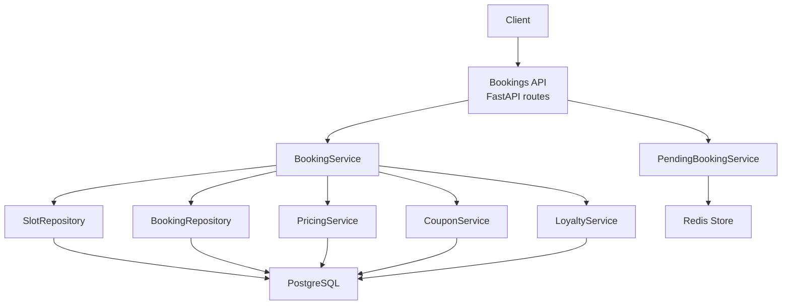
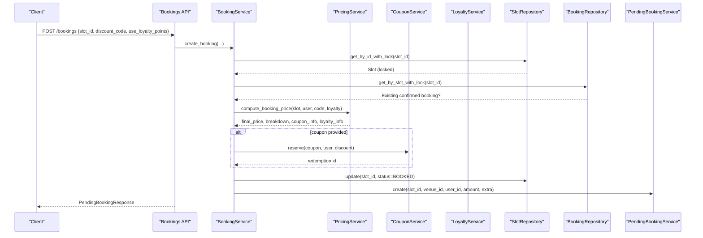
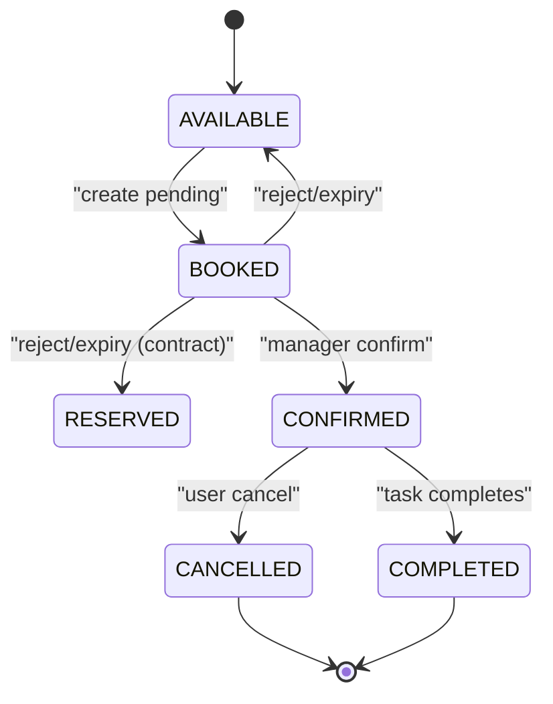
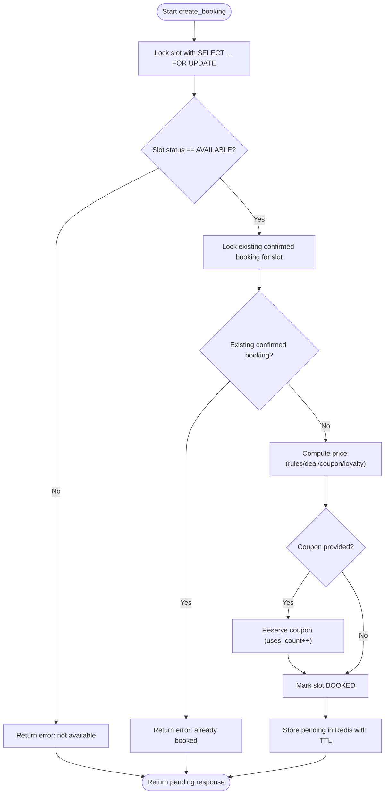
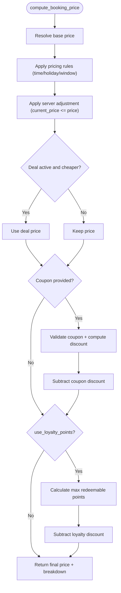
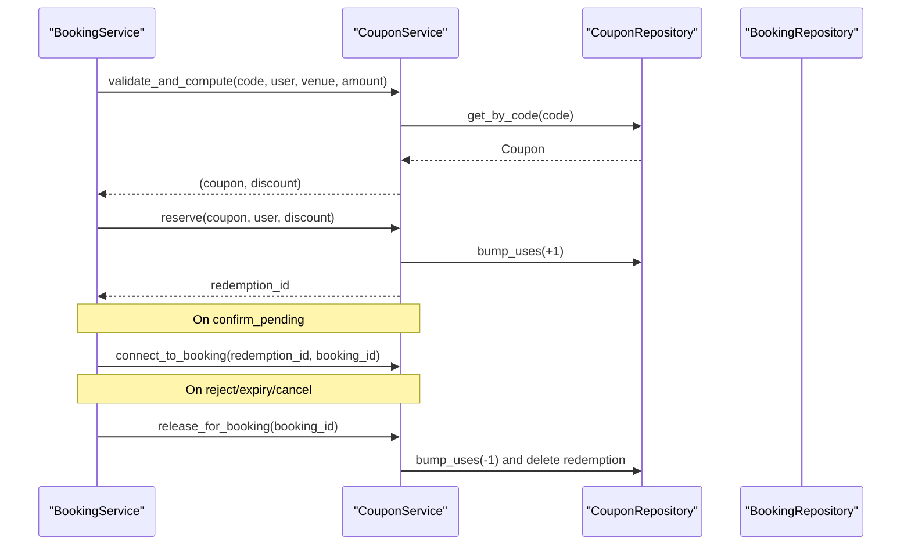
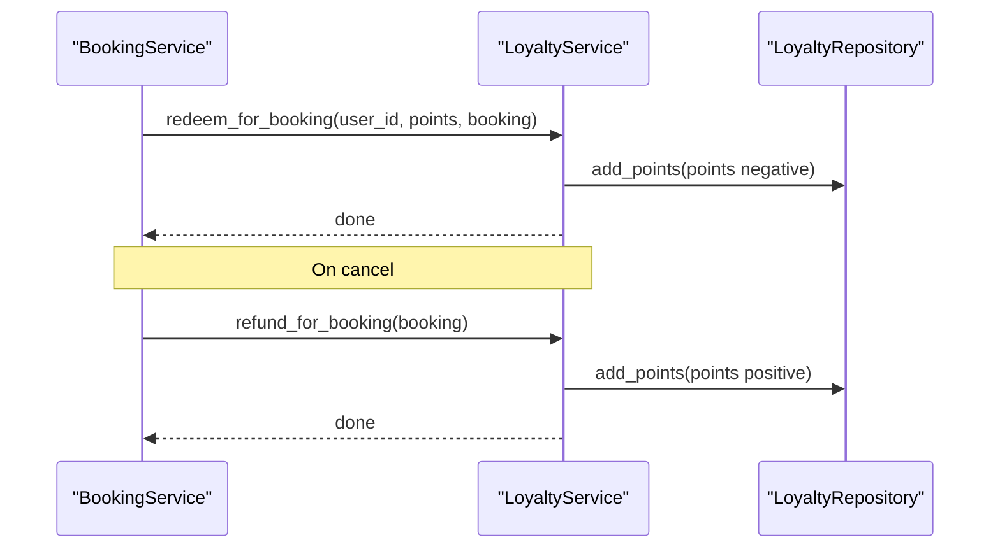
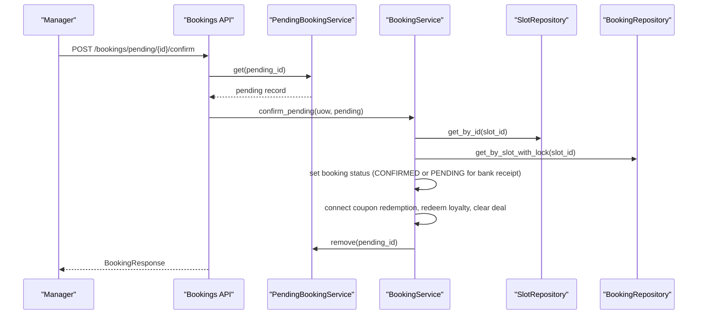
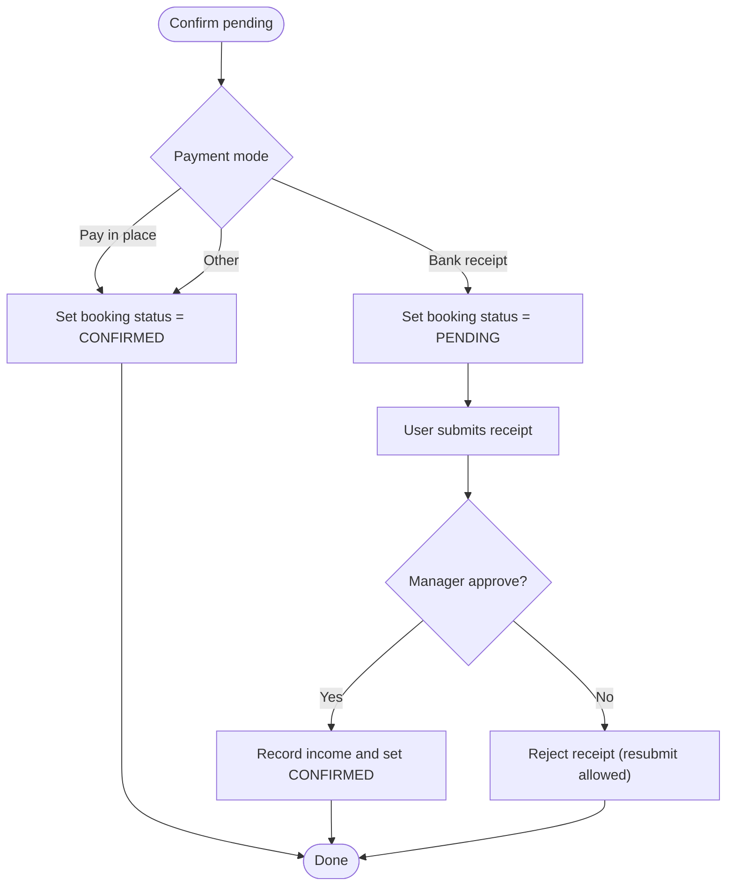
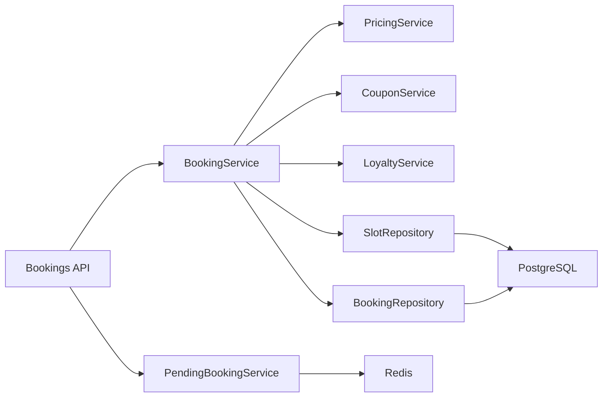

# Booking Lifecycle Management

<cite>
**Referenced Files in This Document**
- [bookings.py](file://app/api/v1/bookings.py)
- [booking_service.py](file://app/services/booking_service.py)
- [pending_booking_service.py](file://app/services/pending_booking_service.py)
- [pricing_service.py](file://app/services/pricing_service.py)
- [coupon_service.py](file://app/services/coupon_service.py)
- [loyalty_service.py](file://app/services/loyalty_service.py)
- [slot_repository.py](file://app/repositories/slot_repository.py)
- [booking_repository.py](file://app/repositories/booking_repository.py)
- [slot.py](file://app/models/slot.py)
- [booking.py](file://app/models/booking.py)
- [unit_of_work.py](file://app/unit_of_work.py)
- [config.py](file://app/config.py)
</cite>

## Table of Contents
1. [Introduction](#introduction)
2. [Project Structure](#project-structure)
3. [Core Components](#core-components)
4. [Architecture Overview](#architecture-overview)
5. [Detailed Component Analysis](#detailed-component-analysis)
6. [Dependency Analysis](#dependency-analysis)
7. [Performance Considerations](#performance-considerations)
8. [Troubleshooting Guide](#troubleshooting-guide)
9. [Conclusion](#conclusion)

## Introduction
This document explains the end-to-end booking lifecycle management system for the futsal booking backend. It covers availability checks, pending booking creation, manager approval, final confirmation, and cancellation flows. It also documents state transitions across slots and bookings, database locking to prevent race conditions, and integrations with the pricing engine, coupon reservation/redemption, and loyalty points usage. Practical scenarios such as last-minute deals, contract-protected slots, and payment mode handling are included.

## Project Structure
The booking lifecycle spans API endpoints, services, repositories, models, and external stores (Redis). The key layers:
- API layer: FastAPI routes for creating, confirming, rejecting, cancelling bookings and handling receipts/in-person payments.
- Service layer: Orchestrates business logic including pricing, coupons, loyalty, and pending booking management.
- Repository layer: Data access with database locks to ensure concurrency safety.
- Models: Define slot and booking states and relationships.
- External store: Redis holds pending bookings until manager approval or expiry.

**Diagram sources**
- [bookings.py:191-237](file://app/api/v1/bookings.py#L191-L237)
- [booking_service.py:26-109](file://app/services/booking_service.py#L26-L109)
- [pending_booking_service.py:46-77](file://app/services/pending_booking_service.py#L46-L77)
- [pricing_service.py:147-229](file://app/services/pricing_service.py#L147-L229)
- [coupon_service.py:34-95](file://app/services/coupon_service.py#L34-L95)
- [loyalty_service.py:52-75](file://app/services/loyalty_service.py#L52-L75)
- [slot_repository.py:15-18](file://app/repositories/slot_repository.py#L15-L18)
- [booking_repository.py:20-26](file://app/repositories/booking_repository.py#L20-L26)

**Section sources**
- [bookings.py:191-237](file://app/api/v1/bookings.py#L191-L237)
- [booking_service.py:26-109](file://app/services/booking_service.py#L26-L109)
- [pending_booking_service.py:46-77](file://app/services/pending_booking_service.py#L46-L77)
- [pricing_service.py:147-229](file://app/services/pricing_service.py#L147-L229)
- [coupon_service.py:34-95](file://app/services/coupon_service.py#L34-L95)
- [loyalty_service.py:52-75](file://app/services/loyalty_service.py#L52-L75)
- [slot_repository.py:15-18](file://app/repositories/slot_repository.py#L15-L18)
- [booking_repository.py:20-26](file://app/repositories/booking_repository.py#L20-L26)

## Core Components
- Slot model: Represents a time-based venue resource with status and pricing fields, plus flags for contracts and last-minute deals.
- Booking model: Represents a confirmed or pending reservation with payment details, receipt workflow, and applied discounts/loyalty.
- BookingService: Central orchestrator for creating pending bookings, confirming them, and cancelling; integrates pricing, coupons, loyalty, and slot updates.
- PendingBookingService: Manages temporary reservations in Redis with TTL, indexes by slot/user/venue, and cleanup on reject/expiry.
- PricingService: Computes final price deterministically using base price, rules, server adjustments, deal prices, coupons, and loyalty points.
- CouponService: Validates coupons, computes discount, reserves usage during pending creation, connects to booking on confirm, and releases on cancel/reject/expiry.
- LoyaltyService: Redeems points at confirm, refunds on cancel, and awards points after completion via tasks.
- Repositories: Provide data access with SELECT ... FOR UPDATE to avoid race conditions when checking/updating slots and existing bookings.

**Section sources**
- [slot.py:6-42](file://app/models/slot.py#L6-L42)
- [booking.py:7-51](file://app/models/booking.py#L7-L51)
- [booking_service.py:26-109](file://app/services/booking_service.py#L26-L109)
- [pending_booking_service.py:46-77](file://app/services/pending_booking_service.py#L46-L77)
- [pricing_service.py:147-229](file://app/services/pricing_service.py#L147-L229)
- [coupon_service.py:34-95](file://app/services/coupon_service.py#L34-L95)
- [loyalty_service.py:52-75](file://app/services/loyalty_service.py#L52-L75)
- [slot_repository.py:15-18](file://app/repositories/slot_repository.py#L15-L18)
- [booking_repository.py:20-26](file://app/repositories/booking_repository.py#L20-L26)

## Architecture Overview
The booking flow ensures strong consistency and prevents overbooking through database row-level locks and a two-phase process:
1. Create pending booking: Locks the slot, validates availability and contract protection, computes price, reserves coupon if used, marks slot BOOKED, stores pending in Redis with TTL.
2. Manager approval: Confirms pending to a real booking record, applies coupon redemption, deducts loyalty points, clears deal if used, removes from Redis.
3. Cancellation: Reverts slot status appropriately, releases coupon and refunds loyalty points, records financial refunds where applicable.

**Diagram sources**
- [bookings.py:191-237](file://app/api/v1/bookings.py#L191-L237)
- [booking_service.py:26-109](file://app/services/booking_service.py#L26-L109)
- [pricing_service.py:147-229](file://app/services/pricing_service.py#L147-L229)
- [coupon_service.py:82-95](file://app/services/coupon_service.py#L82-L95)
- [slot_repository.py:15-18](file://app/repositories/slot_repository.py#L15-L18)
- [booking_repository.py:20-26](file://app/repositories/booking_repository.py#L20-L26)
- [pending_booking_service.py:52-77](file://app/services/pending_booking_service.py#L52-L77)

## Detailed Component Analysis

### State Transitions
- Slot states: AVAILABLE → BOOKED (on pending creation), BOOKED → AVAILABLE or RESERVED (on reject/expiry/cancel depending on contract flag), BLOCKED, IN_COMPETITION, RESERVED (contract-protected).
- Booking states: PENDING (for bank receipt workflows), CONFIRMED (paid or receipt approved), CANCELLED, COMPLETED (via tasks).

**Diagram sources**
- [slot.py:6-12](file://app/models/slot.py#L6-L12)
- [booking.py:7-12](file://app/models/booking.py#L7-L12)
- [booking_service.py:90-109](file://app/services/booking_service.py#L90-L109)
- [booking_service.py:119-192](file://app/services/booking_service.py#L119-L192)
- [booking_service.py:194-217](file://app/services/booking_service.py#L194-L217)

**Section sources**
- [slot.py:6-12](file://app/models/slot.py#L6-L12)
- [booking.py:7-12](file://app/models/booking.py#L7-L12)
- [booking_service.py:90-109](file://app/services/booking_service.py#L90-L109)
- [booking_service.py:119-192](file://app/services/booking_service.py#L119-L192)
- [booking_service.py:194-217](file://app/services/booking_service.py#L194-L217)

### Database Locking and Concurrency Control
- Slot lock: SELECT ... FOR UPDATE on slot retrieval prevents concurrent reads/writes during booking creation.
- Existing booking lock: SELECT ... FOR UPDATE on confirmed bookings for the same slot prevents double-booking.
- Unit of Work: Ensures transactions commit/rollback around these operations.

**Diagram sources**
- [slot_repository.py:15-18](file://app/repositories/slot_repository.py#L15-L18)
- [booking_repository.py:20-26](file://app/repositories/booking_repository.py#L20-L26)
- [booking_service.py:26-109](file://app/services/booking_service.py#L26-L109)
- [unit_of_work.py:44-53](file://app/unit_of_work.py#L44-L53)

**Section sources**
- [slot_repository.py:15-18](file://app/repositories/slot_repository.py#L15-L18)
- [booking_repository.py:20-26](file://app/repositories/booking_repository.py#L20-L26)
- [booking_service.py:26-109](file://app/services/booking_service.py#L26-L109)
- [unit_of_work.py:44-53](file://app/unit_of_work.py#L44-L53)

### Pricing Engine Integration
- Base price: Venue default or configured default.
- Rules: Applied based on date/time windows and holiday flags; clamped to minimum floor.
- Server adjustments: current_price can reduce price but never increase it.
- Last-minute deals: If active and cheaper than effective price, deal replaces price.
- Coupons: Validated and discounted against effective price; reserved during pending creation.
- Loyalty points: Optional deduction capped by percentage settings; redeemed on confirm.

**Diagram sources**
- [pricing_service.py:48-132](file://app/services/pricing_service.py#L48-L132)
- [pricing_service.py:136-143](file://app/services/pricing_service.py#L136-L143)
- [pricing_service.py:147-229](file://app/services/pricing_service.py#L147-L229)

**Section sources**
- [pricing_service.py:48-132](file://app/services/pricing_service.py#L48-L132)
- [pricing_service.py:136-143](file://app/services/pricing_service.py#L136-L143)
- [pricing_service.py:147-229](file://app/services/pricing_service.py#L147-L229)

### Coupon Reservation and Redemption
- Validation: Checks activity, venue scope, validity window, usage limits, per-user limits, and minimum booking amount.
- Reserve: Increments uses_count and creates a redemption row linked to no booking yet.
- Connect: On confirm, links redemption to the booking.
- Release: On reject/expiry/cancel, decrements uses_count and deletes redemption.

**Diagram sources**
- [coupon_service.py:34-95](file://app/services/coupon_service.py#L34-L95)
- [coupon_service.py:97-120](file://app/services/coupon_service.py#L97-L120)
- [booking_service.py:93-109](file://app/services/booking_service.py#L93-L109)
- [booking_service.py:173-181](file://app/services/booking_service.py#L173-L181)

**Section sources**
- [coupon_service.py:34-95](file://app/services/coupon_service.py#L34-L95)
- [coupon_service.py:97-120](file://app/services/coupon_service.py#L97-L120)
- [booking_service.py:93-109](file://app/services/booking_service.py#L93-L109)
- [booking_service.py:173-181](file://app/services/booking_service.py#L173-L181)

### Loyalty Points Usage
- Redemption: At confirm, deducts points up to configured cap and ties to booking.
- Refund: On cancel, returns points tied to that booking.
- Award: After completion, awards points based on payment amount (handled by tasks).

**Diagram sources**
- [loyalty_service.py:52-75](file://app/services/loyalty_service.py#L52-L75)
- [booking_service.py:178-181](file://app/services/booking_service.py#L178-L181)
- [booking_service.py:212-216](file://app/services/booking_service.py#L212-L216)

**Section sources**
- [loyalty_service.py:52-75](file://app/services/loyalty_service.py#L52-L75)
- [booking_service.py:178-181](file://app/services/booking_service.py#L178-L181)
- [booking_service.py:212-216](file://app/services/booking_service.py#L212-L216)

### Pending Booking Approval Flow
- Manager confirms: Converts Redis pending to a database booking, sets status based on payment mode, connects coupon redemption, redeems loyalty points, clears deal if used, removes from Redis.
- Manager rejects: Removes pending, restores slot to AVAILABLE or RESERVED (if contract-protected), releases promotions.

**Diagram sources**
- [bookings.py:99-131](file://app/api/v1/bookings.py#L99-L131)
- [booking_service.py:119-192](file://app/services/booking_service.py#L119-L192)
- [pending_booking_service.py:79-95](file://app/services/pending_booking_service.py#L79-L95)

**Section sources**
- [bookings.py:99-131](file://app/api/v1/bookings.py#L99-L131)
- [booking_service.py:119-192](file://app/services/booking_service.py#L119-L192)
- [pending_booking_service.py:79-95](file://app/services/pending_booking_service.py#L79-L95)

### Payment Mode Handling
- Bank receipt: Booking created with PENDING status; user submits receipt; manager approves to CONFIRMED and records income; rejection allows resubmission.
- Pay in place: Staff collects payment and confirms booking to CONFIRMED; records income.
- Other modes: Handled by venue configuration snapshot at booking time.

**Diagram sources**
- [booking_service.py:149-171](file://app/services/booking_service.py#L149-L171)
- [bookings.py:454-528](file://app/api/v1/bookings.py#L454-L528)

**Section sources**
- [booking_service.py:149-171](file://app/services/booking_service.py#L149-L171)
- [bookings.py:454-528](file://app/api/v1/bookings.py#L454-L528)

### Common Booking Scenarios
- Last-minute deals:
  - Active deal reduces price if cheaper than effective price after rules/server adjustments.
  - On confirm, deal is cleared so slot cannot be reused.
  - Reference: deal_active check and application in pricing; clearing on confirm.
- Contract-protected slots:
  - Slots marked as contract-protected cannot be booked while contract is active.
  - On reject/expiry/cancel, slot restored to RESERVED instead of AVAILABLE to preserve contract rights.
- Payment mode handling:
  - Bank receipt requires receipt submission and manager approval before CONFIRMED.
  - In-person collection allows staff to mark payment and confirm immediately.

**Section sources**
- [pricing_service.py:136-143](file://app/services/pricing_service.py#L136-L143)
- [pricing_service.py:179-187](file://app/services/pricing_service.py#L179-L187)
- [booking_service.py:183-189](file://app/services/booking_service.py#L183-L189)
- [booking_service.py:54-59](file://app/services/booking_service.py#L54-L59)
- [booking_service.py:207-209](file://app/services/booking_service.py#L207-L209)
- [bookings.py:454-528](file://app/api/v1/bookings.py#L454-L528)

## Dependency Analysis
Key dependencies and coupling:
- API depends on services for business logic and unit of work for transaction boundaries.
- BookingService depends on PricingService, CouponService, LoyaltyService, and repositories for data operations.
- PendingBookingService depends on Redis for temporary storage and TTL management.
- Repositories depend on SQLModel sessions and provide locked queries to ensure consistency.

**Diagram sources**
- [bookings.py:191-237](file://app/api/v1/bookings.py#L191-L237)
- [booking_service.py:26-109](file://app/services/booking_service.py#L26-L109)
- [pending_booking_service.py:46-77](file://app/services/pending_booking_service.py#L46-L77)
- [slot_repository.py:15-18](file://app/repositories/slot_repository.py#L15-L18)
- [booking_repository.py:20-26](file://app/repositories/booking_repository.py#L20-L26)

**Section sources**
- [bookings.py:191-237](file://app/api/v1/bookings.py#L191-L237)
- [booking_service.py:26-109](file://app/services/booking_service.py#L26-L109)
- [pending_booking_service.py:46-77](file://app/services/pending_booking_service.py#L46-L77)
- [slot_repository.py:15-18](file://app/repositories/slot_repository.py#L15-L18)
- [booking_repository.py:20-26](file://app/repositories/booking_repository.py#L20-L26)

## Performance Considerations
- Row-level locking: SELECT ... FOR UPDATE prevents race conditions but may increase contention under high concurrency; ensure short transaction scopes and minimal work inside locks.
- Redis TTL: Pending bookings expire automatically; configure TTL to balance manager review time vs. slot holding duration.
- Pricing computation: Deterministic and server-side only; caching rule evaluation could be considered if rule sets change infrequently.
- Batch enrichment: API enriches responses with slot/venue data in batches to avoid N+1 queries.

[No sources needed since this section provides general guidance]

## Troubleshooting Guide
Common issues and resolutions:
- Slot not available:
  - Cause: Status not AVAILABLE or already has confirmed booking.
  - Resolution: Ensure slot is free and no existing confirmed booking exists; check locks and concurrent requests.
- Slot already pending confirmation:
  - Cause: Redis entry exists for the slot.
  - Resolution: Wait for expiry or have manager reject/cancel pending; verify Redis keys and TTL.
- Contract-protected slot:
  - Cause: Slot is part of an active contract.
  - Resolution: Do not allow public booking; restore to RESERVED on reject/expiry/cancel.
- Coupon invalid or exhausted:
  - Cause: Validation fails due to activity, venue scope, validity window, or usage limits.
  - Resolution: Verify coupon configuration and usage counts; release on reject/expiry/cancel.
- Insufficient loyalty points:
  - Cause: User balance below required points.
  - Resolution: Check loyalty balance and redemption caps; refund on cancel.
- Receipt workflow stuck:
  - Cause: Bank receipt submitted but not approved; or payment mode mismatch.
  - Resolution: Manager approves/rejects receipt; ensure payment_mode matches expected mode.

**Section sources**
- [booking_service.py:41-68](file://app/services/booking_service.py#L41-L68)
- [booking_service.py:54-59](file://app/services/booking_service.py#L54-L59)
- [coupon_service.py:34-72](file://app/services/coupon_service.py#L34-L72)
- [loyalty_service.py:52-64](file://app/services/loyalty_service.py#L52-L64)
- [bookings.py:454-528](file://app/api/v1/bookings.py#L454-L528)

## Conclusion
The booking lifecycle management system combines robust database locking, deterministic pricing, and a two-phase approval process to ensure correctness and flexibility. It supports dynamic pricing, last-minute deals, contract protections, and multiple payment modes while maintaining data integrity through careful use of Redis for pending state and SQL transactions for persistence. Proper configuration of TTL and pricing rules, along with vigilant monitoring of locks and Redis health, will keep the system performant and reliable under load.

[No sources needed since this section summarizes without analyzing specific files]