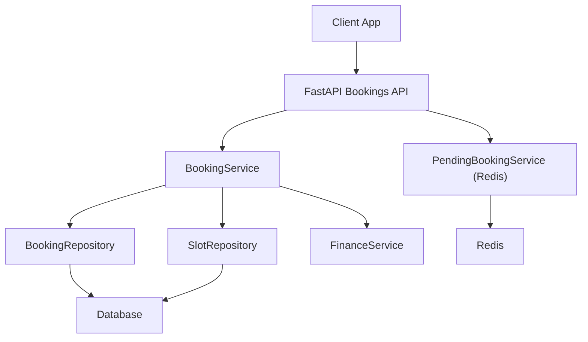
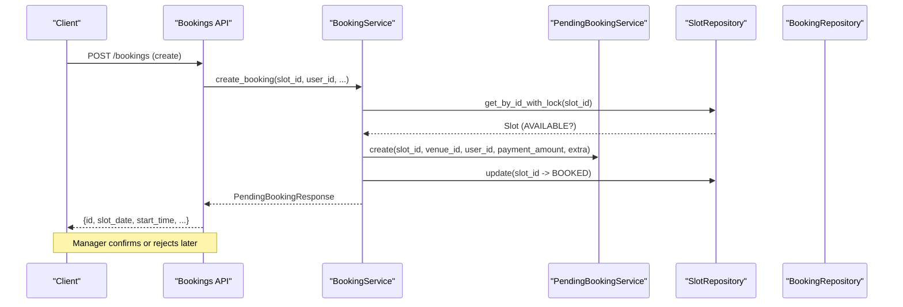
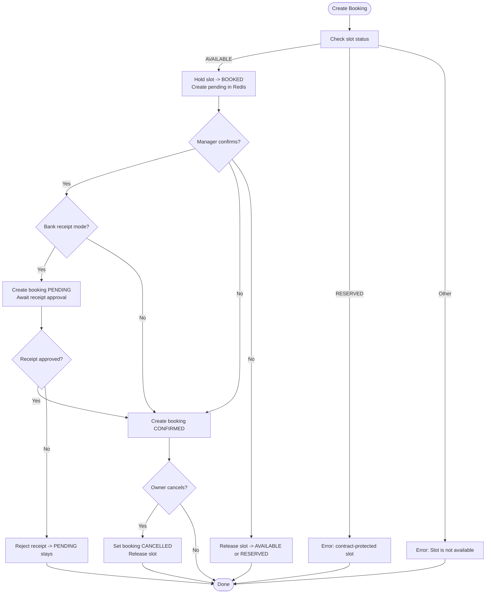
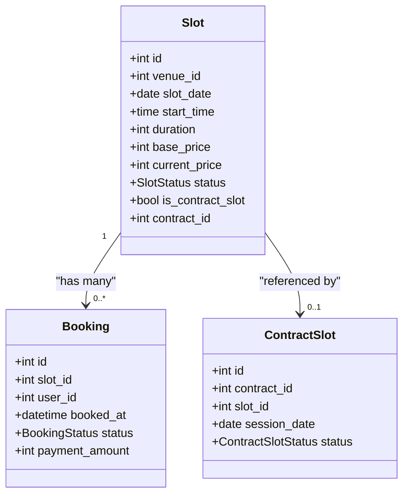
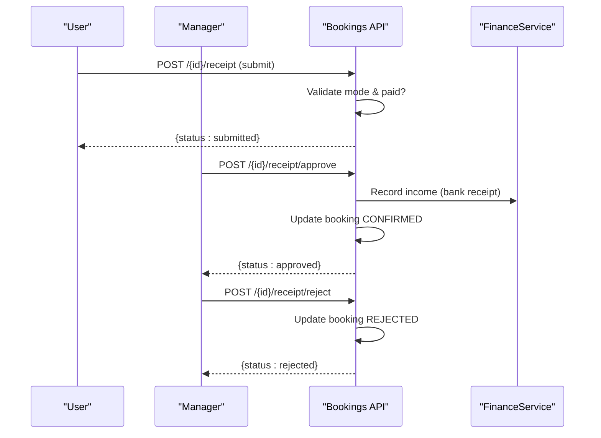
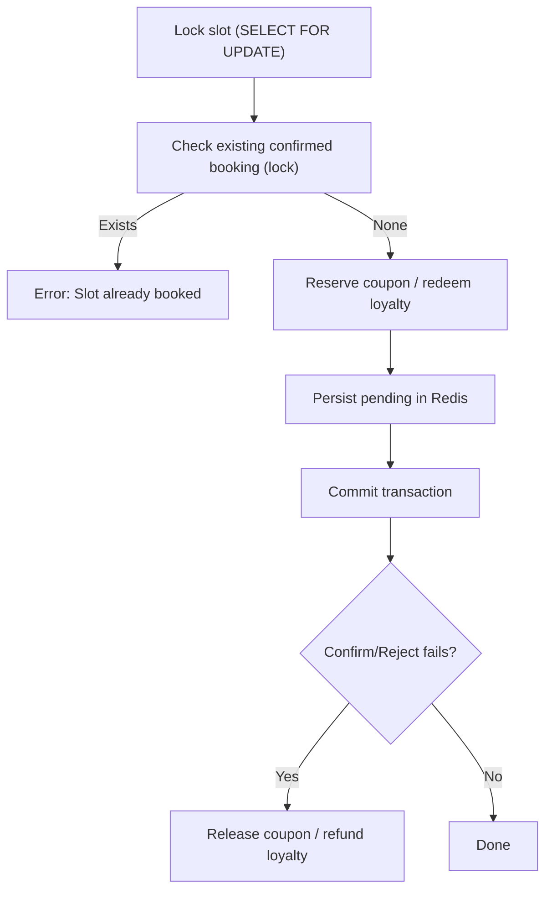
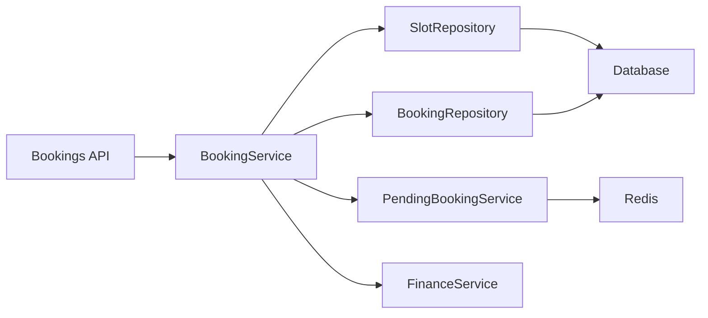

# Booking State Management

<cite>
**Referenced Files in This Document**
- [booking.py](file://app/models/booking.py)
- [slot.py](file://app/models/slot.py)
- [contract.py](file://app/models/contract.py)
- [booking_service.py](file://app/services/booking_service.py)
- [bookings.py](file://app/api/v1/bookings.py)
- [pending_booking_service.py](file://app/services/pending_booking_service.py)
- [booking_repository.py](file://app/repositories/booking_repository.py)
- [slot_repository.py](file://app/repositories/slot_repository.py)
</cite>

## Table of Contents
1. Introduction
2. Project Structure
3. Core Components
4. Architecture Overview
5. Detailed Component Analysis
6. Dependency Analysis
7. Performance Considerations
8. Troubleshooting Guide
9. Conclusion

## Introduction
This document explains the end-to-end state management and lifecycle transitions for bookings in the system. It covers all booking states (PENDING, CONFIRMED, CANCELLED), their transitions, business rules, validation checks, error conditions, and how slot statuses interact with contract-protected slots. It also outlines database constraints and integrity checks that maintain consistency across slots, bookings, and contracts.

## Project Structure
The booking workflow spans API endpoints, services, repositories, and models:
- API layer exposes endpoints to create pending bookings, confirm or reject them, cancel confirmed bookings, and handle receipts/in-person payments.
- Services enforce business rules, coordinate unit-of-work transactions, and manage Redis-based pending bookings.
- Repositories perform data access with locking to prevent race conditions.
- Models define enums for statuses and relationships between entities.

**Diagram sources**
- [bookings.py:192-237](file://app/api/v1/bookings.py#L192-L237)
- [booking_service.py:27-109](file://app/services/booking_service.py#L27-L109)
- [pending_booking_service.py:46-77](file://app/services/pending_booking_service.py#L46-L77)
- [booking_repository.py:20-26](file://app/repositories/booking_repository.py#L20-L26)
- [slot_repository.py:15-18](file://app/repositories/slot_repository.py#L15-L18)

**Section sources**
- [bookings.py:192-237](file://app/api/v1/bookings.py#L192-L237)
- [booking_service.py:27-109](file://app/services/booking_service.py#L27-L109)
- [pending_booking_service.py:46-77](file://app/services/pending_booking_service.py#L46-L77)
- [booking_repository.py:20-26](file://app/repositories/booking_repository.py#L20-L26)
- [slot_repository.py:15-18](file://app/repositories/slot_repository.py#L15-L18)

## Core Components
- Booking model defines booking states and receipt flow.
- Slot model defines slot availability and contract protection flags.
- Contract model defines contract-protected sessions and their lifecycle.
- BookingService orchestrates creation, confirmation, cancellation, and promotion handling.
- PendingBookingService manages temporary pending reservations in Redis with TTL.
- Repositories provide locked reads/writes to ensure concurrency safety.

Key status enums:
- BookingStatus: PENDING, CONFIRMED, CANCELLED, COMPLETED
- SlotStatus: AVAILABLE, BOOKED, BLOCKED, IN_COMPETITION, RESERVED
- ContractSlotStatus: SCHEDULED, COMPLETED, EXCLUDED, RESCHEDULED

**Section sources**
- [booking.py:7-11](file://app/models/booking.py#L7-L11)
- [slot.py:6-11](file://app/models/slot.py#L6-L11)
- [contract.py:29-39](file://app/models/contract.py#L29-L39)

## Architecture Overview
The booking lifecycle is a two-phase process:
1) Create a pending reservation:
   - The client requests a booking for a slot.
   - The service locks the slot, validates availability and contract protection, marks the slot as BOOKED, creates a pending record in Redis, and returns it to the client.
2) Confirm or reject the pending reservation:
   - A venue manager confirms or rejects within a time window.
   - On confirm: a permanent booking is created in the database; slot remains BOOKED; if bank receipt mode is required, the booking starts as PENDING until receipt approval; otherwise CONFIRMED immediately.
   - On reject: the pending entry is removed and the slot is restored to AVAILABLE or RESERVED depending on contract association.

**Diagram sources**
- [bookings.py:192-237](file://app/api/v1/bookings.py#L192-L237)
- [booking_service.py:27-109](file://app/services/booking_service.py#L27-L109)
- [pending_booking_service.py:52-77](file://app/services/pending_booking_service.py#L52-L77)
- [slot_repository.py:15-18](file://app/repositories/slot_repository.py#L15-L18)

**Section sources**
- [bookings.py:192-237](file://app/api/v1/bookings.py#L192-L237)
- [booking_service.py:27-109](file://app/services/booking_service.py#L27-L109)
- [pending_booking_service.py:52-77](file://app/services/pending_booking_service.py#L52-L77)

## Detailed Component Analysis

### Booking States and Transitions
- PENDING:
  - Created when a bank-receipt payment mode is used and the receipt has not yet been approved by the manager.
  - Can be cancelled by the owner while in PENDING or CONFIRMED states.
  - Becomes CONFIRMED after manager approves the submitted receipt.
- CONFIRMED:
  - Created when payment is already settled (e.g., online payment or in-person collection).
  - Can be cancelled by the owner.
- CANCELLED:
  - Final state after successful cancellation; slot is released back to AVAILABLE or RESERVED based on contract association.
- COMPLETED:
  - Represents a completed session at the contract level; does not change the underlying Slot row’s reserved nature.

Valid transitions:
- AVAILABLE + valid request → BOOKED (temporary hold in Redis)
- BOOKED (pending) → CONFIRMED (manager confirms)
- BOOKED (pending) → AVAILABLE or RESERVED (manager rejects or user cancels pending)
- CONFIRMED → CANCELLED (owner cancels)
- PENDING → CONFIRMED (receipt approved)
- PENDING → CANCELLED (owner cancels before approval)

Invalid transitions and errors:
- Creating a booking on a non-AVAILABLE slot: rejected with “Slot is not available”.
- Creating a booking on a RESERVED slot (contract-protected): rejected with message indicating contract protection.
- Confirming a booking when slot is no longer BOOKED: rejected with “Slot is no longer held for this booking”.
- Confirming a contract-protected slot: rejected with contract protection message.
- Cancelling a non-CONFIRMED/PENDING booking: rejected with “Cannot cancel this booking”.

**Diagram sources**
- [booking_service.py:27-109](file://app/services/booking_service.py#L27-L109)
- [booking_service.py:119-192](file://app/services/booking_service.py#L119-L192)
- [booking_service.py:194-217](file://app/services/booking_service.py#L194-L217)
- [bookings.py:454-510](file://app/api/v1/bookings.py#L454-L510)

**Section sources**
- [booking_service.py:27-109](file://app/services/booking_service.py#L27-L109)
- [booking_service.py:119-192](file://app/services/booking_service.py#L119-L192)
- [booking_service.py:194-217](file://app/services/booking_service.py#L194-L217)
- [bookings.py:454-510](file://app/api/v1/bookings.py#L454-L510)

### Slot Statuses and Contract Protection
- AVAILABLE: free to book.
- BOOKED: temporarily held during pending confirmation.
- RESERVED: indicates a slot tied to an active contract; cannot be booked by ad-hoc users.
- BLOCKED: manually blocked (e.g., maintenance).
- IN_COMPETITION: participating in price competition.

Contract-protected slots:
- Slots marked as contract slots are protected even if they appear AVAILABLE due to legacy data; attempts to book will be rejected.
- When releasing such slots (reject/cancel pending), they are restored to RESERVED rather than AVAILABLE to preserve contract semantics.

**Diagram sources**
- [slot.py:13-41](file://app/models/slot.py#L13-L41)
- [booking.py:21-50](file://app/models/booking.py#L21-L50)
- [contract.py:124-150](file://app/models/contract.py#L124-L150)

**Section sources**
- [slot.py:6-11](file://app/models/slot.py#L6-L11)
- [slot.py:13-41](file://app/models/slot.py#L13-L41)
- [contract.py:29-39](file://app/models/contract.py#L29-L39)
- [contract.py:124-150](file://app/models/contract.py#L124-L150)

### Receipt Flow and PENDING Confirmation
- For bank receipt payment mode:
  - User submits receipt → status becomes SUBMITTED.
  - Manager approves → income recorded, booking status set to CONFIRMED.
  - Manager rejects → status becomes REJECTED; user can resubmit.
- For in-person payment mode:
  - Staff collects payment → income recorded, booking status set to CONFIRMED.

**Diagram sources**
- [bookings.py:454-510](file://app/api/v1/bookings.py#L454-L510)

**Section sources**
- [bookings.py:454-510](file://app/api/v1/bookings.py#L454-L510)

### Concurrency and Integrity Controls
- Database-level row locking:
  - Slot read with lock during booking creation to avoid race conditions.
  - Booking read with lock to detect duplicate confirmed bookings per slot.
- Redis-based pending isolation:
  - Pending records indexed by slot, venue, and user with TTL to auto-expire.
- Promotion handling:
  - Coupons are reserved at booking creation and released on rejection/expiry/cancellation.
  - Loyalty points are redeemed on confirm and refunded on cancellation.

**Diagram sources**
- [booking_service.py:41-68](file://app/services/booking_service.py#L41-L68)
- [booking_service.py:93-109](file://app/services/booking_service.py#L93-L109)
- [booking_repository.py:20-26](file://app/repositories/booking_repository.py#L20-L26)
- [slot_repository.py:15-18](file://app/repositories/slot_repository.py#L15-L18)
- [pending_booking_service.py:52-77](file://app/services/pending_booking_service.py#L52-L77)

**Section sources**
- [booking_service.py:41-68](file://app/services/booking_service.py#L41-L68)
- [booking_service.py:93-109](file://app/services/booking_service.py#L93-L109)
- [booking_repository.py:20-26](file://app/repositories/booking_repository.py#L20-L26)
- [slot_repository.py:15-18](file://app/repositories/slot_repository.py#L15-L18)
- [pending_booking_service.py:52-77](file://app/services/pending_booking_service.py#L52-L77)

### Business Rules Summary
- Availability:
  - Only AVAILABLE slots can be held for pending booking.
  - RESERVED slots are contract-protected and cannot be booked by ad-hoc users.
- Contract protection:
  - Even if a contract slot appears AVAILABLE, active contract association blocks booking.
  - Releasing contract slots restores them to RESERVED, not AVAILABLE.
- Payment modes:
  - Bank receipt requires manager approval before CONFIRMED.
  - In-person collection allows staff to mark payment and CONFIRMED directly.
- Cancellations:
  - Allowed only for CONFIRMED or PENDING bookings owned by the user.
  - Releases promotions and refunds loyalty points; records financial refunds where applicable.

**Section sources**
- [booking_service.py:46-59](file://app/services/booking_service.py#L46-L59)
- [booking_service.py:140-147](file://app/services/booking_service.py#L140-L147)
- [booking_service.py:194-217](file://app/services/booking_service.py#L194-L217)
- [bookings.py:349-426](file://app/api/v1/bookings.py#L349-L426)

## Dependency Analysis
- API depends on services for business logic and on repositories for data access.
- Services depend on models for enums and relationships.
- Pending bookings rely on Redis for temporary storage and TTL-based expiration.
- Financial operations integrate via FinanceService for recording income/refunds.

**Diagram sources**
- [bookings.py:192-237](file://app/api/v1/bookings.py#L192-L237)
- [booking_service.py:27-109](file://app/services/booking_service.py#L27-L109)
- [pending_booking_service.py:46-77](file://app/services/pending_booking_service.py#L46-L77)

**Section sources**
- [bookings.py:192-237](file://app/api/v1/bookings.py#L192-L237)
- [booking_service.py:27-109](file://app/services/booking_service.py#L27-L109)
- [pending_booking_service.py:46-77](file://app/services/pending_booking_service.py#L46-L77)

## Performance Considerations
- Use of SELECT FOR UPDATE prevents race conditions during concurrent booking attempts.
- Redis-backed pending bookings reduce database load and allow fast lookups with TTL cleanup.
- Batch enrichment of responses avoids N+1 queries by loading slots and venues in bulk.
- Pricing computation is centralized to ensure consistent pricing snapshots at booking time.

[No sources needed since this section provides general guidance]

## Troubleshooting Guide
Common issues and resolutions:
- “Slot is not available”:
  - Cause: slot is not AVAILABLE (e.g., BLOCKED, IN_COMPETITION, or already BOOKED).
  - Action: verify slot status and retry after release or choose another slot.
- “این سانس رزروی است (ویژه قرارداد) و امکان رزرو آن وجود ندارد”:
  - Cause: attempting to book a RESERVED contract-protected slot.
  - Action: use contract flows or wait for slot to become available per contract lifecycle.
- “Slot already booked”:
  - Cause: a confirmed booking exists for the slot.
  - Action: select a different slot.
- “Slot is already pending confirmation”:
  - Cause: a pending booking exists for the slot in Redis.
  - Action: wait for expiry or have manager confirm/reject.
- “Slot is no longer held for this booking” during confirm:
  - Cause: slot status changed from BOOKED before confirmation.
  - Action: re-initiate booking flow.
- “Cannot cancel this booking”:
  - Cause: booking is not in CONFIRMED or PENDING state or not owned by user.
  - Action: check ownership and state; only eligible states can be cancelled.

**Section sources**
- [booking_service.py:46-68](file://app/services/booking_service.py#L46-L68)
- [booking_service.py:128-147](file://app/services/booking_service.py#L128-L147)
- [booking_service.py:194-217](file://app/services/booking_service.py#L194-L217)
- [bookings.py:349-426](file://app/api/v1/bookings.py#L349-L426)

## Conclusion
The booking system enforces robust state management through clear transitions between PENDING, CONFIRMED, and CANCELLED, coordinated with slot statuses and contract protections. Concurrency is handled via database locks and Redis-based pending reservations. Financial integrations ensure accurate accounting for receipts and in-person payments. Following the documented rules ensures consistent, conflict-free booking operations.