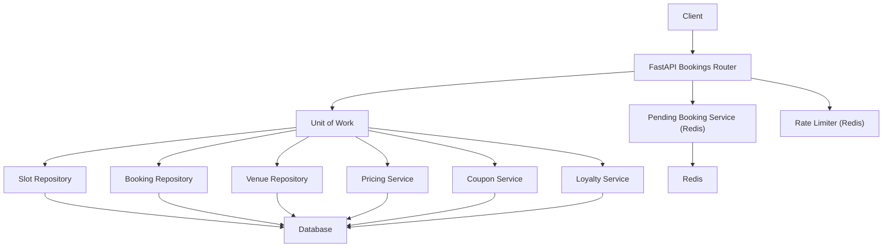
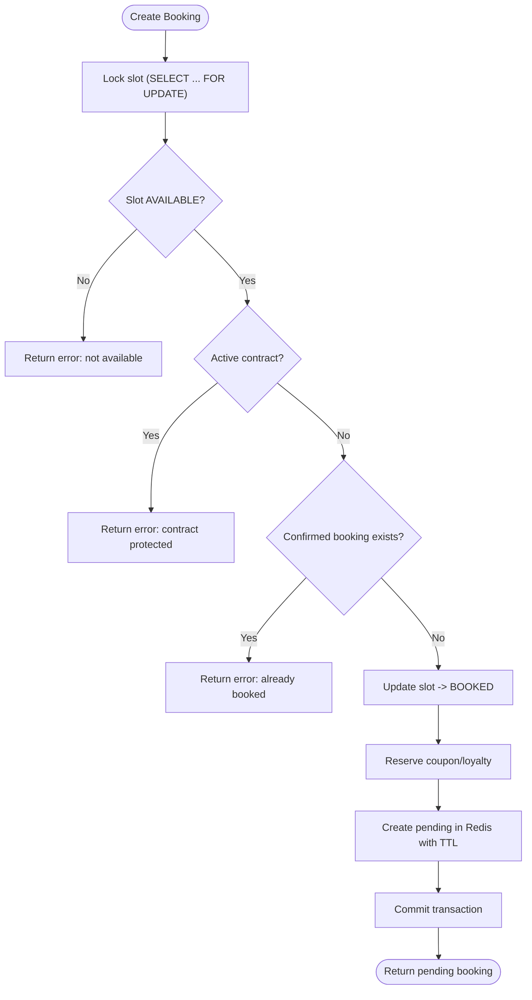
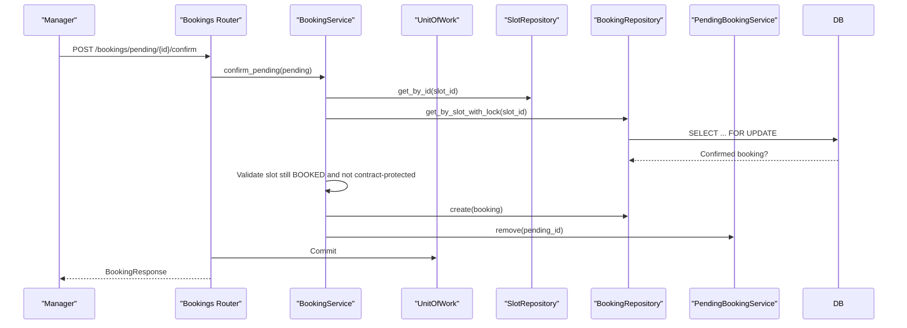
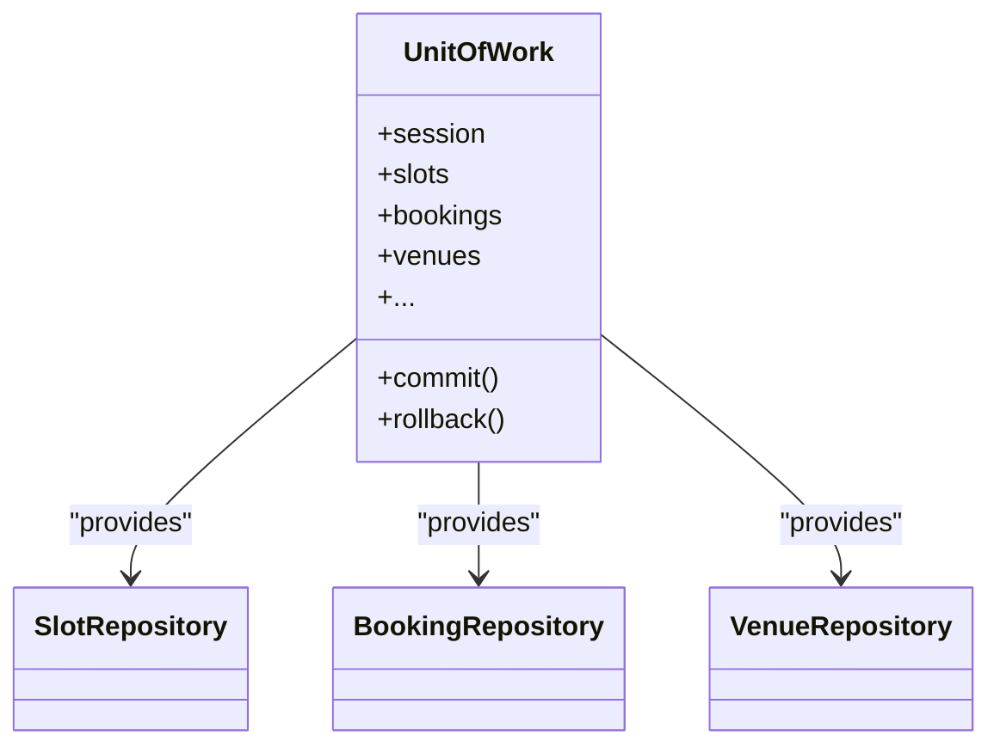
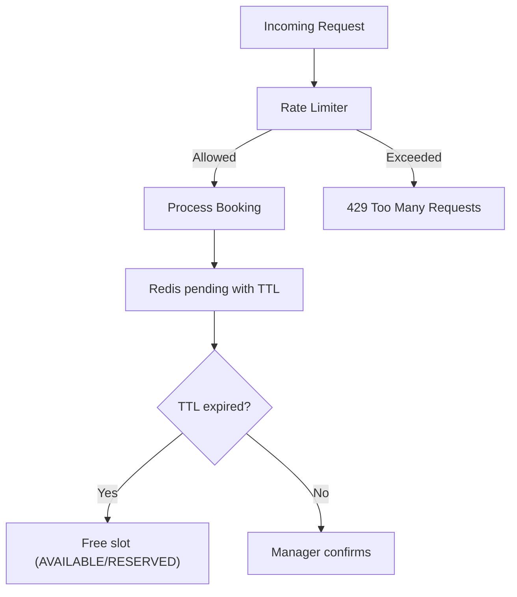
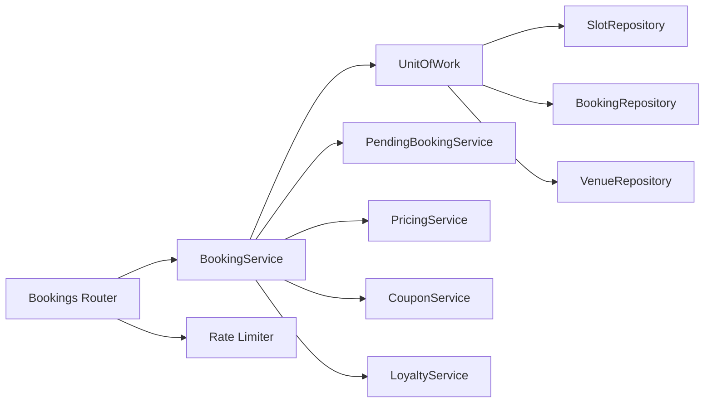

# Concurrency Control & Race Condition Prevention

<cite>
**Referenced Files in This Document**
- [unit_of_work.py](file://app/unit_of_work.py)
- [booking_service.py](file://app/services/booking_service.py)
- [slot_repository.py](file://app/repositories/slot_repository.py)
- [booking_repository.py](file://app/repositories/booking_repository.py)
- [bookings.py](file://app/api/v1/bookings.py)
- [pending_booking_service.py](file://app/services/pending_booking_service.py)
- [rate_limit.py](file://app/utils/rate_limit.py)
- [slot.py](file://app/models/slot.py)
- [booking.py](file://app/models/booking.py)
</cite>

## Table of Contents
1. Introduction
2. Project Structure
3. Core Components
4. Architecture Overview
5. Detailed Component Analysis
6. Dependency Analysis
7. Performance Considerations
8. Troubleshooting Guide
9. Conclusion

## Introduction
This document explains how the booking system prevents race conditions and ensures atomicity when multiple users attempt to reserve the same time slot concurrently. It focuses on:
- Database row-level locking using SELECT ... FOR UPDATE
- Transaction boundaries via the Unit of Work pattern
- Handling concurrent requests for the same slot, including timeouts and conflict resolution
- Examples of potential race conditions and how the locking mechanisms prevent them
- Performance considerations and best practices under high concurrency

## Project Structure
The concurrency control spans API endpoints, services, repositories, models, and a Unit of Work that coordinates database transactions. The key files involved are:
- API layer: FastAPI routes handling booking creation, confirmation, cancellation, and receipt flows
- Service layer: Business logic for creating pending bookings, confirming, releasing promotions, and canceling
- Repository layer: Data access with explicit row-level locks (SELECT ... FOR UPDATE)
- Unit of Work: Manages sessions and commits/rollbacks across multiple repository operations
- Models: Define slot and booking states used to enforce business rules
- Pending booking service: Stores temporary reservations in Redis with TTL-based expiration
- Rate limiter: Protects endpoints from abuse and reduces contention spikes



**Diagram sources**
- [bookings.py:191-237](file://app/api/v1/bookings.py#L191-L237)
- [booking_service.py:27-109](file://app/services/booking_service.py#L27-L109)
- [slot_repository.py:15-18](file://app/repositories/slot_repository.py#L15-L18)
- [booking_repository.py:20-26](file://app/repositories/booking_repository.py#L20-L26)
- [unit_of_work.py:38-68](file://app/unit_of_work.py#L38-L68)
- [pending_booking_service.py:46-77](file://app/services/pending_booking_service.py#L46-L77)
- [rate_limit.py:42-63](file://app/utils/rate_limit.py#L42-L63)

**Section sources**
- [bookings.py:191-237](file://app/api/v1/bookings.py#L191-L237)
- [booking_service.py:27-109](file://app/services/booking_service.py#L27-L109)
- [slot_repository.py:15-18](file://app/repositories/slot_repository.py#L15-L18)
- [booking_repository.py:20-26](file://app/repositories/booking_repository.py#L20-L26)
- [unit_of_work.py:38-68](file://app/unit_of_work.py#L38-L68)
- [pending_booking_service.py:46-77](file://app/services/pending_booking_service.py#L46-L77)
- [rate_limit.py:42-63](file://app/utils/rate_limit.py#L42-L63)

## Core Components
- Unit of Work: Provides a single Session per request and exposes repositories; ensures commit or rollback at the end of the context.
- Slot Repository: Implements SELECT ... FOR UPDATE to lock slots during reservation checks and updates.
- Booking Repository: Uses SELECT ... FOR UPDATE to check for existing confirmed bookings on the same slot.
- Booking Service: Orchestrates slot locking, validation, pricing, coupon reservation, pending booking creation, and state transitions.
- Pending Booking Service: Maintains temporary reservations in Redis with TTL to hold slots while awaiting manager approval.
- Rate Limiter: Limits request rates per IP/path/window to reduce contention and protect backend resources.

Key behaviors:
- Atomic slot reservation: A slot is locked before any status change or duplicate checks.
- Conflict detection: Duplicate bookings and active contract protections are enforced under lock.
- Temporary holding: Slots are marked BOOKED while pending; if rejected/expired, they revert to AVAILABLE or RESERVED (for contracts).
- Promotions safety: Coupons and loyalty points are reserved atomically and released on rejection/cancellation.

**Section sources**
- [unit_of_work.py:38-68](file://app/unit_of_work.py#L38-L68)
- [slot_repository.py:15-18](file://app/repositories/slot_repository.py#L15-L18)
- [booking_repository.py:20-26](file://app/repositories/booking_repository.py#L20-L26)
- [booking_service.py:27-109](file://app/services/booking_service.py#L27-L109)
- [pending_booking_service.py:46-77](file://app/services/pending_booking_service.py#L46-L77)
- [rate_limit.py:42-63](file://app/utils/rate_limit.py#L42-L63)

## Architecture Overview
The booking flow uses layered locking and transactional boundaries to ensure correctness under concurrency:

```mermaid
sequenceDiagram
participant C as "Client"
participant R as "Bookings Router"
participant S as "BookingService"
participant U as "UnitOfWork"
participant SR as "SlotRepository"
participant BR as "BookingRepository"
participant PS as "PendingBookingService"
participant DB as "Database"
C->>R : POST /bookings {slot_id}
R->>U : Start session (context)
R->>S : create_booking(slot_id, user_id, ...)
S->>SR : get_by_id_with_lock(slot_id)
SR->>DB : SELECT ... FOR UPDATE on slots
DB-->>SR : Locked slot
S->>BR : get_by_slot_with_lock(slot_id)
BR->>DB : SELECT ... FOR UPDATE on bookings
DB-->>BR : Existing confirmed booking?
S->>S : Validate availability, contract protection, pending check
S->>SR : update(slot_id -> BOOKED)
S->>PS : create(slot_id, venue_id, user_id, amount, extra)
PS->>DB : (No DB write here; writes to Redis)
R->>U : Commit
R-->>C : Pending booking response
```

**Diagram sources**
- [bookings.py:191-237](file://app/api/v1/bookings.py#L191-L237)
- [booking_service.py:27-109](file://app/services/booking_service.py#L27-L109)
- [slot_repository.py:15-18](file://app/repositories/slot_repository.py#L15-L18)
- [booking_repository.py:20-26](file://app/repositories/booking_repository.py#L20-L26)
- [pending_booking_service.py:52-77](file://app/services/pending_booking_service.py#L52-L77)
- [unit_of_work.py:44-53](file://app/unit_of_work.py#L44-L53)

## Detailed Component Analysis

### SELECT ... FOR UPDATE usage
- Slot lock: The slot is fetched with a row-level lock before any status changes or duplicate checks. This serializes concurrent attempts on the same slot.
- Booking lock: A separate lock checks for an existing confirmed booking on the same slot to prevent double-booking.

These locks ensure that only one request can proceed through the critical section for a given slot at a time.

**Section sources**
- [slot_repository.py:15-18](file://app/repositories/slot_repository.py#L15-L18)
- [booking_repository.py:20-26](file://app/repositories/booking_repository.py#L20-L26)

### Booking creation flow and race condition prevention
- Lock acquisition: The slot is locked first, then checked for availability and conflicts.
- Contract protection: Even if a slot appears available, it may be part of an active contract; such slots are rejected.
- Pending reservation: The slot is set to BOOKED immediately after validation, preventing other clients from reserving it while pending.
- Promotion reservation: Coupons are reserved atomically within the same unit of work; they are released upon rejection or cancellation.
- Redis pending record: A temporary record is created with TTL so that unconfirmed bookings expire automatically.



**Diagram sources**
- [booking_service.py:27-109](file://app/services/booking_service.py#L27-L109)
- [slot_repository.py:15-18](file://app/repositories/slot_repository.py#L15-L18)
- [booking_repository.py:20-26](file://app/repositories/booking_repository.py#L20-L26)
- [pending_booking_service.py:52-77](file://app/services/pending_booking_service.py#L52-L77)

**Section sources**
- [booking_service.py:27-109](file://app/services/booking_service.py#L27-L109)
- [slot_repository.py:15-18](file://app/repositories/slot_repository.py#L15-L18)
- [booking_repository.py:20-26](file://app/repositories/booking_repository.py#L20-L26)
- [pending_booking_service.py:52-77](file://app/services/pending_booking_service.py#L52-L77)

### Confirming a pending booking
- Manager confirms a pending booking; the system re-validates slot state and ensures no confirmed booking exists.
- If valid, a permanent booking is created in the database, promotions are connected to the booking, and loyalty points are redeemed.
- The pending record is removed from Redis.



**Diagram sources**
- [bookings.py:99-131](file://app/api/v1/bookings.py#L99-L131)
- [booking_service.py:119-192](file://app/services/booking_service.py#L119-L192)
- [booking_repository.py:20-26](file://app/repositories/booking_repository.py#L20-L26)
- [pending_booking_service.py:83-95](file://app/services/pending_booking_service.py#L83-L95)
- [unit_of_work.py:44-53](file://app/unit_of_work.py#L44-L53)

**Section sources**
- [bookings.py:99-131](file://app/api/v1/bookings.py#L99-L131)
- [booking_service.py:119-192](file://app/services/booking_service.py#L119-L192)
- [booking_repository.py:20-26](file://app/repositories/booking_repository.py#L20-L26)
- [pending_booking_service.py:83-95](file://app/services/pending_booking_service.py#L83-L95)

### Canceling and rejecting pending bookings
- Rejection or cancellation releases the slot back to AVAILABLE (or RESERVED for contract slots), removes the pending record, and releases any reserved promotions.
- This ensures slots become reusable promptly and promotions are not “burned.”

**Section sources**
- [bookings.py:134-186](file://app/api/v1/bookings.py#L134-L186)
- [booking_service.py:112-117](file://app/services/booking_service.py#L112-L117)
- [pending_booking_service.py:83-95](file://app/services/pending_booking_service.py#L83-L95)

### Unit of Work and transaction boundaries
- Each request starts a Unit of Work context that opens a database session and guarantees commit or rollback at the end.
- All repository operations within a request share the same session, ensuring consistency and isolation.
- Exceptions trigger rollback; successful paths commit all changes atomically.



**Diagram sources**
- [unit_of_work.py:38-68](file://app/unit_of_work.py#L38-L68)
- [unit_of_work.py:88-98](file://app/unit_of_work.py#L88-L98)

**Section sources**
- [unit_of_work.py:38-68](file://app/unit_of_work.py#L38-L68)

### Rate limiting and timeout handling
- Rate limiting: A fixed-window rate limiter protects sensitive endpoints (including booking creation) by limiting requests per IP/path/time window. Excess requests receive a 429 response with Retry-After guidance.
- Timeout handling: Pending bookings have a TTL stored in Redis; expired pending records are cleaned up, freeing slots. This acts as a soft timeout mechanism for unconfirmed reservations.



**Diagram sources**
- [rate_limit.py:42-63](file://app/utils/rate_limit.py#L42-L63)
- [pending_booking_service.py:18-19](file://app/services/pending_booking_service.py#L18-L19)
- [pending_booking_service.py:52-77](file://app/services/pending_booking_service.py#L52-L77)

**Section sources**
- [rate_limit.py:42-63](file://app/utils/rate_limit.py#L42-L63)
- [pending_booking_service.py:18-19](file://app/services/pending_booking_service.py#L18-L19)
- [pending_booking_service.py:52-77](file://app/services/pending_booking_service.py#L52-L77)

### Potential race conditions and how locking prevents them
- Double-booking the same slot: Prevented by locking the slot and checking for existing confirmed bookings under lock.
- Concurrent coupon redemption: Coupons are reserved atomically within the same transaction; release happens on rejection/cancellation.
- Overlapping contract slots: Active contract slots are explicitly rejected even if their status appears available.
- Stale reads: Using SELECT ... FOR UPDATE avoids reading stale data between check and update.

Examples:
- Two clients simultaneously request the same slot: Only one acquires the lock; the other sees the slot as unavailable or already booked and fails fast.
- A client cancels while another confirms: The Unit of Work ensures consistent state transitions; conflicting operations fail with clear errors.

**Section sources**
- [booking_service.py:27-109](file://app/services/booking_service.py#L27-L109)
- [slot_repository.py:15-18](file://app/repositories/slot_repository.py#L15-L18)
- [booking_repository.py:20-26](file://app/repositories/booking_repository.py#L20-L26)

## Dependency Analysis
The following diagram shows how components depend on each other during booking operations:



**Diagram sources**
- [bookings.py:191-237](file://app/api/v1/bookings.py#L191-L237)
- [booking_service.py:27-109](file://app/services/booking_service.py#L27-L109)
- [unit_of_work.py:38-68](file://app/unit_of_work.py#L38-L68)
- [rate_limit.py:42-63](file://app/utils/rate_limit.py#L42-L63)

**Section sources**
- [bookings.py:191-237](file://app/api/v1/bookings.py#L191-L237)
- [booking_service.py:27-109](file://app/services/booking_service.py#L27-L109)
- [unit_of_work.py:38-68](file://app/unit_of_work.py#L38-L68)
- [rate_limit.py:42-63](file://app/utils/rate_limit.py#L42-L63)

## Performance Considerations
- Minimize lock duration: Acquire locks as late as possible and release them quickly by keeping critical sections short.
- Batch operations: Use the Unit of Work to batch multiple repository calls into a single transaction to reduce round trips.
- Avoid N+1 queries: Prefer bulk reads where possible (e.g., fetching multiple slots/venues in one query).
- Rate limiting: Protects against bursts that could cause excessive lock contention and degrade performance.
- Redis TTL: Ensures temporary reservations do not hold slots indefinitely; expired entries free capacity automatically.
- Idempotency: Financial operations use idempotency keys to avoid duplicate charges and simplify retries.

[No sources needed since this section provides general guidance]

## Troubleshooting Guide
Common issues and resolutions:
- “Slot is not available”: Indicates the slot was already booked, blocked, or part of an active contract. Verify slot status and contract associations.
- “Slot already booked”: Another request acquired the lock and created a confirmed booking; retry later or choose another slot.
- “Slot is already pending confirmation”: A pending booking exists for the slot; wait for manager action or expiration.
- “Cannot cancel this booking”: Booking is not in a cancellable state; verify its status and ownership.
- Redis unavailability: Rate limiter degrades gracefully; pending bookings rely on Redis—if Redis is down, ensure fallback strategies are in place.

Operational tips:
- Monitor lock contention and slow queries to identify bottlenecks.
- Ensure proper indexing on frequently queried columns (e.g., slot_date, start_time, venue_id).
- Review TTL settings for pending bookings to balance user experience and resource utilization.

**Section sources**
- [booking_service.py:27-109](file://app/services/booking_service.py#L27-L109)
- [bookings.py:191-237](file://app/api/v1/bookings.py#L191-L237)
- [rate_limit.py:42-63](file://app/utils/rate_limit.py#L42-L63)

## Conclusion
The booking system employs robust concurrency controls to prevent race conditions:
- Row-level locks (SELECT ... FOR UPDATE) serialize access to slots and bookings during critical operations.
- The Unit of Work pattern ensures transactional consistency across multiple repository calls.
- Redis-backed pending bookings provide temporary holds with automatic expiration, enabling safe workflows while awaiting manager approval.
- Rate limiting mitigates contention spikes and protects system stability.

Together, these mechanisms ensure that concurrent requests are handled safely, consistently, and efficiently, even under high load.

[No sources needed since this section summarizes without analyzing specific files]