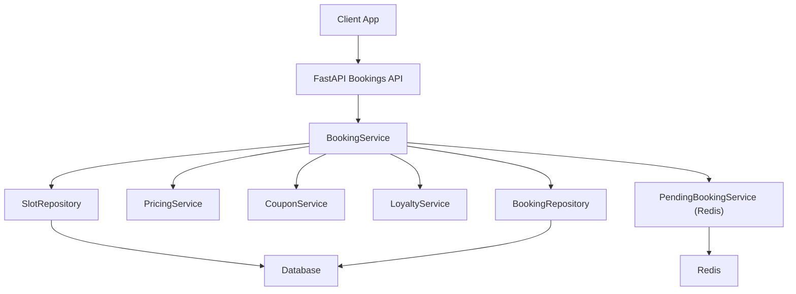
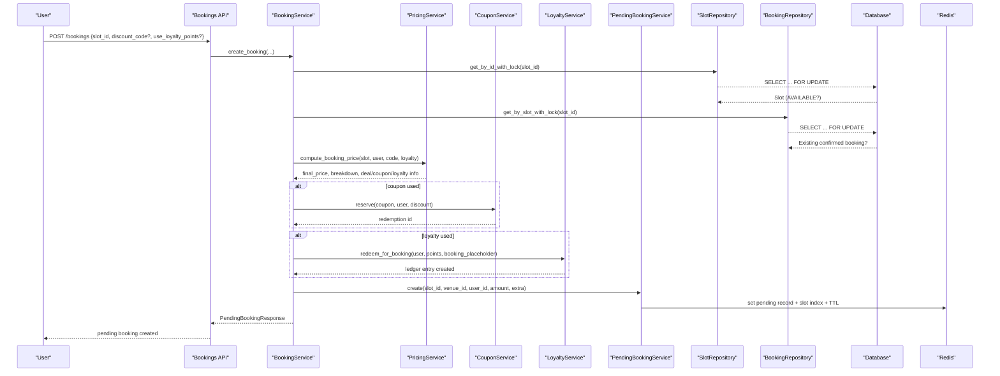
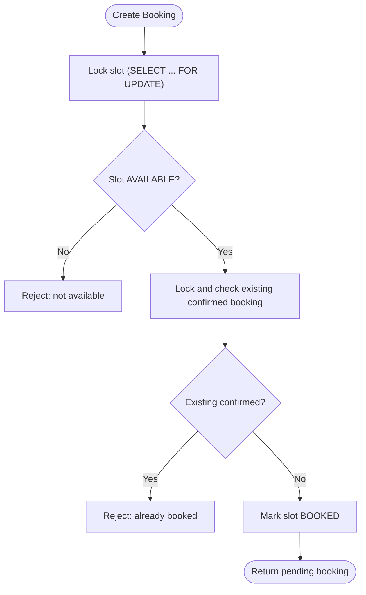
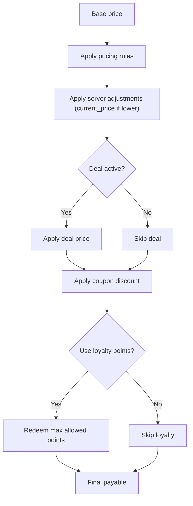
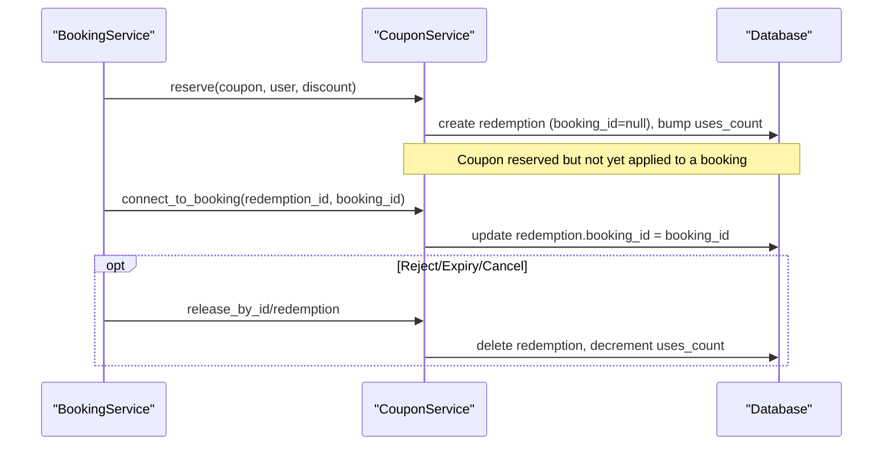
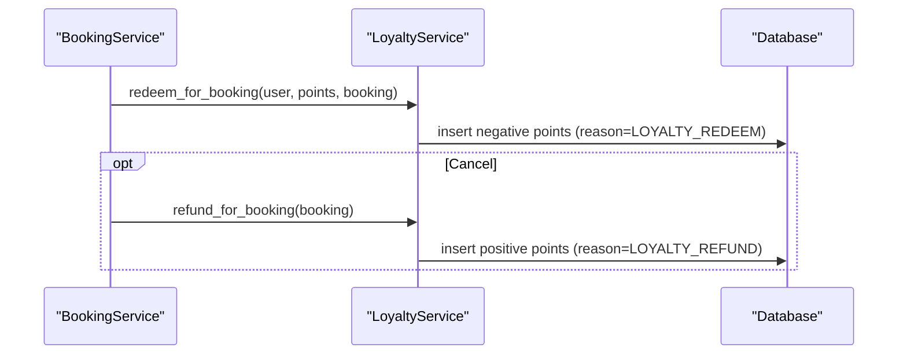
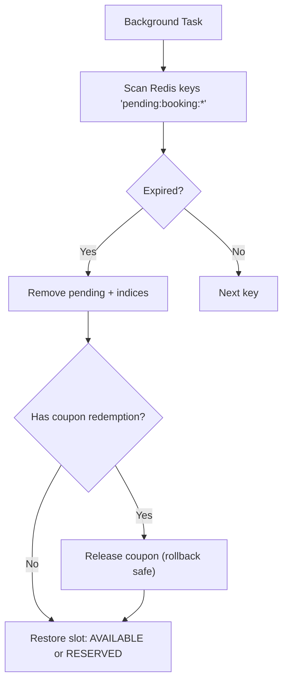
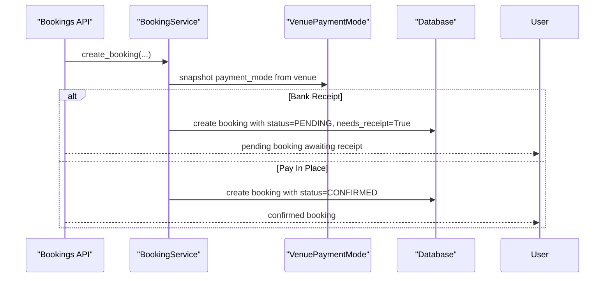
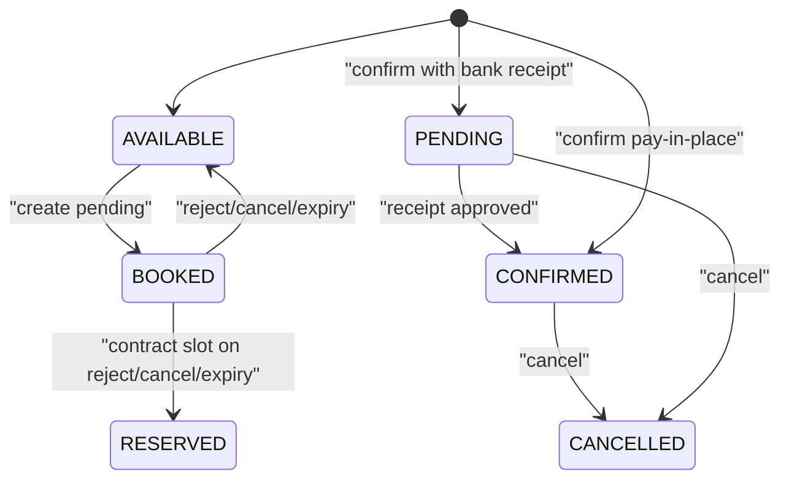
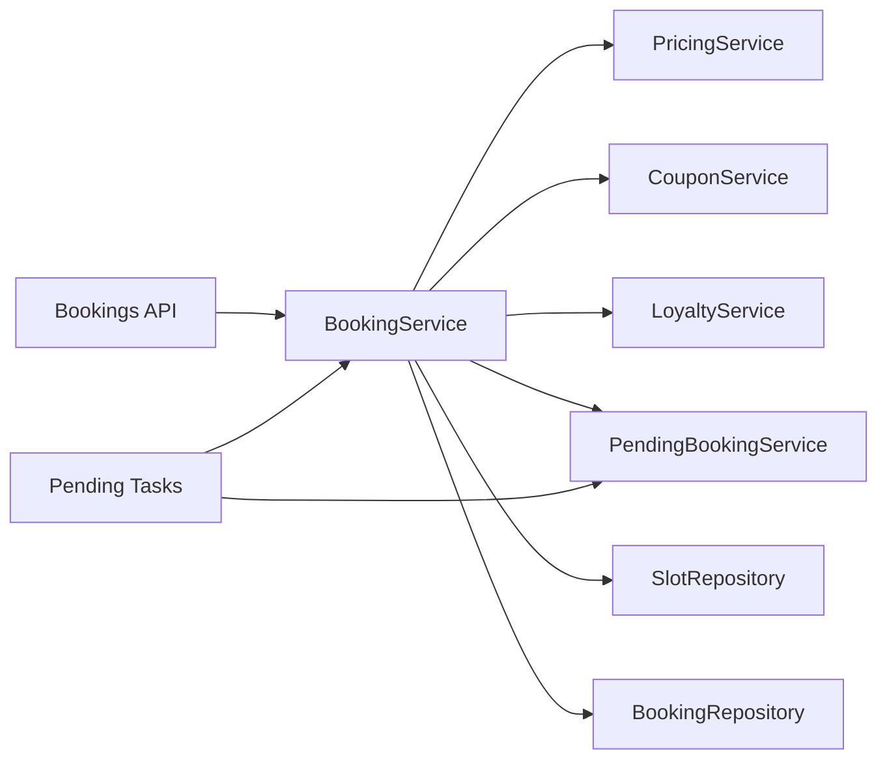

# Pending Booking Workflow

<cite>
**Referenced Files in This Document**
- [bookings.py](file://app/api/v1/bookings.py)
- [booking_service.py](file://app/services/booking_service.py)
- [pending_booking_service.py](file://app/services/pending_booking_service.py)
- [pricing_service.py](file://app/services/pricing_service.py)
- [coupon_service.py](file://app/services/coupon_service.py)
- [loyalty_service.py](file://app/services/loyalty_service.py)
- [slot_repository.py](file://app/repositories/slot_repository.py)
- [booking_repository.py](file://app/repositories/booking_repository.py)
- [booking.py](file://app/models/booking.py)
- [slot.py](file://app/models/slot.py)
- [coupon.py](file://app/models/coupon.py)
- [loyalty.py](file://app/models/loyalty.py)
- [pending_booking_tasks.py](file://app/tasks/pending_booking_tasks.py)
</cite>

## Table of Contents
1. [Introduction](#introduction)
2. [Project Structure](#project-structure)
3. [Core Components](#core-components)
4. [Architecture Overview](#architecture-overview)
5. [Detailed Component Analysis](#detailed-component-analysis)
6. [Dependency Analysis](#dependency-analysis)
7. [Performance Considerations](#performance-considerations)
8. [Troubleshooting Guide](#troubleshooting-guide)
9. [Conclusion](#conclusion)

## Introduction
This document explains the pending booking workflow that allows users to reserve a time slot subject to manager approval before it becomes confirmed. It covers:
- How a user creates a pending booking and how the system locks the slot to prevent race conditions.
- How the pricing engine computes dynamic prices, applies last-minute deals, coupons, and loyalty points.
- How coupon reservation and redemption are tied to the pending-to-confirmed lifecycle.
- How payment modes (bank receipt vs pay-in-place) affect confirmation flow.
- The state transitions from AVAILABLE to BOOKED and then to CONFIRMED or back to AVAILABLE/RESERVED on rejection or expiration.

## Project Structure
The pending booking feature spans API endpoints, services, repositories, models, and background tasks:
- API layer exposes endpoints for creating, listing, confirming, rejecting, and canceling bookings.
- Services orchestrate business logic: pricing, coupon handling, loyalty, and pending storage.
- Repositories implement database access with row-level locking to avoid races.
- Models define entities like Slot, Booking, CouponRedemption, and LoyaltyPoint.
- Background tasks clean up expired pending bookings and restore slots.

**Diagram sources**
- [bookings.py:191-237](file://app/api/v1/bookings.py#L191-L237)
- [booking_service.py:27-109](file://app/services/booking_service.py#L27-L109)
- [pending_booking_service.py:46-77](file://app/services/pending_booking_service.py#L46-L77)
- [pricing_service.py:147-229](file://app/services/pricing_service.py#L147-L229)
- [coupon_service.py:82-113](file://app/services/coupon_service.py#L82-L113)
- [loyalty_service.py:52-64](file://app/services/loyalty_service.py#L52-L64)
- [slot_repository.py:15-18](file://app/repositories/slot_repository.py#L15-L18)
- [booking_repository.py:20-26](file://app/repositories/booking_repository.py#L20-L26)

**Section sources**
- [bookings.py:191-237](file://app/api/v1/bookings.py#L191-L237)
- [booking_service.py:27-109](file://app/services/booking_service.py#L27-L109)
- [pending_booking_service.py:46-77](file://app/services/pending_booking_service.py#L46-L77)
- [pricing_service.py:147-229](file://app/services/pricing_service.py#L147-L229)
- [slot_repository.py:15-18](file://app/repositories/slot_repository.py#L15-L18)
- [booking_repository.py:20-26](file://app/repositories/booking_repository.py#L20-L26)

## Core Components
- PendingBookingService: Stores temporary pending bookings in Redis with TTL, indexes by slot/user/venue, and lists expired entries.
- BookingService: Orchestrates creation, validation, pricing, promotions, and confirmation; uses DB row locks to prevent races.
- PricingService: Computes final price using base price, rules, server adjustments, last-minute deals, coupons, and loyalty points.
- CouponService: Validates coupons, reserves them during pending creation, connects to confirmed booking, and releases on reject/expiry/cancel.
- LoyaltyService: Redeems points at confirmation and refunds on cancellation; append-only ledger ensures auditability.
- Repositories: Provide SELECT ... FOR UPDATE locking on slots and bookings to ensure concurrency safety.

**Section sources**
- [pending_booking_service.py:46-131](file://app/services/pending_booking_service.py#L46-L131)
- [booking_service.py:27-192](file://app/services/booking_service.py#L27-L192)
- [pricing_service.py:44-244](file://app/services/pricing_service.py#L44-L244)
- [coupon_service.py:30-120](file://app/services/coupon_service.py#L30-L120)
- [loyalty_service.py:25-110](file://app/services/loyalty_service.py#L25-L110)
- [slot_repository.py:15-18](file://app/repositories/slot_repository.py#L15-L18)
- [booking_repository.py:20-26](file://app/repositories/booking_repository.py#L20-L26)

## Architecture Overview
The end-to-end flow from user request to manager confirmation:

**Diagram sources**
- [bookings.py:191-237](file://app/api/v1/bookings.py#L191-L237)
- [booking_service.py:27-109](file://app/services/booking_service.py#L27-L109)
- [pricing_service.py:147-229](file://app/services/pricing_service.py#L147-L229)
- [coupon_service.py:82-113](file://app/services/coupon_service.py#L82-L113)
- [loyalty_service.py:52-64](file://app/services/loyalty_service.py#L52-L64)
- [pending_booking_service.py:52-77](file://app/services/pending_booking_service.py#L52-L77)
- [slot_repository.py:15-18](file://app/repositories/slot_repository.py#L15-L18)
- [booking_repository.py:20-26](file://app/repositories/booking_repository.py#L20-L26)

## Detailed Component Analysis

### Slot Reservation and Concurrency Control
- The system prevents double-booking by acquiring exclusive locks on the slot and checking for existing confirmed bookings under lock:
  - Slot lock via `get_by_id_with_lock` uses `SELECT ... FOR UPDATE`.
  - Duplicate check via `get_by_slot_with_lock` also uses `SELECT ... FOR UPDATE`.
- After successful checks, the slot is immediately marked BOOKED to hold it while pending approval.
- If the slot belongs to an active contract, booking is rejected to protect reserved inventory.

**Diagram sources**
- [slot_repository.py:15-18](file://app/repositories/slot_repository.py#L15-L18)
- [booking_repository.py:20-26](file://app/repositories/booking_repository.py#L20-L26)
- [booking_service.py:41-91](file://app/services/booking_service.py#L41-L91)

**Section sources**
- [slot_repository.py:15-18](file://app/repositories/slot_repository.py#L15-L18)
- [booking_repository.py:20-26](file://app/repositories/booking_repository.py#L20-L26)
- [booking_service.py:41-91](file://app/services/booking_service.py#L41-L91)

### Pricing Engine Integration
- Pricing is computed server-side only; client cannot supply price.
- Order of application: base price → pricing rules → server adjustments (current_price) → last-minute deal → coupon → loyalty points → payable.
- The result includes a detailed breakdown for audit and UI display.

**Diagram sources**
- [pricing_service.py:147-229](file://app/services/pricing_service.py#L147-L229)

**Section sources**
- [pricing_service.py:147-229](file://app/services/pricing_service.py#L147-L229)

### Coupon Reservation and Redemption
- During pending creation, if a coupon is used, it is reserved (uses_count incremented, redemption row created with no booking_id).
- On confirm, the redemption is connected to the confirmed booking.
- On reject, expiry, or cancel, the coupon is released (uses_count decremented, redemption deleted), preventing “burning” unused codes.

**Diagram sources**
- [coupon_service.py:82-120](file://app/services/coupon_service.py#L82-L120)
- [booking_service.py:93-116](file://app/services/booking_service.py#L93-L116)
- [booking_service.py:173-176](file://app/services/booking_service.py#L173-L176)

**Section sources**
- [coupon_service.py:82-120](file://app/services/coupon_service.py#L82-L120)
- [booking_service.py:93-116](file://app/services/booking_service.py#L93-L116)
- [booking_service.py:173-176](file://app/services/booking_service.py#L173-L176)

### Loyalty Points Usage
- At confirm time, if loyalty points were used in pricing, they are deducted via an append-only ledger entry linked to the confirmed booking.
- On cancellation, the system refunds the exact points used with a compensating ledger entry.

**Diagram sources**
- [loyalty_service.py:52-75](file://app/services/loyalty_service.py#L52-L75)
- [booking_service.py:178-181](file://app/services/booking_service.py#L178-L181)
- [booking_service.py:212-215](file://app/services/booking_service.py#L212-L215)

**Section sources**
- [loyalty_service.py:52-75](file://app/services/loyalty_service.py#L52-L75)
- [booking_service.py:178-181](file://app/services/booking_service.py#L178-L181)
- [booking_service.py:212-215](file://app/services/booking_service.py#L212-L215)

### Pending Storage and Expiration Handling
- Pending bookings are stored in Redis with a TTL. Each pending record indexes by slot, venue, and user for quick lookup.
- A background task periodically scans for expired pending records, removes them, releases any reserved coupons, and restores the slot status (to AVAILABLE or RESERVED for contract slots).

**Diagram sources**
- [pending_booking_tasks.py:12-41](file://app/tasks/pending_booking_tasks.py#L12-L41)
- [pending_booking_service.py:113-128](file://app/services/pending_booking_service.py#L113-L128)
- [booking_service.py:111-116](file://app/services/booking_service.py#L111-L116)

**Section sources**
- [pending_booking_tasks.py:12-41](file://app/tasks/pending_booking_tasks.py#L12-L41)
- [pending_booking_service.py:113-128](file://app/services/pending_booking_service.py#L113-L128)
- [booking_service.py:111-116](file://app/services/booking_service.py#L111-L116)

### Payment Mode Handling
- At booking creation, the venue’s payment mode is snapshot into the pending record.
- If the mode is bank receipt, the confirmed booking starts in PENDING until the manager approves the submitted receipt.
- For pay-in-place, managers can collect payment and mark the booking confirmed.

**Diagram sources**
- [booking_service.py:69-88](file://app/services/booking_service.py#L69-L88)
- [booking_service.py:149-171](file://app/services/booking_service.py#L149-L171)
- [bookings.py:454-528](file://app/api/v1/bookings.py#L454-L528)

**Section sources**
- [booking_service.py:69-88](file://app/services/booking_service.py#L69-L88)
- [booking_service.py:149-171](file://app/services/booking_service.py#L149-L171)
- [bookings.py:454-528](file://app/api/v1/bookings.py#L454-L528)

### State Transitions
- Slot states:
  - AVAILABLE → BOOKED on pending creation.
  - BOOKED → AVAILABLE (or RESERVED for contract slots) on reject, cancel, or expiry.
- Booking states:
  - PENDING (for bank receipt) → CONFIRMED after receipt approval.
  - CONFIRMED (pay-in-place) directly upon confirm.
  - Any non-final state can transition to CANCELLED when canceled by user or manager action.

**Diagram sources**
- [slot.py:6-11](file://app/models/slot.py#L6-L11)
- [booking.py:7-11](file://app/models/booking.py#L7-L11)
- [booking_service.py:90-91](file://app/services/booking_service.py#L90-L91)
- [booking_service.py:159-171](file://app/services/booking_service.py#L159-L171)
- [pending_booking_tasks.py:30-37](file://app/tasks/pending_booking_tasks.py#L30-L37)

**Section sources**
- [slot.py:6-11](file://app/models/slot.py#L6-L11)
- [booking.py:7-11](file://app/models/booking.py#L7-L11)
- [booking_service.py:90-91](file://app/services/booking_service.py#L90-L91)
- [booking_service.py:159-171](file://app/services/booking_service.py#L159-L171)
- [pending_booking_tasks.py:30-37](file://app/tasks/pending_booking_tasks.py#L30-L37)

## Dependency Analysis
Key dependencies and coupling:
- API depends on BookingService for all booking operations.
- BookingService depends on:
  - PricingService for price computation.
  - CouponService for validation/reservation/release.
  - LoyaltyService for point redemption/refund.
  - PendingBookingService for Redis-based pending storage.
  - SlotRepository and BookingRepository for locked reads/writes.
- PendingBookingService depends on Redis configuration.
- Background tasks depend on PendingBookingService and BookingService to safely restore slots and release promotions.

**Diagram sources**
- [bookings.py:191-237](file://app/api/v1/bookings.py#L191-L237)
- [booking_service.py:27-192](file://app/services/booking_service.py#L27-L192)
- [pending_booking_tasks.py:12-41](file://app/tasks/pending_booking_tasks.py#L12-L41)

**Section sources**
- [bookings.py:191-237](file://app/api/v1/bookings.py#L191-L237)
- [booking_service.py:27-192](file://app/services/booking_service.py#L27-L192)
- [pending_booking_tasks.py:12-41](file://app/tasks/pending_booking_tasks.py#L12-L41)

## Performance Considerations
- Row-level locking (SELECT ... FOR UPDATE) serializes concurrent attempts on the same slot, avoiding race conditions at the cost of brief contention.
- Redis-based pending storage reduces database load during the approval window and supports fast indexing by slot/user/venue.
- Pricing computation runs per request; caching pricing rules or results could be considered if rule changes are infrequent.
- Batch enrichment of venue/slot data in API responses avoids N+1 queries.

[No sources needed since this section provides general guidance]

## Troubleshooting Guide
Common issues and resolutions:
- “Slot is already pending confirmation”: Another pending exists for the same slot; wait for expiry or ask the user to cancel their pending.
- “Slot already booked”: A confirmed booking exists; verify with repository lock query.
- “Slot is no longer held for this booking”: Slot was released due to expiry or manual action; re-check availability.
- “This slot is part of an active contract”: Contract-protected slots cannot be booked; coordinate with contract management.
- Coupon errors: Invalid, inactive, expired, venue-mismatched, or exceeded usage limits; validate before submission.
- Insufficient loyalty points: Ensure user has enough balance; adjust points or reduce redemption.

**Section sources**
- [booking_service.py:46-67](file://app/services/booking_service.py#L46-L67)
- [booking_service.py:123-147](file://app/services/booking_service.py#L123-L147)
- [coupon_service.py:34-72](file://app/services/coupon_service.py#L34-L72)
- [loyalty_service.py:52-64](file://app/services/loyalty_service.py#L52-L64)

## Conclusion
The pending booking workflow combines robust concurrency controls, dynamic pricing, and flexible payment modes to deliver a reliable booking experience. By locking slots at the database level, storing pending approvals in Redis, and integrating coupon and loyalty systems atomically, the system ensures fairness, accuracy, and auditability throughout the lifecycle from creation to confirmation or rollback.

[No sources needed since this section summarizes without analyzing specific files]