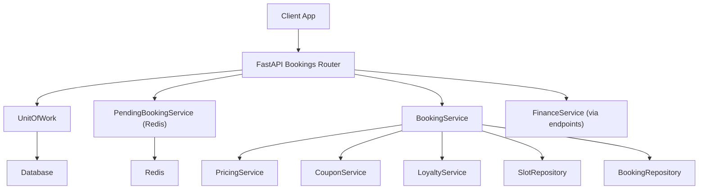
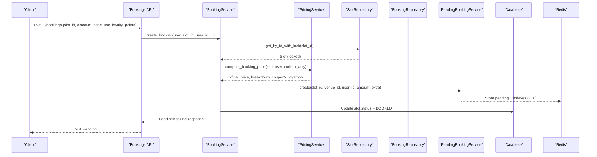
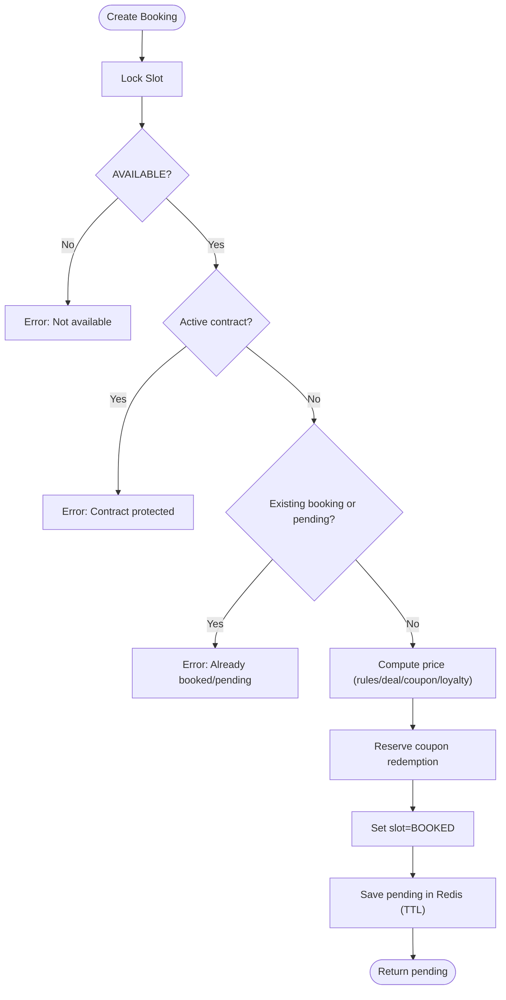
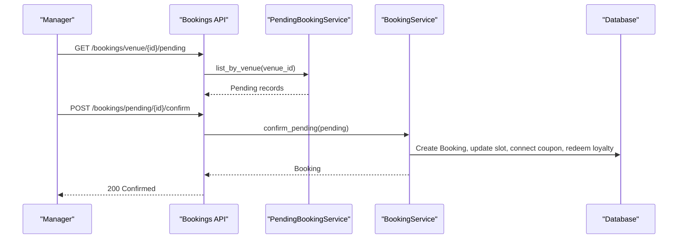
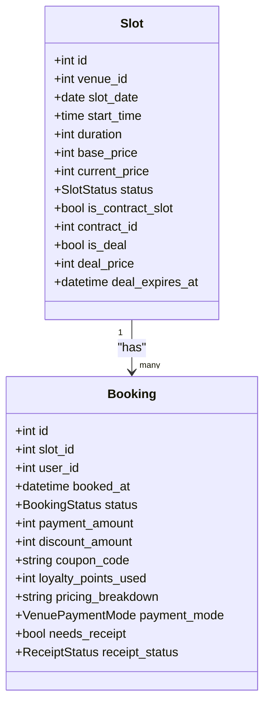
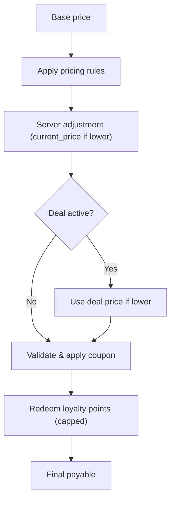
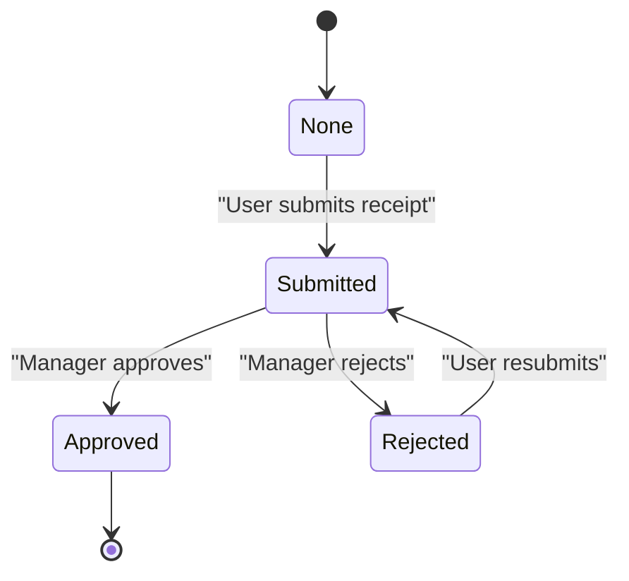
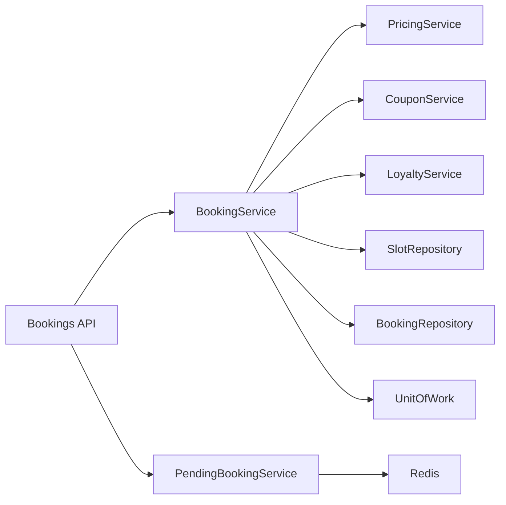

# Booking System

<cite>
**Referenced Files in This Document**
- [bookings.py](file://app/api/v1/bookings.py)
- [booking_service.py](file://app/services/booking_service.py)
- [pending_booking_service.py](file://app/services/pending_booking_service.py)
- [pricing_service.py](file://app/services/pricing_service.py)
- [coupon_service.py](file://app/services/coupon_service.py)
- [loyalty_service.py](file://app/services/loyalty_service.py)
- [unit_of_work.py](file://app/unit_of_work.py)
- [slot_repository.py](file://app/repositories/slot_repository.py)
- [booking_repository.py](file://app/repositories/booking_repository.py)
- [booking.py](file://app/models/booking.py)
- [slot.py](file://app/models/slot.py)
- [contract.py](file://app/models/contract.py)
- [payment.py](file://app/models/payment.py)
- [booking_schemas.py](file://app/schemas/booking.py)
</cite>

## Table of Contents
1. Introduction
2. Project Structure
3. Core Components
4. Architecture Overview
5. Detailed Component Analysis
6. Dependency Analysis
7. Performance Considerations
8. Troubleshooting Guide
9. Conclusion

## Introduction
This document explains the Booking System module end-to-end: from slot availability checks to confirmation, including pending approval, database locking for concurrency safety, pricing engine integration, coupon and loyalty handling, payment modes and receipt processing, contract slot protection, deal slots, Unit of Work boundaries, transaction semantics, and error handling. It also provides common scenario walkthroughs such as last-minute deals, contract-protected slots, and concurrent booking prevention.

## Project Structure
The Booking System spans API endpoints, services, repositories, models, and supporting utilities:
- API layer exposes endpoints for creating, listing, confirming, rejecting, canceling bookings, and handling receipts/in-person payments.
- Services implement business logic: booking lifecycle, pending approvals, pricing computation, coupons, loyalty, and finance interactions.
- Repositories encapsulate data access with locking and queries.
- Models define domain entities (Booking, Slot, Contract, Payment).
- Unit of Work coordinates sessions and repositories within a single transactional boundary.

**Diagram sources**
- [bookings.py:191-237](file://app/api/v1/bookings.py#L191-L237)
- [booking_service.py:27-109](file://app/services/booking_service.py#L27-L109)
- [pending_booking_service.py:46-77](file://app/services/pending_booking_service.py#L46-L77)
- [pricing_service.py:147-229](file://app/services/pricing_service.py#L147-L229)
- [coupon_service.py:34-72](file://app/services/coupon_service.py#L34-L72)
- [loyalty_service.py:53-64](file://app/services/loyalty_service.py#L53-L64)
- [slot_repository.py:15-18](file://app/repositories/slot_repository.py#L15-L18)
- [booking_repository.py:20-26](file://app/repositories/booking_repository.py#L20-L26)
- [unit_of_work.py:44-68](file://app/unit_of_work.py#L44-L68)

**Section sources**
- [bookings.py:191-237](file://app/api/v1/bookings.py#L191-L237)
- [unit_of_work.py:44-68](file://app/unit_of_work.py#L44-L68)

## Core Components
- BookingService: Orchestrates create, confirm, cancel; enforces slot status, contract protection, pricing, coupons, loyalty, and deal handling.
- PendingBookingService: Manages short-lived pending reservations in Redis with TTL and indexes by slot/venue/user.
- PricingService: Server-authoritative price computation applying base price, rules, server adjustments, deals, coupons, and loyalty points.
- CouponService: Validates coupons, reserves redemptions during pending creation, connects to confirmed bookings, and releases on rejection/cancellation/expiry.
- LoyaltyService: Redeems points at confirmation and refunds on cancellation; integrates with pricing max redemption cap.
- Repositories: Provide locked reads/writes for slots and bookings to prevent race conditions.
- Unit of Work: Provides session-scoped transactions and repository accessors.

**Section sources**
- [booking_service.py:27-192](file://app/services/booking_service.py#L27-L192)
- [pending_booking_service.py:46-131](file://app/services/pending_booking_service.py#L46-L131)
- [pricing_service.py:147-229](file://app/services/pricing_service.py#L147-L229)
- [coupon_service.py:34-120](file://app/services/coupon_service.py#L34-L120)
- [loyalty_service.py:53-75](file://app/services/loyalty_service.py#L53-L75)
- [slot_repository.py:15-18](file://app/repositories/slot_repository.py#L15-L18)
- [booking_repository.py:20-26](file://app/repositories/booking_repository.py#L20-L26)
- [unit_of_work.py:44-68](file://app/unit_of_work.py#L44-L68)

## Architecture Overview
The booking flow uses a two-phase approach:
1) Create a pending reservation:
   - Lock the slot and validate availability and contract protection.
   - Compute final price via PricingService (base → rules → server adjustments → deal → coupon → loyalty).
   - Reserve coupon redemption immediately to prevent double-use.
   - Mark slot BOOKED and store pending in Redis with TTL.
2) Confirm or reject:
   - Manager confirms: persist Booking, connect coupon redemption, redeem loyalty points, remove deal flags if used, clear pending.
   - Reject or expire: release slot back to AVAILABLE or RESERVED (for contracts), release coupon redemption.

**Diagram sources**
- [bookings.py:191-237](file://app/api/v1/bookings.py#L191-L237)
- [booking_service.py:27-109](file://app/services/booking_service.py#L27-L109)
- [pricing_service.py:147-229](file://app/services/pricing_service.py#L147-L229)
- [pending_booking_service.py:52-77](file://app/services/pending_booking_service.py#L52-L77)
- [slot_repository.py:15-18](file://app/repositories/slot_repository.py#L15-L18)

**Section sources**
- [bookings.py:191-237](file://app/api/v1/bookings.py#L191-L237)
- [booking_service.py:27-109](file://app/services/booking_service.py#L27-L109)

## Detailed Component Analysis

### Booking Lifecycle: Create, Approve, Cancel
- Create:
  - Lock slot, verify not RESERVED and is AVAILABLE.
  - Enforce contract protection: active contract slots cannot be booked.
  - Check duplicate booking and existing pending for the same slot.
  - Snapshot venue payment mode and compute price.
  - Reserve coupon redemption (if any).
  - Set slot to BOOKED and store pending in Redis with TTL.
- Confirm:
  - Re-check slot still BOOKED and no confirmed booking exists.
  - Enforce contract protection again.
  - Persist Booking with correct status (PENDING for bank receipt, CONFIRMED otherwise).
  - Connect coupon redemption to booking and redeem loyalty points.
  - If deal was applied, mark slot as no longer a deal.
  - Remove pending from Redis.
- Cancel:
  - Allow cancellation for CONFIRMED or PENDING bookings.
  - Restore slot to AVAILABLE or RESERVED (for contract slots).
  - Release coupon redemption and refund loyalty points.

**Diagram sources**
- [booking_service.py:27-109](file://app/services/booking_service.py#L27-L109)
- [slot_repository.py:15-18](file://app/repositories/slot_repository.py#L15-L18)
- [pricing_service.py:147-229](file://app/services/pricing_service.py#L147-L229)
- [coupon_service.py:82-95](file://app/services/coupon_service.py#L82-L95)

**Section sources**
- [booking_service.py:27-192](file://app/services/booking_service.py#L27-L192)
- [bookings.py:191-237](file://app/api/v1/bookings.py#L191-L237)

### Pending Approval Workflow
- Managers list pending bookings per venue.
- Confirm endpoint validates permissions, calls service to finalize, commits transaction, and notifies user.
- Reject endpoint removes pending, restores slot appropriately, releases promotions, and notifies user.
- User can cancel their own pending before manager approval.

**Diagram sources**
- [bookings.py:85-131](file://app/api/v1/bookings.py#L85-L131)
- [booking_service.py:119-192](file://app/services/booking_service.py#L119-L192)
- [pending_booking_service.py:97-111](file://app/services/pending_booking_service.py#L97-L111)

**Section sources**
- [bookings.py:85-161](file://app/api/v1/bookings.py#L85-L161)
- [booking_service.py:119-192](file://app/services/booking_service.py#L119-L192)

### Slot Status Management and Concurrency Control
- States: AVAILABLE, BOOKED, BLOCKED, IN_COMPETITION, RESERVED.
- RESERVED is used for contract-protected slots; when canceled/rejected, contract slots revert to RESERVED rather than AVAILABLE.
- Database-level row locks:
  - Slot lock: SELECT ... FOR UPDATE on slot read to prevent races.
  - Booking lock: SELECT ... FOR UPDATE on booking by slot to prevent double confirmation.
- Availability checks include time conflict detection and competition/blocking states.

**Diagram sources**
- [slot.py:6-42](file://app/models/slot.py#L6-L42)
- [booking.py:7-51](file://app/models/booking.py#L7-L51)

**Section sources**
- [slot_repository.py:15-18](file://app/repositories/slot_repository.py#L15-L18)
- [booking_repository.py:20-26](file://app/repositories/booking_repository.py#L20-L26)
- [booking_service.py:41-67](file://app/services/booking_service.py#L41-L67)
- [booking_service.py:128-147](file://app/services/booking_service.py#L128-L147)

### Pricing Engine Integration
- Server-authoritative computation ensures clients never supply prices.
- Order: base price → pricing rules → server adjustments (current_price if lower) → deal (if active) → coupon → loyalty points → final payable.
- Breakdown is persisted for auditability and refunds.
- Max loyalty redemption capped by configuration percentage and per-point value.

**Diagram sources**
- [pricing_service.py:147-229](file://app/services/pricing_service.py#L147-L229)
- [coupon_service.py:34-72](file://app/services/coupon_service.py#L34-L72)
- [loyalty_service.py:53-64](file://app/services/loyalty_service.py#L53-L64)

**Section sources**
- [pricing_service.py:147-229](file://app/services/pricing_service.py#L147-L229)

### Coupon Redemption During Booking Creation
- Validation includes code existence, activation, venue scope, date range, usage limits, per-user limits, minimum booking amount, and non-zero discount.
- Reservation occurs during pending creation to prevent concurrent reuse.
- On confirm, redemption is linked to the booking; on reject/cancel/expiry, redemption is released and uses_count decremented.

**Section sources**
- [coupon_service.py:34-120](file://app/services/coupon_service.py#L34-L120)
- [booking_service.py:93-109](file://app/services/booking_service.py#L93-L109)
- [booking_service.py:112-117](file://app/services/booking_service.py#L112-L117)

### Payment Mode Integration and Receipt Processing
- Venue snapshot of payment mode is stored at booking creation time.
- Bank receipt flow:
  - Booking created with status PENDING and needs_receipt=true.
  - User submits receipt image/reference/bank info; status moves to SUBMITTED.
  - Manager approves: record income via FinanceService, set receipt APPROVED, move booking to CONFIRMED.
  - Manager rejects: set REJECTED with reason; user may resubmit.
- In-person payment:
  - Staff collects payment and marks booking CONFIRMED; records income via FinanceService.

**Diagram sources**
- [bookings.py:454-510](file://app/api/v1/bookings.py#L454-L510)
- [booking.py:14-49](file://app/models/booking.py#L14-L49)

**Section sources**
- [bookings.py:454-529](file://app/api/v1/bookings.py#L454-L529)
- [booking.py:14-49](file://app/models/booking.py#L14-L49)

### Unit of Work Pattern, Transaction Boundaries, Error Handling
- Unit of Work wraps a SQLAlchemy Session and lazily provides repositories.
- Context manager auto-commits on success and rolls back on exceptions; finally closes session.
- API endpoints typically call uow.commit() after successful operations; errors raise HTTPException with appropriate codes.
- Locking prevents race conditions; validation guards ensure consistent state transitions.

**Section sources**
- [unit_of_work.py:44-68](file://app/unit_of_work.py#L44-L68)
- [bookings.py:191-237](file://app/api/v1/bookings.py#L191-L237)
- [bookings.py:349-426](file://app/api/v1/bookings.py#L349-L426)

### Common Scenarios

#### Last-Minute Deals
- If a slot has an active deal (is_deal and deal_price within expiry), PricingService applies it only if lower than post-rule price.
- Upon confirmation, deal flags are cleared so the slot exits the deal pool.

**Section sources**
- [pricing_service.py:179-188](file://app/services/pricing_service.py#L179-L188)
- [booking_service.py:183-189](file://app/services/booking_service.py#L183-L189)

#### Contract-Protected Slots
- Active contract slots are marked is_contract_slot and cannot be booked by general users.
- On cancel/reject, contract slots revert to RESERVED instead of AVAILABLE to preserve contract inventory.

**Section sources**
- [booking_service.py:54-59](file://app/services/booking_service.py#L54-L59)
- [booking_service.py:207-209](file://app/services/booking_service.py#L207-L209)
- [contract.py:29-40](file://app/models/contract.py#L29-L40)

#### Concurrent Booking Prevention
- Row-level locks on slot and booking reads prevent double booking and double confirmation.
- Pending index in Redis prevents multiple pending entries for the same slot.

**Section sources**
- [slot_repository.py:15-18](file://app/repositories/slot_repository.py#L15-L18)
- [booking_repository.py:20-26](file://app/repositories/booking_repository.py#L20-L26)
- [pending_booking_service.py:48-50](file://app/services/pending_booking_service.py#L48-L50)

## Dependency Analysis
Key dependencies and coupling:
- API depends on services for orchestration and on Unit of Work for transactions.
- BookingService depends on PricingService, CouponService, LoyaltyService, and repositories.
- PendingBookingService depends on Redis for temporary storage and TTL management.
- Models define relationships between Slot, Booking, Contract, and Payment.

**Diagram sources**
- [bookings.py:191-237](file://app/api/v1/bookings.py#L191-L237)
- [booking_service.py:27-109](file://app/services/booking_service.py#L27-L109)
- [pending_booking_service.py:46-77](file://app/services/pending_booking_service.py#L46-L77)
- [unit_of_work.py:44-68](file://app/unit_of_work.py#L44-L68)

**Section sources**
- [bookings.py:191-237](file://app/api/v1/bookings.py#L191-L237)
- [booking_service.py:27-109](file://app/services/booking_service.py#L27-L109)

## Performance Considerations
- Use database row locks only around critical sections (slot and booking reads) to minimize contention.
- Batch enrichment of venue/slot data in API responses to avoid N+1 queries.
- Keep pending records short-lived with TTL to limit Redis memory usage.
- Avoid client-side price calculations; server-side computation centralizes logic and reduces rework.

[No sources needed since this section provides general guidance]

## Troubleshooting Guide
Common issues and resolutions:
- Slot not found or already booked: Ensure slot exists and is AVAILABLE; check for existing confirmed booking or pending reservation.
- Contract-protected slot: Verify contract status; active contracts block public booking.
- Coupon invalid or expired: Validate code, dates, venue scope, usage limits, and minimum booking amount.
- Insufficient loyalty points: Check user balance and configured caps.
- Receipt workflow stuck: Confirm receipt submission and manager approval steps; ensure payment mode matches expected flow.

**Section sources**
- [booking_service.py:41-67](file://app/services/booking_service.py#L41-L67)
- [booking_service.py:128-147](file://app/services/booking_service.py#L128-L147)
- [coupon_service.py:34-72](file://app/services/coupon_service.py#L34-L72)
- [loyalty_service.py:53-64](file://app/services/loyalty_service.py#L53-L64)
- [bookings.py:454-510](file://app/api/v1/bookings.py#L454-L510)

## Conclusion
The Booking System implements a robust, secure, and scalable booking lifecycle using a two-phase pending model, strict concurrency controls, authoritative server-side pricing, and comprehensive integrations for coupons, loyalty, and payments. Contract slot protection and deal handling ensure business rules are enforced consistently. The Unit of Work pattern guarantees transactional integrity across all related writes, while clear error handling and notifications keep users and managers informed throughout the process.

[No sources needed since this section summarizes without analyzing specific files]