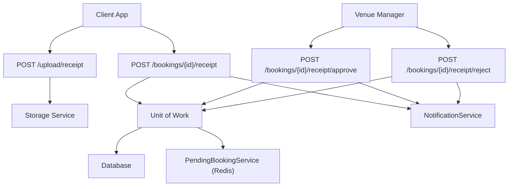
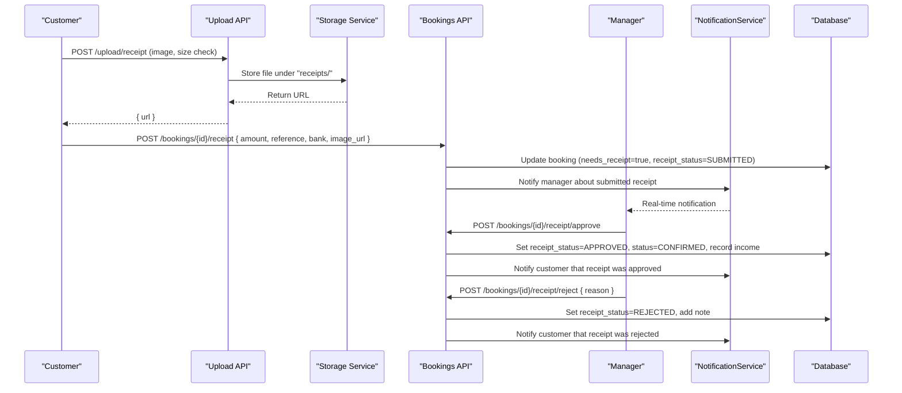
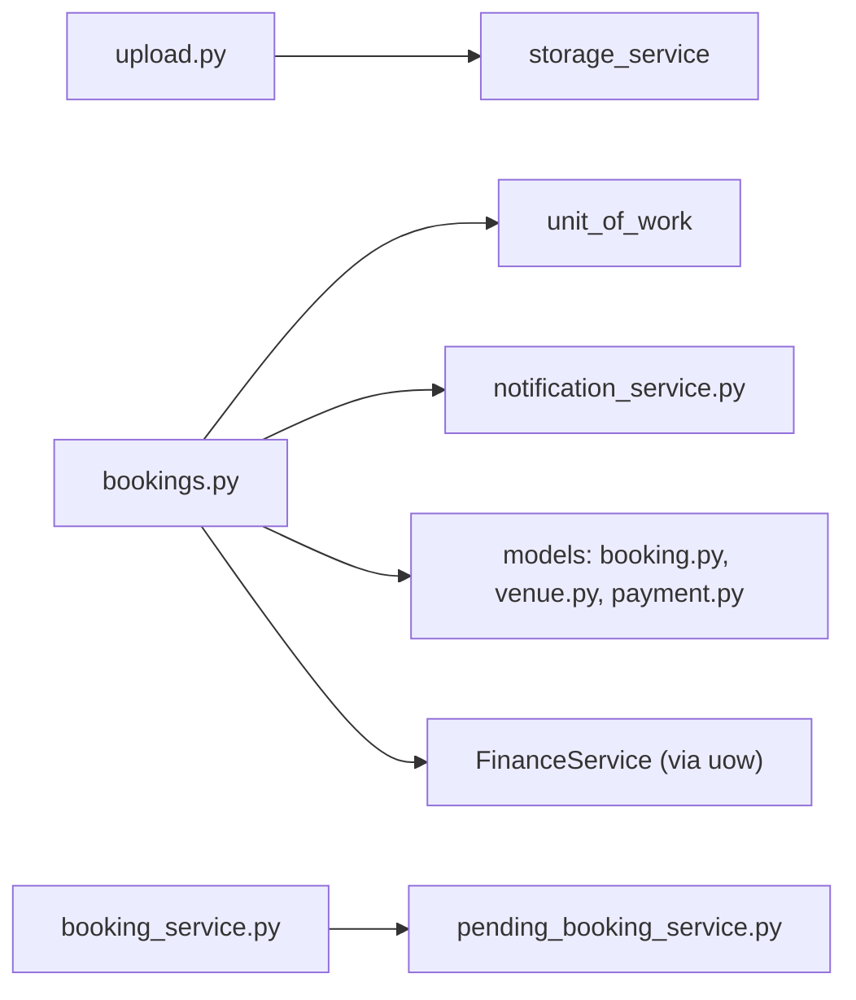

# Bank Receipt Upload & Verification

<cite>
**Referenced Files in This Document**
- [bookings.py](file://app/api/v1/bookings.py)
- [upload.py](file://app/api/v1/upload.py)
- [booking_service.py](file://app/services/booking_service.py)
- [pending_booking_service.py](file://app/services/pending_booking_service.py)
- [notification_service.py](file://app/services/notification_service.py)
- [payment.py](file://app/models/payment.py)
- [booking.py](file://app/models/booking.py)
- [venue.py](file://app/models/venue.py)
- [payments.py](file://app/api/v1/payments.py)
</cite>

## Table of Contents
1. [Introduction](#introduction)
2. [Project Structure](#project-structure)
3. [Core Components](#core-components)
4. [Architecture Overview](#architecture-overview)
5. [Detailed Component Analysis](#detailed-component-analysis)
6. [Dependency Analysis](#dependency-analysis)
7. [Performance Considerations](#performance-considerations)
8. [Troubleshooting Guide](#troubleshooting-guide)
9. [Conclusion](#conclusion)

## Introduction
This document explains the end-to-end bank receipt upload and verification workflow for venue bookings. It covers:
- How customers upload a bank transfer receipt image and metadata
- Validation rules for file format, size, and security
- How bookings remain in PENDING until a venue manager approves the receipt
- The administrative review flow (approve/reject), including notifications to both customers and managers
- Error handling for invalid files, failed uploads, and expired pending submissions

The system supports multiple payment modes per venue; when a venue uses bank receipts, bookings are created with a PENDING status until the receipt is verified.

## Project Structure
The workflow spans API endpoints, services, models, and storage:
- API layer exposes endpoints for uploading receipts and managing booking receipts
- Services enforce business rules, manage pending bookings in Redis, and persist state changes
- Models define enums and fields for payment modes, booking statuses, and receipt lifecycle
- Storage service handles secure uploads to object storage

**Diagram sources**
- [upload.py:53-71](file://app/api/v1/upload.py#L53-L71)
- [bookings.py:454-510](file://app/api/v1/bookings.py#L454-L510)
- [booking_service.py:119-192](file://app/services/booking_service.py#L119-L192)
- [pending_booking_service.py:46-131](file://app/services/pending_booking_service.py#L46-L131)
- [notification_service.py:50-105](file://app/services/notification_service.py#L50-L105)

**Section sources**
- [upload.py:12-20](file://app/api/v1/upload.py#L12-L20)
- [bookings.py:437-529](file://app/api/v1/bookings.py#L437-L529)
- [booking_service.py:27-109](file://app/services/booking_service.py#L27-L109)
- [pending_booking_service.py:18-131](file://app/services/pending_booking_service.py#L18-L131)
- [notification_service.py:12-105](file://app/services/notification_service.py#L12-L105)

## Core Components
- File upload endpoint: Validates allowed MIME types and maximum file size, then stores the file and returns a URL.
- Booking receipt submission: Associates an uploaded receipt URL with a booking, sets receipt status to SUBMITTED, and notifies the venue manager.
- Receipt approval: Converts a PENDING booking to CONFIRMED, records income, updates receipt status to APPROVED, and notifies the customer.
- Receipt rejection: Marks receipt as REJECTED with a reason, allowing the customer to resubmit.
- Payment mode enforcement: When a venue’s payment mode is BANK_RECEIPT, confirmed bookings remain in PENDING until receipt approval.
- Pending booking management: Temporary reservation held in Redis until manager confirmation or expiration.

**Section sources**
- [upload.py:53-71](file://app/api/v1/upload.py#L53-L71)
- [bookings.py:454-510](file://app/api/v1/bookings.py#L454-L510)
- [booking_service.py:119-192](file://app/services/booking_service.py#L119-L192)
- [venue.py:10-14](file://app/models/venue.py#L10-L14)
- [booking.py:7-18](file://app/models/booking.py#L7-L18)

## Architecture Overview
The bank receipt workflow integrates three main phases:
1. Upload and associate receipt with a booking
2. Manager review (approve or reject)
3. State transitions and notifications

**Diagram sources**
- [upload.py:53-71](file://app/api/v1/upload.py#L53-L71)
- [bookings.py:454-510](file://app/api/v1/bookings.py#L454-L510)
- [notification_service.py:50-105](file://app/services/notification_service.py#L50-L105)

## Detailed Component Analysis

### Receipt Upload Endpoint
- Allowed formats: JPEG, PNG, WebP, GIF
- Maximum size: 5 MB per file
- Security: Content type validation and size checks before storage
- Storage path prefix: "receipts/"
- Returns: A signed/public URL for the stored receipt

Error handling:
- Invalid content type: 400 Bad Request
- Exceeds size limit: 400 Bad Request
- Storage failure: 503 Service Unavailable

**Section sources**
- [upload.py:12-20](file://app/api/v1/upload.py#L12-L20)
- [upload.py:53-71](file://app/api/v1/upload.py#L53-L71)

### Submit Booking Receipt
- Prerequisites:
  - Booking must belong to the current user
  - Venue payment mode must be BANK_RECEIPT
  - Booking must not already be paid or previously advanced
- Updates:
  - needs_receipt = true
  - receipt_status = SUBMITTED
  - Stores amount, reference number, bank name, and image URL
  - Sets submission timestamp
- Notifications:
  - Sends a real-time notification to the venue manager about the new receipt submission

Error handling:
- Unauthorized access: 403 Forbidden
- Wrong payment mode: 400 Bad Request
- Already paid: 400 Bad Request

**Section sources**
- [bookings.py:454-473](file://app/api/v1/bookings.py#L454-L473)

### Approve Receipt (Manager)
- Permissions: Requires venue-level finance permission
- Pre-checks:
  - Receipt must be in SUBMITTED state
  - Booking must not already be paid
- Actions:
  - Records income via FinanceService with idempotency key
  - Sets receipt_status = APPROVED
  - Sets booking status = CONFIRMED
  - Captures transaction ID from receipt reference or generated value
  - Notifies the customer that their receipt was approved

Error handling:
- Missing booking: 404 Not Found
- Not submitted: 400 Bad Request
- Already paid: 400 Bad Request

**Section sources**
- [bookings.py:475-495](file://app/api/v1/bookings.py#L475-L495)

### Reject Receipt (Manager)
- Permissions: Requires venue-level finance permission
- Pre-checks:
  - Receipt must be in SUBMITTED state
- Actions:
  - Sets receipt_status = REJECTED
  - Stores review note (reason)
  - Notifies the customer with the rejection reason

Error handling:
- Missing booking: 404 Not Found
- Not submitted: 400 Bad Request

**Section sources**
- [bookings.py:497-510](file://app/api/v1/bookings.py#L497-L510)

### Pending Booking State Management
- When a venue uses BANK_RECEIPT, confirm_pending creates a booking with status PENDING until receipt approval.
- Pending reservations are temporarily held in Redis to prevent double booking while awaiting manager action.
- If a pending booking expires, it is removed and the slot becomes available again.

Key behaviors:
- Slot is marked BOOKED during pending to block other users
- Coupon and loyalty points are reserved and later connected or released based on outcome
- On expiry or cancellation, promotions are released and slots restored

**Section sources**
- [booking_service.py:27-109](file://app/services/booking_service.py#L27-L109)
- [booking_service.py:119-192](file://app/services/booking_service.py#L119-L192)
- [pending_booking_service.py:46-131](file://app/services/pending_booking_service.py#L46-L131)

### Data Model and Enums
- VenuePaymentMode: Supports GATEWAY, BANK_RECEIPT, PAY_IN_PLACE
- BookingStatus: PENDING, CONFIRMED, CANCELLED, COMPLETED
- ReceiptStatus: NONE, SUBMITTED, APPROVED, REJECTED
- BookingPaymentStatus: PENDING, PAID, FAILED, REFUNDED

These enums drive state transitions and UI states across the application.

**Section sources**
- [venue.py:10-14](file://app/models/venue.py#L10-L14)
- [booking.py:7-18](file://app/models/booking.py#L7-L18)
- [payment.py:7-12](file://app/models/payment.py#L7-L12)

### Notification System
- Real-time notifications are persisted to the database and delivered via WebSocket
- Types include receipt submission, approval, and rejection
- Managers receive immediate alerts when a receipt is submitted
- Customers receive updates on approval or rejection outcomes

**Section sources**
- [notification_service.py:50-105](file://app/services/notification_service.py#L50-L105)
- [bookings.py:467-473](file://app/api/v1/bookings.py#L467-L473)
- [bookings.py:492-495](file://app/api/v1/bookings.py#L492-L495)
- [bookings.py:507-510](file://app/api/v1/bookings.py#L507-L510)

### Online Payments vs Bank Receipts
- For GATEWAY payments, the system simulates card-based payment and records income immediately
- For BANK_RECEIPT, income is recorded only after manager approval
- Both flows use idempotency keys to prevent duplicate financial entries

**Section sources**
- [payments.py:81-162](file://app/api/v1/payments.py#L81-L162)
- [bookings.py:483-490](file://app/api/v1/bookings.py#L483-L490)

## Dependency Analysis

**Diagram sources**
- [upload.py:53-71](file://app/api/v1/upload.py#L53-L71)
- [bookings.py:454-510](file://app/api/v1/bookings.py#L454-L510)
- [booking_service.py:119-192](file://app/services/booking_service.py#L119-L192)
- [pending_booking_service.py:46-131](file://app/services/pending_booking_service.py#L46-L131)
- [notification_service.py:50-105](file://app/services/notification_service.py#L50-L105)

**Section sources**
- [bookings.py:454-510](file://app/api/v1/bookings.py#L454-L510)
- [booking_service.py:119-192](file://app/services/booking_service.py#L119-L192)
- [pending_booking_service.py:46-131](file://app/services/pending_booking_service.py#L46-L131)

## Performance Considerations
- File uploads: Validate content type and size before reading full payload into memory where possible; enforce strict limits to avoid large allocations
- Storage: Use streaming or chunked uploads if supported by client to reduce memory pressure
- Database writes: Batch updates within unit-of-work transactions to minimize round-trips
- Redis usage: Keep pending bookings short-lived with TTL to free resources promptly
- Notifications: Persist first, then broadcast to ensure durability even if WebSocket delivery fails

[No sources needed since this section provides general guidance]

## Troubleshooting Guide
Common issues and resolutions:
- Invalid file format: Ensure the uploaded file is one of JPEG, PNG, WebP, or GIF
- File too large: Limit uploads to 5 MB; instruct clients to compress images before upload
- Storage errors: Check storage service availability and credentials; retry with backoff
- Receipt already submitted: Verify booking payment_mode and current receipt_status; prevent duplicate submissions
- Already paid: Confirm no gateway or in-person payment has been recorded; check idempotency keys
- Expired pending booking: If a pending booking times out, the slot is released; ask the customer to rebook

Error codes and messages:
- 400 Bad Request: Invalid format, size exceeded, wrong payment mode, already paid, not submitted
- 403 Forbidden: User does not own the booking
- 404 Not Found: Booking or slot not found
- 503 Service Unavailable: Storage service error

**Section sources**
- [upload.py:53-71](file://app/api/v1/upload.py#L53-L71)
- [bookings.py:454-510](file://app/api/v1/bookings.py#L454-L510)
- [pending_booking_service.py:113-131](file://app/services/pending_booking_service.py#L113-L131)

## Conclusion
The bank receipt workflow ensures secure, validated uploads and enforces a clear approval process managed by venue managers. Bookings using bank receipts remain in PENDING until a receipt is reviewed and approved, preventing premature confirmation. The system integrates robust error handling, notifications, and financial recording with idempotency guarantees. This design balances user experience with operational control and auditability.

[No sources needed since this section summarizes without analyzing specific files]