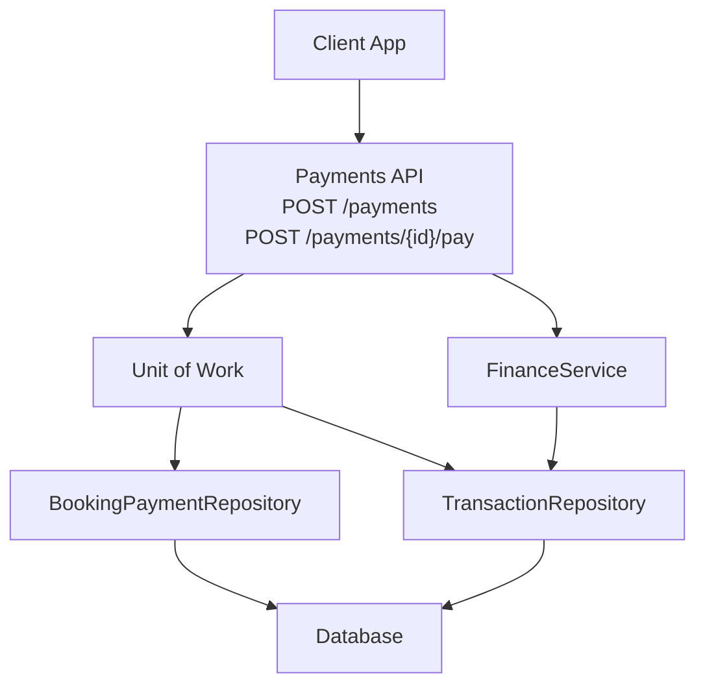
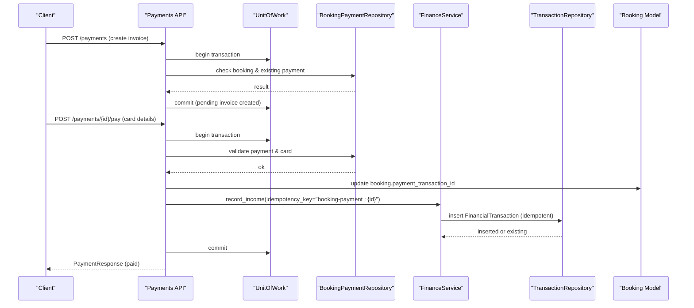
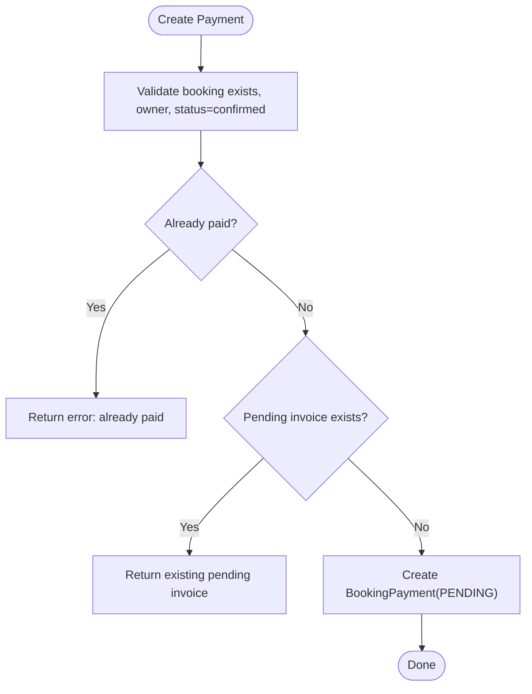
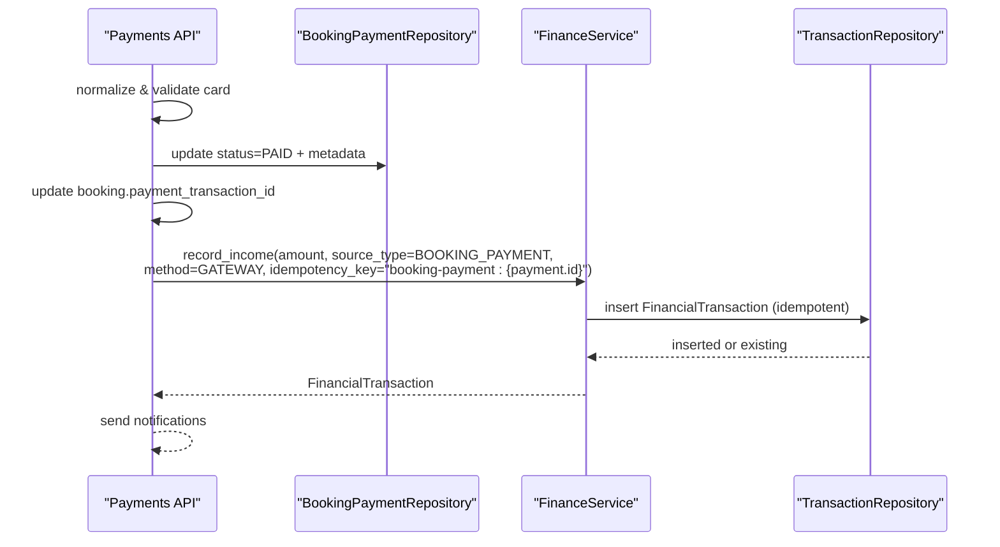
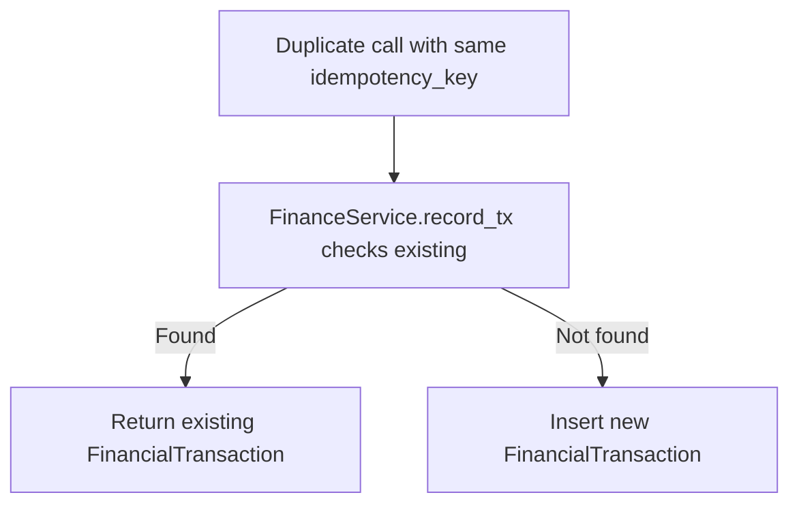
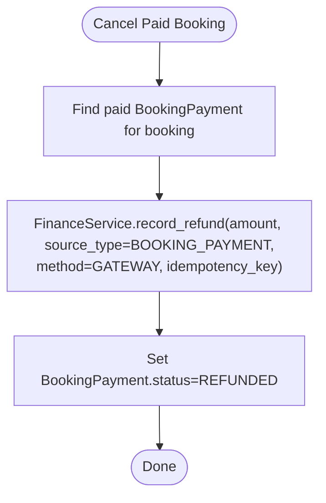
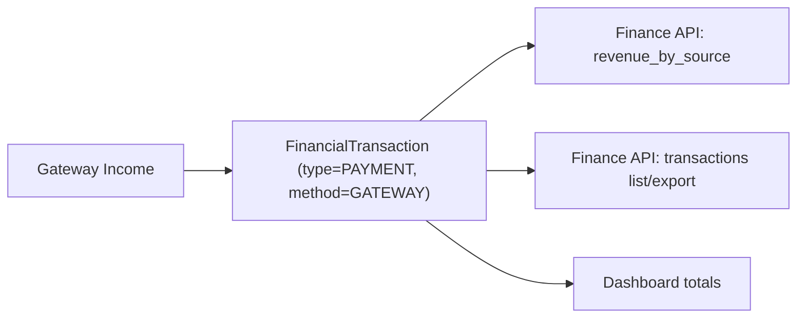
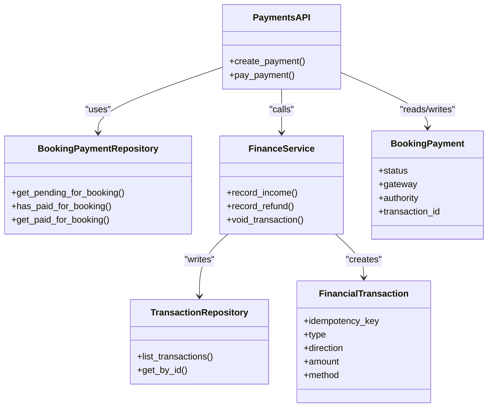

# Online Payment Gateway Integration

<cite>
**Referenced Files in This Document**
- [payments.py](file://app/api/v1/payments.py)
- [payment.py](file://app/models/payment.py)
- [transaction.py](file://app/models/transaction.py)
- [payment_repository.py](file://app/repositories/payment_repository.py)
- [finance_service.py](file://app/services/finance_service.py)
- [finance.py](file://app/api/v1/finance.py)
- [booking.py](file://app/models/booking.py)
- [rate_limit.py](file://app/utils/rate_limit.py)
- [unit_of_work.py](file://app/unit_of_work.py)
</cite>

## Table of Contents
1. Introduction
2. Project Structure
3. Core Components
4. Architecture Overview
5. Detailed Component Analysis
6. Dependency Analysis
7. Performance Considerations
8. Troubleshooting Guide
9. Conclusion

## Introduction
This document explains how the booking system integrates with online payment gateways for booking payments. It covers the end-to-end flow from payment initiation to confirmation, idempotency guarantees, financial ledger recording, and reporting. It also outlines where external gateway callbacks and webhooks would fit into the current design, including retry and timeout strategies, refund processing, cancellation handling, and troubleshooting guidance.

## Project Structure
The payment integration spans API endpoints, domain models, repositories, services, and utilities:
- API layer exposes endpoints to create a payment invoice and process payment.
- Domain models define payment records and financial transactions.
- Repositories provide data access for payments and transactions.
- Finance service centralizes ledger operations, refunds, voids, and reporting.
- Utilities enforce rate limits and manage unit-of-work transactions.

**Diagram sources**
- [payments.py:42-162](file://app/api/v1/payments.py#L42-L162)
- [unit_of_work.py:38-152](file://app/unit_of_work.py#L38-L152)
- [payment_repository.py:8-53](file://app/repositories/payment_repository.py#L8-L53)
- [finance_service.py:118-228](file://app/services/finance_service.py#L118-L228)

**Section sources**
- [payments.py:42-162](file://app/api/v1/payments.py#L42-L162)
- [unit_of_work.py:38-152](file://app/unit_of_work.py#L38-L152)

## Core Components
- Payments API: Creates a pending payment invoice for a confirmed booking and processes payment (mock gateway). It validates ownership, prevents double payment, normalizes card input, marks payment as paid, updates the booking’s transaction ID, records income in the ledger, and sends notifications.
- BookingPayment model: Tracks per-booking payment state (pending/paid/failed/refunded), gateway, authority, transaction_id, and timestamps.
- FinancialTransaction model and FinanceService: Append-only ledger with idempotency keys; supports recording income, expenses, refunds, voiding, clearing, and reporting.
- Payment repository: Queries by user, checks pending/paid states per booking, and retrieves latest or paid records.
- Rate limiting: Protects sensitive endpoints via Redis-based fixed-window rate limiter.
- Unit of Work: Ensures consistent database transactions across repositories.

**Section sources**
- [payments.py:42-162](file://app/api/v1/payments.py#L42-L162)
- [payment.py:7-29](file://app/models/payment.py#L7-L29)
- [transaction.py:20-119](file://app/models/transaction.py#L20-L119)
- [finance_service.py:118-228](file://app/services/finance_service.py#L118-L228)
- [payment_repository.py:8-53](file://app/repositories/payment_repository.py#L8-L53)
- [rate_limit.py:42-70](file://app/utils/rate_limit.py#L42-L70)
- [unit_of_work.py:38-152](file://app/unit_of_work.py#L38-L152)

## Architecture Overview
The current implementation uses an in-process mock gateway. External gateway integration can be layered on top while preserving idempotency and ledger integrity.

**Diagram sources**
- [payments.py:42-162](file://app/api/v1/payments.py#L42-L162)
- [finance_service.py:118-161](file://app/services/finance_service.py#L118-L161)
- [unit_of_work.py:38-152](file://app/unit_of_work.py#L38-L152)

## Detailed Component Analysis

### Payment Initiation Flow
- Create invoice: Validates that the booking exists, belongs to the current user, is confirmed, and has no prior paid invoice. If a pending invoice exists, it is returned to support retries.
- Payment processing: Normalizes card digits, validates length, sets status to failed if invalid, otherwise simulates success, assigns a transaction ID, stores last four digits, records paid timestamp, updates booking, records income in ledger with idempotency key, and sends notifications.

**Diagram sources**
- [payments.py:42-78](file://app/api/v1/payments.py#L42-L78)
- [payment_repository.py:23-35](file://app/repositories/payment_repository.py#L23-L35)

**Section sources**
- [payments.py:42-78](file://app/api/v1/payments.py#L42-L78)
- [payment_repository.py:23-35](file://app/repositories/payment_repository.py#L23-L35)

### Payment Processing and Ledger Recording
- Card validation and normalization ensure safe input handling.
- On success, the system:
  - Marks the payment as paid and captures metadata.
  - Updates the booking with the transaction ID.
  - Records income in the ledger using FinanceService.record_income with an idempotency key derived from the payment ID.
  - Sends notifications to the user and venue manager.

**Diagram sources**
- [payments.py:81-162](file://app/api/v1/payments.py#L81-L162)
- [finance_service.py:130-161](file://app/services/finance_service.py#L130-L161)

**Section sources**
- [payments.py:81-162](file://app/api/v1/payments.py#L81-L162)
- [finance_service.py:130-161](file://app/services/finance_service.py#L130-L161)

### Idempotency Handling
- The ledger enforces idempotency via unique idempotency_key on FinancialTransaction. Duplicate calls with the same key return the existing row without creating duplicates.
- For payment creation, returning an existing pending invoice avoids duplicate invoices for the same booking.

**Diagram sources**
- [finance_service.py:118-127](file://app/services/finance_service.py#L118-L127)
- [transaction.py:84-119](file://app/models/transaction.py#L84-L119)

**Section sources**
- [finance_service.py:118-127](file://app/services/finance_service.py#L118-L127)
- [transaction.py:84-119](file://app/models/transaction.py#L84-L119)

### External Gateway Integration and Webhooks
- Current state: The pay endpoint simulates gateway success. To integrate a real gateway:
  - Replace the mock success path with a call to the external provider.
  - Store gateway-specific fields such as authority, provider reference, and callback URL in BookingPayment.
  - Implement a webhook handler (e.g., POST /payments/webhook) that:
    - Verifies signature and payload integrity.
    - Looks up the payment by authority or provider reference.
    - Uses FinanceService.record_income with the same idempotency_key to avoid double crediting.
    - Updates payment status and booking.transaction_id accordingly.
- Timeout handling:
  - If the gateway times out during payment initiation, treat the request as unknown and instruct the client to poll or rely on webhook confirmation.
  - Use a background job to reconcile unknown statuses against the gateway’s settlement APIs.

[No sources needed since this section provides conceptual integration guidance]

### Refund Processing and Payment Cancellation
- Refunds:
  - Use FinanceService.record_refund to create an expense-type ledger entry that reverses income.
  - Link the refund to the original source (e.g., BOOKING_PAYMENT) and set method to GATEWAY.
  - Ensure idempotency via a unique idempotency_key for each refund attempt.
- Cancellations:
  - When a booking is cancelled after payment, retrieve the paid payment record and issue a refund through FinanceService.record_refund.
  - Update BookingPayment status to REFUNDED and clear or annotate the booking’s payment_transaction_id as appropriate.

**Diagram sources**
- [finance_service.py:199-228](file://app/services/finance_service.py#L199-L228)
- [payment_repository.py:37-43](file://app/repositories/payment_repository.py#L37-L43)

**Section sources**
- [finance_service.py:199-228](file://app/services/finance_service.py#L199-L228)
- [payment_repository.py:37-43](file://app/repositories/payment_repository.py#L37-L43)

### Financial Reporting for Gateway Transactions
- Revenue by source: The finance API aggregates income by source_type, enabling reports filtered to gateway payments.
- Transaction listing and export: List transactions with filters (type, direction, status, source_type, counterparty) and export to CSV for audit and reconciliation.
- Dashboard metrics: Include totals for today, month, previous month, and gross profit, which incorporate gateway-sourced income.

**Diagram sources**
- [finance.py:112-123](file://app/api/v1/finance.py#L112-L123)
- [finance.py:157-184](file://app/api/v1/finance.py#L157-L184)
- [finance.py:361-396](file://app/api/v1/finance.py#L361-L396)
- [finance_service.py:444-453](file://app/services/finance_service.py#L444-L453)

**Section sources**
- [finance.py:112-123](file://app/api/v1/finance.py#L112-L123)
- [finance.py:157-184](file://app/api/v1/finance.py#L157-L184)
- [finance.py:361-396](file://app/api/v1/finance.py#L361-L396)
- [finance_service.py:444-453](file://app/services/finance_service.py#L444-L453)

### Retry Mechanisms and Timeout Handling
- Rate limiting: Protects payment endpoints with a fixed-window Redis-based limiter to mitigate abuse and accidental retries.
- Idempotent ledger writes: Guarantee that repeated webhook or retry calls do not double-count income.
- Suggested retry strategy:
  - For payment initiation timeouts, allow client retries; the backend should either return the existing pending invoice or safely ignore duplicate attempts due to idempotency.
  - For webhook handlers, always re-check payment state before applying changes and use idempotency keys.

**Section sources**
- [rate_limit.py:42-70](file://app/utils/rate_limit.py#L42-L70)
- [finance_service.py:118-127](file://app/services/finance_service.py#L118-L127)

## Dependency Analysis
Key dependencies and relationships:
- Payments API depends on UnitOfWork, BookingPaymentRepository, FinanceService, and NotificationService.
- FinanceService depends on TransactionRepository and various domain models for reporting and scope resolution.
- Models define enums and constraints ensuring data integrity (e.g., positive amounts, unique idempotency keys).
- Rate limiting utility protects sensitive endpoints.

**Diagram sources**
- [payments.py:42-162](file://app/api/v1/payments.py#L42-L162)
- [payment_repository.py:8-53](file://app/repositories/payment_repository.py#L8-L53)
- [finance_service.py:118-228](file://app/services/finance_service.py#L118-L228)
- [payment.py:7-29](file://app/models/payment.py#L7-L29)
- [transaction.py:84-119](file://app/models/transaction.py#L84-L119)

**Section sources**
- [payments.py:42-162](file://app/api/v1/payments.py#L42-L162)
- [payment_repository.py:8-53](file://app/repositories/payment_repository.py#L8-L53)
- [finance_service.py:118-228](file://app/services/finance_service.py#L118-L228)
- [payment.py:7-29](file://app/models/payment.py#L7-L29)
- [transaction.py:84-119](file://app/models/transaction.py#L84-L119)

## Performance Considerations
- Append-only ledger: FinancialTransaction rows are never deleted; corrections use adjustments or voids, improving auditability and simplifying queries.
- Idempotency: Unique idempotency_key prevents duplicate income entries under retries or duplicate webhooks.
- Rate limiting: Prevents excessive requests to payment endpoints, reducing load and risk.
- Efficient queries: Repository methods filter by booking/user/status to minimize overhead.

[No sources needed since this section provides general guidance]

## Troubleshooting Guide
Common issues and debugging strategies:
- Duplicate payments:
  - Symptom: Multiple income entries for one booking.
  - Check: Verify idempotency_key usage in FinanceService.record_income and ensure webhook handlers reuse the same key.
  - Reference: [finance_service.py:118-127](file://app/services/finance_service.py#L118-L127)
- Already paid errors:
  - Symptom: Repeated pay attempts fail with “already paid”.
  - Check: Confirm BookingPayment status transitions and that the pay endpoint returns early for PAID status.
  - Reference: [payments.py:95-97](file://app/api/v1/payments.py#L95-L97)
- Invalid card number:
  - Symptom: Payment marked FAILED due to validation.
  - Check: Normalize digits and validate length; ensure proper error response.
  - Reference: [payments.py:98-103](file://app/api/v1/payments.py#L98-L103)
- Missing notification:
  - Symptom: User or manager not notified after payment.
  - Check: Ensure notification_service.send_to_user is called with correct parameters.
  - Reference: [payments.py:146-160](file://app/api/v1/payments.py#L146-L160)
- Refund not reflected:
  - Symptom: Balance or report does not show refund.
  - Check: Ensure FinanceService.record_refund is called with correct amount and idempotency_key; verify FinancialTransaction type=REFUND and method=GATEWAY.
  - Reference: [finance_service.py:199-228](file://app/services/finance_service.py#L199-L228)
- Rate limit exceeded:
  - Symptom: 429 responses on payment endpoints.
  - Check: Review rate_limit configuration and client retry behavior; back off based on Retry-After header.
  - Reference: [rate_limit.py:42-70](file://app/utils/rate_limit.py#L42-L70)

**Section sources**
- [finance_service.py:118-127](file://app/services/finance_service.py#L118-L127)
- [payments.py:95-103](file://app/api/v1/payments.py#L95-L103)
- [payments.py:146-160](file://app/api/v1/payments.py#L146-L160)
- [finance_service.py:199-228](file://app/services/finance_service.py#L199-L228)
- [rate_limit.py:42-70](file://app/utils/rate_limit.py#L42-L70)

## Conclusion
The booking system implements a robust, idempotent payment flow backed by an append-only financial ledger. While the current gateway is mocked, the architecture cleanly supports integrating external providers via webhook handlers and reconciliation jobs. Idempotency keys, rate limiting, and clear status transitions ensure reliability and auditability. Refunds and cancellations are supported through dedicated ledger entries, and comprehensive reporting enables financial oversight.