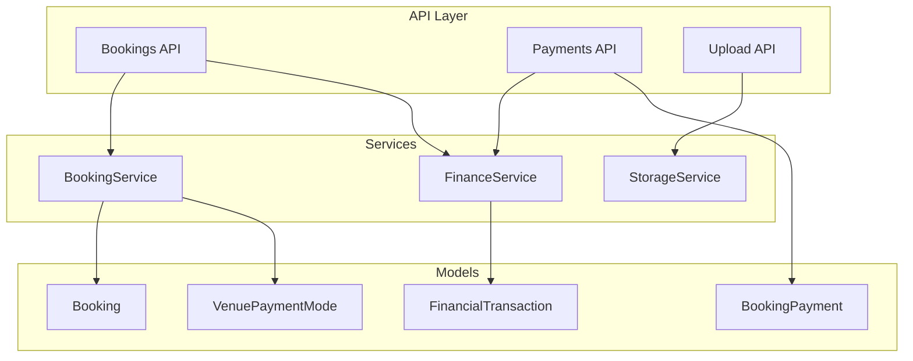
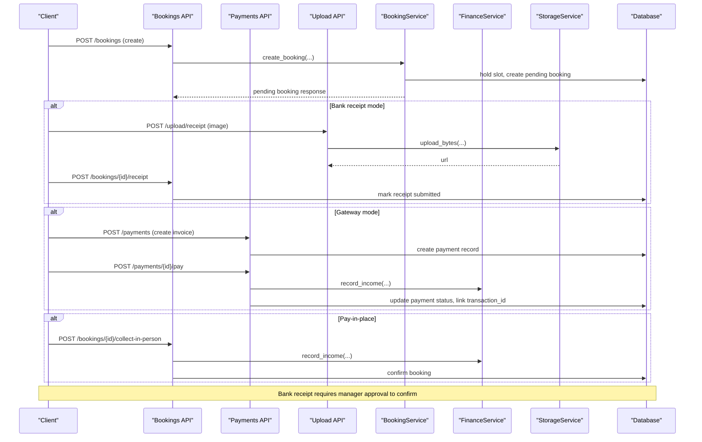
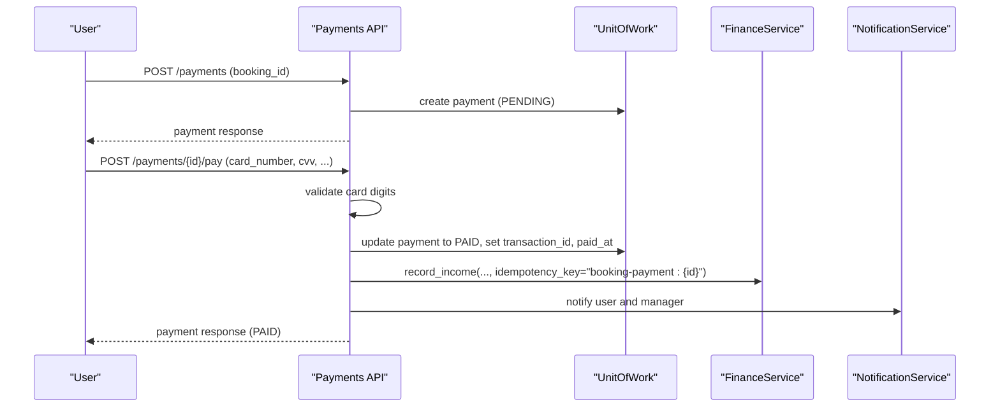
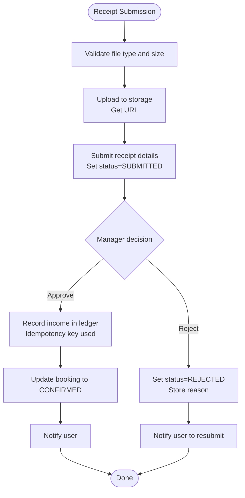
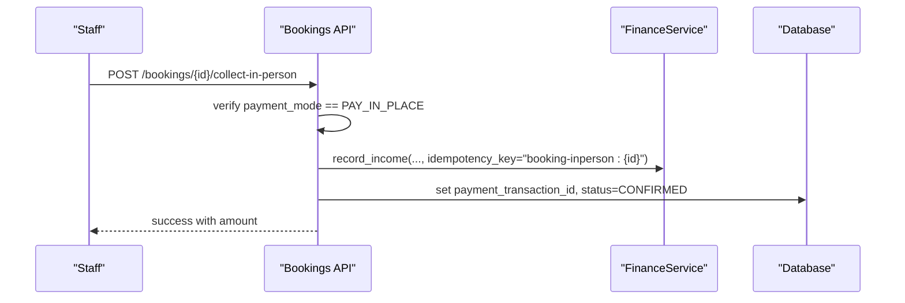
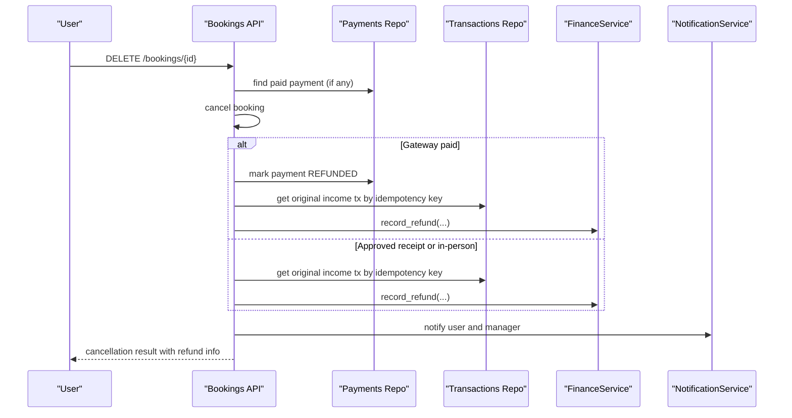
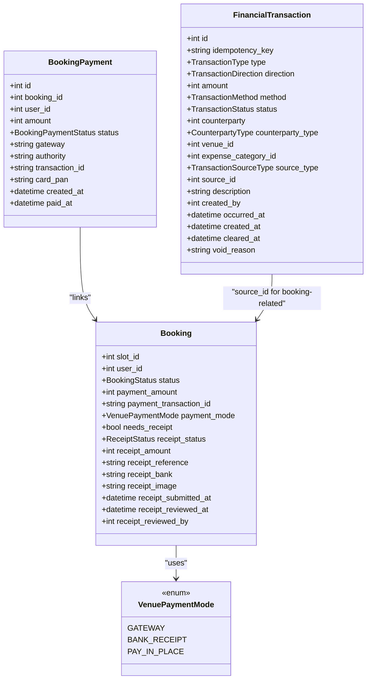
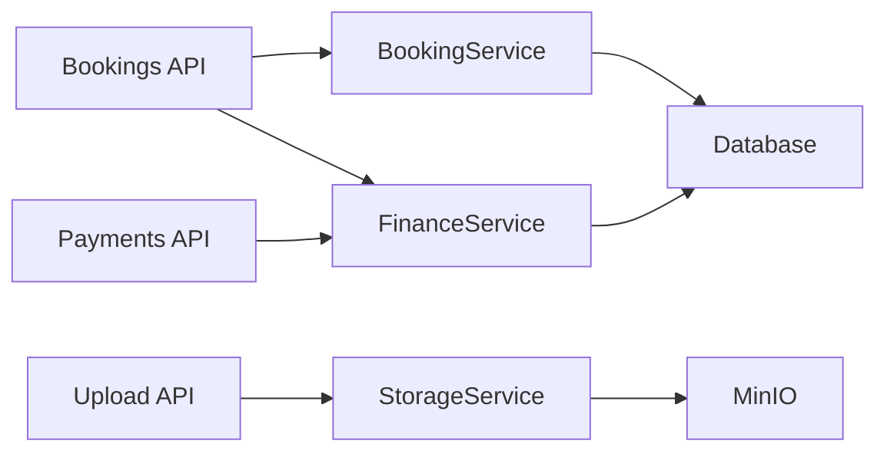

# Payment Mode Integration

<cite>
**Referenced Files in This Document**
- [booking.py](file://app/models/booking.py)
- [venue.py](file://app/models/venue.py)
- [payment.py](file://app/models/payment.py)
- [transaction.py](file://app/models/transaction.py)
- [bookings.py](file://app/api/v1/bookings.py)
- [payments.py](file://app/api/v1/payments.py)
- [upload.py](file://app/api/v1/upload.py)
- [storage_service.py](file://app/services/storage_service.py)
- [finance_service.py](file://app/services/finance_service.py)
- [booking_service.py](file://app/services/booking_service.py)
- [test_payment_modes.py](file://tests/test_payment_modes.py)
</cite>

## Table of Contents
1. Introduction
2. Project Structure
3. Core Components
4. Architecture Overview
5. Detailed Component Analysis
6. Dependency Analysis
7. Performance Considerations
8. Troubleshooting Guide
9. Conclusion

## Introduction
This document explains how payment modes are integrated into the booking system and how they affect the end-to-end booking workflow. It covers three venue payment modes:
- Instant payment via gateway
- Bank transfer with receipt upload and manual approval
- Cash payment at the venue (pay-in-place)

It also details receipt upload and verification, transaction recording, refund processing, error handling strategies, and integration points with storage and finance services.

## Project Structure
The payment mode logic spans models, services, and API endpoints:
- Models define booking states, receipt statuses, payment records, and financial transactions.
- Services implement pricing, finance ledgering, and storage operations.
- APIs expose endpoints for creating bookings, submitting receipts, approving/rejecting receipts, collecting in-person payments, and processing gateway payments.

**Diagram sources**
- [bookings.py:191-237](file://app/api/v1/bookings.py#L191-L237)
- [payments.py:42-162](file://app/api/v1/payments.py#L42-L162)
- [upload.py:53-71](file://app/api/v1/upload.py#L53-L71)
- [booking_service.py:27-109](file://app/services/booking_service.py#L27-L109)
- [finance_service.py:130-161](file://app/services/finance_service.py#L130-L161)
- [storage_service.py:65-90](file://app/services/storage_service.py#L65-L90)
- [booking.py:21-49](file://app/models/booking.py#L21-L49)
- [venue.py:10-14](file://app/models/venue.py#L10-L14)
- [payment.py:15-29](file://app/models/payment.py#L15-L29)
- [transaction.py:84-119](file://app/models/transaction.py#L84-L119)

**Section sources**
- [booking.py:21-49](file://app/models/booking.py#L21-L49)
- [venue.py:10-14](file://app/models/venue.py#L10-L14)
- [payment.py:15-29](file://app/models/payment.py#L15-L29)
- [transaction.py:84-119](file://app/models/transaction.py#L84-L119)
- [bookings.py:191-237](file://app/api/v1/bookings.py#L191-L237)
- [payments.py:42-162](file://app/api/v1/payments.py#L42-L162)
- [upload.py:53-71](file://app/api/v1/upload.py#L53-L71)
- [storage_service.py:65-90](file://app/services/storage_service.py#L65-L90)
- [finance_service.py:130-161](file://app/services/finance_service.py#L130-L161)
- [booking_service.py:27-109](file://app/services/booking_service.py#L27-L109)

## Core Components
- Venue payment modes:
  - Gateway: instant online payment via a mock gateway flow.
  - Bank receipt: user uploads a bank transfer receipt; booking remains pending until manager approves.
  - Pay in place: cash or other methods collected at the venue by staff.
- Booking lifecycle:
  - Pending confirmation by venue staff after creation.
  - For bank receipt mode, confirmed status is only set after receipt approval.
  - For gateway and pay-in-place, confirmation occurs upon successful payment recording.
- Receipts:
  - Uploaded via a dedicated endpoint with file validation.
  - Manager can approve or reject; approved receipts trigger income recording and confirm the booking.
- Finance ledger:
  - Append-only ledger entries for income, refunds, and adjustments.
  - Idempotency keys prevent duplicate recordings.
- Refunds:
  - Cancellation triggers refund entries for previously paid bookings (gateway or approved receipts).

**Section sources**
- [venue.py:10-14](file://app/models/venue.py#L10-L14)
- [booking.py:7-18](file://app/models/booking.py#L7-L18)
- [booking_service.py:119-192](file://app/services/booking_service.py#L119-L192)
- [bookings.py:454-528](file://app/api/v1/bookings.py#L454-L528)
- [payments.py:81-162](file://app/api/v1/payments.py#L81-L162)
- [finance_service.py:130-228](file://app/services/finance_service.py#L130-L228)

## Architecture Overview
The system separates concerns across API, service, and model layers to handle different payment modes consistently while preserving auditability through the finance ledger.

**Diagram sources**
- [bookings.py:191-237](file://app/api/v1/bookings.py#L191-L237)
- [bookings.py:454-528](file://app/api/v1/bookings.py#L454-L528)
- [payments.py:42-162](file://app/api/v1/payments.py#L42-L162)
- [upload.py:53-71](file://app/api/v1/upload.py#L53-L71)
- [storage_service.py:65-90](file://app/services/storage_service.py#L65-L90)
- [finance_service.py:130-161](file://app/services/finance_service.py#L130-L161)
- [booking_service.py:27-109](file://app/services/booking_service.py#L27-L109)

## Detailed Component Analysis

### Venue Payment Modes and Booking Statuses
- VenuePaymentMode defines three modes: gateway, bank_receipt, pay_in_place.
- BookingStatus includes pending, confirmed, cancelled, completed.
- ReceiptStatus tracks none, submitted, approved, rejected for bank transfers.

Key behaviors:
- When a venue uses bank_receipt, newly confirmed bookings remain in PENDING until receipt is approved.
- Gateway and pay_in_place move bookings to CONFIRMED upon successful payment recording.

**Section sources**
- [venue.py:10-14](file://app/models/venue.py#L10-L14)
- [booking.py:7-18](file://app/models/booking.py#L7-L18)
- [booking_service.py:149-171](file://app/services/booking_service.py#L149-L171)

### Gateway Payment Flow
- Create an invoice for a confirmed booking.
- Simulate gateway payment with card number validation.
- Record income in the ledger with idempotency key.
- Update payment status and link transaction_id to the booking.
- Send notifications to user and venue manager.

**Diagram sources**
- [payments.py:42-162](file://app/api/v1/payments.py#L42-L162)
- [finance_service.py:130-161](file://app/services/finance_service.py#L130-L161)

**Section sources**
- [payments.py:42-162](file://app/api/v1/payments.py#L42-L162)
- [finance_service.py:130-161](file://app/services/finance_service.py#L130-L161)

### Bank Transfer Receipt Workflow
- User uploads receipt image via upload endpoint with allowed types and size limits.
- User submits receipt details linked to the booking.
- Manager reviews and either approves or rejects.
- On approval:
  - Income recorded in ledger with idempotency key.
  - Booking status changes to CONFIRMED.
  - Notification sent to user.

**Diagram sources**
- [upload.py:53-71](file://app/api/v1/upload.py#L53-L71)
- [storage_service.py:65-90](file://app/services/storage_service.py#L65-L90)
- [bookings.py:454-510](file://app/api/v1/bookings.py#L454-L510)
- [finance_service.py:130-161](file://app/services/finance_service.py#L130-L161)

**Section sources**
- [upload.py:53-71](file://app/api/v1/upload.py#L53-L71)
- [storage_service.py:65-90](file://app/services/storage_service.py#L65-L90)
- [bookings.py:454-510](file://app/api/v1/bookings.py#L454-L510)
- [finance_service.py:130-161](file://app/services/finance_service.py#L130-L161)

### Pay-in-Place Collection
- Staff collects payment at the venue for bookings configured with pay_in_place.
- Records income in ledger and confirms the booking.
- Prevents duplicate collection using idempotency checks.

**Diagram sources**
- [bookings.py:512-528](file://app/api/v1/bookings.py#L512-L528)
- [finance_service.py:130-161](file://app/services/finance_service.py#L130-L161)

**Section sources**
- [bookings.py:512-528](file://app/api/v1/bookings.py#L512-L528)
- [finance_service.py:130-161](file://app/services/finance_service.py#L130-L161)

### Refund Processing on Cancellation
- When a booking is cancelled:
  - If there was a gateway payment, mark it refunded and record a refund entry.
  - If there was an approved bank receipt or in-person payment, record a corresponding refund entry.
- Notifications inform the user and venue manager about the refund.

**Diagram sources**
- [bookings.py:349-426](file://app/api/v1/bookings.py#L349-L426)
- [finance_service.py:199-228](file://app/services/finance_service.py#L199-L228)

**Section sources**
- [bookings.py:349-426](file://app/api/v1/bookings.py#L349-L426)
- [finance_service.py:199-228](file://app/services/finance_service.py#L199-L228)

### Data Models and Relationships

**Diagram sources**
- [booking.py:21-49](file://app/models/booking.py#L21-L49)
- [venue.py:10-14](file://app/models/venue.py#L10-L14)
- [payment.py:15-29](file://app/models/payment.py#L15-L29)
- [transaction.py:84-119](file://app/models/transaction.py#L84-L119)

## Dependency Analysis
- API endpoints depend on services for business logic and persistence via UnitOfWork.
- BookingService orchestrates pricing, coupon/loyalty usage, and finalizes bookings based on payment mode.
- FinanceService centralizes ledger operations with idempotency and consistent accounting rules.
- StorageService abstracts MinIO interactions for receipt images.

**Diagram sources**
- [bookings.py:191-237](file://app/api/v1/bookings.py#L191-L237)
- [payments.py:42-162](file://app/api/v1/payments.py#L42-L162)
- [upload.py:53-71](file://app/api/v1/upload.py#L53-L71)
- [booking_service.py:27-109](file://app/services/booking_service.py#L27-L109)
- [finance_service.py:130-161](file://app/services/finance_service.py#L130-L161)
- [storage_service.py:65-90](file://app/services/storage_service.py#L65-L90)

**Section sources**
- [bookings.py:191-237](file://app/api/v1/bookings.py#L191-L237)
- [payments.py:42-162](file://app/api/v1/payments.py#L42-L162)
- [upload.py:53-71](file://app/api/v1/upload.py#L53-L71)
- [booking_service.py:27-109](file://app/services/booking_service.py#L27-L109)
- [finance_service.py:130-161](file://app/services/finance_service.py#L130-L161)
- [storage_service.py:65-90](file://app/services/storage_service.py#L65-L90)

## Performance Considerations
- Use idempotency keys for all financial recordings to avoid duplicates under retries or concurrent requests.
- Hold slots with database locks during booking creation to prevent race conditions.
- Batch enrichment of booking responses to reduce N+1 queries.
- Keep receipt uploads small and validated to minimize storage overhead and network latency.

[No sources needed since this section provides general guidance]

## Troubleshooting Guide
Common issues and strategies:
- Invalid card number format:
  - The gateway payment endpoint validates card digits and marks payment FAILED if invalid.
- Duplicate receipt submission:
  - If a booking is already paid (via gateway, approved receipt, or in-person), subsequent submissions are rejected.
- Wrong payment mode:
  - Collect-in-person requires PAY_IN_PLACE; otherwise returns an error.
  - Receipt submission requires BANK_RECEIPT; otherwise returns an error.
- Unauthorized access:
  - Receipt submit is owner-only; approve/reject require venue permission.
- Storage errors:
  - Upload endpoint returns 503 when MinIO is unavailable or upload fails.

**Section sources**
- [payments.py:81-162](file://app/api/v1/payments.py#L81-L162)
- [bookings.py:454-528](file://app/api/v1/bookings.py#L454-L528)
- [upload.py:53-71](file://app/api/v1/upload.py#L53-L71)
- [storage_service.py:65-90](file://app/services/storage_service.py#L65-L90)

## Conclusion
The booking system integrates multiple payment modes with clear workflows:
- Gateway payments provide instant confirmation with ledger recording and notifications.
- Bank transfer receipts introduce a manual approval step, keeping bookings pending until verified.
- Pay-in-place allows staff to collect payments and confirm bookings directly.
All flows maintain financial integrity through append-only ledger entries, idempotency safeguards, and robust error handling. Refunds are consistently recorded when cancellations occur, ensuring accurate accounting and user communication.

[No sources needed since this section summarizes without analyzing specific files]