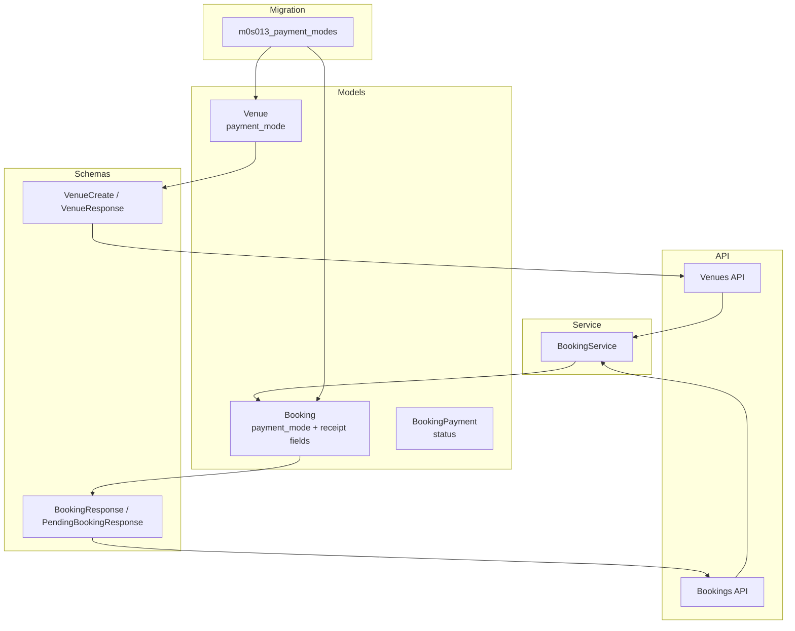
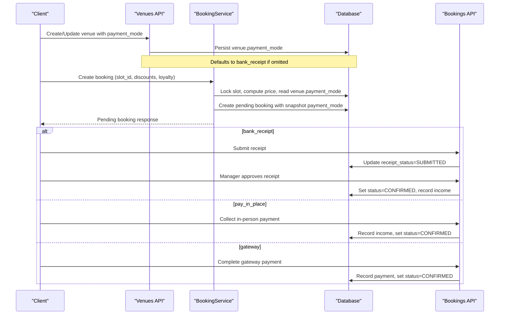
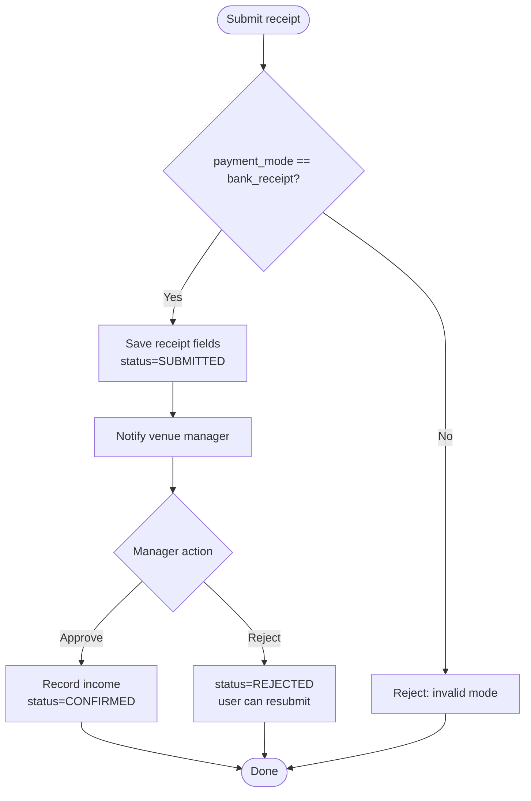
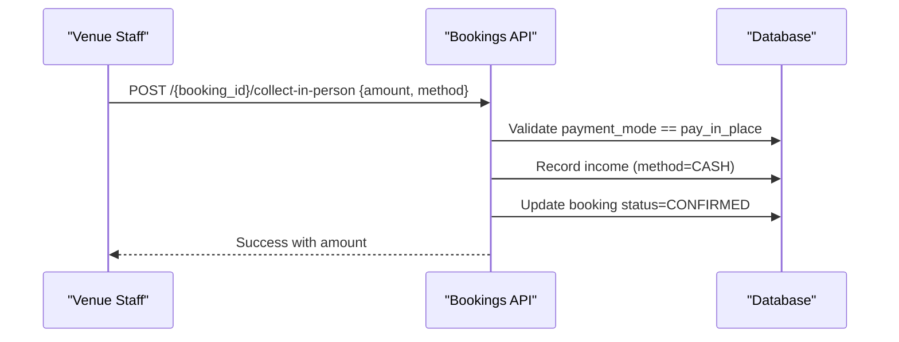
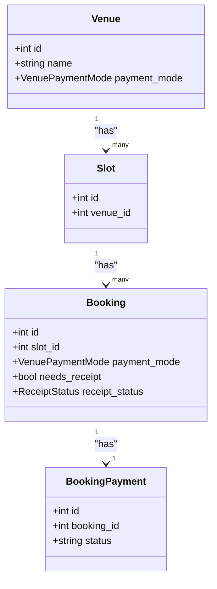
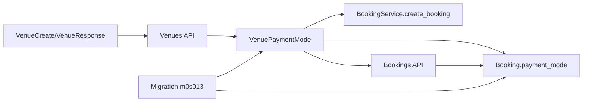

# Payment Modes Configuration

<cite>
**Referenced Files in This Document**
- [venue.py](file://app/models/venue.py)
- [booking.py](file://app/models/booking.py)
- [payment.py](file://app/models/payment.py)
- [m0s013_payment_modes.py](file://migrations/versions/m0s013_payment_modes.py)
- [venues.py](file://app/api/v1/venues.py)
- [bookings.py](file://app/api/v1/bookings.py)
- [booking_service.py](file://app/services/booking_service.py)
- [venue.py (schema)](file://app/schemas/venue.py)
- [booking.py (schema)](file://app/schemas/booking.py)
</cite>

## Table of Contents
1. Introduction
2. Project Structure
3. Core Components
4. Architecture Overview
5. Detailed Component Analysis
6. Dependency Analysis
7. Performance Considerations
8. Troubleshooting Guide
9. Conclusion

## Introduction
This document explains how payment modes are configured and used in the venue booking system. The system supports three payment modes:
- gateway: online payment via a payment gateway
- bank_receipt: bank transfer with receipt upload and manager approval
- pay_in_place: cash or in-person payment collected at the venue

Payment mode is configured per venue and captured as a snapshot on each booking to ensure consistent behavior throughout the booking lifecycle. Depending on the mode, the booking workflow, user experience, and administrative processes differ significantly.

## Project Structure
The payment mode feature spans models, schemas, API endpoints, services, and database migrations:
- Models define enums and fields for payment modes and receipt workflows
- Schemas validate inputs and responses
- APIs expose venue configuration and booking payment actions
- Services orchestrate booking creation and confirm pending bookings based on payment mode
- Migration adds columns for payment_mode and receipt tracking

**Diagram sources**
- [venue.py:10-34](file://app/models/venue.py#L10-L34)
- [booking.py:21-49](file://app/models/booking.py#L21-L49)
- [payment.py:7-28](file://app/models/payment.py#L7-L28)
- [venue.py (schema):10-48](file://app/schemas/venue.py#L10-L48)
- [booking.py (schema):16-93](file://app/schemas/booking.py#L16-L93)
- [venues.py:16-26](file://app/api/v1/venues.py#L16-L26)
- [bookings.py:430-529](file://app/api/v1/bookings.py#L430-L529)
- [booking_service.py:27-192](file://app/services/booking_service.py#L27-L192)
- [m0s013_payment_modes.py:49-90](file://migrations/versions/m0s013_payment_modes.py#L49-L90)

**Section sources**
- [venue.py:10-34](file://app/models/venue.py#L10-L34)
- [booking.py:21-49](file://app/models/booking.py#L21-L49)
- [payment.py:7-28](file://app/models/payment.py#L7-L28)
- [m0s013_payment_modes.py:49-90](file://migrations/versions/m0s013_payment_modes.py#L49-L90)
- [venues.py:16-26](file://app/api/v1/venues.py#L16-L26)
- [bookings.py:430-529](file://app/api/v1/bookings.py#L430-L529)
- [booking_service.py:27-192](file://app/services/booking_service.py#L27-L192)
- [venue.py (schema):10-48](file://app/schemas/venue.py#L10-L48)
- [booking.py (schema):16-93](file://app/schemas/booking.py#L16-L93)

## Core Components
- VenuePaymentMode enum defines allowed values: gateway, bank_receipt, pay_in_place
- Venue model stores a default payment_mode per venue
- Booking model snapshots payment_mode at booking time and tracks receipt workflow fields
- BookingPayment model records payment status and details
- BookingService captures venue payment_mode during booking creation and sets initial booking status based on mode
- Venues API allows creating/updating venues with an optional payment_mode; defaults apply when omitted
- Bookings API provides endpoints to submit receipts and collect in-person payments

Key behaviors:
- Default venue payment_mode is bank_receipt if not set
- Bank receipt flow requires user-submitted receipt and manager approval before confirmation
- Pay-in-place flow allows staff to record payment and confirm the booking
- Gateway flow uses standard payment recording (not detailed here), but the booking can be confirmed once paid

**Section sources**
- [venue.py:10-34](file://app/models/venue.py#L10-L34)
- [booking.py:21-49](file://app/models/booking.py#L21-L49)
- [payment.py:7-28](file://app/models/payment.py#L7-L28)
- [booking_service.py:69-88](file://app/services/booking_service.py#L69-L88)
- [booking_service.py:149-171](file://app/services/booking_service.py#L149-L171)
- [venues.py:165-194](file://app/api/v1/venues.py#L165-L194)
- [bookings.py:454-529](file://app/api/v1/bookings.py#L454-L529)

## Architecture Overview
The payment mode influences the booking lifecycle from creation through confirmation:

**Diagram sources**
- [venues.py:165-194](file://app/api/v1/venues.py#L165-L194)
- [booking_service.py:27-109](file://app/services/booking_service.py#L27-L109)
- [booking_service.py:119-192](file://app/services/booking_service.py#L119-L192)
- [bookings.py:454-529](file://app/api/v1/bookings.py#L454-L529)

## Detailed Component Analysis

### Venue-Level Payment Mode Configuration
- Venue model includes a payment_mode field with a default value
- Venue schema validates allowed values and exposes them in responses
- Venues API accepts optional payment_mode when creating or updating a venue; omitting it applies the default

Configuration options:
- Create a venue with payment_mode set to one of: gateway, bank_receipt, pay_in_place
- Update an existing venue’s payment_mode to change future bookings’ default behavior
- If no payment_mode is provided, the system uses the default (bank_receipt)

Impact:
- Future bookings inherit the venue’s current payment_mode at creation time
- Existing bookings retain their own snapshot of payment_mode

**Section sources**
- [venue.py:10-34](file://app/models/venue.py#L10-L34)
- [venue.py (schema):10-48](file://app/schemas/venue.py#L10-L48)
- [venues.py:16-26](file://app/api/v1/venues.py#L16-L26)
- [venues.py:165-194](file://app/api/v1/venues.py#L165-L194)

### Booking Creation and Snapshotting
- During booking creation, the service reads the venue’s payment_mode and stores it on the pending booking
- It also sets needs_receipt based on whether the mode is bank_receipt
- On confirmation, the service persists the snapshot and determines initial booking status

Behavior by mode:
- bank_receipt: booking starts as PENDING until receipt is approved
- pay_in_place: booking can be confirmed after in-person payment collection
- gateway: booking can be confirmed once gateway payment succeeds

**Section sources**
- [booking_service.py:69-88](file://app/services/booking_service.py#L69-L88)
- [booking_service.py:149-171](file://app/services/booking_service.py#L149-L171)

### Receipt Workflow (bank_receipt)
Users submit a receipt with amount, image, reference, and bank name. The system:
- Validates that the booking uses bank_receipt
- Updates receipt fields and sets status to SUBMITTED
- Notifies the venue manager
- Allows manager to approve or reject
- On approval, records income and confirms the booking

**Diagram sources**
- [bookings.py:454-510](file://app/api/v1/bookings.py#L454-L510)

**Section sources**
- [bookings.py:454-510](file://app/api/v1/bookings.py#L454-L510)

### In-Person Payment Collection (pay_in_place)
Staff can collect payment at the venue for bookings using pay_in_place:
- Validates that the booking uses pay_in_place
- Records income with method (e.g., cash)
- Confirms the booking

**Diagram sources**
- [bookings.py:512-529](file://app/api/v1/bookings.py#L512-L529)

**Section sources**
- [bookings.py:512-529](file://app/api/v1/bookings.py#L512-L529)

### Gateway Payment (online)
- For gateway-based bookings, the system expects payment completion via the gateway integration
- Once payment succeeds, the booking can be confirmed
- While specific gateway endpoints are not detailed here, the model supports payment status and transaction tracking

**Section sources**
- [payment.py:7-28](file://app/models/payment.py#L7-L28)

### Data Model Relationships

**Diagram sources**
- [venue.py:16-43](file://app/models/venue.py#L16-L43)
- [booking.py:21-49](file://app/models/booking.py#L21-L49)
- [payment.py:15-28](file://app/models/payment.py#L15-L28)

## Dependency Analysis
- VenuePaymentMode is imported by Booking model to store a snapshot of the payment mode at booking time
- BookingService depends on VenuePaymentMode to determine needs_receipt and initial booking status
- Venues API converts string payment_mode to enum for persistence
- Bookings API enforces mode-specific constraints for receipt submission and in-person collection
- Migration ensures database schema supports payment_mode and receipt fields

**Diagram sources**
- [venue.py:10-34](file://app/models/venue.py#L10-L34)
- [booking.py:21-49](file://app/models/booking.py#L21-L49)
- [booking_service.py:69-88](file://app/services/booking_service.py#L69-L88)
- [venues.py:16-26](file://app/api/v1/venues.py#L16-L26)
- [bookings.py:430-529](file://app/api/v1/bookings.py#L430-L529)
- [m0s013_payment_modes.py:49-90](file://migrations/versions/m0s013_payment_modes.py#L49-L90)

**Section sources**
- [venue.py:10-34](file://app/models/venue.py#L10-L34)
- [booking.py:21-49](file://app/models/booking.py#L21-L49)
- [booking_service.py:69-88](file://app/services/booking_service.py#L69-L88)
- [venues.py:16-26](file://app/api/v1/venues.py#L16-L26)
- [bookings.py:430-529](file://app/api/v1/bookings.py#L430-L529)
- [m0s013_payment_modes.py:49-90](file://migrations/versions/m0s013_payment_modes.py#L49-L90)

## Performance Considerations
- Booking creation locks slots and checks availability to prevent race conditions
- Payment mode decisions are computed server-side to avoid client manipulation
- Receipt submission and approval are lightweight updates with notifications
- In-person payment collection records income and confirms bookings efficiently

[No sources needed since this section provides general guidance]

## Troubleshooting Guide
Common issues and resolutions:
- Submitting a receipt for a non-bank_receipt booking: Ensure the booking’s payment_mode is bank_receipt
- Approving a receipt that is already paid: System prevents duplicate payment processing
- Rejecting a receipt without proper permissions: Use venue manager role with required permissions
- Collecting in-person payment for a non-pay_in_place booking: Ensure the booking’s payment_mode is pay_in_place

Relevant validation points:
- Receipt submission checks payment_mode and prior payment state
- Receipt approval/rejection require correct status and permissions
- In-person collection validates payment_mode and prior payment state

**Section sources**
- [bookings.py:454-529](file://app/api/v1/bookings.py#L454-L529)

## Conclusion
Payment modes provide flexible checkout experiences tailored to venue policies:
- gateway enables seamless online payments
- bank_receipt introduces a receipt-based verification step managed by venue staff
- pay_in_place supports cash or in-person collections

Configure payment_mode per venue to control default behavior, and rely on the system’s snapshot mechanism to maintain consistency across the booking lifecycle. Use the provided endpoints to manage receipts and in-person payments, ensuring accurate financial recording and clear user feedback.

[No sources needed since this section summarizes without analyzing specific files]