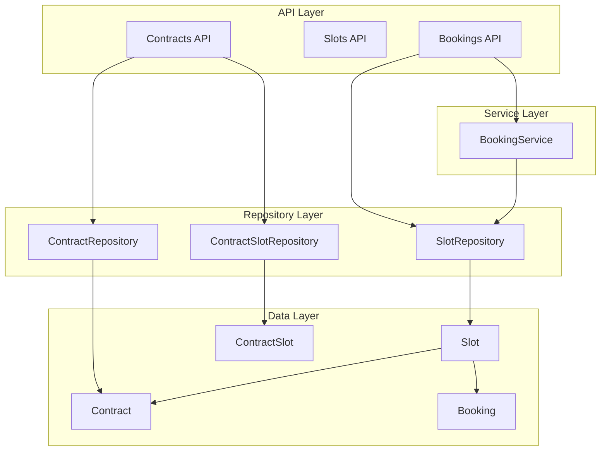
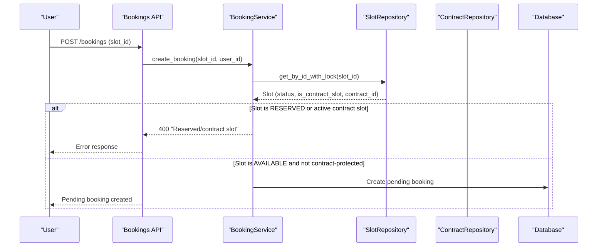
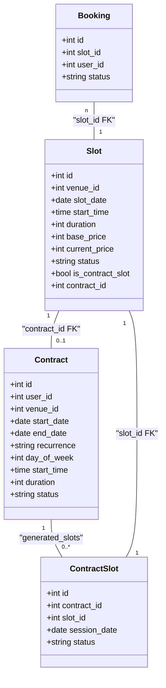
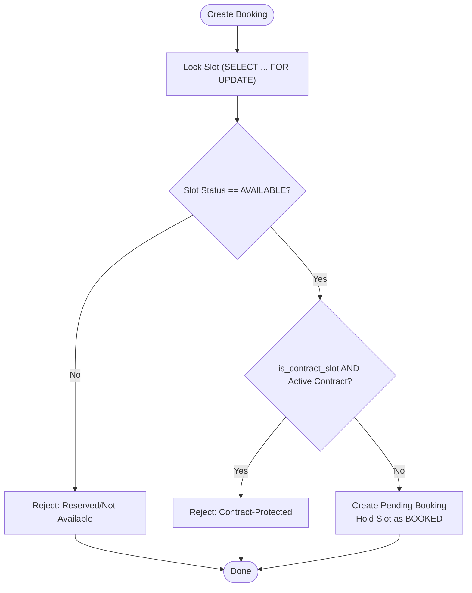
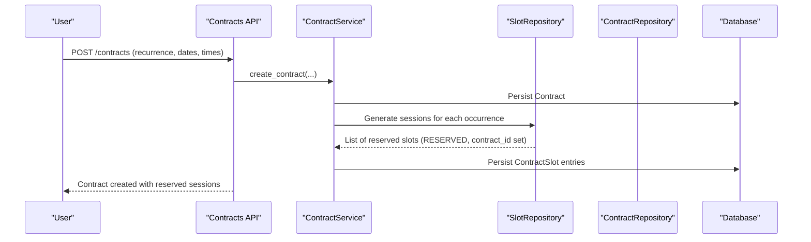
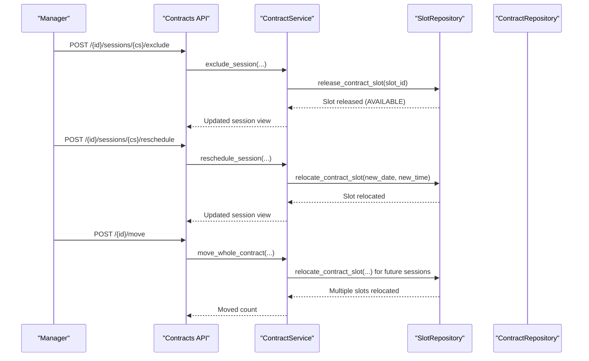
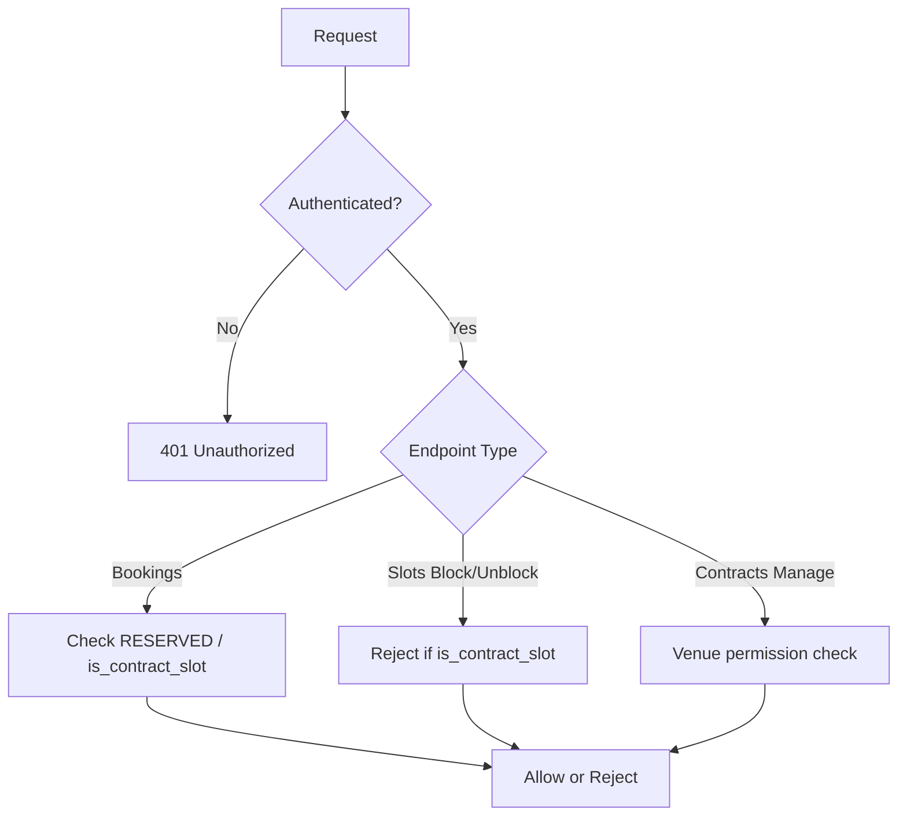
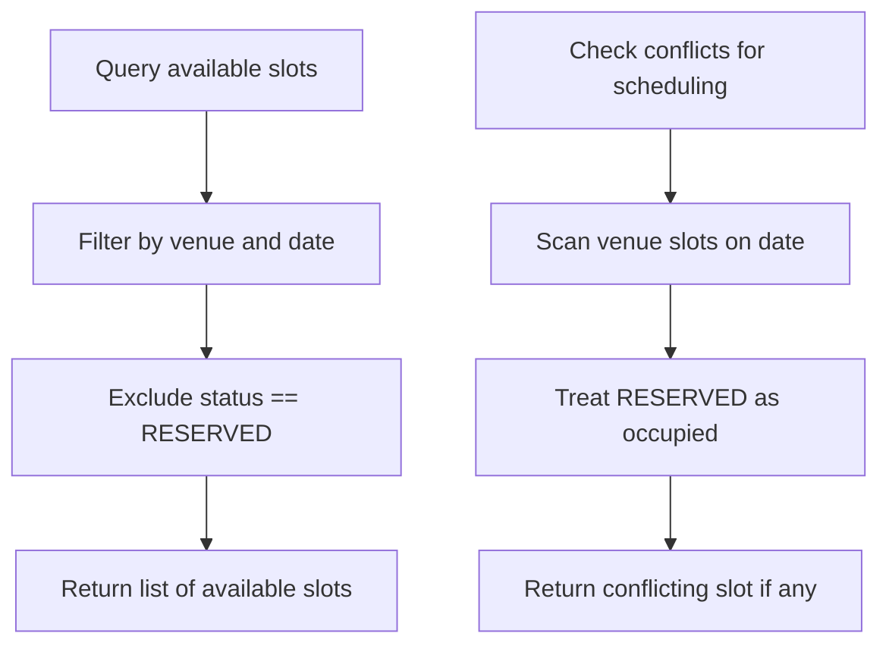
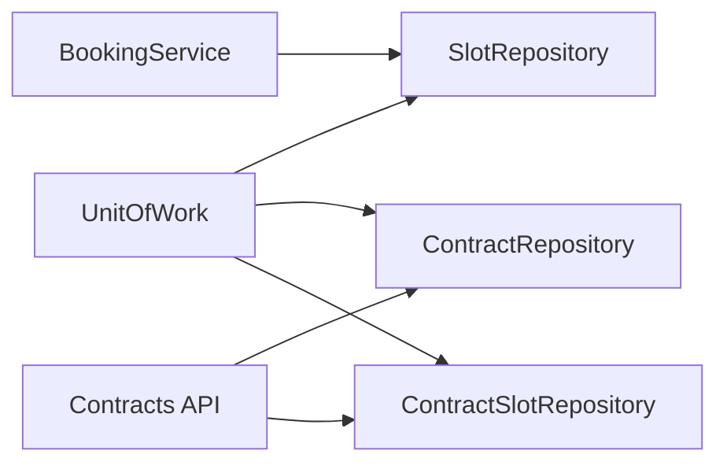

# Contract Slot Protection

<cite>
**Referenced Files in This Document**
- [slot.py](file://app/models/slot.py)
- [contract.py](file://app/models/contract.py)
- [booking.py](file://app/models/booking.py)
- [bookings.py](file://app/api/v1/bookings.py)
- [slots.py](file://app/api/v1/slots.py)
- [contracts.py](file://app/api/v1/contracts.py)
- [booking_service.py](file://app/services/booking_service.py)
- [slot_repository.py](file://app/repositories/slot_repository.py)
- [contract_repository.py](file://app/repositories/contract_repository.py)
- [unit_of_work.py](file://app/unit_of_work.py)
- [test_contract_slot_protection.py](file://tests/test_contract_slot_protection.py)
</cite>

## Table of Contents
1. Introduction
2. Project Structure
3. Core Components
4. Architecture Overview
5. Detailed Component Analysis
6. Dependency Analysis
7. Performance Considerations
8. Troubleshooting Guide
9. Conclusion
10. Appendices

## Introduction
This document explains how the system protects time slots reserved by contracts from regular bookings and how contract holders manage their reserved sessions. It covers:
- How is_contract_slot and contract_id mark a slot as contract-owned
- How RESERVED status prevents ordinary users from booking contract slots
- How multi-day contracts generate scheduled sessions and link them to physical slots
- The authorization rules that enforce protection across booking, block/unblock, and conflict checks
- End-to-end flows for creating contracts, reserving slots automatically, and managing sessions

## Project Structure
The contract-slot protection spans models, repositories, services, and API endpoints:
- Models define the data relationships between Slots, Contracts, and Bookings
- Repositories implement queries and state transitions for slots and contracts
- Services enforce business rules (e.g., blocking non-contract bookings on contract slots)
- APIs expose operations for users and managers with permission checks

**Diagram sources**
- [bookings.py:191-237](file://app/api/v1/bookings.py#L191-L237)
- [booking_service.py:27-109](file://app/services/booking_service.py#L27-L109)
- [slot_repository.py:15-124](file://app/repositories/slot_repository.py#L15-L124)
- [contract_repository.py:83-151](file://app/repositories/contract_repository.py#L83-L151)
- [slot.py:13-42](file://app/models/slot.py#L13-L42)
- [contract.py:64-151](file://app/models/contract.py#L64-L151)
- [booking.py:21-51](file://app/models/booking.py#L21-L51)

**Section sources**
- [bookings.py:191-237](file://app/api/v1/bookings.py#L191-L237)
- [booking_service.py:27-109](file://app/services/booking_service.py#L27-L109)
- [slot_repository.py:15-124](file://app/repositories/slot_repository.py#L15-L124)
- [contract_repository.py:83-151](file://app/repositories/contract_repository.py#L83-L151)
- [slot.py:13-42](file://app/models/slot.py#L13-L42)
- [contract.py:64-151](file://app/models/contract.py#L64-L151)
- [booking.py:21-51](file://app/models/booking.py#L21-L51)

## Core Components
- Slot model includes is_contract_slot flag and contract_id foreign key to bind a slot to a contract
- Contract model defines lifecycle and recurrence; ContractSlot links each session to a specific slot
- Booking service enforces that contract-owned slots cannot be booked by regular users
- Repository methods support releasing or relocating contract slots during contract lifecycle changes
- APIs provide manager-only controls to exclude/reschedule sessions and prevent manual blocking of contract slots

Key behaviors:
- Contract creation generates future sessions and marks corresponding slots as RESERVED and linked via contract_id
- Regular booking attempts on RESERVED or contract-linked slots are rejected
- Managers can exclude or reschedule sessions; these actions release or move the underlying slot appropriately
- Block/unblock endpoints explicitly protect contract slots from manual blocking

**Section sources**
- [slot.py:13-42](file://app/models/slot.py#L13-L42)
- [contract.py:64-151](file://app/models/contract.py#L64-L151)
- [booking_service.py:27-109](file://app/services/booking_service.py#L27-L109)
- [slot_repository.py:99-124](file://app/repositories/slot_repository.py#L99-L124)
- [slots.py:68-91](file://app/api/v1/slots.py#L68-L91)
- [contracts.py:289-383](file://app/api/v1/contracts.py#L289-L383)

## Architecture Overview
The protection mechanism combines data-level flags, repository constraints, and service-layer validation:

**Diagram sources**
- [bookings.py:191-237](file://app/api/v1/bookings.py#L191-L237)
- [booking_service.py:27-109](file://app/services/booking_service.py#L27-L109)
- [slot_repository.py:15-18](file://app/repositories/slot_repository.py#L15-L18)

## Detailed Component Analysis

### Data Model: Slot, Contract, ContractSlot, Booking
- Slot carries is_contract_slot and contract_id to indicate ownership and linkage
- Contract defines recurrence and dates; ContractSlot represents each scheduled session and its state
- Booking links a user to a slot when confirmed

**Diagram sources**
- [slot.py:13-42](file://app/models/slot.py#L13-L42)
- [contract.py:64-151](file://app/models/contract.py#L64-L151)
- [booking.py:21-51](file://app/models/booking.py#L21-L51)

**Section sources**
- [slot.py:13-42](file://app/models/slot.py#L13-L42)
- [contract.py:64-151](file://app/models/contract.py#L64-L151)
- [booking.py:21-51](file://app/models/booking.py#L21-L51)

### Booking Flow and Contract Slot Protection
- When a user attempts to book, the service locks the slot and validates availability
- If the slot is RESERVED or marked as contract-owned with an active contract, the request is rejected
- On successful creation, a pending booking is stored and the slot is temporarily held until manager confirmation

**Diagram sources**
- [booking_service.py:27-109](file://app/services/booking_service.py#L27-L109)
- [slot_repository.py:15-18](file://app/repositories/slot_repository.py#L15-L18)

**Section sources**
- [booking_service.py:27-109](file://app/services/booking_service.py#L27-L109)
- [slot_repository.py:15-18](file://app/repositories/slot_repository.py#L15-L18)

### Multi-Day Contracts and Automatic Reservation Creation
- A contract specifies recurrence and date range; sessions are generated for each occurrence
- Each session creates a ContractSlot entry and reserves the corresponding physical slot
- The slot becomes RESERVED and is linked via contract_id, preventing public bookings

**Diagram sources**
- [contracts.py:90-117](file://app/api/v1/contracts.py#L90-L117)
- [slot_repository.py:194-239](file://app/repositories/slot_repository.py#L194-L239)
- [contract_repository.py:83-151](file://app/repositories/contract_repository.py#L83-L151)

**Section sources**
- [contracts.py:90-117](file://app/api/v1/contracts.py#L90-L117)
- [slot_repository.py:194-239](file://app/repositories/slot_repository.py#L194-L239)
- [contract_repository.py:83-151](file://app/repositories/contract_repository.py#L83-L151)

### Session Management: Exclude, Reschedule, Move Whole Contract
- Managers can exclude a session (marking it excluded and freeing the slot)
- Managers can reschedule a session to a new date/time (relocating the slot)
- Managers can move all future sessions to a different day/time (relocating multiple slots)

**Diagram sources**
- [contracts.py:289-383](file://app/api/v1/contracts.py#L289-L383)
- [slot_repository.py:99-124](file://app/repositories/slot_repository.py#L99-L124)

**Section sources**
- [contracts.py:289-383](file://app/api/v1/contracts.py#L289-L383)
- [slot_repository.py:99-124](file://app/repositories/slot_repository.py#L99-L124)

### Permission Checks and Authorization Rules
- Booking creation requires authentication; contract slot protection is enforced regardless of role
- Manager-only endpoints for contract session management require venue permissions
- Block/unblock endpoints explicitly reject contract slots to avoid manual interference

**Diagram sources**
- [bookings.py:191-237](file://app/api/v1/bookings.py#L191-L237)
- [slots.py:68-91](file://app/api/v1/slots.py#L68-L91)
- [contracts.py:197-216](file://app/api/v1/contracts.py#L197-L216)

**Section sources**
- [bookings.py:191-237](file://app/api/v1/bookings.py#L191-L237)
- [slots.py:68-91](file://app/api/v1/slots.py#L68-L91)
- [contracts.py:197-216](file://app/api/v1/contracts.py#L197-L216)

### Conflict Detection and Availability Filtering
- Conflict detection treats RESERVED slots as occupied to prevent overlapping schedules
- Available slots endpoint excludes RESERVED slots, ensuring contract reservations are not shown as open

**Diagram sources**
- [slot_repository.py:40-46](file://app/repositories/slot_repository.py#L40-L46)
- [slot_repository.py:77-97](file://app/repositories/slot_repository.py#L77-L97)

**Section sources**
- [slot_repository.py:40-46](file://app/repositories/slot_repository.py#L40-L46)
- [slot_repository.py:77-97](file://app/repositories/slot_repository.py#L77-L97)

## Dependency Analysis
- UnitOfWork provides access to repositories used across layers
- BookingService depends on SlotRepository for locking and updates
- Contracts API depends on ContractRepository and ContractSlotRepository for session management
- SlotRepository exposes helpers to release or relocate contract slots

**Diagram sources**
- [unit_of_work.py:38-128](file://app/unit_of_work.py#L38-L128)
- [booking_service.py:27-109](file://app/services/booking_service.py#L27-L109)
- [contracts.py:90-117](file://app/api/v1/contracts.py#L90-L117)

**Section sources**
- [unit_of_work.py:38-128](file://app/unit_of_work.py#L38-L128)
- [booking_service.py:27-109](file://app/services/booking_service.py#L27-L109)
- [contracts.py:90-117](file://app/api/v1/contracts.py#L90-L117)

## Performance Considerations
- Database row locking (SELECT ... FOR UPDATE) prevents race conditions during booking and contract operations
- Batch queries and repository methods reduce N+1 issues when listing slots or sessions
- Conflict checks scan relevant windows efficiently; consider indexing venue_id, slot_date, and status for large venues

[No sources needed since this section provides general guidance]

## Troubleshooting Guide
Common issues and resolutions:
- Attempting to book a contract slot returns a 400 error indicating reservation or contract protection
- Manual block/unblock on contract slots is rejected; use contract session management instead
- Legacy data where a slot is AVAILABLE but still linked to an active contract is protected by in-depth checks
- Cancelling a confirmed booking on a contract slot restores the slot to RESERVED rather than AVAILABLE

Relevant checks and behaviors:
- Booking service rejects RESERVED or contract-protected slots
- Block/unblock endpoints guard against contract slots
- Conflict detection treats RESERVED as occupied
- Tests validate protection behavior and restoration logic

**Section sources**
- [booking_service.py:27-109](file://app/services/booking_service.py#L27-L109)
- [slots.py:68-91](file://app/api/v1/slots.py#L68-L91)
- [slot_repository.py:77-97](file://app/repositories/slot_repository.py#L77-L97)
- [test_contract_slot_protection.py:103-178](file://tests/test_contract_slot_protection.py#L103-L178)
- [test_contract_slot_protection.py:235-269](file://tests/test_contract_slot_protection.py#L235-L269)

## Conclusion
Contract-based slot protection ensures that reserved time remains exclusive to contract holders while allowing managers to adjust schedules safely. The combination of is_contract_slot, contract_id, RESERVED status, and explicit service checks prevents unauthorized bookings. Managers retain full control over session exclusion, rescheduling, and bulk moves, preserving inventory integrity and honoring contractual commitments.

[No sources needed since this section summarizes without analyzing specific files]

## Appendices

### Example Scenarios
- Creating a weekly contract for a month generates multiple sessions; each session’s slot becomes RESERVED and linked to the contract
- A regular user attempting to book one of those slots receives a rejection due to contract protection
- A manager excludes a session to free the slot for maintenance, then later reschedules it to another day/time
- Moving the whole contract shifts all future sessions to a new day/time, relocating underlying slots accordingly

**Section sources**
- [contracts.py:90-117](file://app/api/v1/contracts.py#L90-L117)
- [contracts.py:289-383](file://app/api/v1/contracts.py#L289-L383)
- [test_contract_slot_protection.py:103-178](file://tests/test_contract_slot_protection.py#L103-L178)