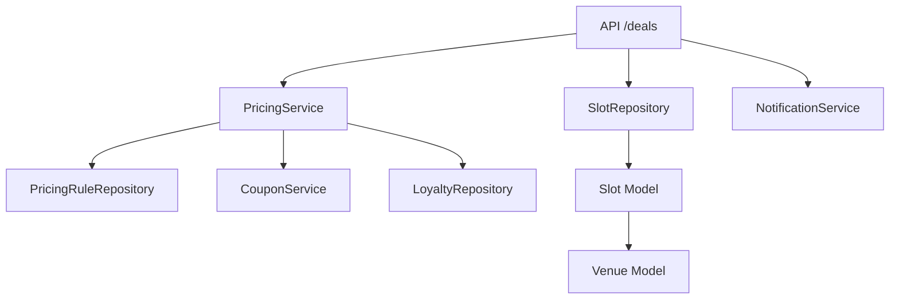
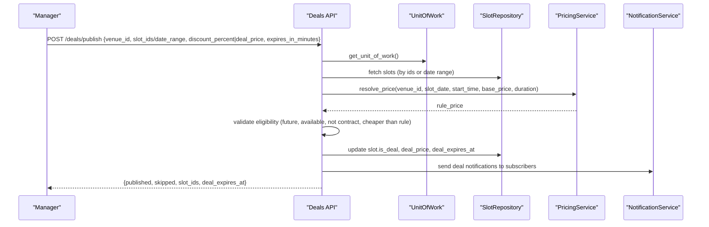
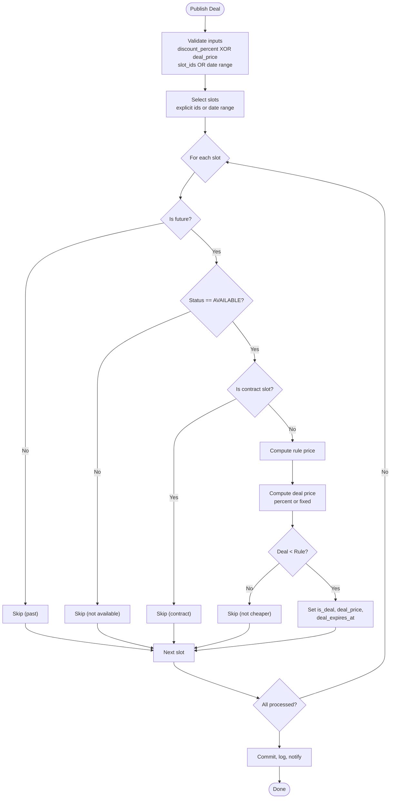
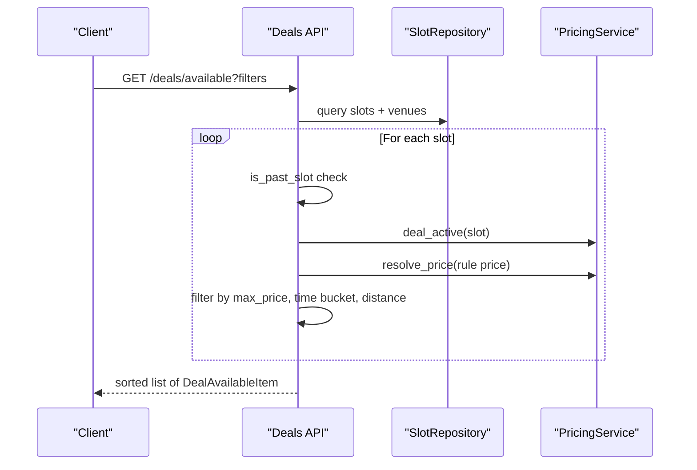
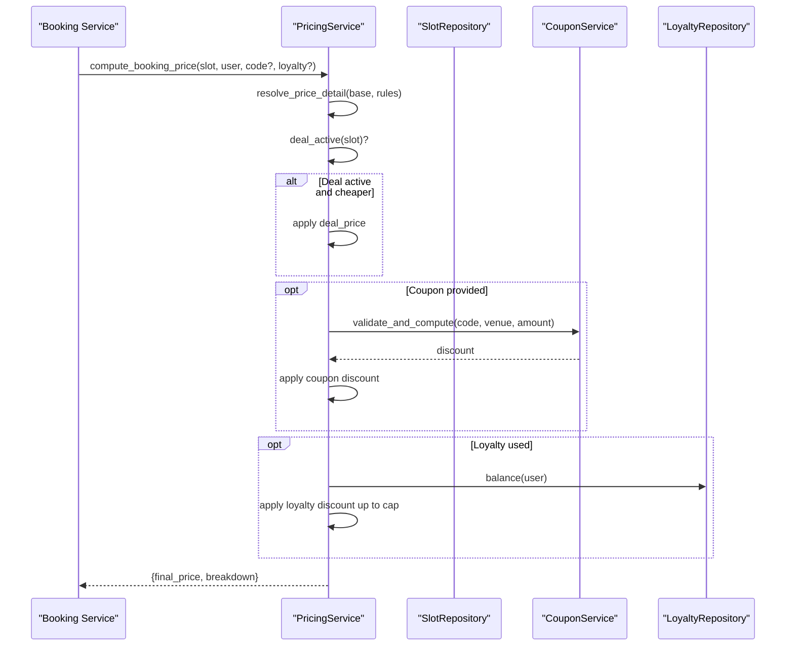
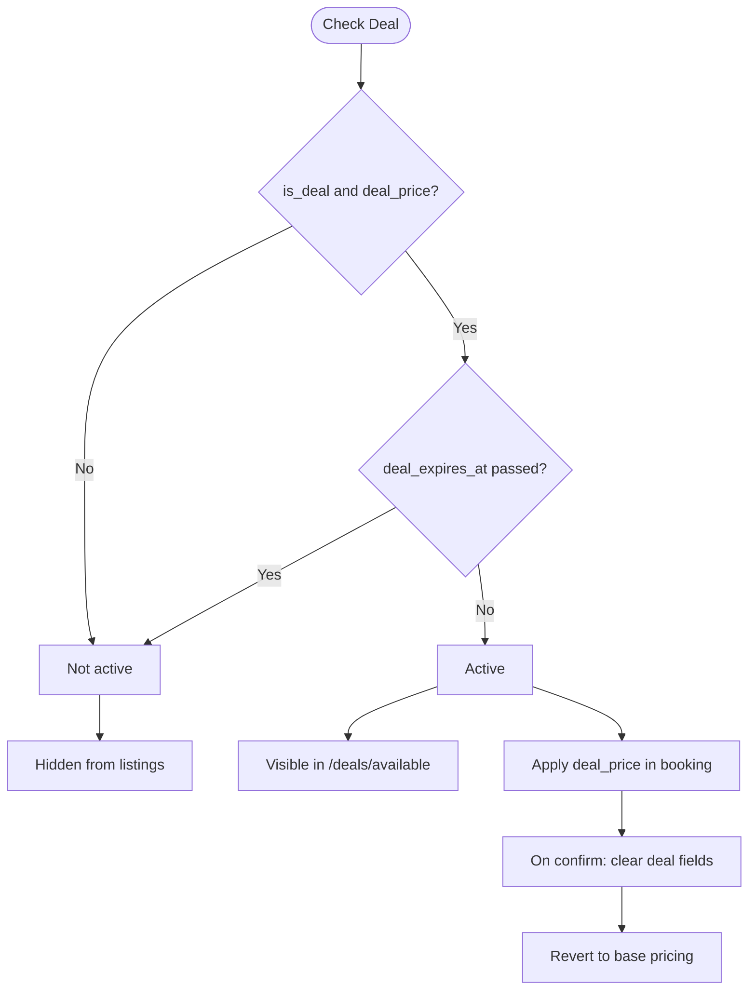
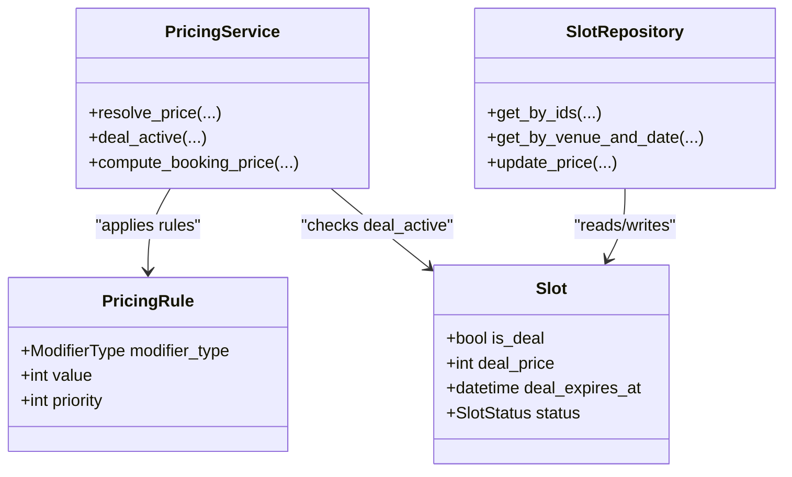

# Deal Slots & Dynamic Pricing

<cite>
**Referenced Files in This Document**
- [slot.py](file://app/models/slot.py)
- [deal.py](file://app/schemas/deal.py)
- [deals.py](file://app/api/v1/deals.py)
- [pricing_service.py](file://app/services/pricing_service.py)
- [pricing_rule.py](file://app/models/pricing_rule.py)
- [slot_repository.py](file://app/repositories/slot_repository.py)
- [time_guard.py](file://app/utils/time_guard.py)
- [test_deals.py](file://tests/test_deals.py)
</cite>

## Table of Contents
1. [Introduction](#introduction)
2. [Project Structure](#project-structure)
3. [Core Components](#core-components)
4. [Architecture Overview](#architecture-overview)
5. [Detailed Component Analysis](#detailed-component-analysis)
6. [Dependency Analysis](#dependency-analysis)
7. [Performance Considerations](#performance-considerations)
8. [Troubleshooting Guide](#troubleshooting-guide)
9. [Conclusion](#conclusion)

## Introduction
This document explains the deal slots and dynamic pricing features that enable last-minute discount offers for futsal venue slots. It covers:
- The is_deal flag and deal_price fields on slots that mark discounted “open-slot” deals
- The deal expiration mechanism via deal_expires_at timestamps
- How deals automatically revert to base pricing when expired or after booking confirmation
- Integration with the pricing engine to compute discounted rates and apply promotional rules
- Business logic for creating, managing, and expiring deal slots
- Examples of deal creation workflows, pricing calculations, and interactions with other slot statuses

## Project Structure
The deal system spans models, schemas, API endpoints, services, repositories, and utilities:
- Data model: Slot includes deal-related fields (is_deal, deal_price, deal_expires_at)
- Schemas: Request/response contracts for publishing deals and listing available deals
- API: Endpoints to publish/unpublish deals and list active deals
- Service: PricingService computes final prices, applies deal discounts, coupons, and loyalty
- Repository: SlotRepository provides queries and updates for slots
- Utilities: time_guard ensures past slots cannot be modified or booked

**Diagram sources**
- [deals.py:44-146](file://app/api/v1/deals.py#L44-L146)
- [pricing_service.py:94-229](file://app/services/pricing_service.py#L94-L229)
- [slot_repository.py:10-145](file://app/repositories/slot_repository.py#L10-L145)
- [slot.py:13-42](file://app/models/slot.py#L13-L42)

**Section sources**
- [slot.py:13-42](file://app/models/slot.py#L13-L42)
- [deal.py:7-36](file://app/schemas/deal.py#L7-L36)
- [deals.py:44-261](file://app/api/v1/deals.py#L44-L261)
- [pricing_service.py:44-244](file://app/services/pricing_service.py#L44-L244)
- [slot_repository.py:10-145](file://app/repositories/slot_repository.py#L10-L145)
- [time_guard.py:12-22](file://app/utils/time_guard.py#L12-L22)

## Core Components
- Slot model adds deal fields:
  - is_deal: boolean flag indicating a slot is part of a last-minute deal
  - deal_price: optional integer price for the deal
  - deal_expires_at: optional datetime marking when the deal expires
- Deal schemas define:
  - DealPublishRequest: supports either discount_percent or deal_price, plus date range or explicit slot_ids, and optional expires_in_minutes
  - DealPublishResponse: returns published count, skipped count, affected slot_ids, and deal_expires_at
  - DealAvailableItem: exposes original price, deal price, savings, discount percent, and expiry
- Deals API:
  - POST /deals/publish: validates inputs, selects eligible slots, computes deal price vs rule price, sets deal flags and expiry, logs security event, commits, and notifies subscribers
  - GET /deals/available: lists active deals with filters (venue, time bucket, max price, distance), enforces deal_active and future-time checks, sorts results
  - PUT/GET /deals/subscription: manage user notification preferences
  - DELETE /deals/{slot_id}/unpublish: clears deal flags and expiry
- PricingService:
  - resolve_price_detail: applies venue base price and active pricing rules to compute rule-based price
  - deal_active: checks is_deal, deal_price presence, and deal_expires_at against current time
  - compute_booking_price: orchestrates base → rules → deal → coupon → loyalty → payable; returns breakdown and totals

**Section sources**
- [slot.py:13-42](file://app/models/slot.py#L13-L42)
- [deal.py:7-36](file://app/schemas/deal.py#L7-L36)
- [deals.py:44-261](file://app/api/v1/deals.py#L44-L261)
- [pricing_service.py:94-229](file://app/services/pricing_service.py#L94-L229)

## Architecture Overview
Deals are published by venue managers onto eligible future AVAILABLE slots. The system enforces business rules (future time, not contract-bound, cheaper than rule price). When a deal is active, it reduces the effective price during booking. After booking confirmation, deal flags are cleared so the slot reverts to base pricing. Expiration is enforced at query and booking time.

**Diagram sources**
- [deals.py:44-146](file://app/api/v1/deals.py#L44-L146)
- [pricing_service.py:126-132](file://app/services/pricing_service.py#L126-L132)
- [slot_repository.py:20-38](file://app/repositories/slot_repository.py#L20-L38)

**Section sources**
- [deals.py:44-146](file://app/api/v1/deals.py#L44-L146)
- [pricing_service.py:126-132](file://app/services/pricing_service.py#L126-L132)

## Detailed Component Analysis

### Deal Publishing Workflow
- Input validation:
  - Only one of discount_percent or deal_price must be provided
  - Either slot_ids or a valid date range must be provided
  - Date range must be valid (date_from <= date_to)
- Slot selection:
  - If slot_ids provided, fetch those slots; else iterate dates and collect venue slots
- Eligibility per slot:
  - Not past (using time_guard)
  - Status must be AVAILABLE
  - Must not be contract-bound
  - Computed deal price must be strictly less than rule-based price
- Deal application:
  - Compute deal price from discount_percent or use explicit deal_price
  - Enforce minimum floor (at least 1)
  - Set is_deal = True, deal_price, deal_expires_at (if expires_in_minutes provided)
- Post-publish:
  - Log security event
  - Commit transaction
  - Notify users who favorited the venue and have notify_deals enabled

**Diagram sources**
- [deals.py:44-146](file://app/api/v1/deals.py#L44-L146)
- [time_guard.py:19-22](file://app/utils/time_guard.py#L19-L22)
- [pricing_service.py:126-132](file://app/services/pricing_service.py#L126-L132)

**Section sources**
- [deals.py:44-146](file://app/api/v1/deals.py#L44-L146)
- [time_guard.py:19-22](file://app/utils/time_guard.py#L19-L22)

### Listing Active Deals
- Filters:
  - is_deal = True, status = AVAILABLE, slot_date >= today
  - Optional venue_id filter
  - Optional max_price filter
  - Optional time_of_day bucket (morning/afternoon/evening)
  - Optional geospatial radius using venue coordinates
- Validation:
  - Exclude past slots
  - Ensure deal_active (checks deal_expires_at)
  - Recompute rule price and ensure deal_price < rule_price
- Sorting:
  - price_asc, price_desc, distance, time

**Diagram sources**
- [deals.py:197-261](file://app/api/v1/deals.py#L197-L261)
- [pricing_service.py:136-143](file://app/services/pricing_service.py#L136-L143)
- [pricing_service.py:126-132](file://app/services/pricing_service.py#L126-L132)

**Section sources**
- [deals.py:197-261](file://app/api/v1/deals.py#L197-L261)

### Booking Flow with Deal Pricing
- compute_booking_price orchestrates:
  - Base price from slot.base_price
  - Apply pricing rules to get rule price
  - Apply server adjustments (current_price if lower)
  - Apply deal discount if deal_active and cheaper
  - Apply coupon discount if provided
  - Apply loyalty points redemption if requested
  - Return final payable price and breakdown

**Diagram sources**
- [pricing_service.py:147-229](file://app/services/pricing_service.py#L147-L229)
- [pricing_service.py:94-132](file://app/services/pricing_service.py#L94-L132)

**Section sources**
- [pricing_service.py:147-229](file://app/services/pricing_service.py#L147-L229)

### Deal Expiration and Reversion
- Expiration check:
  - deal_active returns False if deal_expires_at is set and current time >= expiry
- Visibility:
  - Expired deals are hidden from /deals/available
- Booking behavior:
  - Expired deals do not apply; booking uses rule price
- Reversion:
  - On successful booking confirmation, deal flags are cleared (is_deal=False, deal_price=None, deal_expires_at=None), reverting to base pricing

**Diagram sources**
- [pricing_service.py:136-143](file://app/services/pricing_service.py#L136-L143)
- [deals.py:197-261](file://app/api/v1/deals.py#L197-L261)
- [test_deals.py:233-259](file://tests/test_deals.py#L233-L259)

**Section sources**
- [pricing_service.py:136-143](file://app/services/pricing_service.py#L136-L143)
- [deals.py:197-261](file://app/api/v1/deals.py#L197-L261)
- [test_deals.py:233-259](file://tests/test_deals.py#L233-L259)

### Unpublishing Deals
- Endpoint: DELETE /deals/{slot_id}/unpublish
- Behavior:
  - Requires venue permission
  - Ensures slot has an active deal
  - Clears is_deal, deal_price, deal_expires_at
  - Logs security event and commits

**Section sources**
- [deals.py:171-194](file://app/api/v1/deals.py#L171-L194)

### Deal Subscription and Notifications
- Users can subscribe to deal notifications per venue via favorite + notify_deals flag
- On publish, fan-out notifications to subscribed users for that venue

**Section sources**
- [deals.py:132-146](file://app/api/v1/deals.py#L132-L146)
- [deals.py:149-168](file://app/api/v1/deals.py#L149-L168)

## Dependency Analysis
- API depends on:
  - UnitOfWork for session management
  - SlotRepository for slot queries/updates
  - PricingService for rule-based pricing and deal activation
  - NotificationService for fan-out
  - time_guard for past-slot checks
- PricingService depends on:
  - PricingRuleRepository for active rules
  - CouponService for coupon discounts
  - LoyaltyRepository for loyalty redemption
- Models:
  - Slot references Venue and relationships to bookings, competitions, contracts
  - PricingRule defines modifier types and matching criteria

**Diagram sources**
- [slot.py:13-42](file://app/models/slot.py#L13-L42)
- [pricing_service.py:94-229](file://app/services/pricing_service.py#L94-L229)
- [slot_repository.py:10-145](file://app/repositories/slot_repository.py#L10-L145)
- [pricing_rule.py:26-47](file://app/models/pricing_rule.py#L26-L47)

**Section sources**
- [slot.py:13-42](file://app/models/slot.py#L13-L42)
- [pricing_service.py:94-229](file://app/services/pricing_service.py#L94-L229)
- [slot_repository.py:10-145](file://app/repositories/slot_repository.py#L10-L145)
- [pricing_rule.py:26-47](file://app/models/pricing_rule.py#L26-L47)

## Performance Considerations
- Batch fetching:
  - Use get_by_ids to avoid N+1 queries when publishing deals across multiple slots
- Filtering efficiency:
  - Early filtering on status, date, and past checks reduces processing overhead
- Pricing computation:
  - resolve_price_detail applies only active rules; keep rule sets minimal and well-indexed
- Concurrency:
  - Booking flow uses locking mechanisms elsewhere to prevent oversell; deal availability relies on slot status changes upon pending booking
- Geospatial filtering:
  - Distance calculation is applied post-query; consider limiting result sets before computing distances

[No sources needed since this section provides general guidance]

## Troubleshooting Guide
Common issues and resolutions:
- Publishing fails with “must provide discount_percent or deal_price”:
  - Ensure exactly one of discount_percent or deal_price is set
- Publishing fails with “slot_ids or date range required”:
  - Provide either explicit slot_ids or a valid date range
- Publishing rejects slot as “past”:
  - Use time_guard to verify slot is in the future
- Publishing rejects slot as “not available”:
  - Slot must be AVAILABLE; blocked/reserved/booked slots cannot be dealt
- Publishing rejects slot as “cheaper than rule price”:
  - Deal price must be strictly less than rule-based price; adjust discount or deal_price
- Deal not visible in listings:
  - Check deal_active: ensure deal_expires_at is not passed and slot is future and AVAILABLE
- Booking does not apply deal:
  - Verify deal_active and that deal_price < rule price; expired deals do not apply
- Oversell attempts:
  - Second booking attempt should fail due to slot status change to BOOKED after first pending booking

**Section sources**
- [deals.py:44-146](file://app/api/v1/deals.py#L44-L146)
- [deals.py:197-261](file://app/api/v1/deals.py#L197-L261)
- [pricing_service.py:136-143](file://app/services/pricing_service.py#L136-L143)
- [test_deals.py:99-158](file://tests/test_deals.py#L99-L158)
- [test_deals.py:208-259](file://tests/test_deals.py#L208-L259)

## Conclusion
The deal system enables controlled, time-bound discounts on future AVAILABLE slots through explicit deal flags and pricing integration. Managers can publish deals with percentage or fixed pricing, subject to strict eligibility and rule-based comparisons. The pricing engine ensures consistent, auditable pricing by applying rules, then deals, then coupons and loyalty. Deals expire gracefully and revert to base pricing after booking confirmation or expiration, ensuring accurate revenue accounting and preventing misuse.

[No sources needed since this section summarizes without analyzing specific files]