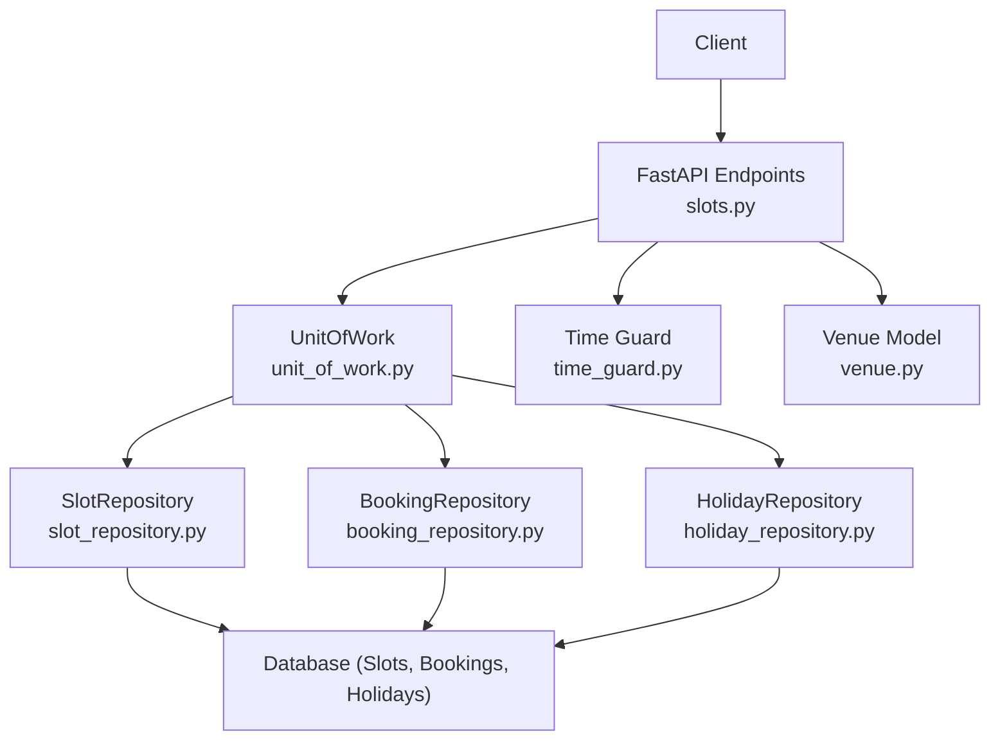
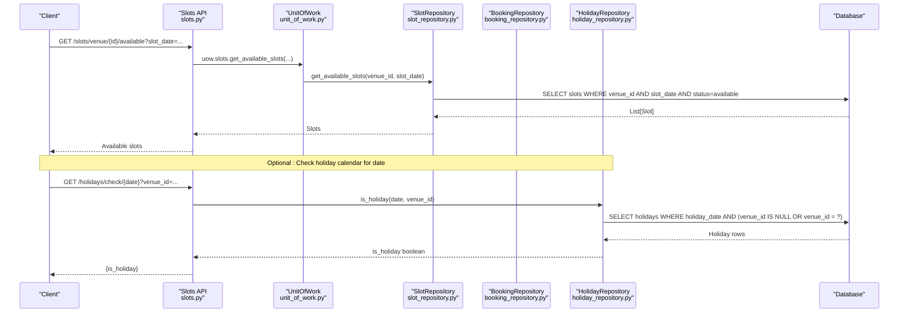
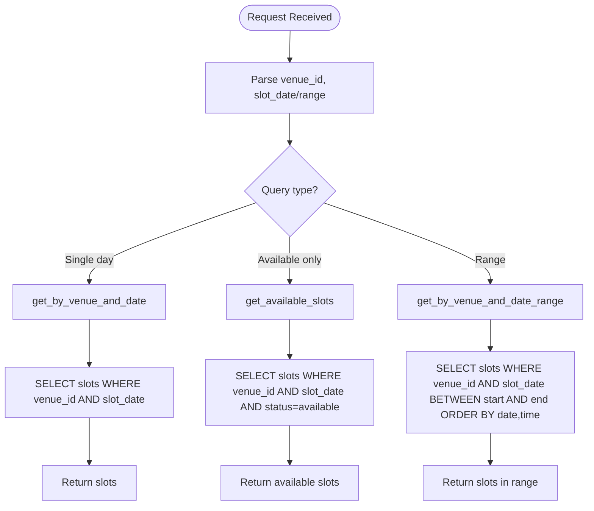
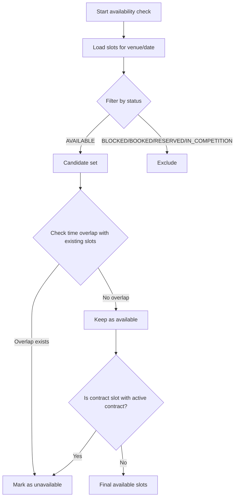
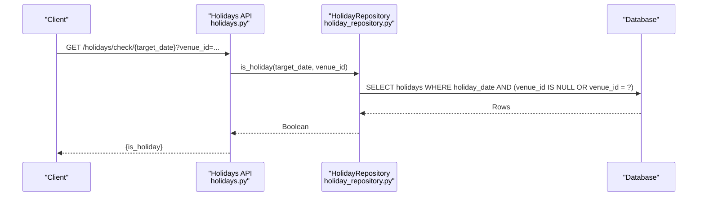
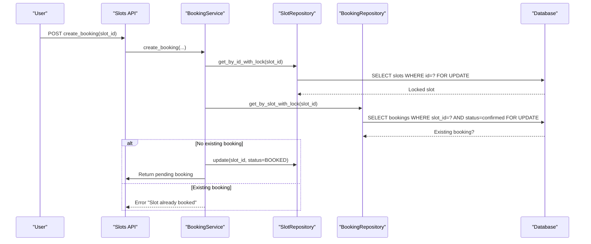
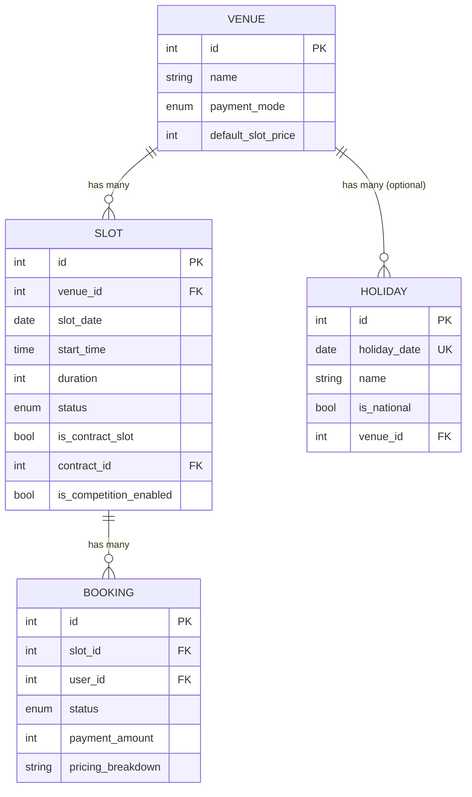
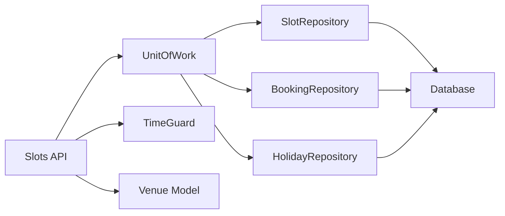

# Real-time Availability Checking

<cite>
**Referenced Files in This Document**
- [slots.py](file://app/api/v1/slots.py)
- [slot_repository.py](file://app/repositories/slot_repository.py)
- [booking_service.py](file://app/services/booking_service.py)
- [booking_repository.py](file://app/repositories/booking_repository.py)
- [slot.py](file://app/models/slot.py)
- [booking.py](file://app/models/booking.py)
- [holiday.py](file://app/models/holiday.py)
- [holiday_repository.py](file://app/repositories/holiday_repository.py)
- [holidays.py](file://app/api/v1/holidays.py)
- [time_guard.py](file://app/utils/time_guard.py)
- [unit_of_work.py](file://app/unit_of_work.py)
- [venue.py](file://app/models/venue.py)
</cite>

## Table of Contents
1. [Introduction](#introduction)
2. [Project Structure](#project-structure)
3. [Core Components](#core-components)
4. [Architecture Overview](#architecture-overview)
5. [Detailed Component Analysis](#detailed-component-analysis)
6. [Dependency Analysis](#dependency-analysis)
7. [Performance Considerations](#performance-considerations)
8. [Troubleshooting Guide](#troubleshooting-guide)
9. [Conclusion](#conclusion)

## Introduction
This document explains how the system provides real-time slot availability for venues, including querying by venue and date range, filtering by time preferences, integrating with holiday calendars to exclude non-working periods, and ensuring safe concurrent access to prevent double bookings under high traffic. It also details the availability calculation algorithm, error handling strategies, and performance optimizations such as database indexing, efficient queries, and locking mechanisms.

## Project Structure
The availability feature spans API endpoints, repositories, services, models, and utilities:
- API layer exposes endpoints to list slots, available slots, and manage block/unblock operations.
- Repository layer implements efficient queries and concurrency-safe reads/writes.
- Service layer orchestrates booking workflows and integrates pricing and promotions.
- Models define entities like Slot, Booking, Holiday, and Venue.
- Utilities provide time guards and shared helpers.
- Unit of Work coordinates sessions and repository instances within a transactional boundary.



**Diagram sources**
- [slots.py:15-56](file://app/api/v1/slots.py#L15-L56)
- [slot_repository.py:27-46](file://app/repositories/slot_repository.py#L27-L46)
- [booking_repository.py:20-35](file://app/repositories/booking_repository.py#L20-L35)
- [holiday_repository.py:16-41](file://app/repositories/holiday_repository.py#L16-L41)
- [time_guard.py:19-22](file://app/utils/time_guard.py#L19-L22)
- [venue.py:16-35](file://app/models/venue.py#L16-L35)

**Section sources**
- [slots.py:15-56](file://app/api/v1/slots.py#L15-L56)
- [unit_of_work.py:38-106](file://app/unit_of_work.py#L38-L106)

## Core Components
- Slot model defines slot states and relationships, including contract and competition flags.
- SlotRepository provides query methods for availability, conflict checks, blocking, releasing, and analytics.
- BookingService enforces business rules during booking creation and confirmation, using locks to avoid race conditions.
- BookingRepository offers locked reads for existing bookings on a slot.
- HolidayRepository and Holiday model support global or venue-specific holidays that influence availability logic.
- TimeGuard ensures past slots cannot be modified and helps compute start times consistently.
- UnitOfWork manages session lifecycle and repository access within transactions.

**Section sources**
- [slot.py:6-42](file://app/models/slot.py#L6-L42)
- [slot_repository.py:15-135](file://app/repositories/slot_repository.py#L15-L135)
- [booking_service.py:27-109](file://app/services/booking_service.py#L27-L109)
- [booking_repository.py:20-35](file://app/repositories/booking_repository.py#L20-L35)
- [holiday.py:16-24](file://app/models/holiday.py#L16-L24)
- [holiday_repository.py:16-41](file://app/repositories/holiday_repository.py#L16-L41)
- [time_guard.py:12-22](file://app/utils/time_guard.py#L12-L22)
- [unit_of_work.py:38-106](file://app/unit_of_work.py#L38-L106)

## Architecture Overview
Real-time availability checking follows a layered flow:
- Clients request available slots via FastAPI endpoints.
- The endpoint delegates to the Unit of Work to access repositories.
- SlotRepository executes optimized queries filtered by venue and date; it can return all slots or only available ones.
- For booking attempts, BookingService uses database-level row locks to prevent double booking.
- HolidayRepository can be used to check if a date is a holiday (global or venue-specific), which can inform UI or pre-checks before slot generation or booking.
- TimeGuard prevents modifications to past slots and normalizes time comparisons.



**Diagram sources**
- [slots.py:24-31](file://app/api/v1/slots.py#L24-L31)
- [slot_repository.py:40-46](file://app/repositories/slot_repository.py#L40-L46)
- [holidays.py:127-140](file://app/api/v1/holidays.py#L127-L140)
- [holiday_repository.py:16-29](file://app/repositories/holiday_repository.py#L16-L29)

**Section sources**
- [slots.py:24-31](file://app/api/v1/slots.py#L24-L31)
- [slot_repository.py:40-46](file://app/repositories/slot_repository.py#L40-L46)
- [holidays.py:127-140](file://app/api/v1/holidays.py#L127-L140)
- [holiday_repository.py:16-29](file://app/repositories/holiday_repository.py#L16-L29)

## Detailed Component Analysis

### Availability Querying by Venue and Date Range
- Endpoint GET /slots/venue/{venue_id} returns all slots for a specific date.
- Endpoint GET /slots/venue/{venue_id}/available filters by AVAILABLE status.
- Endpoint GET /slots/venue/{venue_id}/range supports date ranges for broader views.
- Repository methods use direct SQLModel queries with filters on venue_id, slot_date, and status, ordered by date and start_time for consistent presentation.



**Diagram sources**
- [slots.py:15-56](file://app/api/v1/slots.py#L15-L56)
- [slot_repository.py:27-38](file://app/repositories/slot_repository.py#L27-L38)

**Section sources**
- [slots.py:15-56](file://app/api/v1/slots.py#L15-L56)
- [slot_repository.py:27-38](file://app/repositories/slot_repository.py#L27-L38)

### Availability Calculation Algorithm
- Availability is determined by slot status: only AVAILABLE slots are considered bookable.
- Conflict detection considers overlapping time windows based on each slot’s duration.
- Contract slots linked to active contracts are excluded from user booking even if marked AVAILABLE.
- Past slots are protected from modification via TimeGuard.



**Diagram sources**
- [slot_repository.py:77-97](file://app/repositories/slot_repository.py#L77-L97)
- [booking_service.py:41-67](file://app/services/booking_service.py#L41-L67)
- [time_guard.py:19-22](file://app/utils/time_guard.py#L19-L22)

**Section sources**
- [slot_repository.py:77-97](file://app/repositories/slot_repository.py#L77-L97)
- [booking_service.py:41-67](file://app/services/booking_service.py#L41-L67)
- [time_guard.py:19-22](file://app/utils/time_guard.py#L19-L22)

### Integration with Holiday Calendars
- Holiday model supports global (venue_id null) or venue-specific entries.
- HolidayRepository queries holidays for a given date and optional venue scope.
- API exposes a check endpoint to determine if a date is a holiday for a venue.
- While availability endpoints do not automatically filter out holiday dates, clients can use the holiday check to inform UI or pre-validation before generating or presenting slots.



**Diagram sources**
- [holidays.py:127-140](file://app/api/v1/holidays.py#L127-L140)
- [holiday_repository.py:16-29](file://app/repositories/holiday_repository.py#L16-L29)

**Section sources**
- [holiday.py:16-24](file://app/models/holiday.py#L16-L24)
- [holiday_repository.py:16-41](file://app/repositories/holiday_repository.py#L16-L41)
- [holidays.py:127-140](file://app/api/v1/holidays.py#L127-L140)

### Concurrent Access Handling and Double-Booking Prevention
- Database-level row locks (SELECT ... FOR UPDATE) are used when reading slots and bookings to serialize concurrent writes.
- BookingService locks the target slot and checks for existing confirmed bookings before creating a pending booking.
- Pending bookings hold the slot status as BOOKED until manager confirmation or cancellation, preventing other users from booking the same slot concurrently.
- Confirming a pending booking re-validates slot state and locks again to ensure no race condition occurred between pending creation and confirmation.



**Diagram sources**
- [booking_service.py:41-67](file://app/services/booking_service.py#L41-L67)
- [booking_repository.py:20-26](file://app/repositories/booking_repository.py#L20-L26)
- [slot_repository.py:15-18](file://app/repositories/slot_repository.py#L15-L18)

**Section sources**
- [booking_service.py:41-67](file://app/services/booking_service.py#L41-L67)
- [booking_repository.py:20-26](file://app/repositories/booking_repository.py#L20-L26)
- [slot_repository.py:15-18](file://app/repositories/slot_repository.py#L15-L18)

### Block/Unblock Operations and Edge Cases
- Block endpoint validates permissions, ensures slot is AVAILABLE, and prevents blocking past slots.
- Unblock endpoint validates permissions and ensures slot is BLOCKED before releasing back to AVAILABLE.
- Contract slots cannot be manually blocked through this path; they are managed via contract flows.

```mermaid
flowchart TD
Start(["Block/Unblock Request"]) --> Load["Load slot by id"]
Load --> ValidatePerm{"Permission OK?"}
ValidatePerm --> |No| ErrPerm["HTTP 403/400"]
ValidatePerm --> |Yes| CheckState{"Current state valid?"}
CheckState --> |Past slot| ErrPast["HTTP 400: Cannot modify past slot"]
CheckState --> |Contract slot (block)| ErrContract["HTTP 400: Cannot block contract slot"]
CheckState --> |State mismatch| ErrState["HTTP 400: Invalid state transition"]
CheckState --> |OK| Update["Update status (BLOCKED/AVAILABLE)"]
Update --> Commit["Commit transaction"]
Commit --> Return["Return updated slot"]
```

**Diagram sources**
- [slots.py:68-111](file://app/api/v1/slots.py#L68-L111)
- [time_guard.py:19-22](file://app/utils/time_guard.py#L19-L22)

**Section sources**
- [slots.py:68-111](file://app/api/v1/slots.py#L68-L111)
- [time_guard.py:19-22](file://app/utils/time_guard.py#L19-L22)

### Data Models and Relationships
- Slot includes fields for venue association, scheduling attributes, pricing, status, and flags for contracts and competitions.
- Booking links to a slot and captures payment details, discounts, and receipt workflow.
- Holiday records capture dates and scope (global or venue-specific).
- Venue defines payment mode and default slot price used in slot generation and pricing.



**Diagram sources**
- [slot.py:13-42](file://app/models/slot.py#L13-L42)
- [booking.py:21-51](file://app/models/booking.py#L21-L51)
- [holiday.py:16-24](file://app/models/holiday.py#L16-L24)
- [venue.py:16-35](file://app/models/venue.py#L16-L35)

**Section sources**
- [slot.py:13-42](file://app/models/slot.py#L13-L42)
- [booking.py:21-51](file://app/models/booking.py#L21-L51)
- [holiday.py:16-24](file://app/models/holiday.py#L16-L24)
- [venue.py:16-35](file://app/models/venue.py#L16-L35)

## Dependency Analysis
- API endpoints depend on UnitOfWork to access repositories.
- Repositories depend on SQLAlchemy/SQLModel for queries and rely on indexes defined in models.
- BookingService depends on SlotRepository and BookingRepository for concurrency-safe operations.
- HolidayRepository is independent but often used alongside availability checks to inform UI or pre-validation.
- TimeGuard is a utility used across write paths to enforce temporal constraints.



**Diagram sources**
- [unit_of_work.py:38-106](file://app/unit_of_work.py#L38-L106)
- [slot_repository.py:1-18](file://app/repositories/slot_repository.py#L1-L18)
- [booking_repository.py:1-26](file://app/repositories/booking_repository.py#L1-L26)
- [holiday_repository.py:1-29](file://app/repositories/holiday_repository.py#L1-L29)
- [time_guard.py:12-22](file://app/utils/time_guard.py#L12-L22)
- [venue.py:16-35](file://app/models/venue.py#L16-L35)

**Section sources**
- [unit_of_work.py:38-106](file://app/unit_of_work.py#L38-L106)
- [slot_repository.py:1-18](file://app/repositories/slot_repository.py#L1-L18)
- [booking_repository.py:1-26](file://app/repositories/booking_repository.py#L1-L26)
- [holiday_repository.py:1-29](file://app/repositories/holiday_repository.py#L1-L29)
- [time_guard.py:12-22](file://app/utils/time_guard.py#L12-L22)
- [venue.py:16-35](file://app/models/venue.py#L16-L35)

## Performance Considerations
- Database Indexing:
  - Holiday model indexes holiday_date and venue_id to speed up holiday lookups by date and venue scope.
  - Venue model indexes name and category for faster listing and filtering.
- Efficient Filtering Algorithms:
  - Availability queries filter directly at the database level by venue_id, slot_date, and status to minimize payload and processing.
  - Conflict detection iterates over same-day slots and compares time windows using computed start/end times, avoiding unnecessary joins where possible.
- Concurrency Control:
  - Row-level locks (SELECT ... FOR UPDATE) on slots and bookings prevent race conditions during high-traffic booking scenarios.
  - Pending booking workflow holds slots as BOOKED until confirmation, reducing contention and ensuring consistency.
- Transaction Boundaries:
  - UnitOfWork encapsulates session management and commits/rollbacks, ensuring atomicity across multi-step operations.

[No sources needed since this section provides general guidance]

## Troubleshooting Guide
Common issues and their handling:
- Slot not found: When attempting to block/unblock or book a non-existent slot, a 404 error is raised.
- Invalid state transitions: Attempting to block an already booked or past slot raises a 400 error with descriptive detail.
- Past slot modification: TimeGuard prevents updates to slots whose start time has passed.
- Contract slot restrictions: Contract slots linked to active contracts cannot be manually blocked or booked; errors indicate contract-related restrictions.
- Duplicate booking prevention: If a confirmed booking exists for a slot, attempts to create another booking fail with a clear message.

**Section sources**
- [slots.py:61-111](file://app/api/v1/slots.py#L61-L111)
- [time_guard.py:19-22](file://app/utils/time_guard.py#L19-L22)
- [booking_service.py:41-67](file://app/services/booking_service.py#L41-L67)

## Conclusion
The system provides robust real-time slot availability checking through precise database queries, careful filtering, and strong concurrency controls. Holiday integration allows clients to consider non-working periods when presenting or validating availability. The combination of row-level locks, pending booking workflows, and time guards ensures data integrity and prevents double bookings under high load. Performance is optimized via indexed queries and efficient algorithms, while error handling covers edge cases to maintain a reliable user experience.