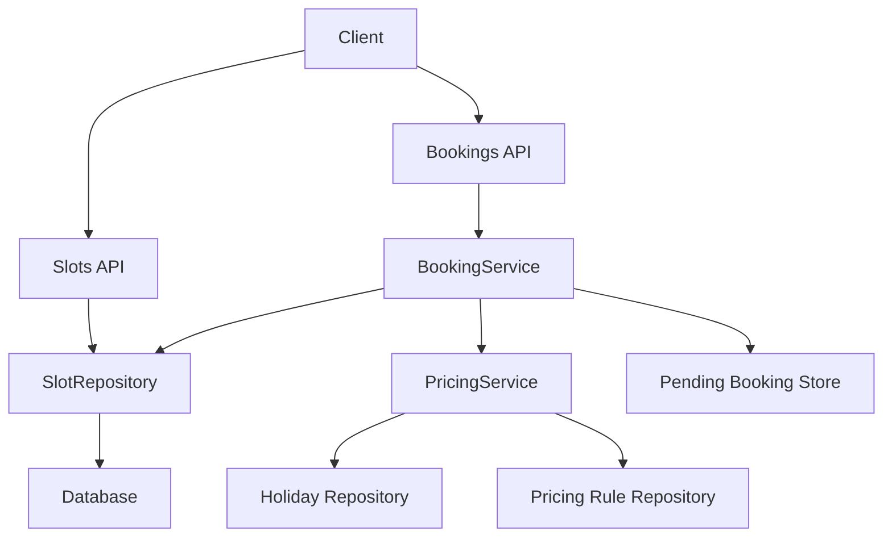
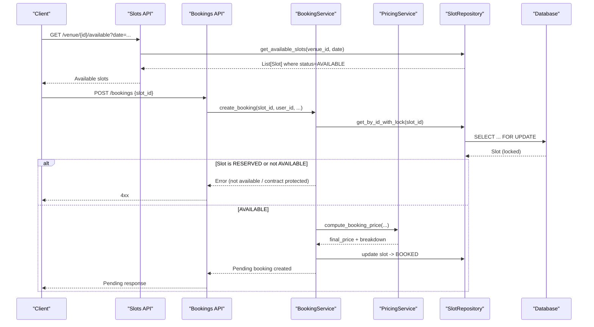
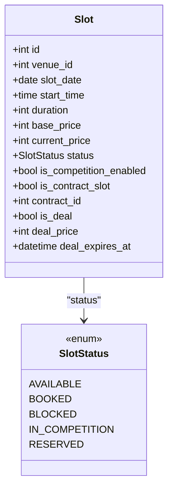
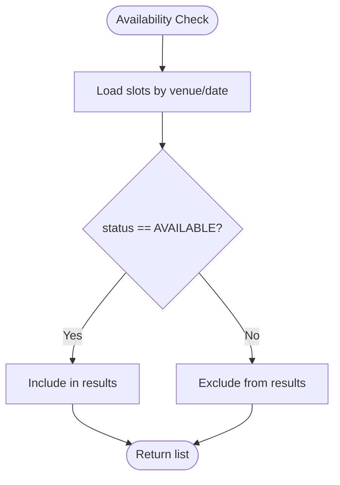
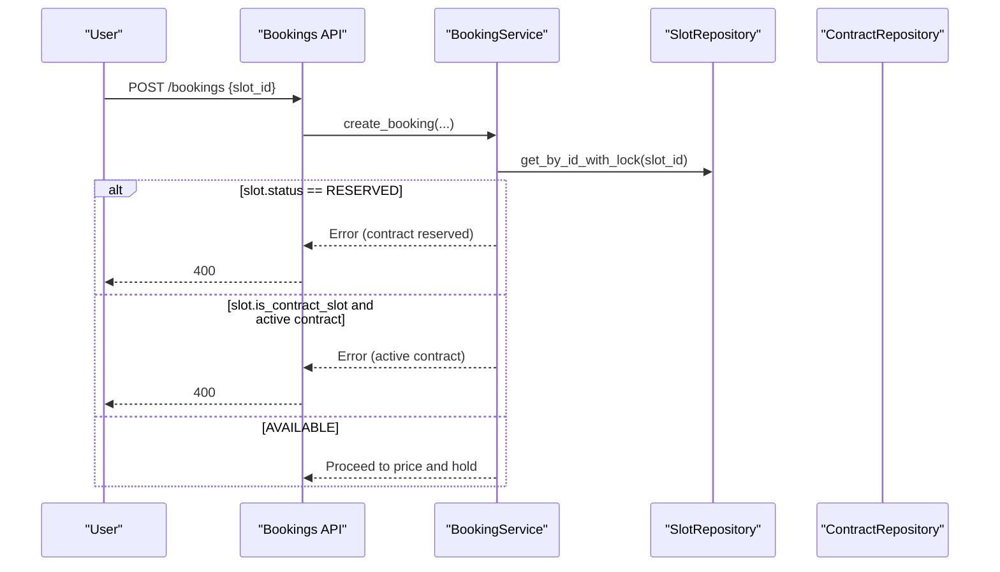
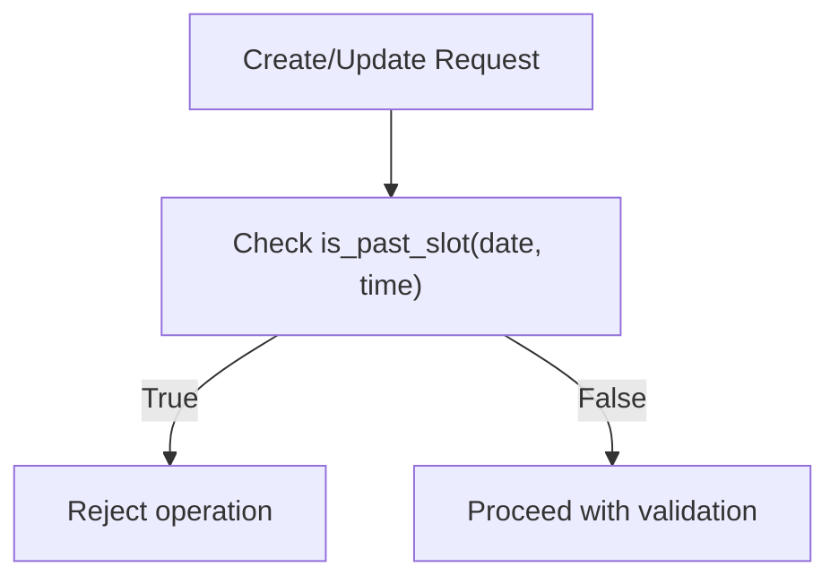
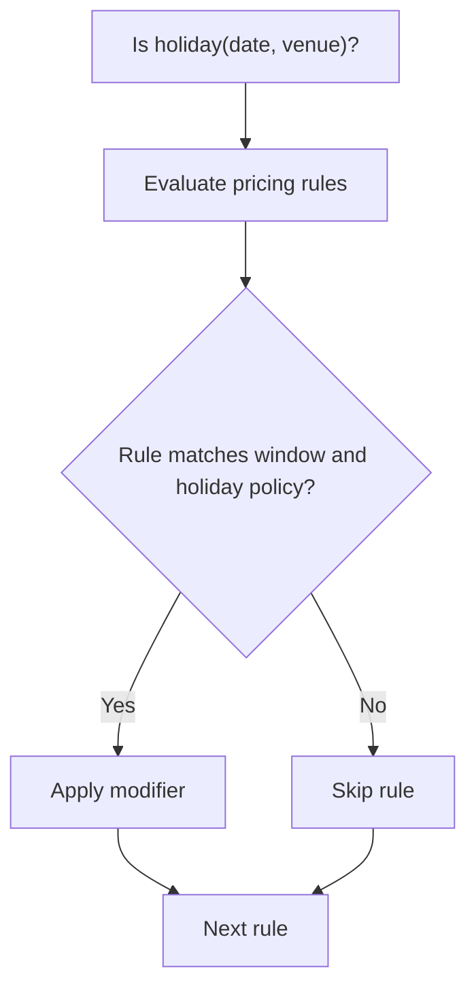
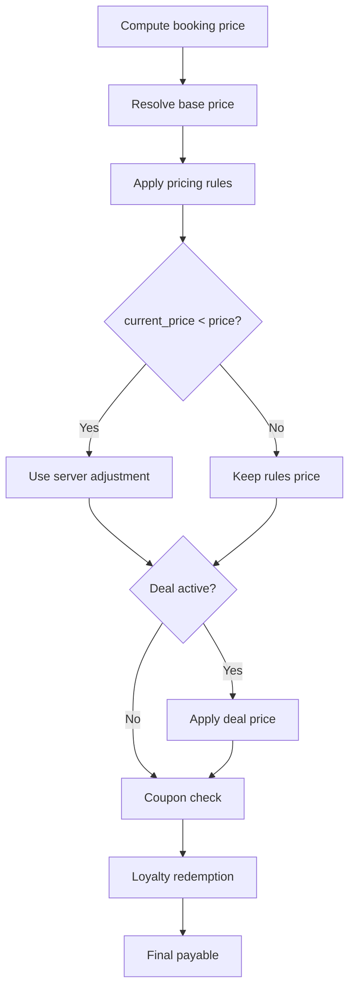
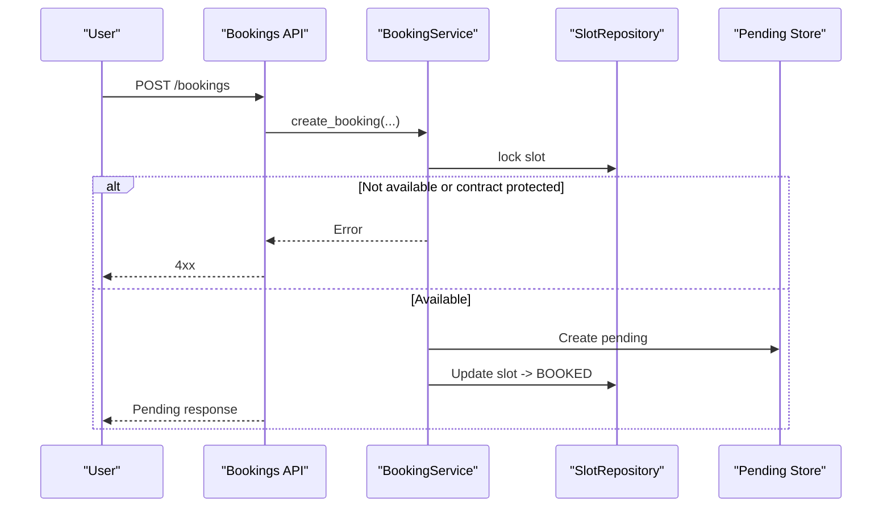
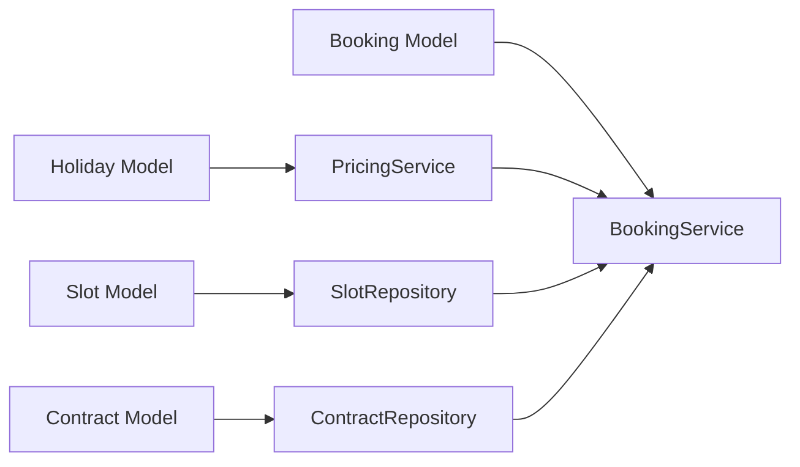

# Slot Status & Availability

<cite>
**Referenced Files in This Document**
- [slot.py](file://app/models/slot.py)
- [booking.py](file://app/models/booking.py)
- [contract.py](file://app/models/contract.py)
- [holiday.py](file://app/models/holiday.py)
- [slots.py](file://app/api/v1/slots.py)
- [bookings.py](file://app/api/v1/bookings.py)
- [slot_repository.py](file://app/repositories/slot_repository.py)
- [pricing_service.py](file://app/services/pricing_service.py)
- [booking_service.py](file://app/services/booking_service.py)
- [time_guard.py](file://app/utils/time_guard.py)
- [e5k005slotreserved.py](file://migrations/e5k005slotreserved.py)
</cite>

## Table of Contents
1. Introduction
2. Project Structure
3. Core Components
4. Architecture Overview
5. Detailed Component Analysis
6. Dependency Analysis
7. Performance Considerations
8. Troubleshooting Guide
9. Conclusion

## Introduction
This document explains slot status management and real-time availability checking for the booking system. It covers:
- The three primary slot statuses used by customers and managers: AVAILABLE (open for booking), BOOKED (pending manager approval), and RESERVED (contract-protected).
- Real-time availability checks, including contract slot protection that prevents regular bookings on reserved slots.
- Time-based availability logic, holiday exclusions, and venue-specific scheduling rules.
- Integration with the pricing engine for deal slots and last-minute offers.
- Database constraints, indexing strategies for performance, and caching mechanisms for availability queries.

## Project Structure
Slot availability spans models, repositories, services, and API endpoints:
- Models define slot states, booking lifecycle, contracts, and holidays.
- Repositories implement query logic, conflict detection, and locking.
- Services enforce business rules (pricing, booking flow, contract protection).
- APIs expose availability and booking operations to clients.

**Diagram sources**
- [slots.py:15-31](file://app/api/v1/slots.py#L15-L31)
- [bookings.py:191-237](file://app/api/v1/bookings.py#L191-L237)
- [slot_repository.py:40-97](file://app/repositories/slot_repository.py#L40-L97)
- [pricing_service.py:94-132](file://app/services/pricing_service.py#L94-L132)
- [booking_service.py:27-109](file://app/services/booking_service.py#L27-L109)

**Section sources**
- [slot.py:6-41](file://app/models/slot.py#L6-L41)
- [booking.py:7-51](file://app/models/booking.py#L7-L51)
- [contract.py:64-150](file://app/models/contract.py#L64-L150)
- [holiday.py:16-24](file://app/models/holiday.py#L16-L24)
- [slots.py:15-56](file://app/api/v1/slots.py#L15-L56)
- [bookings.py:191-237](file://app/api/v1/bookings.py#L191-L237)
- [slot_repository.py:40-97](file://app/repositories/slot_repository.py#L40-L97)
- [pricing_service.py:94-132](file://app/services/pricing_service.py#L94-L132)
- [booking_service.py:27-109](file://app/services/booking_service.py#L27-L109)

## Core Components
- Slot model defines statuses and attributes relevant to availability and pricing.
- Booking model captures booking lifecycle and receipt workflow.
- Contract models protect slots via a separate session layer and active contract checks.
- Holidays influence pricing rule application.
- Repositories provide availability queries, conflict checks, and row-level locking.
- Services orchestrate pricing, booking creation, and contract protection.
- APIs expose availability and booking endpoints with authorization and rate limiting.

Key responsibilities:
- AVAILABLE: open for booking; returned by available slots endpoint.
- BOOKED: pending manager approval; created during booking creation until confirmed or rejected.
- RESERVED: contract-protected; cannot be booked by regular users; restored when pending is rejected/cancelled.

**Section sources**
- [slot.py:6-41](file://app/models/slot.py#L6-L41)
- [booking.py:7-51](file://app/models/booking.py#L7-L51)
- [contract.py:64-150](file://app/models/contract.py#L64-L150)
- [holiday.py:16-24](file://app/models/holiday.py#L16-L24)
- [slot_repository.py:40-97](file://app/repositories/slot_repository.py#L40-L97)
- [pricing_service.py:94-132](file://app/services/pricing_service.py#L94-L132)
- [booking_service.py:27-109](file://app/services/booking_service.py#L27-L109)
- [slots.py:15-56](file://app/api/v1/slots.py#L15-L56)
- [bookings.py:191-237](file://app/api/v1/bookings.py#L191-L237)

## Architecture Overview
The availability and booking flow integrates multiple layers to ensure correctness under concurrency and complex pricing rules.

**Diagram sources**
- [slots.py:24-31](file://app/api/v1/slots.py#L24-L31)
- [slot_repository.py:40-46](file://app/repositories/slot_repository.py#L40-L46)
- [booking_service.py:27-109](file://app/services/booking_service.py#L27-L109)
- [pricing_service.py:147-229](file://app/services/pricing_service.py#L147-L229)
- [bookings.py:191-237](file://app/api/v1/bookings.py#L191-L237)

## Detailed Component Analysis

### Slot Status Model and Availability Semantics
- AVAILABLE: Open for booking; returned by availability endpoints.
- BOOKED: Created when a user attempts to book; held while awaiting manager approval. Prevents other users from booking the same slot due to locking and duplicate checks.
- RESERVED: Reserved for contract sessions; regular bookings are blocked even if status shows AVAILABLE in legacy data; migration backfills to RESERVED for active contracts.

**Diagram sources**
- [slot.py:6-41](file://app/models/slot.py#L6-L41)

**Section sources**
- [slot.py:6-41](file://app/models/slot.py#L6-L41)
- [e5k005slotreserved.py:30-67](file://migrations/e5k005slotreserved.py#L30-L67)

### Real-Time Availability Checking
- Availability endpoint returns slots filtered by venue and date with status AVAILABLE.
- Conflict detection considers overlapping time windows based on slot durations and excludes BLOCKED slots.
- Row-level locking (SELECT ... FOR UPDATE) ensures race-condition safety during booking creation.

**Diagram sources**
- [slot_repository.py:40-46](file://app/repositories/slot_repository.py#L40-L46)
- [slot_repository.py:77-97](file://app/repositories/slot_repository.py#L77-L97)

**Section sources**
- [slots.py:24-31](file://app/api/v1/slots.py#L24-L31)
- [slot_repository.py:40-46](file://app/repositories/slot_repository.py#L40-L46)
- [slot_repository.py:77-97](file://app/repositories/slot_repository.py#L77-L97)

### Contract Slot Protection (RESERVED)
- Regular bookings are blocked on slots marked as RESERVED.
- Even if a slot’s status is AVAILABLE, if it belongs to an active contract (via contract_id or contract_slots reference), booking is rejected.
- When a pending booking is rejected or cancelled, contract-protected slots are restored to RESERVED rather than AVAILABLE.

**Diagram sources**
- [booking_service.py:27-59](file://app/services/booking_service.py#L27-L59)
- [booking_service.py:119-147](file://app/services/booking_service.py#L119-L147)
- [bookings.py:134-155](file://app/api/v1/bookings.py#L134-L155)
- [bookings.py:164-183](file://app/api/v1/bookings.py#L164-L183)

**Section sources**
- [booking_service.py:27-59](file://app/services/booking_service.py#L27-L59)
- [booking_service.py:119-147](file://app/services/booking_service.py#L119-L147)
- [bookings.py:134-155](file://app/api/v1/bookings.py#L134-L155)
- [bookings.py:164-183](file://app/api/v1/bookings.py#L164-L183)
- [contract.py:64-150](file://app/models/contract.py#L64-L150)
- [e5k005slotreserved.py:30-67](file://migrations/e5k005slotreserved.py#L30-L67)

### Time-Based Availability Logic
- Past slots cannot be booked or modified; time guard functions determine if a slot has started.
- Duration-aware conflict checks prevent overlapping bookings within the same venue on the same day.

**Diagram sources**
- [time_guard.py:12-21](file://app/utils/time_guard.py#L12-L21)
- [slot_repository.py:137-144](file://app/repositories/slot_repository.py#L137-L144)
- [pricing_service.py:147-159](file://app/services/pricing_service.py#L147-L159)

**Section sources**
- [time_guard.py:12-21](file://app/utils/time_guard.py#L12-L21)
- [slot_repository.py:137-144](file://app/repositories/slot_repository.py#L137-L144)
- [pricing_service.py:147-159](file://app/services/pricing_service.py#L147-L159)

### Holiday Exclusions and Venue-Specific Rules
- Holidays affect pricing rule matching; rules can apply only on holidays or exclude holidays.
- Venue-specific holidays restrict rule application to specific venues.

**Diagram sources**
- [pricing_service.py:57-90](file://app/services/pricing_service.py#L57-L90)
- [holiday.py:16-24](file://app/models/holiday.py#L16-L24)

**Section sources**
- [pricing_service.py:57-90](file://app/services/pricing_service.py#L57-L90)
- [holiday.py:16-24](file://app/models/holiday.py#L16-L24)

### Pricing Engine Integration for Deal Slots and Last-Minute Offers
- Base price comes from venue defaults or configuration.
- Pricing rules modify base price based on time windows, weekdays, and holiday policies.
- Server adjustments (current_price) can reduce price but never increase it.
- Active deal slots offer discounted prices with expiration checks.
- Coupons and loyalty points further reduce payable amount.

**Diagram sources**
- [pricing_service.py:94-132](file://app/services/pricing_service.py#L94-L132)
- [pricing_service.py:136-143](file://app/services/pricing_service.py#L136-L143)
- [pricing_service.py:147-229](file://app/services/pricing_service.py#L147-L229)

**Section sources**
- [pricing_service.py:94-132](file://app/services/pricing_service.py#L94-L132)
- [pricing_service.py:136-143](file://app/services/pricing_service.py#L136-L143)
- [pricing_service.py:147-229](file://app/services/pricing_service.py#L147-L229)

### Booking Flow and Pending State
- Creating a booking locks the slot, validates availability and contract protection, computes price, marks slot as BOOKED, and creates a pending booking record.
- Manager confirmation converts pending to confirmed; rejection restores slot to AVAILABLE or RESERVED depending on contract association.
- Receipt workflows support bank receipts and in-person payments.

**Diagram sources**
- [booking_service.py:27-109](file://app/services/booking_service.py#L27-L109)
- [bookings.py:191-237](file://app/api/v1/bookings.py#L191-L237)

**Section sources**
- [booking_service.py:27-109](file://app/services/booking_service.py#L27-L109)
- [bookings.py:191-237](file://app/api/v1/bookings.py#L191-L237)

### Blocking and Unblocking Slots
- Managers can block/unblock future slots; contract slots cannot be manually blocked through this path.
- Past slots cannot be blocked/unblocked.

**Section sources**
- [slots.py:68-111](file://app/api/v1/slots.py#L68-L111)
- [slot_repository.py:126-135](file://app/repositories/slot_repository.py#L126-L135)

## Dependency Analysis
- Slot availability depends on Slot model status and repository queries.
- Booking creation depends on BookingService, which relies on SlotRepository for locking and updates, and PricingService for cost computation.
- Contract protection depends on Contract and ContractSlot models and their repositories.
- Pricing depends on Holiday and PricingRule repositories.

**Diagram sources**
- [slot_repository.py:40-97](file://app/repositories/slot_repository.py#L40-L97)
- [booking_service.py:27-109](file://app/services/booking_service.py#L27-L109)
- [pricing_service.py:94-132](file://app/services/pricing_service.py#L94-L132)
- [contract_repository.py:63-80](file://app/repositories/contract_repository.py#L63-L80)

**Section sources**
- [slot_repository.py:40-97](file://app/repositories/slot_repository.py#L40-L97)
- [booking_service.py:27-109](file://app/services/booking_service.py#L27-L109)
- [pricing_service.py:94-132](file://app/services/pricing_service.py#L94-L132)
- [contract_repository.py:63-80](file://app/repositories/contract_repository.py#L63-L80)

## Performance Considerations
- Indexing strategy:
  - Slots: indexes on venue_id, slot_date, and status improve availability queries and range scans.
  - Holidays: index on holiday_date and venue_id supports fast holiday checks per venue.
- Concurrency control:
  - Row-level locking (SELECT ... FOR UPDATE) prevents race conditions during booking creation.
  - Duplicate booking checks after locking avoid double bookings.
- Query optimization:
  - Batch loading of slots and venues reduces N+1 queries in enrichment flows.
  - Conflict detection uses efficient in-memory overlap checks after fetching same-day slots.
- Caching considerations:
  - Pending bookings are stored in Redis-like storage for fast listing and manager review; enrichments fetch related entities in batches.
  - Availability endpoints return pre-filtered lists; consider read replicas or cache layers for high-read scenarios.

[No sources needed since this section provides general guidance]

## Troubleshooting Guide
Common issues and resolutions:
- Slot already booked: Occurs when another user secured the slot concurrently; retry later or choose another slot.
- Slot not available: Indicates slot is not AVAILABLE or is past; verify time and status.
- Contract-protected slot: Attempting to book a RESERVED or contract-protected slot fails; contact venue staff or wait for contract session changes.
- Pending booking conflicts: If a pending booking is rejected or cancelled, the slot may revert to AVAILABLE or RESERVED; re-check availability before retrying.
- Receipt workflows: For bank receipts, ensure submission and manager approval; for in-person payments, confirm collection to finalize booking.

**Section sources**
- [booking_service.py:27-109](file://app/services/booking_service.py#L27-L109)
- [bookings.py:134-183](file://app/api/v1/bookings.py#L134-L183)
- [bookings.py:454-528](file://app/api/v1/bookings.py#L454-L528)

## Conclusion
The system enforces robust slot status management with clear semantics:
- AVAILABLE for open bookings,
- BOOKED for pending approvals,
- RESERVED for contract protection.

Real-time availability checks leverage database locking, conflict detection, and time guards. Pricing integration supports dynamic rules, deals, coupons, and loyalty points. Contract protection ensures contract sessions remain secure. Proper indexing and batch operations optimize performance, while pending booking storage enables efficient manager workflows.

[No sources needed since this section summarizes without analyzing specific files]