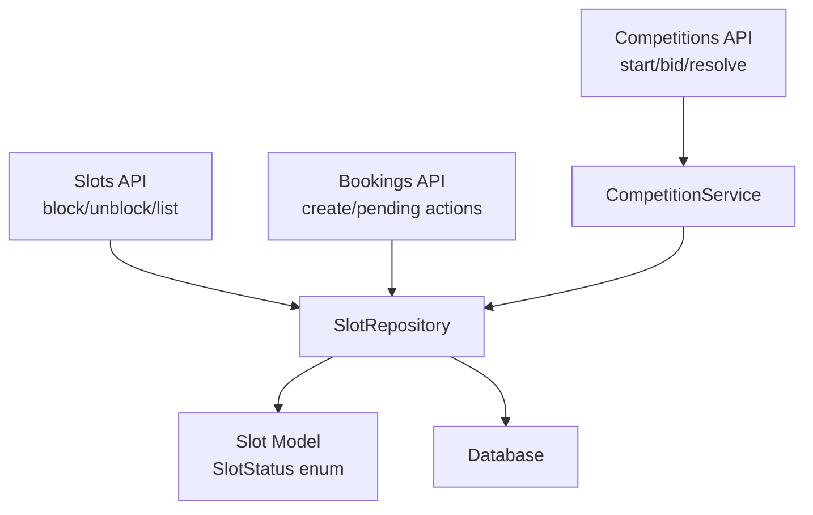
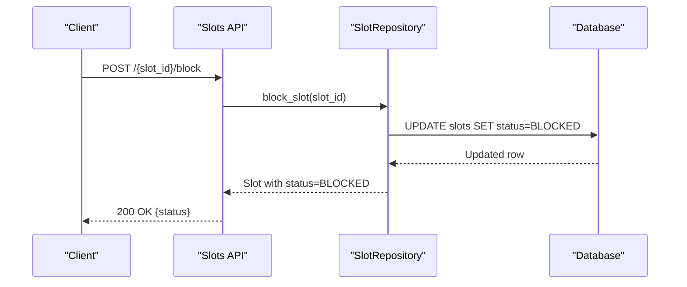
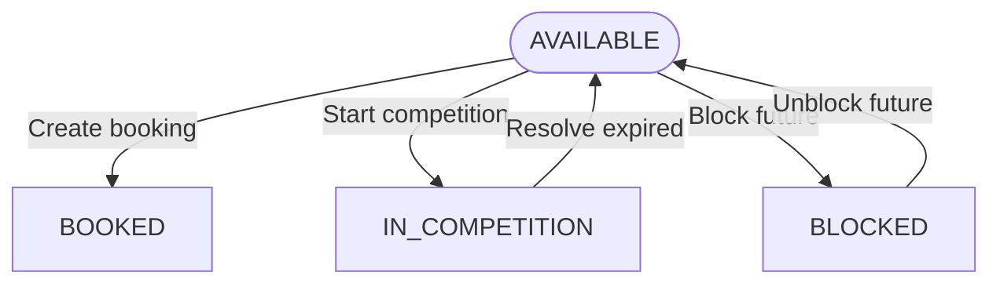
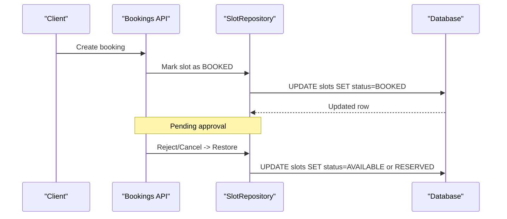
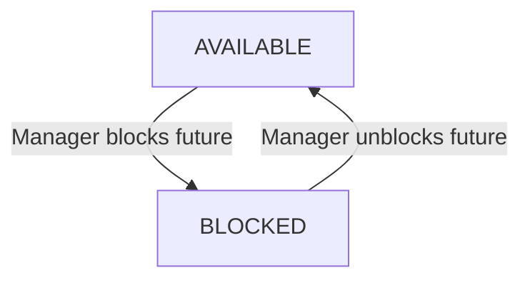
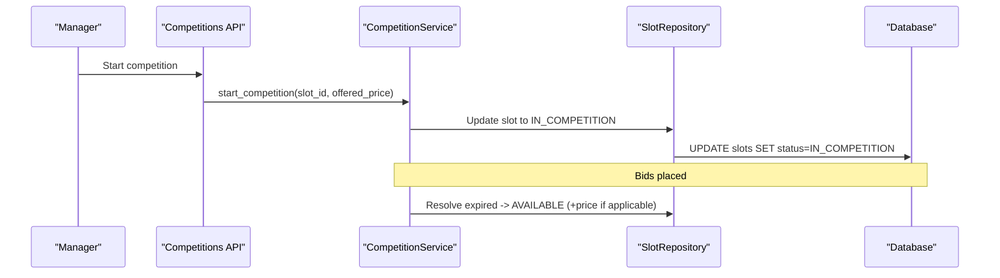
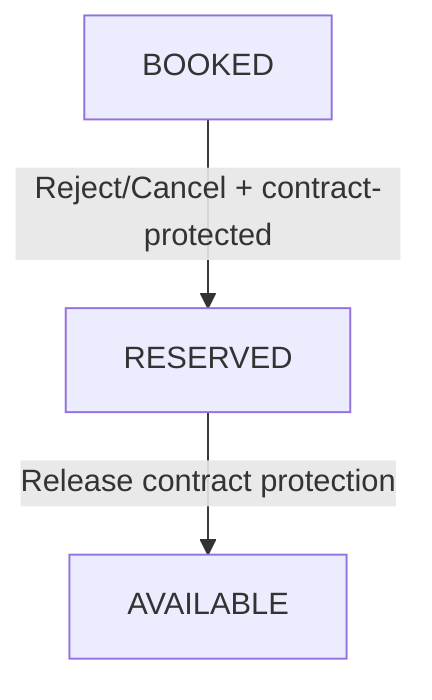
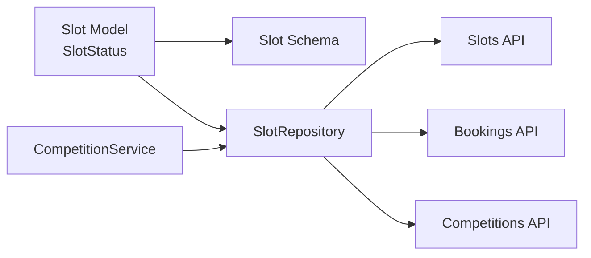

# Slot Status Types

<cite>
**Referenced Files in This Document**
- [slot.py](file://app/models/slot.py)
- [slot.py](file://app/schemas/slot.py)
- [slots.py](file://app/api/v1/slots.py)
- [slot_repository.py](file://app/repositories/slot_repository.py)
- [bookings.py](file://app/api/v1/bookings.py)
- [competition_service.py](file://app/services/competition_service.py)
- [competitions.py](file://app/api/v1/competitions.py)
- [contract.py](file://app/models/contract.py)
</cite>

## Table of Contents
1. Introduction
2. Project Structure
3. Core Components
4. Architecture Overview
5. Detailed Component Analysis
6. Dependency Analysis
7. Performance Considerations
8. Troubleshooting Guide
9. Conclusion

## Introduction
This document explains the five slot status types used by the futsal booking system and how they govern availability, transitions, and constraints. The statuses are:
- AVAILABLE: Open for regular bookings and price competition setup.
- BOOKED: A pending manager approval state during the booking workflow; not yet confirmed.
- BLOCKED: Temporarily unavailable (e.g., maintenance); cannot be booked or unblocked if past.
- IN_COMPETITION: Participating in a price competition; not bookable until resolved.
- RESERVED: Protected by contracts; reserved slots are treated as occupied for occupancy metrics but remain contract-protected.

The documentation covers business rules, transition conditions, API behaviors, repository logic, and database-level integrity enforced by models and schemas.

## Project Structure
Slot status is defined at the model layer and reused across schemas, APIs, and repositories. Key locations:
- Model enum and entity: app/models/slot.py
- Schemas exposing status to clients: app/schemas/slot.py
- Business endpoints controlling block/unblock and listing: app/api/v1/slots.py
- Repository methods that enforce transitions and queries: app/repositories/slot_repository.py
- Booking flow that temporarily marks slots as BOOKED and restores to AVAILABLE or RESERVED: app/api/v1/bookings.py
- Price competition flow that toggles IN_COMPETITION and resolves back to AVAILABLE: app/services/competition_service.py and app/api/v1/competitions.py
- Contract protection that can restore slots to RESERVED on cancellation/rejection: app/models/contract.py

**Diagram sources**
- [slots.py:15-112](file://app/api/v1/slots.py#L15-L112)
- [slot_repository.py:126-158](file://app/repositories/slot_repository.py#L126-L158)
- [bookings.py:140-186](file://app/api/v1/bookings.py#L140-L186)
- [competition_service.py:10-104](file://app/services/competition_service.py#L10-L104)
- [slot.py:6-11](file://app/models/slot.py#L6-L11)

**Section sources**
- [slot.py:6-11](file://app/models/slot.py#L6-L11)
- [slot.py:13-42](file://app/models/slot.py#L13-L42)
- [slot.py:1-43](file://app/schemas/slot.py#L1-L43)
- [slots.py:15-112](file://app/api/v1/slots.py#L15-L112)
- [slot_repository.py:40-158](file://app/repositories/slot_repository.py#L40-L158)
- [bookings.py:140-186](file://app/api/v1/bookings.py#L140-L186)
- [competition_service.py:10-104](file://app/services/competition_service.py#L10-L104)
- [competitions.py:11-44](file://app/api/v1/competitions.py#L11-L44)
- [contract.py:124-150](file://app/models/contract.py#L124-L150)

## Core Components
- SlotStatus enum defines the canonical set of states: AVAILABLE, BOOKED, BLOCKED, IN_COMPETITION, RESERVED.
- Slot entity carries status plus flags relevant to transitions: is_competition_enabled, is_contract_slot, contract_id, and pricing fields.
- Repository provides controlled transitions: block/release, enable/disable competition, release contract slot, conflict checks, and availability queries.
- APIs enforce permissions, time guards, and preconditions before invoking repository transitions.

Key responsibilities:
- Availability: Only AVAILABLE slots can be booked or entered into competition.
- Blocking: Only future AVAILABLE slots can be blocked; only future BLOCKED slots can be unblocked.
- Competition: Only AVAILABLE slots can start a competition; expired competitions resolve back to AVAILABLE (with optional price update).
- Contracts: Slots linked to contracts may be restored to RESERVED when pending bookings are rejected/cancelled.

**Section sources**
- [slot.py:6-11](file://app/models/slot.py#L6-L11)
- [slot.py:13-42](file://app/models/slot.py#L13-L42)
- [slot_repository.py:126-158](file://app/repositories/slot_repository.py#L126-L158)
- [slots.py:68-112](file://app/api/v1/slots.py#L68-L112)
- [competition_service.py:10-104](file://app/services/competition_service.py#L10-L104)

## Architecture Overview
The slot status lifecycle spans multiple layers:
- API layer validates user roles, venue permissions, and time constraints.
- Service/repository layer enforces business rules and updates the database atomically.
- Model/schema layers define allowed values and response shapes.

**Diagram sources**
- [slots.py:68-91](file://app/api/v1/slots.py#L68-L91)
- [slot_repository.py:126-131](file://app/repositories/slot_repository.py#L126-L131)

**Section sources**
- [slots.py:68-112](file://app/api/v1/slots.py#L68-L112)
- [slot_repository.py:126-158](file://app/repositories/slot_repository.py#L126-L158)

## Detailed Component Analysis

### AVAILABLE
- Meaning: Open for regular bookings and eligible for price competition setup.
- When created: Daily generation creates slots as AVAILABLE.
- Effects:
  - Bookable via booking creation (which temporarily sets BOOKED).
  - Eligible to start a price competition (sets IN_COMPETITION).
  - Can be blocked by managers for future dates.
- Transitions:
  - To BOOKED: During booking creation (pending approval).
  - To IN_COMPETITION: When a manager starts a price competition.
  - To BLOCKED: When a manager blocks a future slot.
  - From IN_COMPETITION: Back to AVAILABLE after resolution (winning bid applied or no winner).
  - From BLOCKED: Back to AVAILABLE when unblocked (future only).

**Diagram sources**
- [slot_repository.py:194-239](file://app/repositories/slot_repository.py#L194-L239)
- [competition_service.py:10-40](file://app/services/competition_service.py#L10-L40)
- [slots.py:68-112](file://app/api/v1/slots.py#L68-L112)

**Section sources**
- [slot_repository.py:194-239](file://app/repositories/slot_repository.py#L194-L239)
- [competition_service.py:10-40](file://app/services/competition_service.py#L10-L40)
- [slots.py:68-112](file://app/api/v1/slots.py#L68-L112)

### BOOKED
- Meaning: Pending manager approval; temporary hold while awaiting confirmation or rejection.
- When set: During booking creation before final confirmation.
- Effects:
  - Not available for new bookings.
  - Not eligible for competition once already BOOKED.
- Transitions:
  - On manager approval: Confirmed booking proceeds (status remains handled by booking flow; slot availability is managed accordingly).
  - On rejection/cancellation: Restores to AVAILABLE unless the slot is contract-protected, in which case it restores to RESERVED.

**Diagram sources**
- [bookings.py:140-186](file://app/api/v1/bookings.py#L140-L186)

**Section sources**
- [bookings.py:140-186](file://app/api/v1/bookings.py#L140-L186)

### BLOCKED
- Meaning: Temporarily unavailable (e.g., maintenance), not bookable.
- When set: Manager action to block a future AVAILABLE slot.
- Effects:
  - Cannot be booked.
  - Excluded from availability queries.
- Transitions:
  - Unblock: Only future BLOCKED slots can be unblocked back to AVAILABLE.
  - Past slots cannot be blocked or unblocked.

**Diagram sources**
- [slots.py:68-112](file://app/api/v1/slots.py#L68-L112)
- [slot_repository.py:126-135](file://app/repositories/slot_repository.py#L126-L135)

**Section sources**
- [slots.py:68-112](file://app/api/v1/slots.py#L68-L112)
- [slot_repository.py:126-135](file://app/repositories/slot_repository.py#L126-L135)

### IN_COMPETITION
- Meaning: Participating in a price competition; not bookable until resolved.
- When set: Manager starts a competition on an AVAILABLE slot.
- Effects:
  - Not bookable.
  - Competitors place bids; best bid tracked.
- Transitions:
  - On expiration: Resolved back to AVAILABLE; if a winning bid exists, current_price may be updated (unless the slot is past).

**Diagram sources**
- [competitions.py:11-44](file://app/api/v1/competitions.py#L11-L44)
- [competition_service.py:10-104](file://app/services/competition_service.py#L10-L104)

**Section sources**
- [competition_service.py:10-104](file://app/services/competition_service.py#L10-L104)
- [competitions.py:11-44](file://app/api/v1/competitions.py#L11-L44)

### RESERVED
- Meaning: Protected by contracts; treated as occupied for occupancy metrics but not freely bookable.
- When set:
  - During restoration after rejecting/cancelling a pending booking for a contract-protected slot.
- Effects:
  - Counted as occupied in occupancy calculations alongside BOOKED.
  - Not available for regular bookings.
- Transitions:
  - Released back to AVAILABLE when contract relationship is removed or slot is released from contract protection.

**Diagram sources**
- [bookings.py:140-186](file://app/api/v1/bookings.py#L140-L186)
- [slot_repository.py:99-113](file://app/repositories/slot_repository.py#L99-L113)

**Section sources**
- [bookings.py:140-186](file://app/api/v1/bookings.py#L140-L186)
- [slot_repository.py:99-113](file://app/repositories/slot_repository.py#L99-L113)

## Dependency Analysis
- Models and schemas define the canonical SlotStatus enum and expose it in responses.
- APIs depend on repository methods to perform transitions safely and consistently.
- Repositories encapsulate business rules such as time guards, conflict checks, and occupancy counting.
- Services coordinate multi-step flows like competition lifecycle and booking workflows.

**Diagram sources**
- [slot.py:6-11](file://app/models/slot.py#L6-L11)
- [slot.py:13-42](file://app/models/slot.py#L13-L42)
- [slot_repository.py:40-158](file://app/repositories/slot_repository.py#L40-L158)
- [slots.py:15-112](file://app/api/v1/slots.py#L15-L112)
- [bookings.py:140-186](file://app/api/v1/bookings.py#L140-L186)
- [competition_service.py:10-104](file://app/services/competition_service.py#L10-L104)

**Section sources**
- [slot.py:6-11](file://app/models/slot.py#L6-L11)
- [slot_repository.py:40-158](file://app/repositories/slot_repository.py#L40-L158)
- [slots.py:15-112](file://app/api/v1/slots.py#L15-L112)
- [bookings.py:140-186](file://app/api/v1/bookings.py#L140-L186)
- [competition_service.py:10-104](file://app/services/competition_service.py#L10-L104)

## Performance Considerations
- Use repository batch operations where possible to avoid N+1 queries (e.g., get_by_ids).
- Avoid blocking or updating past slots; time guards prevent unnecessary writes.
- Occupancy analytics aggregate by status efficiently using SQL functions.

[No sources needed since this section provides general guidance]

## Troubleshooting Guide
Common issues and resolutions:
- Attempting to block/unblock past slots: Ensure the slot date/time is in the future; past slots cannot be modified.
- Starting competition on non-AVAILABLE slots: Only AVAILABLE slots can enter competition.
- Rejected/cancelled bookings restoring unexpected status: For contract-protected slots, status restores to RESERVED; otherwise to AVAILABLE.
- Competition not resolving: Check expiration handling; expired competitions are resolved back to AVAILABLE and may update current_price if not past.

Validation and constraints:
- Status must be one of the defined enum values.
- Time-based guards prevent modifications to past slots.
- Permission checks restrict block/unblock to authorized users per venue.

**Section sources**
- [slots.py:68-112](file://app/api/v1/slots.py#L68-L112)
- [competition_service.py:10-104](file://app/services/competition_service.py#L10-L104)
- [bookings.py:140-186](file://app/api/v1/bookings.py#L140-L186)

## Conclusion
The slot status system ensures consistent availability management across bookings, competitions, and contracts. By enforcing strict transitions through APIs and repositories, the system maintains data integrity and predictable behavior for managers and customers alike. Proper use of time guards, permissions, and repository methods guarantees that slots reflect their true operational state at all times.

[No sources needed since this section summarizes without analyzing specific files]