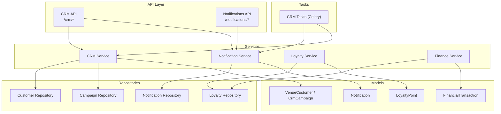
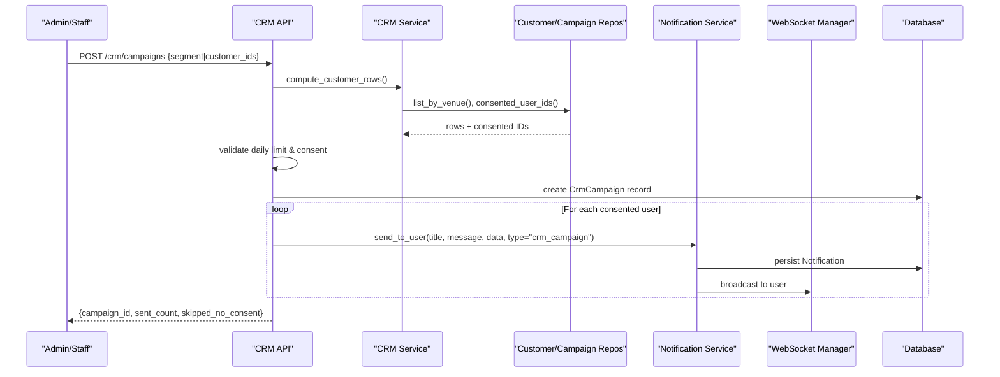
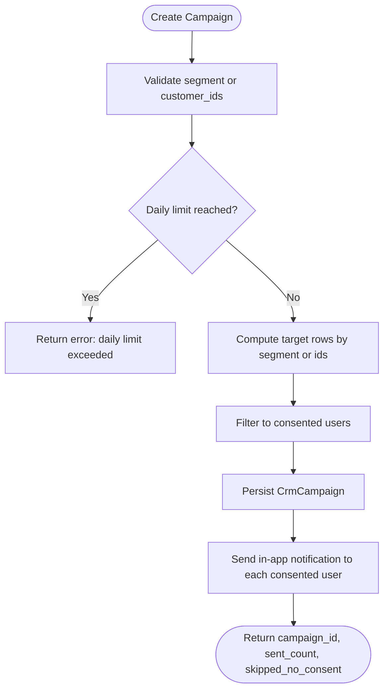
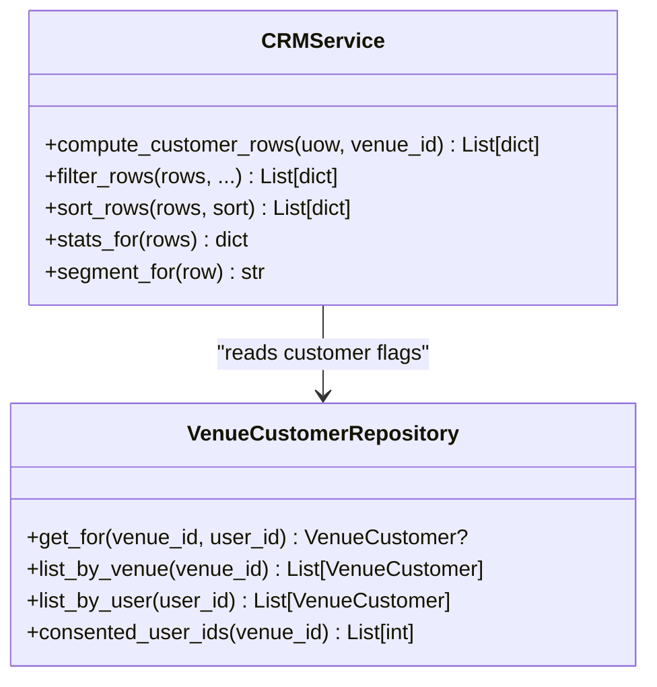
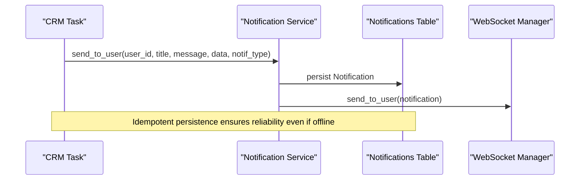
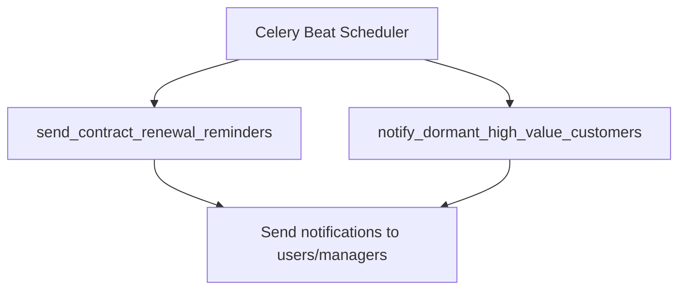
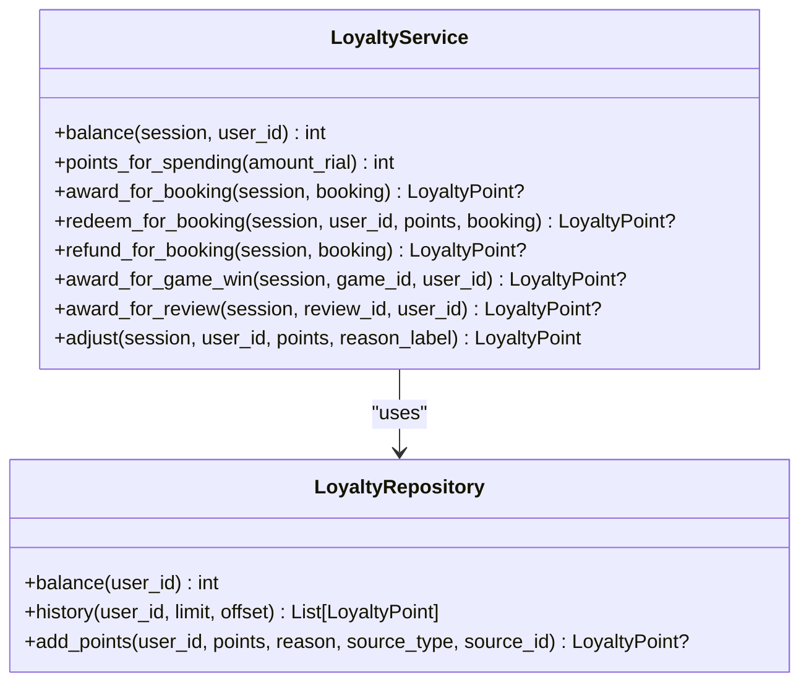
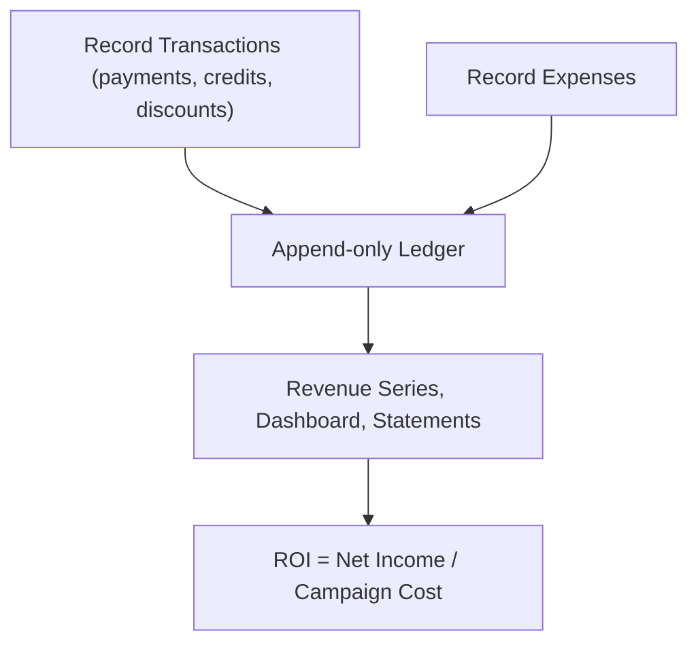
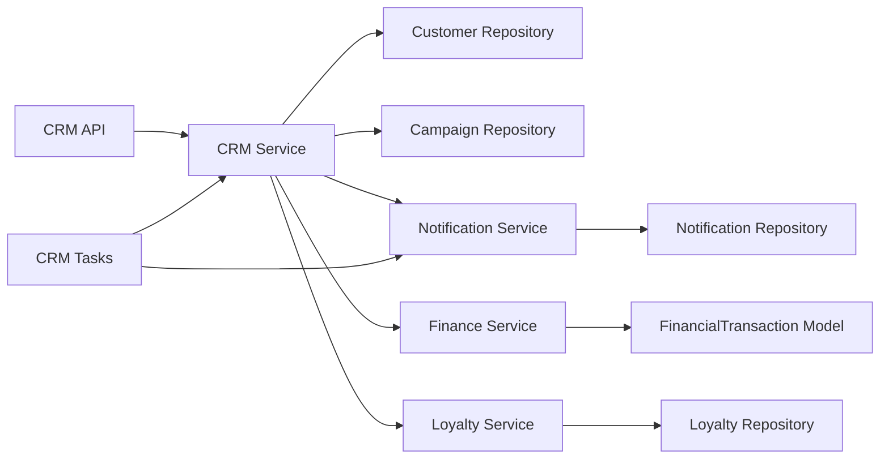

# CRM & Marketing

<cite>
**Referenced Files in This Document**
- [crm.py](file://app/api/v1/crm.py)
- [crm_service.py](file://app/services/crm_service.py)
- [customer.py](file://app/models/customer.py)
- [customer_repository.py](file://app/repositories/customer_repository.py)
- [notification_service.py](file://app/services/notification_service.py)
- [notifications.py](file://app/api/v1/notifications.py)
- [notification.py](file://app/models/notification.py)
- [crm_tasks.py](file://app/tasks/crm_tasks.py)
- [worker.py](file://app/tasks/worker.py)
- [loyalty.py](file://app/models/loyalty.py)
- [loyalty_service.py](file://app/services/loyalty_service.py)
- [loyalty_repository.py](file://app/repositories/loyalty_repository.py)
- [finance_service.py](file://app/services/finance_service.py)
- [transaction.py](file://app/models/transaction.py)
</cite>

## Table of Contents
1. Introduction
2. Project Structure
3. Core Components
4. Architecture Overview
5. Detailed Component Analysis
6. Dependency Analysis
7. Performance Considerations
8. Troubleshooting Guide
9. Conclusion
10. Appendices

## Introduction
This document explains the CRM and Marketing module for the venue booking system. It covers campaign management (creation, targeting, execution), customer segmentation (behavior, demographics, purchase history), automated notifications, email marketing integration points, engagement tracking, relationship tracking, interaction logging, marketing analytics, campaign automation, customer scoring via loyalty points, and ROI measurement using financial ledgers. It also provides practical workflows for campaign setup, customer targeting, and performance analysis.

## Project Structure
The CRM and Marketing features are implemented across API endpoints, services, repositories, models, tasks, and supporting utilities:
- API layer exposes endpoints for customers, campaigns, consent, and notifications.
- Services implement business logic for segmentation, campaign execution, notifications, loyalty, and finance.
- Repositories provide data access to customer records, campaigns, notifications, and loyalty.
- Models define database schemas for customers, campaigns, notifications, loyalty points, and financial transactions.
- Tasks schedule recurring CRM operations such as renewal reminders and dormant high-value customer alerts.

**Diagram sources**
- [crm.py:61-321](file://app/api/v1/crm.py#L61-L321)
- [notifications.py:34-83](file://app/api/v1/notifications.py#L34-L83)
- [crm_service.py:82-215](file://app/services/crm_service.py#L82-L215)
- [notification_service.py:12-193](file://app/services/notification_service.py#L12-L193)
- [loyalty_service.py:25-110](file://app/services/loyalty_service.py#L25-L110)
- [finance_service.py:62-737](file://app/services/finance_service.py#L62-L737)
- [customer_repository.py:12-59](file://app/repositories/customer_repository.py#L12-L59)
- [notification_repository.py:8-48](file://app/repositories/notification_repository.py#L8-L48)
- [loyalty_repository.py:9-46](file://app/repositories/loyalty_repository.py#L9-L46)
- [customer.py:19-53](file://app/models/customer.py#L19-L53)
- [notification.py:6-18](file://app/models/notification.py#L6-L18)
- [loyalty.py:29-43](file://app/models/loyalty.py#L29-L43)
- [transaction.py:84-119](file://app/models/transaction.py#L84-L119)
- [crm_tasks.py:25-119](file://app/tasks/crm_tasks.py#L25-L119)

**Section sources**
- [crm.py:61-321](file://app/api/v1/crm.py#L61-L321)
- [notifications.py:34-83](file://app/api/v1/notifications.py#L34-L83)
- [crm_service.py:82-215](file://app/services/crm_service.py#L82-L215)
- [notification_service.py:12-193](file://app/services/notification_service.py#L12-L193)
- [loyalty_service.py:25-110](file://app/services/loyalty_service.py#L25-L110)
- [finance_service.py:62-737](file://app/services/finance_service.py#L62-L737)
- [customer_repository.py:12-59](file://app/repositories/customer_repository.py#L12-L59)
- [notification_repository.py:8-48](file://app/repositories/notification_repository.py#L8-L48)
- [loyalty_repository.py:9-46](file://app/repositories/loyalty_repository.py#L9-L46)
- [customer.py:19-53](file://app/models/customer.py#L19-L53)
- [notification.py:6-18](file://app/models/notification.py#L6-L18)
- [loyalty.py:29-43](file://app/models/loyalty.py#L29-L43)
- [transaction.py:84-119](file://app/models/transaction.py#L84-L119)
- [crm_tasks.py:25-119](file://app/tasks/crm_tasks.py#L25-L119)

## Core Components
- Customer Segmentation: Computes per-customer metrics (bookings count, total spend, last visit, first seen, inactive days) and assigns segments (vip, new, regular, at_risk, dormant).
- Campaign Management: Creates campaigns with segment or explicit customer targeting, enforces daily limits and consent-only delivery, logs campaign metadata, and sends in-app notifications.
- Consent Management: Self-service endpoints allow users to set marketing consent per venue or globally; campaigns respect consent strictly.
- Notifications: In-app notifications persisted to DB and delivered via WebSocket; supports user, manager, and admin broadcasts.
- Loyalty and Scoring: Append-only loyalty ledger; balances computed from point history; points awarded for bookings, games, reviews; manual adjustments supported.
- Finance and ROI: Append-only financial ledger; revenue series, occupancy, dashboards, statements, and export capabilities enable ROI measurement.

**Section sources**
- [crm_service.py:52-158](file://app/services/crm_service.py#L52-L158)
- [crm.py:185-244](file://app/api/v1/crm.py#L185-L244)
- [crm.py:275-321](file://app/api/v1/crm.py#L275-L321)
- [notification_service.py:50-92](file://app/services/notification_service.py#L50-L92)
- [loyalty_service.py:25-110](file://app/services/loyalty_service.py#L25-L110)
- [finance_service.py:424-572](file://app/services/finance_service.py#L424-L572)

## Architecture Overview
The CRM and Marketing module integrates API endpoints with services that orchestrate data access through repositories and persist state into domain models. Automated tasks run on a Celery worker to perform periodic CRM actions.

**Diagram sources**
- [crm.py:185-244](file://app/api/v1/crm.py#L185-L244)
- [crm_service.py:82-158](file://app/services/crm_service.py#L82-L158)
- [customer_repository.py:22-35](file://app/repositories/customer_repository.py#L22-L35)
- [notification_service.py:50-64](file://app/services/notification_service.py#L50-L64)

## Detailed Component Analysis

### Campaign Management
- Creation: Accepts segment or explicit customer_ids, validates inputs, checks daily campaign limit per venue, computes target audience, filters by consent, persists campaign metadata, and sends in-app notifications to consented users.
- Listing: Returns recent campaigns for a venue with actor names enriched.
- Consent Enforcement: Only users with marketing_consent=true receive campaign messages; skipped counts are recorded.

**Diagram sources**
- [crm.py:185-244](file://app/api/v1/crm.py#L185-L244)
- [crm_service.py:82-158](file://app/services/crm_service.py#L82-L158)

**Section sources**
- [crm.py:185-244](file://app/api/v1/crm.py#L185-L244)
- [crm.py:247-270](file://app/api/v1/crm.py#L247-L270)
- [customer_repository.py:43-59](file://app/repositories/customer_repository.py#L43-L59)

### Customer Segmentation
- Metrics: Aggregates bookings count, first seen date, last visit date, total spend from financial transactions, balance due, loyalty balance, tags, VIP flag, and inactive days.
- Segments: vip if marked VIP; dormant if inactive >= 90 days; at_risk if inactive >= 45 days; new if few bookings and recently acquired; otherwise regular.
- Filtering/Sorting: Supports search by name/phone, VIP filter, tag filter, status (active/inactive/all), and sorting by spend/bookings/last_visit.

**Diagram sources**
- [crm_service.py:82-215](file://app/services/crm_service.py#L82-L215)
- [customer_repository.py:12-35](file://app/repositories/customer_repository.py#L12-L35)

**Section sources**
- [crm_service.py:52-158](file://app/services/crm_service.py#L52-L158)
- [crm_service.py:164-215](file://app/services/crm_service.py#L164-L215)

### Consent Management
- Read: Users can view their marketing consent status and venues where consent is granted.
- Update: Users can set consent per venue or across all their venue records; timestamps are updated.

**Section sources**
- [crm.py:275-321](file://app/api/v1/crm.py#L275-L321)

### Automated Notifications
- Persistence: All notifications are stored in the database with type, title, message, and JSON payload.
- Delivery: Real-time delivery via WebSocket to targeted users, managers, or admins.
- CRM Integration: Campaigns send notifications with type crm_campaign; scheduled tasks send contract renewal and dormant high-value customer alerts.

**Diagram sources**
- [notification_service.py:19-64](file://app/services/notification_service.py#L19-L64)
- [crm_tasks.py:25-64](file://app/tasks/crm_tasks.py#L25-L64)

**Section sources**
- [notification_service.py:50-92](file://app/services/notification_service.py#L50-L92)
- [notifications.py:34-83](file://app/api/v1/notifications.py#L34-L83)
- [crm_tasks.py:25-119](file://app/tasks/crm_tasks.py#L25-L119)

### Email Marketing Integration
- Current implementation uses in-app notifications (type crm_campaign) rather than direct email sending.
- Integration points:
  - The notification service persists and delivers notifications; external email providers can be integrated by extending the notification pipeline or adding an outbound channel based on notification events.
  - Campaign payloads include discount codes and venue context suitable for templating emails.

**Section sources**
- [crm.py:185-244](file://app/api/v1/crm.py#L185-L244)
- [notification_service.py:50-64](file://app/services/notification_service.py#L50-L64)

### Customer Engagement Tracking
- Engagement signals:
  - Booking activity (count, last visit, first seen).
  - Financial transactions (total spend, balance due).
  - Loyalty points (accumulated score).
  - Tags and VIP status for manual enrichment.
- Analytics:
  - Segment distribution and inactive counts.
  - Top spenders and recent new customers.
  - Revenue series, occupancy, and dashboard metrics for broader engagement insights.

**Section sources**
- [crm_service.py:82-158](file://app/services/crm_service.py#L82-L158)
- [crm_service.py:197-215](file://app/services/crm_service.py#L197-L215)
- [finance_service.py:424-572](file://app/services/finance_service.py#L424-L572)

### Customer Relationship Tracking and Interaction Logging
- Relationship attributes:
  - Per-venue customer records store VIP status, tags, notes, and marketing consent.
  - Recent bookings and payments are returned alongside customer details for interaction context.
- Interaction logging:
  - Campaign creation logs security events with actor, target, and outcome metrics.
  - Notifications are persisted with types and payloads for auditability.

**Section sources**
- [crm.py:89-168](file://app/api/v1/crm.py#L89-L168)
- [crm.py:185-244](file://app/api/v1/crm.py#L185-L244)
- [notification.py:6-18](file://app/models/notification.py#L6-L18)

### Campaign Automation
- Scheduled tasks:
  - Daily contract renewal reminders notify owners and venue managers when contracts expire soon.
  - Weekly dormant high-value customer alerts notify venue managers about top spenders who have not visited in 90+ days.
- Execution model:
  - Celery worker discovers tasks and runs them on cron schedules defined in task modules.

**Diagram sources**
- [crm_tasks.py:25-119](file://app/tasks/crm_tasks.py#L25-L119)
- [worker.py:1-26](file://app/tasks/worker.py#L1-L26)

**Section sources**
- [crm_tasks.py:25-119](file://app/tasks/crm_tasks.py#L25-L119)
- [worker.py:1-26](file://app/tasks/worker.py#L1-L26)

### Customer Scoring (Loyalty Points)
- Scoring mechanism:
  - Append-only ledger of loyalty points; balance equals sum of points.
  - Points awarded for completed bookings, game wins, reviews; manual adjustments allowed.
  - Points can be redeemed during checkout; refunds restore points upon cancellation.
- Usage in CRM:
  - Loyalty balances are included in customer rows and stats for engagement insights.

**Diagram sources**
- [loyalty_service.py:25-110](file://app/services/loyalty_service.py#L25-L110)
- [loyalty_repository.py:9-46](file://app/repositories/loyalty_repository.py#L9-L46)

**Section sources**
- [loyalty_service.py:25-110](file://app/services/loyalty_service.py#L25-L110)
- [loyalty_repository.py:9-46](file://app/repositories/loyalty_repository.py#L9-L46)
- [loyalty.py:29-43](file://app/models/loyalty.py#L29-L43)

### ROI Measurement
- Financial ledger:
  - Append-only transactions with types for payment, receivable, refund, discount, expense, credit, transfer, adjustment.
  - Methods to compute person balances, ledger statements, revenue series, occupancy, and dashboard metrics.
- ROI analysis:
  - Use revenue series and expenses to calculate net income over time.
  - Combine with campaign sent counts and customer segments to correlate marketing efforts with revenue outcomes.

**Diagram sources**
- [finance_service.py:118-228](file://app/services/finance_service.py#L118-L228)
- [finance_service.py:424-572](file://app/services/finance_service.py#L424-L572)
- [transaction.py:84-119](file://app/models/transaction.py#L84-L119)

**Section sources**
- [finance_service.py:118-228](file://app/services/finance_service.py#L118-L228)
- [finance_service.py:424-572](file://app/services/finance_service.py#L424-L572)
- [transaction.py:84-119](file://app/models/transaction.py#L84-L119)

## Dependency Analysis
Key dependencies and relationships:
- CRM API depends on CRM Service for segmentation and campaign logic.
- CRM Service depends on Customer and Campaign Repositories and reads User, Booking, Slot, Transaction, and Loyalty data.
- Notification Service persists notifications and broadcasts via WebSocket; used by CRM and tasks.
- Tasks depend on CRM Service and Notification Service for automated outreach.
- Loyalty Service depends on Loyalty Repository and interacts with Booking and Review contexts.
- Finance Service depends on Transaction repository and provides analytics for ROI.

**Diagram sources**
- [crm.py:61-321](file://app/api/v1/crm.py#L61-L321)
- [crm_service.py:82-215](file://app/services/crm_service.py#L82-L215)
- [notification_service.py:12-193](file://app/services/notification_service.py#L12-L193)
- [crm_tasks.py:25-119](file://app/tasks/crm_tasks.py#L25-L119)
- [loyalty_service.py:25-110](file://app/services/loyalty_service.py#L25-L110)
- [finance_service.py:62-737](file://app/services/finance_service.py#L62-L737)

**Section sources**
- [crm.py:61-321](file://app/api/v1/crm.py#L61-L321)
- [crm_service.py:82-215](file://app/services/crm_service.py#L82-L215)
- [notification_service.py:12-193](file://app/services/notification_service.py#L12-L193)
- [crm_tasks.py:25-119](file://app/tasks/crm_tasks.py#L25-L119)
- [loyalty_service.py:25-110](file://app/services/loyalty_service.py#L25-L110)
- [finance_service.py:62-737](file://app/services/finance_service.py#L62-L737)

## Performance Considerations
- Batch queries: CRM service aggregates bookings and spend in single queries to avoid N+1 issues.
- Consent filtering: Pre-filter consented users before sending notifications to minimize overhead.
- Pagination: APIs support limit/offset for lists to control response size.
- Append-only ledgers: Financial and loyalty ledgers ensure integrity and simplify analytics without complex updates.
- Timezone handling: UTC normalization ensures consistent date comparisons for segmentation and scheduling.

[No sources needed since this section provides general guidance]

## Troubleshooting Guide
- Campaign daily limit exceeded: Ensure settings.CRM_CAMPAIGN_DAILY_LIMIT is configured appropriately; check existing campaigns for the venue on the current UTC day.
- No recipients: Verify that target segment or customer_ids exist and that users have marketing_consent=true for the venue.
- Notifications not received: Check WebSocket connectivity and that notifications are persisted; use notifications API to list unread items.
- Loyalty balance discrepancies: Confirm append-only entries and idempotency keys; verify no duplicate awards for same source.
- ROI anomalies: Validate transaction statuses (cleared vs voided) and date ranges; use ledger statements to trace deltas.

**Section sources**
- [crm.py:185-244](file://app/api/v1/crm.py#L185-L244)
- [notifications.py:34-83](file://app/api/v1/notifications.py#L34-L83)
- [loyalty_repository.py:23-46](file://app/repositories/loyalty_repository.py#L23-L46)
- [finance_service.py:321-355](file://app/services/finance_service.py#L321-L355)

## Conclusion
The CRM and Marketing module provides robust campaign management with strict consent enforcement, precise customer segmentation, automated notifications, and comprehensive analytics. Loyalty points offer a transparent customer scoring system, while the financial ledger enables accurate ROI measurement. Together, these components support effective marketing workflows, engagement tracking, and data-driven decision-making.

[No sources needed since this section summarizes without analyzing specific files]

## Appendices

### Example Workflows

#### Campaign Setup
- Define segment or select customer_ids.
- Create campaign with title, message, optional discount code.
- System enforces daily limits and consent; sends in-app notifications to eligible users.

**Section sources**
- [crm.py:185-244](file://app/api/v1/crm.py#L185-L244)
- [crm_service.py:82-158](file://app/services/crm_service.py#L82-L158)

#### Customer Targeting
- Use segmentation filters (new, regular, vip, at_risk, dormant) or explicit IDs.
- Apply additional filters (VIP, tags, active/inactive) and sort by spend/bookings/last_visit.

**Section sources**
- [crm_service.py:164-194](file://app/services/crm_service.py#L164-L194)
- [crm.py:61-86](file://app/api/v1/crm.py#L61-L86)

#### Performance Analysis
- Retrieve CRM stats for segment distribution and inactive counts.
- Use finance dashboard and revenue series to assess campaign impact on revenue and occupancy.

**Section sources**
- [crm_service.py:197-215](file://app/services/crm_service.py#L197-L215)
- [finance_service.py:424-572](file://app/services/finance_service.py#L424-L572)