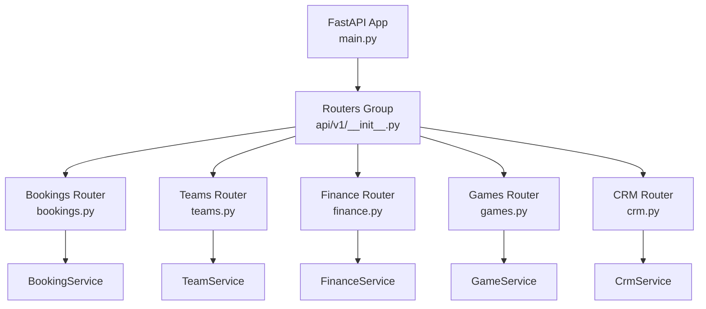
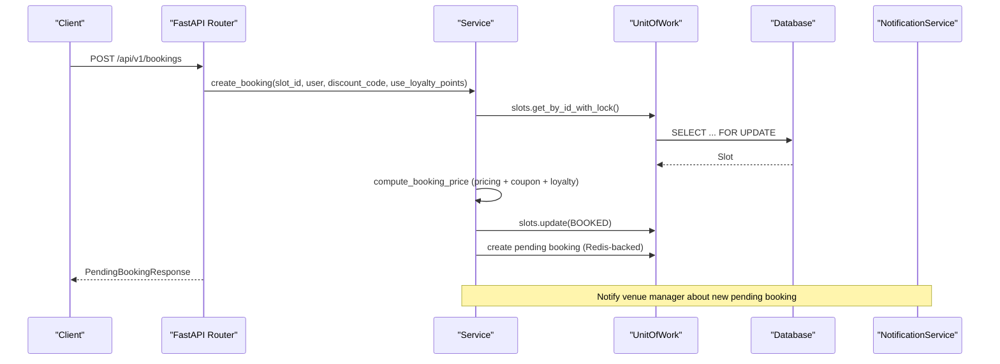
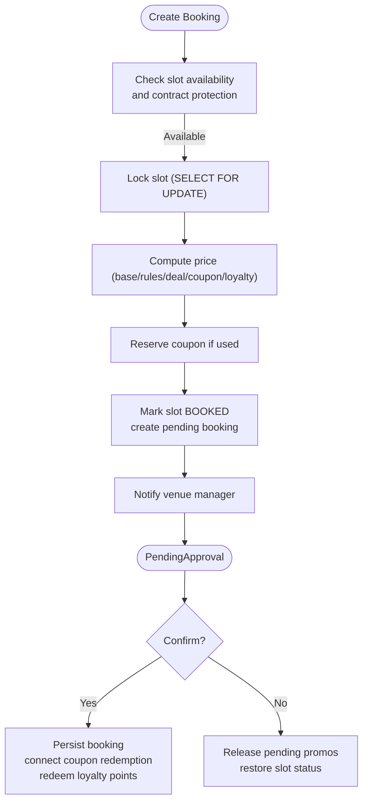
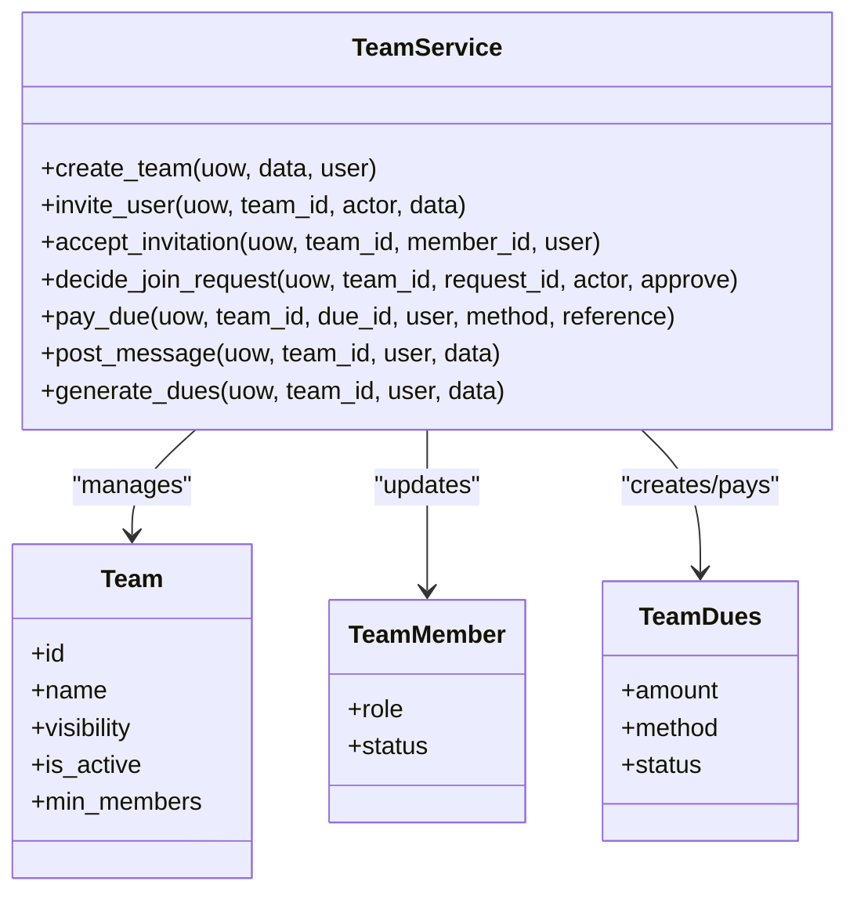
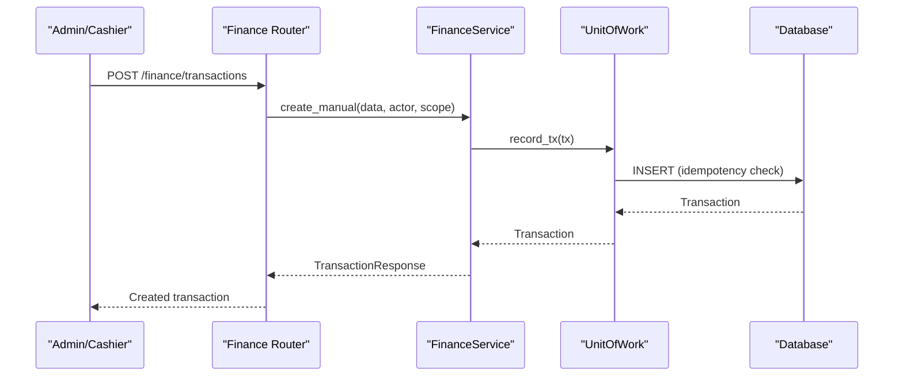
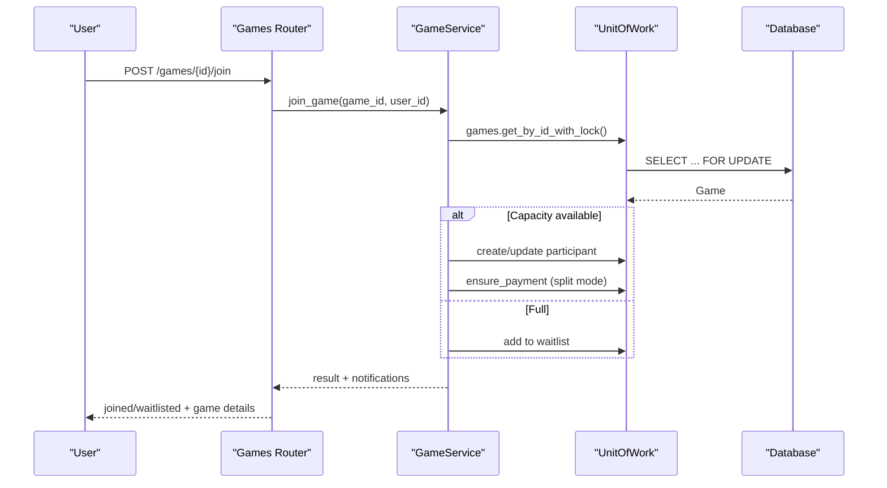
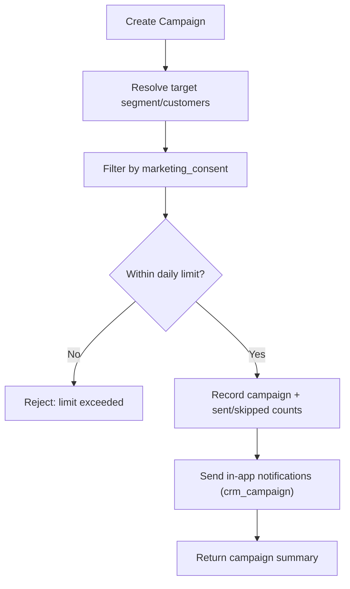
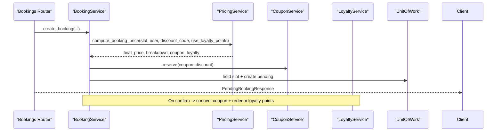
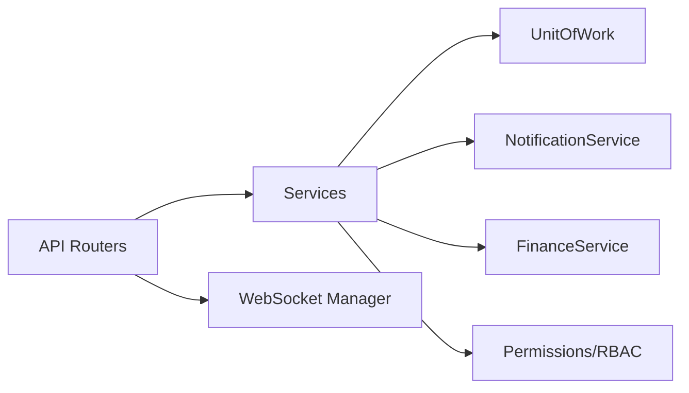

# Features & Modules

<cite>
**Referenced Files in This Document**
- [main.py](file://app/main.py)
- [config.py](file://app/config.py)
- [__init__.py](file://app/api/v1/__init__.py)
- [bookings.py](file://app/api/v1/bookings.py)
- [teams.py](file://app/api/v1/teams.py)
- [finance.py](file://app/api/v1/finance.py)
- [games.py](file://app/api/v1/games.py)
- [crm.py](file://app/api/v1/crm.py)
- [booking_service.py](file://app/services/booking_service.py)
- [team_service.py](file://app/services/team_service.py)
- [game_service.py](file://app/services/game_service.py)
- [finance_service.py](file://app/services/finance_service.py)
- [crm_service.py](file://app/services/crm_service.py)
</cite>

## Table of Contents
1. Introduction
2. Project Structure
3. Core Components
4. Architecture Overview
5. Detailed Component Analysis
6. Dependency Analysis
7. Performance Considerations
8. Troubleshooting Guide
9. Conclusion

## Introduction
This document provides comprehensive feature documentation for the Futsal Booking System backend, covering:
- Booking system with pending approval workflow, slot management, and availability checking
- Team management including member invitations, official chat, and dues handling
- Financial operations with transaction ledger, payment processing, and refund management
- Game management with participant handling, waitlists, and payments
- CRM capabilities including campaign management, customer segmentation, and automated notifications
- Loyalty program integration and pricing engine with dynamic rules and coupons

The system is built on FastAPI with a layered architecture (API routers → services → repositories/models), Unit of Work for transactions, and robust RBAC and concurrency controls.

## Project Structure
The application organizes features by domain modules under app/api/v1, with business logic in app/services and data access via repositories and models. Routers are mounted centrally in main.py and grouped in app/api/v1/__init__.py. Configuration is centralized in config.py.

**Diagram sources**
- [main.py:17-200](file://app/main.py#L17-L200)
- [__init__.py:1-24](file://app/api/v1/__init__.py#L1-L24)

**Section sources**
- [main.py:17-200](file://app/main.py#L17-L200)
- [__init__.py:1-24](file://app/api/v1/__init__.py#L1-L24)

## Core Components
- Bookings: Pending approval workflow, slot reservation, receipt/in-person payment flows, cancellation and refunds.
- Teams: Member lifecycle (invite, join requests, roles), official chat, dues generation/payment/voiding, balance and audit.
- Finance: Ledger CRUD, manual entries, voids, accounts statements, dashboards, revenue series, occupancy analytics.
- Games: Open games over bookings, participants, invitations, invite links, waitlist promotion, split payments, results.
- CRM: Customer rows computation, segmentation, consent-driven campaigns, per-venue limits, in-app notifications.
- Pricing & Loyalty: Server-side pricing computation integrating base price, rules, deals, coupons, and loyalty redemption; points earn/redemption integrated into booking and game flows.

**Section sources**
- [bookings.py:19-529](file://app/api/v1/bookings.py#L19-L529)
- [teams.py:27-422](file://app/api/v1/teams.py#L27-L422)
- [finance.py:43-396](file://app/api/v1/finance.py#L43-L396)
- [games.py:32-482](file://app/api/v1/games.py#L32-L482)
- [crm.py:31-321](file://app/api/v1/crm.py#L31-L321)
- [booking_service.py:14-229](file://app/services/booking_service.py#L14-L229)
- [team_service.py:59-800](file://app/services/team_service.py#L59-L800)
- [game_service.py:47-800](file://app/services/game_service.py#L47-L800)
- [finance_service.py:62-737](file://app/services/finance_service.py#L62-L737)
- [crm_service.py:82-215](file://app/services/crm_service.py#L82-L215)

## Architecture Overview
The system enforces role-based access control, unit-of-work transactions, and concurrency-safe operations using database locks (SELECT FOR UPDATE). Services orchestrate cross-cutting concerns like notifications, finance ledger updates, and promotions (coupons/loyalty).

**Diagram sources**
- [bookings.py:191-237](file://app/api/v1/bookings.py#L191-L237)
- [booking_service.py:26-109](file://app/services/booking_service.py#L26-L109)

**Section sources**
- [main.py:51-76](file://app/main.py#L51-L76)
- [main.py:177-200](file://app/main.py#L177-L200)

## Detailed Component Analysis

### Booking System: Pending Approval Workflow, Slots, Availability
- Pending approval: New bookings are held in a pending state (backed by Redis) until a venue manager confirms or rejects them. During this time, the slot is locked to prevent double-booking.
- Slot management: Availability checks enforce AVAILABLE status, contract-slot protection, and duplicate-pending prevention. On confirm, the slot transitions to confirmed booking; on reject/cancel, it restores to RESERVED or AVAILABLE depending on contract linkage.
- Payments: Supports bank receipt submission/approval/rejection and in-person collection, recording income in the ledger and updating booking status accordingly.
- Cancellations and refunds: Cancelling a paid booking triggers refund ledger entries and notification to both user and venue manager.

**Diagram sources**
- [bookings.py:191-237](file://app/api/v1/bookings.py#L191-L237)
- [booking_service.py:26-109](file://app/services/booking_service.py#L26-L109)
- [bookings.py:99-161](file://app/api/v1/bookings.py#L99-L161)

**Section sources**
- [bookings.py:191-529](file://app/api/v1/bookings.py#L191-L529)
- [booking_service.py:26-229](file://app/services/booking_service.py#L26-L229)

### Team Management: Invitations, Official Chat, Dues
- Invitations and join requests: Captains/admins can invite users or accept join requests; capacity limits enforced; official status auto-updates when minimum active members reached.
- Roles and permissions: Only captains/admins manage team membership and roles; captain transfer supported.
- Official chat: Message listing with pagination, posting, read marking, and unread counts.
- Dues: Generate periodic dues per member, pay via methods recorded in ledger, void dues, view balances and audit logs.

**Diagram sources**
- [team_service.py:187-213](file://app/services/team_service.py#L187-L213)
- [team_service.py:389-454](file://app/services/team_service.py#L389-L454)
- [team_service.py:698-751](file://app/services/team_service.py#L698-L751)
- [teams.py:139-172](file://app/api/v1/teams.py#L139-L172)
- [teams.py:276-339](file://app/api/v1/teams.py#L276-L339)
- [teams.py:381-422](file://app/api/v1/teams.py#L381-L422)

**Section sources**
- [teams.py:36-422](file://app/api/v1/teams.py#L36-L422)
- [team_service.py:59-800](file://app/services/team_service.py#L59-L800)

### Financial Operations: Ledger, Payments, Refunds
- Transaction ledger: Create, list, void, export CSV; idempotency keys prevent duplicates; scope enforcement per venue and role.
- Accounts and statements: Per-user statement with running balance; account listing with debtor/creditor filters.
- Dashboard and analytics: Revenue series, revenue by source, occupancy metrics, low-demand slots.
- Refunds: Dedicated refund entries linked to original source; safe for re-invocation via idempotency keys.

**Diagram sources**
- [finance.py:187-205](file://app/api/v1/finance.py#L187-L205)
- [finance_service.py:118-161](file://app/services/finance_service.py#L118-L161)

**Section sources**
- [finance.py:81-396](file://app/api/v1/finance.py#L81-L396)
- [finance_service.py:62-737](file://app/services/finance_service.py#L62-L737)

### Game Management: Participants, Waitlists, Payments
- Game creation over a confirmed booking; organizer becomes first participant; optional split payment mode creates per-participant shares.
- Join flow: Open or approval-based policies; full games enqueue to waitlist; waitlist promotion on leave/remove.
- Invitations and invite links: Direct invites and shareable links with usage limits and expiration.
- Payment reminders and per-participant pay endpoints integrate with existing payment flows.

**Diagram sources**
- [games.py:242-253](file://app/api/v1/games.py#L242-L253)
- [game_service.py:341-429](file://app/services/game_service.py#L341-L429)

**Section sources**
- [games.py:63-482](file://app/api/v1/games.py#L63-L482)
- [game_service.py:167-800](file://app/services/game_service.py#L167-L800)

### CRM: Campaigns, Segmentation, Notifications
- Customer rows: Computed from bookings, transactions, and loyalty balances; segments derived (vip, dormant, at_risk, new, regular).
- Campaigns: Consent-only messaging with daily per-venue limit; sends in-app notifications of type crm_campaign; supports discount codes.
- Consent management: Self-service toggles per venue or across all venues.

**Diagram sources**
- [crm.py:185-244](file://app/api/v1/crm.py#L185-L244)
- [crm_service.py:82-158](file://app/services/crm_service.py#L82-L158)

**Section sources**
- [crm.py:61-321](file://app/api/v1/crm.py#L61-L321)
- [crm_service.py:82-215](file://app/services/crm_service.py#L82-L215)

### Pricing Engine and Loyalty Integration
- Pricing engine: Server-side computation integrates base slot price, rules, deal pricing, coupons, and loyalty redemption; breakdown persisted for auditability.
- Coupons: Reserved at booking creation time; connected to confirmed booking; released on rejection/cancellation/expiry.
- Loyalty: Points redeemed during booking confirmation; points earned for game wins and reviews configured via settings; refund logic reverses redemptions on cancellations.

**Diagram sources**
- [booking_service.py:26-109](file://app/services/booking_service.py#L26-L109)
- [bookings.py:191-237](file://app/api/v1/bookings.py#L191-L237)

**Section sources**
- [booking_service.py:26-192](file://app/services/booking_service.py#L26-L192)
- [config.py:12-26](file://app/config.py#L12-L26)

## Dependency Analysis
- API layer depends on services for business logic; services depend on Unit of Work for data access and orchestration.
- Cross-cutting dependencies: NotificationService for real-time and in-app messages; FinanceService for ledger integrity; Permission utilities for RBAC; WebSocket manager for role-scoped channels.
- Concurrency: Database-level locking prevents race conditions in high-contention paths (slots, teams, games).

**Diagram sources**
- [main.py:17-200](file://app/main.py#L17-L200)
- [bookings.py:1-18](file://app/api/v1/bookings.py#L1-L18)
- [team_service.py:1-42](file://app/services/team_service.py#L1-L42)
- [game_service.py:1-37](file://app/services/game_service.py#L1-L37)
- [finance_service.py:1-40](file://app/services/finance_service.py#L1-L40)

**Section sources**
- [main.py:17-200](file://app/main.py#L17-L200)

## Performance Considerations
- Avoid N+1 queries by batching enrichment (e.g., venue/slot lookups for bookings).
- Use database locks (SELECT FOR UPDATE) for critical sections to prevent races.
- Prefer single-query aggregations for dashboards and reports.
- Enforce rate limiting on sensitive endpoints (e.g., booking creation, game payment reminders).
- Keep responses lean; enrich only necessary fields.

[No sources needed since this section provides general guidance]

## Troubleshooting Guide
- Duplicate bookings: Ensure slot is AVAILABLE and no pending exists; verify lock acquisition.
- Coupon not applied: Check that coupon was reserved and not expired; confirm connection to booking on confirm.
- Loyalty points not refunded: Verify cancellation path calls refund logic; check idempotency keys.
- Finance voids: Ensure proper permissions and scope; voided transactions remain auditable.
- CRM campaign limits: Respect daily per-venue limits; validate consent flags.

**Section sources**
- [booking_service.py:41-68](file://app/services/booking_service.py#L41-L68)
- [booking_service.py:111-192](file://app/services/booking_service.py#L111-L192)
- [bookings.py:349-426](file://app/api/v1/bookings.py#L349-L426)
- [finance.py:224-244](file://app/api/v1/finance.py#L224-L244)
- [crm.py:185-244](file://app/api/v1/crm.py#L185-L244)

## Conclusion
The Futsal Booking System implements a robust, modular backend with clear separation of concerns, strong concurrency safeguards, and comprehensive financial accounting. The pending approval workflow ensures operational control, while teams and games enable social play dynamics. CRM and loyalty features drive engagement and retention. The design supports extensibility through well-defined service boundaries and consistent patterns for notifications, permissions, and idempotent operations.