# Financial Operations

<cite>
**Referenced Files in This Document**
- [finance.py](file://app/api/v1/finance.py)
- [payments.py](file://app/api/v1/payments.py)
- [transaction.py](file://app/models/transaction.py)
- [payment.py](file://app/models/payment.py)
- [booking.py](file://app/models/booking.py)
- [finance_service.py](file://app/services/finance_service.py)
- [transaction_repository.py](file://app/repositories/transaction_repository.py)
- [payment_repository.py](file://app/repositories/payment_repository.py)
- [m0s013_payment_modes.py](file://migrations/versions/m0s013_payment_modes.py)
</cite>

## Table of Contents
1. Introduction
2. Project Structure
3. Core Components
4. Architecture Overview
5. Detailed Component Analysis
6. Dependency Analysis
7. Performance Considerations
8. Troubleshooting Guide
9. Conclusion
10. Appendices

## Introduction
This document explains the Financial Operations module of the futsal booking system backend. It covers:
- Double-entry ledger with append-only transactions and voiding for corrections
- Payment processing workflows for bookings and manual payments
- Refund management that reverses income without modifying original rows
- Financial reporting, revenue tracking by source, and expense categorization
- Payment modes integration (bank receipt workflow) and receipt lifecycle
- Audit trail maintenance via idempotency keys, status transitions, and security events
- Data models for transactions, payments, and their relationships
- Validation rules, currency handling (integer Rials), and compliance considerations
- End-to-end examples: booking payment, refund, and financial report generation

## Project Structure
The financial operations span API routes, services, repositories, and data models:
- API layer exposes finance dashboards, transaction CRUD, accounts, and export endpoints; payments endpoints handle booking payments
- Service layer implements double-entry logic, scope enforcement, reporting, and helpers for income/expense/refund recording
- Repository layer provides efficient SQL aggregations and list queries for the ledger
- Models define the ledger row, expense categories, booking payments, and booking receipt fields
- Migration adds venue payment mode and booking receipt workflow columns

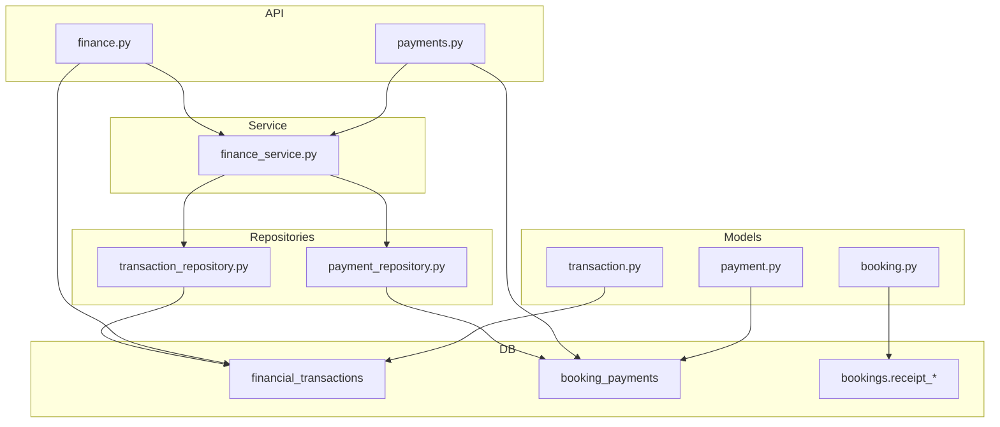

**Diagram sources**
- [finance.py:1-396](file://app/api/v1/finance.py#L1-L396)
- [payments.py:1-175](file://app/api/v1/payments.py#L1-L175)
- [finance_service.py:1-737](file://app/services/finance_service.py#L1-L737)
- [transaction_repository.py:1-395](file://app/repositories/transaction_repository.py#L1-L395)
- [payment_repository.py:1-53](file://app/repositories/payment_repository.py#L1-L53)
- [transaction.py:1-119](file://app/models/transaction.py#L1-L119)
- [payment.py:1-29](file://app/models/payment.py#L1-L29)
- [booking.py:35-51](file://app/models/booking.py#L35-L51)

**Section sources**
- [finance.py:1-396](file://app/api/v1/finance.py#L1-L396)
- [payments.py:1-175](file://app/api/v1/payments.py#L1-L175)
- [finance_service.py:1-737](file://app/services/finance_service.py#L1-L737)
- [transaction_repository.py:1-395](file://app/repositories/transaction_repository.py#L1-L395)
- [payment_repository.py:1-53](file://app/repositories/payment_repository.py#L1-L53)
- [transaction.py:1-119](file://app/models/transaction.py#L1-L119)
- [payment.py:1-29](file://app/models/payment.py#L1-L29)
- [booking.py:35-51](file://app/models/booking.py#L35-L51)

## Core Components
- Ledger model and enums: append-only rows, direction-based accounting, methods, statuses, and source types
- Expense categories: per-venue or global, soft-deletable
- Booking payments: per-booking invoice-like records with gateway simulation and status flow
- Finance service: record income/expense/refund, manual entries, voiding, statements, series reports, occupancy analytics
- Repositories: efficient aggregation queries for sums, series, balances, and statement rows
- API routes: dashboard, revenue series, revenue by source, transactions, accounts, export, and payments

Key design principles:
- All amounts are integers representing Rials; direction indicates income vs expense
- Corrections use new rows (adjustment/refund) or voiding; never mutate cleared rows
- Idempotent writes via idempotency_key prevent duplicates
- Venue scoping enforces RBAC across all financial operations

**Section sources**
- [transaction.py:20-119](file://app/models/transaction.py#L20-L119)
- [finance_service.py:62-307](file://app/services/finance_service.py#L62-L307)
- [transaction_repository.py:122-318](file://app/repositories/transaction_repository.py#L122-L318)
- [finance.py:81-396](file://app/api/v1/finance.py#L81-L396)
- [payments.py:42-175](file://app/api/v1/payments.py#L42-L175)

## Architecture Overview
The financial module follows a layered architecture:
- API routes validate inputs, enforce permissions, and delegate to the service
- Service orchestrates business rules, double-entry postings, and reporting
- Repositories perform optimized SQL aggregations and CRUD
- Models define schema and constraints; migrations evolve schema safely

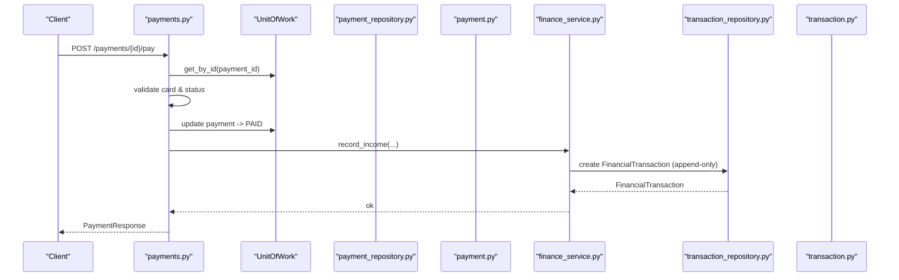

**Diagram sources**
- [payments.py:81-162](file://app/api/v1/payments.py#L81-L162)
- [finance_service.py:130-161](file://app/services/finance_service.py#L130-L161)
- [transaction_repository.py:65-67](file://app/repositories/transaction_repository.py#L65-L67)
- [transaction.py:84-119](file://app/models/transaction.py#L84-L119)
- [payment.py:15-29](file://app/models/payment.py#L15-L29)

**Section sources**
- [payments.py:81-162](file://app/api/v1/payments.py#L81-L162)
- [finance_service.py:130-161](file://app/services/finance_service.py#L130-L161)
- [transaction_repository.py:65-67](file://app/repositories/transaction_repository.py#L65-L67)
- [transaction.py:84-119](file://app/models/transaction.py#L84-L119)
- [payment.py:15-29](file://app/models/payment.py#L15-L29)

## Detailed Component Analysis

### Double-Entry Ledger and Transaction Model
- FinancialTransaction is append-only; amount is always positive; direction determines income vs expense
- Types include payment, receivable, refund, discount, expense, credit, transfer, adjustment
- Methods cover cash, card-to-card, gateway, POS, credit, other
- Statuses: pending, cleared, voided; voiding preserves auditability
- Source type links back to origin (booking, game, membership, contract, manual, etc.)
- Counterparty supports user/team/contract/organization references
- ExpenseCategory enables categorization and soft deletion

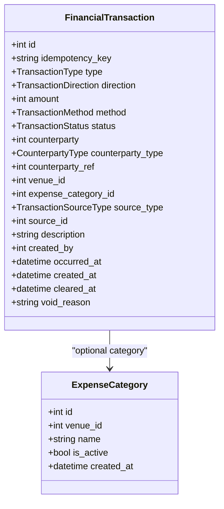

**Diagram sources**
- [transaction.py:73-119](file://app/models/transaction.py#L73-L119)

**Section sources**
- [transaction.py:20-119](file://app/models/transaction.py#L20-L119)

### Payment Processing Workflow (Booking Payments)
- Create payment invoice for confirmed bookings; prevents duplicate invoices
- Pay endpoint validates card digits, marks payment paid, stores last 4 PAN, sets paid timestamp
- Records income into ledger with idempotency key based on payment id
- Updates booking with payment transaction id
- Sends notifications to user and venue manager

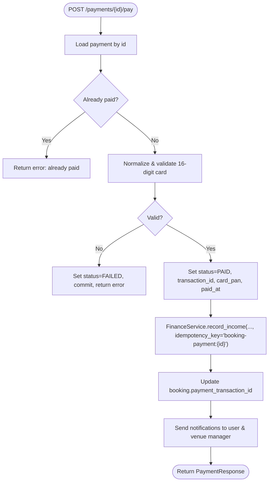

**Diagram sources**
- [payments.py:81-162](file://app/api/v1/payments.py#L81-L162)
- [finance_service.py:130-161](file://app/services/finance_service.py#L130-L161)

**Section sources**
- [payments.py:42-175](file://app/api/v1/payments.py#L42-L175)
- [payment_repository.py:23-43](file://app/repositories/payment_repository.py#L23-L43)
- [finance_service.py:130-161](file://app/services/finance_service.py#L130-L161)

### Refund Management
- Refunds are recorded as new expense-type rows reversing income; original cleared rows remain untouched
- Original source id links refund to the originating payment or receivable
- Refunds can be issued from booking cancellation flows (see bookings API usage)

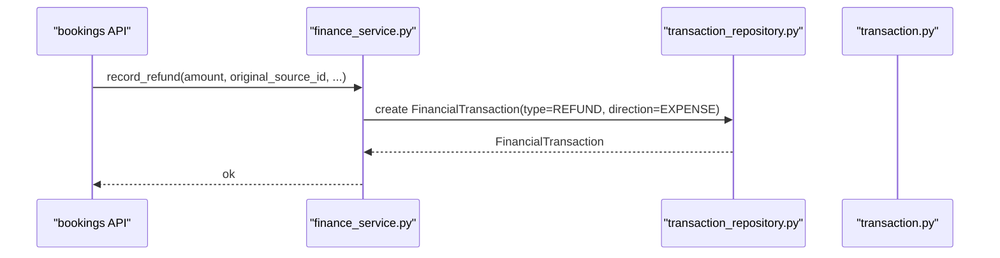

**Diagram sources**
- [finance_service.py:199-228](file://app/services/finance_service.py#L199-L228)
- [transaction.py:20-29](file://app/models/transaction.py#L20-L29)

**Section sources**
- [finance_service.py:199-228](file://app/services/finance_service.py#L199-L228)
- [transaction.py:20-29](file://app/models/transaction.py#L20-L29)

### Manual Transactions and Expense Categories
- Manual creation supports income and expense with forced direction per type
- Expense requires an active category scoped to venue
- Categories support soft delete; cannot delete if used by transactions

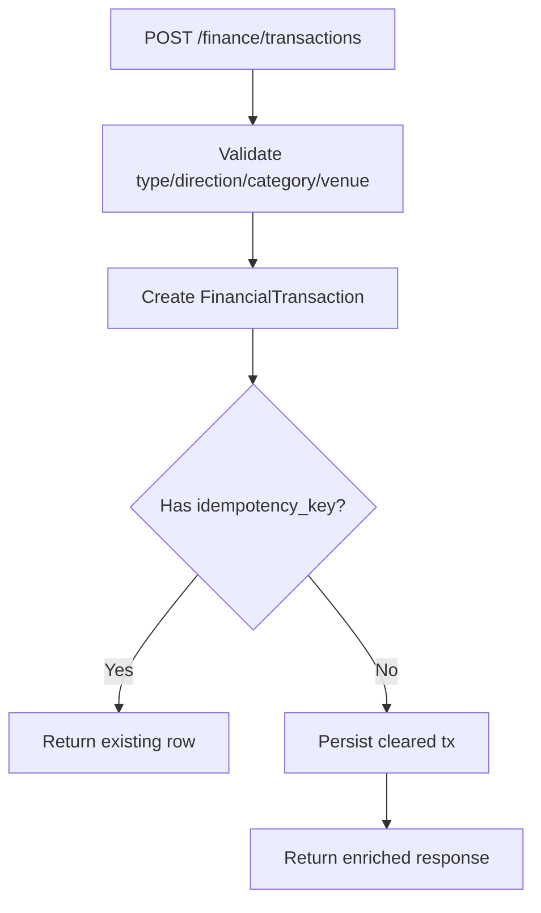

**Diagram sources**
- [finance.py:187-205](file://app/api/v1/finance.py#L187-L205)
- [finance_service.py:231-273](file://app/services/finance_service.py#L231-L273)
- [transaction_repository.py:65-67](file://app/repositories/transaction_repository.py#L65-L67)

**Section sources**
- [finance.py:187-205](file://app/api/v1/finance.py#L187-L205)
- [finance_service.py:231-273](file://app/services/finance_service.py#L231-L273)
- [transaction_repository.py:65-67](file://app/repositories/transaction_repository.py#L65-L67)

### Accounts, Statements, and Receivables
- Person balances computed from ledger deltas; positive means debtor to the organization
- Statement returns chronological entries with opening balance and running balance
- Accounts listing filters debtors/creditors and sorts by absolute balance

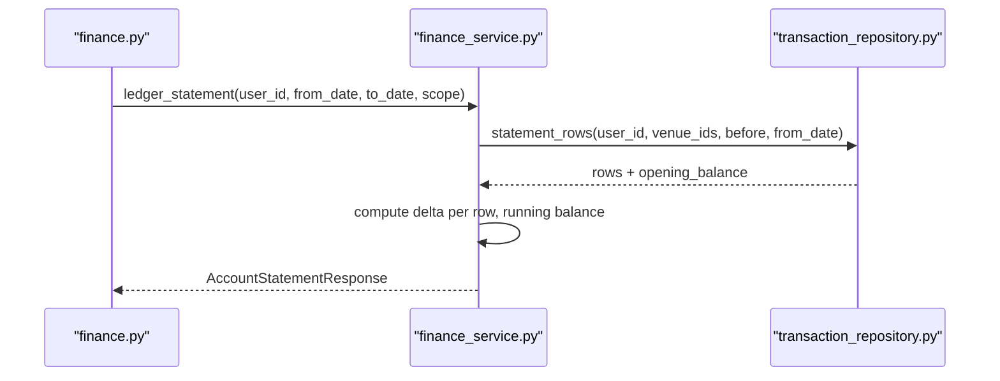

**Diagram sources**
- [finance.py:328-340](file://app/api/v1/finance.py#L328-L340)
- [finance_service.py:321-355](file://app/services/finance_service.py#L321-L355)
- [transaction_repository.py:293-318](file://app/repositories/transaction_repository.py#L293-L318)

**Section sources**
- [finance.py:328-340](file://app/api/v1/finance.py#L328-L340)
- [finance_service.py:321-355](file://app/services/finance_service.py#L321-L355)
- [transaction_repository.py:293-318](file://app/repositories/transaction_repository.py#L293-L318)

### Revenue Tracking and Reporting
- Dashboard aggregates today/month revenue, expenses, gross profit, occupancy, contracts, active customers, teams
- Revenue series grouped by day/hour/weekday/venue using efficient SQL group-by
- Revenue by source breaks down income by source_type (booking_payment, game_payment, membership_purchase, etc.)
- Occupancy and low-demand slots help correlate revenue with capacity

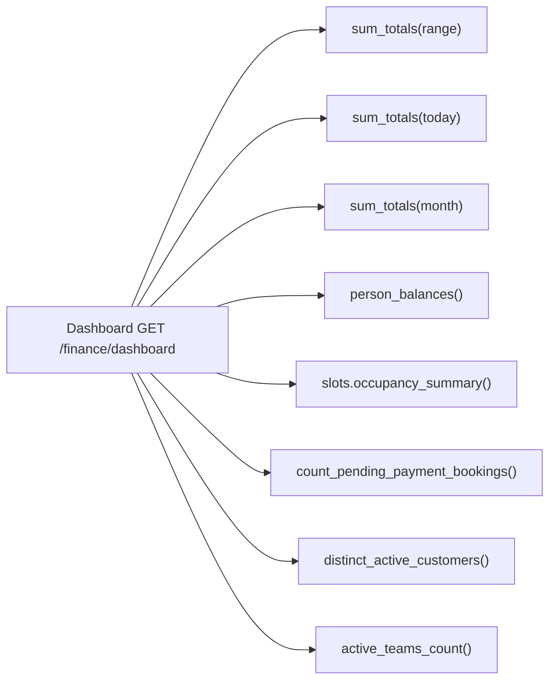

**Diagram sources**
- [finance.py:81-94](file://app/api/v1/finance.py#L81-L94)
- [finance_service.py:494-572](file://app/services/finance_service.py#L494-L572)
- [transaction_repository.py:143-170](file://app/repositories/transaction_repository.py#L143-L170)

**Section sources**
- [finance.py:81-94](file://app/api/v1/finance.py#L81-L94)
- [finance_service.py:494-572](file://app/services/finance_service.py#L494-L572)
- [transaction_repository.py:143-170](file://app/repositories/transaction_repository.py#L143-L170)

### Payment Modes Integration and Receipt Lifecycle
- Venues have a default payment_mode; bookings snapshot payment_mode at creation time
- Bank receipt workflow includes fields for receipt submission, review, and metadata
- Migration ensures safe schema evolution with defaults and foreign keys

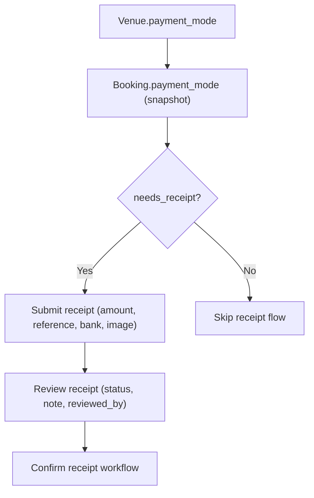

**Diagram sources**
- [m0s013_payment_modes.py:49-90](file://migrations/versions/m0s013_payment_modes.py#L49-L90)
- [booking.py:38-48](file://app/models/booking.py#L38-L48)

**Section sources**
- [m0s013_payment_modes.py:49-90](file://migrations/versions/m0s013_payment_modes.py#L49-L90)
- [booking.py:38-48](file://app/models/booking.py#L38-L48)

### Audit Trail and Compliance
- Idempotency keys prevent duplicate ledger entries
- Voiding preserves history with reason; cleared rows are immutable
- Security events logged for sensitive actions (void, export)
- Venue scoping enforces data isolation per manager/staff role

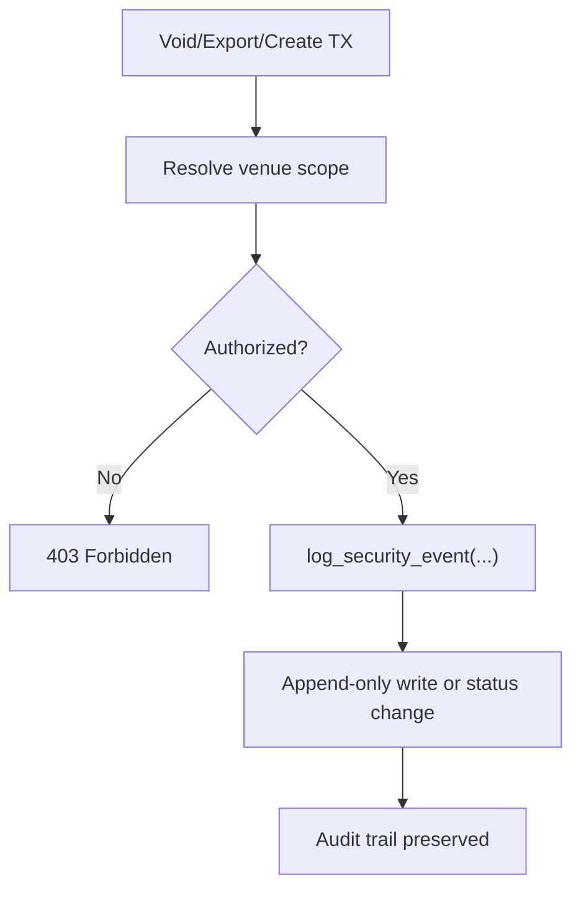

**Diagram sources**
- [finance.py:224-244](file://app/api/v1/finance.py#L224-L244)
- [finance.py:361-396](file://app/api/v1/finance.py#L361-L396)
- [finance_service.py:283-307](file://app/services/finance_service.py#L283-L307)

**Section sources**
- [finance.py:224-244](file://app/api/v1/finance.py#L224-L244)
- [finance.py:361-396](file://app/api/v1/finance.py#L361-L396)
- [finance_service.py:283-307](file://app/services/finance_service.py#L283-L307)

## Dependency Analysis
- API depends on service for business logic and repository access
- Service depends on repositories for SQL aggregation and persistence
- Repositories depend on models for schema definitions
- Models depend on enums and constraints; migration evolves schema safely

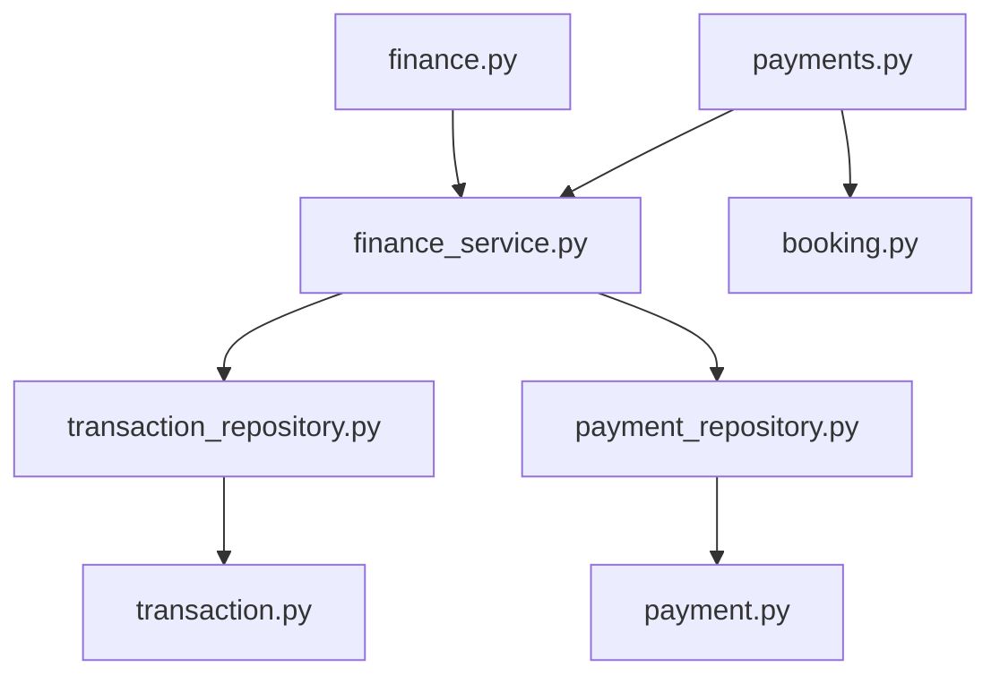

**Diagram sources**
- [finance.py:1-396](file://app/api/v1/finance.py#L1-L396)
- [payments.py:1-175](file://app/api/v1/payments.py#L1-L175)
- [finance_service.py:1-737](file://app/services/finance_service.py#L1-L737)
- [transaction_repository.py:1-395](file://app/repositories/transaction_repository.py#L1-L395)
- [payment_repository.py:1-53](file://app/repositories/payment_repository.py#L1-L53)
- [transaction.py:1-119](file://app/models/transaction.py#L1-L119)
- [payment.py:1-29](file://app/models/payment.py#L1-L29)
- [booking.py:35-51](file://app/models/booking.py#L35-L51)

**Section sources**
- [finance.py:1-396](file://app/api/v1/finance.py#L1-L396)
- [payments.py:1-175](file://app/api/v1/payments.py#L1-L175)
- [finance_service.py:1-737](file://app/services/finance_service.py#L1-L737)
- [transaction_repository.py:1-395](file://app/repositories/transaction_repository.py#L1-L395)
- [payment_repository.py:1-53](file://app/repositories/payment_repository.py#L1-L53)
- [transaction.py:1-119](file://app/models/transaction.py#L1-L119)
- [payment.py:1-29](file://app/models/payment.py#L1-L29)
- [booking.py:35-51](file://app/models/booking.py#L35-L51)

## Performance Considerations
- Aggregations use single SQL statements with GROUP BY and date truncation to avoid N+1 queries
- Series and totals computed via efficient windowing functions adapted per dialect (SQLite vs PostgreSQL)
- Pagination on transaction lists reduces payload size
- Export uses streaming CSV writer to minimize memory footprint
- Idempotency checks prevent redundant writes and reduce contention

[No sources needed since this section provides general guidance]

## Troubleshooting Guide
Common issues and resolutions:
- Duplicate payment attempts: ensure idempotency_key is set when creating ledger entries; service will return existing row
- Invalid card number: payment flow validates 16 digits; invalid input marks payment failed
- Unauthorized access: venue scoping enforced; verify user role and venue assignment
- Category misuse: expense requires valid category within venue scope; check category existence and scope
- Date range errors: start date must not be after end date; service normalizes ranges

**Section sources**
- [payments.py:98-103](file://app/api/v1/payments.py#L98-L103)
- [finance_service.py:411-421](file://app/services/finance_service.py#L411-L421)
- [finance_service.py:245-252](file://app/services/finance_service.py#L245-L252)

## Conclusion
The Financial Operations module implements a robust, compliant, and auditable ledger with double-entry principles. It integrates payment processing, refunds, reporting, and receipt workflows while enforcing strict venue scoping and validation. The append-only design ensures integrity and traceability, and efficient SQL-backed repositories provide scalable performance for reporting and analytics.

[No sources needed since this section summarizes without analyzing specific files]

## Appendices

### Example Workflows

#### Booking Payment Flow
- Create invoice for a confirmed booking
- Process payment with validated card details
- Record income in ledger with idempotency key
- Update booking with transaction id and send notifications

**Section sources**
- [payments.py:42-78](file://app/api/v1/payments.py#L42-L78)
- [payments.py:81-162](file://app/api/v1/payments.py#L81-L162)
- [finance_service.py:130-161](file://app/services/finance_service.py#L130-L161)

#### Refund Flow
- Initiate refund against original source
- Record new expense-type ledger row linking to original
- Preserve original cleared row for audit

**Section sources**
- [finance_service.py:199-228](file://app/services/finance_service.py#L199-L228)
- [transaction.py:20-29](file://app/models/transaction.py#L20-L29)

#### Financial Report Generation
- Query dashboard metrics for selected venue scope and date range
- Generate revenue series grouped by day/hour/weekday/venue
- Export transactions to CSV with filters and security logging

**Section sources**
- [finance.py:81-152](file://app/api/v1/finance.py#L81-L152)
- [finance.py:361-396](file://app/api/v1/finance.py#L361-L396)
- [finance_service.py:423-453](file://app/services/finance_service.py#L423-L453)
- [finance_service.py:714-737](file://app/services/finance_service.py#L714-L737)