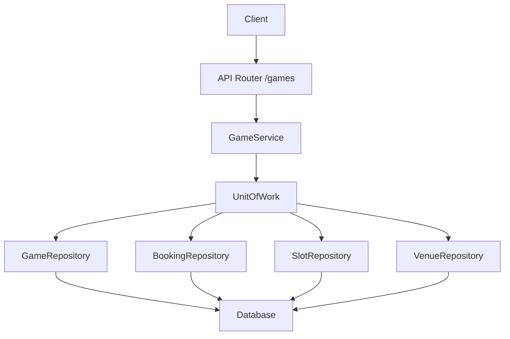
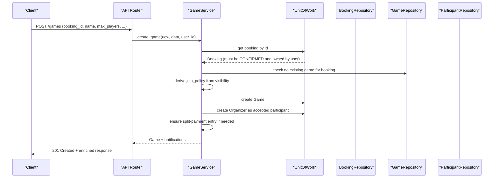
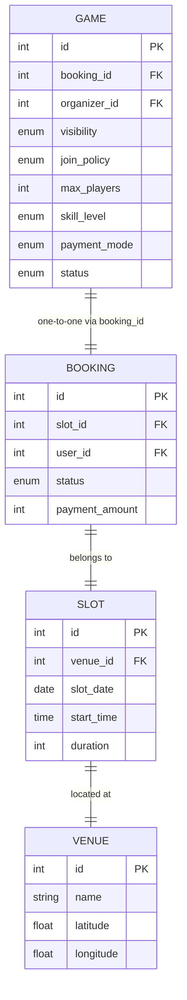

# Game Creation & Configuration

<cite>
**Referenced Files in This Document**
- [game.py](file://app/models/game.py)
- [game.py](file://app/schemas/game.py)
- [games.py](file://app/api/v1/games.py)
- [game_service.py](file://app/services/game_service.py)
- [game_repository.py](file://app/repositories/game_repository.py)
- [booking.py](file://app/models/booking.py)
- [slot.py](file://app/models/slot.py)
- [venue.py](file://app/models/venue.py)
- [unit_of_work.py](file://app/unit_of_work.py)
</cite>

## Table of Contents
1. Introduction
2. Project Structure
3. Core Components
4. Architecture Overview
5. Detailed Component Analysis
6. Dependency Analysis
7. Performance Considerations
8. Troubleshooting Guide
9. Conclusion

## Introduction
This document explains how games are created and configured in the system, focusing on:
- The game creation workflow: booking association, organizer assignment, and initial participant setup
- Game configuration options: visibility (public/private/public_approval), join policy (open/approval), capacity limits, skill level requirements, and payment modes
- Game status management from DRAFT to OPEN and beyond
- Examples of creating games with different configurations, handling validation errors, and setting up parameters
- Relationships between games and bookings, venue associations, and slot management

The design ensures that a Game is an independent entity attached to a confirmed Booking, never mutating the Booking itself. It also enforces safe concurrency for capacity-sensitive operations using row-level locking.

## Project Structure
Game-related functionality spans models, schemas, API routes, service logic, and repositories:
- Models define entities like Game, Participant, JoinRequest, Invitation, InviteLink, Waitlist, Payment
- Schemas validate inputs and responses for game creation and updates
- API routes expose endpoints for creation, listing, joining, managing participants, invitations, waitlist, payments, and lifecycle transitions
- Service encapsulates business rules, validations, notifications, and state transitions
- Repositories implement data access patterns including counts, explore queries, and locks

**Diagram sources**
- [games.py:63-71](file://app/api/v1/games.py#L63-L71)
- [game_service.py:167-203](file://app/services/game_service.py#L167-L203)
- [unit_of_work.py:161-200](file://app/unit_of_work.py#L161-L200)

**Section sources**
- [games.py:63-71](file://app/api/v1/games.py#L63-L71)
- [game_service.py:167-203](file://app/services/game_service.py#L167-L203)
- [unit_of_work.py:161-200](file://app/unit_of_work.py#L161-L200)

## Core Components
- Game model defines core attributes: booking_id, organizer_id, name, description, sport, visibility, join_policy, max_players, skill_level, payment_mode, status, result tracking
- Enums include GameVisibility, GameStatus, SkillLevel, PaymentMode, JoinPolicy, roles/statuses for participants, requests, invitations, waitlist, and payments
- Schemas enforce input validation for creation and updates
- Service implements creation, join/leave flows, invitations, waitlist, payments, status transitions, cancellation, and result recording
- Repository provides efficient queries for explore, counts, and locks

Key relationships:
- Game → Booking (one-to-one via unique booking_id)
- Booking → Slot → Venue chain used to enrich responses and compute per-player share
- Game ↔ Participants, JoinRequests, Invitations, InviteLinks, Waitlist, Payments

**Section sources**
- [game.py:20-134](file://app/models/game.py#L20-L134)
- [game.py:138-258](file://app/models/game.py#L138-L258)
- [game.py:54-121](file://app/schemas/game.py#L54-L121)
- [game_repository.py:26-153](file://app/repositories/game_repository.py#L26-L153)

## Architecture Overview
The game creation flow validates the booking, sets the organizer as the first participant, derives join_policy from visibility, and initializes game status to OPEN. Subsequent flows handle joining, approvals, waitlisting, payments, and lifecycle transitions.

**Diagram sources**
- [games.py:63-71](file://app/api/v1/games.py#L63-L71)
- [game_service.py:167-203](file://app/services/game_service.py#L167-L203)
- [unit_of_work.py:161-200](file://app/unit_of_work.py#L161-L200)

**Section sources**
- [game_service.py:167-203](file://app/services/game_service.py#L167-L203)
- [games.py:63-71](file://app/api/v1/games.py#L63-L71)

## Detailed Component Analysis

### Game Creation Workflow
- Booking association:
  - Validates booking exists, belongs to current user, and is CONFIRMED
  - Ensures only one game per booking
- Organizer assignment:
  - Sets organizer_id to current user
  - Creates organizer as an accepted participant with role ORGANIZER
- Initial participant setup:
  - If payment_mode is split_payment, creates a pending payment record for the organizer
- Visibility and join policy:
  - PUBLIC_APPROVAL maps to APPROVAL join policy; others map to OPEN
- Status:
  - New games are created with status OPEN

Validation and error handling:
- Missing or invalid booking → 404
- Not owner or not confirmed → 403/409
- Existing game for booking → 409

Example scenarios:
- Create a public open game with split payment and intermediate skill level
- Create a private approval-based game with organizer pays mode
- Create a free game with beginner skill level

**Section sources**
- [game_service.py:167-203](file://app/services/game_service.py#L167-L203)
- [game.py:20-134](file://app/models/game.py#L20-L134)
- [game.py:54-121](file://app/schemas/game.py#L54-L121)

### Game Configuration Options
- Visibility:
  - PRIVATE: requires invite link or direct invitation
  - PUBLIC: visible in Explore, direct join allowed
  - PUBLIC_APPROVAL: visible in Explore, join requires organizer approval
- Join policy:
  - OPEN: immediate join if capacity allows
  - APPROVAL: join request created for organizer decision
- Capacity limits:
  - max_players enforced at join time; FULL/OPEN status refreshed based on accepted count
- Skill level requirements:
  - Used for filtering in Explore; does not block join unless custom rules added later
- Payment modes:
  - ORGANIZER_PAYS: organizer covers cost; no per-participant shares
  - SPLIT_PAYMENT: each participant owes a share derived from booking payment_amount / max_players
  - FREE: no payment required

Enriched response includes venue details, slot date/time/duration, total price, and per-player share when applicable.

**Section sources**
- [game.py:20-134](file://app/models/game.py#L20-L134)
- [game_service.py:206-261](file://app/services/game_service.py#L206-L261)
- [game_repository.py:60-127](file://app/repositories/game_repository.py#L60-L127)

### Game Status Management
- Allowed transitions:
  - OPEN/FULL → STARTED (via start endpoint)
  - STARTED → COMPLETED (via complete endpoint)
- Additional states:
  - DRAFT: not yet publishable; join blocked
  - CANCELLED: organizer-only cancellation; deactivates invite links, refunds paid shares, rejects pending requests, revokes pending invitations
- Automatic refresh:
  - After join/leave/remove/promote, status toggles between OPEN and FULL based on accepted player count vs max_players

Examples:
- Start a game once all logistics are ready
- Complete a game after match ends
- Cancel a game before it starts, triggering refunds and cleanup

**Section sources**
- [game_service.py:889-917](file://app/services/game_service.py#L889-L917)
- [game_service.py:972-1022](file://app/services/game_service.py#L972-L1022)
- [game_service.py:113-124](file://app/services/game_service.py#L113-L124)

### Joining, Approvals, and Waitlist
- Join flow:
  - For PUBLIC or PUBLIC_APPROVAL:
    - If APPROVAL and no token/direct-invite path: create join request (PENDING) and notify organizer
    - Else: add participant ACCEPTED if capacity allows; otherwise place on waitlist
  - For PRIVATE: require valid invite link or direct invitation
- Approval:
  - Organizer can approve or reject join requests; approval adds participant and may trigger waitlist promotions
- Waitlist:
  - Users can join waitlist; promoted automatically when space opens
  - Reordering maintains stable position ordering

Concurrency safety:
- Uses SELECT FOR UPDATE on Game during join/leave to prevent race conditions

**Section sources**
- [game_service.py:341-429](file://app/services/game_service.py#L341-L429)
- [game_service.py:543-613](file://app/services/game_service.py#L543-L613)
- [game_service.py:805-842](file://app/services/game_service.py#L805-L842)
- [game_repository.py:34-44](file://app/repositories/game_repository.py#L34-L44)

### Invitations and Invite Links
- Direct invitations:
  - Organizer/admin invites specific users; creates or renews invitation with optional expiry
  - Accepting invitation bypasses visibility/approval checks and joins directly
- Invite links:
  - Generate secure tokens with optional expiry and max uses
  - Preview token without login; join via token increments usage counter
  - Links can be disabled or regenerated

Security:
- Tokens are URL-safe random strings; preview returns game info without exposing IDs directly

**Section sources**
- [game_service.py:617-708](file://app/services/game_service.py#L617-L708)
- [game_service.py:712-800](file://app/services/game_service.py#L712-L800)
- [games.py:144-165](file://app/api/v1/games.py#L144-L165)

### Payments and Refunds
- Split payment:
  - Each participant gets a GamePayment record with PENDING status
  - Per-player share = booking.payment_amount // max_players
  - Pay endpoint marks payment PAID and records income transaction
- Organizer pays/free:
  - No per-participant shares created
- Refunds:
  - On leave or removal, paid shares are refunded; ledger entries recorded idempotently
  - On cancellation, all paid shares refunded and invite links deactivated

Reminders:
- Organizers/admins can send payment reminders to unpaid participants with rate limiting

**Section sources**
- [game_service.py:88-110](file://app/services/game_service.py#L88-L110)
- [game_service.py:1092-1152](file://app/services/game_service.py#L1092-L1152)
- [game_service.py:1156-1188](file://app/services/game_service.py#L1156-L1188)
- [game_service.py:464-500](file://app/services/game_service.py#L464-L500)
- [game_service.py:972-1022](file://app/services/game_service.py#L972-L1022)

### Relationships: Games, Bookings, Slots, Venues
- Game.booking_id references a confirmed Booking
- Booking.slot_id references a Slot
- Slot.venue_id references a Venue
- Enrichment pipeline retrieves this chain to provide venue name/address/location and slot date/time/duration in responses

**Diagram sources**
- [game.py:97-134](file://app/models/game.py#L97-L134)
- [booking.py:21-51](file://app/models/booking.py#L21-L51)
- [slot.py:13-42](file://app/models/slot.py#L13-L42)
- [venue.py:16-43](file://app/models/venue.py#L16-L43)

**Section sources**
- [game_service.py:58-66](file://app/services/game_service.py#L58-L66)
- [game_service.py:206-261](file://app/services/game_service.py#L206-L261)

### Example Workflows and Validation Errors

- Create a public open game with split payment:
  - Provide booking_id, name, max_players, skill_level=INTERMEDIATE, visibility=PUBLIC, payment_mode=SPLIT_PAYMENT
  - Expected: Game created with status OPEN; organizer becomes accepted participant; split payment record created for organizer
  - Error cases:
    - Invalid booking_id → 404
    - Booking not confirmed or not owned by user → 403/409
    - Duplicate game for booking → 409

- Create a private approval-based game:
  - Set visibility=PRIVATE or PUBLIC_APPROVAL; join_policy will be set accordingly
  - Non-members cannot view or join without invite/link or approval

- Handle validation errors:
  - Capacity below current players when updating max_players → 409
  - Attempt to join a cancelled/started/completed/draft game → 409
  - Already joined/waitlisted/requested → 409
  - Private game access without permission → 403

- Set up parameters:
  - Update game to change skill_level, visibility, or max_players (organizer/admin only)
  - Start/complete game via dedicated endpoints (organizer/admin only)

**Section sources**
- [game_service.py:167-203](file://app/services/game_service.py#L167-L203)
- [game_service.py:846-887](file://app/services/game_service.py#L846-L887)
- [game_service.py:889-917](file://app/services/game_service.py#L889-L917)
- [game_service.py:341-429](file://app/services/game_service.py#L341-L429)

## Dependency Analysis
- API depends on GameService for business logic
- GameService depends on UnitOfWork to access repositories
- Repositories depend on SQLModel sessions and database tables
- External integrations:
  - FinanceService for income/refund ledger entries
  - LoyaltyService for awarding points on game wins
  - NotificationService for sending notifications

Coupling and cohesion:
- GameService centralizes complex workflows, maintaining high cohesion
- Repositories encapsulate data access, reducing coupling between service and persistence
- UnitOfWork manages transactions and repository lifecycles

Potential circular dependencies:
- None observed; service imports models and schemas, repositories import models

External integration points:
- Payment gateway mock via FinanceService
- Notifications via NotificationService

**Section sources**
- [game_service.py:19-36](file://app/services/game_service.py#L19-L36)
- [unit_of_work.py:161-200](file://app/unit_of_work.py#L161-L200)
- [game_repository.py:26-153](file://app/repositories/game_repository.py#L26-L153)

## Performance Considerations
- Concurrency safety:
  - Row-level locking (SELECT FOR UPDATE) on Game during join/leave prevents race conditions
- Efficient querying:
  - Batch counts for accepted players across multiple games to avoid N+1 queries
  - Explore query joins Game→Booking→Slot→Venue with filters and pagination
- Sorting and filtering:
  - Default sort by soonest; additional sorts handled in service layer
- Capacity checks:
  - Always computed server-side using accepted participant count

[No sources needed since this section provides general guidance]

## Troubleshooting Guide
Common issues and resolutions:
- Cannot create game:
  - Verify booking exists, is CONFIRMED, and belongs to current user
  - Ensure no existing game for the booking
- Cannot join game:
  - Check visibility and join policy; use invite link or accept invitation for private/approval games
  - If full, join waitlist instead
- Cannot update game:
  - Ensure actor is organizer or admin; cannot reduce max_players below current accepted count
- Payment issues:
  - Confirm payment_mode is SPLIT_PAYMENT; pay_share endpoint only applies to split games
  - Use remind_payments to notify unpaid participants; respect rate limit
- Cancellation side effects:
  - All paid shares refunded; invite links deactivated; pending requests rejected; pending invitations revoked

Error codes to watch:
- GAME_NOT_FOUND, BOOKING_NOT_FOUND, NOT_AUTHORIZED, GAME_CANCELLED, GAME_STARTED, GAME_COMPLETED, GAME_NOT_OPEN, ALREADY_JOINED, ALREADY_WAITLISTED, ALREADY_REQUESTED, CAPACITY_BELOW_PLAYERS, INVALID_STATUS_TRANSITION, RESULT_ALREADY_SET, PAYMENT_NOT_REQUIRED, PAYMENT_ALREADY_PAID

**Section sources**
- [game_service.py:167-203](file://app/services/game_service.py#L167-L203)
- [game_service.py:341-429](file://app/services/game_service.py#L341-L429)
- [game_service.py:846-887](file://app/services/game_service.py#L846-L887)
- [game_service.py:889-917](file://app/services/game_service.py#L889-L917)
- [game_service.py:972-1022](file://app/services/game_service.py#L972-L1022)
- [game_service.py:1092-1152](file://app/services/game_service.py#L1092-L1152)

## Conclusion
The game system provides a robust, secure, and flexible framework for creating and configuring group games tied to venue bookings. It supports diverse visibility and join policies, enforces capacity constraints with concurrency-safe operations, and integrates payments, invitations, waitlists, and lifecycle management. Organizers and admins have comprehensive control over game parameters and participant management, while clients benefit from clear APIs and predictable behavior.