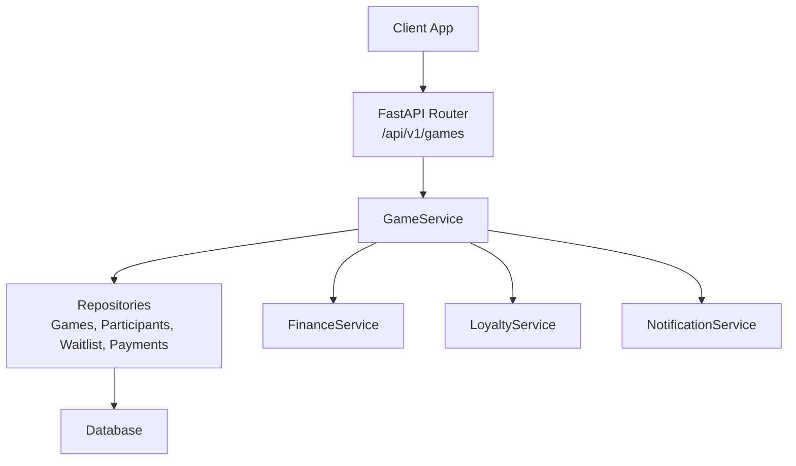
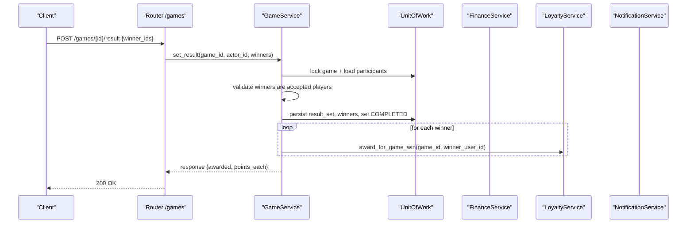
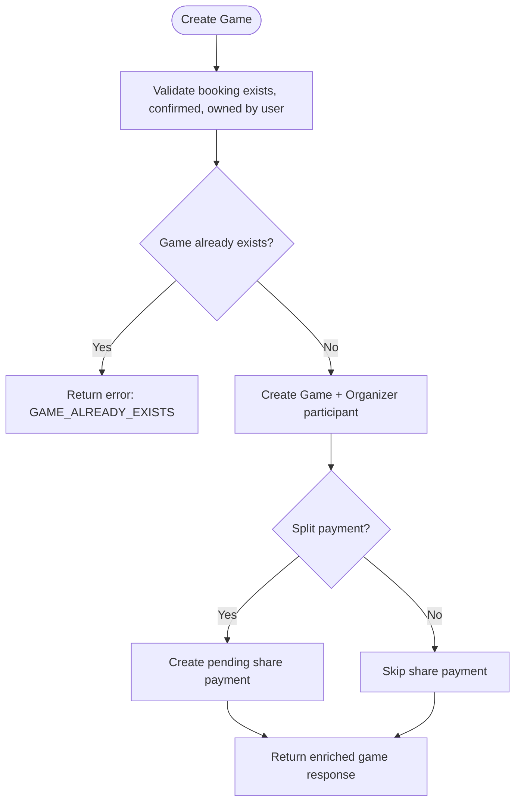
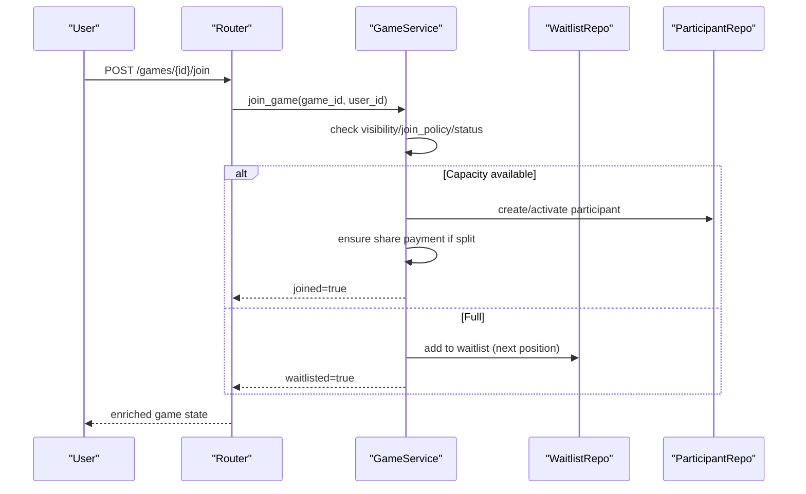
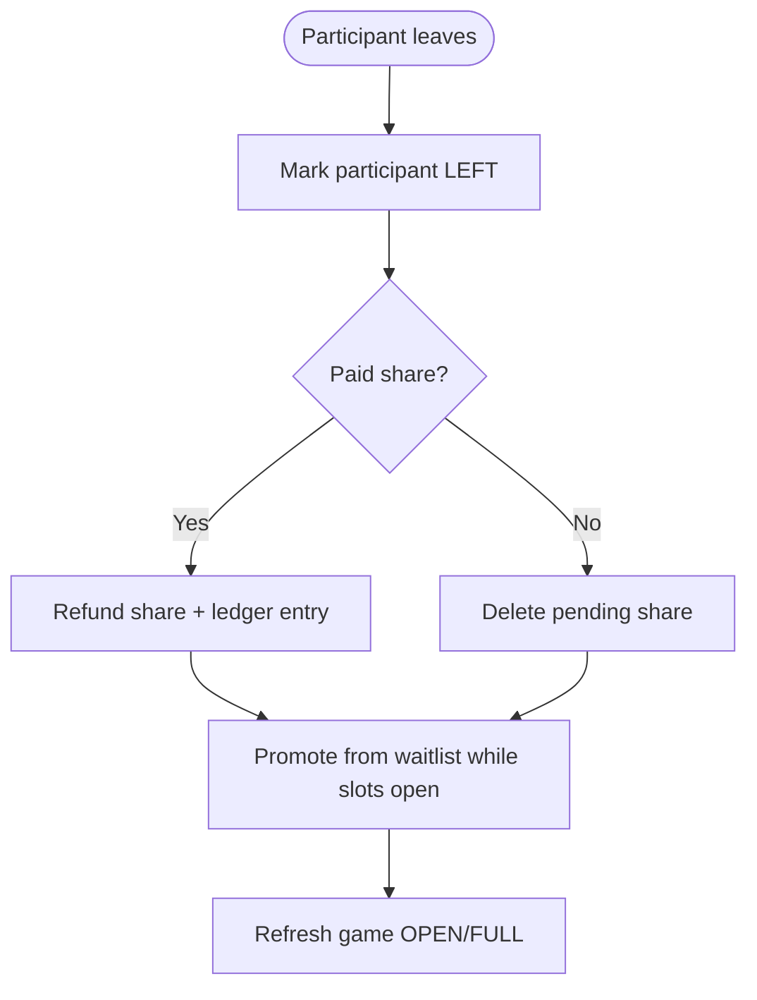
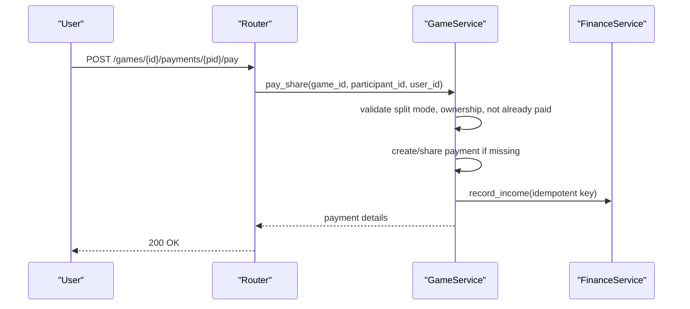
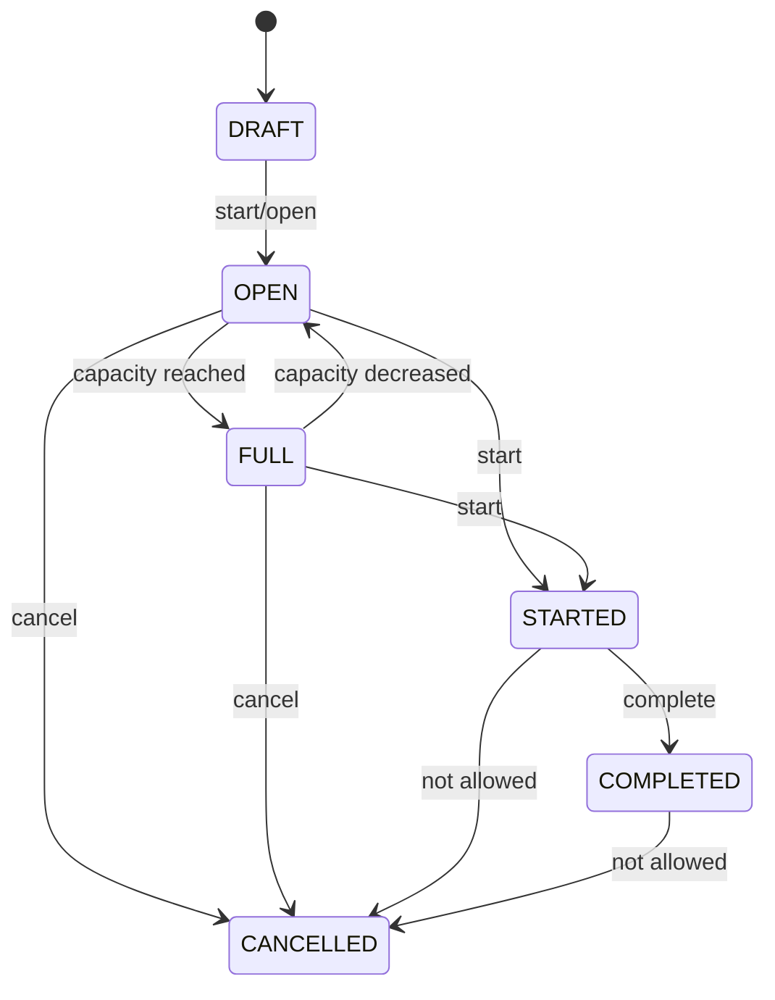
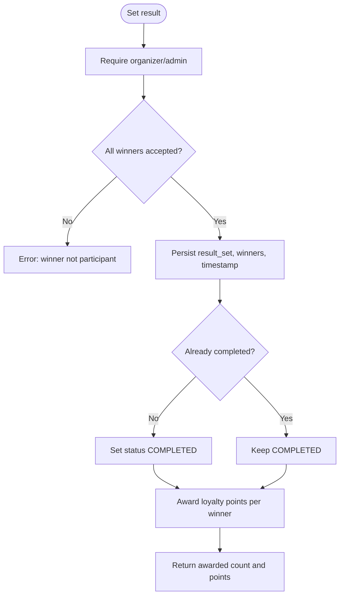
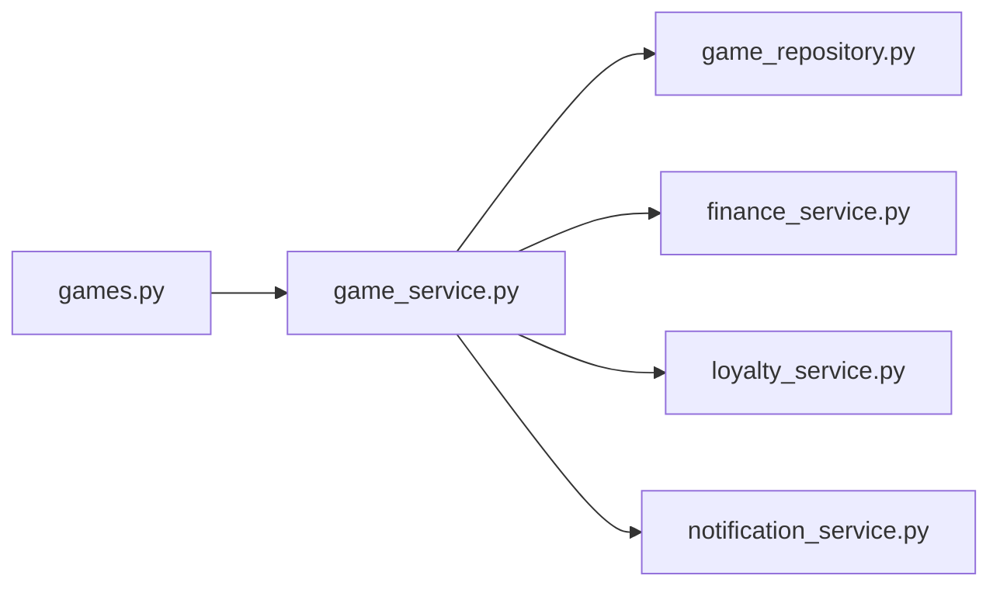

# Game Management

<cite>
**Referenced Files in This Document**
- [game.py](file://app/models/game.py)
- [game.py](file://app/schemas/game.py)
- [games.py](file://app/api/v1/games.py)
- [game_service.py](file://app/services/game_service.py)
- [game_repository.py](file://app/repositories/game_repository.py)
- [test_games_crud.py](file://tests/test_games_crud.py)
- [test_games_payments.py](file://tests/test_games_payments.py)
</cite>

## Table of Contents
1. [Introduction](#introduction)
2. [Project Structure](#project-structure)
3. [Core Components](#core-components)
4. [Architecture Overview](#architecture-overview)
5. [Detailed Component Analysis](#detailed-component-analysis)
6. [Dependency Analysis](#dependency-analysis)
7. [Performance Considerations](#performance-considerations)
8. [Troubleshooting Guide](#troubleshooting-guide)
9. [Conclusion](#conclusion)
10. [Appendices](#appendices)

## Introduction
This document explains the Game Management module for group games (open play) built on top of confirmed venue bookings. It covers game creation, participant registration and permissions, waitlist management, payment processing for split payments, scheduling and capacity control, cancellation handling, result recording with loyalty rewards, and real-time notifications. It also provides end-to-end workflow examples for player registration, fee collection, and result processing.

## Project Structure
The module is organized into layers:
- API layer: FastAPI routes under /api/v1/games that validate inputs and delegate to service logic.
- Service layer: Business rules for lifecycle transitions, join/leave flows, invitations, waitlist promotion, payments, results, and cancellations.
- Repository layer: Data access for games, participants, requests, invitations, invite links, waitlist entries, and payments.
- Models and Schemas: Domain models and Pydantic schemas for request/response validation and enrichment.

**Diagram sources**
- [games.py:63-482](file://app/api/v1/games.py#L63-L482)
- [game_service.py:47-1214](file://app/services/game_service.py#L47-L1214)
- [game_repository.py:26-361](file://app/repositories/game_repository.py#L26-L361)

**Section sources**
- [games.py:1-482](file://app/api/v1/games.py#L1-L482)
- [game_service.py:1-1214](file://app/services/game_service.py#L1-L1214)
- [game_repository.py:1-361](file://app/repositories/game_repository.py#L1-L361)

## Core Components
- Game entity with visibility, join policy, capacity, skill level, and payment mode.
- Participant roles (organizer, admin, member) and statuses (invited, pending, accepted, rejected, left, removed).
- Join requests for approval-based joins.
- Direct invitations and secure invite links with token usage limits and expiry.
- Waitlist with ordered positions and automatic promotion when slots open.
- Per-participant share payments with status tracking and refund ledger integration.
- Game lifecycle states: draft, open, full, started, completed, cancelled.
- Result recording with winner validation and loyalty points awarding.

**Section sources**
- [game.py:20-258](file://app/models/game.py#L20-L258)
- [game.py:54-287](file://app/schemas/game.py#L54-L287)

## Architecture Overview
The API routes accept authenticated requests, enforce optional public access where needed, and call service methods. The service enforces business rules, uses unit-of-work repositories for transactional data access, integrates finance and loyalty services, and emits structured notifications.

**Diagram sources**
- [games.py:229-238](file://app/api/v1/games.py#L229-L238)
- [game_service.py:919-970](file://app/services/game_service.py#L919-L970)

## Detailed Component Analysis

### Game Creation and Visibility
- Only the booking owner can create a game on a confirmed booking; duplicate games per booking are prevented.
- Visibility controls discovery: private games are hidden from explore and require an invitation or participation.
- On creation, the organizer becomes an accepted participant and a share payment record is created if split payment is enabled.

**Diagram sources**
- [game_service.py:167-203](file://app/services/game_service.py#L167-L203)
- [game_repository.py:31-44](file://app/repositories/game_repository.py#L31-L44)

**Section sources**
- [game_service.py:167-203](file://app/services/game_service.py#L167-L203)
- [test_games_crud.py:29-79](file://tests/test_games_crud.py#L29-L79)

### Participant Registration and Permissions
- Join flow supports open join and approval-based join policies.
- If capacity is full, users are placed on the waitlist with ordered positions.
- Roles: organizer (creator), admin (promotable), member. Only organizer/admin can manage participants and game settings.
- Invitations and invite links allow direct or link-based joining without approval checks.

**Diagram sources**
- [games.py:242-253](file://app/api/v1/games.py#L242-L253)
- [game_service.py:341-429](file://app/services/game_service.py#L341-L429)
- [game_repository.py:281-337](file://app/repositories/game_repository.py#L281-L337)

**Section sources**
- [game_service.py:341-429](file://app/services/game_service.py#L341-L429)
- [game_repository.py:155-187](file://app/repositories/game_repository.py#L155-L187)
- [game_repository.py:213-279](file://app/repositories/game_repository.py#L213-L279)

### Waitlist Management
- Users can join the waitlist if not already participating or waitlisted.
- When a slot opens (leave/remove), the first waitlisted user is promoted to accepted and a share payment is ensured.
- Waitlist reordering maintains stable 1-based positions.

**Diagram sources**
- [game_service.py:431-462](file://app/services/game_service.py#L431-L462)
- [game_service.py:127-162](file://app/services/game_service.py#L127-L162)
- [game_repository.py:309-337](file://app/repositories/game_repository.py#L309-L337)

**Section sources**
- [game_service.py:127-162](file://app/services/game_service.py#L127-L162)
- [game_service.py:431-462](file://app/services/game_service.py#L431-L462)
- [game_repository.py:281-337](file://app/repositories/game_repository.py#L281-L337)

### Payment Processing, Participation Fees, and Refunds
- Payment modes: organizer_pays, split_payment, free.
- In split mode, each participant gets a share payment record with amount = total venue cost // max_players.
- Pay endpoint creates or completes a share payment, records income via FinanceService, and notifies the organizer.
- Refunds occur automatically on leave or cancellation: paid shares become refunded and a negative ledger entry is recorded idempotently.

**Diagram sources**
- [games.py:471-482](file://app/api/v1/games.py#L471-L482)
- [game_service.py:1092-1152](file://app/services/game_service.py#L1092-L1152)

**Section sources**
- [game_service.py:88-110](file://app/services/game_service.py#L88-L110)
- [game_service.py:1071-1152](file://app/services/game_service.py#L1071-L1152)
- [test_games_payments.py:24-120](file://tests/test_games_payments.py#L24-L120)

### Game Scheduling, Capacity Management, and Cancellation
- Games are bound to a confirmed Booking and Slot; venue and timing are derived from the booking chain.
- Capacity is enforced server-side using accepted participant counts; game status toggles between OPEN and FULL accordingly.
- Cancellation is organizer-only, invalidates invite links, refunds paid shares, rejects pending requests, revokes pending invitations, and broadcasts a cancellation notification.

**Diagram sources**
- [game_service.py:889-917](file://app/services/game_service.py#L889-L917)
- [game_service.py:972-1022](file://app/services/game_service.py#L972-L1022)

**Section sources**
- [game_service.py:889-917](file://app/services/game_service.py#L889-L917)
- [game_service.py:972-1022](file://app/services/game_service.py#L972-L1022)
- [test_games_crud.py:188-199](file://tests/test_games_crud.py#L188-L199)

### Participant Status Tracking and Results Recording
- Participant statuses track lifecycle: invited, pending, accepted, rejected, left, removed.
- Results can be set only once by organizer/admin; winners must be current accepted participants.
- Setting results marks the game completed and awards loyalty points to each winner through LoyaltyService.

**Diagram sources**
- [game_service.py:919-970](file://app/services/game_service.py#L919-L970)

**Section sources**
- [game_service.py:919-970](file://app/services/game_service.py#L919-L970)

### Real-Time Updates via Notifications
- All significant events emit notifications: join/left, waitlist promotions, capacity changes, start/complete, cancellation, payment reminders, and payment confirmations.
- Broadcasts target all accepted participants; targeted messages go to specific users.

**Section sources**
- [game_service.py:1192-1214](file://app/services/game_service.py#L1192-L1214)
- [game_service.py:196-203](file://app/services/game_service.py#L196-L203)
- [game_service.py:418-429](file://app/services/game_service.py#L418-L429)
- [game_service.py:598-613](file://app/services/game_service.py#L598-L613)
- [game_service.py:650-661](file://app/services/game_service.py#L650-L661)
- [game_service.py:908-917](file://app/services/game_service.py#L908-L917)
- [game_service.py:1014-1020](file://app/services/game_service.py#L1014-L1020)
- [game_service.py:1138-1146](file://app/services/game_service.py#L1138-L1146)
- [game_service.py:1156-1188](file://app/services/game_service.py#L1156-L1188)

## Dependency Analysis
- API depends on service for all business logic; service depends on repositories for data access.
- Repositories depend on SQLModel sessions and base repository utilities.
- Service integrates external services for finance and loyalty, and dispatches notifications asynchronously.

**Diagram sources**
- [games.py:63-482](file://app/api/v1/games.py#L63-L482)
- [game_service.py:19-36](file://app/services/game_service.py#L19-L36)
- [game_repository.py:26-361](file://app/repositories/game_repository.py#L26-L361)

**Section sources**
- [games.py:1-482](file://app/api/v1/games.py#L1-L482)
- [game_service.py:1-1214](file://app/services/game_service.py#L1-L1214)
- [game_repository.py:1-361](file://app/repositories/game_repository.py#L1-L361)

## Performance Considerations
- Concurrency safety: critical operations lock rows using SELECT ... FOR UPDATE to prevent race conditions during join/leave/waitlist promotion.
- Efficient listing: explore queries aggregate accepted counts in bulk to avoid N+1 issues.
- Idempotency: financial entries use idempotency keys to prevent double accounting.
- Rate limiting: payment reminders are throttled per organizer per minute.

[No sources needed since this section provides general guidance]

## Troubleshooting Guide
Common errors and their meanings:
- GAME_NOT_FOUND: requested game does not exist.
- BOOKING_NOT_FOUND / BOOKING_NOT_CONFIRMED: game creation requires a valid, confirmed booking.
- GAME_ALREADY_EXISTS: one game per booking enforced.
- PRIVATE_GAME: accessing a private game without permission.
- ALREADY_JOINED / ALREADY_WAITLISTED: duplicate participation attempts.
- GAME_FULL / GAME_STARTED / GAME_COMPLETED: actions blocked by game state.
- INVALID_STATUS_TRANSITION: illegal lifecycle transition.
- PAYMENT_NOT_REQUIRED / PAYMENT_ALREADY_PAID: split payment constraints.
- RESULT_ALREADY_SET: results can be recorded once.

**Section sources**
- [game_service.py:43-45](file://app/services/game_service.py#L43-L45)
- [game_service.py:69-86](file://app/services/game_service.py#L69-L86)
- [game_service.py:341-429](file://app/services/game_service.py#L341-L429)
- [game_service.py:889-917](file://app/services/game_service.py#L889-L917)
- [game_service.py:1092-1152](file://app/services/game_service.py#L1092-L1152)
- [game_service.py:919-970](file://app/services/game_service.py#L919-L970)

## Conclusion
The Game Management module provides a robust, secure, and scalable system for organizing group games around venue bookings. It enforces strict lifecycle transitions, manages capacity and waitlists safely under concurrency, handles split payments with financial integrity, and records results with loyalty rewards. Notifications keep participants informed in real time, and comprehensive tests validate core behaviors.

## Appendices

### Example Workflows

#### Player Registration Flow
- Public game: user joins directly; if full, added to waitlist.
- Approval-required game: user submits join request; organizer approves/denies.
- Invitation/link: user accepts invitation or uses token to join without approval.

**Section sources**
- [game_service.py:341-429](file://app/services/game_service.py#L341-L429)
- [game_service.py:543-613](file://app/services/game_service.py#L543-L613)
- [game_service.py:617-708](file://app/services/game_service.py#L617-L708)
- [game_service.py:775-801](file://app/services/game_service.py#L775-L801)

#### Fee Collection Flow (Split Payment)
- On join, a pending share payment is created for each participant.
- User pays via pay endpoint; system records income and notifies organizer.
- Summary endpoints show per-participant payment status.

**Section sources**
- [game_service.py:88-110](file://app/services/game_service.py#L88-L110)
- [game_service.py:1071-1152](file://app/services/game_service.py#L1071-L1152)
- [test_games_payments.py:24-120](file://tests/test_games_payments.py#L24-L120)

#### Result Processing Flow
- Organizer/admin sets winners; system validates they are accepted participants.
- Game marked completed; loyalty points awarded to each winner.
- Subsequent attempts to set results are rejected.

**Section sources**
- [game_service.py:919-970](file://app/services/game_service.py#L919-L970)