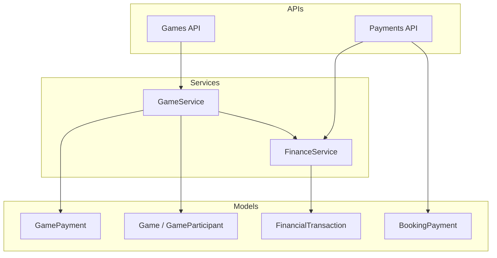
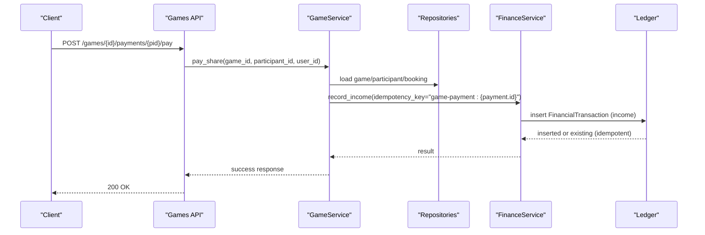
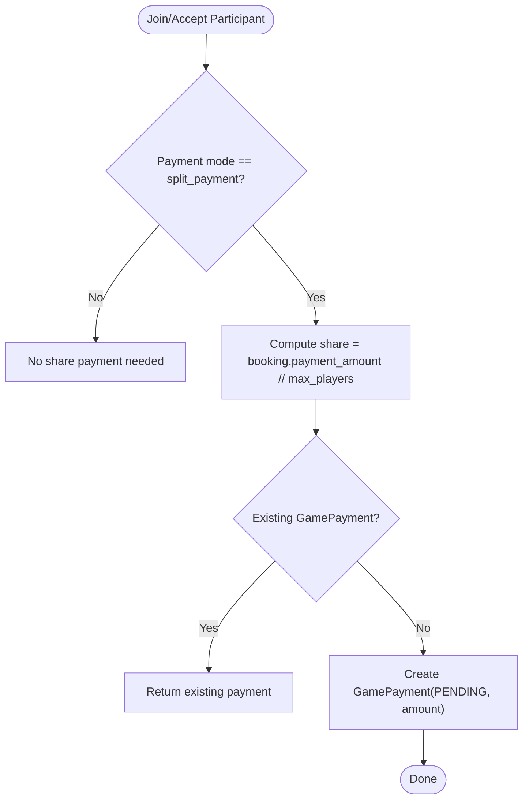
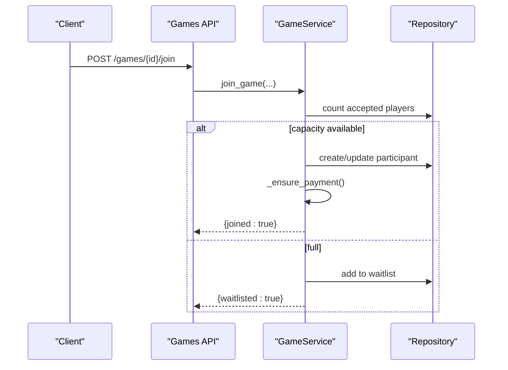
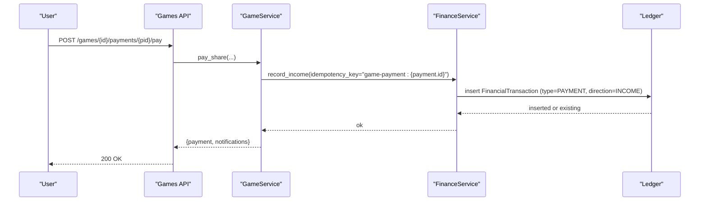
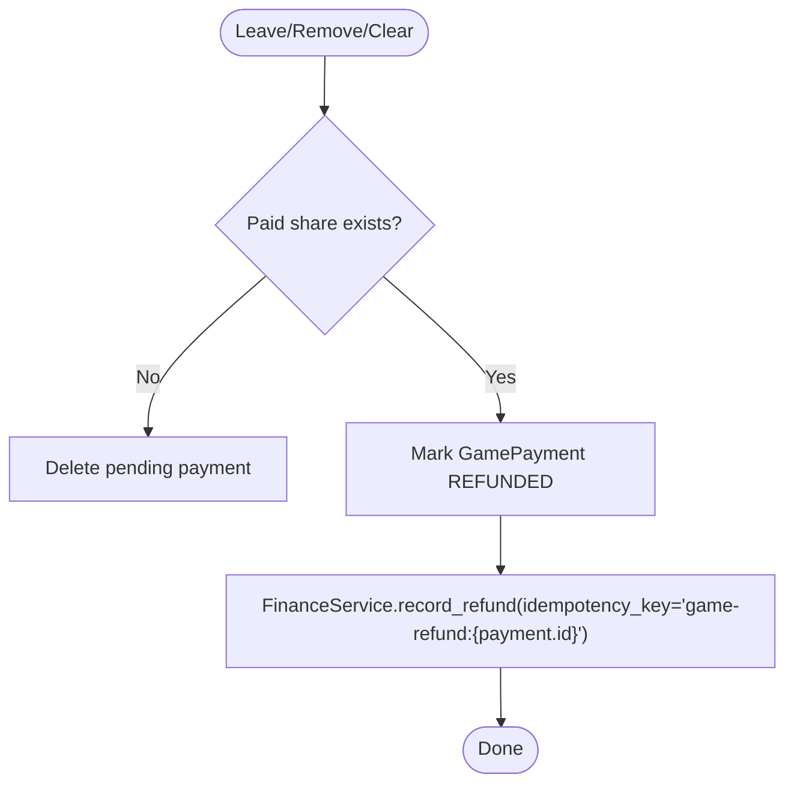
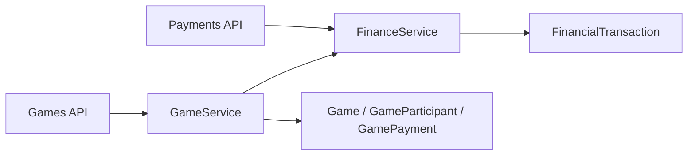
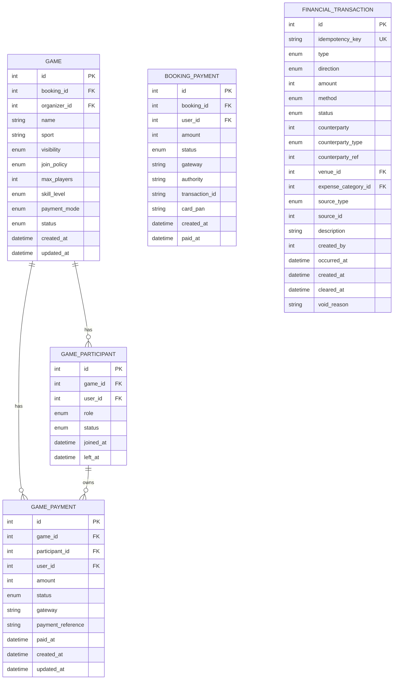

# Game Payment Processing

<cite>
**Referenced Files in This Document**
- [game.py](file://app/models/game.py)
- [payment.py](file://app/models/payment.py)
- [transaction.py](file://app/models/transaction.py)
- [games.py](file://app/api/v1/games.py)
- [payments.py](file://app/api/v1/payments.py)
- [game_service.py](file://app/services/game_service.py)
- [finance_service.py](file://app/services/finance_service.py)
- [schemas/game.py](file://app/schemas/game.py)
- [schemas/payment.py](file://app/schemas/payment.py)
- [test_game_refund_ledger.py](file://tests/test_game_refund_ledger.py)
</cite>

## Table of Contents
1. Introduction
2. Project Structure
3. Core Components
4. Architecture Overview
5. Detailed Component Analysis
6. Dependency Analysis
7. Performance Considerations
8. Troubleshooting Guide
9. Conclusion
10. Appendices

## Introduction
This document explains the Game Payment Processing system with a focus on split payment mode, payment status management, automatic payment creation during participant registration, refund processing when participants leave or are removed, and integration with the financial ledger for transaction recording. It also covers idempotency keys and duplicate payment prevention mechanisms, along with practical workflows and reporting guidance.

## Project Structure
The game payment flow spans models, services, APIs, and the financial ledger:
- Models define entities such as Game, GameParticipant, GamePayment, BookingPayment, and FinancialTransaction.
- Services implement business logic for join/leave flows, split share calculation, payment posting, and refunds.
- APIs expose endpoints to create games, join/leave, pay shares, and manage payments.
- The finance service records income and refunds into an append-only ledger with idempotency protection.

**Diagram sources**
- [games.py:63-71](file://app/api/v1/games.py#L63-L71)
- [payments.py:42-78](file://app/api/v1/payments.py#L42-L78)
- [game_service.py:167-203](file://app/services/game_service.py#L167-L203)
- [finance_service.py:130-161](file://app/services/finance_service.py#L130-L161)

**Section sources**
- [game.py:97-134](file://app/models/game.py#L97-L134)
- [payment.py:15-29](file://app/models/payment.py#L15-L29)
- [transaction.py:84-119](file://app/models/transaction.py#L84-L119)
- [games.py:63-71](file://app/api/v1/games.py#L63-L71)
- [payments.py:42-78](file://app/api/v1/payments.py#L42-L78)

## Core Components
- Split payment mode: Games can be configured to split the total booking cost among participants. Each accepted participant gets a per-share amount derived from the booking total divided by max players.
- Payment statuses:
  - GamePaymentStatus: pending, paid, failed, refunded.
  - BookingPaymentStatus: pending, paid, failed, refunded.
- Automatic payment creation: When a participant is accepted (join, invitation accept, waitlist promotion), a GamePayment row is created if split payment is enabled.
- Refunds: If a participant leaves or is removed, any paid share is marked refunded and a corresponding ledger refund row is recorded.
- Ledger integration: Income and refunds are recorded via FinanceService with idempotency keys to prevent duplicates.

**Section sources**
- [game.py:42-46](file://app/models/game.py#L42-L46)
- [game.py:87-93](file://app/models/game.py#L87-L93)
- [game.py:241-258](file://app/models/game.py#L241-L258)
- [payment.py:7-12](file://app/models/payment.py#L7-L12)
- [game_service.py:88-110](file://app/services/game_service.py#L88-L110)
- [game_service.py:465-500](file://app/services/game_service.py#L465-L500)
- [finance_service.py:130-161](file://app/services/finance_service.py#L130-L161)

## Architecture Overview
The system separates concerns across layers:
- API layer validates requests and delegates to services.
- Service layer enforces business rules, computes split amounts, manages participant lifecycle, and triggers financial postings.
- Ledger layer ensures append-only accounting with idempotency.

**Diagram sources**
- [games.py:471-481](file://app/api/v1/games.py#L471-L481)
- [game_service.py:1092-1152](file://app/services/game_service.py#L1092-L1152)
- [finance_service.py:130-161](file://app/services/finance_service.py#L130-L161)

## Detailed Component Analysis

### Split Payment Mode and Share Calculation
- Payment modes include organizer_pays, split_payment, and free.
- In split_payment mode, each participant’s share equals the booking payment amount divided by max_players using integer division; remainder is handled elsewhere to avoid loss.
- Price per player is exposed in game responses when applicable.

**Diagram sources**
- [game_service.py:88-110](file://app/services/game_service.py#L88-L110)
- [game_service.py:1071-1090](file://app/services/game_service.py#L1071-L1090)

**Section sources**
- [game.py:42-46](file://app/models/game.py#L42-L46)
- [game_service.py:88-110](file://app/services/game_service.py#L88-L110)
- [schemas/game.py:76-120](file://app/schemas/game.py#L76-L120)

### Payment Status Management
- GamePaymentStatus transitions:
  - Pending: created automatically upon acceptance.
  - Paid: set when participant pays their share.
  - Failed: not used in split flow here (used in booking payments).
  - Refunded: set when participant leaves or is removed, or game is cancelled.
- BookingPaymentStatus applies to venue bookings and is separate from game shares.

**Section sources**
- [game.py:87-93](file://app/models/game.py#L87-L93)
- [payment.py:7-12](file://app/models/payment.py#L7-L12)
- [game_service.py:1092-1152](file://app/services/game_service.py#L1092-L1152)

### Automatic Payment Creation During Registration
- When a participant joins or is promoted from waitlist, the system ensures a GamePayment exists for them if split payment is enabled.
- This happens in join flow, invitation acceptance, and waitlist promotion paths.

**Diagram sources**
- [game_service.py:341-429](file://app/services/game_service.py#L341-L429)
- [game_service.py:127-162](file://app/services/game_service.py#L127-L162)

**Section sources**
- [game_service.py:341-429](file://app/services/game_service.py#L341-L429)
- [game_service.py:127-162](file://app/services/game_service.py#L127-L162)

### Paying Shares and Ledger Integration
- Participants pay their share via a dedicated endpoint that marks the GamePayment as paid and records income in the ledger with an idempotency key based on the payment ID.
- Notifications are sent to the organizer upon successful payment.

**Diagram sources**
- [games.py:471-481](file://app/api/v1/games.py#L471-L481)
- [game_service.py:1092-1152](file://app/services/game_service.py#L1092-L1152)
- [finance_service.py:130-161](file://app/services/finance_service.py#L130-L161)

**Section sources**
- [game_service.py:1092-1152](file://app/services/game_service.py#L1092-L1152)
- [finance_service.py:130-161](file://app/services/finance_service.py#L130-L161)

### Refund Processing on Leave or Removal
- When a participant leaves or is removed:
  - If their share was paid, it is marked refunded and a ledger refund row is recorded with an idempotency key tied to the original payment ID.
  - If the share was pending, the payment row is deleted.
- Game cancellation refunds all paid shares and records corresponding ledger refunds.

**Diagram sources**
- [game_service.py:465-500](file://app/services/game_service.py#L465-L500)
- [game_service.py:501-539](file://app/services/game_service.py#L501-L539)
- [game_service.py:972-1022](file://app/services/game_service.py#L972-L1022)
- [finance_service.py:198-228](file://app/services/finance_service.py#L198-L228)

**Section sources**
- [game_service.py:465-500](file://app/services/game_service.py#L465-L500)
- [game_service.py:501-539](file://app/services/game_service.py#L501-L539)
- [game_service.py:972-1022](file://app/services/game_service.py#L972-L1022)
- [finance_service.py:198-228](file://app/services/finance_service.py#L198-L228)

### Idempotency Keys and Duplicate Prevention
- Ledger writes use idempotency keys:
  - Income for game shares: "game-payment:{payment.id}"
  - Refunds for game shares: "game-refund:{payment.id}"
- FinanceService checks for existing transactions with the same idempotency key and returns the existing one instead of creating duplicates.
- Tests verify that double-canceling a game does not produce duplicate refund rows.

**Section sources**
- [finance_service.py:118-127](file://app/services/finance_service.py#L118-L127)
- [finance_service.py:198-228](file://app/services/finance_service.py#L198-L228)
- [test_game_refund_ledger.py:54-95](file://tests/test_game_refund_ledger.py#L54-L95)

### Payment Workflows and Examples

#### Example: Join Flow with Split Payment
- Organizer creates a game with split_payment mode.
- Participants join; if capacity allows, they become accepted and a GamePayment is created in pending state.
- Organizer can remind unpaid participants.

**Section sources**
- [games.py:63-71](file://app/api/v1/games.py#L63-L71)
- [game_service.py:167-203](file://app/services/game_service.py#L167-L203)
- [game_service.py:341-429](file://app/services/game_service.py#L341-L429)
- [game_service.py:1156-1188](file://app/services/game_service.py#L1156-L1188)

#### Example: Pay Share
- A participant calls the pay endpoint for their share.
- System marks the payment as paid and records income in the ledger with idempotency protection.

**Section sources**
- [games.py:471-481](file://app/api/v1/games.py#L471-L481)
- [game_service.py:1092-1152](file://app/services/game_service.py#L1092-L1152)
- [finance_service.py:130-161](file://app/services/finance_service.py#L130-L161)

#### Example: Refund Scenarios
- Participant leaves: paid share becomes refunded and a refund ledger row is recorded.
- Organizer removes a participant: same behavior as leave.
- Organizer cancels game: all paid shares are refunded and ledger entries are created.

**Section sources**
- [game_service.py:465-500](file://app/services/game_service.py#L465-L500)
- [game_service.py:501-539](file://app/services/game_service.py#L501-L539)
- [game_service.py:972-1022](file://app/services/game_service.py#L972-L1022)
- [test_game_refund_ledger.py:98-121](file://tests/test_game_refund_ledger.py#L98-L121)

### Financial Reporting for Game-Related Transactions
- Use FinanceService reports to analyze revenue by source, including GAME_PAYMENT.
- Revenue series and dashboard methods aggregate cleared income and expenses over date ranges, supporting operational insights.
- Export CSV includes ledger fields like idempotency_key, type, direction, and description for auditability.

**Section sources**
- [finance_service.py:423-453](file://app/services/finance_service.py#L423-L453)
- [finance_service.py:494-572](file://app/services/finance_service.py#L494-L572)
- [finance_service.py:714-737](file://app/services/finance_service.py#L714-L737)

## Dependency Analysis
Key dependencies and relationships:
- Games API depends on GameService for business logic.
- GameService depends on repositories for data access and FinanceService for ledger operations.
- FinanceService depends on repositories to read/write FinancialTransaction and related entities.
- Models define constraints and relationships ensuring referential integrity and clear separation between booking payments and game share payments.

**Diagram sources**
- [games.py:63-71](file://app/api/v1/games.py#L63-L71)
- [payments.py:42-78](file://app/api/v1/payments.py#L42-L78)
- [game_service.py:167-203](file://app/services/game_service.py#L167-L203)
- [finance_service.py:130-161](file://app/services/finance_service.py#L130-L161)

**Section sources**
- [game.py:97-134](file://app/models/game.py#L97-L134)
- [transaction.py:84-119](file://app/models/transaction.py#L84-L119)
- [game_service.py:167-203](file://app/services/game_service.py#L167-L203)
- [finance_service.py:130-161](file://app/services/finance_service.py#L130-L161)

## Performance Considerations
- Concurrency safety: Game operations lock the game row to prevent race conditions during join/leave and capacity updates.
- Integer arithmetic: Split amounts use integer division to avoid floating-point issues; remainder handling avoids silent loss.
- Append-only ledger: Reduces locking complexity and ensures consistent reporting without mutating historical rows.
- Rate limiting: Payment endpoints apply rate limits to mitigate abuse.

[No sources needed since this section provides general guidance]

## Troubleshooting Guide
Common issues and resolutions:
- Duplicate payment attempts:
  - Symptom: Repeated pay calls for the same share.
  - Resolution: Idempotency keys ensure only one ledger income row is created; repeated calls return the existing payment.
- Double cancellation:
  - Symptom: Attempting to cancel an already cancelled game.
  - Resolution: Endpoint returns conflict error; no duplicate refund rows are created due to idempotency.
- Unauthorized pay/share actions:
  - Symptom: User tries to pay another participant’s share.
  - Resolution: Enforce ownership check; only the participant can pay their own share.
- Capacity and waitlist:
  - Symptom: Join fails due to full capacity.
  - Resolution: Add to waitlist; promotions occur automatically when space opens.

**Section sources**
- [finance_service.py:118-127](file://app/services/finance_service.py#L118-L127)
- [test_game_refund_ledger.py:54-95](file://tests/test_game_refund_ledger.py#L54-L95)
- [game_service.py:1092-1152](file://app/services/game_service.py#L1092-L1152)
- [game_service.py:341-429](file://app/services/game_service.py#L341-L429)

## Conclusion
The Game Payment Processing system implements robust split payment support with clear status management, automatic payment creation, and comprehensive refund handling. Integration with the financial ledger ensures accurate, auditable, and idempotent transaction recording. The design supports reliable operations under concurrency and provides useful reporting capabilities for game-related finances.

[No sources needed since this section summarizes without analyzing specific files]

## Appendices

### Data Models Overview

**Diagram sources**
- [game.py:97-134](file://app/models/game.py#L97-L134)
- [game.py:138-154](file://app/models/game.py#L138-L154)
- [game.py:241-258](file://app/models/game.py#L241-L258)
- [payment.py:15-29](file://app/models/payment.py#L15-L29)
- [transaction.py:84-119](file://app/models/transaction.py#L84-L119)