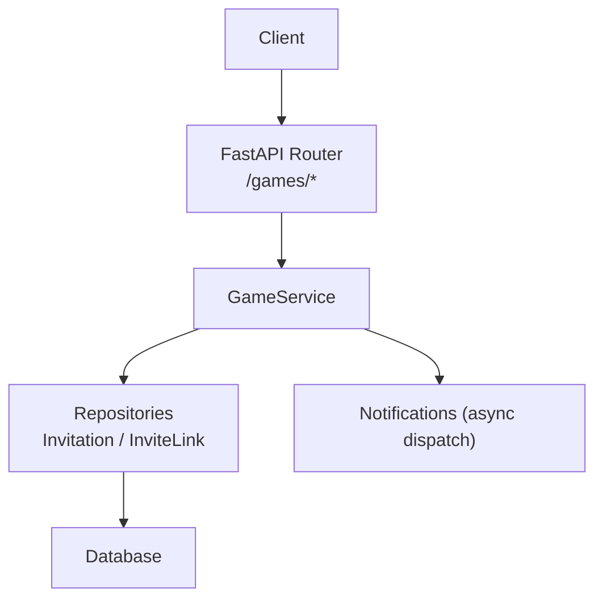
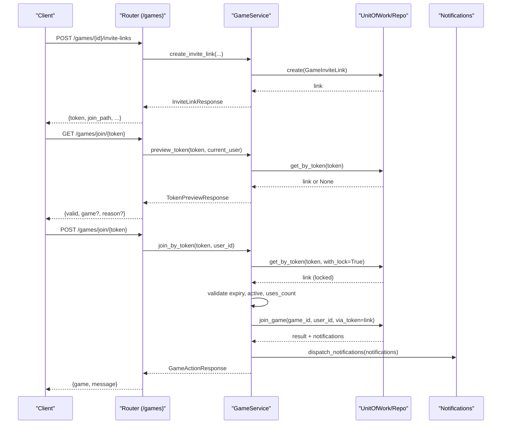
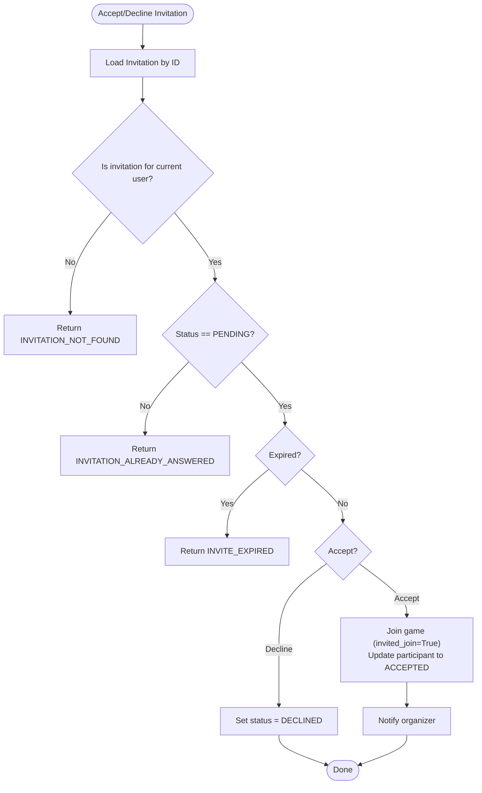
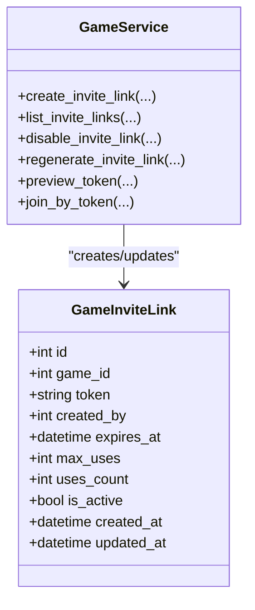
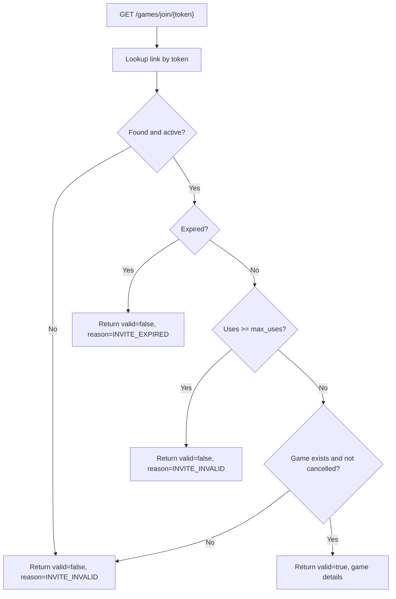
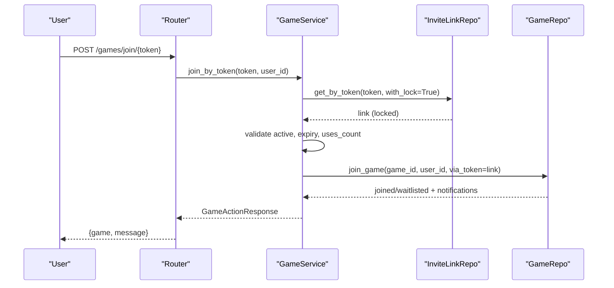
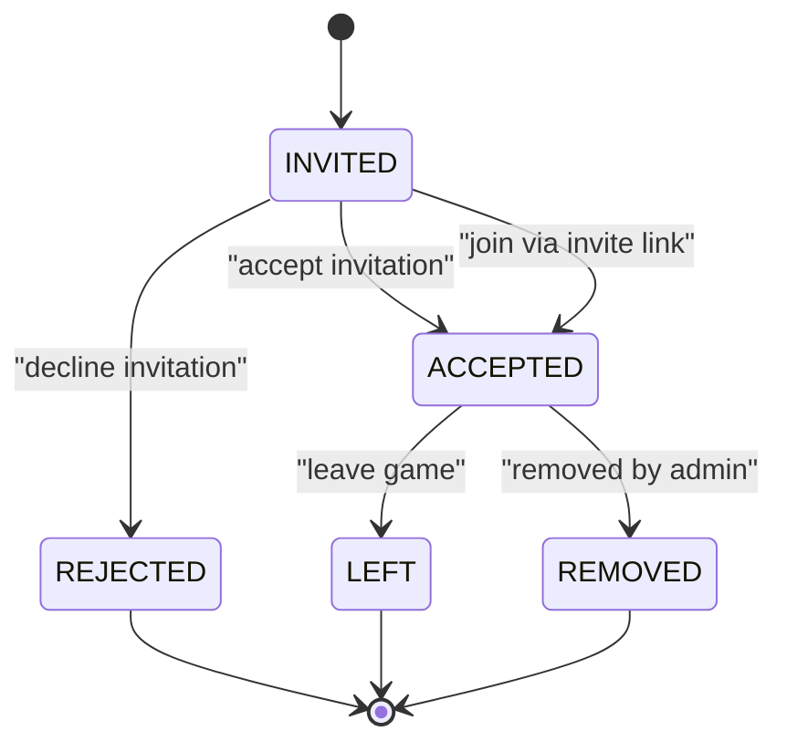
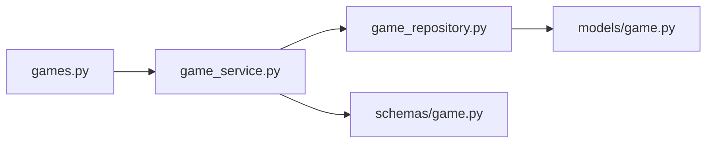

# Invitations & Invite Links

<cite>
**Referenced Files in This Document**
- [games.py](file://app/api/v1/games.py)
- [game_service.py](file://app/services/game_service.py)
- [game_repository.py](file://app/repositories/game_repository.py)
- [game.py](file://app/models/game.py)
- [game_schemas.py](file://app/schemas/game.py)
- [test_games_invitations.py](file://tests/test_games_invitations.py)
</cite>

## Table of Contents
1. [Introduction](#introduction)
2. [Project Structure](#project-structure)
3. [Core Components](#core-components)
4. [Architecture Overview](#architecture-overview)
5. [Detailed Component Analysis](#detailed-component-analysis)
6. [Dependency Analysis](#dependency-analysis)
7. [Performance Considerations](#performance-considerations)
8. [Troubleshooting Guide](#troubleshooting-guide)
9. [Conclusion](#conclusion)

## Introduction
This document explains the Invitations and Invite Links system for group games. It covers:
- Direct user invitations with expiration dates and status tracking
- Secure invite link generation with tokens, usage limits, and expiration controls
- Invitation acceptance/declination workflows and automatic participant status updates
- Invite link preview functionality and validation processes
- Examples of creating invitations, generating secure invite links, managing link usage, and handling lifecycle events
- Security considerations to protect against unauthorized access

## Project Structure
The feature spans API routes, service logic, repositories, models, schemas, and tests:
- API layer exposes endpoints for invitations and invite links
- Service layer implements business rules, validations, and state transitions
- Repository layer provides data access with locking for concurrency safety
- Models define entities such as invitations and invite links
- Schemas define request/response contracts
- Tests validate end-to-end flows including expiration, reuse limits, and permissions

**Diagram sources**
- [games.py:110-165](file://app/api/v1/games.py#L110-L165)
- [game_service.py:617-800](file://app/services/game_service.py#L617-L800)
- [game_repository.py:213-279](file://app/repositories/game_repository.py#L213-L279)

**Section sources**
- [games.py:110-165](file://app/api/v1/games.py#L110-L165)
- [game_service.py:617-800](file://app/services/game_service.py#L617-L800)
- [game_repository.py:213-279](file://app/repositories/game_repository.py#L213-L279)

## Core Components
- GameInvitation: direct invitation per game and user, with status and optional expiration
- GameInviteLink: secure token-based link with optional expiration and usage limit
- ParticipantStatus: tracks invited/pending/accepted/rejected/left/removed states
- GameVisibility and JoinPolicy: control who can join and whether approval is required
- TokenPreviewResponse: public preview of a game via invite token without exposing IDs directly

Key responsibilities:
- Create/manage direct invitations with expiration and deduplication
- Generate secure invite links with random tokens, optional expiry, and max uses
- Validate and process link previews and joins
- Accept/decline invitations and update participant status accordingly
- Enforce permissions and prevent race conditions using row-level locks

**Section sources**
- [game.py:74-85](file://app/models/game.py#L74-L85)
- [game.py:179-216](file://app/models/game.py#L179-L216)
- [game_schemas.py:172-219](file://app/schemas/game.py#L172-L219)

## Architecture Overview
The flow combines API routing, service orchestration, repository access, and notifications:

**Diagram sources**
- [games.py:144-165](file://app/api/v1/games.py#L144-L165)
- [game_service.py:712-800](file://app/services/game_service.py#L712-L800)
- [game_repository.py:247-258](file://app/repositories/game_repository.py#L247-L258)

## Detailed Component Analysis

### Direct User Invitations
- Creation: Organizers/admins can invite users to a game with an optional expiration window. Duplicate pending invitations are prevented. If no participant exists yet, one is created with status INVITED.
- Listing: Users can list their pending invitations; only non-expired invitations for active games are shown.
- Acceptance: Accepting an invitation immediately joins the user to the game, bypassing visibility/approval checks, and updates participant status to ACCEPTED. A notification is sent to the organizer.
- Declination: Declining sets the invitation to DECLINED and marks participant status REJECTED if previously INVITED. No further action on participation occurs.

**Diagram sources**
- [game_service.py:673-708](file://app/services/game_service.py#L673-L708)
- [game_repository.py:213-244](file://app/repositories/game_repository.py#L213-L244)

**Section sources**
- [game_service.py:617-708](file://app/services/game_service.py#L617-L708)
- [game_repository.py:213-244](file://app/repositories/game_repository.py#L213-L244)
- [games.py:110-139](file://app/api/v1/games.py#L110-L139)

### Invite Link Generation and Management
- Generation: Authorized organizers/admins generate a secure token using a cryptographically safe generator. Optional expiration days and maximum uses can be set. The response includes a relative join path for frontend use.
- Listing: Only active links for a game are returned to authorized users.
- Disabling: An active link can be disabled; subsequent previews/joins will fail.
- Regeneration: Disables the old link atomically and creates a new one with the same constraints (expiry, max uses), invalidating the previous token.

**Diagram sources**
- [game.py:202-216](file://app/models/game.py#L202-L216)
- [game_service.py:712-773](file://app/services/game_service.py#L712-L773)

**Section sources**
- [game_service.py:712-773](file://app/services/game_service.py#L712-L773)
- [game_schemas.py:194-213](file://app/schemas/game.py#L194-L213)
- [games.py:371-407](file://app/api/v1/games.py#L371-L407)

### Invite Link Preview and Validation
- Public preview: Anyone can call the preview endpoint to check validity without authentication. It returns whether the token is valid and, if so, a sanitized game response. Invalid/expired/cancelled cases return structured reasons.
- Validation rules enforced during preview:
  - Link must exist and be active
  - Must not be expired
  - Must not exceed max_uses
  - Game must exist and not be cancelled

**Diagram sources**
- [game_service.py:775-789](file://app/services/game_service.py#L775-L789)
- [game_repository.py:247-265](file://app/repositories/game_repository.py#L247-L265)

**Section sources**
- [game_service.py:775-789](file://app/services/game_service.py#L775-L789)
- [games.py:144-151](file://app/api/v1/games.py#L144-L151)

### Joining via Invite Link
- Authentication required: The join endpoint requires an authenticated user.
- Concurrency-safe: The link is locked before validation and incrementing uses to avoid race conditions.
- Validation: Checks active status, expiry, and usage limit.
- Join behavior: Joins the user to the game, bypassing visibility/approval restrictions, and increments uses_count. If capacity is full, the user may be waitlisted instead.
- Notifications: Organizer is notified when a user joins via link.

**Diagram sources**
- [game_service.py:791-800](file://app/services/game_service.py#L791-L800)
- [game_repository.py:247-258](file://app/repositories/game_repository.py#L247-L258)
- [games.py:154-165](file://app/api/v1/games.py#L154-L165)

**Section sources**
- [game_service.py:791-800](file://app/services/game_service.py#L791-L800)
- [game_repository.py:247-258](file://app/repositories/game_repository.py#L247-L258)
- [games.py:154-165](file://app/api/v1/games.py#L154-L165)

### Automatic Participant Status Updates
- On accept: Participant status becomes ACCEPTED; payment share is created if applicable; game status refreshed to FULL/OPEN based on counts.
- On decline: If participant was INVITED, status becomes REJECTED.
- On join via link: Participant becomes ACCEPTED; uses_count increments; game status refreshed.
- On leave/remove: Participant status moves to LEFT/REMOVED; payments refunded or deleted; waitlist promotions occur; game status refreshed.

**Diagram sources**
- [game_service.py:341-429](file://app/services/game_service.py#L341-L429)
- [game_service.py:431-539](file://app/services/game_service.py#L431-L539)
- [game_service.py:673-708](file://app/services/game_service.py#L673-L708)

**Section sources**
- [game_service.py:341-539](file://app/services/game_service.py#L341-L539)
- [game_service.py:673-708](file://app/services/game_service.py#L673-L708)

## Dependency Analysis
- API depends on GameService for all business logic
- GameService depends on UnitOfWork and Repositories for persistence
- Repositories implement locking for concurrency safety on critical paths
- Models define relationships between Game, participants, invitations, invite links, waitlist, and payments
- Schemas enforce input validation and structure responses

**Diagram sources**
- [games.py:110-165](file://app/api/v1/games.py#L110-L165)
- [game_service.py:617-800](file://app/services/game_service.py#L617-L800)
- [game_repository.py:213-279](file://app/repositories/game_repository.py#L213-L279)
- [game.py:179-216](file://app/models/game.py#L179-L216)
- [game_schemas.py:172-219](file://app/schemas/game.py#L172-L219)

**Section sources**
- [games.py:110-165](file://app/api/v1/games.py#L110-L165)
- [game_service.py:617-800](file://app/services/game_service.py#L617-L800)
- [game_repository.py:213-279](file://app/repositories/game_repository.py#L213-L279)
- [game.py:179-216](file://app/models/game.py#L179-L216)
- [game_schemas.py:172-219](file://app/schemas/game.py#L172-L219)

## Performance Considerations
- Row-level locking: Critical operations lock the Game row to prevent race conditions during join/leave and link usage increments
- Efficient queries: Counting accepted players and listing explore results use optimized SQL to avoid N+1 issues
- Incremental updates: Game status refreshes only when necessary to minimize writes
- Notification batching: Notifications are collected and dispatched asynchronously to reduce latency

[No sources needed since this section provides general guidance]

## Troubleshooting Guide
Common errors and causes:
- INVITE_INVALID: Token not found, inactive, or exceeded max_uses
- INVITE_EXPIRED: Token past its expires_at time
- GAME_CANCELLED: Target game has been cancelled
- NOT_AUTHORIZED: Attempting to manage invite links without organizer/admin role
- ALREADY_JOINED / ALREADY_WAITLISTED: User already participates or is on waitlist
- INVITATION_ALREADY_ANSWERED: Invitation already accepted or declined
- USER_NOT_FOUND: Target user does not exist when inviting

Operational tips:
- Use preview endpoint to validate tokens before sharing
- Regenerate links to invalidate old tokens quickly
- Monitor uses_count vs max_uses to ensure capacity controls work as expected
- Ensure database transactions commit changes to avoid inconsistent states

**Section sources**
- [test_games_invitations.py:22-100](file://tests/test_games_invitations.py#L22-L100)
- [test_games_invitations.py:105-171](file://tests/test_games_invitations.py#L105-L171)
- [game_service.py:775-800](file://app/services/game_service.py#L775-L800)

## Conclusion
The Invitations and Invite Links system provides robust mechanisms for both direct invitations and secure token-based links. It enforces strict validation, supports expiration and usage limits, and ensures consistent participant status updates. Security measures include secure token generation, permission checks, and concurrency-safe operations. The design balances flexibility with safety, enabling organizers to manage access effectively while protecting against unauthorized entry.

[No sources needed since this section summarizes without analyzing specific files]