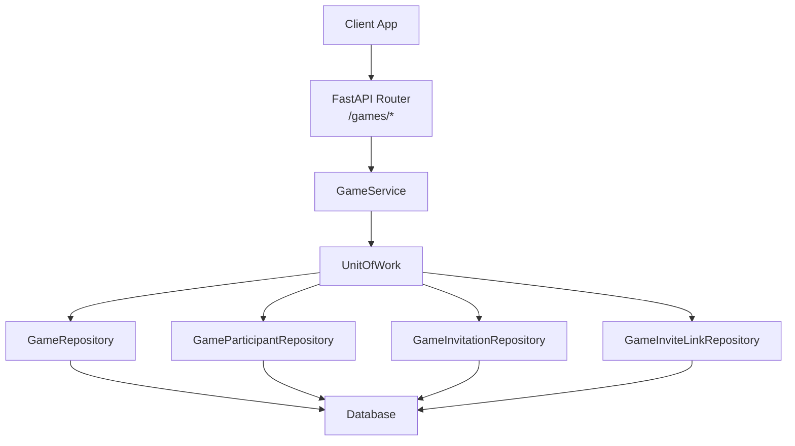
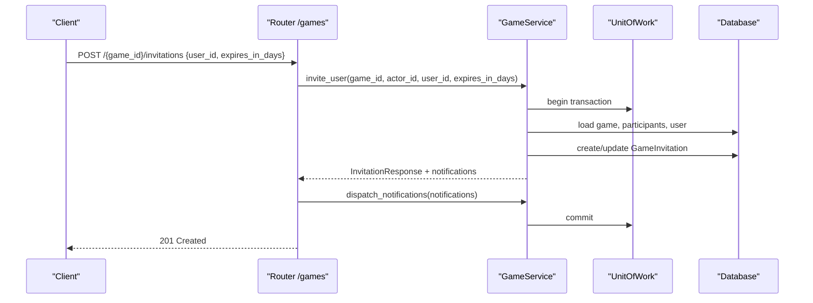
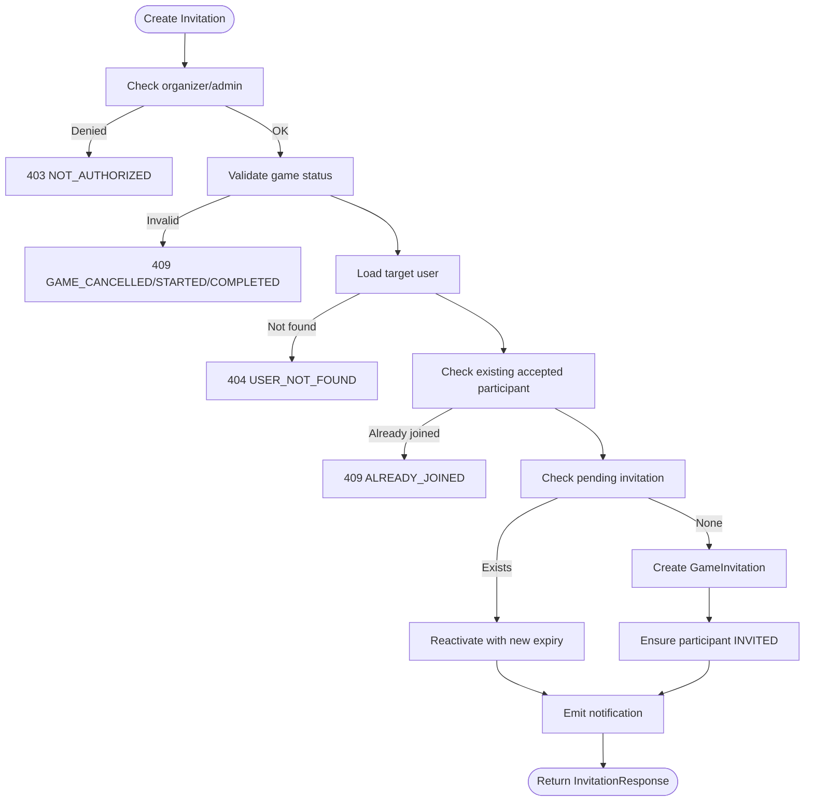
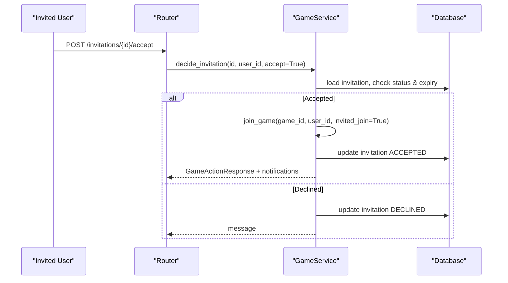
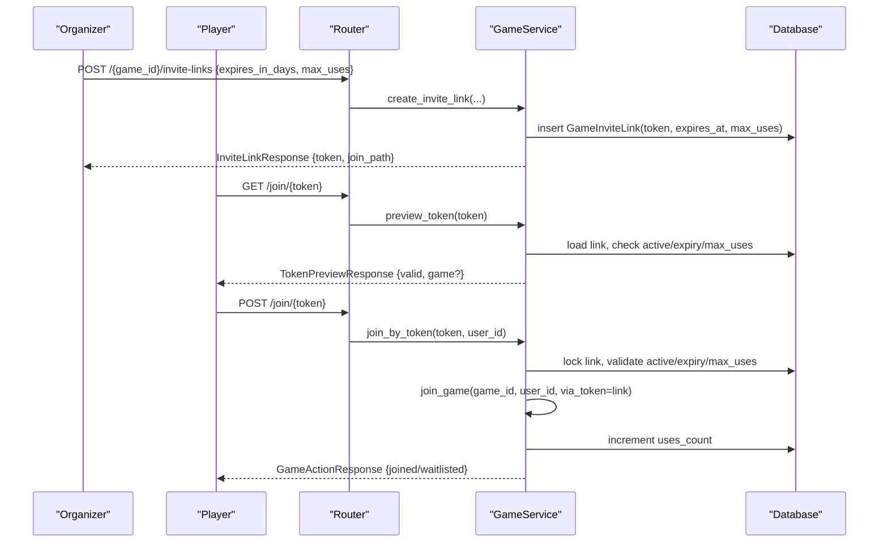
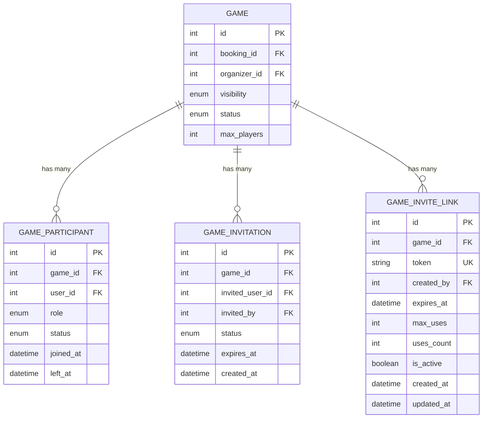
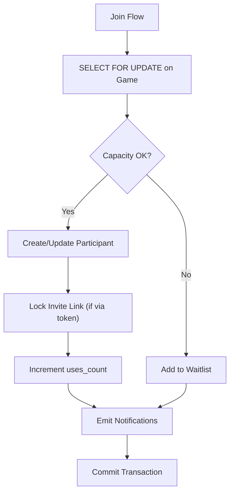
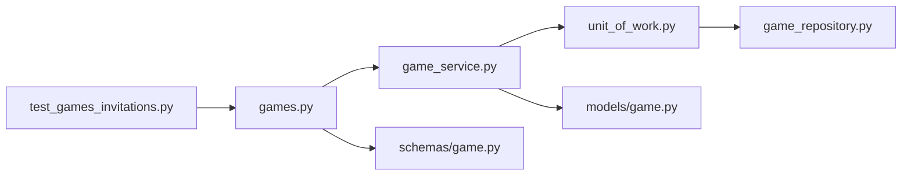

# Invitation System

<cite>
**Referenced Files in This Document**
- [games.py](file://app/api/v1/games.py)
- [game_service.py](file://app/services/game_service.py)
- [game.py](file://app/models/game.py)
- [game_repository.py](file://app/repositories/game_repository.py)
- [unit_of_work.py](file://app/unit_of_work.py)
- [game.py (schemas)](file://app/schemas/game.py)
- [test_games_invitations.py](file://tests/test_games_invitations.py)
</cite>

## Table of Contents
1. Introduction
2. Project Structure
3. Core Components
4. Architecture Overview
5. Detailed Component Analysis
6. Dependency Analysis
7. Performance Considerations
8. Troubleshooting Guide
9. Conclusion

## Introduction
This document explains the invitation system that allows organizers to directly invite users to games and to share secure, token-based links for joining. It covers:
- Creating direct invitations with target user selection and optional expiration
- The invitation lifecycle from creation through acceptance, decline, or expiration
- Acceptance workflow that bypasses normal approval requirements and directly adds users to games
- Shareable link generation, preview, validation, and usage limits
- Security considerations, rate limiting guidance, and handling expired or revoked invitations
- Common scenarios and troubleshooting steps

## Project Structure
The invitation system spans API routes, service logic, data models, repositories, and tests:
- API layer exposes endpoints for creating invitations, listing them, accepting/declining, generating and managing invite links, and joining via tokens
- Service layer implements business rules, state transitions, notifications, and concurrency-safe operations
- Models define entities such as Game, GameInvitation, and GameInviteLink
- Repositories provide data access with locking and queries
- Unit of Work coordinates transactions and repository instances
- Tests validate end-to-end flows including link lifecycle, expiration, and direct invitation behavior

**Diagram sources**
- [games.py:112-165](file://app/api/v1/games.py#L112-L165)
- [game_service.py:617-800](file://app/services/game_service.py#L617-L800)
- [unit_of_work.py:160-188](file://app/unit_of_work.py#L160-L188)
- [game_repository.py:213-279](file://app/repositories/game_repository.py#L213-L279)

**Section sources**
- [games.py:112-165](file://app/api/v1/games.py#L112-L165)
- [game_service.py:617-800](file://app/services/game_service.py#L617-L800)
- [unit_of_work.py:160-188](file://app/unit_of_work.py#L160-L188)
- [game_repository.py:213-279](file://app/repositories/game_repository.py#L213-L279)

## Core Components
- Direct Invitations: Organizers create invitations for specific users with optional expiration; recipients can accept or decline. Accepting a direct invitation bypasses approval policies and adds the user to the game.
- Invite Links: Organizers generate shareable links with tokens, optional expiration, and maximum uses. Public preview is available without login; joining requires authentication.
- Data Models: GameInvitation stores per-user invitation state; GameInviteLink stores tokenized access controls.
- Repositories: Provide safe queries and locking for concurrent join/accept flows.
- Unit of Work: Ensures transactional consistency across multiple repositories during invitation and join operations.

Key responsibilities:
- Validation of permissions (organizer/admin only for management actions)
- Enforcing game status constraints (not cancelled/started/completed)
- Handling race conditions using row-level locks
- Generating notifications on key events

**Section sources**
- [game_service.py:617-708](file://app/services/game_service.py#L617-L708)
- [game_service.py:712-800](file://app/services/game_service.py#L712-L800)
- [game.py:177-217](file://app/models/game.py#L177-L217)
- [game_repository.py:213-279](file://app/repositories/game_repository.py#L213-L279)

## Architecture Overview
The invitation system follows a layered architecture:
- API routes handle HTTP requests and delegate to service methods
- Service enforces business rules, updates state, and returns notifications
- Repositories perform database operations with locking where needed
- Unit of Work manages sessions and commits/rollbacks

**Diagram sources**
- [games.py:338-348](file://app/api/v1/games.py#L338-L348)
- [game_service.py:617-661](file://app/services/game_service.py#L617-L661)
- [unit_of_work.py:310-321](file://app/unit_of_work.py#L310-L321)

## Detailed Component Analysis

### Direct Invitation Creation
- Endpoint: POST /{game_id}/invitations
- Input: user_id (target), expires_in_days (optional)
- Behavior:
  - Validates organizer/admin permission and game state
  - Prevents duplicates and already-joined users
  - Creates or reactivates an invitation with optional expiration
  - Sets participant status to INVITED if not present
  - Emits notification to invited user

**Diagram sources**
- [game_service.py:617-661](file://app/services/game_service.py#L617-L661)
- [game_repository.py:213-244](file://app/repositories/game_repository.py#L213-L244)

**Section sources**
- [games.py:338-348](file://app/api/v1/games.py#L338-L348)
- [game_service.py:617-661](file://app/services/game_service.py#L617-L661)
- [game_repository.py:213-244](file://app/repositories/game_repository.py#L213-L244)

### Invitation Lifecycle and Decision
- List my invitations: GET /invitations/my
- Accept: POST /invitations/{invitation_id}/accept
- Decline: POST /invitations/{invitation_id}/reject
- Behavior:
  - Only the invited user can act on their invitation
  - Expired invitations are rejected
  - Accepting calls join_game with invited_join flag to bypass approval policy
  - Declining sets participant status to REJECTED if previously INVITED

**Diagram sources**
- [games.py:120-139](file://app/api/v1/games.py#L120-L139)
- [game_service.py:673-708](file://app/services/game_service.py#L673-L708)

**Section sources**
- [games.py:112-139](file://app/api/v1/games.py#L112-L139)
- [game_service.py:673-708](file://app/services/game_service.py#L673-L708)

### Invite Link System
- Create link: POST /{game_id}/invite-links {expires_in_days?, max_uses?}
- List links: GET /{game_id}/invite-links
- Disable: POST /{game_id}/invite-links/{link_id}/disable
- Regenerate: POST /{game_id}/invite-links/{link_id}/regenerate
- Preview token: GET /join/{token} (public, no login required)
- Join by token: POST /join/{token} (requires authenticated user)

Behavior highlights:
- Tokens are cryptographically random
- Expiration enforced at preview and join
- Use count enforced; exceeding max_uses invalidates further joins
- Disabling deactivates the link immediately
- Regenerating deactivates old link and issues a new token

**Diagram sources**
- [games.py:144-165](file://app/api/v1/games.py#L144-L165)
- [games.py:371-407](file://app/api/v1/games.py#L371-L407)
- [game_service.py:712-800](file://app/services/game_service.py#L712-L800)
- [game_repository.py:247-279](file://app/repositories/game_repository.py#L247-L279)

**Section sources**
- [games.py:144-165](file://app/api/v1/games.py#L144-L165)
- [games.py:371-407](file://app/api/v1/games.py#L371-L407)
- [game_service.py:712-800](file://app/services/game_service.py#L712-L800)
- [game_repository.py:247-279](file://app/repositories/game_repository.py#L247-L279)

### Data Model Relationships

**Diagram sources**
- [game.py:97-217](file://app/models/game.py#L97-L217)

**Section sources**
- [game.py:97-217](file://app/models/game.py#L97-L217)

### Concurrency and Safety
- Row-level locking:
  - Games are locked when joining/leaving/removing participants to prevent race conditions
  - Invite links are locked when joining via token to safely increment use counts
- Transaction boundaries:
  - Unit of Work wraps operations and ensures consistent commits or rollbacks

**Diagram sources**
- [game_service.py:341-429](file://app/services/game_service.py#L341-L429)
- [game_service.py:791-800](file://app/services/game_service.py#L791-L800)
- [game_repository.py:34-36](file://app/repositories/game_repository.py#L34-L36)
- [game_repository.py:252-258](file://app/repositories/game_repository.py#L252-L258)
- [unit_of_work.py:310-321](file://app/unit_of_work.py#L310-L321)

**Section sources**
- [game_service.py:341-429](file://app/services/game_service.py#L341-L429)
- [game_service.py:791-800](file://app/services/game_service.py#L791-L800)
- [game_repository.py:34-36](file://app/repositories/game_repository.py#L34-L36)
- [game_repository.py:252-258](file://app/repositories/game_repository.py#L252-L258)
- [unit_of_work.py:310-321](file://app/unit_of_work.py#L310-L321)

## Dependency Analysis
- API depends on GameService for all invitation/link logic
- GameService depends on UnitOfWork to access repositories
- Repositories depend on SQLModel/SQLAlchemy for queries and locking
- Tests assert expected behaviors for both direct invitations and invite links

**Diagram sources**
- [games.py:112-165](file://app/api/v1/games.py#L112-L165)
- [game_service.py:617-800](file://app/services/game_service.py#L617-L800)
- [unit_of_work.py:160-188](file://app/unit_of_work.py#L160-L188)
- [game_repository.py:213-279](file://app/repositories/game_repository.py#L213-L279)
- [game.py:177-217](file://app/models/game.py#L177-L217)
- [game.py (schemas):172-219](file://app/schemas/game.py#L172-L219)
- [test_games_invitations.py:22-100](file://tests/test_games_invitations.py#L22-L100)

**Section sources**
- [games.py:112-165](file://app/api/v1/games.py#L112-L165)
- [game_service.py:617-800](file://app/services/game_service.py#L617-L800)
- [unit_of_work.py:160-188](file://app/unit_of_work.py#L160-L188)
- [game_repository.py:213-279](file://app/repositories/game_repository.py#L213-L279)
- [game.py:177-217](file://app/models/game.py#L177-L217)
- [game.py (schemas):172-219](file://app/schemas/game.py#L172-L219)
- [test_games_invitations.py:22-100](file://tests/test_games_invitations.py#L22-L100)

## Performance Considerations
- Lock contention:
  - JOIN and token-based joins lock rows; batch operations should be minimized to reduce lock duration
- Counting players:
  - Counts are computed server-side within transactions to avoid stale reads
- Notification dispatch:
  - Asynchronous dispatch prevents blocking request paths
- Rate limiting:
  - Existing cooldown guard used elsewhere (e.g., payment reminders); consider applying similar guards to invitation creation if high volume is expected

[No sources needed since this section provides general guidance]

## Troubleshooting Guide
Common errors and resolutions:
- INVITE_INVALID:
  - Cause: Invalid token, inactive link, or exceeded max_uses
  - Resolution: Verify link is active and has remaining uses; regenerate if necessary
- INVITE_EXPIRED:
  - Cause: Link or invitation past its expires_at
  - Resolution: Create a new link or invitation with appropriate expiry
- INVITATION_ALREADY_ANSWERED:
  - Cause: Attempted to accept/decline an already-decided invitation
  - Resolution: Do not repeat the action; fetch current invitation status
- ALREADY_INVITED:
  - Cause: Duplicate invitation attempt for same user and game
  - Resolution: Reuse existing invitation or notify the user
- USER_NOT_FOUND:
  - Cause: Target user does not exist
  - Resolution: Validate user_id before inviting
- NOT_AUTHORIZED:
  - Cause: Non-organizer/admin attempted management actions
  - Resolution: Ensure caller is organizer or admin of the game

Validation references:
- Direct invitation flow and error codes
- Invite link lifecycle, regeneration, and expiration handling
- Tests covering public preview, invalid tokens, capacity exhaustion, and expiration

**Section sources**
- [game_service.py:617-708](file://app/services/game_service.py#L617-L708)
- [game_service.py:712-800](file://app/services/game_service.py#L712-L800)
- [test_games_invitations.py:22-100](file://tests/test_games_invitations.py#L22-L100)
- [test_games_invitations.py:105-171](file://tests/test_games_invitations.py#L105-L171)

## Conclusion
The invitation system provides two complementary mechanisms:
- Direct invitations for targeted, trackable invites with optional expiration and clear lifecycle states
- Secure, shareable invite links with token-based access control, previews, and usage limits

It enforces strong security and concurrency safeguards, integrates with game participation workflows, and supports robust error handling. For high-volume scenarios, consider adding rate limiting around invitation creation and link generation to protect system stability.

[No sources needed since this section summarizes without analyzing specific files]