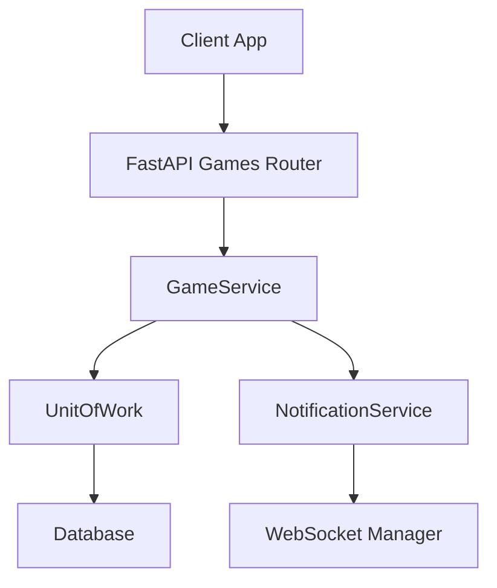
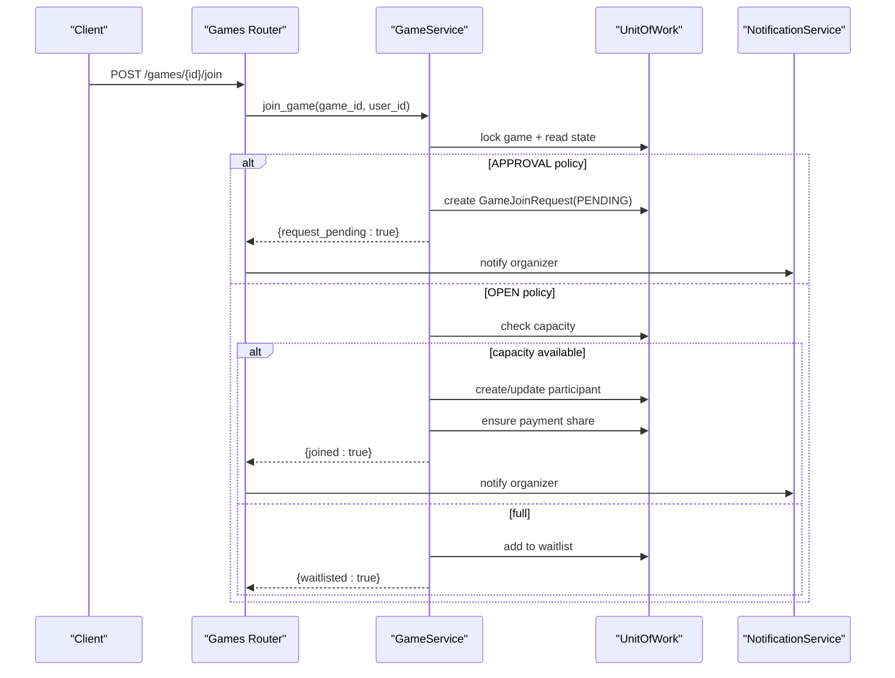
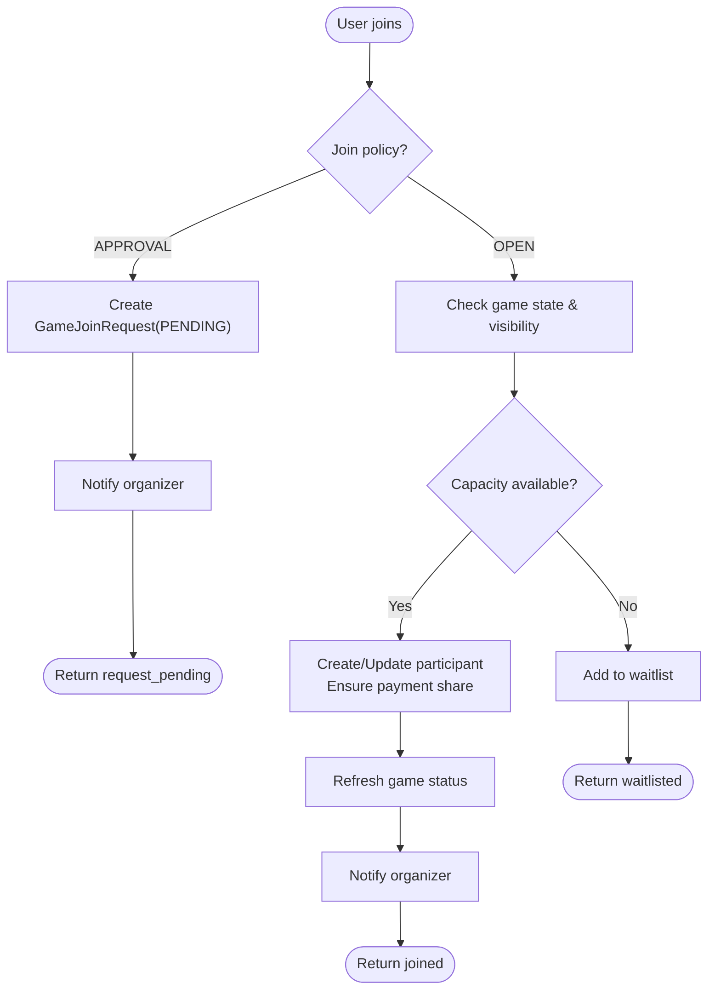
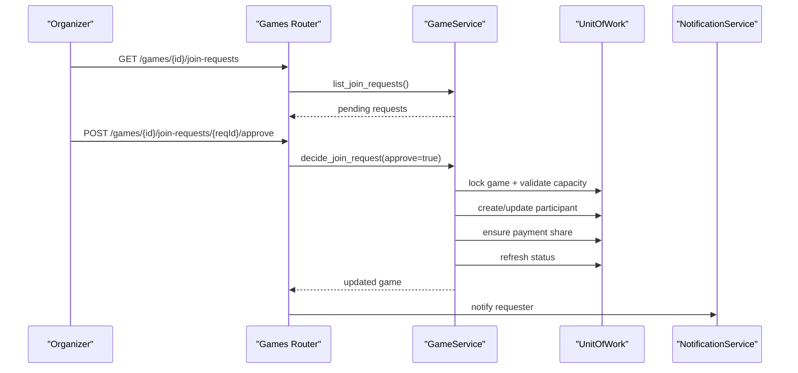
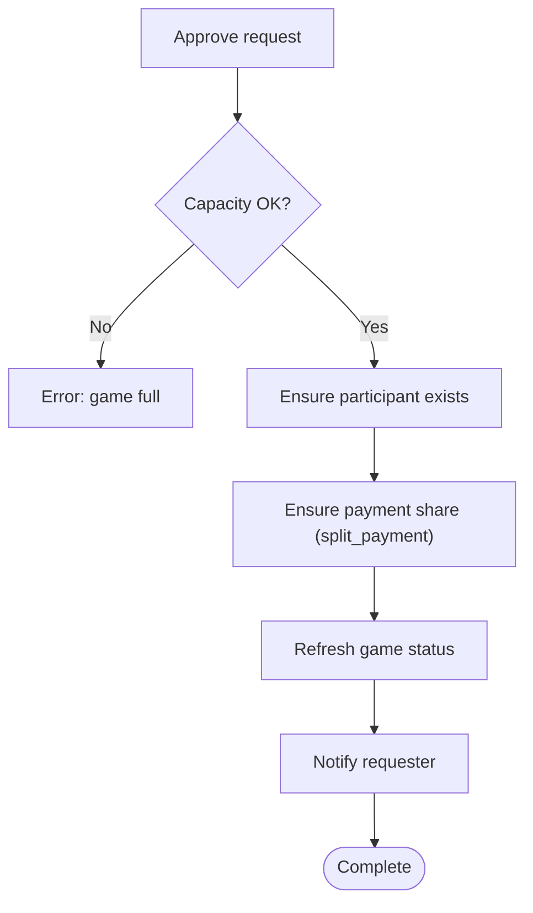
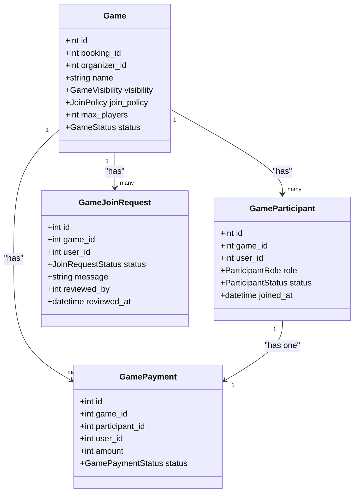
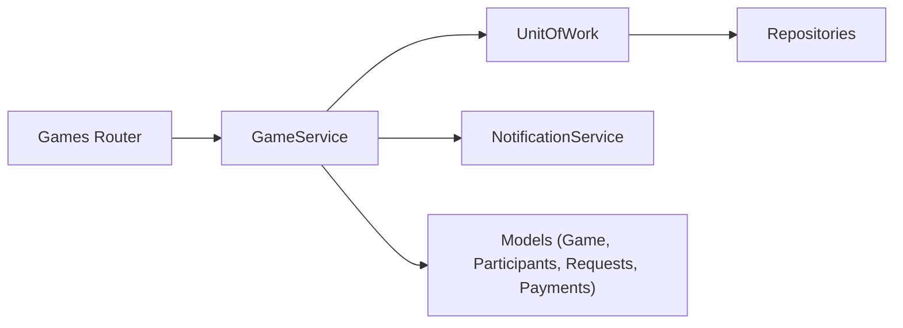

# Join Request Management

<cite>
**Referenced Files in This Document**
- [game.py](file://app/models/game.py)
- [game_service.py](file://app/services/game_service.py)
- [games.py](file://app/api/v1/games.py)
- [notification_service.py](file://app/services/notification_service.py)
- [unit_of_work.py](file://app/unit_of_work.py)
- [pending_booking_service.py](file://app/services/pending_booking_service.py)
</cite>

## Table of Contents
1. Introduction
2. Project Structure
3. Core Components
4. Architecture Overview
5. Detailed Component Analysis
6. Dependency Analysis
7. Performance Considerations
8. Troubleshooting Guide
9. Conclusion

## Introduction
This document explains the join request management system used for approval-based game joining. It covers the full lifecycle from a user’s initial join attempt through organizer review, approval or rejection, and the automated follow-ups such as participant creation, payment share handling, and notifications. It also clarifies how join policies (OPEN vs APPROVAL) control when requests are created, and it provides guidance for edge cases like duplicate requests, capacity constraints, and expired invitations.

## Project Structure
The join request flow spans API endpoints, service logic, domain models, and notification delivery:
- API layer exposes endpoints to join games, list pending join requests, and approve/reject them.
- Service layer enforces business rules, manages state transitions, and coordinates side effects (participant creation, payments, waitlist promotion, notifications).
- Models define entities such as Game, GameParticipant, GameJoinRequest, and related enums.
- Notification service persists and delivers notifications via WebSocket.
- Unit of Work encapsulates database transactions and repository access.
- A separate Redis-backed pending booking store is used for venue slot reservations prior to confirmation; it is not part of the join request flow but coexists with the system.

**Diagram sources**
- [games.py:240-333](file://app/api/v1/games.py#L240-L333)
- [game_service.py:341-613](file://app/services/game_service.py#L341-L613)
- [notification_service.py:50-64](file://app/services/notification_service.py#L50-L64)
- [unit_of_work.py:160-200](file://app/unit_of_work.py#L160-L200)

**Section sources**
- [games.py:240-333](file://app/api/v1/games.py#L240-L333)
- [game_service.py:341-613](file://app/services/game_service.py#L341-L613)
- [notification_service.py:50-64](file://app/services/notification_service.py#L50-L64)
- [unit_of_work.py:160-200](file://app/unit_of_work.py#L160-L200)

## Core Components
- Game model and enums: visibility, join policy, statuses, roles, participant status, join request status, payment mode.
- GameService: orchestrates join flows, approval decisions, waitlist promotions, payments, and notifications.
- API router: exposes endpoints for join, leave, invitations, invite links, join requests listing/approval/rejection, waitlist, and payments.
- NotificationService: persists notifications and pushes real-time updates to clients.
- UnitOfWork: transactional boundary and repository accessors for all game-related entities.

Key responsibilities:
- Enforce join policy (OPEN vs APPROVAL) and game state constraints before creating requests or participants.
- Prevent duplicates (already joined, already requested, already waitlisted).
- Manage capacity and promote from waitlist when slots open.
- Create payment shares for split-payment games and record income/refunds.
- Notify organizers and participants about changes.

**Section sources**
- [game.py:20-93](file://app/models/game.py#L20-L93)
- [game_service.py:47-124](file://app/services/game_service.py#L47-L124)
- [games.py:240-333](file://app/api/v1/games.py#L240-L333)
- [notification_service.py:50-64](file://app/services/notification_service.py#L50-L64)
- [unit_of_work.py:160-200](file://app/unit_of_work.py#L160-L200)

## Architecture Overview
The join request workflow is centered around two paths:
- OPEN policy: immediate join if capacity allows; otherwise waitlist.
- APPROVAL policy: create a pending join request; organizer approves or rejects.

Approval outcomes trigger:
- Participant creation (or update), payment share creation/management, status refresh, and notifications.
- Rejection notifies the requester.

Capacity and waitlist interactions:
- When capacity opens (leave/remove), the first eligible waitlist entry is promoted automatically.
- Game status toggles between OPEN and FULL based on accepted player count.

**Diagram sources**
- [games.py:242-253](file://app/api/v1/games.py#L242-L253)
- [game_service.py:341-429](file://app/services/game_service.py#L341-L429)
- [notification_service.py:50-64](file://app/services/notification_service.py#L50-L64)

## Detailed Component Analysis

### Join Policy and Request Creation
- Policies:
  - OPEN: users can join immediately if the game is open and has capacity; otherwise they are placed on the waitlist.
  - APPROVAL: users submit a join request that remains PENDING until an organizer approves or rejects.
- Duplicate prevention:
  - If a user already has an ACCEPTED participant record, they cannot rejoin.
  - In APPROVAL mode, a second join attempt while a PENDING request exists returns an error indicating a pending request.
- Visibility and state checks:
  - Private games require an invite token or direct invitation.
  - Games that are cancelled, started, completed, or draft block joining.

**Diagram sources**
- [game_service.py:341-429](file://app/services/game_service.py#L341-L429)
- [game.py:48-51](file://app/models/game.py#L48-L51)

**Section sources**
- [game_service.py:341-429](file://app/services/game_service.py#L341-L429)
- [game.py:48-51](file://app/models/game.py#L48-L51)

### Organizer Workflow: Reviewing Pending Requests
- Listing requests:
  - Organizers/admins can list pending join requests for their game.
- Decision:
  - Approve: validates capacity, creates or updates participant, ensures payment share, refreshes game status, and notifies the requester.
  - Reject: marks request as rejected and notifies the requester.
- Authorization:
  - Only participants with ORGANIZER or ADMIN role can manage requests.

**Diagram sources**
- [games.py:303-333](file://app/api/v1/games.py#L303-L333)
- [game_service.py:543-613](file://app/services/game_service.py#L543-L613)
- [notification_service.py:50-64](file://app/services/notification_service.py#L50-L64)

**Section sources**
- [games.py:303-333](file://app/api/v1/games.py#L303-L333)
- [game_service.py:543-613](file://app/services/game_service.py#L543-L613)

### Automated Processes Upon Approval
- Participant creation/update:
  - Ensures the user becomes an ACCEPTED participant; updates timestamps and clears left_at if rejoining.
- Payment share handling:
  - For split-payment games, a GamePayment row is created or reused with PENDING status; later marked PAID by the participant.
- Status refresh:
  - Game status recalculated to FULL or OPEN based on accepted player count.
- Notifications:
  - Requester receives approval or rejection notification; organizer may receive additional context depending on flow.

**Diagram sources**
- [game_service.py:555-613](file://app/services/game_service.py#L555-L613)

**Section sources**
- [game_service.py:555-613](file://app/services/game_service.py#L555-L613)

### Edge Cases and Handling
- Duplicate requests:
  - If a user already has an ACCEPTED participant record, join returns an error indicating they are already joined.
  - In APPROVAL mode, attempting to join again while a PENDING request exists returns an error indicating a pending request.
- Capacity constraints:
  - If the game is full, join attempts place the user on the waitlist (unless already waitlisted).
  - Approving a request when the game is full returns an error; capacity must be freed first.
- Expired invitations:
  - Accepting an expired invitation returns an error indicating the invitation has expired.
  - Using an invalid or expired invite link to join returns an error.
- Game state restrictions:
  - Joining is blocked for cancelled, started, completed, or draft games.

**Section sources**
- [game_service.py:341-429](file://app/services/game_service.py#L341-L429)
- [game_service.py:673-708](file://app/services/game_service.py#L673-L708)
- [game_service.py:791-800](file://app/services/game_service.py#L791-L800)

### Data Model Relationships

**Diagram sources**
- [game.py:97-134](file://app/models/game.py#L97-L134)
- [game.py:138-175](file://app/models/game.py#L138-L175)
- [game.py:241-258](file://app/models/game.py#L241-L258)

## Dependency Analysis
- API depends on GameService for all business operations.
- GameService depends on UnitOfWork to access repositories for games, participants, join requests, invitations, waitlist, and payments.
- GameService uses NotificationService to persist and deliver notifications.
- Models define enumerations and relationships consumed across layers.

**Diagram sources**
- [games.py:240-333](file://app/api/v1/games.py#L240-L333)
- [game_service.py:341-613](file://app/services/game_service.py#L341-L613)
- [unit_of_work.py:160-200](file://app/unit_of_work.py#L160-L200)
- [game.py:97-258](file://app/models/game.py#L97-L258)

**Section sources**
- [games.py:240-333](file://app/api/v1/games.py#L240-L333)
- [game_service.py:341-613](file://app/services/game_service.py#L341-L613)
- [unit_of_work.py:160-200](file://app/unit_of_work.py#L160-L200)
- [game.py:97-258](file://app/models/game.py#L97-L258)

## Performance Considerations
- Concurrency safety:
  - Critical sections lock the game row to prevent race conditions during join and approval operations.
- Efficient capacity checks:
  - Accepted player counts are computed against current participants to determine FULL vs OPEN status.
- Notification batching:
  - Services collect notifications and dispatch them after successful state changes to minimize redundant work.
- Redis pending bookings:
  - Separate from join requests, venue slot reservations use Redis with TTL to avoid double-booking and allow cleanup of expired entries.

[No sources needed since this section provides general guidance]

## Troubleshooting Guide
Common issues and resolutions:
- Already joined:
  - Occurs when a participant already has ACCEPTED status. Resolve by leaving the game or contacting support.
- Already requested:
  - Occurs in APPROVAL mode when a PENDING request exists. Wait for organizer decision or contact support.
- Game full:
  - Approvals fail if capacity is at maximum. Free a spot by having a participant leave or be removed.
- Invalid/expired invite link:
  - Token preview or join fails if the link is inactive, expired, or exceeded its usage limit. Generate a new link.
- Private game access:
  - Join requires a valid invite token or direct invitation. Obtain a link from the organizer.

**Section sources**
- [game_service.py:341-429](file://app/services/game_service.py#L341-L429)
- [game_service.py:673-708](file://app/services/game_service.py#L673-L708)
- [game_service.py:791-800](file://app/services/game_service.py#L791-L800)

## Conclusion
The join request management system provides robust, policy-driven joining with clear separation between OPEN and APPROVAL modes. It safeguards against duplicates and capacity overflows, integrates payment share handling for split-payment games, and keeps participants and organizers informed via notifications. The design leverages locking and careful state transitions to maintain consistency under concurrency, and supports flexible workflows including invitations, invite links, and waitlist promotions.