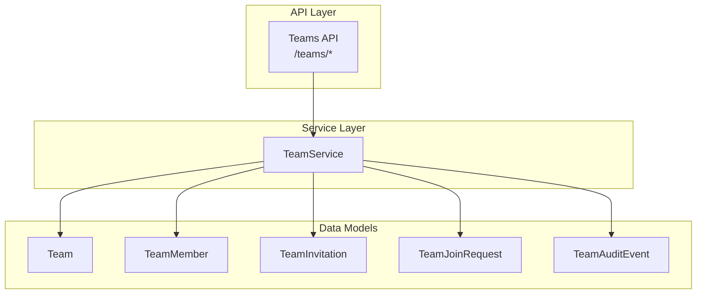
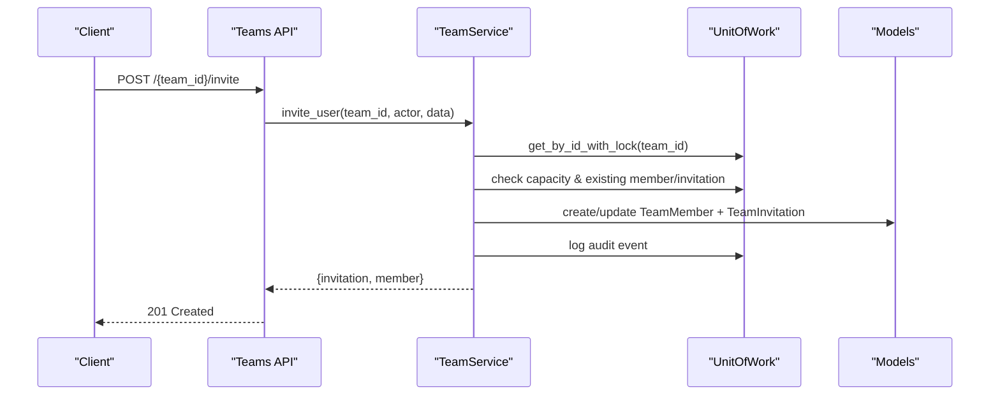
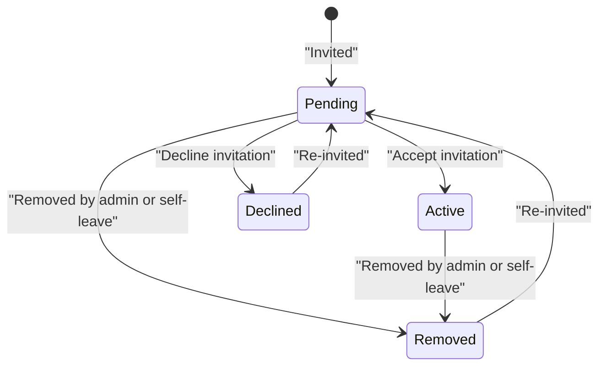
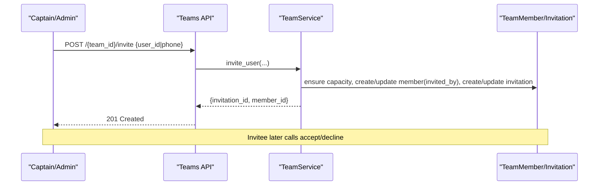
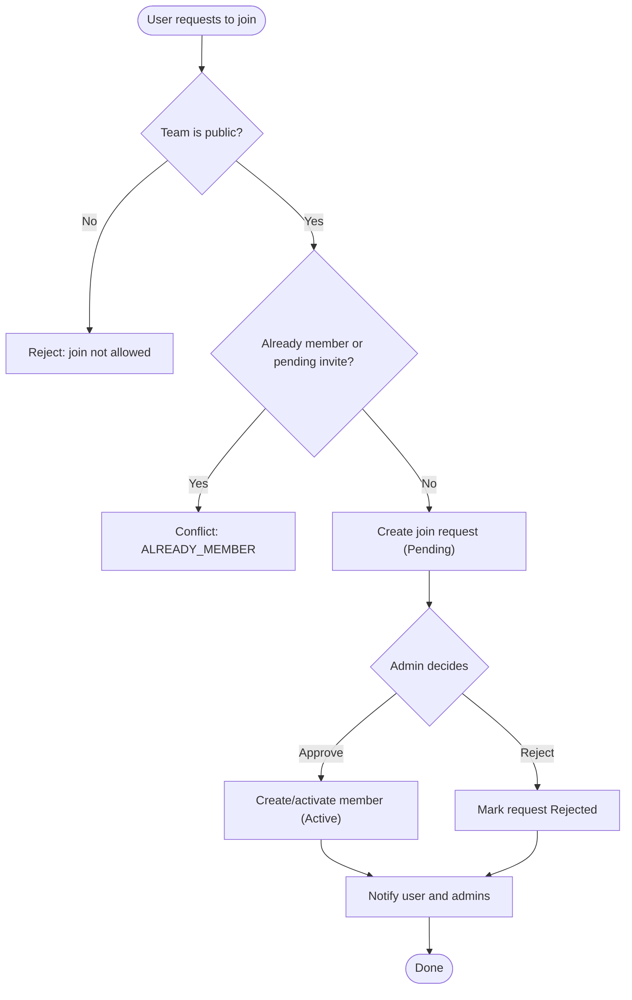
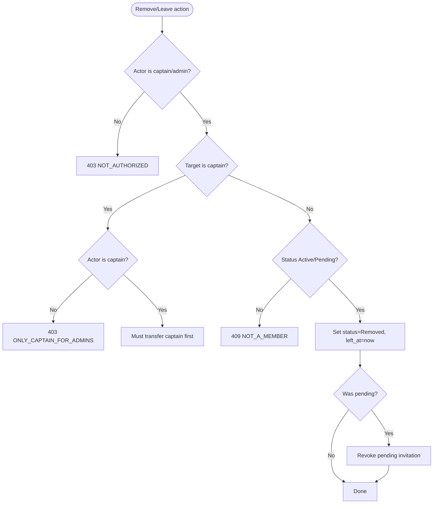
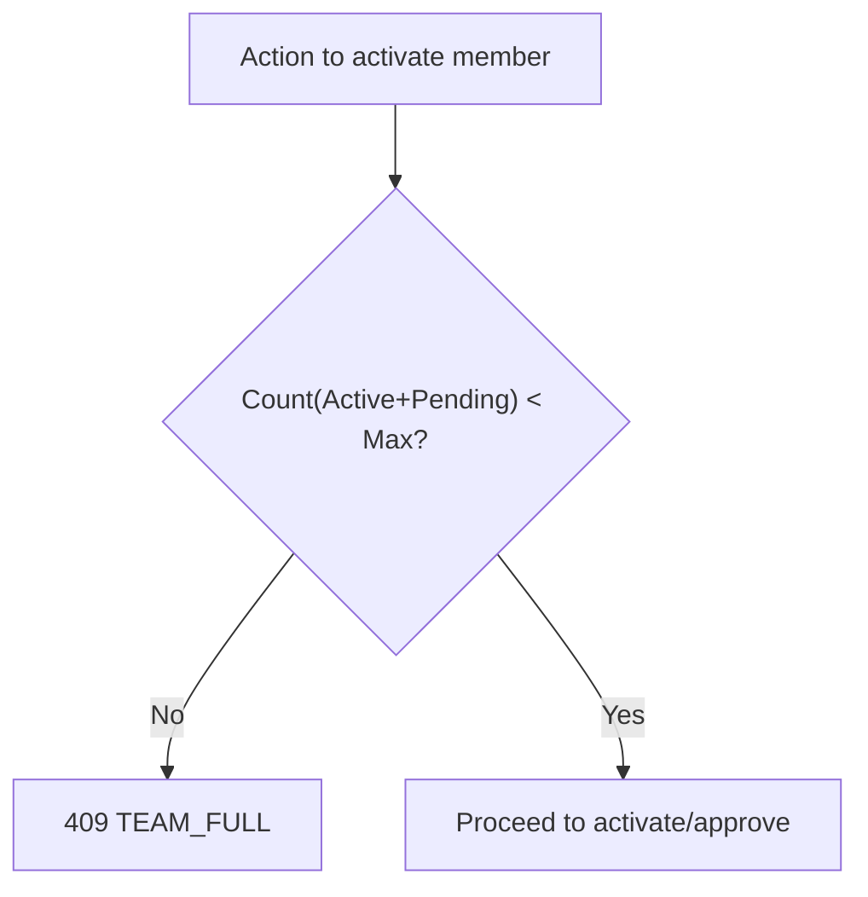
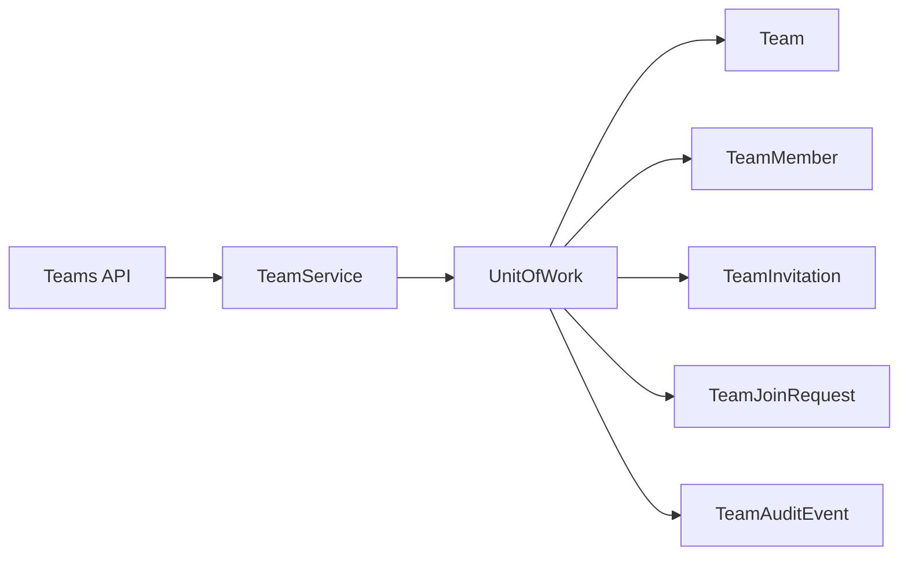

# Participant Management

<cite>
**Referenced Files in This Document**
- [team.py](file://app/models/team.py)
- [team_service.py](file://app/services/team_service.py)
- [teams.py](file://app/api/v1/teams.py)
- [team.py (schemas)](file://app/schemas/team.py)
</cite>

## Table of Contents
1. [Introduction](#introduction)
2. [Project Structure](#project-structure)
3. [Core Components](#core-components)
4. [Architecture Overview](#architecture-overview)
5. [Detailed Component Analysis](#detailed-component-analysis)
6. [Dependency Analysis](#dependency-analysis)
7. [Performance Considerations](#performance-considerations)
8. [Troubleshooting Guide](#troubleshooting-guide)
9. [Conclusion](#conclusion)
10. [Appendices](#appendices)

## Introduction
This document explains the Participant Management system for Teams. It covers participant roles and permissions, status transitions, registration workflows (direct invitation, approval-based joining), removal and leave mechanisms, and capacity management. It also provides practical scenarios to manage participants effectively.

## Project Structure
Participant management is implemented across:
- Data models defining teams, members, invitations, join requests, and audit events
- Service layer implementing business rules, validations, notifications, and capacity checks
- API endpoints exposing operations for inviting, accepting/declining invitations, requesting to join, approving/rejecting requests, removing members, leaving teams, and transferring captaincy

**Diagram sources**
- [teams.py:130-271](file://app/api/v1/teams.py#L130-L271)
- [team_service.py:389-751](file://app/services/team_service.py#L389-L751)
- [team.py:88-167](file://app/models/team.py#L88-L167)

**Section sources**
- [team.py:88-167](file://app/models/team.py#L88-L167)
- [team_service.py:389-751](file://app/services/team_service.py#L389-L751)
- [teams.py:130-271](file://app/api/v1/teams.py#L130-L271)

## Core Components
- Roles and Permissions
  - Captain: team owner; can transfer captaincy, update team settings, invite/remove members, change roles, deactivate team
  - Admin: manager role; can invite/remove members (except other admins unless captain), change member roles, manage join requests
  - Member: standard participant; can accept/decline invitations, request to join public teams, leave team, link bookings, chat
- Statuses
  - Pending: invited but not yet accepted
  - Active: fully participating
  - Removed: removed by admin or self-left
  - Declined: invitation declined
- Visibility
  - Private: only members and pending invitees can view/join via direct invitation
  - Public: users can request to join; requires admin approval
  - Invite-only: visible but joinable only via direct invitation

Key data structures: Team, TeamMember, TeamInvitation, TeamJoinRequest, TeamAuditEvent.

**Section sources**
- [team.py:27-84](file://app/models/team.py#L27-L84)
- [team.py:88-167](file://app/models/team.py#L88-L167)

## Architecture Overview
The flow for participant management spans API → Service → Repository/UnitOfWork → Models with notifications and audits.

**Diagram sources**
- [teams.py:139-148](file://app/api/v1/teams.py#L139-L148)
- [team_service.py:389-454](file://app/services/team_service.py#L389-L454)
- [team.py:136-152](file://app/models/team.py#L136-L152)

## Detailed Component Analysis

### Roles and Permissions Matrix
- Captain
  - Create/update team, deactivate team
  - Transfer captaincy
  - Invite/remove members, set roles
  - Approve/reject join requests
- Admin
  - Invite/remove members (non-admins), set roles
  - Approve/reject join requests
  - View members and audit logs
- Member
  - Accept/decline invitations
  - Request to join public teams
  - Leave team
  - Link own bookings to team history
  - Chat within team

Permissions are enforced in service methods using helper checks for active membership and manager roles.

**Section sources**
- [team_service.py:82-116](file://app/services/team_service.py#L82-L116)
- [team_service.py:523-658](file://app/services/team_service.py#L523-L658)

### Status Transitions and Conditions

- Invitation lifecycle
  - Create invitation: sets TeamMember.status = Pending and creates TeamInvitation.status = Pending
  - Accept: transitions TeamMember to Active, marks invitation Accepted
  - Decline: transitions TeamMember to Declined, marks invitation Declined
  - Revoke: on team deactivation or admin removal, pending invitations may be revoked

- Join request lifecycle (public teams)
  - Request: creates TeamJoinRequest.status = Pending
  - Approve: creates/activates TeamMember (Active); marks request Approved
  - Reject: marks request Rejected

- Removal and leave
  - Remove: admin sets TeamMember.status = Removed; if pending, invitation is revoked
  - Leave: member sets their own status to Removed; if pending, invitation is revoked

Capacity constraints apply when moving from Pending to Active or approving join requests.

**Diagram sources**
- [team_service.py:470-520](file://app/services/team_service.py#L470-L520)
- [team_service.py:523-585](file://app/services/team_service.py#L523-L585)
- [team_service.py:661-751](file://app/services/team_service.py#L661-L751)
- [team.py:39-57](file://app/models/team.py#L39-L57)

**Section sources**
- [team_service.py:470-585](file://app/services/team_service.py#L470-L585)
- [team_service.py:661-751](file://app/services/team_service.py#L661-L751)
- [team.py:39-57](file://app/models/team.py#L39-L57)

### Registration Workflows

#### Direct Invitation (Invite-only or any visibility)
- Prerequisites: actor must be captain/admin; target user exists; capacity available; no duplicate pending invitation/member
- Steps:
  - Create or update TeamMember to Pending
  - Create or refresh TeamInvitation with optional expiry
  - Audit and notify invitee
- APIs:
  - POST /{team_id}/invite
  - GET /invitations/me (for invitee to list pending invites)
  - POST /{team_id}/invitations/{member_id}/accept
  - POST /{team_id}/invitations/{member_id}/decline

**Diagram sources**
- [teams.py:139-172](file://app/api/v1/teams.py#L139-L172)
- [team_service.py:389-454](file://app/services/team_service.py#L389-L454)
- [team_service.py:470-520](file://app/services/team_service.py#L470-L520)

**Section sources**
- [teams.py:139-172](file://app/api/v1/teams.py#L139-L172)
- [team_service.py:389-454](file://app/services/team_service.py#L389-L454)
- [team_service.py:470-520](file://app/services/team_service.py#L470-L520)

#### Approval-Based Joining (Public teams)
- Prerequisites: team visibility = public; user not already a member or pending invite; no open join request
- Steps:
  - User submits join request (message optional)
  - Admin reviews and approves/rejects
  - On approve: create/activate TeamMember (Active) and mark request Approved
- APIs:
  - POST /{team_id}/join-request
  - GET /{team_id}/join-requests (admin)
  - POST /{team_id}/join-requests/{request_id}/approve
  - POST /{team_id}/join-requests/{request_id}/reject

**Diagram sources**
- [team_service.py:661-751](file://app/services/team_service.py#L661-L751)
- [teams.py:227-271](file://app/api/v1/teams.py#L227-L271)

**Section sources**
- [team_service.py:661-751](file://app/services/team_service.py#L661-L751)
- [teams.py:227-271](file://app/api/v1/teams.py#L227-L271)

### Participant Removal and Leave Mechanisms
- Remove member (admin/captain):
  - Cannot remove captain without first transferring captaincy
  - Captains cannot remove other captains; only captain can remove admins
  - Sets member status to Removed; revokes pending invitation if applicable
- Leave team (self):
  - Captains cannot leave without transferring captaincy or deactivating team
  - Sets member status to Removed; revokes pending invitation if applicable

**Diagram sources**
- [team_service.py:523-585](file://app/services/team_service.py#L523-L585)

**Section sources**
- [team_service.py:523-585](file://app/services/team_service.py#L523-L585)

### Capacity and Waitlist Promotion Logic
- Capacity enforcement:
  - The system enforces a maximum number of members per team via a capacity check before activating a member from Pending or approving a join request
  - Capacity counts both Active and Pending statuses
- Waitlist promotion:
  - There is no explicit waitlist entity in the current implementation
  - Promotion occurs implicitly when capacity becomes available and an admin approves a join request or a member accepts an invitation
  - To simulate a waitlist, you can maintain a queue of approved join requests or re-invite declined/pending users when capacity opens

**Diagram sources**
- [team_service.py:105-111](file://app/services/team_service.py#L105-L111)
- [team_service.py:470-499](file://app/services/team_service.py#L470-L499)
- [team_service.py:698-751](file://app/services/team_service.py#L698-L751)

**Section sources**
- [team_service.py:105-111](file://app/services/team_service.py#L105-L111)
- [team_service.py:470-499](file://app/services/team_service.py#L470-L499)
- [team_service.py:698-751](file://app/services/team_service.py#L698-L751)

### Managing Participants Through Scenarios

- Adding members via direct invitation
  - Use POST /{team_id}/invite with either user_id or phone
  - Invitee lists pending invitations at GET /invitations/me
  - Invitee accepts at POST /{team_id}/invitations/{member_id}/accept
  - If declined, re-invite to reset to Pending

- Removing participants
  - Admin/Captain uses POST /{team_id}/members/{member_id}/remove
  - Captains cannot remove themselves; must transfer captaincy first
  - Non-captain admins cannot remove other admins

- Handling waitlist promotions
  - For public teams, collect join requests and approve them as capacity allows
  - Alternatively, re-invite previously declined or removed users to bring them back into Pending

- Managing permissions
  - Change roles via POST /{team_id}/members/{member_id}/role (only admin or member)
  - Transfer captaincy via POST /{team_id}/transfer-captain (captain only)

- Deactivating a team
  - Only captain can deactivate; this rejects all pending join requests and revokes pending invitations

**Section sources**
- [teams.py:139-224](file://app/api/v1/teams.py#L139-L224)
- [team_service.py:389-658](file://app/services/team_service.py#L389-L658)
- [team_service.py:323-364](file://app/services/team_service.py#L323-L364)

## Dependency Analysis
- API depends on TeamService for all participant operations
- TeamService depends on UnitOfWork to access repositories for teams, members, invitations, join requests, and audits
- Models define enumerations and constraints that enforce valid states and relationships

**Diagram sources**
- [teams.py:130-271](file://app/api/v1/teams.py#L130-L271)
- [team_service.py:389-751](file://app/services/team_service.py#L389-L751)
- [team.py:88-167](file://app/models/team.py#L88-L167)

**Section sources**
- [teams.py:130-271](file://app/api/v1/teams.py#L130-L271)
- [team_service.py:389-751](file://app/services/team_service.py#L389-L751)
- [team.py:88-167](file://app/models/team.py#L88-L167)

## Performance Considerations
- Capacity checks and state transitions use locked reads where necessary to avoid race conditions during concurrent invitations or approvals
- Notifications are dispatched asynchronously to avoid blocking main flows
- Auditing records provide traceability without impacting performance significantly

[No sources needed since this section provides general guidance]

## Troubleshooting Guide
Common errors and resolutions:
- TEAM_FULL: Team reached max members; reduce pending/active or increase capacity configuration
- ALREADY_MEMBER / ALREADY_PENDING: Duplicate membership or invitation; verify current status before acting
- NOT_A_MEMBER: Attempted action by non-member or inactive member; ensure correct role/status
- CAPTAIN_MUST_TRANSFER: Captain attempted to leave or be removed; transfer captaincy first
- JOIN_NOT_ALLOWED: Trying to request join on non-public team; use direct invitation instead
- INVITE_EXPIRED: Invitation expired; re-issue invitation

Operational tips:
- Use GET /{team_id}/members to inspect current statuses
- Use GET /{team_id}/audit to review actions taken by actors
- Use GET /invitations/me to see pending invitations for a user

**Section sources**
- [team_service.py:105-111](file://app/services/team_service.py#L105-L111)
- [team_service.py:456-468](file://app/services/team_service.py#L456-L468)
- [team_service.py:523-585](file://app/services/team_service.py#L523-L585)
- [team_service.py:661-751](file://app/services/team_service.py#L661-L751)

## Conclusion
The Participant Management system provides robust controls for managing team memberships through invitations and approval-based joins, with clear role-based permissions, comprehensive status transitions, and capacity enforcement. While there is no explicit waitlist, the combination of join requests and re-invitation patterns supports effective waitlist-like workflows.

[No sources needed since this section summarizes without analyzing specific files]

## Appendices

### API Quick Reference for Participant Management
- Invite: POST /{team_id}/invite
- My invitations: GET /invitations/me
- Accept invitation: POST /{team_id}/invitations/{member_id}/accept
- Decline invitation: POST /{team_id}/invitations/{member_id}/decline
- List members: GET /{team_id}/members
- Remove member: POST /{team_id}/members/{member_id}/remove
- Set role: POST /{team_id}/members/{member_id}/role
- Leave team: POST /{team_id}/leave
- Transfer captain: POST /{team_id}/transfer-captain
- Request join (public): POST /{team_id}/join-request
- List join requests (admin): GET /{team_id}/join-requests
- Approve join request: POST /{team_id}/join-requests/{request_id}/approve
- Reject join request: POST /{team_id}/join-requests/{request_id}/reject

**Section sources**
- [teams.py:130-271](file://app/api/v1/teams.py#L130-L271)