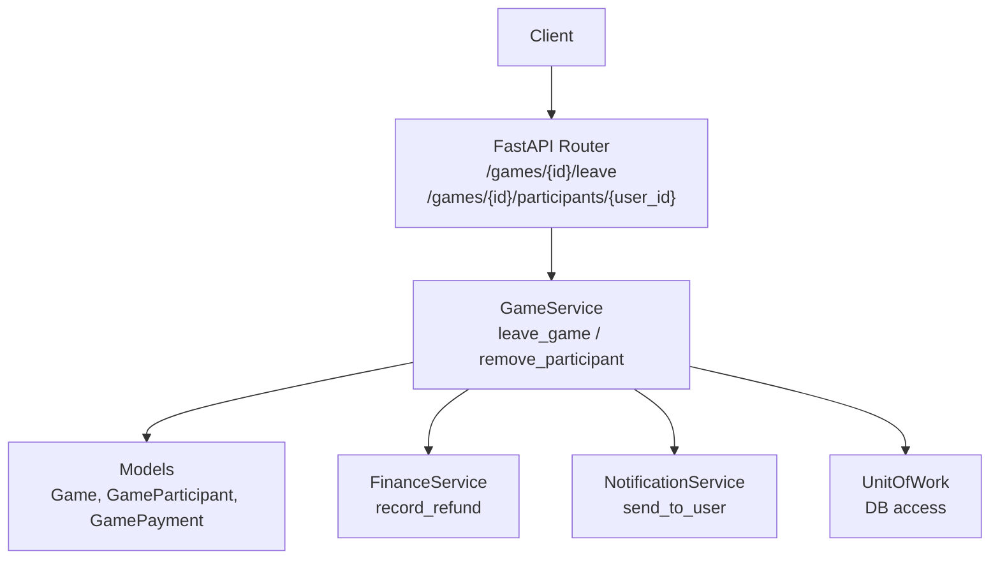
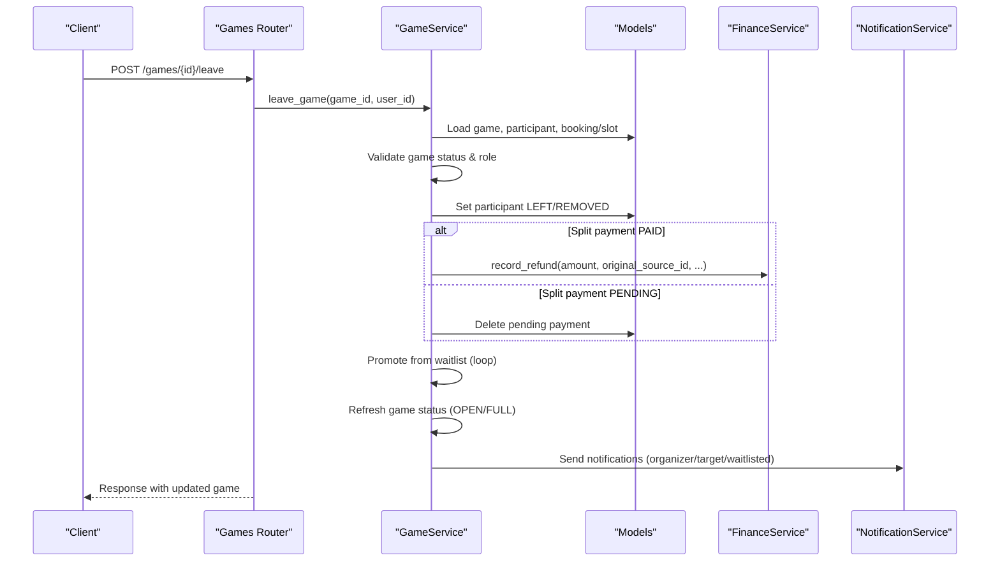
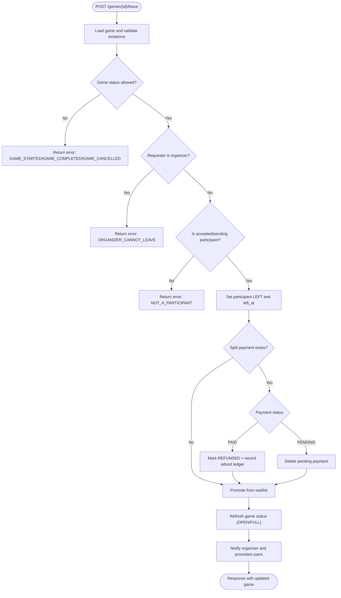
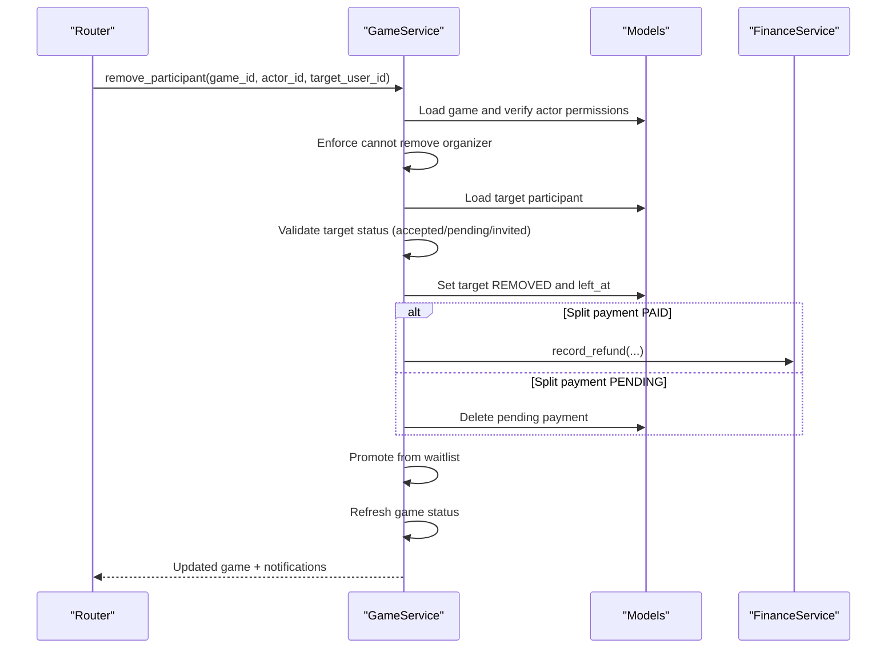
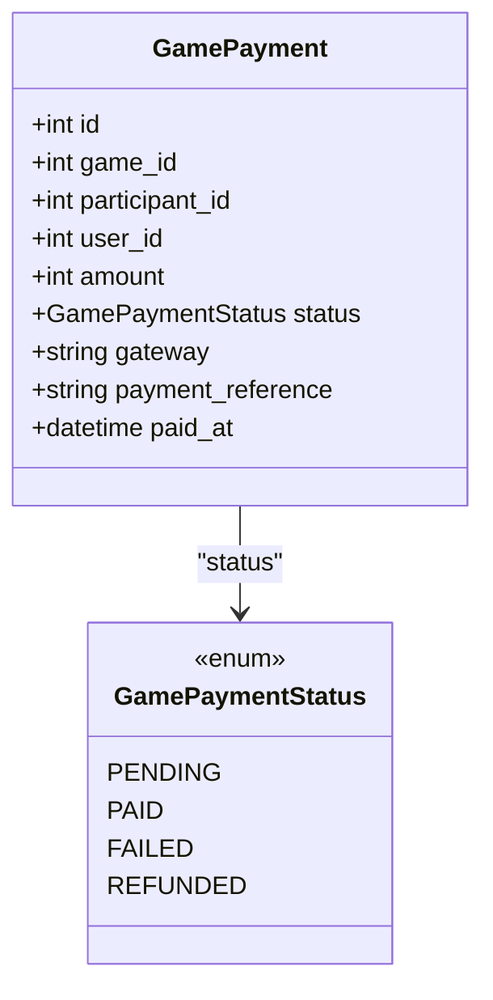
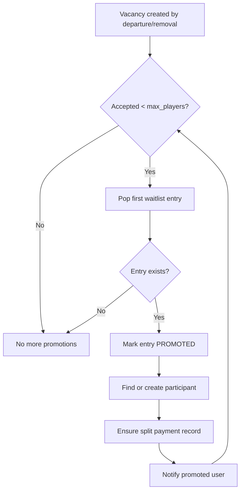
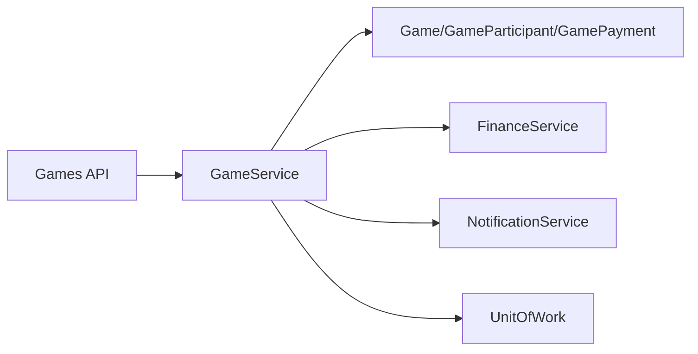

# Participant Removal and Leaving

<cite>
**Referenced Files in This Document**
- [game_service.py](file://app/services/game_service.py)
- [games.py](file://app/api/v1/games.py)
- [game.py](file://app/models/game.py)
- [payment.py](file://app/models/payment.py)
- [finance_service.py](file://app/services/finance_service.py)
- [notification_service.py](file://app/services/notification_service.py)
</cite>

## Table of Contents
1. [Introduction](#introduction)
2. [Project Structure](#project-structure)
3. [Core Components](#core-components)
4. [Architecture Overview](#architecture-overview)
5. [Detailed Component Analysis](#detailed-component-analysis)
6. [Dependency Analysis](#dependency-analysis)
7. [Performance Considerations](#performance-considerations)
8. [Troubleshooting Guide](#troubleshooting-guide)
9. [Conclusion](#conclusion)

## Introduction
This document explains participant departure mechanisms for group games, focusing on:
- Voluntary leaving via leave_game
- Administrative removal via remove_participant
- Financial implications (split payments, refunds, payment status updates)
- Cascading effects on waitlist promotions and game status
- Error handling and edge cases

The implementation is centered around the GameService with FastAPI endpoints exposing these operations.

## Project Structure
Participant departure flows are implemented in the service layer and exposed through API routes:
- API routes define endpoints for leaving and removing participants
- Service layer enforces business rules, state transitions, financial side effects, and notifications
- Models define entities such as Game, GameParticipant, GamePayment, and enums for statuses
- Finance service records refunds idempotently
- Notification service persists and delivers notifications to users

**Diagram sources**
- [games.py:256-264](file://app/api/v1/games.py#L256-L264)
- [games.py:289-298](file://app/api/v1/games.py#L289-L298)
- [game_service.py:431-539](file://app/services/game_service.py#L431-L539)
- [finance_service.py:199-228](file://app/services/finance_service.py#L199-L228)
- [notification_service.py:50-64](file://app/services/notification_service.py#L50-L64)

**Section sources**
- [games.py:256-264](file://app/api/v1/games.py#L256-L264)
- [games.py:289-298](file://app/api/v1/games.py#L289-L298)
- [game_service.py:431-539](file://app/services/game_service.py#L431-L539)
- [game.py:26-93](file://app/models/game.py#L26-L93)
- [finance_service.py:199-228](file://app/services/finance_service.py#L199-L228)
- [notification_service.py:50-64](file://app/services/notification_service.py#L50-L64)

## Core Components
- GameService.leave_game: Allows a non-organizer participant to voluntarily leave an open or full game that has not started or completed. It deactivates the participant, handles split-payment refunds or pending payment cleanup, promotes from waitlist if any, refreshes game status, and notifies the organizer.
- GameService.remove_participant: Enables organizers/admins to remove other participants. Validates permissions, prevents removing the organizer, marks the target as removed, handles split-payment refunds or pending payment cleanup, promotes from waitlist, refreshes game status, and notifies the removed user.
- Financial handling: For split payments, paid shares are marked refunded and a refund ledger entry is recorded idempotently; pending shares are deleted.
- Waitlist promotion: When a slot opens, the first eligible waitlisted user is promoted to accepted and their payment share created if needed.
- Game status refresh: After departures, the game status is updated between OPEN and FULL based on actual accepted player count.

**Section sources**
- [game_service.py:431-462](file://app/services/game_service.py#L431-L462)
- [game_service.py:484-539](file://app/services/game_service.py#L484-L539)
- [game_service.py:127-162](file://app/services/game_service.py#L127-L162)
- [game_service.py:113-124](file://app/services/game_service.py#L113-L124)
- [game_service.py:93-110](file://app/services/game_service.py#L93-L110)
- [finance_service.py:199-228](file://app/services/finance_service.py#L199-L228)

## Architecture Overview
The departure flow follows a consistent pattern:
- API route receives request and delegates to GameService
- GameService validates game/participant state and permissions
- GameService performs side effects: deactivate/remove participant, update payments, promote waitlist, refresh game status
- Notifications are dispatched to relevant users

**Diagram sources**
- [games.py:256-264](file://app/api/v1/games.py#L256-L264)
- [game_service.py:431-462](file://app/services/game_service.py#L431-L462)
- [game_service.py:484-539](file://app/services/game_service.py#L484-L539)
- [game_service.py:127-162](file://app/services/game_service.py#L127-L162)
- [finance_service.py:199-228](file://app/services/finance_service.py#L199-L228)
- [notification_service.py:50-64](file://app/services/notification_service.py#L50-L64)

## Detailed Component Analysis

### Voluntary Leaving (leave_game)
- Preconditions:
  - Game must exist and be accessible
  - Game cannot be STARTED, COMPLETED, or CANCELLED
  - The requester cannot be the organizer
  - Requester must be an accepted or pending participant
- Actions:
  - Deactivate participant (status set to LEFT with timestamp)
  - If split payment exists and is PAID, mark REFUNDED and record refund ledger entry
  - If split payment exists and is PENDING, delete it
  - Promote from waitlist until capacity allows or no one remains
  - Refresh game status (OPEN/FULL)
  - Notify organizer about the departure and notify promoted users

**Diagram sources**
- [game_service.py:431-462](file://app/services/game_service.py#L431-L462)
- [game_service.py:484-539](file://app/services/game_service.py#L484-L539)
- [game_service.py:127-162](file://app/services/game_service.py#L127-L162)

**Section sources**
- [game_service.py:431-462](file://app/services/game_service.py#L431-L462)
- [game_service.py:484-539](file://app/services/game_service.py#L484-L539)
- [game_service.py:127-162](file://app/services/game_service.py#L127-L162)
- [game_service.py:113-124](file://app/services/game_service.py#L113-L124)
- [game_service.py:93-110](file://app/services/game_service.py#L93-L110)
- [finance_service.py:199-228](file://app/services/finance_service.py#L199-L228)

### Administrative Removal (remove_participant)
- Permissions:
  - Caller must be organizer or admin (via _require_manage_permission)
  - Cannot remove the organizer
- Target validation:
  - Target must be an accepted, pending, or invited participant
- Actions:
  - Mark target as REMOVED with left_at timestamp
  - Handle split payment similarly to voluntary leaving (refund if PAID, delete if PENDING)
  - Promote from waitlist and refresh game status
  - Notify the removed user

**Diagram sources**
- [game_service.py:501-539](file://app/services/game_service.py#L501-L539)
- [game_service.py:68-86](file://app/services/game_service.py#L68-L86)
- [finance_service.py:199-228](file://app/services/finance_service.py#L199-L228)

**Section sources**
- [game_service.py:501-539](file://app/services/game_service.py#L501-L539)
- [game_service.py:68-86](file://app/services/game_service.py#L68-L86)
- [game_service.py:127-162](file://app/services/game_service.py#L127-L162)
- [game_service.py:113-124](file://app/services/game_service.py#L113-L124)

### Financial Implications
- Split payment mode creates per-participant GamePayment records with PENDING status initially
- On departure/removal:
  - If PAID: mark REFUNDED and record a refund transaction via FinanceService.record_refund with idempotency key "game-refund:{payment.id}"
  - If PENDING: delete the pending payment record
- GamePaymentStatus enum includes PENDING, PAID, FAILED, REFUNDED
- BookingPayment model defines separate payment lifecycle for venue bookings (not directly modified by departures)

**Diagram sources**
- [game.py:241-258](file://app/models/game.py#L241-L258)
- [game.py:87-93](file://app/models/game.py#L87-L93)

**Section sources**
- [game_service.py:93-110](file://app/services/game_service.py#L93-L110)
- [game_service.py:465-482](file://app/services/game_service.py#L465-L482)
- [game_service.py:484-539](file://app/services/game_service.py#L484-L539)
- [game.py:87-93](file://app/models/game.py#L87-L93)
- [game.py:241-258](file://app/models/game.py#L241-L258)
- [payment.py:7-29](file://app/models/payment.py#L7-L29)
- [finance_service.py:199-228](file://app/services/finance_service.py#L199-L228)

### Cascading Effects: Waitlist Promotions and Game Status
- When a participant leaves or is removed, the system attempts to fill the vacancy by promoting the next eligible waitlisted user
- Promotion steps:
  - Mark waitlist entry PROMOTED
  - If participant exists but was LEFT/REMOVED, restore to ACCEPTED and clear left_at
  - Else create new participant with ACCEPTED status
  - Ensure a GamePayment record exists for split payment mode
  - Generate notification for promoted user
- After promotions, the game status is refreshed to reflect current accepted player count relative to max_players

**Diagram sources**
- [game_service.py:127-162](file://app/services/game_service.py#L127-L162)
- [game_service.py:113-124](file://app/services/game_service.py#L113-L124)

**Section sources**
- [game_service.py:127-162](file://app/services/game_service.py#L127-L162)
- [game_service.py:113-124](file://app/services/game_service.py#L113-L124)

### Examples and Error Handling
- Voluntary leaving scenarios:
  - Non-organizer participant leaves before game starts: success, refund if paid, waitlist promotion, status refresh
  - Organizer attempts to leave: error ORGANIZER_CANNOT_LEAVE
  - Game already started/completed/cancelled: error GAME_STARTED/GAME_COMPLETED/GAME_CANCELLED
  - Not a participant: error NOT_A_PARTICIPANT
- Administrative removal scenarios:
  - Organizer removes another participant: success, refund if paid, waitlist promotion, status refresh
  - Attempt to remove organizer: error CANNOT_REMOVE_ORGANIZER
  - Target not a valid participant: error NOT_A_PARTICIPANT
- Edge cases:
  - Pending payment deletion on departure/removal
  - Idempotent refund recording prevents duplicate refunds
  - Multiple promotions may occur until capacity is filled

**Section sources**
- [game_service.py:431-462](file://app/services/game_service.py#L431-L462)
- [game_service.py:501-539](file://app/services/game_service.py#L501-L539)
- [game_service.py:465-482](file://app/services/game_service.py#L465-L482)
- [game_service.py:127-162](file://app/services/game_service.py#L127-L162)

## Dependency Analysis
- API routes depend on GameService methods for leave and remove operations
- GameService depends on:
  - Models for Game, GameParticipant, GamePayment, and related enums
  - FinanceService for recording refunds
  - NotificationService for sending notifications
  - UnitOfWork for database transactions and locking
- Cohesion: Departure logic is centralized in GameService, ensuring consistent behavior across voluntary and administrative actions
- Coupling: Clear separation between API routing, service logic, data models, finance, and notifications

**Diagram sources**
- [games.py:256-264](file://app/api/v1/games.py#L256-L264)
- [games.py:289-298](file://app/api/v1/games.py#L289-L298)
- [game_service.py:431-539](file://app/services/game_service.py#L431-L539)
- [finance_service.py:199-228](file://app/services/finance_service.py#L199-L228)
- [notification_service.py:50-64](file://app/services/notification_service.py#L50-L64)

**Section sources**
- [games.py:256-264](file://app/api/v1/games.py#L256-L264)
- [games.py:289-298](file://app/api/v1/games.py#L289-L298)
- [game_service.py:431-539](file://app/services/game_service.py#L431-L539)
- [finance_service.py:199-228](file://app/services/finance_service.py#L199-L228)
- [notification_service.py:50-64](file://app/services/notification_service.py#L50-L64)

## Performance Considerations
- Row-level locking: Game and invite links are loaded with locks to prevent race conditions during join/leave/promotion
- Efficient waitlist promotion: Loop until capacity is met or no entries remain; reorder after promotions
- Idempotent financial operations: Refund recording uses idempotency keys to avoid duplicates under retries
- Minimal DB writes: Only necessary updates are performed (participant status, payment status, waitlist entries, game status)

[No sources needed since this section provides general guidance]

## Troubleshooting Guide
Common errors and resolutions:
- GAME_NOT_FOUND: Verify game ID and existence
- GAME_STARTED/GAME_COMPLETED/GAME_CANCELLED: Leave is blocked; consider cancellation workflow instead
- ORGANIZER_CANNOT_LEAVE: Organizer must cancel or transfer management before leaving
- NOT_A_PARTICIPANT: Ensure the user is accepted or pending before attempting to leave
- CANNOT_REMOVE_ORGANIZER: Organizers cannot be removed by others
- PAYMENT_NOT_REQUIRED: Split payment not applicable or zero share amount
- INVALID_STATUS_TRANSITION: Game status transitions must follow allowed paths

Operational checks:
- Confirm payment_mode is SPLIT_PAYMENT for per-participant refunds
- Verify waitlist entries exist when expecting promotions
- Inspect GamePaymentStatus for correct lifecycle transitions
- Review notifications for successful dispatch

**Section sources**
- [game_service.py:431-462](file://app/services/game_service.py#L431-L462)
- [game_service.py:501-539](file://app/services/game_service.py#L501-L539)
- [game_service.py:890-917](file://app/services/game_service.py#L890-L917)
- [game_service.py:1092-1152](file://app/services/game_service.py#L1092-L1152)

## Conclusion
The departure mechanisms provide robust support for both voluntary leaving and administrative removal, with strong safeguards against invalid states and roles. Financial integrity is maintained through idempotent refund processing and proper payment status updates. Cascading effects ensure waitlist promotions and accurate game status reflection. The modular design separates concerns across API, service, models, finance, and notifications, enabling maintainability and clarity.

[No sources needed since this section summarizes without analyzing specific files]